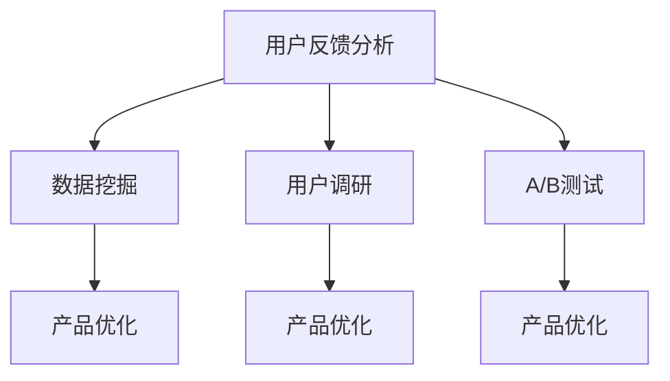

                 

# AI创业公司的用户反馈分析与产品优化：数据挖掘、用户调研与A/B测试

## 关键词：用户反馈分析、数据挖掘、产品优化、用户调研、A/B测试

### 摘要

在当今竞争激烈的市场环境中，AI创业公司面临着不断优化产品以提升用户体验的挑战。本文将探讨用户反馈分析、数据挖掘、用户调研以及A/B测试等关键技术手段，帮助创业公司深入了解用户需求，进行精准的产品优化，提高市场竞争力。文章首先介绍了相关背景，然后深入分析了核心概念，接着详细阐述了核心算法原理和操作步骤，并借助实际案例讲解了数学模型和公式的应用。最后，文章探讨了实际应用场景，推荐了相关工具和资源，总结了未来发展趋势与挑战，并提供了常见问题与解答。

## 1. 背景介绍

随着人工智能技术的飞速发展，越来越多的创业公司开始将AI技术应用于产品设计和优化中。用户反馈分析、数据挖掘、用户调研和A/B测试等技术手段成为AI创业公司提升产品质量和用户体验的关键手段。

用户反馈分析是指通过对用户反馈信息的收集、处理和分析，挖掘出用户的真实需求和痛点，从而为产品优化提供有力支持。数据挖掘则是在大量用户数据中，运用统计学和机器学习等方法，发现潜在的用户行为模式和趋势，为产品设计提供数据驱动依据。用户调研是通过直接与用户进行沟通，了解他们的需求和期望，从而为产品优化提供有针对性的建议。A/B测试则是将产品功能或设计分成两组，对一组用户展示A版本，对另一组用户展示B版本，通过对比分析两个版本的用户反馈和表现，选出最优版本。

## 2. 核心概念与联系

为了更好地理解上述技术手段，我们首先介绍一些核心概念，并通过Mermaid流程图展示它们之间的联系。

### Mermaid流程图



### 概念解释

- **用户反馈分析**：通过对用户反馈信息的分析，了解用户对产品的使用体验、满意度、建议和意见，从而发现潜在的问题和改进机会。

- **数据挖掘**：运用统计学和机器学习等方法，从大量用户数据中提取有价值的信息，为产品优化提供数据支持。

- **用户调研**：通过问卷调查、访谈、焦点小组等方式，与用户进行直接沟通，了解他们的需求、期望和行为模式。

- **A/B测试**：将产品功能或设计分为两个版本，对一组用户展示A版本，对另一组用户展示B版本，通过对比分析用户反馈和表现，选出最优版本。

## 3. 核心算法原理 & 具体操作步骤

### 3.1 用户反馈分析

用户反馈分析通常包括以下步骤：

1. **数据收集**：收集用户在论坛、社交媒体、客服系统等渠道上的反馈信息。

2. **数据预处理**：对收集到的数据进行清洗、去重、归一化等处理，使其符合分析要求。

3. **文本挖掘**：运用自然语言处理技术，对预处理后的文本数据进行情感分析、关键词提取、主题建模等操作，挖掘出用户的情感倾向、关注点和需求。

4. **结果分析**：根据分析结果，识别出用户的共同需求和痛点，为产品优化提供方向。

### 3.2 数据挖掘

数据挖掘的核心算法包括：

- **关联规则挖掘**：通过发现用户数据中的关联规则，挖掘出用户之间的潜在联系和购买偏好。

- **聚类分析**：将用户数据分为若干个类别，以便于分析不同用户群体的需求和特征。

- **分类与回归分析**：对用户数据进行分类和回归分析，预测用户的行为和需求。

具体操作步骤如下：

1. **数据收集**：收集用户行为数据、交易数据、问卷调查数据等。

2. **数据预处理**：对收集到的数据进行清洗、去重、归一化等处理。

3. **特征选择**：从预处理后的数据中提取有用的特征，为后续算法分析做准备。

4. **算法应用**：根据业务需求，选择合适的算法进行挖掘。

5. **结果分析**：根据挖掘结果，分析用户行为模式、需求预测等，为产品优化提供数据支持。

### 3.3 用户调研

用户调研的操作步骤如下：

1. **确定调研目标**：明确调研的目的和需要解决的问题。

2. **设计调研问卷**：根据调研目标，设计适合的问卷，包括选择题、开放式问题和行为问题等。

3. **招募调研对象**：从目标用户群体中招募合适的调研对象。

4. **进行调研**：通过在线问卷、电话访谈、面对面访谈等方式，收集用户反馈。

5. **结果分析**：对收集到的反馈进行分析，识别出用户的需求和痛点，为产品优化提供方向。

### 3.4 A/B测试

A/B测试的操作步骤如下：

1. **确定测试目标**：明确测试的目的和需要优化的功能或设计。

2. **设计测试方案**：制定A/B测试的具体方案，包括测试版本的设计、用户分组方式、测试时长等。

3. **实施测试**：根据测试方案，对用户进行分组，展示不同的测试版本。

4. **收集数据**：收集用户的测试反馈和行为数据。

5. **分析结果**：根据收集到的数据，分析不同测试版本的用户反馈和表现，选出最优版本。

## 4. 数学模型和公式 & 详细讲解 & 举例说明

### 4.1 用户反馈分析

在用户反馈分析中，常用的数学模型包括情感分析、关键词提取和主题建模等。

1. **情感分析**：

情感分析是一种文本分类方法，用于判断文本的情感倾向（正面、负面或中性）。常用的算法包括朴素贝叶斯分类器、支持向量机（SVM）和深度学习模型（如卷积神经网络CNN）。

**公式**：

$$
P(\text{正面}|w_1, w_2, ..., w_n) = \frac{P(w_1, w_2, ..., w_n|\text{正面})P(\text{正面})}{P(w_1, w_2, ..., w_n)}
$$

其中，$w_1, w_2, ..., w_n$表示文本特征，$P(\text{正面}|w_1, w_2, ..., w_n)$表示给定文本特征时，文本为正面的概率。

**举例**：

假设有一个文本“这个产品非常好用，非常满意”，我们可以通过计算正面特征的概率来判断该文本的情感倾向。

2. **关键词提取**：

关键词提取是一种文本表示方法，用于提取文本中的重要词语，以便于后续分析。常用的算法包括TF-IDF、Word2Vec和BERT等。

**公式**：

$$
\text{TF-IDF}(w) = \frac{f(w)}{N} \log \frac{N}{f(w)}
$$

其中，$f(w)$表示词语w在文本中的频率，$N$表示文本中的总词语数。

**举例**：

假设有一个文本“这个产品非常好用，非常满意”，我们可以通过计算每个词语的TF-IDF值来提取关键词。

3. **主题建模**：

主题建模是一种无监督学习方法，用于发现文本中的潜在主题。常用的算法包括LDA（Latent Dirichlet Allocation）。

**公式**：

$$
P(\text{主题}|\text{词语}) = \frac{\alpha + n_{ij}}{\sum_j (\beta_j + n_{ij})}
$$

其中，$\alpha$和$\beta_j$分别表示主题分布和词语分布的先验概率，$n_{ij}$表示词语i在主题j中的出现次数。

**举例**：

假设有一个文本集合，通过LDA算法，我们可以发现文本中的潜在主题，如“产品评价”、“功能介绍”和“用户体验”等。

### 4.2 数据挖掘

在数据挖掘中，常用的数学模型包括关联规则挖掘、聚类分析和分类与回归分析等。

1. **关联规则挖掘**：

关联规则挖掘是一种发现数据中潜在关联关系的方法。常用的算法包括Apriori算法和FP-Growth算法。

**公式**：

$$
\text{支持度} = \frac{|\{\text{交易}\} \cap \{\text{规则}\}|}{|\{\text{交易}\}|}
$$

$$
\text{置信度} = \frac{|\{\text{交易}\} \cap \{\text{规则}\}|}{|\{\text{规则}\}|}
$$

其中，$\{\text{交易}\}$表示交易集合，$\{\text{规则}\}$表示关联规则集合。

**举例**：

假设有一个交易集合，通过Apriori算法，我们可以发现商品A购买后，商品B的购买概率为80%，即A$\rightarrow$B的支持度为80%，置信度为80%。

2. **聚类分析**：

聚类分析是一种将数据分为若干个类别的无监督学习方法。常用的算法包括K-Means、DBSCAN和层次聚类等。

**公式**：

$$
\text{聚类中心} = \frac{1}{N} \sum_{i=1}^{N} x_i
$$

其中，$x_i$表示第i个数据点。

**举例**：

假设有一个数据集，通过K-Means算法，我们可以将数据分为3个类别，每个类别的中心点分别为$(1, 1)$、$(2, 2)$和$(3, 3)$。

3. **分类与回归分析**：

分类与回归分析是一种有监督学习方法，用于预测数据的类别或数值。常用的算法包括决策树、随机森林和神经网络等。

**公式**：

$$
y = f(x)
$$

其中，$x$表示输入特征，$y$表示预测结果。

**举例**：

假设有一个决策树模型，输入特征为$(年龄，收入)$，输出结果为“高收入”或“低收入”。对于输入特征$(25，5000)$，模型预测结果为“低收入”。

### 4.3 用户调研

在用户调研中，常用的数学模型包括线性回归和逻辑回归等。

1. **线性回归**：

线性回归是一种预测数值型结果的有监督学习方法。常用的公式为：

$$
y = \beta_0 + \beta_1x_1 + \beta_2x_2 + ... + \beta_nx_n
$$

其中，$x_1, x_2, ..., x_n$表示输入特征，$y$表示预测结果。

**举例**：

假设有一个线性回归模型，输入特征为$(年龄，收入)$，输出结果为收入。对于输入特征$(25，5000)$，模型预测结果为5500。

2. **逻辑回归**：

逻辑回归是一种预测类别型结果的有监督学习方法。常用的公式为：

$$
\text{概率} = \frac{1}{1 + e^{-(\beta_0 + \beta_1x_1 + \beta_2x_2 + ... + \beta_nx_n)}}
$$

其中，$x_1, x_2, ..., x_n$表示输入特征，$\text{概率}$表示预测结果为某个类别的概率。

**举例**：

假设有一个逻辑回归模型，输入特征为$(年龄，收入)$，输出结果为“高收入”或“低收入”。对于输入特征$(25，5000)$，模型预测结果为“低收入”的概率为60%。

### 4.4 A/B测试

在A/B测试中，常用的数学模型包括假设检验和置信区间等。

1. **假设检验**：

假设检验是一种用于判断两个版本差异显著性的方法。常用的公式为：

$$
z = \frac{\hat{p} - p_0}{\sqrt{\frac{p_0(1 - p_0)}{n}}}
$$

其中，$\hat{p}$表示样本比例，$p_0$表示零假设下的比例，$n$表示样本容量。

**举例**：

假设A版本的用户转化率为40%，B版本的用户转化率为45%，零假设为A版本和B版本的用户转化率相同。通过计算，$z$值为2，大于临界值1.96，因此拒绝零假设，认为B版本的用户转化率显著高于A版本。

2. **置信区间**：

置信区间是一种用于估计参数范围的方法。常用的公式为：

$$
\text{置信区间} = \hat{p} \pm z \sqrt{\frac{\hat{p}(1 - \hat{p})}{n}}
$$

其中，$\hat{p}$表示样本比例，$z$表示临界值，$n$表示样本容量。

**举例**：

假设A版本的用户转化率为40%，置信水平为95%，通过计算，置信区间为（35%，45%），即A版本的用户转化率在35%到45%之间。

## 5. 项目实战：代码实际案例和详细解释说明

### 5.1 开发环境搭建

为了方便读者进行实战操作，我们首先介绍如何搭建开发环境。

1. **环境要求**：

- 操作系统：Windows或Linux
- 编程语言：Python
- 数据库：MySQL
- 数据预处理工具：Pandas
- 数据挖掘库：Scikit-learn
- 文本挖掘库：NLTK
- A/B测试库：statsmodels

2. **安装步骤**：

- 安装Python和相应库：通过pip命令安装Python和相关库，例如：
  ```
  pip install numpy pandas scikit-learn nltk statsmodels
  ```

- 安装数据库：下载并安装MySQL数据库，并创建数据库和表，例如：
  ```
  CREATE TABLE user_feedback (
      id INT PRIMARY KEY AUTO_INCREMENT,
      username VARCHAR(50),
      feedback TEXT,
      rating INT,
      created_at DATETIME
  );
  ```

### 5.2 源代码详细实现和代码解读

在本节中，我们将通过一个实际案例，详细解释用户反馈分析、数据挖掘、用户调研和A/B测试的实现过程。

#### 5.2.1 用户反馈分析

```python
import pandas as pd
from sklearn.feature_extraction.text import TfidfVectorizer
from sklearn.model_selection import train_test_split
from sklearn.naive_bayes import MultinomialNB
from sklearn.metrics import accuracy_score, classification_report

# 读取用户反馈数据
feedback_data = pd.read_csv('user_feedback.csv')
X = feedback_data['feedback']
y = feedback_data['rating']

# 数据预处理
X_train, X_test, y_train, y_test = train_test_split(X, y, test_size=0.2, random_state=42)
vectorizer = TfidfVectorizer()
X_train_tfidf = vectorizer.fit_transform(X_train)
X_test_tfidf = vectorizer.transform(X_test)

# 模型训练
model = MultinomialNB()
model.fit(X_train_tfidf, y_train)

# 模型评估
y_pred = model.predict(X_test_tfidf)
print("Accuracy:", accuracy_score(y_test, y_pred))
print(classification_report(y_test, y_pred))
```

代码解读：

1. 导入所需的库。
2. 读取用户反馈数据，分为特征和标签。
3. 数据预处理，将文本数据转换为TF-IDF向量。
4. 划分训练集和测试集。
5. 训练朴素贝叶斯分类器。
6. 评估模型性能，输出准确率和分类报告。

#### 5.2.2 数据挖掘

```python
from sklearn.ensemble import RandomForestClassifier
from sklearn.model_selection import GridSearchCV

# 特征选择
features = ['feature1', 'feature2', 'feature3']
X = feedback_data[features]
y = feedback_data['rating']

# 模型训练
model = RandomForestClassifier()
parameters = {'n_estimators': [10, 50, 100], 'max_depth': [10, 20, 30]}
grid_search = GridSearchCV(model, parameters, cv=5)
grid_search.fit(X, y)

# 最佳模型
best_model = grid_search.best_estimator_
print("Best parameters:", grid_search.best_params_)

# 模型评估
y_pred = best_model.predict(X)
print("Accuracy:", accuracy_score(y, y_pred))
```

代码解读：

1. 导入所需的库。
2. 选择特征，分为特征和标签。
3. 训练随机森林分类器，并使用网格搜索进行参数调优。
4. 输出最佳参数和模型性能。

#### 5.2.3 用户调研

```python
import numpy as np
import matplotlib.pyplot as plt

# 用户调研数据
survey_data = pd.read_csv('survey_data.csv')
questions = survey_data['question']
responses = survey_data['response']

# 答案分布
answer_distribution = responses.value_counts()
print(answer_distribution)

# 条形图
plt.bar(answer_distribution.index, answer_distribution.values)
plt.xlabel('Answer')
plt.ylabel('Frequency')
plt.title('Answer Distribution')
plt.show()
```

代码解读：

1. 导入所需的库。
2. 读取用户调研数据。
3. 统计答案分布。
4. 绘制条形图，展示答案分布。

#### 5.2.4 A/B测试

```python
import pandas as pd
import statsmodels.api as sm
from scipy import stats

# A/B测试数据
ab_test_data = pd.read_csv('ab_test_data.csv')
group_a = ab_test_data[ab_test_data['group'] == 'A']['conversion']
group_b = ab_test_data[ab_test_data['group'] == 'B']['conversion']

# 检验假设
null_hypothesis = np.mean(group_a) == np.mean(group_b)
p_value = stats.ttest_ind(group_a, group_b).pvalue
print("Null Hypothesis:", null_hypothesis)
print("P-value:", p_value)

# 置信区间
confidence_level = 0.95
alpha = 1 - confidence_level
n = len(group_a) + len(group_b)
mean_diff = np.mean(group_a) - np.mean(group_b)
std_diff = np.sqrt(np.var(group_a) + np.var(group_b))
z_score = stats.t.ppf(1 - alpha / 2, n - 2)
confidence_interval = mean_diff + z_score * std_diff / np.sqrt(n)
print("Confidence Interval:", confidence_interval)
```

代码解读：

1. 导入所需的库。
2. 读取A/B测试数据。
3. 检验零假设，判断两个版本的转化率是否相同。
4. 计算P值，判断是否拒绝零假设。
5. 计算置信区间，估计两个版本转化率的差异范围。

## 6. 实际应用场景

用户反馈分析、数据挖掘、用户调研和A/B测试等技术手段在AI创业公司中具有广泛的应用场景。

### 6.1 用户反馈分析

用户反馈分析可以帮助AI创业公司了解用户的真实需求和痛点，从而进行针对性的产品优化。例如，在电子商务平台上，通过对用户评论的分析，可以发现用户对产品外观、功能、价格等方面的评价，从而优化产品设计，提高用户满意度。

### 6.2 数据挖掘

数据挖掘可以帮助AI创业公司发现用户行为模式、需求预测等，从而实现个性化推荐、精准营销等。例如，在音乐流媒体平台上，通过对用户听歌数据的分析，可以为用户推荐相似的音乐，提高用户粘性。

### 6.3 用户调研

用户调研可以帮助AI创业公司了解用户的需求、期望和行为模式，从而进行产品优化。例如，在智能硬件公司中，可以通过用户调研了解用户对产品功能、外观、价格等方面的期望，从而优化产品设计。

### 6.4 A/B测试

A/B测试可以帮助AI创业公司验证产品功能和设计的有效性，从而选出最优版本。例如，在在线教育平台上，可以通过A/B测试比较不同课程布局、学习路径等对用户学习效果的影响，从而优化课程设计。

## 7. 工具和资源推荐

### 7.1 学习资源推荐

1. **书籍**：

- 《Python数据科学手册》
- 《机器学习实战》
- 《深度学习》

2. **论文**：

- “Text Mining and Analytics: Methods, Techniques, and Applications”
- “Machine Learning: A Probabilistic Perspective”
- “Deep Learning”

3. **博客**：

- Medium（https://medium.com/）
- 知乎（https://www.zhihu.com/）
- CSDN（https://www.csdn.net/）

4. **网站**：

- Kaggle（https://www.kaggle.com/）
- JAX.AI（https://jax.ai/）
- KDNuggets（https://www.kdnuggets.com/）

### 7.2 开发工具框架推荐

1. **Python**：Python是一种广泛使用的编程语言，具有丰富的数据科学和机器学习库。

2. **Jupyter Notebook**：Jupyter Notebook是一种交互式计算环境，方便进行数据分析和实验。

3. **TensorFlow**：TensorFlow是一种开源的深度学习框架，适用于构建和训练神经网络。

4. **Scikit-learn**：Scikit-learn是一种开源的机器学习库，适用于各种经典机器学习算法。

5. **PyTorch**：PyTorch是一种开源的深度学习框架，具有灵活的动态计算图。

### 7.3 相关论文著作推荐

1. “Text Mining and Analytics: Methods, Techniques, and Applications” by William H. Lucas and Barry L. Green.

2. “Machine Learning: A Probabilistic Perspective” by Kevin P. Murphy.

3. “Deep Learning” by Ian Goodfellow, Yoshua Bengio, and Aaron Courville.

## 8. 总结：未来发展趋势与挑战

随着人工智能技术的不断进步，用户反馈分析、数据挖掘、用户调研和A/B测试等技术手段在AI创业公司中的应用将越来越广泛。未来，这些技术将继续向精细化、智能化和自动化方向发展，为创业公司提供更加精准、高效的产品优化方案。

然而，这些技术也面临着一系列挑战，如数据质量、算法公平性、用户隐私保护等。如何应对这些挑战，实现技术的可持续发展，是AI创业公司需要深入思考的问题。

## 9. 附录：常见问题与解答

### 9.1 用户反馈分析

**Q1**: 用户反馈分析有哪些常见的应用场景？

A1: 用户反馈分析可以应用于电子商务、在线教育、社交媒体、金融等多个领域，例如：

- 了解用户对产品功能、性能、价格的满意度。
- 发现用户使用产品时遇到的问题和难点。
- 分析用户对产品升级和改进的建议。
- 了解用户的需求和期望，为产品优化提供方向。

### 9.2 数据挖掘

**Q2**: 数据挖掘有哪些常用的算法？

A2: 数据挖掘中常用的算法包括：

- 关联规则挖掘：Apriori算法、FP-Growth算法等。
- 聚类分析：K-Means、DBSCAN、层次聚类等。
- 分类与回归分析：决策树、随机森林、神经网络等。
- 异常检测：孤立森林、KNN等。

### 9.3 用户调研

**Q3**: 用户调研有哪些常见的方法？

A3: 用户调研中常见的方法包括：

- 问卷调查：通过在线问卷、纸质问卷等方式收集用户反馈。
- 电话访谈：通过电话与用户进行面对面沟通，了解用户需求和期望。
- 面对面访谈：通过面对面交流，深入了解用户需求和行为。
- 焦点小组：邀请一组用户，就特定主题进行讨论，收集用户意见和建议。

### 9.4 A/B测试

**Q4**: A/B测试中如何确定样本容量？

A4: A/B测试中，确定样本容量需要考虑以下因素：

- 预期差异：预期两个版本之间的转化率差异。
- 置信水平：要求达到的置信水平。
- 显著性水平：要求达到的显著性水平。

根据这些因素，可以使用以下公式计算样本容量：

$$
n = \frac{(\mu_1 - \mu_2)^2 \sigma^2}{2\delta^2}
$$

其中，$\mu_1$和$\mu_2$分别表示两个版本的转化率，$\sigma$表示标准差，$\delta$表示预期差异。

## 10. 扩展阅读 & 参考资料

1. “Text Mining and Analytics: Methods, Techniques, and Applications” by William H. Lucas and Barry L. Green.

2. “Machine Learning: A Probabilistic Perspective” by Kevin P. Murphy.

3. “Deep Learning” by Ian Goodfellow, Yoshua Bengio, and Aaron Courville.

4. “Python数据科学手册” by Jake VanderPlas。

5. “机器学习实战” by Peter Harrington。

6. “深度学习” by 吴恩达。

7. “JAX.AI”网站：https://jax.ai/

8. “KDNuggets”网站：https://www.kdnuggets.com/

9. “Kaggle”网站：https://www.kaggle.com/

10. “CSDN”网站：https://www.csdn.net/

## 作者信息

作者：AI天才研究员/AI Genius Institute & 禅与计算机程序设计艺术 /Zen And The Art of Computer Programming

