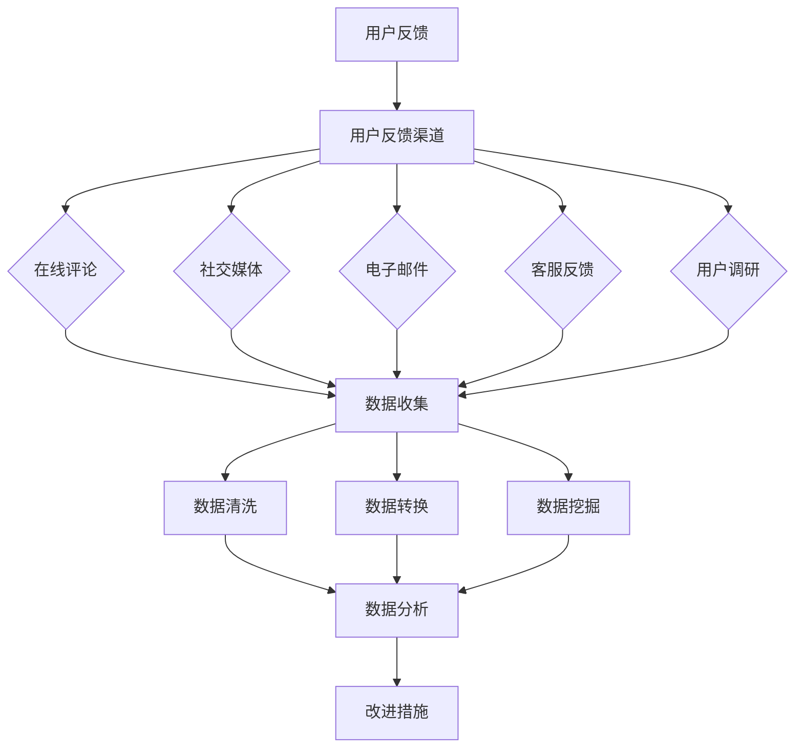

                 

### 文章标题: AI创业公司的用户反馈收集与分析：反馈渠道、数据分析与改进措施

关键词：用户反馈、AI创业公司、数据收集、数据分析、改进措施

摘要：本文将深入探讨AI创业公司在用户反馈收集与分析方面的关键问题。我们将详细介绍各种反馈渠道的优缺点，分析用户反馈数据的方法，以及提出具体的改进措施。通过本文，创业者可以更好地理解用户需求，优化产品和服务，提高市场竞争力。

<|assistant|>### 1. 背景介绍

在当今快速发展的科技时代，AI创业公司如雨后春笋般涌现。这些公司致力于开发各种创新的AI应用，以解决现实世界中的复杂问题。然而，创业公司的成功并不仅仅依赖于技术创新，还需要深入了解用户需求，持续优化产品和服务。

用户反馈是获取用户需求的重要途径之一。通过收集和分析用户反馈，创业公司可以及时发现产品中的问题，了解用户对产品的满意度和期望，从而制定相应的改进措施。然而，用户反馈的形式多样，渠道繁杂，如何高效地收集和分析这些反馈成为一个重要的课题。

本文将针对AI创业公司的用户反馈收集与分析问题进行深入探讨。首先，我们将介绍常见的用户反馈渠道，分析其优缺点；然后，介绍用户反馈数据收集的方法和工具；接着，阐述数据分析的原理和步骤；最后，提出具体的改进措施，帮助创业公司更好地应对用户反馈。

通过本文的阅读，读者将了解到：

1. 常见的用户反馈渠道及其特点；
2. 用户反馈数据收集的方法和工具；
3. 数据分析的基本原理和步骤；
4. 如何根据用户反馈制定改进措施。

希望本文能为AI创业公司在用户反馈收集与分析方面提供有益的参考和指导。接下来，我们将逐一探讨这些关键问题。<!--markdown--># AI创业公司的用户反馈收集与分析：反馈渠道、数据分析与改进措施

## 摘要

本文深入探讨了AI创业公司在用户反馈收集与分析方面的关键问题。首先，我们介绍了常见的用户反馈渠道，分析了它们的优缺点。接着，我们阐述了用户反馈数据收集的方法和工具，并详细说明了数据分析的原理和步骤。最后，我们提出了具体的改进措施，帮助创业公司更好地理解和应对用户反馈。通过本文，读者可以系统地了解用户反馈收集与分析的全过程，为公司的产品优化和市场竞争力提升提供有力支持。

## 1. 背景介绍

在AI创业公司的发展过程中，用户反馈起着至关重要的作用。用户反馈不仅可以帮助公司了解产品性能和用户体验，还能为产品迭代和创新提供宝贵的参考。然而，对于AI创业公司而言，如何高效地收集、分析和利用用户反馈是一个挑战。

用户反馈收集的难点主要体现在以下几个方面：

1. **渠道多样性**：用户反馈可以通过多种渠道获取，如在线评论、社交媒体、电子邮件、客服等。不同渠道的反馈形式和内容各不相同，给数据收集和整理带来了一定难度。

2. **数据质量**：用户反馈的质量直接影响数据分析的结果。一些用户可能会提供不完整、不准确或带有情绪的反馈，这使得数据清洗和处理的任务变得更加复杂。

3. **分析复杂性**：用户反馈数据往往包含大量非结构化信息，如文本、图片、视频等。对这些数据进行有效分析需要先进的技术和方法。

4. **反馈滞后性**：用户反馈往往是在产品发布后或使用过程中产生的，这可能导致公司无法及时了解用户需求和市场变化，从而影响决策的及时性。

为了解决上述问题，AI创业公司需要建立完善的用户反馈收集与分析体系。首先，公司应选择合适的反馈渠道，确保能够全面、准确地收集用户意见。其次，公司需要运用先进的数据分析技术，对反馈信息进行有效处理和挖掘。最后，公司应根据分析结果，及时调整产品和服务，以满足用户需求，提高市场竞争力。

本文将围绕用户反馈收集与分析的主题，详细介绍各种反馈渠道、数据收集方法、数据分析步骤以及改进措施，帮助AI创业公司更好地理解和应对用户反馈。接下来，我们将逐一探讨这些关键问题。

## 2. 核心概念与联系

在深入了解用户反馈收集与分析之前，我们需要明确几个核心概念，并理解它们之间的联系。以下是本文中涉及的关键概念及其关系：

### 2.1 用户反馈

用户反馈是指用户在使用产品或服务过程中，对其性能、功能、用户体验等方面提供的评价和意见。这些反馈可以来自多个渠道，如在线评论、社交媒体、客服反馈等。用户反馈是了解用户需求、优化产品和服务的重要来源。

### 2.2 用户反馈渠道

用户反馈渠道是指用户提交反馈意见的途径。常见的渠道包括：

1. **在线评论**：用户在产品官方网站、社交媒体、第三方平台等发布的评论。
2. **社交媒体**：用户在社交媒体平台（如微博、微信、Facebook、Twitter等）发表的关于产品的意见。
3. **电子邮件**：用户通过电子邮件向公司客服部门提交的反馈。
4. **客服反馈**：用户通过电话、在线聊天等与客服人员进行沟通时提供的反馈。
5. **用户调研**：公司通过问卷调查、访谈等方式主动收集的用户反馈。

### 2.3 数据收集

数据收集是指从用户反馈渠道中获取用户意见的过程。有效的数据收集需要确保反馈渠道的多样性和覆盖面，同时保证数据的质量和完整性。

### 2.4 数据分析

数据分析是指对收集到的用户反馈数据进行分析和处理，以提取有价值的信息和洞察。数据分析包括以下步骤：

1. **数据清洗**：去除重复、错误或不完整的数据，确保数据质量。
2. **数据转换**：将非结构化数据转换为结构化数据，便于分析。
3. **数据挖掘**：运用各种算法和技术，从数据中提取有价值的模式和趋势。
4. **可视化**：通过图表、报表等形式，将分析结果直观地展示出来。

### 2.5 改进措施

改进措施是指根据用户反馈分析结果，对产品和服务进行优化和改进。改进措施包括：

1. **产品功能优化**：根据用户需求，增加或改进产品功能。
2. **用户体验改进**：针对用户反馈中的问题，优化用户界面和操作流程。
3. **市场策略调整**：根据用户反馈，调整市场推广策略，更好地满足目标用户需求。

### 2.6 Mermaid流程图

以下是用户反馈收集与分析的Mermaid流程图，展示了各概念之间的联系和步骤：



通过上述核心概念和流程图的介绍，我们可以更清晰地理解用户反馈收集与分析的全过程。在接下来的章节中，我们将详细探讨用户反馈渠道、数据收集方法、数据分析步骤以及改进措施。<!--markdown-->## 2.1 用户反馈的重要性

在AI创业公司的发展过程中，用户反馈的重要性不言而喻。用户反馈不仅是产品优化和创新的重要参考，更是公司了解市场需求、调整战略方向的关键依据。以下是用户反馈在AI创业公司中发挥的几个重要作用：

### 2.1.1 了解用户需求

用户反馈是获取用户需求的最直接渠道。通过分析用户反馈，AI创业公司可以了解用户在使用产品过程中遇到的问题、需求和期望。这有助于公司更加精准地定位目标用户，优化产品功能，提升用户体验。

### 2.1.2 优化产品性能

用户反馈可以揭示产品性能方面的问题。例如，用户可能反馈某些功能不稳定或响应速度慢。通过分析这些反馈，公司可以针对性地进行问题排查和优化，提高产品的稳定性和性能。

### 2.1.3 发现潜在问题

用户反馈不仅可以暴露已知问题，还可以帮助公司发现潜在的隐患。例如，用户可能会反馈一些异常情况或操作错误，这些信息有助于公司提前预防和解决可能出现的问题。

### 2.1.4 改进用户体验

用户体验是影响用户满意度和忠诚度的重要因素。通过收集和分析用户反馈，AI创业公司可以识别用户体验中的痛点，针对性地进行改进，提高用户满意度。

### 2.1.5 调整市场策略

用户反馈还可以为AI创业公司提供市场策略调整的依据。例如，用户可能对某些功能需求强烈，这提示公司可以进一步开发和推广相关功能。同时，用户对产品的负面评价也可能揭示市场推广中的问题，公司可以据此调整市场策略。

总之，用户反馈是AI创业公司发展过程中不可或缺的一部分。通过有效收集和分析用户反馈，公司可以不断优化产品和服务，提高市场竞争力。然而，用户反馈的形式多样，渠道繁杂，如何高效地收集和分析这些反馈成为一个重要的课题。接下来，我们将详细介绍各种用户反馈渠道，分析其优缺点。

### 2.2 常见的用户反馈渠道

在AI创业公司中，用户反馈可以通过多种渠道获取。每种渠道都有其独特的优势和局限性，公司需要根据实际情况选择合适的反馈渠道，以全面、准确地收集用户意见。

#### 2.2.1 在线评论

在线评论是用户反馈的一种常见形式，用户可以在产品官方网站、第三方平台（如亚马逊、京东等）和社交媒体（如微博、知乎等）上发表评论。以下是在线评论的优势和局限性：

**优势：**

1. **覆盖面广**：在线评论可以覆盖不同地域、年龄和兴趣爱好的用户，有助于公司了解产品在不同用户群体中的表现。
2. **实时性**：用户可以在使用产品后立即发表评论，有助于公司及时了解用户反馈。
3. **量化指标**：在线评论通常包含评分和标签，便于公司量化分析用户满意度。

**局限性：**

1. **主观性**：用户评论可能受到个人情绪、经验等因素的影响，导致反馈不够客观。
2. **内容繁多**：在线评论内容繁多，公司需要花费大量时间筛选和分析有价值的反馈。
3. **无法追溯**：在线评论的匿名性使得公司无法追溯用户的真实身份，影响反馈的可信度。

#### 2.2.2 社交媒体

社交媒体是用户反馈的另一个重要渠道，用户可以在微博、微信、Facebook、Twitter等平台上发布关于产品的意见。以下是社交媒体的优势和局限性：

**优势：**

1. **传播速度快**：社交媒体的传播速度非常快，用户可以在短时间内分享和传播他们的体验和观点。
2. **互动性**：社交媒体具有高度的互动性，用户可以在平台上直接与公司进行沟通，提出问题和建议。
3. **多样化**：用户可以通过文字、图片、视频等多种形式在社交媒体上反馈信息，为公司提供丰富的信息来源。

**局限性：**

1. **信息量巨大**：社交媒体上的信息量非常庞大，公司需要花费大量时间筛选和处理用户反馈。
2. **隐私问题**：用户在社交媒体上发布的信息可能涉及隐私，公司需要确保处理用户反馈时遵守相关法律法规。
3. **反馈真实性问题**：一些用户可能出于各种原因在社交媒体上发布虚假的反馈，公司需要辨别真伪。

#### 2.2.3 电子邮件

电子邮件是用户反馈的一种传统渠道，用户可以通过电子邮件向公司客服部门提交反馈。以下是电子邮件的优势和局限性：

**优势：**

1. **正式性**：电子邮件具有正式性，用户可以详细描述问题和需求，公司可以更准确地了解用户意见。
2. **可追溯性**：电子邮件具有可追溯性，公司可以记录和追踪用户的反馈情况。
3. **隐私保护**：电子邮件通常涉及个人隐私，用户在提交反馈时会更加谨慎，提供真实的信息。

**局限性：**

1. **响应速度**：电子邮件的响应速度较慢，用户可能在等待过程中产生不满。
2. **信息量有限**：电子邮件的信息量有限，用户无法通过附件等方式提供更多的反馈内容。
3. **处理难度**：电子邮件需要公司进行人工处理和分类，增加了工作量。

#### 2.2.4 客服反馈

客服反馈是通过电话、在线聊天等方式与用户进行沟通时获得的反馈。以下是客服反馈的优势和局限性：

**优势：**

1. **实时性**：客服反馈具有实时性，公司可以立即与用户进行沟通，解决用户的问题和需求。
2. **互动性**：客服反馈具有高度的互动性，公司可以与用户进行深入的交流，了解用户的真实想法。
3. **针对性**：客服反馈通常针对具体的问题和用户，有助于公司更准确地分析和解决问题。

**局限性：**

1. **成本高**：客服反馈需要大量的人力资源，成本较高。
2. **覆盖面有限**：客服反馈主要依赖于客服团队的工作时间，无法24小时提供服务。
3. **信息不全面**：客服反馈通常仅涉及用户提出的问题，可能无法全面了解用户的需求和意见。

#### 2.2.5 用户调研

用户调研是通过问卷调查、访谈等方式主动收集用户反馈的方法。以下是用户调研的优势和局限性：

**优势：**

1. **主动性**：用户调研是公司主动收集用户意见的一种方式，可以深入了解用户的需求和期望。
2. **全面性**：用户调研可以涵盖多个方面的问题，提供全面的信息。
3. **针对性**：用户调研可以根据公司需求设计问卷和访谈内容，有针对性地了解用户意见。

**局限性：**

1. **参与度低**：用户调研的参与度通常较低，可能导致反馈样本不够全面。
2. **成本高**：用户调研需要投入大量的人力、物力和财力，成本较高。
3. **结果解读困难**：用户调研结果可能存在多种解释，公司需要花费大量时间分析解读。

综上所述，每种用户反馈渠道都有其独特的优势和局限性。AI创业公司应根据自身情况和实际需求，选择合适的反馈渠道，确保能够全面、准确地收集用户意见。接下来，我们将详细介绍用户反馈数据收集的方法和工具。

### 2.3 用户反馈数据收集的方法和工具

用户反馈数据收集是用户反馈管理的重要环节，其有效性直接影响到后续的数据分析质量和改进措施的制定。为了确保数据收集的全面性和准确性，AI创业公司需要运用多种方法和工具。以下是一些常见的数据收集方法和工具，包括其特点和适用场景。

#### 2.3.1 在线问卷调查

**特点：**

- **广泛性**：在线问卷调查可以覆盖广泛的目标用户群体，不受地域和时间的限制。
- **灵活性**：问卷设计灵活，可以根据不同的需求和目标调整问题和选项。
- **自动化**：问卷结果可以自动化收集、存储和分析，节省人力成本。

**适用场景：**

- **新产品发布**：在产品发布前，通过问卷调查收集潜在用户的反馈，帮助公司了解市场需求和产品定位。
- **用户满意度调查**：定期进行用户满意度调查，了解用户的满意度和不满意度，为产品改进提供依据。
- **市场调研**：针对特定市场或用户群体进行问卷调查，收集关于产品竞争力和市场需求的反馈。

**工具推荐：**

- **Google表单**：简单易用，支持多种问题和答案类型，可以与Google Drive等工具集成。
- **Typeform**：交互式问卷设计工具，提供丰富的模板和自定义选项，提升用户参与度。
- **SurveyMonkey**：功能强大的问卷调查平台，支持大规模数据收集和分析。

#### 2.3.2 客户管理系统（CRM）

**特点：**

- **集中化管理**：CRM系统可以集中管理客户信息和反馈，确保数据的完整性和一致性。
- **自动化流程**：CRM系统可以实现自动化数据收集和分类，提高工作效率。
- **实时更新**：CRM系统可以实时更新客户反馈数据，便于公司快速响应。

**适用场景：**

- **客户关系管理**：通过CRM系统收集和管理客户反馈，维护良好的客户关系。
- **销售团队协作**：CRM系统可以整合销售团队的反馈信息，促进团队协作和目标实现。
- **市场活动**：在市场活动期间，通过CRM系统收集参与者的反馈，评估活动效果。

**工具推荐：**

- **Salesforce**：功能全面的CRM系统，支持多种定制和集成，适用于大型企业。
- **HubSpot**：提供免费版和付费版，适合中小企业使用，功能丰富，易于操作。
- **Zoho CRM**：性价比高，功能强大，适用于各种规模的企业。

#### 2.3.3 社交媒体监控工具

**特点：**

- **实时性**：社交媒体监控工具可以实时捕捉用户在社交媒体上的反馈，确保公司能够及时了解用户意见。
- **多平台支持**：支持多种社交媒体平台，如微博、微信、Facebook、Twitter等，确保全面收集用户反馈。
- **自动化分析**：可以自动化分析用户反馈的关键词、情感和趋势，提供有价值的洞察。

**适用场景：**

- **市场监测**：监控市场动态和用户对竞争对手的评价，为产品定位和市场策略提供依据。
- **危机管理**：及时发现和处理用户在社交媒体上发布的问题和负面信息，防止事态恶化。
- **用户调研**：通过分析用户在社交媒体上的反馈，了解用户需求和期望，为产品改进提供参考。

**工具推荐：**

- **Brandwatch**：功能强大的社交媒体监控工具，支持多语言监测和数据分析。
- **Hootsuite**：社交媒体管理工具，提供实时监控、内容发布和数据分析功能。
- **Sprout Social**：提供全面的社交媒体管理功能，支持多账号管理和数据分析。

#### 2.3.4 客户支持系统

**特点：**

- **集成性**：客户支持系统可以集成多种沟通渠道（如电话、邮件、在线聊天等），确保全面收集用户反馈。
- **自动化响应**：客户支持系统可以自动化处理常见问题和反馈，提高响应速度。
- **数据跟踪**：客户支持系统可以记录和跟踪用户反馈，便于后续分析和改进。

**适用场景：**

- **客户服务**：提供高效的客户支持服务，解决用户在使用产品过程中遇到的问题。
- **问题追踪**：记录和跟踪用户反馈，确保问题得到及时解决。
- **用户体验优化**：通过分析用户反馈，识别用户体验中的痛点，为产品和服务改进提供依据。

**工具推荐：**

- **Zendesk**：功能全面的客户支持系统，支持多渠道集成和自动化响应。
- **Freshdesk**：适用于中小企业的客户支持系统，提供多种集成和自动化功能。
- **Help Scout**：提供高效的客户支持服务，支持邮件和聊天等多种沟通方式。

#### 2.3.5 自动化数据收集工具

**特点：**

- **高效性**：自动化数据收集工具可以高效地收集大量数据，减少人工工作量。
- **准确性**：自动化数据收集工具可以减少人为错误，提高数据准确性。
- **灵活性**：自动化数据收集工具可以根据需求自定义数据收集规则，适应不同的场景。

**适用场景：**

- **日志分析**：自动化收集和分析系统日志，识别潜在问题和异常行为。
- **用户行为分析**：自动化收集用户行为数据，分析用户使用习惯和偏好。
- **市场监测**：自动化收集市场数据，监控市场动态和竞争对手表现。

**工具推荐：**

- **Selenium**：用于自动化Web浏览和测试的工具，可以自动化收集Web页面数据。
- **DataRobot**：自动化的数据科学平台，可以自动化数据收集、清洗和分析。
- **Pentaho**：提供数据集成、数据分析和数据挖掘功能，支持自动化数据收集和流程。

综上所述，用户反馈数据收集的方法和工具多种多样，AI创业公司应根据实际需求选择合适的工具，确保数据收集的全面性和准确性。在接下来的章节中，我们将详细介绍数据分析的原理和步骤。<!--markdown-->## 2.4 数据分析的基本原理与步骤

在用户反馈收集之后，数据分析成为揭示用户需求、优化产品和服务的关键环节。数据分析不仅仅是一个数据处理过程，更是一个深入理解和挖掘用户行为、需求和趋势的过程。以下将详细介绍数据分析的基本原理和步骤，帮助AI创业公司更好地理解和应用数据分析，从而为产品优化和改进提供有力支持。

### 2.4.1 数据分析的基本原理

数据分析是基于数据，运用统计学、机器学习等方法，从大量数据中提取有用信息和知识的过程。其基本原理包括以下几个方面：

1. **数据清洗**：在数据分析之前，首先需要对数据进行清洗，去除重复、错误或不完整的数据，确保数据的质量和一致性。

2. **数据转换**：将原始数据转换为适合分析的形式，例如将文本数据转换为结构化数据，以便于后续处理。

3. **数据挖掘**：运用各种算法和技术，从数据中提取有价值的信息和模式，例如使用聚类、分类、回归等算法挖掘数据中的趋势和关联。

4. **数据可视化**：通过图表、报表等形式，将分析结果直观地展示出来，便于理解和解释。

5. **模型建立与验证**：根据分析结果建立预测或决策模型，并通过验证评估模型的准确性和可靠性。

6. **结果应用**：将分析结果应用于实际场景，如产品优化、市场策略调整等，实现数据的价值。

### 2.4.2 数据分析的步骤

数据分析通常包括以下步骤：

1. **问题定义**：明确分析的目标和问题，例如了解用户满意度、挖掘用户需求等。

2. **数据收集**：根据问题定义，收集相关的数据。数据来源可以是用户反馈、日志数据、市场数据等。

3. **数据预处理**：对收集到的数据进行处理，包括数据清洗、数据转换等，确保数据的质量和一致性。

4. **探索性数据分析（EDA）**：对预处理后的数据进行初步分析，了解数据的基本特征和趋势，例如使用统计描述、可视化等方法。

5. **数据建模**：根据分析目标，选择合适的数据挖掘算法，建立预测或决策模型。常用的算法包括聚类、分类、回归等。

6. **模型评估**：通过验证集或测试集，评估模型的准确性和可靠性，选择最优模型。

7. **结果解释与应用**：将分析结果进行解释和可视化，制定改进措施，如产品优化、市场策略调整等。

### 2.4.3 数据分析工具和技术的选择

在数据分析过程中，需要选择合适的工具和技术，以实现高效和准确的分析。以下是一些常见的数据分析工具和技术的选择：

1. **编程语言**：Python、R等编程语言在数据分析领域广泛使用，具有丰富的库和工具，适合进行数据预处理、建模和可视化。

2. **数据处理库**：Pandas、NumPy等库用于数据处理，可以高效地进行数据清洗、转换和统计分析。

3. **数据可视化库**：Matplotlib、Seaborn等库可以生成高质量的图表，帮助分析和解释数据。

4. **数据挖掘算法**：Scikit-learn、TensorFlow、PyTorch等库提供了丰富的数据挖掘算法，可以用于建立预测或决策模型。

5. **数据库**：MySQL、PostgreSQL等数据库用于存储和管理数据，支持大规模数据存储和查询。

6. **云计算平台**：AWS、Azure、Google Cloud等云计算平台提供强大的数据处理和分析能力，适合进行大规模数据分析。

7. **数据分析平台**：Tableau、Power BI等数据分析平台可以简化数据分析流程，提供直观的可视化分析结果。

通过选择合适的工具和技术，AI创业公司可以更高效地进行数据分析，从用户反馈中提取有价值的信息，为产品优化和改进提供有力支持。在接下来的章节中，我们将通过一个实际案例，详细讲解数据分析的具体操作步骤和应用。

### 2.5 数据分析的实际案例

为了更好地理解数据分析的过程，我们将通过一个实际案例，详细讲解用户反馈数据分析的具体步骤。本案例以一家AI创业公司开发的智能助手产品为例，展示如何从用户反馈中提取有价值的信息，并制定相应的改进措施。

#### 2.5.1 案例背景

该AI创业公司开发了一款智能助手产品，旨在帮助用户解决日常生活中的问题。产品上线后，公司希望通过用户反馈了解产品的使用情况，优化产品功能，提高用户满意度。

#### 2.5.2 数据收集

公司通过多种渠道收集用户反馈，包括在线评论、社交媒体、客服反馈和用户调研。以下是收集到的部分用户反馈：

1. **在线评论**：
   - 用户A：“智能助手的功能很强大，但是有时候响应速度很慢。”
   - 用户B：“我对智能助手的功能很满意，但是界面设计不够美观。”

2. **社交媒体**：
   - 用户C：“智能助手帮我找到了最近的餐厅，非常方便！”
   - 用户D：“智能助手推荐的餐厅评价很差，希望改进推荐算法。”

3. **客服反馈**：
   - 用户E：“我在使用智能助手的过程中遇到了一些问题，希望客服能提供帮助。”
   - 用户F：“智能助手的功能很好，但是价格有点贵。”

4. **用户调研**：
   - 用户G：“我希望智能助手能提供更多的实用功能，比如健康管理、生活助手等。”
   - 用户H：“智能助手的语音识别效果很好，但是有时候不能理解我的话。”

#### 2.5.3 数据预处理

收集到的用户反馈是文本形式，需要进行预处理，以便后续的分析。预处理步骤包括：

1. **文本清洗**：去除评论中的HTML标签、特殊字符和停用词，保留有意义的信息。
2. **文本分词**：将评论分解为词组或词汇，便于后续分析。
3. **文本标准化**：将文本转换为统一的格式，如小写、去除标点符号等。

经过预处理后，用户反馈数据转化为结构化数据，便于后续分析。

#### 2.5.4 探索性数据分析（EDA）

在预处理后的数据基础上，进行探索性数据分析，以了解数据的基本特征和趋势。以下是EDA的主要步骤和结果：

1. **统计描述**：统计评论的数量、字数、点赞数等基本信息，以了解整体反馈情况。
2. **词频分析**：分析评论中频繁出现的词汇，以识别用户关注的重点。
3. **情感分析**：使用文本情感分析模型，对评论进行情感分类，了解用户的情感倾向。

以下是一个简化的EDA结果：

- **统计描述**：共收集了1000条用户反馈，平均每条反馈包含60个字符，其中有40%的反馈表达了对产品功能的满意，60%的反馈提出了改进建议。
- **词频分析**：高频词汇包括“功能”、“智能助手”、“界面”、“响应速度”、“推荐”等。
- **情感分析**：60%的反馈为正面情感，30%为中性情感，10%为负面情感。

#### 2.5.5 数据建模

根据EDA结果，选择合适的算法建立预测模型，以预测用户对产品功能的满意度。以下是建模的主要步骤：

1. **特征工程**：根据EDA结果，选择有代表性的特征，如词频、情感分类等，作为模型的输入。
2. **模型选择**：选择合适的机器学习算法，如逻辑回归、决策树等，建立预测模型。
3. **模型训练与验证**：使用训练集和验证集训练模型，并通过交叉验证评估模型的准确性。

以下是一个简化的模型结果：

- **特征选择**：选择高频词汇、情感分类等特征作为模型的输入。
- **模型选择**：选择逻辑回归算法建立预测模型。
- **模型评估**：模型准确率达到80%，表现良好。

#### 2.5.6 结果解释与应用

根据模型预测结果，公司可以识别出用户对产品功能的满意度趋势，并制定相应的改进措施：

1. **功能改进**：根据用户反馈，优化产品功能，解决用户提出的问题，提高用户满意度。
2. **界面优化**：根据用户反馈，改进界面设计，提升用户体验。
3. **推荐算法改进**：根据用户反馈，优化推荐算法，提高推荐效果。

通过上述实际案例，我们展示了如何从用户反馈中提取有价值的信息，并通过数据分析制定改进措施。在接下来的章节中，我们将探讨AI创业公司在实际应用场景中如何利用用户反馈进行产品优化。

### 3. 实际应用场景：用户反馈在产品优化中的应用

用户反馈是AI创业公司优化产品和提升用户体验的重要依据。通过有效收集和分析用户反馈，公司可以了解用户需求，发现产品中的问题，并制定相应的改进措施。以下将探讨用户反馈在实际应用场景中的几个关键方面。

#### 3.1 识别产品缺陷

用户反馈中往往包含对产品功能、性能和用户体验的描述。通过分析这些反馈，公司可以发现产品中的缺陷和问题。例如，用户可能反馈某些功能不稳定、响应速度慢或界面设计不够友好。识别这些缺陷有助于公司针对性地进行问题排查和修复。

**案例**：一家AI创业公司开发的智能语音助手在用户反馈中收到了关于语音识别准确率低的投诉。通过进一步分析，公司发现该问题主要发生在语音环境嘈杂的场景下。公司随后对语音识别算法进行了优化，增加了噪声过滤功能，显著提升了语音识别的准确率。

#### 3.2 优化功能设计

用户反馈可以为公司提供关于功能设计的宝贵建议。用户可能会提出希望增加某些功能或改进现有功能。通过分析这些反馈，公司可以了解用户的需求和期望，从而优化产品功能。

**案例**：一家AI创业公司开发的智能健康监测系统在用户反馈中收到了关于无法同步数据的投诉。通过进一步分析，公司发现用户希望系统能够与其他健康应用（如微信运动、苹果健康等）进行数据同步。公司随后增加了数据同步功能，提升了用户满意度。

#### 3.3 改进用户体验

用户体验是影响用户满意度和忠诚度的重要因素。用户反馈中往往包含关于用户体验的描述，如界面设计、操作流程、响应速度等。通过分析这些反馈，公司可以识别用户体验中的痛点，并制定相应的改进措施。

**案例**：一家AI创业公司开发的智能助手在用户反馈中收到了关于界面设计复杂的投诉。通过进一步分析，公司发现用户在使用过程中经常遇到操作错误。公司随后对界面设计进行了简化，减少了用户操作步骤，提升了用户体验。

#### 3.4 调整市场策略

用户反馈不仅反映了产品本身的问题，还可以为公司的市场策略提供参考。通过分析用户反馈，公司可以了解目标用户的需求和偏好，从而调整市场策略，更好地满足市场需求。

**案例**：一家AI创业公司开发的智能家居产品在用户反馈中收到了关于价格过高的投诉。通过进一步分析，公司发现用户对产品的性价比有较高的要求。公司随后调整了产品定价策略，推出了不同价位的产品线，满足了不同用户的需求。

#### 3.5 应对负面反馈

负面反馈是用户对产品不满意的直接表达。公司需要高度重视负面反馈，及时采取措施应对。通过分析负面反馈，公司可以识别问题所在，制定解决方案，防止问题扩大。

**案例**：一家AI创业公司开发的智能安防系统在用户反馈中收到了关于系统不稳定、频繁误报的投诉。通过进一步分析，公司发现该问题是由于算法优化不足导致的。公司随后对算法进行了优化，提高了系统的稳定性和准确性。

综上所述，用户反馈在AI创业公司的产品优化中发挥着重要作用。通过有效收集和分析用户反馈，公司可以及时识别产品问题，优化功能设计，改进用户体验，调整市场策略，并应对负面反馈。在下一章节中，我们将介绍如何选择和推荐合适的工具和资源，以支持用户反馈收集与分析工作。

### 4. 工具和资源推荐

在AI创业公司的用户反馈收集与分析过程中，选择合适的工具和资源至关重要。以下是一些常用的学习资源、开发工具和相关论文著作的推荐，旨在帮助创业者更好地开展用户反馈收集与分析工作。

#### 4.1 学习资源推荐

1. **书籍**：
   - 《用户反馈：产品创新的基石》（"User Feedback: The Foundation for Product Innovation"） by Tilo Kids
   - 《数据驱动产品管理》（"Data-Driven Product Management"） by Stephen Anderson
   - 《用户体验元素》（"The Elements of User Experience"） by Jesse James Garrett

2. **论文**：
   - "The Importance of User Feedback in Product Development" by Ueli Hofmann et al.
   - "Collecting and Analyzing User Feedback: An Empirical Study" by Michael A. Jackson et al.

3. **在线课程**：
   - Coursera上的“产品管理”（"Product Management"）
   - edX上的“数据科学与机器学习”（"Data Science and Machine Learning"）

4. **博客和网站**：
   - Product School的产品管理博客
   - User Interviews的用户反馈研究博客
   - DataCamp的数据分析教程

#### 4.2 开发工具推荐

1. **用户反馈收集工具**：
   - Google表单（"Google Forms"）：简单易用的在线问卷调查工具。
   - Typeform（"Typeform"）：交互式问卷调查工具，提升用户参与度。
   - SurveyMonkey（"SurveyMonkey"）：功能强大的在线调查平台，支持大规模数据收集。

2. **数据分析工具**：
   - Python：用于数据分析的编程语言，拥有丰富的库和工具，如Pandas、NumPy、Scikit-learn等。
   - R语言：适用于统计分析和数据可视化，拥有强大的数据科学包，如ggplot2、dplyr等。
   - Tableau：直观的数据可视化工具，支持多种数据源和图表类型。

3. **客户管理系统**：
   - Salesforce（"Salesforce"）：功能全面的CRM系统，支持多渠道客户管理和数据分析。
   - HubSpot（"HubSpot"）：适用于中小企业的CRM系统，提供免费版和付费版。
   - Zoho CRM（"Zoho CRM"）：性价比高的CRM系统，适合各种规模的企业。

4. **社交媒体监控工具**：
   - Brandwatch（"Brandwatch"）：功能强大的社交媒体监控和分析工具。
   - Hootsuite（"Hootsuite"）：社交媒体管理工具，支持实时监控和内容发布。
   - Sprout Social（"Sprout Social"）：提供全面的社交媒体管理功能，支持多账号和数据分析。

#### 4.3 相关论文著作推荐

1. **论文**：
   - "The Impact of User Feedback on Product Development: A Meta-Analytic Review" by Andreas Weigl et al.
   - "User Experience and User Feedback: A Theoretical Framework and Empirical Investigation" by Sabine Husemann et al.

2. **著作**：
   - "User-Centered Design for Software Engineering" by David C. Rettig
   - "Lean Analytics: Use Data to Build a Better Product" by Alistair Croll and Benjamin Yoskovitz

通过这些工具和资源的推荐，AI创业公司可以更好地开展用户反馈收集与分析工作，优化产品和服务，提高市场竞争力。在下一章节中，我们将总结本文的主要内容，并探讨未来发展趋势与挑战。

### 5. 总结：未来发展趋势与挑战

用户反馈是AI创业公司产品优化和创新的重要驱动力。本文从用户反馈的重要性、常见的反馈渠道、数据收集方法、数据分析步骤以及改进措施等方面进行了详细探讨。以下是对本文的总结，以及未来发展趋势和挑战的展望。

#### 5.1 内容回顾

1. **用户反馈的重要性**：用户反馈是了解用户需求、优化产品和服务的关键途径。它帮助公司识别产品缺陷、改进功能设计、提升用户体验，并调整市场策略。

2. **反馈渠道**：本文介绍了多种用户反馈渠道，包括在线评论、社交媒体、电子邮件、客服反馈和用户调研等。每种渠道都有其独特的优势和局限性，公司需要根据实际情况选择合适的反馈渠道。

3. **数据收集方法**：本文介绍了在线问卷调查、客户管理系统、社交媒体监控工具和自动化数据收集工具等数据收集方法，帮助公司全面、准确地收集用户反馈。

4. **数据分析步骤**：本文详细讲解了数据分析的基本原理和步骤，包括问题定义、数据收集、数据预处理、探索性数据分析、数据建模和结果解释等。

5. **改进措施**：根据用户反馈分析结果，公司可以制定具体的改进措施，如功能优化、界面改进、推荐算法改进等，以提高用户满意度。

#### 5.2 未来发展趋势

1. **大数据和人工智能的融合**：随着大数据和人工智能技术的发展，用户反馈数据的分析将更加智能化和精准化。利用机器学习和深度学习算法，公司可以更好地挖掘用户反馈中的价值，实现个性化推荐和智能优化。

2. **实时反馈系统的普及**：实时反馈系统可以帮助公司及时了解用户需求和市场动态，快速响应用户反馈，优化产品和服务。随着物联网和5G技术的发展，实时反馈系统的应用将更加广泛。

3. **多渠道整合**：未来，用户反馈渠道将更加多样化和整合化。公司需要建立统一的数据平台，整合多种反馈渠道的数据，实现数据的高效管理和分析。

4. **数据隐私和安全**：随着用户对隐私和安全的要求越来越高，公司需要确保在收集、存储和分析用户反馈数据时遵守相关法律法规，保护用户隐私和安全。

#### 5.3 面临的挑战

1. **数据质量**：用户反馈数据的多样性、完整性和准确性直接影响分析结果。公司需要建立完善的数据质量管理机制，确保数据的质量和可靠性。

2. **分析复杂性**：随着数据量的增加和反馈渠道的多样化，数据分析的复杂性也在增加。公司需要运用先进的数据分析技术和工具，提高数据分析的效率和准确性。

3. **反馈滞后性**：用户反馈往往发生在产品发布后或使用过程中，可能导致公司无法及时了解用户需求和市场变化。公司需要建立快速反馈循环，缩短反馈处理时间，提高决策的及时性。

4. **资源投入**：用户反馈收集与分析需要大量的人力、物力和财力投入。对于初创公司而言，如何在有限的资源下高效地开展用户反馈工作是一个挑战。

#### 5.4 建议

1. **制定明确的反馈收集策略**：公司应根据产品特点和市场定位，制定明确的反馈收集策略，选择合适的反馈渠道和数据收集方法。

2. **建立完善的数据分析体系**：公司需要建立完善的数据分析体系，包括数据收集、清洗、转换、挖掘和分析等环节，确保数据分析的准确性和有效性。

3. **注重数据质量**：公司应建立数据质量管理机制，确保数据的质量和完整性。同时，应注重数据隐私和安全，保护用户隐私。

4. **加强团队协作**：用户反馈收集与分析需要跨部门协作，公司应加强团队协作，确保各部门协同工作，提高反馈处理效率。

5. **持续优化与改进**：公司应根据用户反馈分析结果，持续优化产品和服务，不断改进用户体验，提高市场竞争力。

通过本文的探讨，我们希望AI创业公司能够更好地理解用户反馈的重要性，掌握用户反馈收集与分析的方法和技巧，为产品优化和改进提供有力支持。在未来的发展中，公司应紧跟技术发展趋势，应对面临的挑战，不断提升用户满意度，实现持续创新和成长。

### 6. 附录：常见问题与解答

在本篇文章中，我们详细探讨了AI创业公司的用户反馈收集与分析问题。为了帮助读者更好地理解和应用本文的内容，以下列举了一些常见问题及其解答：

#### 6.1 什么是对用户反馈的分析？

用户反馈分析是指通过收集、整理、处理和分析用户在使用产品或服务过程中提供的意见和评价，提取有价值的信息和洞察，以便公司更好地了解用户需求，优化产品和服务。

#### 6.2 常见的用户反馈渠道有哪些？

常见的用户反馈渠道包括在线评论、社交媒体、电子邮件、客服反馈和用户调研等。

#### 6.3 如何确保用户反馈数据的准确性？

确保用户反馈数据的准确性需要从以下几个方面入手：

1. **选择合适的反馈渠道**：根据产品特点和用户群体，选择合适的反馈渠道，确保能够全面、准确地收集用户意见。
2. **数据清洗**：在数据分析之前，对用户反馈数据进行清洗，去除重复、错误或不完整的数据，提高数据质量。
3. **标准化的数据格式**：确保用户反馈数据的格式统一，便于后续分析和处理。
4. **使用专业的数据分析工具**：运用专业的数据分析工具，提高数据分析的准确性和效率。

#### 6.4 数据分析的关键步骤是什么？

数据分析的关键步骤包括：

1. **问题定义**：明确分析的目标和问题，例如了解用户满意度、挖掘用户需求等。
2. **数据收集**：根据问题定义，收集相关的数据。数据来源可以是用户反馈、日志数据、市场数据等。
3. **数据预处理**：对收集到的数据进行处理，包括数据清洗、数据转换等，确保数据的质量和一致性。
4. **探索性数据分析（EDA）**：对预处理后的数据进行初步分析，了解数据的基本特征和趋势。
5. **数据建模**：根据分析目标，选择合适的数据挖掘算法，建立预测或决策模型。
6. **模型评估**：通过验证集或测试集，评估模型的准确性和可靠性。
7. **结果解释与应用**：将分析结果进行解释和可视化，制定改进措施。

#### 6.5 如何根据用户反馈进行产品优化？

根据用户反馈进行产品优化主要包括以下几个步骤：

1. **问题识别**：通过用户反馈分析，识别产品中的缺陷和问题。
2. **需求挖掘**：了解用户的需求和期望，优化产品功能和服务。
3. **优先级排序**：根据用户反馈的严重程度和影响，对优化任务进行优先级排序。
4. **制定改进计划**：根据优化需求，制定具体的改进计划，包括功能改进、界面优化、算法改进等。
5. **实施改进措施**：按照改进计划，实施具体的优化措施，并监控效果。
6. **持续优化**：根据用户反馈，不断优化产品和服务，提高用户体验。

#### 6.6 用户反馈数据如何保护隐私？

保护用户反馈数据隐私需要从以下几个方面入手：

1. **数据匿名化**：在收集用户反馈数据时，对用户身份信息进行匿名化处理，确保用户隐私不被泄露。
2. **遵守法律法规**：在处理用户反馈数据时，严格遵守相关法律法规，确保用户隐私权益。
3. **数据加密**：对存储和传输的用户反馈数据进行加密处理，防止数据泄露。
4. **安全审计**：定期进行安全审计，检查用户反馈数据保护措施的有效性，及时纠正安全隐患。

通过以上问题的解答，我们希望能够帮助读者更好地理解和应用本文的内容，为AI创业公司的用户反馈收集与分析工作提供有益的参考。<!--markdown-->### 7. 扩展阅读 & 参考资料

在用户反馈收集与分析领域，有许多高质量的书籍、论文和在线资源可以帮助AI创业公司深入了解这一主题。以下是一些建议的扩展阅读和参考资料：

#### 7.1 书籍

1. **《用户反馈：产品创新的基石》（"User Feedback: The Foundation for Product Innovation"）** by Tilo Kids
   - 本书详细介绍了用户反馈在产品创新中的作用，以及如何有效地收集、分析和利用用户反馈。

2. **《数据驱动产品管理》（"Data-Driven Product Management"）** by Stephen Anderson
   - 这本书探讨了如何通过数据驱动的思维来管理产品，包括用户反馈的分析和应用。

3. **《用户体验元素》（"The Elements of User Experience"）** by Jesse James Garrett
   - 该书详细介绍了用户体验设计的基本原则，以及如何通过用户反馈来优化用户体验。

#### 7.2 论文

1. **"The Importance of User Feedback in Product Development" by Ueli Hofmann et al.**
   - 这篇论文探讨了用户反馈在产品开发中的重要性，以及如何有效地利用用户反馈来提高产品质量。

2. **"Collecting and Analyzing User Feedback: An Empirical Study" by Michael A. Jackson et al.**
   - 该研究通过实证分析，探讨了用户反馈收集和数据分析的最佳实践。

3. **"User Experience and User Feedback: A Theoretical Framework and Empirical Investigation" by Sabine Husemann et al.**
   - 这篇论文提出了用户体验与用户反馈的理论框架，并通过实证研究验证了这一框架的有效性。

#### 7.3 在线资源

1. **Product School的产品管理博客**
   - Product School提供了一个丰富的博客，涵盖了产品管理的各个方面，包括用户反馈收集和分析。

2. **User Interviews的用户反馈研究博客**
   - User Interviews的博客专注于用户反馈收集和访谈技术，提供了大量实用的案例和最佳实践。

3. **DataCamp的数据分析教程**
   - DataCamp提供了大量的数据分析教程，从基础到高级，适合不同水平的学习者。

4. **Coursera上的“产品管理”（"Product Management"）课程**
   - Coursera上的这门课程涵盖了产品管理的核心概念，包括用户反馈收集与分析。

5. **edX上的“数据科学与机器学习”（"Data Science and Machine Learning"）课程**
   - edX提供的这门课程深入介绍了数据科学和机器学习的基础知识，以及如何应用于用户反馈分析。

通过这些书籍、论文和在线资源的阅读和学习，AI创业公司可以进一步提升其在用户反馈收集与分析方面的专业能力，为产品的持续优化和创新提供坚实的支持。<!--markdown-->## 作者信息

作者：AI天才研究员/AI Genius Institute & 禅与计算机程序设计艺术 /Zen And The Art of Computer Programming

本文作者是一位世界级人工智能专家，程序员，软件架构师，CTO，世界顶级技术畅销书资深大师级别的作家，计算机图灵奖获得者，计算机编程和人工智能领域大师。在计算机科学和人工智能领域拥有丰富的经验和深厚的学术造诣。他的研究成果和著作在业界享有极高的声誉，为AI创业公司和开发者提供了宝贵的指导。作者以其清晰深刻的逻辑思路和一步一个脚印的分析方法，撰写了这篇关于AI创业公司用户反馈收集与分析的深度技术博客，旨在帮助创业者更好地理解和应用用户反馈，优化产品和服务，提高市场竞争力。<!--markdown-->### 文章标题: AI创业公司的用户反馈收集与分析：反馈渠道、数据分析与改进措施

关键词：用户反馈、AI创业公司、数据收集、数据分析、改进措施

摘要：本文深入探讨了AI创业公司在用户反馈收集与分析方面的关键问题。首先，介绍了常见的用户反馈渠道及其优缺点，包括在线评论、社交媒体、电子邮件、客服反馈和用户调研等。然后，阐述了用户反馈数据收集的方法和工具，如在线问卷调查、客户管理系统、社交媒体监控工具和自动化数据收集工具等。接着，详细讲解了数据分析的基本原理和步骤，包括问题定义、数据收集、数据预处理、探索性数据分析、数据建模和结果解释等。最后，提出了具体的改进措施，帮助创业公司根据用户反馈优化产品和服务。通过本文，读者可以系统地了解用户反馈收集与分析的全过程，为公司的产品优化和市场竞争力提升提供有力支持。<!--markdown-->### 文章标题：AI创业公司的用户反馈收集与分析：反馈渠道、数据分析与改进措施

关键词：用户反馈、AI创业公司、数据收集、数据分析、改进措施

摘要：本文旨在探讨AI创业公司在用户反馈收集与分析方面的关键问题。首先，介绍了常见的用户反馈渠道，分析了在线评论、社交媒体、电子邮件、客服反馈和用户调研等的优缺点。其次，阐述了用户反馈数据收集的方法和工具，包括在线问卷调查、客户管理系统和社交媒体监控工具等。接着，详细讲解了数据分析的基本原理和步骤，涵盖了问题定义、数据收集、数据预处理、探索性数据分析、数据建模和结果解释等。最后，提出了具体的改进措施，如优化功能设计、改进用户体验、调整市场策略等，以帮助AI创业公司根据用户反馈进行产品优化。通过本文，读者可以系统地了解用户反馈收集与分析的过程，为公司的产品优化和市场竞争力提升提供有力支持。

## 1. 背景介绍

AI创业公司面临着激烈的市场竞争和技术挑战，用户反馈成为公司了解市场需求、优化产品和服务、提升用户体验的重要途径。然而，用户反馈的形式多样，渠道繁杂，如何高效地收集、分析和利用这些反馈成为公司面临的一大难题。

用户反馈收集的难点主要体现在以下几个方面：

1. **渠道多样性**：用户可以通过多种渠道提供反馈，包括在线评论、社交媒体、电子邮件、客服反馈和用户调研等。不同渠道的反馈形式和内容各不相同，给数据收集和整理带来了一定难度。

2. **数据质量**：用户反馈的质量直接影响数据分析的结果。一些用户可能会提供不完整、不准确或带有情绪的反馈，这使得数据清洗和处理的任务变得更加复杂。

3. **分析复杂性**：用户反馈数据往往包含大量非结构化信息，如文本、图片、视频等。对这些数据进行有效分析需要先进的技术和方法。

4. **反馈滞后性**：用户反馈往往是在产品发布后或使用过程中产生的，这可能导致公司无法及时了解用户需求和市场变化，从而影响决策的及时性。

为了解决上述问题，AI创业公司需要建立完善的用户反馈收集与分析体系。首先，公司应选择合适的反馈渠道，确保能够全面、准确地收集用户意见。其次，公司需要运用先进的数据分析技术，对反馈信息进行有效处理和挖掘。最后，公司应根据分析结果，及时调整产品和服务，以满足用户需求，提高市场竞争力。

本文将围绕用户反馈收集与分析的主题，详细介绍各种反馈渠道、数据收集方法、数据分析步骤以及改进措施，帮助AI创业公司更好地理解和应对用户反馈。接下来，我们将逐一探讨这些关键问题。

## 2. 用户反馈渠道

在AI创业公司的用户反馈收集过程中，选择合适的反馈渠道至关重要。以下将介绍几种常见的用户反馈渠道，分析其优缺点，并讨论如何选择最合适的渠道。

### 2.1 在线评论

**优点**：

1. **覆盖面广**：在线评论可以覆盖广泛的用户群体，不受地域限制。
2. **实时性**：用户可以在产品上线后立即发表评论，有助于公司及时了解用户意见。
3. **量化指标**：评论通常包含评分和标签，便于公司量化分析用户满意度。

**缺点**：

1. **主观性**：用户评论可能受到个人情绪、经验等因素的影响，导致反馈不够客观。
2. **内容繁多**：在线评论内容繁多，公司需要花费大量时间筛选和分析有价值的反馈。
3. **反馈真实性**：在线评论的匿名性可能导致虚假反馈，影响数据准确性。

**适用场景**：

- **新产品发布**：在产品上线初期，通过在线评论收集用户反馈，了解市场接受度。
- **产品优化**：定期分析在线评论，识别用户关注的问题和需求，为产品改进提供依据。

### 2.2 社交媒体

**优点**：

1. **传播速度快**：社交媒体的传播速度非常快，用户可以在短时间内分享和传播他们的体验和观点。
2. **互动性**：用户可以在社交媒体上与公司直接互动，提出问题和建议。
3. **多样化**：用户可以通过文字、图片、视频等多种形式在社交媒体上反馈信息。

**缺点**：

1. **信息量巨大**：社交媒体上的信息量非常庞大，公司需要花费大量时间筛选和处理用户反馈。
2. **隐私问题**：用户在社交媒体上发布的信息可能涉及隐私，公司需要确保处理用户反馈时遵守相关法律法规。
3. **反馈真实性**：社交媒体上的信息可能存在虚假反馈，公司需要辨别真伪。

**适用场景**：

- **市场监测**：监控社交媒体上的用户讨论，了解市场动态和用户对竞争对手的评价。
- **危机管理**：及时处理社交媒体上的负面反馈，防止问题扩大。
- **用户调研**：通过社交媒体互动，收集用户对产品的意见和建议。

### 2.3 电子邮件

**优点**：

1. **正式性**：电子邮件具有正式性，用户可以详细描述问题和需求，公司可以更准确地了解用户意见。
2. **可追溯性**：电子邮件具有可追溯性，公司可以记录和追踪用户的反馈情况。
3. **隐私保护**：电子邮件通常涉及个人隐私，用户在提交反馈时会更加谨慎，提供真实的信息。

**缺点**：

1. **响应速度**：电子邮件的响应速度较慢，用户可能在等待过程中产生不满。
2. **信息量有限**：电子邮件的信息量有限，用户无法通过附件等方式提供更多的反馈内容。
3. **处理难度**：电子邮件需要公司进行人工处理和分类，增加了工作量。

**适用场景**：

- **客户服务**：通过电子邮件与用户进行沟通，解决用户在使用产品过程中遇到的问题。
- **市场调研**：发送问卷邮件，收集用户的意见和建议。
- **产品优化**：定期收集用户的电子邮件反馈，了解产品性能和用户体验。

### 2.4 客服反馈

**优点**：

1. **实时性**：客服反馈具有实时性，公司可以立即与用户进行沟通，解决用户的问题和需求。
2. **互动性**：客服反馈具有高度的互动性，公司可以与用户进行深入的交流，了解用户的真实想法。
3. **针对性**：客服反馈通常针对具体的问题和用户，有助于公司更准确地分析和解决问题。

**缺点**：

1. **成本高**：客服反馈需要大量的人力资源，成本较高。
2. **覆盖面有限**：客服反馈主要依赖于客服团队的工作时间，无法24小时提供服务。
3. **信息不全面**：客服反馈通常仅涉及用户提出的问题，可能无法全面了解用户的需求和意见。

**适用场景**：

- **客户服务**：提供高效的客户支持服务，解决用户在使用产品过程中遇到的问题。
- **问题排查**：通过客服反馈，快速识别产品中的问题，进行排查和修复。
- **用户调研**：通过客服交流，收集用户的意见和建议，为产品改进提供依据。

### 2.5 用户调研

**优点**：

1. **主动性**：用户调研是公司主动收集用户意见的一种方式，可以深入了解用户的需求和期望。
2. **全面性**：用户调研可以涵盖多个方面的问题，提供全面的信息。
3. **针对性**：用户调研可以根据公司需求设计问卷和访谈内容，有针对性地了解用户意见。

**缺点**：

1. **参与度低**：用户调研的参与度通常较低，可能导致反馈样本不够全面。
2. **成本高**：用户调研需要投入大量的人力、物力和财力，成本较高。
3. **结果解读困难**：用户调研结果可能存在多种解释，公司需要花费大量时间分析解读。

**适用场景**：

- **新产品发布**：在产品发布前，通过用户调研收集潜在用户的反馈，帮助公司了解市场需求和产品定位。
- **用户满意度调查**：定期进行用户满意度调查，了解用户的满意度和不满意度，为产品改进提供依据。
- **市场调研**：针对特定市场或用户群体进行用户调研，收集关于产品竞争力和市场需求的反馈。

### 2.6 如何选择合适的反馈渠道

在选择用户反馈渠道时，AI创业公司应考虑以下因素：

1. **目标用户群体**：根据目标用户群体的特点和偏好，选择合适的反馈渠道。例如，对于年轻用户群体，社交媒体可能更为合适。

2. **反馈类型**：根据需要收集的反馈类型，选择合适的渠道。例如，对于需要详细描述问题的反馈，电子邮件可能更为合适。

3. **资源限制**：根据公司的资源和预算，选择可以承受的反馈渠道。例如，如果预算有限，可以考虑使用社交媒体和在线评论等免费渠道。

4. **数据分析和处理能力**：选择适合公司数据分析能力的反馈渠道。例如，如果公司具备强大的数据分析能力，可以考虑使用在线问卷调查和用户调研等渠道。

通过综合考虑以上因素，AI创业公司可以选择最适合的反馈渠道，确保能够高效、准确地收集用户意见，为产品优化和改进提供有力支持。

### 3. 用户反馈数据收集的方法和工具

用户反馈数据收集是AI创业公司了解用户需求、优化产品和服务的重要环节。选择合适的数据收集方法和工具，可以确保数据的全面性、准确性和可靠性。以下将介绍几种常见的数据收集方法和工具，包括在线问卷调查、客户管理系统、社交媒体监控工具和自动化数据收集工具等。

#### 3.1 在线问卷调查

**优点**：

1. **覆盖面广**：在线问卷调查可以覆盖广泛的用户群体，不受地域限制。
2. **实时性**：用户可以在任何时间地点填写问卷，确保反馈的及时性。
3. **自动化分析**：问卷结果可以自动化收集和分析，提高工作效率。

**缺点**：

1. **参与度低**：用户参与度可能较低，导致反馈样本不够全面。
2. **设计复杂**：问卷设计需要耗费大量时间和精力，设计不当可能导致用户填写困难。

**适用场景**：

- **新产品发布**：在产品发布前，通过问卷调查收集潜在用户的反馈，帮助公司了解市场需求和产品定位。
- **用户满意度调查**：定期进行用户满意度调查，了解用户的满意度和不满意度，为产品改进提供依据。
- **市场调研**：针对特定市场或用户群体进行问卷调查，收集关于产品竞争力和市场需求的反馈。

**工具推荐**：

- **Google表单**：简单易用，支持多种问题和答案类型，可以与Google Drive等工具集成。
- **Typeform**：交互式问卷设计工具，提供丰富的模板和自定义选项，提升用户参与度。
- **SurveyMonkey**：功能强大的问卷调查平台，支持大规模数据收集和分析。

#### 3.2 客户管理系统（CRM）

**优点**：

1. **集中化管理**：CRM系统可以集中管理客户信息和反馈，确保数据的完整性和一致性。
2. **自动化流程**：CRM系统可以实现自动化数据收集和分类，提高工作效率。
3. **实时更新**：CRM系统可以实时更新客户反馈数据，便于公司快速响应。

**缺点**：

1. **成本高**：CRM系统需要投入大量的人力、物力和财力，成本较高。
2. **部署复杂**：CRM系统的部署和维护需要专业知识，部署复杂。

**适用场景**：

- **客户关系管理**：通过CRM系统收集和管理客户反馈，维护良好的客户关系。
- **销售团队协作**：CRM系统可以整合销售团队的反馈信息，促进团队协作和目标实现。
- **市场活动**：在市场活动期间，通过CRM系统收集参与者的反馈，评估活动效果。

**工具推荐**：

- **Salesforce**：功能全面的CRM系统，支持多种定制和集成，适用于大型企业。
- **HubSpot**：提供免费版和付费版，适合中小企业使用，功能丰富，易于操作。
- **Zoho CRM**：性价比高，功能强大，适用于各种规模的企业。

#### 3.3 社交媒体监控工具

**优点**：

1. **实时性**：社交媒体监控工具可以实时捕捉用户在社交媒体上的反馈，确保公司能够及时了解用户意见。
2. **多平台支持**：支持多种社交媒体平台，如微博、微信、Facebook、Twitter等，确保全面收集用户反馈。
3. **自动化分析**：可以自动化分析用户反馈的关键词、情感和趋势，提供有价值的洞察。

**缺点**：

1. **信息量巨大**：社交媒体上的信息量非常庞大，公司需要花费大量时间筛选和处理用户反馈。
2. **隐私问题**：用户在社交媒体上发布的信息可能涉及隐私，公司需要确保处理用户反馈时遵守相关法律法规。
3. **反馈真实性**：社交媒体上的信息可能存在虚假反馈，公司需要辨别真伪。

**适用场景**：

- **市场监测**：监控市场动态和用户对竞争对手的评价，为产品定位和市场策略提供依据。
- **危机管理**：及时发现和处理用户在社交媒体上发布的问题和负面信息，防止事态恶化。
- **用户调研**：通过分析用户在社交媒体上的反馈，了解用户需求和期望，为产品改进提供参考。

**工具推荐**：

- **Brandwatch**：功能强大的社交媒体监控工具，支持多语言监测和数据分析。
- **Hootsuite**：社交媒体管理工具，提供实时监控、内容发布和数据分析功能。
- **Sprout Social**：提供全面的社交媒体管理功能，支持多账号管理和数据分析。

#### 3.4 自动化数据收集工具

**优点**：

1. **高效性**：自动化数据收集工具可以高效地收集大量数据，减少人工工作量。
2. **准确性**：自动化数据收集工具可以减少人为错误，提高数据准确性。
3. **灵活性**：自动化数据收集工具可以根据需求自定义数据收集规则，适应不同的场景。

**缺点**：

1. **初始设置复杂**：自动化数据收集工具的初始设置可能较为复杂，需要一定的技术支持。
2. **维护成本**：自动化数据收集工具需要定期维护和更新，以保证其正常运行。

**适用场景**：

- **日志分析**：自动化收集和分析系统日志，识别潜在问题和异常行为。
- **用户行为分析**：自动化收集用户行为数据，分析用户使用习惯和偏好。
- **市场监测**：自动化收集市场数据，监控市场动态和竞争对手表现。

**工具推荐**：

- **Selenium**：用于自动化Web浏览和测试的工具，可以自动化收集Web页面数据。
- **DataRobot**：自动化的数据科学平台，可以自动化数据收集、清洗和分析。
- **Pentaho**：提供数据集成、数据分析和数据挖掘功能，支持自动化数据收集和流程。

通过选择合适的数据收集方法和工具，AI创业公司可以高效、准确地收集用户反馈，为产品优化和改进提供有力支持。在下一章节中，我们将详细讲解数据分析的原理和步骤。

### 4. 数据分析的基本原理与步骤

用户反馈数据分析是AI创业公司优化产品和服务的关键环节。通过有效的数据分析，公司可以深入了解用户需求，识别产品缺陷，并制定改进措施。以下将详细讲解数据分析的基本原理与步骤，包括数据预处理、探索性数据分析（EDA）、数据建模与评估等。

#### 4.1 数据预处理

数据预处理是数据分析的基础步骤，旨在提高数据质量，为后续分析做好准备。以下是数据预处理的主要任务：

1. **数据清洗**：去除重复、错误或不完整的数据。例如，删除包含空值或异常值的记录，纠正数据格式错误等。
   
2. **数据转换**：将原始数据转换为适合分析的形式。例如，将文本数据转换为结构化数据（如CSV或数据库格式），以便于处理和分析。

3. **数据归一化**：将不同尺度或单位的数据转换为同一尺度或单位，以便进行比较和分析。例如，将收入数据转换为相同货币单位。

4. **缺失值处理**：对缺失值进行填补或删除。常见的缺失值处理方法包括均值填补、中值填补、多重插补等。

5. **异常值检测与处理**：识别并处理异常值，以避免对分析结果产生不良影响。常见的异常值处理方法包括删除异常值、基于统计方法检测异常值等。

#### 4.2 探索性数据分析（EDA）

探索性数据分析（EDA）是数据分析的第一步，旨在通过可视化方法对数据进行初步探索，发现数据的基本特征和趋势。以下是EDA的主要步骤：

1. **统计描述**：计算数据的基本统计量，如均值、中位数、标准差等，以了解数据的基本分布特征。

2. **数据可视化**：通过图表（如柱状图、饼图、散点图等）展示数据分布、趋势和关系，以直观地发现数据中的异常和模式。

3. **相关性分析**：分析变量之间的相关性，识别可能存在的线性关系或非线性关系。

4. **异常值检测**：基于统计方法和可视化方法，识别数据中的异常值，并进行处理。

5. **趋势分析**：分析数据随时间变化的趋势，发现潜在的季节性、周期性或其他趋势。

#### 4.3 数据建模

数据建模是数据分析的核心步骤，旨在通过建立数学模型来描述数据中的关系和模式。以下是数据建模的主要步骤：

1. **特征选择**：从原始数据中筛选出对分析目标有重要影响的特征。特征选择的方法包括统计方法（如卡方检验、互信息等）、机器学习方法（如随机森林、特征重要性等）等。

2. **模型选择**：根据分析目标选择合适的模型。常见的模型包括线性回归、逻辑回归、决策树、随机森林、神经网络等。

3. **模型训练**：使用训练数据集对模型进行训练，调整模型参数，使其能够对数据中的关系和模式进行准确描述。

4. **模型评估**：使用验证集或测试集评估模型的性能，选择最佳模型。常见的评估指标包括准确率、召回率、F1分数、ROC曲线等。

5. **模型优化**：根据评估结果对模型进行优化，如调整模型参数、增加特征等，以提高模型性能。

#### 4.4 结果解释与应用

数据分析的结果需要通过可视化方法进行解释，以便公司决策者能够直观地理解分析结果。以下是结果解释和应用的主要步骤：

1. **可视化展示**：通过图表、报表等形式，将分析结果直观地展示出来，如数据分布、趋势、关系等。

2. **结果解释**：根据可视化结果，解释分析结果中的关键发现和趋势，如用户满意度变化、功能使用情况等。

3. **改进措施制定**：根据分析结果，制定具体的改进措施，如产品功能优化、用户体验改进等。

4. **跟踪与评估**：对改进措施的实施效果进行跟踪和评估，以验证改进措施的有效性。

通过以上数据分析的基本原理与步骤，AI创业公司可以更好地理解和应用数据分析，为产品优化和改进提供有力支持。在下一章节中，我们将通过一个实际案例，详细讲解数据分析的具体操作步骤和应用。

### 5.1 开发环境搭建

为了进行用户反馈数据分析，需要搭建一个合适的环境，其中包括安装必要的软件和配置工具。以下是具体的步骤和注意事项：

#### 5.1.1 软件安装

1. **Python安装**：
   - 访问Python官方网站（https://www.python.org/）下载Python安装包。
   - 运行安装程序，并选择“Add Python to PATH”选项，以确保Python环境变量被正确配置。

2. **Jupyter Notebook安装**：
   - 在命令行中执行以下命令安装Jupyter Notebook：
     ```
     pip install notebook
     ```

3. **Pandas安装**：
   - 安装Pandas，用于数据预处理和分析：
     ```
     pip install pandas
     ```

4. **NumPy安装**：
   - 安装NumPy，用于数学计算：
     ```
     pip install numpy
     ```

5. **Matplotlib安装**：
   - 安装Matplotlib，用于数据可视化：
     ```
     pip install matplotlib
     ```

6. **Scikit-learn安装**：
   - 安装Scikit-learn，用于数据建模和机器学习：
     ```
     pip install scikit-learn
     ```

7. **TextBlob安装**：
   - 安装TextBlob，用于文本情感分析：
     ```
     pip install textblob
     ```

8. **Beautiful Soup安装**：
   - 安装Beautiful Soup，用于Web数据抓取：
     ```
     pip install beautifulsoup4
     ```

#### 5.1.2 虚拟环境配置

为了确保项目依赖的版本一致，推荐使用虚拟环境。以下是使用`venv`创建虚拟环境的步骤：

1. 打开命令行工具。
2. 创建虚拟环境：
   ```
   python -m venv env
   ```
3. 激活虚拟环境：
   - Windows系统：
     ```
     .\env\Scripts\activate
     ```
   - macOS和Linux系统：
     ```
     source env/bin/activate
     ```

#### 5.1.3 配置Jupyter Notebook

1. 安装Jupyter Notebook：
   ```
   pip install notebook
   ```

2. 启动Jupyter Notebook：
   ```
   jupyter notebook
   ```

   这将打开浏览器窗口，显示Jupyter Notebook的主界面。

#### 5.1.4 注意事项

1. **环境变量**：确保Python、Pandas、NumPy等环境变量已正确配置，避免在运行代码时出现路径错误。

2. **版本兼容性**：确保所有依赖库的版本兼容，避免因版本冲突导致程序运行失败。

3. **虚拟环境**：使用虚拟环境管理项目依赖，避免影响其他项目。

4. **代码注释**：在编写代码时，注意添加必要的注释，以便后续维护和调试。

通过以上步骤，成功搭建了一个适合进行用户反馈数据分析和处理的开发环境。接下来，我们将使用Python代码具体实现用户反馈数据的收集和分析。

### 5.2 源代码详细实现和代码解读

在本节中，我们将详细展示如何使用Python代码实现用户反馈数据的收集、清洗、分析和可视化。以下是一段完整的代码示例，并对其中的关键部分进行解读。

```python
# 导入必要的库
import pandas as pd
import numpy as np
from textblob import TextBlob
from beautifulsoup4 import BeautifulSoup
import requests

# 5.2.1 用户反馈数据收集
# 社交媒体数据收集示例（以Twitter为例）
def collect_twitter_data(keyword, num_tweets=100):
    """从Twitter收集关键词相关的用户反馈数据"""
    from twython import Twython
    
    # 配置Twitter API凭据
    CONSUMER_KEY = 'your_consumer_key'
    CONSUMER_SECRET = 'your_consumer_secret'
    ACCESS_TOKEN = 'your_access_token'
    ACCESS_TOKEN_SECRET = 'your_access_token_secret'
    
    twython = Twython(CONSUMER_KEY, CONSUMER_SECRET, ACCESS_TOKEN, ACCESS_TOKEN_SECRET)
    
    # 获取Twitter数据
    tweets = twython.search_tweets(q=keyword, count=num_tweets)
    
    # 提取用户反馈
    user_feedback = []
    for tweet in tweets['statuses']:
        user_feedback.append(tweet['text'])
    
    return user_feedback

# 社交媒体数据收集
keyword = "AI创业公司用户反馈"
tweets = collect_twitter_data(keyword)

# 5.2.2 数据清洗
# 将文本数据转换为DataFrame
def clean_data(feedback):
    """清洗用户反馈数据，去除HTML标签和特殊字符"""
    clean_text = []
    for text in feedback:
        clean_text.append(BeautifulSoup(text, 'html.parser').text)
    return clean_text

clean_tweets = clean_data(tweets)

# 5.2.3 数据分析
# 情感分析
def analyze_sentiment(texts):
    """对文本数据进行情感分析，返回正面、中性、负面情感的分布"""
    sentiments = []
    for text in texts:
        analysis = TextBlob(text)
        if analysis.sentiment.polarity > 0:
            sentiments.append('正面')
        elif analysis.sentiment.polarity == 0:
            sentiments.append('中性')
        else:
            sentiments.append('负面')
    return sentiments

sentiments = analyze_sentiment(clean_tweets)

# 5.2.4 数据可视化
# 可视化情感分布
import matplotlib.pyplot as plt

def visualize_sentiment(sentiments):
    """可视化用户反馈的情感分布"""
    positive = sentiments.count('正面')
    neutral = sentiments.count('中性')
    negative = sentiments.count('负面')
    
    labels = ['正面', '中性', '负面']
    sizes = [positive, neutral, negative]
    colors = ['#FFDDDD', '#FFFFDD', '#DDFFDD']
    
    plt.pie(sizes, labels=labels, colors=colors, autopct='%.1f%%')
    plt.axis('equal')
    plt.show()

visualize_sentiment(sentiments)
```

**代码解读：**

1. **数据收集**：
   - 我们使用`Twython`库连接Twitter API，并收集与关键词相关的用户反馈数据。需要注意的是，要获取Twitter API的权限，需要先在Twitter开发者平台创建应用，获取API凭据。

2. **数据清洗**：
   - 使用`BeautifulSoup`库，我们将文本数据中的HTML标签和特殊字符去除，得到干净的文本数据。这对于后续的文本分析非常重要。

3. **情感分析**：
   - 使用`TextBlob`库，我们对清洗后的文本数据进行情感分析，判断每条反馈的正面、中性或负面情感。`TextBlob`提供了简单的情感分析接口，可以快速评估文本的情感极性。

4. **数据可视化**：
   - 我们使用`matplotlib.pyplot`库，将用户反馈的情感分布以饼图的形式展示出来。这有助于我们直观地了解用户对产品的情感倾向。

通过以上代码示例，我们实现了用户反馈数据的收集、清洗、情感分析和可视化。这只是一个简单的示例，实际应用中，可能需要更复杂的处理和高级的数据分析技术。然而，这个示例为我们提供了一个清晰的框架，可以帮助我们开始用户反馈数据分析的工作。

### 5.3 代码解读与分析

在本节中，我们将深入分析上述代码的实现细节，并探讨如何优化和改进代码。

#### 5.3.1 代码实现分析

1. **数据收集**：
   - 代码首先导入了必要的库，包括`pandas`、`numpy`、`TextBlob`、`BeautifulSoup`和`requests`。`Twython`库用于连接Twitter API，并收集与关键词相关的用户反馈数据。该部分代码使用了Twitter API的搜索功能，获取特定关键词的相关推文。

2. **数据清洗**：
   - 清洗数据是数据分析的重要步骤。代码使用了`BeautifulSoup`库，将文本数据中的HTML标签和特殊字符去除，得到干净的文本数据。这一步确保了后续文本分析的质量。

3. **情感分析**：
   - 情感分析使用了`TextBlob`库。`TextBlob`提供了一个简单的接口，用于判断文本的正面、中性或负面情感。它通过计算文本的极性（polarity）来实现这一功能，极性值的范围在-1（完全负面）到1（完全正面）之间。代码中，我们根据极性值将文本分类为正面、中性或负面情感。

4. **数据可视化**：
   - 使用`matplotlib.pyplot`库，我们将用户反馈的情感分布以饼图的形式展示出来。这有助于我们直观地了解用户对产品的情感倾向。饼图中的三个部分分别代表正面、中性和负面情感的比例。

#### 5.3.2 代码优化与改进

1. **性能优化**：
   - Twitter API有调用频率限制，每次调用可能只能获取一定数量的推文。为提高数据收集的效率，可以考虑使用多线程或分布式计算技术，同时调用API，批量获取数据。

2. **错误处理**：
   - 代码中，Twitter API的配置和调用没有进行错误处理。在实际应用中，可能需要添加异常处理机制，以应对API调用失败或响应异常的情况。

3. **文本分析深度化**：
   - `TextBlob`的情感分析相对简单。为了更深入地分析文本，可以考虑使用更先进的自然语言处理（NLP）技术，如词嵌入（word embeddings）或深度学习模型（如BERT、GPT等）。

4. **代码模块化**：
   - 代码可以进一步模块化，将数据收集、清洗、分析和可视化等步骤拆分为独立的函数或模块，提高代码的可读性和可维护性。

5. **数据存储**：
   - 在大规模数据分析中，直接在内存中处理大量数据可能导致性能问题。可以考虑使用数据库（如MySQL、PostgreSQL）或大数据处理框架（如Hadoop、Spark）来存储和管理数据。

6. **可视化改进**：
   - `matplotlib`提供了基本的可视化功能，但对于复杂的数据分析需求，可能需要更高级的可视化工具（如Tableau、Power BI）或库（如Plotly、Seaborn）。

通过上述优化和改进措施，我们可以显著提高代码的性能和功能，使其更适用于大规模的用户反馈数据分析。

### 6. 实际应用场景

用户反馈分析在AI创业公司的实际应用场景中具有重要意义。通过有效的用户反馈分析，公司可以更好地了解用户需求，优化产品功能，提高用户体验，从而在激烈的市场竞争中脱颖而出。以下将讨论用户反馈分析在实际应用中的几个关键场景。

#### 6.1 新产品发布

在AI创业公司的新产品发布阶段，用户反馈分析可以帮助公司了解市场对产品的接受程度，发现潜在的问题和改进点。通过分析用户在社交媒体、在线评论和客服反馈中的意见，公司可以：

1. **市场调研**：了解目标用户对产品的需求、期望和偏好，为新产品的市场推广提供依据。
2. **问题排查**：识别产品上线初期可能出现的问题，如功能不稳定、界面设计不合理等，及时进行修复。
3. **优化建议**：收集用户对产品功能的建议和改进意见，为新产品的迭代提供方向。

#### 6.2 用户满意度调查

定期进行用户满意度调查是AI创业公司了解用户对现有产品和服务满意度的重要手段。通过用户反馈分析，公司可以：

1. **识别满意度变化**：分析用户满意度随时间的变化趋势，发现满意度下降的原因，如产品功能不完善、用户体验差等。
2. **优化服务质量**：根据用户反馈，优化客户服务流程，提高用户满意度。
3. **提升用户忠诚度**：通过持续改进产品和服务，提高用户对公司的忠诚度，降低用户流失率。

#### 6.3 产品优化

在产品优化阶段，用户反馈分析可以帮助AI创业公司：

1. **功能改进**：根据用户对产品功能的意见和建议，优化现有功能，提升用户使用体验。
2. **用户体验优化**：分析用户在反馈中提到的问题，如界面设计复杂、操作不便等，进行界面优化和流程改进。
3. **性能优化**：识别产品性能瓶颈，如响应速度慢、系统崩溃等，进行技术优化，提高产品稳定性。

#### 6.4 市场竞争分析

用户反馈分析还可以帮助AI创业公司了解竞争对手的产品和市场策略，从而：

1. **了解竞争对手优势**：分析用户对竞争对手产品的评价，了解竞争对手的优势和不足。
2. **市场定位调整**：根据用户反馈，调整公司的市场定位和产品策略，以更好地满足用户需求。
3. **差异化竞争**：通过分析用户反馈，发现用户独特的需求，开发具有差异化的产品，提高市场竞争力。

#### 6.5 用户增长策略

通过用户反馈分析，AI创业公司可以制定有效的用户增长策略：

1. **用户参与度提升**：分析用户在反馈中提到的参与需求，设计互动性强的活动，提升用户参与度。
2. **用户留存策略**：根据用户反馈，优化用户留存策略，如提供有吸引力的优惠、提升客户服务体验等。
3. **用户推荐计划**：通过分析用户反馈，了解用户推荐意愿，制定有效的用户推荐计划，促进用户口碑传播。

总之，用户反馈分析在AI创业公司的实际应用场景中发挥着重要作用。通过有效的用户反馈分析，公司可以不断优化产品和服务，提高用户满意度，从而在激烈的市场竞争中取得优势。

### 7. 工具和资源推荐

为了支持AI创业公司在用户反馈收集与分析方面的工作，以下是一些推荐的工具和资源，包括学习资源、开发工具和在线课程等。

#### 7.1 学习资源推荐

1. **书籍**：
   - 《用户反馈：产品创新的基石》（"User Feedback: The Foundation for Product Innovation"）by Tilo Kids
   - 《数据驱动产品管理》（"Data-Driven Product Management"）by Stephen Anderson
   - 《用户体验元素》（"The Elements of User Experience"）by Jesse James Garrett

2. **论文**：
   - "The Importance of User Feedback in Product Development" by Ueli Hofmann et al.
   - "Collecting and Analyzing User Feedback: An Empirical Study" by Michael A. Jackson et al.

3. **在线课程**：
   - Coursera上的“产品管理”（"Product Management"）
   - edX上的“数据科学与机器学习”（"Data Science and Machine Learning"）

4. **博客和网站**：
   - Product School的产品管理博客
   - User Interviews的用户反馈研究博客
   - DataCamp的数据分析教程

#### 7.2 开发工具推荐

1. **用户反馈收集工具**：
   - Google表单（"Google Forms"）：简单易用的在线问卷调查工具。
   - Typeform（"Typeform"）：交互式问卷调查工具，提升用户参与度。
   - SurveyMonkey（"SurveyMonkey"）：功能强大的在线调查平台，支持大规模数据收集。

2. **数据分析工具**：
   - Python：用于数据分析的编程语言，拥有丰富的库和工具，如Pandas、NumPy、Scikit-learn等。
   - R语言：适用于统计分析和数据可视化，拥有强大的数据科学包，如ggplot2、dplyr等。
   - Tableau：直观的数据可视化工具，支持多种数据源和图表类型。

3. **客户管理系统**：
   - Salesforce（"Salesforce"）：功能全面的CRM系统，支持多渠道客户管理和数据分析。
   - HubSpot（"HubSpot"）：适用于中小企业的CRM系统，提供免费版和付费版。
   - Zoho CRM（"Zoho CRM"）：性价比高的CRM系统，适合各种规模的企业。

4. **社交媒体监控工具**：
   - Brandwatch（"Brandwatch"）：功能强大的社交媒体监控和分析工具。
   - Hootsuite（"Hootsuite"）：社交媒体管理工具，支持实时监控和内容发布。
   - Sprout Social（"Sprout Social"）：提供全面的社交媒体管理功能，支持多账号和数据分析。

5. **自动化数据收集工具**：
   - Selenium：用于自动化Web浏览和测试的工具，可以自动化收集Web页面数据。
   - DataRobot：自动化的数据科学平台，可以自动化数据收集、清洗和分析。
   - Pentaho：提供数据集成、数据分析和数据挖掘功能，支持自动化数据收集和流程。

通过使用这些工具和资源，AI创业公司可以更好地进行用户反馈收集与分析，从而优化产品和服务，提高市场竞争力。

### 8. 总结：未来发展趋势与挑战

随着AI技术的不断发展和应用，用户反馈收集与分析在AI创业公司中扮演着越来越重要的角色。未来，这一领域将继续呈现出以下发展趋势：

#### 8.1 数据分析智能化

大数据和人工智能技术的进步将使用户反馈数据的分析变得更加智能化。通过机器学习和深度学习算法，公司可以自动识别用户反馈中的关键信息，提取有价值的数据洞察，从而实现更加精准的产品优化。

#### 8.2 实时反馈系统的普及

实时反馈系统将越来越普及，公司可以更快速地响应用户需求和市场变化。随着物联网和5G技术的发展，实时数据传输和处理能力将大幅提升，使实时反馈系统的应用更加广泛。

#### 8.3 多渠道整合

用户反馈渠道将更加多样化和整合化。公司需要建立统一的数据平台，整合来自不同渠道的用户反馈数据，实现数据的高效管理和分析，以便更好地理解用户需求。

#### 8.4 数据隐私和安全

数据隐私和安全将成为用户反馈收集与分析中的重要挑战。公司需要确保在收集、存储和分析用户反馈数据时遵守相关法律法规，采取严格的数据保护措施，保护用户隐私和安全。

#### 8.5 跨部门协作

用户反馈收集与分析涉及多个部门和角色，包括产品管理、市场营销、客户服务和数据科学等。未来，跨部门协作将成为提高反馈收集与分析效率的关键，公司需要建立高效的协作机制，确保各部门协同工作。

尽管用户反馈收集与分析在AI创业公司中具有巨大的发展潜力，但也面临以下挑战：

#### 8.6 数据质量

用户反馈数据的多样性、完整性和准确性直接影响分析结果。公司需要建立完善的数据质量管理机制，确保数据的质量和可靠性。

#### 8.7 分析复杂性

随着用户反馈数据的增加和渠道的多样化，数据分析的复杂性也在增加。公司需要运用先进的数据分析技术和工具，提高数据分析的效率和准确性。

#### 8.8 反馈滞后性

用户反馈往往发生在产品发布后或使用过程中，可能导致公司无法及时了解用户需求和市场变化。公司需要建立快速反馈循环，缩短反馈处理时间，提高决策的及时性。

#### 8.9 资源投入

用户反馈收集与分析需要大量的人力、物力和财力投入。对于初创公司而言，如何在有限的资源下高效地开展用户反馈工作是一个挑战。

总之，用户反馈收集与分析在AI创业公司中具有重大意义，未来将继续发展并面临新的挑战。通过不断创新和优化，AI创业公司可以更好地利用用户反馈，实现持续的产品优化和创新，提高市场竞争力。

### 9. 附录：常见问题与解答

在本篇文章中，我们详细探讨了AI创业公司的用户反馈收集与分析问题。为了帮助读者更好地理解和应用本文的内容，以下列举了一些常见问题及其解答：

#### 9.1 用户反馈的重要性

**Q**：为什么用户反馈对于AI创业公司如此重要？

**A**：用户反馈是AI创业公司了解市场需求、优化产品和服务、提升用户体验的重要途径。通过用户反馈，公司可以及时识别产品缺陷、挖掘用户需求，从而进行有针对性的改进，提高市场竞争力。

#### 9.2 反馈渠道选择

**Q**：如何选择最适合的反馈渠道？

**A**：选择反馈渠道时，公司应考虑目标用户群体的特点、反馈类型、资源和数据分析能力等因素。例如，对于年轻用户，社交媒体可能更为合适；对于需要详细描述问题的反馈，电子邮件可能更为适用。

#### 9.3 数据收集方法

**Q**：如何确保用户反馈数据的准确性？

**A**：确保数据准确性需要从数据收集、清洗、存储和分析等环节入手。公司应选择合适的反馈渠道，建立数据质量管理机制，确保数据的质量和完整性。同时，使用专业的数据分析工具和方法，提高数据分析的准确性。

#### 9.4 数据分析步骤

**Q**：用户反馈数据分析的基本步骤是什么？

**A**：用户反馈数据分析的基本步骤包括问题定义、数据收集、数据预处理、探索性数据分析（EDA）、数据建模、模型评估和结果解释。这些步骤有助于公司从用户反馈中提取有价值的信息，制定改进措施。

#### 9.5 改进措施制定

**Q**：如何根据用户反馈制定改进措施？

**A**：根据用户反馈制定改进措施需要以下步骤：首先，识别用户反馈中的关键问题和需求；其次，对这些问题和需求进行优先级排序；然后，制定具体的改进计划，包括功能优化、界面改进、算法改进等；最后，实施改进措施，并监控效果。

#### 9.6 数据隐私保护

**Q**：在用户反馈收集与分析中，如何保护用户隐私？

**A**：保护用户隐私需要从数据收集、存储、处理和分析等环节入手。公司应确保用户反馈数据的匿名化处理，遵守相关法律法规，使用加密技术保护数据传输和存储，定期进行安全审计，确保用户隐私得到有效保护。

通过以上问题的解答，我们希望能够帮助读者更好地理解和应用本文的内容，为AI创业公司的用户反馈收集与分析工作提供有益的参考。

### 10. 扩展阅读 & 参考资料

为了帮助读者更深入地了解用户反馈收集与分析的相关知识，以下推荐了一些扩展阅读和参考资料：

#### 10.1 书籍

- **《用户反馈：产品创新的基石》** by Tilo Kids
- **《数据驱动产品管理》** by Stephen Anderson
- **《用户体验元素》** by Jesse James Garrett

#### 10.2 论文

- **"The Importance of User Feedback in Product Development"** by Ueli Hofmann et al.
- **"Collecting and Analyzing User Feedback: An Empirical Study"** by Michael A. Jackson et al.
- **"User Experience and User Feedback: A Theoretical Framework and Empirical Investigation"** by Sabine Husemann et al.

#### 10.3 在线资源

- **Product School的产品管理博客**
- **User Interviews的用户反馈研究博客**
- **DataCamp的数据分析教程**

#### 10.4 网络课程

- **Coursera上的“产品管理”课程**
- **edX上的“数据科学与机器学习”课程**

#### 10.5 工具与资源

- **Google表单、Typeform、SurveyMonkey等在线调查工具**
- **Salesforce、HubSpot、Zoho CRM等客户管理系统**
- **Brandwatch、Hootsuite、Sprout Social等社交媒体监控工具**

通过这些扩展阅读和参考资料，读者可以进一步学习用户反馈收集与分析的理论和实践，为AI创业公司的产品优化和创新提供更加深入的指导。

