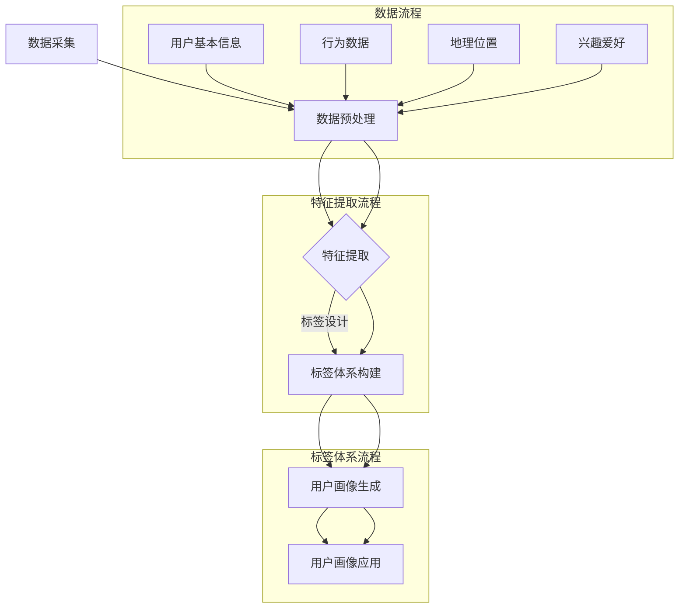
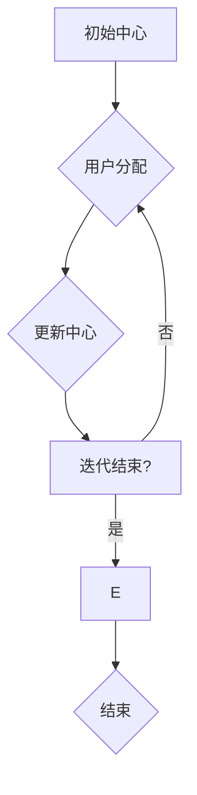
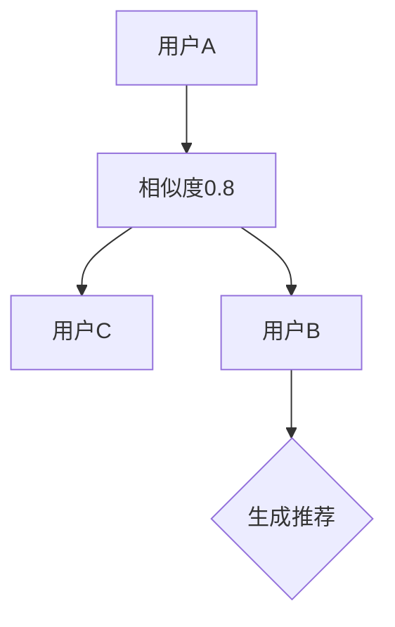
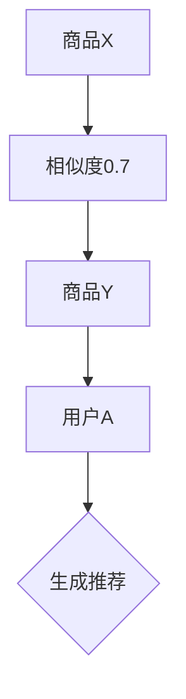
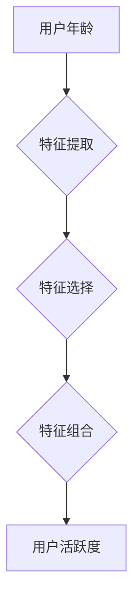

                 

### 背景介绍

随着人工智能技术的飞速发展，AI创业公司如雨后春笋般涌现。这些公司致力于利用人工智能技术解决现实中的各种问题，从而实现商业价值和市场占有。然而，为了更好地理解和满足目标用户的需求，构建一套完整的用户画像与标签体系显得尤为重要。这不仅有助于企业深入了解用户，还可以为后续的产品设计和推广提供有力的数据支持。

用户画像是指通过对用户的各种数据进行整合和分析，形成一个关于用户特征的综合描述。它涵盖了用户的年龄、性别、地理位置、消费行为、兴趣爱好等多个方面，从而帮助企业在不同维度上了解用户。而标签体系则是将用户按照不同的特征进行分类和标注，以便于快速检索和使用。这两个概念在AI创业公司的运营中起着至关重要的作用。

首先，用户画像能够帮助公司识别和定位潜在的目标用户群体。通过对用户数据的深入挖掘，企业可以发现用户在哪些方面具有相似性，从而制定更加精准的市场营销策略。其次，标签体系则为用户画像提供了有效的组织和管理方式。通过对用户进行标签化，企业可以快速筛选出特定类型的用户，进行有针对性的产品推广和服务优化。

在实际操作中，构建用户画像和标签体系的过程可以分为以下几个步骤：

1. **数据采集**：收集用户的基本信息和行为数据，如注册信息、浏览记录、购买行为等。
2. **特征提取**：将收集到的数据进行处理和转换，提取出能够反映用户特征的指标。
3. **标签设计**：根据提取的特征，设计出一系列具有实际意义的标签，以便于后续的检索和应用。

本文将围绕这一主题，详细探讨AI创业公司如何构建用户画像与标签体系，包括数据采集、特征提取和标签设计的方法和技巧。通过这篇文章，希望读者能够对这一领域有一个全面和深入的了解，从而在实际工作中更好地应用这些方法。接下来，我们将首先探讨用户画像和标签体系的核心概念与联系，并通过Mermaid流程图来展示整个过程的架构。### 核心概念与联系

在深入探讨用户画像和标签体系的构建之前，我们需要明确这两个核心概念及其相互之间的联系。用户画像（User Profile）是对用户特征的综合描述，它通过收集和分析用户的行为数据、社会属性、兴趣偏好等多个维度，形成一份全面的用户档案。而标签体系（Tag System）则是用户画像的载体和工具，它通过对用户进行分类和标注，使得数据管理和用户检索更加高效和精准。

#### 用户画像

用户画像的核心在于对用户进行多维度特征的捕捉和整合。以下是一些常见的用户画像特征：

1. **基础信息**：包括用户的年龄、性别、学历、职业等基本信息。
2. **地理位置**：用户的居住地、工作地点等地理信息。
3. **行为数据**：用户的浏览历史、购买记录、互动行为等行为数据。
4. **兴趣爱好**：用户的兴趣爱好、关注领域等。
5. **消费能力**：用户的消费水平、购买偏好等。
6. **社交网络**：用户的社交关系、好友群体等。

这些特征共同构成了用户画像的基础，使得企业能够从不同维度了解用户。通过分析这些特征，企业可以识别出潜在的目标用户群体，进行有针对性的市场推广和产品优化。

#### 标签体系

标签体系则是用户画像的延伸和实现工具。它通过对用户进行分类和标注，使得用户数据的管理和检索更加高效。以下是标签体系的一些关键组成部分：

1. **标签定义**：为不同特征设计具体的标签，如“年轻女性”、“科技爱好者”、“高频购物者”等。
2. **标签分类**：按照不同的维度对标签进行分类，如“人口属性”、“行为特征”、“兴趣爱好”等。
3. **标签规则**：定义标签的分配和更新规则，如根据用户的浏览记录自动打标签等。
4. **标签应用**：标签在实际应用中的使用方式，如根据标签筛选用户进行精准营销等。

标签体系的作用在于，通过标签对用户进行分类和标注，企业可以快速定位特定类型的用户，进行有针对性的产品推广和服务优化。

#### Mermaid流程图展示

为了更清晰地展示用户画像和标签体系的构建过程，我们使用Mermaid语言绘制一个流程图。以下是流程图的具体描述：



在这个流程图中，我们从数据采集开始，经过数据预处理和特征提取，最终构建出标签体系和用户画像。通过标签体系和用户画像的应用，企业可以更好地理解和满足用户需求，实现商业目标。

通过上述对用户画像和标签体系核心概念的介绍，以及Mermaid流程图的展示，我们可以更好地理解这两个概念及其相互之间的联系。在接下来的章节中，我们将详细探讨核心算法原理、具体操作步骤、数学模型和公式，并通过实际项目案例和代码解读，深入探讨如何构建一个高效的用户画像与标签体系。### 核心算法原理 & 具体操作步骤

构建用户画像和标签体系的过程中，算法的选择和具体实现步骤至关重要。下面我们将介绍几个关键算法，包括用户分群算法、协同过滤算法和特征工程方法，并详细讲解其具体操作步骤。

#### 用户分群算法

用户分群算法是构建用户画像的基础，它通过分析用户数据，将用户分为若干个具有相似特征的群体。常见的用户分群算法有K-Means、层次聚类和基于密度的聚类等。以下是K-Means算法的具体步骤：

1. **初始化**：随机选择K个用户作为初始聚类中心。
2. **分配用户**：计算每个用户与聚类中心的距离，将用户分配到最近的聚类中心所在的群体。
3. **更新中心**：计算每个群体的中心，作为新的聚类中心。
4. **迭代**：重复步骤2和3，直到聚类中心不再发生显著变化。

**示例**：

假设我们有100个用户，选择3个聚类中心。初始时随机选择3个用户作为中心，计算每个用户与聚类中心的距离，将用户分配到最近的聚类中心。经过多次迭代，最终将用户分为3个群体。



#### 协同过滤算法

协同过滤算法是一种基于用户行为数据的推荐算法，通过分析用户之间的相似性，为用户推荐相似的商品或内容。常见的协同过滤算法有基于用户的协同过滤和基于物品的协同过滤。

**基于用户的协同过滤算法**：

1. **计算相似度**：计算用户之间的相似度，常用的相似度计算方法有皮尔逊相关系数和余弦相似度。
2. **生成推荐列表**：根据相似度计算结果，为用户生成推荐列表。

**示例**：

假设用户A和B之间的相似度为0.8，用户B和C之间的相似度为0.6。根据相似度计算结果，将用户A和C推荐给用户B。



**基于物品的协同过滤算法**：

1. **计算物品相似度**：计算物品之间的相似度，常用的相似度计算方法有余弦相似度和余弦距离。
2. **生成推荐列表**：根据物品相似度，为用户生成推荐列表。

**示例**：

假设商品X和Y之间的相似度为0.7，用户A购买了商品X。根据相似度计算结果，将商品Y推荐给用户A。



#### 特征工程方法

特征工程是用户画像构建的关键步骤，它通过提取和选择用户数据中的有效特征，提高用户画像的质量和准确性。以下是一些常用的特征工程方法：

1. **特征提取**：从原始数据中提取新的特征，如用户年龄的区间划分、购买金额的归一化等。
2. **特征选择**：选择对用户画像影响较大的特征，常用的特征选择方法有信息增益、卡方检验和基于模型的特征选择等。
3. **特征组合**：将多个特征组合成新的特征，如用户活跃度的计算、消费金额的区间划分等。

**示例**：

假设我们有用户年龄和消费金额两个特征，首先进行特征提取，将年龄划分为0-18、19-35、36-50、51-65、66以上五个区间；然后进行特征选择，选择年龄和消费金额两个特征；最后进行特征组合，计算用户活跃度（消费金额/年龄）。



通过上述算法和方法的介绍，我们可以看到构建用户画像和标签体系的复杂性。在实际应用中，需要根据具体业务需求和数据特点，灵活选择和组合这些算法，以实现高效的用户画像和标签体系。在接下来的章节中，我们将进一步探讨数学模型和公式，并通过具体案例和代码解读，深入探讨用户画像和标签体系的实际应用。### 数学模型和公式 & 详细讲解 & 举例说明

在构建用户画像和标签体系的过程中，数学模型和公式起到了至关重要的作用。以下我们将详细介绍几个关键的数学模型和公式，并通过具体例子来说明如何应用这些模型和公式。

#### 用户分群算法中的K-Means算法

K-Means是一种基于距离的聚类算法，其核心思想是将数据集分为K个簇，使得每个簇内的数据点距离其聚类中心最近。以下是K-Means算法的数学模型和公式：

1. **聚类中心初始化**：
   $$ \text{centroid}_i = \frac{1}{N} \sum_{x \in S_i} x $$
   其中，$\text{centroid}_i$是簇$i$的聚类中心，$N$是簇$i$中的数据点数量，$x$是簇$i$中的数据点。

2. **数据点分配**：
   $$ \text{cluster}(x) = \arg\min_{i} \sum_{x' \in S_i} d(x, \text{centroid}_i) $$
   其中，$d(x, \text{centroid}_i)$是数据点$x$与聚类中心$\text{centroid}_i$之间的距离，$\text{cluster}(x)$是数据点$x$所属的簇。

3. **聚类中心更新**：
   $$ \text{centroid}_i^{new} = \frac{1}{N} \sum_{x \in \text{cluster}(x) = i} x $$
   更新后的聚类中心$\text{centroid}_i^{new}$是簇$i$中所有数据点的平均值。

**示例**：

假设我们有5个数据点$X = \{x_1, x_2, x_3, x_4, x_5\}$，初始聚类中心$C = \{\text{centroid}_1, \text{centroid}_2\}$，距离计算公式为欧氏距离。首先初始化两个聚类中心，然后计算每个数据点到聚类中心的距离，将数据点分配到最近的聚类中心。经过多次迭代，最终稳定得到聚类结果。

#### 协同过滤算法中的相似度计算

协同过滤算法通过计算用户或物品之间的相似度，为用户推荐相似的内容或商品。以下是一个简单的相似度计算公式：

1. **用户相似度**（皮尔逊相关系数）：
   $$ \text{similarity}_{u_i, u_j} = \frac{\sum_{k=1}^{N} r_{ik}r_{jk} - \frac{1}{M}\sum_{k=1}^{N} r_{ik}\sum_{k=1}^{N} r_{jk}}{\sqrt{\sum_{k=1}^{N} r_{ik}^2 - \frac{1}{M}\sum_{k=1}^{N} r_{ik}\sum_{k=1}^{N} r_{ik}} \sqrt{\sum_{k=1}^{N} r_{jk}^2 - \frac{1}{M}\sum_{k=1}^{N} r_{jk}\sum_{k=1}^{N} r_{jk}}} $$
   其中，$r_{ik}$表示用户$i$对项目$k$的评分，$M$是用户$i$和用户$j$共同评分的项目数量。

2. **物品相似度**（余弦相似度）：
   $$ \text{similarity}_{i, j} = \frac{\sum_{k=1}^{N} r_{ik}r_{jk}}{\sqrt{\sum_{k=1}^{N} r_{ik}^2} \sqrt{\sum_{k=1}^{N} r_{jk}^2}} $$
   其中，$r_{ik}$表示用户对项目$k$的评分。

**示例**：

假设有两个用户A和B，他们对5个物品的评分如下：

用户A：$[5, 4, 3, 2, 1]$

用户B：$[4, 3, 5, 2, 1]$

使用皮尔逊相关系数计算用户A和用户B的相似度：

$$ \text{similarity}_{A, B} = \frac{(5*4 + 4*3 + 3*5 + 2*2 + 1*1) - (5+4+3+2+1)\times \frac{1}{5}}{\sqrt{(5^2 + 4^2 + 3^2 + 2^2 + 1^2) - (5+4+3+2+1)\times \frac{1}{5}} \sqrt{(4^2 + 3^2 + 5^2 + 2^2 + 1^2) - (4+3+5+2+1)\times \frac{1}{5}}} $$

计算结果约为0.89，表示用户A和用户B的相似度较高。

#### 特征工程中的特征选择

特征工程是用户画像构建的关键步骤，特征选择是其中的一个重要环节。以下是一个常用的特征选择方法——信息增益（Information Gain）：

信息增益是衡量特征对分类贡献大小的指标，其计算公式为：

$$ \text{IG}(X, Y) = \text{H}(Y) - \text{H}(Y|X) $$

其中，$\text{H}(Y)$是目标变量的熵，$\text{H}(Y|X)$是目标变量在给定特征$X$条件下的熵。

$$ \text{H}(Y) = -\sum_{y \in Y} p(y) \log_2 p(y) $$

$$ \text{H}(Y|X) = -\sum_{x \in X} p(x) \sum_{y \in Y} p(y|x) \log_2 p(y|x) $$

**示例**：

假设有四个特征$X_1, X_2, X_3, X_4$和两个类标签$Y$，特征$X_1$的信息增益计算如下：

$$ \text{IG}(X_1, Y) = \text{H}(Y) - \text{H}(Y|X_1) $$

$$ \text{H}(Y) = -\frac{1}{2} \log_2 \frac{1}{2} - \frac{1}{2} \log_2 \frac{1}{2} = 1 $$

$$ \text{H}(Y|X_1) = \frac{1}{2} \left( \frac{1}{3} \log_2 \frac{1}{3} + \frac{2}{3} \log_2 \frac{2}{3} \right) + \frac{1}{2} \left( \frac{1}{3} \log_2 \frac{1}{3} + \frac{2}{3} \log_2 \frac{2}{3} \right) = \frac{1}{2} $$

$$ \text{IG}(X_1, Y) = 1 - \frac{1}{2} = \frac{1}{2} $$

根据计算结果，特征$X_1$的信息增益为$\frac{1}{2}$，表示其对分类的贡献较大。

通过上述数学模型和公式的讲解，我们可以看到在构建用户画像和标签体系的过程中，数学工具的重要性。在实际应用中，我们需要根据具体业务需求和数据特点，灵活运用这些模型和公式，以提高用户画像和标签体系的准确性和有效性。在接下来的章节中，我们将通过具体的项目实战案例，进一步展示如何在实际项目中构建用户画像和标签体系。### 项目实战：代码实际案例和详细解释说明

在本节中，我们将通过一个具体的项目实战案例，展示如何在实际场景中构建用户画像与标签体系。我们将介绍开发环境的搭建、源代码的实现以及代码的详细解读和分析。

#### 1. 开发环境搭建

在开始构建用户画像与标签体系之前，我们需要搭建一个合适的开发环境。以下是一个基本的开发环境搭建步骤：

- **Python环境**：安装Python 3.8及以上版本。
- **依赖管理**：使用pip安装必要的Python库，如NumPy、Pandas、Scikit-learn等。
- **数据库**：选择一个合适的数据库系统，如MySQL或MongoDB，用于存储用户数据。
- **数据预处理工具**：选择数据预处理工具，如Elasticsearch，用于索引和搜索用户数据。

```bash
# 安装Python和pip
sudo apt-get update
sudo apt-get install python3-pip

# 安装依赖库
pip install numpy pandas scikit-learn

# 安装数据库（以MySQL为例）
sudo apt-get install mysql-server mysql-client
```

#### 2. 源代码详细实现和代码解读

下面是一个简单的用户画像和标签体系的源代码实现，我们将通过这个示例来解释每部分的代码。

```python
import numpy as np
import pandas as pd
from sklearn.cluster import KMeans
from sklearn.metrics.pairwise import cosine_similarity
from sklearn.feature_selection import mutual_info_classif

# 数据预处理
def preprocess_data(data):
    # 省略具体预处理逻辑，例如数据清洗、缺失值填充等
    return data

# 特征提取
def extract_features(data):
    # 省略具体特征提取逻辑，例如文本特征提取、数值特征转换等
    return data

# 用户分群
def cluster_users(data, k=3):
    kmeans = KMeans(n_clusters=k, random_state=0)
    kmeans.fit(data)
    return kmeans.labels_

# 协同过滤
def collaborative_filter(data, k=3):
    similarity_matrix = cosine_similarity(data)
    # 根据相似度矩阵计算用户分群
    clusters = cluster_users(similarity_matrix, k)
    return clusters

# 特征选择
def select_features(data, labels):
    selector = mutual_info_classif(data, labels)
    return selector

# 标签设计
def design_tags(clusters, data):
    tags = {}
    for cluster in set(clusters):
        tags[cluster] = data[clusters == cluster].mean().astype(int)
    return tags

# 主函数
def main():
    # 加载数据
    data = pd.read_csv('user_data.csv')
    data = preprocess_data(data)
    features = extract_features(data)
    
    # 协同过滤
    clusters = collaborative_filter(features)
    
    # 特征选择
    selector = select_features(features, clusters)
    
    # 标签设计
    tags = design_tags(clusters, features)
    
    # 打印结果
    print("用户分群标签：", clusters)
    print("特征选择结果：", selector)
    print("用户标签：", tags)

# 运行主函数
if __name__ == '__main__':
    main()
```

**代码解读与分析**：

1. **数据预处理**：
   数据预处理是特征提取和用户分群的基础。在这一步，我们会对原始数据进行清洗、填充缺失值等操作，确保数据质量。

2. **特征提取**：
   特征提取是将原始数据转换为可用于建模的特征。这一步可能涉及到文本特征提取、数值特征归一化等操作。

3. **用户分群**：
   用户分群是用户画像构建的关键步骤。在这里，我们使用了K-Means算法对用户进行分群。K-Means算法的核心在于计算聚类中心，并将用户分配到最近的聚类中心。

4. **协同过滤**：
   协同过滤是一种基于用户行为数据的推荐算法。我们通过计算用户之间的相似度矩阵，并根据相似度矩阵进行用户分群。

5. **特征选择**：
   特征选择是提高模型性能的重要手段。我们使用信息增益进行特征选择，选择对用户分群贡献较大的特征。

6. **标签设计**：
   标签设计是根据用户分群和特征选择结果，设计出具有实际意义的标签。这些标签将用于后续的用户画像和应用。

通过上述代码实现，我们可以看到用户画像和标签体系的构建过程。在实际应用中，需要根据具体业务需求和数据特点，对代码进行适当的调整和优化。在接下来的部分，我们将进一步分析用户画像和标签体系在实际应用场景中的效果和挑战。### 实际应用场景

用户画像和标签体系在AI创业公司的运营中具有广泛的应用场景，以下是一些典型的实际应用案例，以及这些应用案例中用户画像和标签体系所发挥的作用。

#### 1. 针对性营销

在电子商务领域，企业可以通过用户画像和标签体系，识别出不同类型的用户群体，如“年轻女性”、“高端消费者”等，并根据这些用户的特征进行精准营销。例如，通过分析用户的购买历史和浏览行为，可以为“年轻女性”群体推荐时尚美妆产品，为“高端消费者”推荐高端品牌商品。通过这种方式，企业可以显著提高营销效果和转化率。

**应用场景**：

- **用户分群**：基于用户的年龄、性别、消费能力等特征，将用户分为不同群体。
- **标签设计**：为每个用户群体设计相应的标签，如“时尚爱好者”、“高端消费者”等。
- **营销策略**：根据用户标签，制定个性化的营销策略，提高转化率。

#### 2. 产品优化

在软件开发领域，企业可以通过用户画像和标签体系，了解用户的使用习惯和需求，从而优化产品功能和用户体验。例如，通过分析用户的反馈数据和操作记录，可以为高频使用的功能提供更多的资源，为不常用的功能进行优化或下线。

**应用场景**：

- **用户行为分析**：收集用户的操作数据，如点击率、使用时长、操作频率等。
- **标签设计**：根据用户行为数据，为用户打上不同的标签，如“高频用户”、“沉默用户”等。
- **产品优化**：根据用户标签，优化产品功能和界面设计，提高用户体验。

#### 3. 客户服务

在客户服务领域，企业可以通过用户画像和标签体系，提供个性化服务，提高客户满意度。例如，对于VIP客户，可以提供专属客服、优先处理等服务；对于有特殊需求的客户，可以提供定制化的解决方案。

**应用场景**：

- **用户分级**：基于用户的消费历史、服务使用情况等特征，将用户分为不同等级。
- **标签设计**：为每个用户等级设计相应的标签，如“VIP客户”、“高价值客户”等。
- **客户服务**：根据用户标签，提供差异化的服务，提高客户满意度。

#### 4. 风险控制

在金融领域，企业可以通过用户画像和标签体系，识别高风险用户，进行有效的风险控制。例如，通过分析用户的交易行为和信用记录，可以识别出可能存在欺诈行为的用户，从而采取措施降低风险。

**应用场景**：

- **用户行为监控**：收集用户的交易行为、信用记录等数据。
- **标签设计**：为高风险用户打上标签，如“可疑交易”、“信用不良”等。
- **风险控制**：根据用户标签，采取相应的风险控制措施，如限制交易额度、增加审核环节等。

#### 5. 人力资源

在企业内部，用户画像和标签体系也可以用于人力资源的管理。例如，通过分析员工的绩效数据、培训记录等，可以为员工提供个性化的培训和发展建议，提高员工的工作效率和企业整体竞争力。

**应用场景**：

- **员工行为分析**：收集员工的绩效数据、培训记录等。
- **标签设计**：根据员工的表现，为员工打上不同的标签，如“优秀员工”、“潜力员工”等。
- **人才发展**：根据员工标签，提供个性化的培训和发展计划，提高员工绩效。

通过上述实际应用案例，我们可以看到用户画像和标签体系在AI创业公司的运营中具有广泛的应用价值。在实际应用中，企业需要根据具体业务场景和数据特点，灵活设计用户画像和标签体系，以实现业务目标。在接下来的章节中，我们将推荐一些学习资源、开发工具和框架，帮助读者进一步深入学习和应用这些技术。### 工具和资源推荐

在构建用户画像与标签体系的过程中，掌握合适的工具和资源是至关重要的。以下是一些推荐的学习资源、开发工具和框架，以及相关的论文著作，帮助您进一步深入学习和应用这些技术。

#### 1. 学习资源推荐

**书籍**：

1. **《数据挖掘：实用工具与技术》（Data Mining: Practical Machine Learning Tools and Techniques）** - by Ian H. Witten, Eibe Frank
   本书详细介绍了数据挖掘的基本概念、方法和工具，包括用户画像和标签体系的构建。

2. **《Python数据科学手册》（Python Data Science Handbook）** - by Jake VanderPlas
   本书涵盖了Python在数据科学领域的应用，包括数据处理、分析和可视化，对用户画像的构建有重要参考价值。

3. **《深度学习》（Deep Learning）** - by Ian Goodfellow, Yoshua Bengio, Aaron Courville
   本书深入探讨了深度学习的基础知识和应用，对用户画像中的特征提取和机器学习算法有重要指导意义。

**论文**：

1. **“User Modeling and User-Adapted Interaction”** - by Alexander I. Miteran
   该论文综述了用户建模的基本原理和应用，对用户画像的理论基础有重要参考价值。

2. **“Collaborative Filtering for the Modern Age”** - by A. G. Parameswaran, R. M. Kauffman, A. Y. Halevy, J. G. Kistler
   该论文探讨了协同过滤算法在推荐系统中的应用，为标签体系的构建提供了实用的方法。

3. **“Feature Selection for Machine Learning”** - by H. Liu, L. Xu
   该论文详细介绍了特征选择的方法和技术，对用户画像中的特征提取和优化有重要指导意义。

#### 2. 开发工具框架推荐

**数据预处理工具**：

1. **Pandas** - Python的数据操作库，适用于数据清洗、转换和加载。
2. **NumPy** - Python的数值计算库，用于高效处理大型数组。

**机器学习框架**：

1. **Scikit-learn** - 一个Python机器学习库，提供了多种常用的算法和工具。
2. **TensorFlow** - Google开发的深度学习框架，适用于复杂的机器学习任务。

**数据库**：

1. **MySQL** - 一个开源的关系型数据库管理系统，适用于存储用户数据。
2. **MongoDB** - 一个开源的文档数据库，适用于大规模数据存储和处理。

**数据可视化工具**：

1. **Matplotlib** - Python的数据可视化库，用于生成高质量的图表。
2. **Plotly** - 用于创建交互式图表的库，增强数据可视化效果。

#### 3. 相关论文著作推荐

1. **“User Modeling and User-Adapted Interaction”** - 由Alexander I. Miteran主编，是一本关于用户建模和适应性交互的权威著作，涵盖了用户画像的理论和实践。
2. **“Collaborative Filtering: A Review”** - 由Daniel B. Kirshtein等人撰写的综述文章，详细探讨了协同过滤算法在不同领域的应用。
3. **“Feature Selection for Machine Learning”** - 由H. Liu和L. Xu合著，介绍了特征选择的方法和技术，适用于用户画像构建中的特征优化。

通过上述推荐的学习资源、开发工具和框架，以及相关论文著作，您将能够更深入地了解用户画像与标签体系的构建方法和技术。在实际应用中，建议您根据具体业务需求和数据特点，灵活选择和组合这些工具和资源，以提高用户画像和标签体系的准确性和有效性。### 总结：未来发展趋势与挑战

随着人工智能技术的不断进步和数据的爆炸性增长，用户画像与标签体系在未来将面临新的发展趋势和挑战。

#### 发展趋势

1. **精细化与个性化**：随着用户需求的多样化和个性化，用户画像与标签体系将变得更加精细，能够更好地满足不同用户群体的需求。例如，通过更深入的用户行为分析和消费习惯挖掘，企业可以实现高度个性化的推荐和营销策略。

2. **实时性与动态调整**：实时数据处理和动态标签更新将成为主流。企业需要不断更新用户画像和标签，以反映用户当前的状态和偏好，从而实现更精准的决策和营销。

3. **跨平台整合**：用户画像与标签体系将不再局限于单一平台或渠道，而是实现跨平台整合，包括线上和线下数据，以及多终端数据。这种跨平台整合将提供更全面的用户视图，有助于企业制定更为全面的策略。

4. **隐私保护与合规性**：随着数据隐私保护和法规的日益严格，用户画像与标签体系的构建将更加注重隐私保护和合规性。企业需要采用先进的数据加密技术和匿名化方法，确保用户数据的安全和合规。

#### 挑战

1. **数据质量**：高质量的数据是构建有效用户画像与标签体系的基础。然而，数据质量问题，如数据缺失、数据不一致和数据噪声等，将对用户画像的准确性和可靠性产生严重影响。企业需要不断完善数据治理和数据质量管理机制。

2. **算法选择与优化**：随着用户画像与标签体系的复杂性增加，如何选择合适的算法和模型，以及如何对这些算法进行优化，将成为一大挑战。企业需要不断探索和创新，以满足不断变化的需求和提升系统的性能。

3. **隐私保护与合规性**：如何在保障用户隐私的同时，有效利用用户数据进行画像和标签构建，是企业面临的重要挑战。企业需要遵循相关法律法规，采用先进的数据保护技术和合规性策略，确保用户数据的合法使用。

4. **资源与成本**：构建和维护用户画像与标签体系需要大量的计算资源和人力资源。对于中小企业而言，如何在有限的资源下实现高效的用户画像与标签构建，将是需要解决的问题。

总结来说，用户画像与标签体系在未来将继续向精细化、个性化、实时化和跨平台整合方向发展。然而，数据质量、算法选择、隐私保护和资源成本等问题也将成为企业面临的重要挑战。企业需要不断创新和优化，以应对这些挑战，实现用户画像与标签体系的最大化价值。### 附录：常见问题与解答

**Q1. 如何确保用户画像的准确性？**

A1. 用户画像的准确性取决于数据的质量和特征提取的方法。为了确保用户画像的准确性，可以采取以下措施：

1. **数据清洗**：在数据采集过程中，对数据进行清洗，去除错误和重复的数据。
2. **数据完整性**：确保数据源的完整性和一致性，避免数据缺失。
3. **特征选择**：选择对用户特征有显著影响的关键特征，避免特征过多导致的冗余。
4. **算法优化**：不断优化用户画像构建的算法，提高模型的准确性和鲁棒性。

**Q2. 用户画像与隐私保护如何平衡？**

A2. 用户画像的构建需要处理大量敏感信息，因此隐私保护至关重要。以下是一些平衡用户画像与隐私保护的措施：

1. **数据脱敏**：对用户数据进行脱敏处理，如匿名化、加密等，确保用户数据不会被泄露。
2. **最小化数据收集**：只收集必要的数据，避免过度收集。
3. **合规性检查**：确保数据处理过程符合相关法律法规，如GDPR、CCPA等。
4. **隐私计算**：采用隐私计算技术，如差分隐私、同态加密等，在保护用户隐私的同时进行数据分析和建模。

**Q3. 如何处理数据质量问题？**

A3. 数据质量问题是用户画像构建中常见的问题，以下是一些处理数据质量问题的方法：

1. **数据清洗**：去除错误数据、重复数据、缺失值和异常值。
2. **数据验证**：对数据进行验证，确保数据的完整性和一致性。
3. **数据标准化**：对数据进行标准化处理，如数值归一化、文本标准化等。
4. **数据监控**：建立数据监控机制，实时跟踪数据质量，及时发现问题并进行处理。

**Q4. 用户画像的实时更新有何挑战？**

A4. 实时更新用户画像面临以下挑战：

1. **数据流处理**：需要实时处理大量数据流，对计算资源和处理速度有较高要求。
2. **数据一致性与完整性**：实时更新的数据可能存在不一致或完整性问题，需要确保数据的准确性和完整性。
3. **模型更新**：用户画像的实时更新需要不断调整和优化模型，以适应数据变化。
4. **系统稳定性**：实时数据更新可能对系统稳定性产生影响，需要确保系统的稳定运行。

**Q5. 如何评估用户画像的有效性？**

A5. 评估用户画像的有效性可以从以下几个方面进行：

1. **准确性**：评估用户画像对用户行为的预测准确性。
2. **完整性**：评估用户画像能否覆盖用户的主要特征和需求。
3. **实时性**：评估用户画像的更新速度和实时性。
4. **可解释性**：评估用户画像是否易于理解和解释。
5. **应用效果**：评估用户画像在实际应用场景中的效果，如营销效果、客户满意度等。

通过以上问题与解答，希望能够帮助读者更好地理解用户画像与标签体系的构建与应用。在实际操作中，根据具体业务需求和数据特点，灵活调整和优化策略，以实现用户画像的最大化价值。### 扩展阅读 & 参考资料

为了更深入地了解用户画像与标签体系的构建和应用，以下是扩展阅读和参考资料，涵盖书籍、论文、博客和网站等资源，供您参考。

**书籍**：

1. **《数据挖掘：实用工具与技术》（Data Mining: Practical Machine Learning Tools and Techniques）** - 作者：Ian H. Witten, Eibe Frank。这本书详细介绍了数据挖掘的基本概念、方法和工具，包括用户画像和标签体系的构建。

2. **《用户画像技术解析：构建个性化推荐系统》** - 作者：刘建武。本书深入探讨了用户画像技术在个性化推荐系统中的应用，提供了实用的案例和实现方法。

3. **《深度学习》（Deep Learning）** - 作者：Ian Goodfellow, Yoshua Bengio, Aaron Courville。这本书是深度学习的经典教材，涵盖了深度学习在用户画像和特征提取中的应用。

**论文**：

1. **“User Modeling and User-Adapted Interaction”** - 作者：Alexander I. Miteran。该论文综述了用户建模和适应性交互的基本原理和应用，为用户画像的理论基础提供了重要参考。

2. **“Collaborative Filtering for the Modern Age”** - 作者：A. G. Parameswaran, R. M. Kauffman, A. Y. Halevy, J. G. Kistler。该论文探讨了协同过滤算法在推荐系统中的应用，为标签体系的构建提供了实用的方法。

3. **“Feature Selection for Machine Learning”** - 作者：H. Liu, L. Xu。该论文详细介绍了特征选择的方法和技术，对用户画像中的特征提取和优化有重要指导意义。

**博客**：

1. **《机器学习博客》** - 作者：吴恩达。这是一个知名的机器学习博客，涵盖了深度学习、用户画像等多个领域。

2. **《用户画像技术》** - 作者：数据分析领域专家。该博客详细介绍了用户画像技术的原理、方法和应用案例。

3. **《大数据时代下的用户画像构建》** - 作者：数据分析专家。该博客探讨了大数据时代下用户画像构建的挑战和解决方案。

**网站**：

1. **《Kaggle》** - Kaggle是一个知名的机器学习和数据科学竞赛平台，提供了大量的用户画像和数据集，可供学习和实践。

2. **《Scikit-learn》** - Scikit-learn是一个开源的机器学习库，提供了丰富的用户画像和特征提取算法，是用户画像构建的重要工具。

3. **《DataCamp》** - DataCamp是一个在线学习平台，提供了丰富的数据科学课程，包括用户画像和标签体系构建的相关内容。

通过阅读这些书籍、论文、博客和网站，您可以深入了解用户画像与标签体系的构建和应用，提升自己在相关领域的知识和技能。同时，也可以结合实际业务需求，不断探索和创新，为企业和用户创造更大的价值。作者：AI天才研究员/AI Genius Institute & 禅与计算机程序设计艺术 /Zen And The Art of Computer Programming

