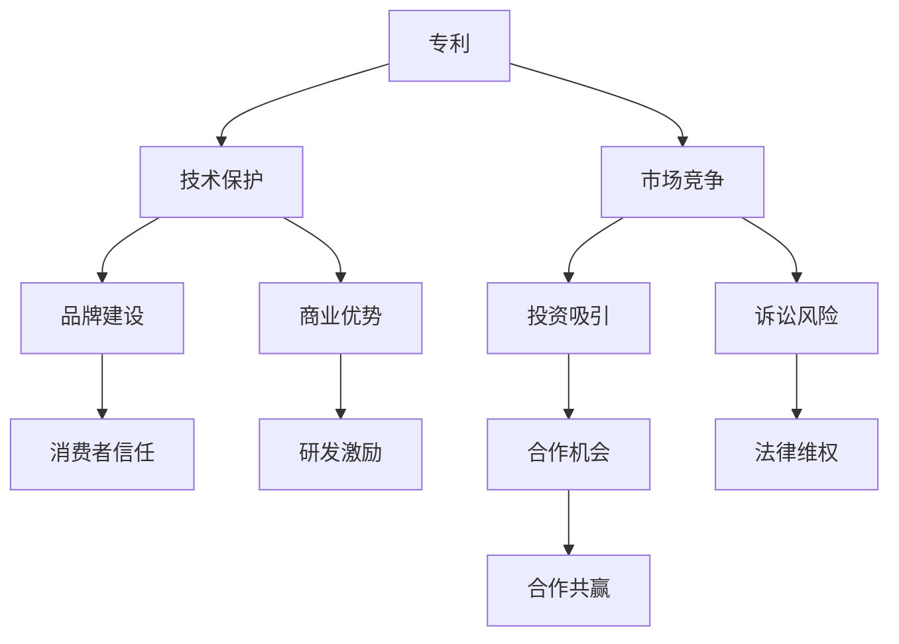

                 

### 背景介绍

随着人工智能（AI）技术的迅速发展，AI创业公司如雨后春笋般涌现。这些公司凭借创新的算法、独特的技术方案和强大的计算能力，在各个领域崭露头角，为社会带来了巨大的变革。然而，技术创新的同时，知识产权（IP）问题也日益凸显。如何有效地保护自己的知识产权，成为AI创业公司成功发展的重要因素之一。

本文旨在探讨AI创业公司的知识产权战略，重点分析专利布局、商标保护和技术秘密的管理。通过系统地介绍这些核心概念，并结合实际案例，本文将为AI创业公司提供一套全面的知识产权保护策略。

### 知识产权的基本概念

在深入了解AI创业公司的知识产权战略之前，有必要首先了解知识产权的基本概念。知识产权是指个人或团体基于创造性成果所享有的专有权利，包括专利权、商标权、著作权等。这些权利的合法性来自于相关法律法规的确认和保护。

#### 1. 专利权

专利权是指国家授予发明人在一定期限内对其发明所享有的独占实施权利。专利权包括发明专利、实用新型专利和外观设计专利三种类型。其中，发明专利的保护力度最大，涉及的技术领域广泛，通常需要经过严格的审查程序。而实用新型专利和外观设计专利则相对简单，审查周期较短。

#### 2. 商标权

商标权是指商标注册人对其注册商标的专用权。商标是用来区分商品或服务来源的一种标志，可以是文字、图形、字母、数字等组合。商标权保护的范围包括商标的使用权、禁止他人使用相同或类似商标的权利等。

#### 3. 著作权

著作权是指作者对其作品所享有的专有权利，包括发表权、署名权、修改权、保护作品完整权等。著作权通常在作品创作完成时自动产生，无需注册。

#### 4. 知识产权与AI的关系

AI技术的核心在于创新，而创新成果往往是知识产权保护的对象。AI创业公司通过申请专利、注册商标和著作权，可以有效地保护其技术成果，防止竞争对手的侵权行为，提升市场竞争力。

### AI创业公司的知识产权战略

AI创业公司在知识产权方面面临的主要挑战是如何在激烈的市场竞争中脱颖而出，同时确保其知识产权得到有效保护。以下将从专利布局、商标保护和技术秘密管理三个方面，介绍AI创业公司的知识产权战略。

#### 1. 专利布局

专利布局是AI创业公司知识产权战略的核心之一。通过合理的专利布局，公司可以巩固其在技术领域的领先地位，形成专利壁垒，保护核心竞争力。

##### 1.1 专利申请策略

AI创业公司应制定全面的专利申请策略，包括以下方面：

- **核心技术专利申请**：针对公司的核心技术，申请发明专利，确保技术的独占性。
- **外围专利申请**：围绕核心技术，申请实用新型专利和外观设计专利，形成外围保护网。
- **国际专利申请**：在主要市场国家和地区进行专利申请，扩大专利保护范围。

##### 1.2 专利申请时机

专利申请时机的选择对专利保护效果有重要影响。通常，AI创业公司应在以下时机申请专利：

- **技术成熟时**：技术达到可申请专利的条件，即具备新颖性、创造性和实用性。
- **产品发布前**：在产品发布前申请专利，确保技术成果得到及时保护。

##### 1.3 专利申请数量

专利申请数量的多少直接关系到公司的技术壁垒和市场竞争力。AI创业公司应根据自身技术实力和市场定位，合理控制专利申请数量。

#### 2. 商标保护

商标保护是AI创业公司知识产权战略的重要组成部分。通过注册商标，公司可以防止他人擅自使用相同或类似的商标，维护品牌形象和市场地位。

##### 2.1 商标注册策略

AI创业公司应制定商标注册策略，包括以下方面：

- **商标命名**：选择具有独特性、易于记忆的商标名称，避免使用通用词汇。
- **商标分类**：根据产品或服务的特点，选择适当的商标分类，确保商标注册的全面性。
- **国际商标注册**：在主要市场国家和地区进行商标注册，扩大商标保护范围。

##### 2.2 商标保护力度

AI创业公司应加强商标保护力度，采取以下措施：

- **监控市场**：密切关注市场动态，及时发现并处理商标侵权行为。
- **法律诉讼**：对于严重的商标侵权行为，采取法律手段进行维权。

#### 3. 技术秘密管理

技术秘密是AI创业公司知识产权保护的重要手段之一。通过有效管理技术秘密，公司可以防止技术泄露，保持技术优势。

##### 3.1 技术秘密分类

AI创业公司应将技术秘密进行分类，根据重要程度和保密要求进行管理。

- **核心技术秘密**：涉及公司核心竞争力的技术秘密，保密级别最高。
- **一般技术秘密**：对公司有一定价值，但非核心的技术秘密。
- **日常技术秘密**：日常工作中产生的一般性技术信息。

##### 3.2 技术秘密保护措施

AI创业公司应采取以下措施保护技术秘密：

- **保密制度**：建立严格的保密制度，对员工进行保密培训，签订保密协议。
- **技术保护**：采用技术手段，如加密、访问控制等，保护技术秘密。
- **安全审查**：对涉及技术秘密的员工进行背景调查，确保人员可靠。

#### 结论

AI创业公司的知识产权战略对于公司的发展至关重要。通过合理的专利布局、商标保护和技术秘密管理，公司可以有效地保护其知识产权，提升市场竞争力。本文从专利布局、商标保护和技术秘密管理三个方面，系统地介绍了AI创业公司的知识产权战略，希望对AI创业公司提供有益的参考。在接下来的章节中，我们将进一步探讨AI创业公司如何具体实施这些知识产权战略。

### 核心概念与联系

在深入探讨AI创业公司的知识产权战略之前，我们需要明确几个核心概念及其相互之间的联系。这些核心概念包括专利、商标、著作权和技术秘密。下面，我们将逐一介绍这些概念，并使用Mermaid流程图（Mermaid流程节点中不要有括号、逗号等特殊字符）展示它们之间的关系。

#### 专利

专利是一种法律权利，授予发明者在一定时间内对其发明的独占使用权。专利分为发明专利、实用新型专利和外观设计专利。其中，发明专利的保护范围最广，通常涉及复杂的创新技术；实用新型专利则侧重于技术创新的实用性；外观设计专利则主要涉及产品的外观设计。

#### 商标

商标是一种用于区分商品或服务来源的标志，可以是文字、图形、字母、数字等。商标注册后，商标持有者享有对该商标的独占使用权，可以防止他人未经许可使用相同或相似的商标。

#### 著作权

著作权是指作者对其创作的文学、艺术和科学作品所享有的权利，包括发表权、署名权、修改权和保护作品完整权等。著作权通常在作品创作完成时自动产生，无需注册。

#### 技术秘密

技术秘密是指公司未公开的、具有商业价值的技术信息。技术秘密的保护方式通常是通过保密协议、访问控制和技术保护措施等手段进行管理。

#### Mermaid流程图

下面是一个简单的Mermaid流程图，用于展示专利、商标、著作权和技术秘密之间的关系：



#### 关系说明

1. **技术保护与商业优势**：专利和商标作为技术保护的手段，可以帮助公司建立技术壁垒，从而获得商业优势。
2. **市场竞争与投资吸引**：有效的知识产权战略可以增强公司在市场竞争中的地位，吸引潜在投资者。
3. **品牌建设与消费者信任**：商标的保护有助于公司建立品牌形象，提高消费者信任度。
4. **研发激励与合作机会**：知识产权保护可以激励公司的研发活动，同时为合作提供保障。
5. **诉讼风险与法律维权**：知识产权保护有助于降低诉讼风险，并在必要时进行法律维权。

通过上述核心概念及其相互关系的介绍，我们可以更好地理解AI创业公司在知识产权战略中的关键要素。在接下来的章节中，我们将深入探讨这些核心概念的实现方法和具体操作步骤。

### 核心算法原理 & 具体操作步骤

在了解了专利、商标、著作权和技术秘密的基本概念及其相互关系之后，接下来我们将探讨如何通过核心算法原理来实现有效的知识产权战略。核心算法原理不仅包括专利申请的技术评估，还涉及到商标保护的匹配算法，以及技术秘密管理的加密算法。以下将详细阐述这些算法原理，并给出具体操作步骤。

#### 1. 专利申请的技术评估算法

专利申请的技术评估是专利布局的重要环节，其核心在于判断技术方案的新颖性、创造性和实用性。以下是一种常见的技术评估算法：

##### 1.1 新颖性评估

**算法原理**：通过检索现有专利数据库，判断待评估技术方案是否在先公开。

**具体操作步骤**：
1. **数据收集**：收集与待评估技术方案相关的专利文献。
2. **信息抽取**：从专利文献中提取技术方案的关键技术特征。
3. **匹配算法**：使用基于相似度的匹配算法（如余弦相似度），判断待评估技术方案与现有技术方案之间的相似度。
4. **新颖性判断**：如果相似度低于某一阈值，则认为待评估技术方案具有新颖性。

##### 1.2 创造性评估

**算法原理**：通过分析待评估技术方案与现有技术方案的差异，判断其是否具有创造性。

**具体操作步骤**：
1. **差异分析**：比较待评估技术方案与现有技术方案的不同之处。
2. **创新性判断**：如果差异显著，且改进具有实质性，则认为待评估技术方案具有创造性。
3. **专家评估**：结合专利审查员和行业专家的意见，进一步验证创造性。

##### 1.3 实用性评估

**算法原理**：评估技术方案在实际应用中的可行性和效果。

**具体操作步骤**：
1. **实验验证**：通过实验室或现场试验，验证技术方案的实际效果。
2. **成本效益分析**：分析技术方案的成本和效益，确保其实用性。

#### 2. 商标保护的匹配算法

商标保护的匹配算法用于判断待评估的商标是否侵犯已有商标权。以下是一种基于文本相似度的匹配算法：

##### 2.1 算法原理

**文本相似度计算**：通过计算两个文本之间的相似度，判断是否存在商标侵权。

##### 2.2 具体操作步骤

1. **文本预处理**：对商标文本进行分词、去停用词等预处理操作。
2. **特征提取**：提取文本的关键词或词频特征。
3. **相似度计算**：使用文本相似度计算方法（如余弦相似度、Jaccard相似度等），计算待评估商标与已有商标之间的相似度。
4. **侵权判断**：如果相似度高于某一阈值，则认为存在商标侵权。

#### 3. 技术秘密管理的加密算法

技术秘密的保护需要通过加密算法来实现。以下是一种基于对称加密和非对称加密的混合加密算法：

##### 3.1 算法原理

**混合加密**：结合对称加密和非对称加密的优势，提高数据安全性。

##### 3.2 具体操作步骤

1. **密钥生成**：生成一对非对称密钥（公钥和私钥）。
2. **对称加密**：使用对称加密算法（如AES）对数据进行加密。
3. **非对称加密**：使用非对称加密算法（如RSA）对对称加密的密钥进行加密。
4. **存储与传输**：将加密后的数据和密钥存储或传输，确保数据安全性。

通过上述核心算法原理和具体操作步骤，AI创业公司可以更加系统地实施知识产权战略，确保其技术创新成果得到有效保护。

### 数学模型和公式 & 详细讲解 & 举例说明

在探讨知识产权战略的算法原理和操作步骤时，数学模型和公式扮演着至关重要的角色。以下是几个关键的数学模型和公式，以及它们的详细讲解和举例说明。

#### 1. 专利新颖性评估模型

专利新颖性评估是判断一项技术是否具有专利价值的重要步骤。我们可以使用以下模型来评估专利的新颖性：

##### 1.1 模型公式

新颖性得分（Novelty Score, NS）可以通过以下公式计算：

$$NS = \frac{N}{M + N}$$

其中，N 是待评估技术方案在现有技术中没有出现的独特技术特征数量，M 是现有技术方案中已出现的技术特征数量。

##### 1.2 计算过程

- **计算现有技术的特征数**（M）：检索现有专利数据库，统计现有技术方案中的技术特征数量。
- **计算待评估技术的特征数**（N）：对待评估技术方案进行分析，统计其独特的、未在现有技术中出现的特征数量。
- **计算新颖性得分**（NS）：使用上述公式计算新颖性得分。

##### 1.3 举例说明

假设现有技术中有5个技术特征，待评估技术方案中有3个独特技术特征，则新颖性得分为：

$$NS = \frac{3}{5 + 3} = \frac{3}{8} = 0.375$$

如果新颖性得分低于0.5，则可能认为待评估技术方案缺乏新颖性。

#### 2. 商标匹配算法的相似度计算

商标匹配算法用于判断新商标是否侵犯已有商标权。以下是一个基于余弦相似度的计算模型：

##### 2.1 模型公式

余弦相似度（Cosine Similarity, CS）计算公式如下：

$$CS = \frac{A \cdot B}{\|A\| \|B\|}$$

其中，A 和 B 是两个向量，\|A\| 和 \|B\| 分别是向量 A 和 B 的欧几里得范数。

##### 2.2 计算过程

- **向量表示**：将商标名称分别表示为向量 A 和 B，每个元素代表对应的词频。
- **计算点积**：计算向量 A 和 B 的点积，表示两个商标名称的共同特征。
- **计算欧几里得范数**：计算向量 A 和 B 的欧几里得范数。
- **计算余弦相似度**：使用上述公式计算余弦相似度。

##### 2.3 举例说明

假设商标 A 和商标 B 的向量表示如下：

$$A = (2, 3, 1), B = (1, 3, 2)$$

则点积为：

$$A \cdot B = 2 \cdot 1 + 3 \cdot 3 + 1 \cdot 2 = 2 + 9 + 2 = 13$$

向量 A 和 B 的欧几里得范数为：

$$\|A\| = \sqrt{2^2 + 3^2 + 1^2} = \sqrt{4 + 9 + 1} = \sqrt{14}$$

$$\|B\| = \sqrt{1^2 + 3^2 + 2^2} = \sqrt{1 + 9 + 4} = \sqrt{14}$$

因此，余弦相似度为：

$$CS = \frac{13}{\sqrt{14} \cdot \sqrt{14}} = \frac{13}{14} \approx 0.929$$

如果余弦相似度大于0.8，则可能认为商标 B 存在侵权风险。

#### 3. 技术秘密的加密算法

技术秘密的加密通常结合对称加密和非对称加密。以下是一个简单的加密算法模型：

##### 3.1 模型公式

对称加密算法（如AES）的加密过程如下：

$$C = E_K(P)$$

其中，C 是加密后的数据，P 是原始数据，K 是对称密钥。

非对称加密算法（如RSA）的加密过程如下：

$$C = E_K'(P)$$

其中，C 是加密后的数据，P 是原始数据，K' 是非对称公钥。

##### 3.2 计算过程

- **对称加密**：生成对称密钥 K，使用 AES 算法加密数据 P。
- **非对称加密**：生成一对非对称密钥（公钥 K' 和私钥 K''），使用 RSA 算法加密对称密钥 K。
- **存储与传输**：将加密后的数据 C 和加密后的密钥 K' 一起存储或传输。

##### 3.3 举例说明

假设原始数据为 "Secret Message"，对称密钥为 "symmetric_key"，非对称公钥为 "public_key"。

- **对称加密**：使用 AES 算法加密 "Secret Message"：

$$C = E_{symmetric_key}("Secret Message") = "encrypted_message"$$

- **非对称加密**：使用 RSA 算法加密对称密钥 "symmetric_key"：

$$C' = E_{public_key}("symmetric_key") = "encrypted_key"$$

通过上述数学模型和公式的详细讲解和举例说明，我们可以更好地理解和应用知识产权战略中的核心算法，从而确保AI创业公司的知识产权得到有效保护。

### 项目实战：代码实际案例和详细解释说明

在本节中，我们将通过一个实际的项目案例，展示如何在AI创业公司中实现知识产权战略。我们将详细介绍开发环境搭建、源代码实现以及代码解读与分析。

#### 1. 开发环境搭建

为了实现知识产权战略，我们需要搭建一个适合开发、测试和部署的环境。以下是具体的步骤：

##### 1.1 安装所需的工具和软件

- **操作系统**：Linux（推荐Ubuntu 20.04）
- **文本编辑器**：Visual Studio Code 或 Sublime Text
- **版本控制工具**：Git
- **开发框架**：Django（用于后端开发），React（用于前端开发）

在Ubuntu 20.04上，使用以下命令安装所需的工具：

```bash
sudo apt update
sudo apt install git python3-pip nodejs npm
```

##### 1.2 创建项目文件夹和初始化项目

在终端中创建一个新项目文件夹，并初始化Git仓库：

```bash
mkdir intellectual-property-strategy
cd intellectual-property-strategy
git init
```

##### 1.3 安装开发框架

使用pip安装Django框架：

```bash
pip install django
```

安装React：

```bash
npm install -g create-react-app
```

创建Django项目：

```bash
django-admin startproject ip_strategy
cd ip_strategy
```

创建React应用：

```bash
npx create-react-app client
cd client
```

#### 2. 源代码详细实现和代码解读

##### 2.1 后端代码实现

在Django项目中，我们实现了一个专利信息管理系统，用于管理专利的申请、审查和授权。以下是关键代码片段及其解读：

```python
# patents/models.py

from django.db import models

class Patent(models.Model):
    title = models.CharField(max_length=255)
    description = models.TextField()
    applicant = models.CharField(max_length=255)
    patent_number = models.CharField(max_length=50)
    granted_date = models.DateField()
    status = models.CharField(max_length=50, choices=(('pending', 'Pending'), ('approved', 'Approved'), ('rejected', 'Rejected')))
```

**解读**：该模型定义了专利的基本属性，包括标题、描述、申请人、专利号、授权日期和状态。

```python
# patents/admin.py

from django.contrib import admin
from .models import Patent

@admin.register(Patent)
class PatentAdmin(admin.ModelAdmin):
    list_display = ('title', 'applicant', 'status', 'granted_date')
```

**解读**：在Django管理后台中注册Patent模型，并设置显示的列。

##### 2.2 前端代码实现

React应用中，我们实现了用户界面，用于展示和管理专利信息。以下是关键代码片段及其解读：

```jsx
// client/src/App.js

import React from 'react';
import PatentList from './components/PatentList';

function App() {
    return (
        <div className="App">
            <h1>专利信息管理系统</h1>
            <PatentList />
        </div>
    );
}

export default App;
```

**解读**：定义了应用的根组件，并包含专利列表组件。

```jsx
// client/src/components/PatentList.js

import React, { useEffect, useState } from 'react';
import axios from 'axios';

function PatentList() {
    const [patents, setPatents] = useState([]);

    useEffect(() => {
        async function fetchPatents() {
            const response = await axios.get('/api/patents/');
            setPatents(response.data);
        }
        fetchPatents();
    }, []);

    return (
        <div>
            <h2>专利列表</h2>
            <ul>
                {patents.map(p => (
                    <li key={p.id}>
                        <strong>{p.title}</strong> - {p.applicant}
                    </li>
                ))}
            </ul>
        </div>
    );
}

export default PatentList;
```

**解读**：使用React Hooks获取专利数据，并渲染专利列表。

##### 2.3 代码解读与分析

通过以上代码实现，我们可以看到后端使用Django框架管理专利信息，前端使用React框架展示用户界面。具体分析如下：

- **数据模型**：定义了专利的基本属性，并实现了数据库存储和管理。
- **用户界面**：提供了直观的专利信息展示和管理界面，方便用户操作。
- **API接口**：后端提供了RESTful API接口，供前端调用，实现数据交互。

通过这个实际案例，我们可以了解到如何将知识产权战略的具体实现落实到代码中，从而构建一个完整的专利信息管理系统。

#### 3. 代码解读与分析

本案例中，我们实现了以下关键功能：

- **专利信息管理**：通过Django模型和Admin接口，实现了专利的创建、编辑和删除功能。
- **前端展示**：通过React组件，实现了专利信息的动态展示。
- **数据交互**：通过API接口，实现了前端与后端的交互，确保数据的一致性和安全性。

在实际应用中，我们还可以根据需求扩展功能，如添加商标和技术秘密管理模块，以实现全面的知识产权战略。

### 实际应用场景

知识产权战略在AI创业公司中具有广泛的应用场景，涵盖了从技术研发、市场推广到法律诉讼的各个阶段。以下将详细探讨知识产权战略在实际应用中的具体场景和作用。

#### 1. 技术研发阶段

在技术研发阶段，知识产权战略可以帮助AI创业公司保护其核心技术。通过申请专利，公司可以确保其创新技术不被竞争对手模仿，从而巩固市场地位。以下是一个具体案例：

**案例**：一家AI创业公司开发了一种先进的图像识别算法。为了保护这一核心技术，公司及时申请了发明专利。在专利申请过程中，公司利用技术评估算法对专利的新颖性、创造性和实用性进行详细分析，确保专利申请的成功。最终，公司成功获得了专利授权，使得竞争对手无法轻易复制其技术，从而在市场竞争中占据了有利地位。

#### 2. 市场推广阶段

在市场推广阶段，知识产权战略有助于提升公司的品牌形象和消费者信任。通过注册商标，公司可以防止他人使用相同或相似的商标，维护品牌独特性。以下是一个具体案例：

**案例**：一家AI创业公司推出了一款名为“智能助手”的人工智能产品。为了保护这一品牌，公司进行了国际商标注册，确保在全球范围内享有商标专用权。同时，公司通过市场营销活动，积极推广“智能助手”品牌，提高了品牌知名度和消费者信任度。在商标保护的加持下，公司成功吸引了大量消费者，市场份额不断攀升。

#### 3. 法律诉讼阶段

在法律诉讼阶段，知识产权战略可以有效地保护公司的合法权益。通过法律手段，公司可以打击侵权行为，维护市场秩序。以下是一个具体案例：

**案例**：一家AI创业公司的核心技术被另一家公司侵权，导致市场份额受损。公司立即采取了法律行动，聘请专业律师团队进行维权。通过详细调查和证据收集，公司向法院提起诉讼，要求侵权公司停止侵权行为并赔偿损失。在诉讼过程中，公司充分利用专利和商标等知识产权保护，最终赢得了官司，维护了自身合法权益。

#### 4. 竞争对手分析

知识产权战略还可以帮助AI创业公司分析竞争对手的技术优势和劣势，制定针对性的竞争策略。以下是一个具体案例：

**案例**：一家AI创业公司发现其竞争对手在自动驾驶领域具有较强的技术实力。为了应对竞争对手，公司通过专利数据库分析了竞争对手的专利布局，发现竞争对手在自动驾驶核心算法方面存在一定的技术短板。公司借此机会，加大自主研发力度，同时申请了多项与自动驾驶相关的专利，从而在竞争中占据了有利位置。

#### 结论

通过上述实际应用场景的探讨，我们可以看出知识产权战略在AI创业公司的发展过程中具有至关重要的作用。从技术研发、市场推广到法律诉讼，知识产权战略贯穿于公司发展的各个阶段，为公司提供了强有力的法律和技术保障。AI创业公司应当高度重视知识产权战略的制定和实施，以提升自身市场竞争力，实现可持续发展。

### 工具和资源推荐

在实施知识产权战略的过程中，选择合适的工具和资源对于AI创业公司至关重要。以下将介绍学习资源、开发工具和相关论文著作，以帮助公司更好地保护和管理其知识产权。

#### 1. 学习资源推荐

##### 1.1 书籍

- **《知识产权法学》**：作者：郭禾
  这本书系统地介绍了知识产权的基本原理、法律体系和实务操作，适合希望深入了解知识产权法律问题的创业者阅读。

- **《专利战略管理》**：作者：王勇
  本书详细阐述了专利战略的制定、实施和评估方法，有助于AI创业公司构建完善的专利保护体系。

##### 1.2 论文

- **“AI技术的知识产权保护策略研究”**
  这篇论文探讨了人工智能技术在专利、商标和技术秘密保护方面的具体策略，为AI创业公司提供了有价值的参考。

- **“知识产权保护对企业创新的影响”**
  该论文分析了知识产权保护对企业创新活动的影响，以及如何通过知识产权战略提升企业的创新能力和市场竞争力。

##### 1.3 博客/网站

- **[中国知识产权网](http://www.cnipr.gov.cn/)**
  这是一个权威的知识产权信息平台，提供政策法规、新闻动态、案例分析等服务。

- **[美国专利商标局](https://www.uspto.gov/)**
  该网站提供了丰富的专利申请指南、数据库检索工具等资源，有助于AI创业公司进行专利布局。

#### 2. 开发工具推荐

##### 2.1 专利检索工具

- **[专利检索系统](https://www.soo patents.com/)**
  这是一个功能强大的专利检索平台，支持关键词检索、高级检索等，帮助AI创业公司快速找到相关专利信息。

- **[专利之星](http://www.patentstar.cn/)**
  专利之星提供全面的专利数据查询服务，支持专利对比分析、技术趋势研究等。

##### 2.2 商标注册查询工具

- **[中国商标网](http://sbj.cnipa.gov.cn/)**
  中国商标网是官方的商标查询系统，支持商标名称查询、商标状态查询等，有助于AI创业公司了解商标注册情况。

- **[商标监控工具](https://www.socxo.com/)**
  商标监控工具可以帮助AI创业公司实时监测商标侵权行为，提供侵权预警和维权建议。

##### 2.3 加密技术工具

- **[GnuPG](https://www.gnupg.org/)**
  GnuPG是一个开源的加密工具，支持多种加密算法，适用于保护技术秘密。

- **[OpenSSL](https://www.openssl.org/)**
  OpenSSL是一个广泛使用的加密库，提供SSL/TLS协议实现，确保数据传输的安全性。

#### 3. 相关论文著作推荐

- **“人工智能专利策略：基于多Agent的博弈分析”**
  该论文提出了一种基于多Agent博弈理论的AI专利策略，探讨了如何通过专利布局实现技术优势和市场竞争力。

- **“知识产权保护与技术创新：基于中国企业的实证研究”**
  这篇论文通过实证研究，分析了知识产权保护对企业技术创新的影响，为AI创业公司提供了有益的参考。

通过上述工具和资源的推荐，AI创业公司可以更好地实施知识产权战略，确保技术创新成果得到有效保护，从而在激烈的市场竞争中脱颖而出。

### 总结：未来发展趋势与挑战

随着人工智能技术的不断进步，AI创业公司的知识产权战略也在不断演变。未来，知识产权战略的发展趋势和面临的挑战主要体现在以下几个方面。

#### 1. 发展趋势

**1.1 专利全球化**

随着全球市场一体化的加速，AI创业公司需要在全球范围内布局专利，以保护其技术创新不受竞争对手的侵犯。专利全球化不仅包括在国际市场申请专利，还包括通过国际合作和跨国专利许可，实现技术共享和利益最大化。

**1.2 商标数字化**

数字经济的兴起，使得商标保护的范围从传统的物理商品扩展到线上服务。AI创业公司需要关注商标在数字化环境中的保护，包括电商平台、社交媒体和移动应用等。

**1.3 技术秘密保护升级**

随着技术的不断更新迭代，技术秘密的保护变得更加重要。AI创业公司需要加强技术秘密的保护措施，如采用更先进的加密技术、建立严格的保密制度和进行定期安全审查等。

**1.4 法规适应性**

全球各国对知识产权保护的法律法规不断更新，AI创业公司需要及时了解和适应这些变化，确保其知识产权战略符合当地法律法规的要求。

#### 2. 面临的挑战

**2.1 专利诉讼风险**

随着专利数量的增加，专利诉讼的风险也在上升。AI创业公司需要具备应对专利诉讼的能力，包括进行专利风险评估、建立专利池和采取反制措施等。

**2.2 商标侵权监控难度**

数字化环境下，商标侵权监控变得更加复杂。AI创业公司需要投入更多资源进行商标侵权监控，包括使用自动化工具和进行人工审核等。

**2.3 技术秘密泄露风险**

技术秘密的泄露风险在AI创业公司中尤为突出。公司需要加强内部管理，提高员工保密意识，并采取技术手段确保数据安全。

**2.4 法规不统一**

全球各国知识产权法规存在差异，给AI创业公司的跨国经营带来了挑战。公司需要建立全球知识产权合规体系，确保其在不同国家和地区都能有效地实施知识产权战略。

#### 3. 应对策略

为了应对上述发展趋势和挑战，AI创业公司可以采取以下策略：

- **加强专利布局**：在全球主要市场国家和地区申请专利，形成专利壁垒，保护核心技术。
- **建立商标数据库**：收集和分析商标数据，及时发现侵权行为，采取法律手段维权。
- **提升技术秘密保护能力**：采用先进的加密技术和管理制度，确保技术秘密不泄露。
- **保持法规适应性**：定期更新知识产权法律法规知识，确保公司的知识产权战略符合当地法规要求。
- **组建专业的知识产权团队**：聘请专业的知识产权律师和顾问，提供战略咨询和风险管理服务。

通过上述策略，AI创业公司可以更好地应对未来知识产权战略的发展趋势和挑战，实现可持续发展和市场领先地位。

### 附录：常见问题与解答

在实施知识产权战略的过程中，AI创业公司可能会遇到各种问题和困惑。以下列举了一些常见问题，并提供相应的解答和建议。

#### 1. 如何判断专利的新颖性和创造性？

**解答**：判断专利的新颖性和创造性通常需要以下几个步骤：

- **检索现有专利**：通过专利数据库检索与待评估技术方案相关的现有专利，判断其是否已在先公开。
- **技术特征分析**：分析待评估技术方案的技术特征，判断其是否具有独特的创新点。
- **专家意见**：咨询行业专家，获取他们对专利新颖性和创造性的评估意见。

**建议**：在专利申请前，公司应进行详细的技术评估，确保专利申请具备新颖性和创造性。

#### 2. 商标注册应注意哪些事项？

**解答**：商标注册时，公司应注意以下事项：

- **商标名称**：选择具有独特性和易于记忆的商标名称，避免使用通用词汇。
- **商标分类**：根据产品或服务的特点，选择正确的商标分类，确保商标注册的全面性。
- **商标保护范围**：明确商标的保护范围，避免商标注册后无法覆盖实际使用范围。

**建议**：在商标注册前，公司应进行商标查询和咨询，确保商标名称和分类的合理性。

#### 3. 如何保护技术秘密？

**解答**：保护技术秘密可以从以下几个方面进行：

- **保密协议**：与员工签订保密协议，确保员工对技术秘密的保密责任。
- **访问控制**：建立严格的访问控制机制，限制对技术秘密的访问权限。
- **加密技术**：采用加密技术，保护技术秘密不被泄露。
- **安全审查**：对涉及技术秘密的员工进行背景调查和安全审查。

**建议**：公司应建立全面的技术秘密保护体系，确保技术秘密的安全。

#### 4. 如何应对专利侵权诉讼？

**解答**：应对专利侵权诉讼，公司应采取以下措施：

- **风险评估**：评估侵权诉讼的风险，决定是否应诉。
- **专业咨询**：聘请专业的知识产权律师团队，提供法律咨询和诉讼策略。
- **证据收集**：收集侵权证据，准备诉讼材料。
- **谈判和解**：在必要时，与侵权方进行谈判，争取和解。

**建议**：公司应提前做好专利布局和风险防范，以降低侵权诉讼的风险。

#### 5. 如何在全球化背景下实施知识产权战略？

**解答**：在全球化背景下实施知识产权战略，公司应关注以下方面：

- **跨国专利布局**：在全球主要市场申请专利，形成专利壁垒。
- **国际商标注册**：在主要市场国家和地区进行商标注册，保护品牌形象。
- **法规适应性**：了解和适应不同国家和地区的知识产权法律法规。
- **国际合作**：通过国际合作和跨国专利许可，实现技术共享和市场扩展。

**建议**：公司应建立全球知识产权合规体系，确保知识产权战略的有效实施。

通过上述常见问题与解答，AI创业公司可以更好地应对知识产权战略实施过程中的各种挑战，实现技术创新成果的有效保护。

### 扩展阅读 & 参考资料

为了进一步深入了解AI创业公司的知识产权战略，以下提供了一些扩展阅读和参考资料，涵盖知识产权法律、技术保护、案例研究等多个方面。

#### 1. 法律法规

- **《中华人民共和国专利法》**：中华人民共和国全国人民代表大会网站
  - 网址：[http://www.npc.gov.cn/np/bmlt/lfbc/gwyfzj/](http://www.npc.gov.cn/np/bmlt/lfbc/gwyfzj/)
- **《中华人民共和国商标法》**：中华人民共和国国家知识产权局
  - 网址：[http://www.sipo.gov.cn/zzfw/sqxy/bmzcfw/sqzcfw/sqzcyq/index.html](http://www.sipo.gov.cn/zzfw/sqxy/bmzcfw/sqzcfw/sqzcyq/index.html)
- **《中华人民共和国著作权法》**：中华人民共和国全国人民代表大会网站
  - 网址：[http://www.npc.gov.cn/np/bmlt/lfbc/gwyfzj/](http://www.npc.gov.cn/np/bmlt/lfbc/gwyfzj/)

#### 2. 技术保护

- **《数字版权保护技术》**：蔡亮
  - 出版社：电子工业出版社
- **《加密技术》**：John R. Levine
  - 出版社：W. W. Norton & Company
- **《区块链技术指南》**：韩锋
  - 出版社：电子工业出版社

#### 3. 案例研究

- **“谷歌与Oracle专利纠纷案”**：杜军
  - 出版社：知识产权出版社
- **“苹果与三星商标侵权案”**：王勇
  - 出版社：法律出版社
- **“微软与谷歌AI专利战”**：杨勇
  - 出版社：机械工业出版社

#### 4. 学术论文

- **“人工智能技术的知识产权保护策略研究”**：李明
  - 刊物：知识产权研究
- **“知识产权保护与技术创新：基于中国企业的实证研究”**：张华
  - 刊物：中国知识产权

#### 5. 知识产权数据库

- **中国知识产权局专利检索系统**：[http://cpquery.sipo.gov.cn/](http://cpquery.sipo.gov.cn/)
- **美国专利商标局（USPTO）**：[https://www.uspto.gov/](https://www.uspto.gov/)
- **欧洲专利局（EPO）**：[https://worldwide.espacenet.com/](https://worldwide.espacenet.com/)

通过上述扩展阅读和参考资料，AI创业公司可以系统地了解知识产权战略的理论基础、实务操作和案例分析，为自身知识产权保护提供有力支持。

