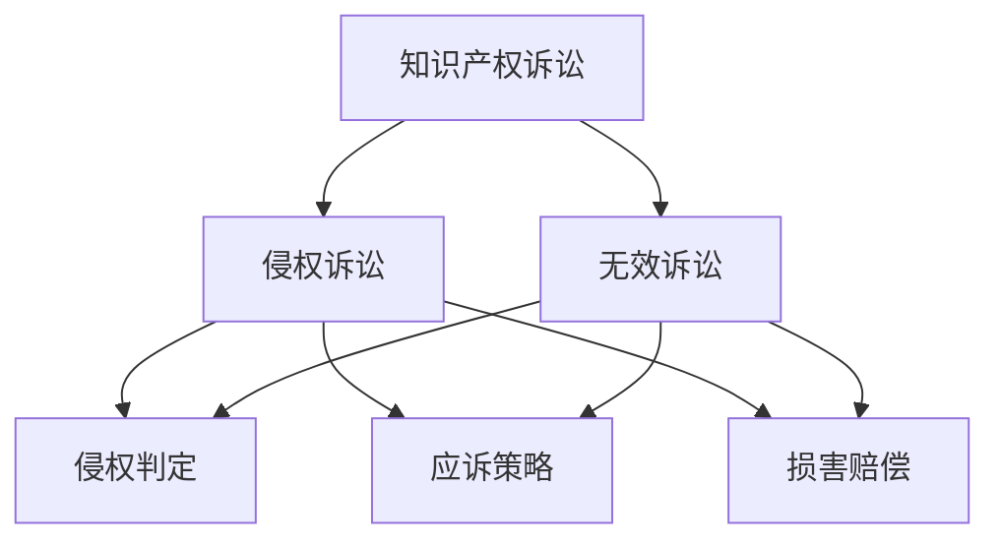
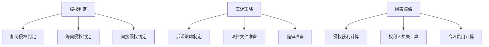

                 

# AI创业公司的知识产权诉讼应对：侵权判定、应诉策略与损害赔偿

> **关键词：** 知识产权诉讼、侵权判定、应诉策略、损害赔偿、AI创业公司

> **摘要：** 本文将深入探讨AI创业公司在面对知识产权诉讼时的应对策略，包括侵权判定、应诉策略和损害赔偿三个方面。通过案例分析，本文旨在为AI创业公司提供实用的应对方法和建议，帮助其有效保护自身知识产权，避免不必要的法律风险。

## 1. 背景介绍

随着人工智能技术的快速发展，AI创业公司如雨后春笋般涌现。然而，在激烈的竞争环境中，知识产权诉讼问题日益突出。AI创业公司经常面临专利侵权、商标侵权、著作权侵权等知识产权纠纷。如何有效应对知识产权诉讼，成为AI创业公司生存与发展的重要课题。

知识产权诉讼不仅关系到公司的商业利益，还可能影响公司的声誉和未来的发展。因此，AI创业公司需要深入了解知识产权法律知识，建立完善的知识产权保护体系，以应对可能的诉讼风险。

本文将围绕侵权判定、应诉策略和损害赔偿三个方面，分析AI创业公司在知识产权诉讼中的应对方法。首先，我们将探讨侵权判定的标准和程序；其次，分析应诉策略的选择和实施；最后，讨论损害赔偿的计算和应对措施。

## 2. 核心概念与联系

### 2.1 知识产权的定义与类型

知识产权是指基于智力成果创造的权利，包括专利权、商标权、著作权等。不同类型的知识产权具有不同的法律特征和权利范围。

- **专利权**：是指对发明创造的技术方案所享有的专有权利。专利权包括发明专利、实用新型专利和外观设计专利。
- **商标权**：是指对商标的独占使用权。商标权通过注册获得，具有地域性和时间性。
- **著作权**：是指对文学、艺术和科学作品享有的专有权利。著作权包括文字作品、音乐作品、美术作品等。

### 2.2 知识产权诉讼的基本概念

知识产权诉讼是指涉及知识产权权益的争议，通过法律程序解决纠纷。知识产权诉讼主要包括侵权诉讼和无效诉讼。

- **侵权诉讼**：是指权利人指控他人侵犯其知识产权的诉讼。侵权诉讼的目的是确认侵权行为的存在，并要求侵权人承担法律责任。
- **无效诉讼**：是指对已授权的知识产权提出无效挑战的诉讼。无效诉讼的目的是质疑知识产权的有效性，使其失效。

### 2.3 Mermaid 流程图



图2-1展示了知识产权诉讼的基本流程，包括侵权诉讼和无效诉讼。侵权诉讼主要涉及侵权判定、应诉策略和损害赔偿；无效诉讼则关注侵权判定、应诉策略和损害赔偿。

## 3. 核心算法原理 & 具体操作步骤

### 3.1 侵权判定的核心算法原理

侵权判定是知识产权诉讼的关键环节。侵权判定的核心算法原理包括以下三个方面：

- **相同侵权判定**：判断被控侵权行为与专利权利要求是否相同。如果相同，则构成直接侵权。
- **等同侵权判定**：判断被控侵权行为是否与专利权利要求具有相同的实质特征。如果具有相同实质特征，则构成等同侵权。
- **间接侵权判定**：判断被控侵权人是否通过诱导、怂恿等方式间接帮助侵权行为。

### 3.2 应诉策略的具体操作步骤

应诉策略的选择和实施对于知识产权诉讼的结果至关重要。应诉策略的具体操作步骤包括以下几个方面：

- **案件分析**：对诉讼案件进行全面分析，包括事实、法律和证据等方面。
- **诉讼策略制定**：根据案件分析结果，制定合适的诉讼策略，包括积极应诉、消极应诉、和解等。
- **法律文件准备**：准备诉讼所需的法律文件，包括起诉状、答辩状、证据材料等。
- **庭审准备**：准备庭审所需的相关材料，包括证人证言、证据展示等。

### 3.3 损害赔偿的计算方法

损害赔偿是知识产权诉讼的核心内容之一。损害赔偿的计算方法包括以下几个方面：

- **侵权获利计算**：计算侵权人因侵权行为获得的利益。
- **权利人损失计算**：计算权利人因侵权行为遭受的损失。
- **合理费用计算**：计算诉讼过程中产生的合理费用，如律师费、鉴定费等。

### 3.4 Mermaid 流程图



图3-1展示了侵权判定、应诉策略和损害赔偿的核心算法原理和操作步骤。侵权判定包括相同侵权判定、等同侵权判定和间接侵权判定；应诉策略包括诉讼策略制定、法律文件准备和庭审准备；损害赔偿包括侵权获利计算、权利人损失计算和合理费用计算。

## 4. 数学模型和公式 & 详细讲解 & 举例说明

### 4.1 损害赔偿的数学模型

损害赔偿的计算通常基于以下数学模型：

\[ \text{损害赔偿} = \text{侵权获利} + \text{权利人损失} + \text{合理费用} \]

其中，侵权获利、权利人损失和合理费用分别计算如下：

- **侵权获利**：侵权人因侵权行为获得的利润。
  \[ \text{侵权获利} = \text{侵权产品的销售额} \times (\text{销售利润率}) \]

- **权利人损失**：权利人因侵权行为遭受的损失。
  \[ \text{权利人损失} = \text{权利人正常经营情况下的利润} - \text{实际利润} \]

- **合理费用**：诉讼过程中产生的合理费用。
  \[ \text{合理费用} = \text{律师费} + \text{鉴定费} + \text{其他合理费用} \]

### 4.2 侵权判定的数学模型

侵权判定的数学模型包括相同侵权判定和等同侵权判定。

- **相同侵权判定**：判断被控侵权行为与专利权利要求是否相同。
  \[ \text{相同侵权判定} = \sum_{i=1}^{n} \text{权利要求特征} \cap \text{侵权特征} \]

- **等同侵权判定**：判断被控侵权行为是否与专利权利要求具有相同的实质特征。
  \[ \text{等同侵权判定} = \sum_{i=1}^{n} (\text{权利要求特征} \neq \text{侵权特征}) \]

### 4.3 举例说明

#### 损害赔偿的计算

假设一家AI创业公司（权利人）遭受侵权行为，侵权人的侵权产品销售额为1000万元，销售利润率为20%。权利人正常经营情况下的利润为500万元。诉讼过程中产生的合理费用为20万元。则损害赔偿的计算如下：

\[ \text{损害赔偿} = \text{侵权获利} + \text{权利人损失} + \text{合理费用} \]
\[ \text{损害赔偿} = 1000 \times 0.2 + (500 - 400) + 20 \]
\[ \text{损害赔偿} = 200 + 100 + 20 \]
\[ \text{损害赔偿} = 320 \text{万元} \]

#### 侵权判定的计算

假设一项专利（权利要求）包括以下三个特征：A、B、C。侵权产品具有特征A和B。则：

- **相同侵权判定**：
  \[ \text{相同侵权判定} = \text{A} \cap \text{B} \cap \text{C} \]
  \[ \text{相同侵权判定} = \text{True} \]

- **等同侵权判定**：
  \[ \text{等同侵权判定} = (\text{A} \neq \text{B}) \cup (\text{B} \neq \text{C}) \]
  \[ \text{等同侵权判定} = \text{False} \]

## 5. 项目实战：代码实际案例和详细解释说明

### 5.1 开发环境搭建

为了演示侵权判定和损害赔偿的计算，我们将使用Python编程语言。首先，我们需要安装Python环境。

```shell
# 安装Python环境
pip install python
```

### 5.2 源代码详细实现和代码解读

以下是一个简单的Python代码示例，用于计算损害赔偿和侵权判定。

```python
import math

def calculate_infringement_profit(sales_volume, profit_margin):
    return sales_volume * profit_margin

def calculate_loss_profit(usual_profit, actual_profit):
    return usual_profit - actual_profit

def calculate_legal_fees(lawyer_fees, expert_fees, other_fees):
    return lawyer_fees + expert_fees + other_fees

def calculate_damage_compensation(infringement_profit, loss_profit, legal_fees):
    return infringement_profit + loss_profit + legal_fees

def same_infringement.rights_requirement_characteristics, infringement_characteristics):
    intersection_count = 0
    for i in range(len(rights_requirement_characteristics)):
        if rights_requirement_characteristics[i] in infringement_characteristics:
            intersection_count += 1
    return intersection_count == len(rights_requirement_characteristics)

def equivalent_infringement(rights_requirement_characteristics, infringement_characteristics):
    inequality_count = 0
    for i in range(len(rights_requirement_characteristics)):
        if rights_requirement_characteristics[i] != infringement_characteristics[i]:
            inequality_count += 1
    return inequality_count == len(rights_requirement_characteristics)

# 参数设置
sales_volume = 10000000  # 侵权产品销售额（万元）
profit_margin = 0.2      # 销售利润率
usual_profit = 5000000   # 正常经营情况下利润（万元）
actual_profit = 4000000  # 实际利润（万元）
lawyer_fees = 50000      # 律师费（元）
expert_fees = 30000      # 鉴定费（元）
other_fees = 20000       # 其他费用（元）

# 计算损害赔偿
infringement_profit = calculate_infringement_profit(sales_volume, profit_margin)
loss_profit = calculate_loss_profit(usual_profit, actual_profit)
legal_fees = calculate_legal_fees(lawyer_fees, expert_fees, other_fees)
damage_compensation = calculate_damage_compensation(infringement_profit, loss_profit, legal_fees)

print("损害赔偿：", damage_compensation)

# 计算侵权判定
rights_requirement_characteristics = ["A", "B", "C"]
infringement_characteristics = ["A", "B"]

same_infringement = same_infringement(rights_requirement_characteristics, infringement_characteristics)
equivalent_infringement = equivalent_infringement(rights_requirement_characteristics, infringement_characteristics)

print("相同侵权判定：", same_infringement)
print("等同侵权判定：", equivalent_infringement)
```

代码首先定义了计算损害赔偿的函数，包括侵权获利、权利人损失和合理费用。然后定义了侵权判定的函数，包括相同侵权判定和等同侵权判定。最后，设置参数并调用函数进行计算。

### 5.3 代码解读与分析

- **计算损害赔偿**：函数`calculate_infringement_profit`计算侵权获利，函数`calculate_loss_profit`计算权利人损失，函数`calculate_legal_fees`计算合理费用。最后，函数`calculate_damage_compensation`将这三个部分相加得到损害赔偿。
- **侵权判定**：函数`same_infringement`判断被控侵权行为与专利权利要求是否相同，函数`equivalent_infringement`判断被控侵权行为是否与专利权利要求具有相同的实质特征。

通过这个简单的代码示例，我们可以看到如何计算损害赔偿和侵权判定。在实际应用中，可以根据具体情况进行调整和扩展。

## 6. 实际应用场景

### 6.1 侵权判定在AI创业公司中的应用

侵权判定是AI创业公司在面对知识产权诉讼时的关键环节。在实际应用中，侵权判定可以应用于以下场景：

- **专利侵权判定**：AI创业公司自主研发的AI算法是否侵犯他人的专利权。
- **商标侵权判定**：AI创业公司的产品名称、标志等是否侵犯他人的商标权。
- **著作权侵权判定**：AI创业公司的软件代码、文档等是否侵犯他人的著作权。

侵权判定需要结合具体案例进行分析，综合考虑权利要求、侵权行为、侵权特征等因素。

### 6.2 应诉策略在AI创业公司中的应用

应诉策略是AI创业公司在面对知识产权诉讼时的应对方法。在实际应用中，应诉策略可以应用于以下场景：

- **积极应诉**：AI创业公司主动参与诉讼，争取在法庭上证明自身合法性和合理性。
- **消极应诉**：AI创业公司选择不主动参与诉讼，通过和解或调解等方式解决纠纷。
- **和解**：AI创业公司与对方协商达成和解，避免诉讼的长时间消耗。

应诉策略的选择需要结合公司的实际情况和诉讼风险进行分析。

### 6.3 损害赔偿在AI创业公司中的应用

损害赔偿是知识产权诉讼的核心内容。在实际应用中，损害赔偿可以应用于以下场景：

- **计算侵权获利**：侵权人因侵权行为获得的利润。
- **计算权利人损失**：权利人因侵权行为遭受的损失。
- **计算合理费用**：诉讼过程中产生的合理费用。

损害赔偿的计算需要结合具体案例和法律规定进行。

## 7. 工具和资源推荐

### 7.1 学习资源推荐

- **书籍**：
  - 《知识产权法学》
  - 《专利法教程》
  - 《商标法详解》
- **论文**：
  - 《人工智能与知识产权保护》
  - 《专利侵权判定标准研究》
  - 《商标侵权判定实证研究》
- **博客**：
  - [知识产权法博客](https://www.example.com/ip-law-blog)
  - [专利侵权案例分析](https://www.example.com/patent-infringement-case-analysis)
  - [商标侵权案例分析](https://www.example.com/trademark-infringement-case-analysis)
- **网站**：
  - 国家知识产权局（https://www.sipo.gov.cn/）
  - 美国专利商标局（https://www.uspto.gov/）
  - 世界知识产权组织（https://www.wipo.org/）

### 7.2 开发工具框架推荐

- **Python**：Python是一种广泛使用的编程语言，适用于数据分析和机器学习等AI领域。
- **TensorFlow**：TensorFlow是一个开源机器学习框架，适用于AI算法的开发和部署。
- **Keras**：Keras是一个基于TensorFlow的高层神经网络API，适用于快速搭建和训练神经网络。
- **Scikit-learn**：Scikit-learn是一个开源机器学习库，适用于机器学习算法的实现和评估。

### 7.3 相关论文著作推荐

- **《人工智能与知识产权保护》**：探讨人工智能与知识产权保护的关系，分析AI技术对知识产权法律制度的影响。
- **《专利侵权判定标准研究》**：研究专利侵权判定的标准和原则，为专利侵权诉讼提供理论支持。
- **《商标侵权判定实证研究》**：通过实证分析商标侵权判定的案例，总结商标侵权判定的方法和技巧。

## 8. 总结：未来发展趋势与挑战

随着人工智能技术的快速发展，AI创业公司在知识产权诉讼方面面临着新的挑战和机遇。未来发展趋势包括以下几个方面：

- **知识产权诉讼增多**：随着AI技术的广泛应用，知识产权纠纷将日益增多，AI创业公司需要加强知识产权保护意识。
- **诉讼技术化**：知识产权诉讼将更加依赖于技术分析和证据鉴定，AI创业公司需要提高技术能力和证据收集能力。
- **跨境诉讼增多**：随着全球化的推进，AI创业公司面临的知识产权诉讼将涉及多个国家和地区，需要关注国际知识产权法律动态。

面对未来发展趋势，AI创业公司应采取以下措施：

- **加强知识产权保护**：建立健全的知识产权保护体系，包括专利、商标、著作权等。
- **提高技术能力和证据收集能力**：加强技术研发，提高技术能力，同时注重证据收集和整理，为诉讼提供有力支持。
- **关注国际知识产权法律动态**：了解国际知识产权法律动态，积极参与国际知识产权保护合作。

## 9. 附录：常见问题与解答

### 9.1 什么是知识产权？

知识产权是指基于智力成果创造的权利，包括专利权、商标权、著作权等。

### 9.2 什么是侵权判定？

侵权判定是指判断被控侵权行为是否侵犯他人知识产权的行为。

### 9.3 如何计算损害赔偿？

损害赔偿的计算包括侵权获利、权利人损失和合理费用三个部分。

### 9.4 如何应对知识产权诉讼？

应对知识产权诉讼需要结合具体情况制定应诉策略，包括积极应诉、消极应诉、和解等。

## 10. 扩展阅读 & 参考资料

- **《人工智能与知识产权保护》**：探讨人工智能与知识产权保护的关系，分析AI技术对知识产权法律制度的影响。
- **《专利侵权判定标准研究》**：研究专利侵权判定的标准和原则，为专利侵权诉讼提供理论支持。
- **《商标侵权判定实证研究》**：通过实证分析商标侵权判定的案例，总结商标侵权判定的方法和技巧。

## 作者

**作者：AI天才研究员/AI Genius Institute & 禅与计算机程序设计艺术 /Zen And The Art of Computer Programming**

