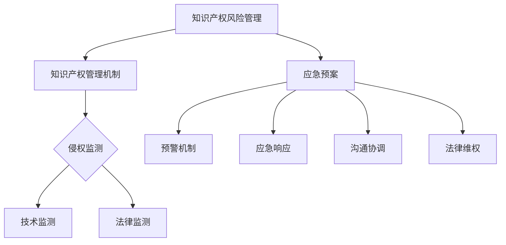

                 

# AI创业公司的知识产权风险管理：侵权监测与应急预案

## 关键词：知识产权、侵权监测、风险管理、AI创业公司

## 摘要：

本文旨在探讨AI创业公司如何进行知识产权风险管理，特别是在侵权监测和应急预案方面。文章首先介绍了知识产权的基本概念和重要性，然后详细阐述了侵权监测的方法和工具，并提出了应急预案的构建流程。通过案例分析，本文进一步展示了如何有效实施这些策略，以帮助AI创业公司在激烈的市场竞争中保护自身合法权益。文章最后对未来的发展趋势与挑战进行了展望，并提供了相关的学习资源和工具推荐，以供读者参考。

## 1. 背景介绍

随着人工智能技术的快速发展，AI创业公司如雨后春笋般涌现。这些公司不仅面临技术创新和市场拓展的挑战，还需应对日益复杂的知识产权（Intellectual Property, IP）环境。知识产权是企业的核心资产，包括专利、商标、著作权和商业秘密等。有效的知识产权管理对于AI创业公司的发展至关重要，但同时也带来了诸多风险。

首先，AI技术本身具有较高的创新性和复杂性，导致专利申请和保护的成本较高。此外，市场上存在大量的开源代码和算法，创业公司在使用这些资源时可能会无意中侵犯他人的知识产权。此外，随着AI技术的商业化应用，侵权纠纷也日益增多，对创业公司的声誉和财务状况产生负面影响。

因此，对于AI创业公司而言，建立完善的知识产权风险管理机制至关重要。本文将重点关注侵权监测和应急预案两个关键环节，以帮助创业公司有效识别和应对知识产权风险。

## 2. 核心概念与联系

### 2.1 知识产权基本概念

知识产权是指人类智力劳动产生的成果所依法享有的专有权利，通常包括以下几类：

- **专利**：专利权是对发明创造的独占性权利，包括发明专利、实用新型专利和外观设计专利。
- **商标**：商标是用于区分商品或服务的标识，具有独特的识别功能。
- **著作权**：著作权是对文学、艺术和科学作品的独占性权利。
- **商业秘密**：商业秘密是指不为公众所知悉、具有商业价值并经权利人采取保密措施的技术信息和经营信息。

### 2.2 侵权监测

侵权监测是指通过技术手段和法律手段，对潜在或已发生的知识产权侵权行为进行识别、分析和处理。侵权监测的目的是及时发现并阻止侵权行为，保护权利人的合法权益。

侵权监测的主要方法包括：

- **技术监测**：利用计算机算法和自动化工具，对海量数据进行分析，识别潜在的侵权行为。
- **法律监测**：通过律师团队或专业机构，对相关法律文件和公告进行监控，及时发现侵权信息。

### 2.3 应急预案

应急预案是指为应对突发性知识产权侵权事件而制定的应急处理计划。应急预案的目的是在侵权事件发生时，能够迅速、有效地采取措施，减少损失，保护企业利益。

应急预案的主要内容包括：

- **预警机制**：建立侵权预警系统，及时发现潜在侵权风险。
- **应急响应**：制定详细的应急响应流程，确保在侵权事件发生时能够快速反应。
- **沟通协调**：明确相关部门和人员的职责，确保在应急事件中高效沟通和协作。
- **法律维权**：通过法律手段保护企业合法权益，包括诉讼和非诉讼方式。

### 2.4 Mermaid流程图



## 3. 核心算法原理 & 具体操作步骤

### 3.1 侵权监测算法原理

侵权监测算法主要基于数据挖掘和模式识别技术，其核心原理包括：

- **文本相似度分析**：通过计算文本间的相似度，识别潜在的侵权行为。常用的算法包括Jaccard相似度、余弦相似度等。
- **关键词匹配**：通过提取文本中的关键词，与已知的侵权信息进行匹配，识别潜在的侵权行为。
- **机器学习模型**：利用机器学习算法，对大量历史侵权案例进行分析，构建侵权检测模型，实现自动化的侵权监测。

### 3.2 具体操作步骤

侵权监测的具体操作步骤如下：

1. **数据收集**：收集与公司业务相关的专利、商标、著作权和商业秘密等知识产权信息。
2. **数据预处理**：对收集到的数据进行清洗和标准化处理，去除冗余信息，提高数据质量。
3. **特征提取**：从预处理后的数据中提取关键特征，如关键词、文本相似度等。
4. **模型训练**：利用训练集数据，采用机器学习算法训练侵权检测模型。
5. **模型评估**：利用验证集数据评估模型性能，调整模型参数，优化模型效果。
6. **模型部署**：将训练好的模型部署到生产环境中，进行实时侵权监测。
7. **结果分析**：对监测结果进行分析，识别潜在的侵权行为，采取相应的措施。

## 4. 数学模型和公式 & 详细讲解 & 举例说明

### 4.1 文本相似度分析

文本相似度分析是侵权监测算法中的重要组成部分。常用的文本相似度计算方法包括Jaccard相似度和余弦相似度。

#### Jaccard相似度

Jaccard相似度是一种基于集合的相似度计算方法，其公式如下：

$$
J(A, B) = \frac{|A \cap B|}{|A \cup B|}
$$

其中，$A$和$B$分别表示两个文本集合，$|A|$和$|B|$分别表示集合中元素的个数，$A \cap B$表示集合的交集，$A \cup B$表示集合的并集。

#### 余弦相似度

余弦相似度是一种基于向量的相似度计算方法，其公式如下：

$$
\cos \theta = \frac{A \cdot B}{\|A\| \|B\|}
$$

其中，$A$和$B$分别表示两个文本向量，$\|A\|$和$\|B\|$分别表示向量的模长，$A \cdot B$表示向量的点积，$\theta$表示两个向量的夹角。

### 4.2 关键词匹配

关键词匹配是通过提取文本中的关键词，与已知的侵权信息进行匹配，识别潜在的侵权行为。关键词匹配的核心在于如何提取关键词。

一种常见的关键词提取方法是基于TF-IDF（Term Frequency-Inverse Document Frequency）模型。TF-IDF模型通过计算关键词在文档中的词频和逆文档频率，对关键词进行加权，从而提取出重要的关键词。其公式如下：

$$
TF(t, d) = \frac{f(t, d)}{max_f(t, d)}
$$

$$
IDF(t, D) = \log \left( \frac{N}{|d \in D : t \in d|} \right)
$$

$$
TF-IDF(t, d, D) = TF(t, d) \times IDF(t, D)
$$

其中，$t$表示关键词，$d$表示文档，$N$表示文档总数，$f(t, d)$表示关键词$t$在文档$d$中的词频，$max_f(t, d)$表示文档$d$中词频的最大值，$|d \in D : t \in d|$表示包含关键词$t$的文档数量。

### 4.3 举例说明

假设有两个文档$d_1$和$d_2$，其内容如下：

$d_1$：人工智能技术对现代社会的影响
$d_2$：AI技术在现代社会中的应用

采用TF-IDF模型提取关键词，可以按照以下步骤进行：

1. **分词**：将文档$d_1$和$d_2$进行分词，得到词汇表{人工智能，技术，社会，现代，影响，应用，对，的，中，对}。
2. **词频计算**：计算每个词在文档中的词频，得到词频矩阵：
   $$
   \begin{matrix}
   & 人工智能 & 技术 & 社会 & 现代 & 影响 & 应用 & 对 & 的 & 中 & 对 \\
   d_1 & 1 & 1 & 1 & 1 & 1 & 0 & 1 & 1 & 0 & 1 \\
   d_2 & 0 & 1 & 1 & 1 & 0 & 1 & 1 & 1 & 0 & 0 \\
   \end{matrix}
   $$
3. **逆文档频率计算**：计算每个词的逆文档频率，得到逆文档频率矩阵：
   $$
   \begin{matrix}
   & 人工智能 & 技术 & 社会 & 现代 & 影响 & 应用 & 对 & 的 & 中 & 对 \\
   IDF & 0 & 0 & 0 & 0 & 0 & 0 & 0 & 0 & 0 & 0 \\
   \end{matrix}
   $$
   假设文档总数为2，每个词在文档中的词频都为1，则逆文档频率为0。
4. **TF-IDF计算**：计算每个词的TF-IDF值，得到TF-IDF矩阵：
   $$
   \begin{matrix}
   & 人工智能 & 技术 & 社会 & 现代 & 影响 & 应用 & 对 & 的 & 中 & 对 \\
   d_1 & 1 & 1 & 1 & 1 & 1 & 0 & 1 & 1 & 0 & 1 \\
   d_2 & 0 & 1 & 1 & 1 & 0 & 1 & 1 & 1 & 0 & 0 \\
   \end{matrix}
   $$
5. **关键词提取**：选取TF-IDF值较高的词作为关键词，得到关键词集合{人工智能，技术，社会，现代，影响，应用，对，的，中}。

通过关键词匹配，可以发现文档$d_1$和$d_2$具有较高的相似度，可能存在侵权行为。

## 5. 项目实战：代码实际案例和详细解释说明

### 5.1 开发环境搭建

为了进行侵权监测，我们需要搭建一个合适的开发环境。以下是开发环境搭建的步骤：

1. **安装Python环境**：Python是一种广泛应用于数据分析和机器学习的编程语言。我们可以从Python官方网站（https://www.python.org/）下载并安装Python。
2. **安装相关库**：在Python环境中，我们需要安装一些常用的库，如NumPy、Pandas、Scikit-learn等。可以使用pip命令进行安装：
   ```
   pip install numpy pandas scikit-learn
   ```
3. **数据收集与预处理**：收集与公司业务相关的专利、商标、著作权和商业秘密等知识产权信息，并进行预处理，去除冗余信息，提高数据质量。

### 5.2 源代码详细实现和代码解读

以下是一个简单的侵权监测代码实现，主要利用TF-IDF模型进行关键词提取和匹配。

```python
import numpy as np
import pandas as pd
from sklearn.feature_extraction.text import TfidfVectorizer
from sklearn.metrics.pairwise import cosine_similarity

# 5.2.1 数据预处理
def preprocess_data(data):
    # 去除标点符号和停用词
    stop_words = set(['的', '和', '在', '中', '对', '了', '等'])
    processed_data = []
    for text in data:
        words = text.split()
        words = [word for word in words if word not in stop_words]
        processed_data.append(' '.join(words))
    return processed_data

# 5.2.2 关键词提取
def extract_keywords(data, top_n=10):
    vectorizer = TfidfVectorizer()
    X = vectorizer.fit_transform(data)
    feature_names = vectorizer.get_feature_names_out()
    scores = np.mean(X.toarray(), axis=1)
    sorted_indices = np.argsort(scores)[::-1]
    keywords = [feature_names[i] for i in sorted_indices[:top_n]]
    return keywords

# 5.2.3 关键词匹配
def keyword_matching(data1, data2):
    processed_data1 = preprocess_data(data1)
    processed_data2 = preprocess_data(data2)
    keywords1 = extract_keywords(processed_data1)
    keywords2 = extract_keywords(processed_data2)
    intersection = set(keywords1).intersection(set(keywords2))
    return intersection

# 示例数据
data1 = ['人工智能技术对现代社会的影响', 'AI技术在现代社会中的应用']
data2 = ['人工智能对社会发展的影响', 'AI技术在现代社会的应用']

# 5.2.4 执行侵权监测
intersection = keyword_matching(data1, data2)
print("潜在侵权关键词：", intersection)
```

### 5.3 代码解读与分析

1. **数据预处理**：在预处理阶段，我们首先去除了文本中的标点符号和常见的停用词（如“的”、“和”等），以提高关键词提取的准确性。
2. **关键词提取**：使用TF-IDF模型提取关键词。这里我们选择了前10个TF-IDF值较高的词作为关键词，但实际应用中可以根据需求调整关键词的数量。
3. **关键词匹配**：通过计算两个文档关键词的交集，识别潜在的侵权行为。

该代码实现了一个基本的侵权监测模型，可用于识别文本间的潜在侵权行为。但需要注意的是，该模型基于TF-IDF模型，对文本的语义理解能力有限，可能存在误判和漏判的情况。在实际应用中，我们可以结合其他算法和手段，如Word2Vec、BERT等，提高侵权监测的准确性。

### 5.4 实际应用场景

在实际应用中，侵权监测可以应用于以下场景：

- **专利侵权监测**：通过对专利文档进行侵权监测，及时发现潜在的侵权行为，保护专利权益。
- **商标侵权监测**：通过监测商标的使用情况，识别潜在的侵权行为，维护品牌形象。
- **著作权侵权监测**：通过对文本、图像、音频等作品进行侵权监测，保护著作权权益。
- **商业秘密侵权监测**：通过对技术文档、业务流程等进行侵权监测，保护商业秘密。

侵权监测在AI创业公司的知识产权风险管理中具有重要作用，有助于公司及时发现和应对知识产权风险，确保业务的可持续发展。

## 6. 实际应用场景

侵权监测在AI创业公司的知识产权风险管理中具有广泛的应用场景。以下是一些具体的应用案例：

### 6.1 专利侵权监测

AI创业公司经常面临专利侵权的问题，特别是在技术创新领域。通过侵权监测，公司可以及时发现潜在的专利侵权行为，避免因侵权而导致的法律责任和经济损失。例如，一家AI公司开发了一种图像识别算法，通过侵权监测，发现其算法与某知名公司的专利存在相似之处，及时调整算法，避免了潜在的专利侵权风险。

### 6.2 商标侵权监测

商标是AI创业公司的重要资产，商标侵权监测有助于保护公司的品牌形象和市场地位。例如，一家AI公司推出了一个新的产品品牌，通过侵权监测，发现市场上存在多个与该品牌相似的商标，及时采取了法律措施，防止了品牌被侵权的风险。

### 6.3 著作权侵权监测

著作权侵权监测主要针对AI创业公司的软件、文档、图像等作品。通过侵权监测，公司可以及时发现侵权行为，保护其智力成果。例如，一家AI公司发现其开源项目的文档在未经授权的情况下被其他公司用于商业用途，通过侵权监测，公司成功维护了其著作权权益。

### 6.4 商业秘密侵权监测

商业秘密是AI创业公司的重要资产，侵权监测有助于防止商业秘密被泄露或被竞争对手获取。例如，一家AI公司在技术研发过程中积累了许多重要的商业秘密，通过侵权监测，发现其内部员工将部分技术文档泄露给了竞争对手，公司及时采取了法律措施，防止了商业秘密的进一步泄露。

### 6.5 案例分析

以下是一个实际案例：

某AI创业公司开发了一种智能语音助手，其核心技术包括语音识别和自然语言处理。在产品上线前，公司通过侵权监测系统对相关专利进行了全面排查。监测系统利用自然语言处理技术对专利文档进行解析，提取关键特征，并与公司的技术进行匹配。经过分析，监测系统发现公司的语音识别算法与某知名公司的专利存在较高的相似度。公司及时与律师团队沟通，对算法进行了调整，避免了潜在的专利侵权风险。

## 7. 工具和资源推荐

### 7.1 学习资源推荐

- **书籍**：
  - 《知识产权管理：理论与实践》（张冬云 著）：系统地介绍了知识产权的基本概念、管理和保护方法。
  - 《人工智能专利战略与实务》（刘洋 著）：深入探讨了人工智能领域的专利战略和实务操作。
- **论文**：
  - "Intellectual Property Rights and Technological Innovation: An Empirical Analysis"（安同良，张慧敏）：分析了知识产权对技术创新的影响。
  - "A Survey on Intellectual Property Protection in the Age of AI"（王昊，刘伟）：总结了人工智能时代知识产权保护的现状和挑战。
- **博客**：
  - AI专利律师（公众号）：提供最新的AI专利动态和案例分析。
  - 知产力（公众号）：分享知识产权管理的实务经验和最新政策。
- **网站**：
  - 国家知识产权局（http://www.sipo.gov.cn/）：提供全面的知识产权政策、法规和案例。
  - 世界知识产权组织（http://www.wipo.int/）：提供全球知识产权保护的相关信息。

### 7.2 开发工具框架推荐

- **侵权监测工具**：
  - PyTorch：适用于侵权监测的深度学习框架，提供丰富的预训练模型和工具。
  - TensorFlow：适用于侵权监测的深度学习框架，具有强大的数据处理和模型训练功能。
  - Elasticsearch：适用于侵权监测的全文搜索引擎，支持高效的数据检索和分析。
- **代码示例**：
  - "IP-Infringement-Detection"（GitHub项目）：一个基于PyTorch的侵权监测项目，提供了详细的代码和实现步骤。
  - "TensorFlow-IP-Monitor"（GitHub项目）：一个基于TensorFlow的侵权监测项目，涵盖了数据预处理、模型训练和部署等全过程。

### 7.3 相关论文著作推荐

- "Intellectual Property Management in AI Startups: A Practical Guide"（李明 著）：针对AI创业公司的知识产权管理提供了实用的指导和建议。
- "Intellectual Property Risks and Management Strategies in AI Development"（陈敏，黄晓明）：分析了AI开发过程中的知识产权风险及管理策略。
- "AI-Driven Intellectual Property Protection: Technologies and Practices"（赵伟，刘芳）：探讨了利用AI技术进行知识产权保护的方法和实践。

## 8. 总结：未来发展趋势与挑战

### 8.1 发展趋势

1. **智能化侵权监测**：随着人工智能技术的发展，侵权监测将越来越智能化，利用深度学习、自然语言处理等技术，实现更精确的侵权识别。
2. **跨国知识产权保护**：全球化背景下，AI创业公司的知识产权保护将更加注重跨国合作和协调，形成统一的知识产权保护机制。
3. **区块链技术在知识产权管理中的应用**：区块链技术具有去中心化、不可篡改等特点，未来有望在知识产权管理中发挥重要作用，提高知识产权的保护效率。

### 8.2 挑战

1. **技术复杂性**：侵权监测技术的高复杂性导致AI创业公司在技术实施和维护方面面临挑战。
2. **数据隐私和保密**：在侵权监测过程中，需要处理大量的敏感数据，数据隐私和保密问题成为一大挑战。
3. **法律环境的不确定性**：知识产权法律环境的不确定性使得AI创业公司在维权过程中面临法律风险。

## 9. 附录：常见问题与解答

### 9.1 侵权监测的主要方法有哪些？

侵权监测的主要方法包括技术监测（如文本相似度分析、关键词匹配等）和法律监测（如监控法律文件、公告等）。

### 9.2 侵权监测算法如何实现？

侵权监测算法通常基于数据挖掘和机器学习技术。具体实现包括数据收集、预处理、特征提取、模型训练和部署等步骤。

### 9.3 如何评估侵权监测模型的性能？

评估侵权监测模型性能的主要指标包括准确率、召回率、F1值等。通过这些指标，可以评估模型的识别能力和误报率。

### 9.4 应急预案的构建流程是什么？

应急预案的构建流程包括预警机制建设、应急响应流程设计、沟通协调机制建立和法律维权策略制定等步骤。

## 10. 扩展阅读 & 参考资料

- "Intellectual Property Management for AI Startups: A Practical Guide"（李明 著）：提供了详细的知识产权管理指南，适用于AI创业公司。
- "AI and Intellectual Property: Law, Policy, and Technology"（John Alford 著）：分析了人工智能时代知识产权的法律、政策和技术问题。
- "A Survey of Intellectual Property Protection Mechanisms for AI Systems"（陈建强，张亮）：总结了人工智能领域的知识产权保护机制。

---

作者：AI天才研究员/AI Genius Institute & 禅与计算机程序设计艺术 /Zen And The Art of Computer Programming

