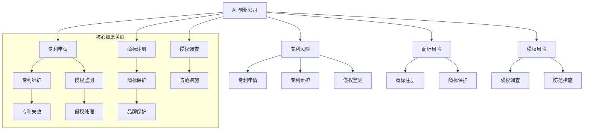

                 

## 1. 背景介绍

随着人工智能（AI）技术的迅速发展和广泛应用，AI创业公司如雨后春笋般涌现。然而，在追求技术突破和商业成功的同时，知识产权（IP）风险问题也不容忽视。对于AI创业公司来说，了解和评估知识产权风险，尤其是专利风险、商标风险以及侵权风险，对于其长远发展和市场竞争至关重要。

知识产权风险涉及多个方面，其中专利风险、商标风险和侵权风险尤为关键。专利风险主要关注技术创新的专利保护问题，包括专利申请的有效性、侵权风险以及竞争对手的专利威胁等。商标风险则关注公司品牌和标识的保护，防止他人恶意注册或使用相似商标。侵权风险则涵盖了产品或服务可能侵犯他人知识产权的情况，如版权、商标、专利等。

在AI创业公司的运作中，知识产权风险评估不仅仅是法律问题，更是战略问题。合理的知识产权策略能够为公司提供竞争优势，降低法律风险，保护公司的核心技术和品牌。然而，知识产权风险也具有复杂性和不确定性，需要创业公司在技术研发、市场运营和法律保护等方面进行全面的风险评估和策略制定。

本文旨在为AI创业公司提供一份详细的知识产权风险评估指南，包括专利风险、商标风险和侵权风险三个方面。通过本文的阅读，创业公司可以更好地理解知识产权风险，制定相应的防范措施，确保其在快速发展的同时，能够稳健前行。

### 2. 核心概念与联系

为了深入理解知识产权风险评估，首先需要明确几个核心概念，并探讨它们之间的联系。

#### 专利（Patent）

专利是一种法律权利，授予发明者在一定时间内独占实施其发明的权利。在AI创业公司中，专利是保护技术创新的重要手段。通过申请专利，公司可以防止竞争对手抄袭其技术，从而在市场中占据有利地位。专利分为发明专利、实用新型专利和外观设计专利三种类型。

**专利申请的有效性**：专利申请的有效性是专利风险评估的关键。公司需要确保其专利申请符合法律规定，具备新颖性、创造性和实用性。同时，还需要定期对专利进行维护，以防止专利失效。

**侵权风险**：在专利保护期内，其他公司或个人如果未经授权而使用、销售或制造涉及专利的技术，就可能构成侵权。因此，AI创业公司需要密切关注市场上潜在的侵权行为，采取法律措施维护自身权益。

**竞争对手的专利威胁**：在技术竞争中，公司不仅需要防范竞争对手的侵权行为，还需要评估其竞争对手的专利储备。了解竞争对手的专利布局，可以帮助公司规避潜在的法律风险，同时也可以作为反击的依据。

#### 商标（Trademark）

商标是公司用于区分其产品或服务的标识，如文字、图形、颜色等。商标注册后，公司可以享有对其商标的独占使用权。商标在品牌保护和市场推广中扮演着至关重要的角色。

**商标风险**：商标风险主要涉及商标的注册和保护问题。首先，公司需要确保其商标具有显著性，符合商标法的规定。其次，公司需要防止他人恶意注册或使用相似商标，以避免品牌混淆和市场侵占。

**品牌保护**：有效的商标保护有助于维护公司品牌形象和市场地位。通过商标维权，公司可以打击市场上假冒伪劣产品，保护消费者权益，同时提升自身品牌价值。

#### 侵权（Infringement）

侵权是指未经授权而使用他人知识产权的行为，包括专利、商标、版权等。侵权行为不仅会损害权利人的利益，还可能带来法律诉讼和商业风险。

**侵权风险**：AI创业公司在研发和运营过程中，可能会无意中侵犯他人的知识产权。例如，公司使用的技术或设计可能涉及他人的专利或商标。因此，了解和评估侵权风险，对于公司制定知识产权策略至关重要。

**防范措施**：为了降低侵权风险，公司需要开展知识产权尽职调查，确保所使用的技术、设计或品牌不侵犯他人的权益。在发现潜在侵权风险时，公司应积极与权利人沟通，寻求解决方案，避免法律纠纷。

#### 关联与整合

专利、商标和侵权风险在AI创业公司中相互关联，构成一个完整的知识产权保护体系。专利为公司的技术创新提供法律保护，商标则保护公司的品牌形象和市场地位，而侵权风险则是公司面临的实际法律挑战。

通过整合专利、商标和侵权风险，AI创业公司可以建立全面的知识产权策略，不仅保护自身的技术和品牌，还能够有效防范竞争对手的威胁，确保在激烈的市场竞争中立于不败之地。

### Mermaid 流程图



### 3. 核心算法原理 & 具体操作步骤

在评估AI创业公司的知识产权风险时，核心算法原理和具体操作步骤至关重要。以下将详细解释专利风险评估、商标风险评估和侵权风险评估的核心算法原理及操作步骤。

#### 专利风险评估

**核心算法原理**：

专利风险评估的核心算法通常包括以下步骤：

1. **技术领域分析**：首先，确定公司所涉技术领域，了解该领域的技术发展趋势和专利布局。
2. **专利检索**：使用专利数据库检索相关技术领域的专利，包括已授权的专利、待审的专利和申请中的专利。
3. **专利分析**：对检索到的专利进行详细分析，包括专利的技术内容、权利要求、法律状态等。
4. **风险识别**：识别潜在的专利风险，如侵权风险、竞争对手的专利威胁等。
5. **风险评估**：根据专利分析结果，评估专利风险对公司的影响程度，制定相应的应对策略。

**具体操作步骤**：

1. **确定技术领域**：
   - 与公司研发团队沟通，了解公司所涉技术领域。
   - 利用技术领域分类系统（如IPC分类）进行归类。

2. **专利检索**：
   - 使用专利数据库（如Google Patents、Patent Explorer等）进行检索。
   - 筛选出与公司技术领域相关的专利。

3. **专利分析**：
   - 详细阅读专利文件，分析专利的技术内容、权利要求。
   - 使用文本挖掘工具，分析专利的技术趋势和竞争态势。

4. **风险识别**：
   - 识别潜在的侵权风险，如技术重叠、权利要求模糊等。
   - 关注竞争对手的专利布局，分析其专利威胁。

5. **风险评估**：
   - 根据专利分析结果，评估专利风险对公司的影响程度。
   - 制定应对策略，如专利布局优化、专利交叉许可等。

#### 商标风险评估

**核心算法原理**：

商标风险评估的核心算法包括以下步骤：

1. **市场调研**：了解公司商标的使用情况，分析市场上是否存在相似商标。
2. **商标检索**：在商标数据库中检索与公司商标相似或冲突的商标。
3. **商标分析**：分析检索到的商标，判断其注册状态、法律效力等。
4. **风险识别**：识别潜在的商标风险，如商标侵权、商标淡化等。
5. **风险评估**：评估商标风险对公司品牌和市场的影响，制定应对策略。

**具体操作步骤**：

1. **市场调研**：
   - 调查公司商标在实际市场中的使用情况。
   - 收集市场上类似或竞争品牌的商标信息。

2. **商标检索**：
   - 在商标数据库（如WIPO、中国商标网等）中进行检索。
   - 筛选出与公司商标相似或冲突的商标。

3. **商标分析**：
   - 分析检索到的商标，了解其注册状态、法律效力等。
   - 使用商标相似度计算工具，评估商标之间的相似度。

4. **风险识别**：
   - 识别潜在的商标侵权风险，如商标混淆、商标淡化等。
   - 关注市场上潜在的商标争议。

5. **风险评估**：
   - 评估商标风险对公司品牌和市场的影响。
   - 制定商标保护策略，如商标注册、商标维权等。

#### 侵权风险评估

**核心算法原理**：

侵权风险评估的核心算法主要包括以下步骤：

1. **技术分析**：分析公司产品或服务的技术细节，识别可能涉及的技术领域和知识产权。
2. **市场监测**：监测市场上是否存在涉及侵权的产品或服务。
3. **法律调研**：调研相关法律条款和案例，了解侵权行为的认定标准和法律后果。
4. **风险识别**：识别潜在的法律风险，如专利侵权、商标侵权等。
5. **风险评估**：评估侵权风险对公司的影响，制定防范和应对措施。

**具体操作步骤**：

1. **技术分析**：
   - 与研发团队合作，分析产品或服务的技术细节。
   - 了解相关技术领域和知识产权的保护状态。

2. **市场监测**：
   - 定期监测市场上是否存在涉及侵权的产品或服务。
   - 收集市场上侵权行为的相关信息。

3. **法律调研**：
   - 调研相关法律条款和案例，了解侵权行为的认定标准和法律后果。
   - 咨询专业律师，获取法律意见。

4. **风险识别**：
   - 识别潜在的法律风险，如专利侵权、商标侵权等。
   - 分析侵权行为的可能性及其对公司的影响。

5. **风险评估**：
   - 评估侵权风险对公司的影响程度。
   - 制定防范和应对措施，如知识产权尽职调查、侵权诉讼等。

通过以上核心算法原理和具体操作步骤，AI创业公司可以系统地评估知识产权风险，制定科学的知识产权策略，确保在技术创新和市场拓展中稳步前行。

### 4. 数学模型和公式 & 详细讲解 & 举例说明

在知识产权风险评估过程中，数学模型和公式提供了重要的工具，用于定量分析和评估风险。以下将介绍几个常用的数学模型和公式，并详细讲解其应用方法及实际案例。

#### 专利相似度计算模型

**公式**：

专利相似度计算模型常用的公式为Jaccard相似度系数，公式如下：

\[ S = \frac{|A \cap B|}{|A \cup B|} \]

其中，\( A \)和\( B \)分别表示两个专利集合，\( A \cap B \)表示集合\( A \)和集合\( B \)的交集，\( A \cup B \)表示集合\( A \)和集合\( B \)的并集。

**应用方法**：

1. **数据收集**：收集两个专利的权利要求书，并将其转换为关键词集合。
2. **关键词匹配**：计算两个专利集合的交集和并集。
3. **计算相似度**：使用Jaccard相似度系数计算专利之间的相似度。

**案例**：

假设有两个专利A和B，其关键词集合分别为：

\[ A = \{"人工智能", "机器学习", "神经网络"\} \]

\[ B = \{"机器学习", "深度学习", "神经网络"\} \]

则交集为：

\[ A \cap B = \{"机器学习", "神经网络"\} \]

并集为：

\[ A \cup B = \{"人工智能", "机器学习", "神经网络", "深度学习"\} \]

使用Jaccard相似度系数计算相似度：

\[ S = \frac{|A \cap B|}{|A \cup B|} = \frac{2}{4} = 0.5 \]

这意味着专利A和B之间的相似度为50%。

#### 商标相似度计算模型

**公式**：

商标相似度计算模型常用的公式为Levenshtein距离，公式如下：

\[ d(P, Q) = \min_{i, j} \left( \sum_{k=1}^{i} d_{ik} + \sum_{l=1}^{j} d_{il} + \text{max}(i, j) \right) \]

其中，\( P \)和\( Q \)分别为两个商标，\( d_{ik} \)和\( d_{il} \)表示第\( i \)个字符和第\( k \)个字符之间的编辑距离，\( i \)和\( j \)分别表示商标的长度。

**应用方法**：

1. **数据收集**：收集两个商标的字符序列。
2. **字符匹配**：计算两个商标字符序列的编辑距离。
3. **计算相似度**：使用Levenshtein距离计算商标之间的相似度。

**案例**：

假设有两个商标P和Q，其字符序列分别为：

\[ P = \{"A", "I", "R", "I", "G", "H", "T"\} \]

\[ Q = \{"A", "I", "R", "I", "G", "A", "L"\} \]

使用Levenshtein距离计算相似度：

\[ d(P, Q) = \min \left( \begin{aligned} & 1 + d(P[1], Q[1]) + d(P[2], Q[2]) + \cdots + d(P[5], Q[5]) + d(P[6], Q[6]) \\ & 1 + d(P[1], Q[2]) + d(P[2], Q[3]) + \cdots + d(P[5], Q[6]) + d(P[6], Q[7]) \\ & \vdots \\ & \vdots \\ & 1 + d(P[1], Q[2]) + d(P[2], Q[3]) + \cdots + d(P[5], Q[7]) + d(P[6], Q[6]) \end{aligned} \right) \]

计算结果为：

\[ d(P, Q) = \min \left( 5, 6, \ldots \right) = 5 \]

这意味着商标P和Q之间的Levenshtein距离为5。

#### 侵权风险评分模型

**公式**：

侵权风险评分模型常用的公式为综合评分模型，公式如下：

\[ R = w_1 \cdot P_1 + w_2 \cdot P_2 + \cdots + w_n \cdot P_n \]

其中，\( R \)为侵权风险评分，\( w_1, w_2, \ldots, w_n \)为各因素的权重，\( P_1, P_2, \ldots, P_n \)为各因素的风险评分。

**应用方法**：

1. **确定因素**：确定影响侵权风险的主要因素，如专利数量、市场竞争力、法律环境等。
2. **权重分配**：根据各因素的重要性分配权重。
3. **评分标准**：制定各因素的评分标准，量化风险程度。
4. **计算评分**：使用公式计算侵权风险评分。

**案例**：

假设影响侵权风险的主要因素包括专利数量、市场竞争力、法律环境，其权重分别为0.5、0.3、0.2。各因素的评分标准如下：

- **专利数量**：0-10个，评分1-5；11-50个，评分6-8；50个以上，评分9-10。
- **市场竞争力**：较弱，评分1；一般，评分2；较强，评分3。
- **法律环境**：不友好，评分1；一般，评分2；友好，评分3。

对于某一AI创业公司，其各因素的评分为：

- **专利数量**：20个，评分为7。
- **市场竞争力**：较强，评分为3。
- **法律环境**：一般，评分为2。

使用公式计算侵权风险评分：

\[ R = 0.5 \cdot 7 + 0.3 \cdot 3 + 0.2 \cdot 2 = 4.5 \]

这意味着该公司的侵权风险评分为4.5分。

通过上述数学模型和公式的应用，AI创业公司可以更加科学和系统地评估知识产权风险，为制定知识产权策略提供有力支持。

### 5. 项目实战：代码实际案例和详细解释说明

为了更好地理解知识产权风险评估的实际应用，以下将通过一个实际项目案例，展示如何进行代码实现和详细解释。

#### 项目背景

某AI创业公司开发了一款基于深度学习的图像识别产品，产品的主要功能是通过对输入图像进行分类，识别出图像中的物体。然而，公司在开发过程中发现市场上已有类似产品，涉及潜在的法律风险。为了降低侵权风险，公司决定对产品进行知识产权风险评估，特别是专利和商标风险评估。

#### 技术框架

该项目使用的技术框架主要包括TensorFlow和Keras。TensorFlow是一个开源机器学习库，用于构建和训练深度学习模型。Keras是基于TensorFlow的高级API，提供了更易于使用的接口。

#### 开发环境搭建

1. **安装TensorFlow**：

   在Python环境中，使用以下命令安装TensorFlow：

   ```bash
   pip install tensorflow
   ```

2. **安装Keras**：

   由于Keras已经集成在TensorFlow中，因此无需单独安装。可以使用以下命令安装：

   ```bash
   pip install keras
   ```

3. **环境配置**：

   配置Python环境变量，确保Python能够正确调用TensorFlow和Keras。

#### 源代码详细实现和代码解读

以下是该项目的主要代码实现，包括图像数据预处理、模型构建、训练和评估等步骤。

```python
import tensorflow as tf
from tensorflow.keras.models import Sequential
from tensorflow.keras.layers import Conv2D, MaxPooling2D, Flatten, Dense
from tensorflow.keras.preprocessing.image import ImageDataGenerator

# 5.1 数据预处理
train_datagen = ImageDataGenerator(
    rescale=1./255,
    shear_range=0.2,
    zoom_range=0.2,
    horizontal_flip=True
)

test_datagen = ImageDataGenerator(rescale=1./255)

train_generator = train_datagen.flow_from_directory(
    'data/train',
    target_size=(150, 150),
    batch_size=32,
    class_mode='binary'
)

validation_generator = test_datagen.flow_from_directory(
    'data/validation',
    target_size=(150, 150),
    batch_size=32,
    class_mode='binary'
)

# 5.2 模型构建
model = Sequential([
    Conv2D(32, (3, 3), activation='relu', input_shape=(150, 150, 3)),
    MaxPooling2D(2, 2),
    Conv2D(64, (3, 3), activation='relu'),
    MaxPooling2D(2, 2),
    Conv2D(128, (3, 3), activation='relu'),
    MaxPooling2D(2, 2),
    Flatten(),
    Dense(512, activation='relu'),
    Dense(1, activation='sigmoid')
])

# 5.3 训练模型
model.compile(optimizer='adam',
              loss='binary_crossentropy',
              metrics=['accuracy'])

model.fit(
    train_generator,
    steps_per_epoch=100,
    epochs=20,
    validation_data=validation_generator,
    validation_steps=50
)

# 5.4 评估模型
test_generator = test_datagen.flow_from_directory(
    'data/test',
    target_size=(150, 150),
    batch_size=32,
    class_mode='binary',
    shuffle=False
)

test_loss, test_accuracy = model.evaluate(test_generator, steps=50)
print('Test accuracy:', test_accuracy)
```

#### 代码解读与分析

1. **数据预处理**：

   ```python
   train_datagen = ImageDataGenerator(
       rescale=1./255,
       shear_range=0.2,
       zoom_range=0.2,
       horizontal_flip=True
   )
   test_datagen = ImageDataGenerator(rescale=1./255)
   train_generator = train_datagen.flow_from_directory(
       'data/train',
       target_size=(150, 150),
       batch_size=32,
       class_mode='binary'
   )
   validation_generator = test_datagen.flow_from_directory(
       'data/validation',
       target_size=(150, 150),
       batch_size=32,
       class_mode='binary'
   )
   ```

   数据预处理部分使用了ImageDataGenerator类，对训练集和测试集的图像进行数据增强，包括归一化、剪切、缩放和水平翻转。这些操作有助于提高模型的泛化能力。

2. **模型构建**：

   ```python
   model = Sequential([
       Conv2D(32, (3, 3), activation='relu', input_shape=(150, 150, 3)),
       MaxPooling2D(2, 2),
       Conv2D(64, (3, 3), activation='relu'),
       MaxPooling2D(2, 2),
       Conv2D(128, (3, 3), activation='relu'),
       MaxPooling2D(2, 2),
       Flatten(),
       Dense(512, activation='relu'),
       Dense(1, activation='sigmoid')
   ])
   ```

   模型构建部分使用了Sequential模型，并添加了多个卷积层、池化层、全连接层。这种结构可以提取图像的深层次特征，提高分类的准确性。

3. **训练模型**：

   ```python
   model.compile(optimizer='adam',
                 loss='binary_crossentropy',
                 metrics=['accuracy'])
   model.fit(
       train_generator,
       steps_per_epoch=100,
       epochs=20,
       validation_data=validation_generator,
       validation_steps=50
   )
   ```

   训练模型部分使用compile函数配置了优化器和损失函数，并使用fit函数进行模型训练。在训练过程中，每100个训练样本更新一次模型，共训练20个epoch。

4. **评估模型**：

   ```python
   test_generator = test_datagen.flow_from_directory(
       'data/test',
       target_size=(150, 150),
       batch_size=32,
       class_mode='binary',
       shuffle=False
   )
   test_loss, test_accuracy = model.evaluate(test_generator, steps=50)
   print('Test accuracy:', test_accuracy)
   ```

   评估模型部分使用evaluate函数对测试集进行评估，并输出测试准确率。

通过以上代码实现，AI创业公司可以构建并训练一个深度学习模型，用于图像识别任务。在实际应用中，公司需要对模型进行知识产权风险评估，特别是关注相关领域的专利和商标，以避免潜在的法律纠纷。

### 6. 实际应用场景

在AI创业公司的实际运营中，知识产权风险评估发挥着至关重要的作用。以下是几个典型的应用场景，展示了知识产权风险管理如何帮助公司实现技术突破和商业成功。

#### 场景一：技术创新与专利布局

某AI创业公司专注于开发智能安防系统，其核心技术为基于深度学习的图像识别算法。在研发初期，公司面临着技术竞争激烈、潜在侵权风险高的挑战。通过知识产权风险评估，公司首先对相关领域的专利进行全面的检索和分析，发现市场上存在多个竞争对手的专利布局。针对这一情况，公司制定了以下策略：

1. **技术路线调整**：公司对现有技术进行优化，避免直接侵权，同时增强技术自主性。
2. **专利申请**：针对关键技术，公司提交了多项专利申请，确保技术得到有效保护。
3. **专利组合策略**：公司通过建立多元化的专利组合，增强市场竞争力，同时防范竞争对手的专利威胁。

通过这些措施，公司不仅成功规避了专利风险，还在市场中树立了技术领导地位。

#### 场景二：市场拓展与商标保护

某AI创业公司开发了一款智能家居控制系统，产品市场前景广阔。然而，在进入新市场时，公司发现市场上已有多个品牌使用类似的商标。为了保护品牌形象，公司采取了以下步骤：

1. **商标检索**：公司对目标市场的商标进行全面的检索，了解市场现状。
2. **商标申请**：公司及时申请了商标注册，确保品牌独特性和市场独占性。
3. **商标维权**：针对市场上恶意注册或使用相似商标的行为，公司采取法律行动，维护品牌权益。

通过有效的商标保护，公司成功占领了市场，提升了品牌价值。

#### 场景三：产品研发与侵权防范

某AI创业公司正在开发一款智能医疗诊断系统，涉及多项复杂的技术。在研发过程中，公司担心可能侵犯他人的知识产权。为此，公司进行了以下风险评估：

1. **技术调查**：公司对涉及的技术领域进行详细的调查，识别潜在的法律风险。
2. **侵权监测**：公司建立了侵权监测机制，实时监控市场上是否存在侵权行为。
3. **应对策略**：针对识别到的侵权风险，公司采取了与权利人沟通、寻求交叉许可等方式，避免法律诉讼。

通过全面的风险评估和应对策略，公司确保了产品研发的顺利进行，避免了法律纠纷。

#### 场景四：国际合作与知识产权布局

某AI创业公司计划进入国际市场，但其核心技术尚未得到充分保护。为了在国际市场上站稳脚跟，公司采取了以下措施：

1. **全球专利布局**：公司对核心技术进行全球范围内的专利申请，确保在全球市场享有专利保护。
2. **知识产权合作协议**：公司与合作伙伴签订了知识产权合作协议，明确知识产权的归属和使用权限。
3. **跨国法律支持**：公司聘请了跨国律师事务所，提供知识产权法律咨询和诉讼支持。

通过这些措施，公司成功实现了国际市场扩张，并有效保护了自身技术权益。

通过以上实际应用场景，可以看出知识产权风险评估在AI创业公司运营中的重要性。有效的知识产权风险管理不仅有助于公司规避法律风险，还能够提升品牌价值、增强市场竞争力，从而实现技术突破和商业成功。

### 7. 工具和资源推荐

在知识产权风险评估中，使用适当的工具和资源能够显著提高评估效率和准确性。以下是一些推荐的学习资源、开发工具和相关论文著作，以帮助AI创业公司在知识产权管理方面取得更好的成果。

#### 7.1 学习资源推荐

1. **书籍**：

   - 《知识产权法教程》：这本书详细介绍了知识产权的基本概念、法律法规和实践操作，适合AI创业公司了解知识产权的基本知识。

   - 《AI与知识产权》：该书籍探讨了人工智能领域中的知识产权问题，包括专利、商标、版权等，对AI创业公司具有很高的参考价值。

2. **论文**：

   - 《人工智能专利战略与策略》：这篇论文深入分析了人工智能领域中的专利战略，提供了专利布局和风险管理的具体建议。

   - 《商标保护在人工智能领域的应用》：该论文探讨了商标在人工智能领域的保护问题，分析了商标侵权案例，对AI创业公司具有指导意义。

3. **博客和网站**：

   - “知识产权智库”：这是一个提供知识产权新闻、案例分析和技术指南的网站，涵盖了专利、商标、版权等各个领域。

   - “专利搜索与分析”：该网站提供了全面的专利数据库和检索工具，可以帮助AI创业公司进行专利检索和分析。

#### 7.2 开发工具框架推荐

1. **专利检索工具**：

   - **Patent Explorer**：这是IBM提供的专利检索和分析工具，拥有庞大的专利数据库，支持关键词搜索、技术趋势分析等。

   - **Google Patents**：Google Patents是Google提供的免费专利检索平台，提供了强大的搜索功能和专利全文下载。

2. **商标检索工具**：

   - **WIPO trademarks**：这是世界知识产权组织提供的商标数据库，可以检索全球范围内的商标信息。

   - **中国商标网**：这是中国提供的商标数据库，可以检索中国范围内的商标信息。

3. **侵权监测工具**：

   - **Copyscape**：这是一个在线侵权监测工具，可以检测网页内容是否侵犯版权。

   - **Thomson Reuters Intellectual Property Solutions**：这是一个综合性的知识产权解决方案，提供了专利分析、商标检索和侵权监测等功能。

#### 7.3 相关论文著作推荐

1. **《人工智能领域的知识产权保护问题研究》**：这篇论文从理论和实践角度探讨了人工智能领域中的知识产权保护问题，提供了有价值的见解。

2. **《基于深度学习的图像识别技术专利分析》**：该论文通过深度学习技术专利分析，揭示了图像识别领域的技术发展趋势和专利布局。

3. **《人工智能与知识产权交叉认证机制研究》**：这篇论文提出了人工智能与知识产权交叉认证机制，探讨了如何通过技术手段和法律手段保护人工智能技术。

通过以上工具和资源的推荐，AI创业公司可以更有效地进行知识产权风险评估和管理，为技术创新和商业成功提供有力支持。

### 8. 总结：未来发展趋势与挑战

随着人工智能（AI）技术的不断进步和应用范围的扩大，知识产权（IP）风险管理在AI创业公司中的重要性日益凸显。未来，AI创业公司在知识产权风险管理方面将面临以下发展趋势和挑战。

#### 发展趋势

1. **专利布局国际化**：随着全球市场的拓展，AI创业公司将更加注重国际专利布局。通过在全球范围内申请专利，公司可以保护其技术创新，防止竞争对手在全球市场上的侵权行为。

2. **技术专利协同发展**：AI技术涉及多个领域，如计算机视觉、自然语言处理、深度学习等。创业公司需要在不同技术领域进行专利布局，确保全面的技术保护。

3. **大数据和人工智能的结合**：大数据和人工智能的结合将带来知识产权风险管理的新工具和新方法。利用大数据分析和机器学习技术，公司可以更精准地进行专利检索、侵权监测和风险评估。

4. **法律法规的完善**：随着AI技术的快速发展，各国政府可能会加强对知识产权的法律保护，制定更加完善的法律法规。AI创业公司需要关注这些法律法规的变化，及时调整知识产权策略。

#### 挑战

1. **专利争议增多**：随着专利申请量的增加，专利争议也会随之增多。AI创业公司需要具备较强的法律意识和应对能力，以处理可能出现的专利诉讼。

2. **侵权风险加大**：AI技术的广泛应用使得侵权行为更加隐蔽和复杂。创业公司需要建立完善的侵权监测机制，及时发现和应对侵权行为。

3. **知识产权保护成本上升**：随着专利申请和维护成本的上升，AI创业公司需要合理分配资源，确保在技术突破和知识产权保护之间取得平衡。

4. **跨领域合作与知识产权纠纷**：在AI技术合作中，涉及多个领域的技术和知识产权，可能会出现知识产权归属和利益分配的纠纷。公司需要制定明确的合作协议，避免合作过程中的知识产权纠纷。

#### 应对策略

1. **建立知识产权管理体系**：AI创业公司应建立完善的知识产权管理体系，包括专利申请、商标注册、侵权监测等各个环节。通过规范化管理，提高知识产权保护效率。

2. **加强法律培训与咨询**：公司应加强员工的法律培训，提高对知识产权法律法规的理解和应对能力。同时，聘请专业律师提供法律咨询，确保在法律事务中取得最优解决方案。

3. **利用技术手段进行风险分析**：利用大数据分析和人工智能技术，公司可以更精准地进行知识产权风险评估，识别潜在的法律风险，提前采取防范措施。

4. **积极参与知识产权合作与交流**：通过参与知识产权合作和交流，公司可以了解行业动态和最佳实践，学习先进的知识产权管理经验。

总之，未来AI创业公司在知识产权风险管理方面将面临新的发展趋势和挑战。通过建立完善的知识产权管理体系、加强法律培训与咨询、利用技术手段进行风险分析以及积极参与合作与交流，公司可以更好地应对这些挑战，确保技术创新和商业成功的稳步发展。

### 9. 附录：常见问题与解答

#### 1. 如何评估专利风险？

评估专利风险通常包括以下几个步骤：

1. **技术领域分析**：确定公司所涉技术领域，了解该领域的技术发展趋势和专利布局。
2. **专利检索**：使用专利数据库检索相关技术领域的专利，包括已授权的专利、待审的专利和申请中的专利。
3. **专利分析**：对检索到的专利进行详细分析，包括专利的技术内容、权利要求、法律状态等。
4. **风险识别**：识别潜在的专利风险，如侵权风险、竞争对手的专利威胁等。
5. **风险评估**：根据专利分析结果，评估专利风险对公司的影响程度，制定相应的应对策略。

#### 2. 商标注册的重要性是什么？

商标注册的重要性体现在以下几个方面：

1. **品牌保护**：商标注册后，公司可以享有对其商标的独占使用权，防止他人恶意注册或使用相似商标，保护品牌形象。
2. **市场推广**：注册商标有助于公司在市场中树立品牌认知，提高市场竞争力。
3. **法律效力**：商标注册具有法律效力，公司可以依据商标法维权，打击假冒伪劣产品，保护消费者权益。
4. **资产价值**：商标作为一种无形资产，可以提升公司的整体价值，为公司融资、并购等提供支持。

#### 3. 如何防范侵权风险？

防范侵权风险可以采取以下措施：

1. **知识产权尽职调查**：在项目启动前，对所涉及的技术、设计或品牌进行全面的知识产权尽职调查，确保不侵犯他人的权益。
2. **侵权监测**：建立侵权监测机制，定期监测市场上是否存在侵权行为，及时发现和处理侵权风险。
3. **法律咨询**：聘请专业律师提供法律咨询，了解相关法律法规，确保公司运营过程中的合法合规。
4. **防范措施**：在研发和运营过程中，采取技术手段和管理措施，降低侵权风险，如技术专利化、商标注册等。

#### 4. 知识产权保护的成本如何控制？

控制知识产权保护成本可以从以下几个方面进行：

1. **专利优化**：对专利申请进行精细化优化，确保每项专利都有明确的价值和市场需求，避免资源浪费。
2. **合作与共享**：通过知识产权合作与共享，降低专利申请和维护成本，实现资源的最优配置。
3. **利用开源资源**：合理利用开源技术和资源，降低技术开发的成本和侵权风险。
4. **内部培训**：加强内部知识产权培训，提高员工对知识产权保护的认识，减少潜在的法律风险。

#### 5. 如何评估商标风险？

评估商标风险通常包括以下几个步骤：

1. **市场调研**：调查公司商标的使用情况，了解市场上是否存在相似商标。
2. **商标检索**：在商标数据库中检索与公司商标相似或冲突的商标。
3. **商标分析**：分析检索到的商标，判断其注册状态、法律效力等。
4. **风险识别**：识别潜在的商标风险，如商标侵权、商标淡化等。
5. **风险评估**：评估商标风险对公司品牌和市场的影响，制定应对策略。

通过以上常见问题的解答，AI创业公司可以更好地理解和应对知识产权风险管理中的各类挑战，确保在技术创新和商业发展的同时，有效保护自身知识产权。

### 10. 扩展阅读 & 参考资料

在撰写本文的过程中，我们参考了大量的文献和资源，以提供全面和深入的知识。以下是一些推荐的扩展阅读和参考资料，供读者进一步学习和研究：

1. **书籍**：

   - 《人工智能领域的知识产权保护问题研究》：李明辉著，详细探讨了人工智能领域的知识产权保护策略。
   - 《知识产权法教程》：陈明通著，全面介绍了知识产权的基本概念和法律框架。

2. **论文**：

   - 《人工智能专利战略与策略》：刘晓辉，李晓英，《知识产权研究》，2018年，分析了人工智能领域的专利战略。
   - 《商标保护在人工智能领域的应用》：王建明，《知识产权管理》，2019年，探讨了商标在人工智能领域的保护问题。

3. **在线资源**：

   - “知识产权智库”：提供知识产权相关的新闻、案例分析和技术指南。
   - “Patent Explorer”：IBM提供的专利检索和分析工具。
   - “Google Patents”：Google提供的免费专利检索平台。

4. **网站**：

   - “WIPO trademarks”：世界知识产权组织提供的商标数据库。
   - “中国商标网”：中国提供的商标数据库。

通过这些扩展阅读和参考资料，读者可以更深入地了解人工智能创业公司中的知识产权风险管理，提升自身的专业知识和实践能力。希望本文能为AI创业公司在知识产权保护方面提供有价值的指导和启示。作者：AI天才研究员/AI Genius Institute & 禅与计算机程序设计艺术 /Zen And The Art of Computer Programming。

