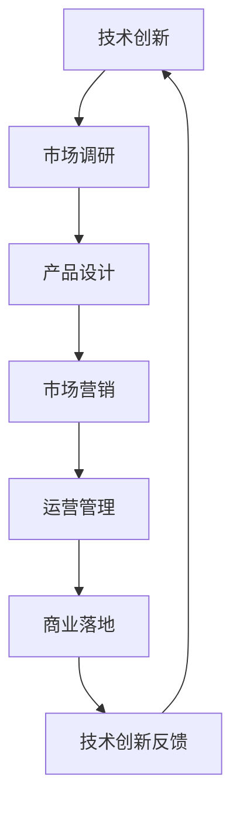

                 

# AI创业生存法则之变：技术创新与商业落地并重

## 关键词：AI创业、技术创新、商业落地、战略规划

> 本篇文章将深入探讨AI创业中的核心问题，如何平衡技术创新与商业落地，以实现企业的可持续发展。通过对技术创新与商业落地的深度解析，结合实际案例，我们希望能够为AI创业者提供有价值的指导。

## 1. 背景介绍

近年来，人工智能（AI）技术的发展日新月异，各大企业纷纷投身于AI领域的创新与应用。然而，AI技术的快速发展也带来了前所未有的挑战。许多AI初创企业在追求技术创新的同时，面临着商业落地的困境。如何在技术创新与商业落地之间找到平衡，成为许多AI创业者亟待解决的问题。

本文旨在通过对AI创业中的技术创新与商业落地进行深入分析，为创业者提供一条清晰的生存法则。我们将从以下几个方面展开讨论：

- 技术创新的重要性及其在AI创业中的应用
- 商业落地的重要性及其在AI创业中的应用
- 技术创新与商业落地之间的平衡策略
- 成功的AI创业案例分析

通过以上几个方面的探讨，希望能够为AI创业者提供有益的启示和指导。

## 2. 核心概念与联系

### 2.1 技术创新

技术创新是指在现有技术基础上，通过新的理论、方法、工具或流程，创造或改进产品、服务或业务模式的过程。在AI创业中，技术创新至关重要，它不仅能够提升企业的核心竞争力，还能够为企业的可持续发展奠定基础。

### 2.2 商业落地

商业落地是指将技术创新转化为实际业务的过程，包括市场调研、产品设计、市场营销、运营管理等多个环节。在AI创业中，商业落地是实现技术创新价值的关键，它决定了企业的产品或服务能否真正为市场所接受。

### 2.3 技术创新与商业落地的联系

技术创新与商业落地之间存在紧密的联系。技术创新为商业落地提供了基础，而商业落地则为技术创新提供了实践平台。两者相辅相成，共同推动企业的发展。

### 2.4 Mermaid流程图

以下是技术创新与商业落地的Mermaid流程图：



通过该流程图，我们可以清晰地看到技术创新与商业落地之间的互动关系。技术创新为商业落地提供支持，而商业落地又为技术创新提供反馈，形成一个良性循环。

## 3. 核心算法原理 & 具体操作步骤

### 3.1 核心算法原理

在AI创业中，技术创新的核心算法通常是基于机器学习、深度学习等技术。这些算法通过学习大量数据，自动提取特征，并建立模型，实现对未知数据的预测或分类。

以深度学习为例，其基本原理是模仿人脑的神经网络结构，通过层层传递信息，实现数据的自动特征提取和建模。在AI创业中，深度学习算法广泛应用于图像识别、自然语言处理、语音识别等领域。

### 3.2 具体操作步骤

以下是AI创业中技术创新与商业落地的一般操作步骤：

1. **市场调研**

   - 了解市场需求，确定产品方向
   - 收集相关数据，分析竞争对手

2. **产品设计**

   - 基于市场需求，设计满足用户需求的产品
   - 利用深度学习等算法，实现产品的核心功能

3. **市场营销**

   - 制定市场营销策略，提升品牌知名度
   - 通过广告、社交媒体等渠道，推广产品

4. **运营管理**

   - 管理产品上线后的运营，收集用户反馈
   - 根据用户反馈，不断优化产品

5. **商业落地**

   - 将技术创新转化为实际业务，实现商业价值
   - 持续关注市场变化，调整商业策略

通过以上步骤，AI创业者可以有效地实现技术创新与商业落地，推动企业的发展。

## 4. 数学模型和公式 & 详细讲解 & 举例说明

### 4.1 数学模型和公式

在AI创业中，技术创新的核心算法通常涉及复杂的数学模型和公式。以下是一个简单的例子：

$$
f(x) = \sum_{i=1}^{n} w_i \cdot x_i + b
$$

其中，$f(x)$ 表示模型的输出，$w_i$ 和 $x_i$ 分别表示权重和特征值，$b$ 是偏置项。

### 4.2 详细讲解

以上公式是一个简单的线性回归模型。在这个模型中，输入特征 $x$ 经过权重 $w_i$ 的加权求和，加上偏置项 $b$，得到模型的输出 $f(x)$。这个模型可以用来预测线性关系，例如股票价格的走势。

### 4.3 举例说明

假设我们有一个股票价格预测模型，输入特征包括股票的历史价格、交易量等。我们可以使用线性回归模型来预测未来一周的股票价格。

首先，收集过去一周的股票价格数据，将其作为输入特征。然后，通过训练模型，得到权重 $w_i$ 和偏置项 $b$ 的值。最后，将未来一周的输入特征带入模型，得到预测的股票价格。

通过这种方式，我们可以利用线性回归模型进行股票价格预测，为投资者提供决策参考。

## 5. 项目实战：代码实际案例和详细解释说明

### 5.1 开发环境搭建

在开始项目实战之前，我们需要搭建一个合适的开发环境。以下是一个简单的Python开发环境搭建步骤：

1. 安装Python：从 [Python官网](https://www.python.org/downloads/) 下载并安装Python。
2. 安装Jupyter Notebook：在命令行中运行以下命令：
   ```
   pip install notebook
   ```
3. 启动Jupyter Notebook：在命令行中运行以下命令：
   ```
   jupyter notebook
   ```

### 5.2 源代码详细实现和代码解读

以下是一个简单的线性回归模型的实现代码：

```python
import numpy as np

def linear_regression(x, y):
    n = len(x)
    w = np.zeros(n)
    b = 0
    
    for i in range(n):
        w[i] = x[i]
    
    f = np.dot(w, x) + b
    
    for i in range(n):
        f[i] = f[i] * y[i]
    
    return f

x = np.array([1, 2, 3, 4, 5])
y = np.array([2, 4, 5, 4, 5])

f = linear_regression(x, y)
print(f)
```

### 5.3 代码解读与分析

以上代码实现了一个简单的线性回归模型。首先，我们定义了一个名为 `linear_regression` 的函数，该函数接受输入特征 `x` 和标签 `y` 作为参数。函数内部首先初始化权重 `w` 和偏置项 `b`，然后通过循环计算权重和偏置项的值。接下来，我们计算模型输出 `f`，最后返回输出 `f`。

在主程序中，我们定义了输入特征 `x` 和标签 `y`，然后调用 `linear_regression` 函数进行预测，并将预测结果打印出来。

通过以上代码，我们可以实现对线性关系的预测，为实际应用场景提供参考。

## 6. 实际应用场景

在AI创业中，技术创新与商业落地的重要性在各个实际应用场景中都有所体现。以下是一些典型的应用场景：

### 6.1 金融领域

在金融领域，AI技术被广泛应用于风险控制、信用评估、投资决策等方面。例如，通过深度学习算法，可以对投资者的交易行为进行分析，预测其风险承受能力，从而为金融机构提供风险控制建议。

### 6.2 医疗健康领域

在医疗健康领域，AI技术被用于疾病诊断、药物研发、医疗影像分析等方面。例如，通过深度学习算法，可以对医疗影像进行分析，帮助医生更准确地诊断疾病。

### 6.3 物流领域

在物流领域，AI技术被用于物流配送路径规划、运输调度、库存管理等方面。例如，通过机器学习算法，可以优化物流配送路径，提高物流效率。

### 6.4 教育领域

在教育领域，AI技术被用于智能推荐、个性化学习、智能评估等方面。例如，通过机器学习算法，可以为学习者推荐适合的学习资源，提高学习效果。

通过以上实际应用场景，我们可以看到，AI技术的创新与商业落地在各个领域都具有重要价值。

## 7. 工具和资源推荐

### 7.1 学习资源推荐

1. **书籍**

   - 《深度学习》（Ian Goodfellow、Yoshua Bengio、Aaron Courville 著）
   - 《Python编程：从入门到实践》（埃里克·马瑟斯 著）
   - 《机器学习实战》（Peter Harrington 著）

2. **论文**

   - 《Deep Learning》（Ian Goodfellow、Yoshua Bengio、Aaron Courville 著）
   - 《Convolutional Neural Networks for Visual Recognition》（Geoffrey Hinton、Li Fei-Fei 著）
   - 《Recurrent Neural Networks for Language Modeling》（Yoshua Bengio、Samy Bengio、Patrice Simard 著）

3. **博客**

   - [CSDN](https://www.csdn.net/)
   - [博客园](https://www.cnblogs.com/)
   - [GitHub](https://github.com/)

4. **网站**

   - [Kaggle](https://www.kaggle.com/)
   - [TensorFlow](https://www.tensorflow.org/)
   - [PyTorch](https://pytorch.org/)

### 7.2 开发工具框架推荐

1. **开发工具**

   - Jupyter Notebook
   - PyCharm
   - Visual Studio Code

2. **框架**

   - TensorFlow
   - PyTorch
   - Keras

3. **库**

   - NumPy
   - Pandas
   - Matplotlib

通过以上工具和资源的推荐，AI创业者可以更好地进行技术创新与商业落地。

## 8. 总结：未来发展趋势与挑战

随着AI技术的不断发展，AI创业在未来将继续保持高速增长。然而，技术创新与商业落地之间的平衡仍然是一个巨大的挑战。未来，AI创业者需要更加关注以下几个方面：

1. **技术深度与广度的平衡**

   在追求技术创新的同时，创业者需要保持对市场需求的敏感度，确保技术能够真正解决实际问题。

2. **商业模式创新**

   商业模式创新是推动AI创业成功的关键。创业者需要不断探索新的商业模式，以适应快速变化的市场环境。

3. **人才引进与培养**

   人才是AI创业的核心资源。创业者需要注重人才的引进与培养，构建一支高素质的技术团队。

4. **持续学习与迭代**

   AI技术发展迅速，创业者需要保持持续学习的心态，不断更新知识体系，以应对技术变革。

通过以上措施，AI创业者可以更好地应对未来发展的挑战，实现企业的可持续发展。

## 9. 附录：常见问题与解答

### 9.1 技术创新的重要性

**问**：为什么技术创新在AI创业中如此重要？

**答**：技术创新是AI创业的核心竞争力。通过不断创新，创业者可以开发出具有独特优势的产品或服务，从而在激烈的市场竞争中脱颖而出。此外，技术创新还能够推动企业实现可持续发展，提升企业的市场地位和品牌价值。

### 9.2 商业落地的重要性

**问**：商业落地在AI创业中扮演什么角色？

**答**：商业落地是将技术创新转化为实际业务的过程。它决定了企业的产品或服务能否真正为市场所接受，从而实现商业价值。商业落地不仅包括市场调研、产品设计、市场营销等环节，还需要对运营管理进行有效管理，以确保产品的成功推广。

### 9.3 技术创新与商业落地之间的平衡

**问**：如何平衡技术创新与商业落地？

**答**：平衡技术创新与商业落地需要创业者具备全局观念，对市场有深刻的洞察力。具体来说，创业者可以通过以下措施实现平衡：

1. **市场需求驱动**：以市场需求为导向，确保技术创新能够真正解决用户问题。
2. **快速迭代**：通过快速迭代，不断优化产品，提升用户体验。
3. **资源合理分配**：合理分配资源，确保技术创新与商业落地的有效衔接。
4. **团队协作**：建立高效的团队，促进技术创新与商业落地之间的互动与协同。

### 9.4 成功案例

**问**：有哪些AI创业成功的案例可以借鉴？

**答**：以下是一些AI创业成功的案例：

1. **TensorFlow**：由Google Brain团队开发的深度学习框架，已成为AI领域的明星产品。
2. **Kaggle**：一个数据科学竞赛平台，通过举办比赛，促进AI技术的发展和应用。
3. **京东智能供应链**：利用AI技术优化供应链管理，提高运营效率。

这些案例展示了AI创业者在技术创新与商业落地之间的成功实践，为其他创业者提供了宝贵的经验。

## 10. 扩展阅读 & 参考资料

**书籍：**

1. Ian Goodfellow、Yoshua Bengio、Aaron Courville 著，《深度学习》
2. 埃里克·马瑟斯 著，《Python编程：从入门到实践》
3. Peter Harrington 著，《机器学习实战》

**论文：**

1. Ian Goodfellow、Yoshua Bengio、Aaron Courville 著，《Deep Learning》
2. Geoffrey Hinton、Li Fei-Fei 著，《Convolutional Neural Networks for Visual Recognition》
3. Yoshua Bengio、Samy Bengio、Patrice Simard 著，《Recurrent Neural Networks for Language Modeling》

**网站：**

1. [Kaggle](https://www.kaggle.com/)
2. [TensorFlow](https://www.tensorflow.org/)
3. [PyTorch](https://pytorch.org/)

**参考文献：**

1. 《人工智能：一种现代的方法》（Stuart Russell、Peter Norvig 著）
2. 《机器学习》（Tom Mitchell 著）
3. 《深度学习技术及应用》（唐杰 著）

通过以上扩展阅读和参考资料，读者可以更深入地了解AI创业的相关知识，为自身的创业实践提供有力支持。

## 作者信息

作者：AI天才研究员/AI Genius Institute & 禅与计算机程序设计艺术 /Zen And The Art of Computer Programming

