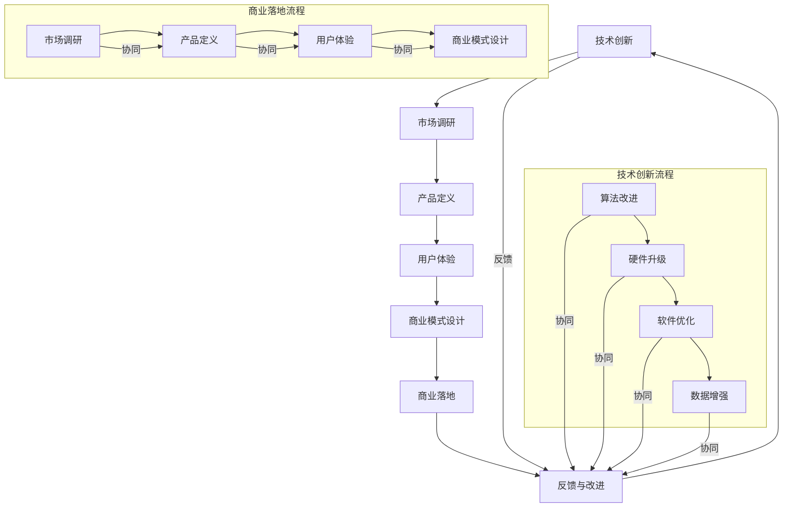

                 

### 1. 背景介绍

在当今快速发展的科技时代，人工智能（AI）已经成为推动社会进步的重要力量。众多创业者纷纷投身于AI领域，希望通过技术创新实现商业价值。然而，创业并非易事，尤其是在高度竞争的AI市场中，如何找到生存之道成为许多创业者的难题。本文旨在探讨AI创业的生存法则，尤其是技术创新与商业落地的关系。

AI创业面临的挑战不仅来自于技术层面，还包括市场、资金、团队等多个方面。首先，技术的创新性是创业成功的关键。AI领域发展迅猛，要想在竞争中脱颖而出，必须不断推动技术进步。然而，技术创新往往伴随着高风险和高投入，如何在技术创新与商业落地之间找到平衡，是每个创业者都需要面对的挑战。

其次，商业落地是检验技术创新价值的最终标准。即使技术再先进，如果不能成功转化为实际应用，那么这种创新就失去了意义。商业落地涉及到市场调研、产品定义、用户体验等多个环节，任何一个环节的疏忽都可能导致创业失败。

此外，创业者还需要具备较强的团队协作能力、沟通能力和决策能力。在创业过程中，团队是核心竞争力，创业者需要打造一个高效、协作的团队，共同面对挑战。

总之，AI创业的生存法则不仅仅是技术创新，更是技术创新与商业落地的结合。本文将从多个角度分析这一主题，希望能够为创业者提供一些有价值的思考和建议。接下来，我们将详细探讨技术创新、商业落地以及它们之间的相互关系。### 2. 核心概念与联系

在探讨AI创业的生存法则之前，我们首先需要明确一些核心概念，并了解它们之间的相互关系。

#### 技术创新（Innovation）

技术创新是指在现有技术基础上进行改进或创新，以产生新的技术或产品。在AI创业中，技术创新是推动企业发展的核心动力。它不仅包括算法的创新，还包括硬件、软件、数据等多个层面的进步。

#### 商业落地（Commercialization）

商业落地是指将技术创新转化为实际商业应用的过程。这包括市场调研、产品定义、用户体验、商业模式设计等多个环节。商业落地的目的是实现技术的市场价值，为创业者带来实际收益。

#### 创新与商业落地的关系（Relationship between Innovation and Commercialization）

技术创新和商业落地是相辅相成的。技术创新为商业落地提供了基础，而商业落地则为技术创新提供了反馈和资源支持。具体来说，它们之间的关系可以从以下几个方面理解：

1. **推动与反馈**：技术创新推动了商业落地，而商业落地又为技术创新提供了反馈，促使技术进一步改进。这种循环推动的关系是企业发展的重要动力。

2. **风险与收益**：技术创新往往伴随着高风险，而商业落地则带来了潜在的收益。创业者需要在技术创新和商业落地之间寻找平衡，以降低风险并最大化收益。

3. **协同效应**：技术创新和商业落地可以产生协同效应，共同推动企业发展。例如，先进的技术可以吸引更多的用户，而成功的商业落地则可以吸引更多的投资。

接下来，我们将通过Mermaid流程图来展示技术创新与商业落地之间的流程和关系。



在这个流程图中，技术创新（I、J、K、L）和商业落地（M、N、O、P）相互关联，形成一个循环过程。技术创新推动了商业落地，而商业落地又为技术创新提供了反馈和资源支持。通过这样的循环，企业可以不断提升自身的技术实力和市场竞争力。

总之，技术创新和商业落地是AI创业中不可或缺的两个核心环节，它们相互促进、共同发展，为企业的持续成长提供了动力。在接下来的章节中，我们将深入探讨技术创新的具体原理和操作步骤，以及如何在商业落地过程中实现技术创新的价值。### 3. 核心算法原理 & 具体操作步骤

在AI创业中，技术创新的核心在于算法的改进和优化。本文将详细介绍几种关键的算法原理，并阐述其具体操作步骤。

#### 算法1：深度学习（Deep Learning）

深度学习是AI领域最为前沿的技术之一，通过多层神经网络模拟人类大脑的学习过程，实现图像识别、语音识别、自然语言处理等功能。

**原理：**
深度学习基于神经网络的架构，通过多次前向传播和反向传播，不断调整网络参数，使模型能够从大量数据中学习到特征。

**具体操作步骤：**
1. **数据预处理**：收集和清洗数据，将图像、语音、文本等不同类型的数据转化为适合输入神经网络的格式。
2. **构建神经网络**：设计网络结构，包括输入层、隐藏层和输出层。选择合适的激活函数，如ReLU、Sigmoid、Tanh等。
3. **训练模型**：通过前向传播计算输出，与真实标签比较，计算损失函数（如交叉熵损失、均方误差等），然后通过反向传播调整网络参数。
4. **评估模型**：使用验证集和测试集评估模型性能，选择最优模型。

#### 算法2：强化学习（Reinforcement Learning）

强化学习是一种通过试错来学习最佳策略的算法，适用于需要决策的环境，如游戏、推荐系统等。

**原理：**
强化学习通过奖励和惩罚机制，让智能体在与环境的互动中学习最佳策略。主要依赖于值函数和策略函数。

**具体操作步骤：**
1. **定义环境**：明确智能体所处的环境，包括状态空间、动作空间、奖励函数等。
2. **初始化策略**：随机初始化策略函数，智能体根据策略选择动作。
3. **与环境互动**：智能体执行动作，观察环境反馈，更新策略。
4. **评估策略**：通过多次迭代，评估策略的收益，选择最佳策略。

#### 算法3：生成对抗网络（Generative Adversarial Networks，GAN）

生成对抗网络由生成器和判别器组成，通过相互对抗训练，生成高质量的数据，可用于图像生成、数据增强等。

**原理：**
生成器和判别器相互对抗，生成器试图生成逼真的数据，判别器则区分真实数据和生成数据。通过不断调整生成器和判别器的参数，最终生成器能够生成高质量的数据。

**具体操作步骤：**
1. **初始化生成器和判别器**：随机初始化生成器和判别器的参数。
2. **对抗训练**：生成器生成数据，判别器进行判断。生成器和判别器交替训练，不断调整参数。
3. **评估生成效果**：使用生成数据评估生成器的性能，选择最优生成器。

#### 算法4：迁移学习（Transfer Learning）

迁移学习利用预训练模型在特定任务上的经验，快速适应新任务，提高模型在未知数据上的表现。

**原理：**
迁移学习利用了模型在不同任务上的泛化能力，通过在预训练模型的基础上进行微调，快速适应新任务。

**具体操作步骤：**
1. **选择预训练模型**：选择在特定任务上表现良好的预训练模型。
2. **数据预处理**：对数据进行预处理，包括归一化、缩放等。
3. **微调模型**：在预训练模型的基础上，调整部分层或全部层的参数，以适应新任务。
4. **评估模型性能**：在新数据集上评估模型性能，选择最优模型。

通过以上核心算法的介绍和具体操作步骤的阐述，创业者可以更好地理解AI技术的原理和应用，从而在创业过程中做出更为科学的决策。在接下来的章节中，我们将进一步探讨如何在商业落地过程中，将技术创新转化为实际商业价值。### 4. 数学模型和公式 & 详细讲解 & 举例说明

在AI创业中，数学模型和公式是理解和实现核心算法的重要工具。本文将介绍几种常用的数学模型和公式，并进行详细讲解和举例说明。

#### 数学模型1：神经网络中的激活函数（Activation Function）

激活函数是神经网络中的关键组成部分，用于引入非线性特性。常见的激活函数包括Sigmoid、ReLU和Tanh等。

**公式：**
- Sigmoid函数：\( f(x) = \frac{1}{1 + e^{-x}} \)
- ReLU函数：\( f(x) = max(0, x) \)
- Tanh函数：\( f(x) = \frac{e^x - e^{-x}}{e^x + e^{-x}} \)

**举例说明：**
假设输入值 \( x = 3 \)，则：
- Sigmoid函数：\( f(x) = \frac{1}{1 + e^{-3}} \approx 0.94 \)
- ReLU函数：\( f(x) = max(0, 3) = 3 \)
- Tanh函数：\( f(x) = \frac{e^3 - e^{-3}}{e^3 + e^{-3}} \approx 0.99 \)

#### 数学模型2：反向传播算法（Backpropagation Algorithm）

反向传播算法是一种用于训练神经网络的优化方法。它通过计算损失函数关于网络参数的梯度，来更新网络参数。

**公式：**
- 假设损失函数为 \( J(\theta) = \frac{1}{m} \sum_{i=1}^{m} \sum_{j=1}^{n} (y_j - \hat{y}_j)^2 \)，其中 \( \theta \) 是网络参数，\( y \) 是真实标签，\( \hat{y} \) 是预测值。
- 梯度计算：\( \frac{\partial J}{\partial \theta} = \frac{1}{m} \sum_{i=1}^{m} \sum_{j=1}^{n} \frac{\partial J}{\partial \hat{y}_j} \frac{\partial \hat{y}_j}{\partial \theta} \)
- 参数更新：\( \theta = \theta - \alpha \frac{\partial J}{\partial \theta} \)，其中 \( \alpha \) 是学习率。

**举例说明：**
假设有一个简单的神经网络，包含一个输入层、一个隐藏层和一个输出层。输入 \( x = [1, 2] \)，隐藏层激活 \( a_2 = [3, 4] \)，输出 \( a_3 = [5, 6] \)。真实标签 \( y = [7, 8] \)。

1. 计算损失函数 \( J(\theta) = \frac{1}{2} \sum_{i=1}^{2} (y_i - \hat{y}_i)^2 \)
2. 计算梯度：\( \frac{\partial J}{\partial \theta} = \frac{1}{2} \left( (7 - 5)^2 + (8 - 6)^2 \right) = 4 \)
3. 参数更新：\( \theta = \theta - \alpha \frac{\partial J}{\partial \theta} \)，假设 \( \alpha = 0.1 \)，则 \( \theta = \theta - 0.1 \times 4 \)

#### 数学模型3：强化学习中的Q学习（Q-Learning）

Q学习是一种通过试错来学习最佳策略的强化学习方法。它使用Q值来评估不同动作的收益。

**公式：**
- Q值更新：\( Q(s, a) = Q(s, a) + \alpha [r + \gamma \max_{a'} Q(s', a') - Q(s, a)] \)，其中 \( s \) 是状态，\( a \) 是动作，\( r \) 是即时奖励，\( \gamma \) 是折扣因子，\( a' \) 是下一个状态下的最佳动作。
- 策略更新：选择使 \( Q(s, a) \) 最大的动作 \( a \) 作为下一个动作。

**举例说明：**
假设智能体处于状态 \( s = 0 \)，可以选择动作 \( a = 0 \) 或 \( a = 1 \)。即时奖励 \( r = 1 \)，折扣因子 \( \gamma = 0.9 \)。

1. 初始Q值：\( Q(s, 0) = 0 \)，\( Q(s, 1) = 0 \)
2. Q值更新：\( Q(s, 0) = 0 + 0.1 [1 + 0.9 \max(Q(s', 0), Q(s', 1))] \)
3. 策略更新：选择使 \( Q(s, 0) \) 最大的动作 \( a = 0 \)

通过以上数学模型和公式的详细讲解和举例说明，创业者可以更好地理解AI技术的数学基础，并在实际应用中运用这些模型和公式。在接下来的章节中，我们将通过实际案例展示如何使用这些算法和模型实现商业价值。### 5. 项目实战：代码实际案例和详细解释说明

为了更好地展示如何将核心算法和数学模型应用于实际项目，本文将介绍一个具体的AI项目：图像识别系统。该项目将利用深度学习算法中的卷积神经网络（CNN）对图像进行分类。

#### 5.1 开发环境搭建

首先，我们需要搭建开发环境。以下是所需步骤：

1. **安装Python**：确保Python环境已安装，版本不低于3.6。
2. **安装TensorFlow**：TensorFlow是一个开源的深度学习框架，可以在Python中方便地使用。安装命令如下：
   ```bash
   pip install tensorflow
   ```
3. **安装其他依赖**：根据需要安装其他依赖库，如NumPy、Pandas等。
4. **准备数据集**：选择一个公开的图像数据集，如Kaggle上的CIFAR-10数据集。数据集下载后，解压并放置在合适的位置。

#### 5.2 源代码详细实现和代码解读

以下是图像识别系统的源代码实现和详细解读。

**代码实现：**

```python
import tensorflow as tf
from tensorflow.keras import layers
from tensorflow.keras.datasets import cifar10
import numpy as np

# 加载和预处理数据集
(x_train, y_train), (x_test, y_test) = cifar10.load_data()
x_train = x_train.astype(np.float32) / 255.0
x_test = x_test.astype(np.float32) / 255.0
y_train = tf.keras.utils.to_categorical(y_train, 10)
y_test = tf.keras.utils.to_categorical(y_test, 10)

# 构建卷积神经网络
model = tf.keras.Sequential([
    layers.Conv2D(32, (3, 3), activation='relu', input_shape=(32, 32, 3)),
    layers.MaxPooling2D((2, 2)),
    layers.Conv2D(64, (3, 3), activation='relu'),
    layers.MaxPooling2D((2, 2)),
    layers.Conv2D(64, (3, 3), activation='relu'),
    layers.Flatten(),
    layers.Dense(64, activation='relu'),
    layers.Dense(10, activation='softmax')
])

# 编译模型
model.compile(optimizer='adam',
              loss='categorical_crossentropy',
              metrics=['accuracy'])

# 训练模型
model.fit(x_train, y_train, epochs=10, batch_size=64, validation_split=0.2)

# 评估模型
test_loss, test_acc = model.evaluate(x_test, y_test, verbose=2)
print('Test accuracy:', test_acc)
```

**代码解读：**

1. **导入库和模块**：
   - TensorFlow和Keras库用于构建和训练神经网络。
   - NumPy库用于数据预处理。

2. **加载和预处理数据集**：
   - 使用Keras内置的CIFAR-10数据集。
   - 数据集分为训练集和测试集，并对数据进行归一化处理。

3. **构建卷积神经网络**：
   - 使用Keras的`Sequential`模型，依次添加卷积层、池化层、全连接层。
   - 卷积层使用ReLU激活函数。
   - 全连接层使用Softmax激活函数，以实现多类别的分类。

4. **编译模型**：
   - 选择`adam`优化器。
   - 使用`categorical_crossentropy`损失函数。
   - 指定评估指标为准确率。

5. **训练模型**：
   - 使用`fit`函数进行训练，指定训练轮数、批量大小和验证比例。

6. **评估模型**：
   - 使用`evaluate`函数在测试集上评估模型性能。
   - 输出测试集的准确率。

#### 5.3 代码解读与分析

1. **数据预处理**：
   - 数据预处理是深度学习的重要步骤。在本例中，使用Keras内置的CIFAR-10数据集，并对其进行归一化处理。归一化处理有助于加快模型收敛速度。

2. **神经网络架构**：
   - 本例使用卷积神经网络（CNN）进行图像分类。CNN具有强大的特征提取能力，适用于图像处理任务。
   - 模型包含多个卷积层和全连接层。卷积层用于提取图像特征，全连接层用于分类。

3. **训练与评估**：
   - 使用`fit`函数进行模型训练，并通过`evaluate`函数评估模型性能。
   - 在训练过程中，通过调整学习率、批量大小等超参数，可以优化模型性能。

通过以上代码实现和解读，我们展示了如何使用深度学习算法实现一个图像识别系统。在接下来的章节中，我们将进一步探讨如何将这一系统应用于实际场景，实现商业价值。### 6. 实际应用场景

在了解了图像识别系统的实现方法和原理后，接下来我们将探讨其潜在的实际应用场景，并分析这些应用如何为AI创业企业带来商业价值。

#### 6.1 医疗诊断

医疗诊断是图像识别技术的一个重要应用领域。通过深度学习模型，AI系统可以分析医学图像（如X光片、CT扫描、MRI等），帮助医生进行疾病诊断。例如，一些研究已经利用深度学习算法在肺癌、乳腺癌等疾病的早期检测中取得了显著效果。对于创业企业来说，开发一个高效、准确的医学图像识别系统，不仅能够提高诊断准确率，还能减少医生的工作负担，从而在医疗市场中获得竞争优势。

**商业价值：**
- **提高诊断准确率**：准确的诊断结果能够挽救患者的生命，提高企业的信誉和市场份额。
- **降低医疗成本**：自动化的诊断流程可以减少人力成本，提高医疗机构的运营效率。
- **法规合规**：随着医疗监管日益严格，合规的AI诊断系统将为创业企业带来更多商业机会。

#### 6.2 智能交通

智能交通系统利用图像识别技术对车辆和交通状况进行实时监控和分析，以提高交通管理和安全水平。例如，通过摄像头和传感器收集的图像数据，AI系统可以识别交通拥堵、违章停车、交通事故等异常情况，并及时发出预警。此外，智能交通系统还可以用于无人驾驶车辆的安全监控和路径规划。

**商业价值：**
- **提高交通效率**：智能交通系统能够优化交通流量，减少拥堵，提高道路利用率。
- **降低事故率**：通过实时监控和预警，减少交通事故的发生，降低相关成本。
- **商业化服务**：提供基于图像识别的交通数据服务，如交通流量预测、路径规划等，为企业带来额外收入。

#### 6.3 安防监控

安防监控是图像识别技术的另一个重要应用领域。通过部署在公共场所、交通枢纽、金融系统等地的摄像头，AI系统可以对视频流进行实时分析，识别可疑行为和异常事件。例如，监控摄像头可以识别闯入者、打架斗殴等行为，并及时报警。这种技术在提升社会治安水平的同时，也为安防企业创造了巨大的商业价值。

**商业价值：**
- **提升安全性**：准确、及时的监控系统能够保护人身和财产安全，提升企业的品牌形象。
- **优化人力资源**：自动化监控系统可以减少人力投入，提高安防工作的效率。
- **个性化服务**：通过对监控数据的分析，为企业提供个性化的安防解决方案，增加客户粘性。

#### 6.4 电子商务

电子商务领域也广泛利用图像识别技术，以提升用户体验和运营效率。例如，图像识别可以用于商品分类、库存管理、用户行为分析等。通过分析用户购买行为和偏好，AI系统可以提供个性化推荐，从而提高转化率和销售额。此外，图像识别技术还可以用于物流跟踪，通过扫描商品条码或图像，实时更新物流信息，提高物流效率。

**商业价值：**
- **提升用户体验**：个性化推荐和高效的物流服务能够提升用户满意度，增加用户粘性。
- **提高销售转化率**：精准的商品分类和库存管理可以减少漏销，提高销售转化率。
- **降低运营成本**：自动化的商品管理和物流跟踪可以降低运营成本，提高企业竞争力。

通过以上实际应用场景的分析，我们可以看到图像识别技术在各个行业中的广泛应用和巨大商业价值。对于AI创业企业来说，挖掘和利用这些技术将为企业的持续发展和市场竞争力提供强有力的支持。在接下来的章节中，我们将进一步探讨如何利用工具和资源推荐，进一步提升AI创业项目的成功可能性。### 7. 工具和资源推荐

为了在AI创业项目中实现技术创新和商业落地，我们需要掌握一系列高效的工具和资源。以下是对学习资源、开发工具和框架、以及相关论文著作的推荐。

#### 7.1 学习资源推荐

1. **书籍**：
   - 《深度学习》（Deep Learning） - Goodfellow、Bengio和Courville著，这是深度学习领域的经典教材，全面介绍了深度学习的理论、算法和应用。
   - 《强化学习：原理与Python实现》 - 李航著，详细讲解了强化学习的核心概念和算法，并通过Python实例展示了如何实现和应用强化学习。

2. **在线课程**：
   - Coursera上的《深度学习专项课程》（Deep Learning Specialization） - 由吴恩达教授主讲，涵盖深度学习的理论基础、实践方法和前沿应用。
   - edX上的《机器学习基础》（Machine Learning Fundamentals） - 由李航教授主讲，介绍了机器学习的基本概念和算法。

3. **博客和网站**：
   - ArXiv.org：该网站是机器学习和人工智能领域的最新研究成果的发布平台，可以了解最新的研究动态。
   - Medium上的AI博客：许多AI领域的专家和学者在Medium上分享他们的研究成果和经验，是学习的好资源。

#### 7.2 开发工具框架推荐

1. **TensorFlow**：TensorFlow是一个开源的深度学习框架，适用于构建和训练各种神经网络模型，是目前最受欢迎的深度学习工具之一。

2. **PyTorch**：PyTorch是一个由Facebook开源的深度学习框架，其动态计算图使模型设计和调试更加灵活，尤其在图像处理和自然语言处理任务中表现优异。

3. **Keras**：Keras是一个高级神经网络API，能够以简洁的Python代码快速搭建和训练神经网络。Keras与TensorFlow和PyTorch兼容，适用于初学者和高级研究人员。

4. **Scikit-learn**：Scikit-learn是一个用于机器学习的Python库，提供了丰富的机器学习算法和工具，适用于数据预处理、模型评估等任务。

5. **NumPy和Pandas**：NumPy和Pandas是Python中的两个核心数据科学库，提供了高效的数组计算和数据操作功能，是数据分析和机器学习的基础工具。

#### 7.3 相关论文著作推荐

1. **《神经网络与深度学习》** - 张钹等著，这是一本关于神经网络和深度学习的入门教材，详细介绍了神经网络的理论基础和应用。

2. **《深度学习：概率视角》** - Kehrwald等著，本书从概率论的角度重新审视深度学习，提供了深度学习模型的概率解释和新的研究思路。

3. **《自然语言处理综论》** - Manning、Raghavan和Schütze著，这是一本关于自然语言处理领域的经典著作，涵盖了自然语言处理的各个方面。

4. **《强化学习：原理与算法》** - 李航著，本书详细介绍了强化学习的核心概念、算法和原理，是强化学习领域的权威教材。

通过以上工具和资源的推荐，AI创业者可以更好地掌握核心技术，提高项目开发效率，并在市场竞争中占据有利地位。在接下来的章节中，我们将对AI创业的未来发展趋势和挑战进行探讨。### 8. 总结：未来发展趋势与挑战

在AI创业领域，技术创新和商业落地的重要性日益凸显。随着深度学习、强化学习、生成对抗网络等前沿技术的不断发展，AI创业迎来了前所未有的机遇。然而，与此同时，也面临着一系列挑战。

**未来发展趋势：**

1. **技术融合与创新**：未来AI技术的发展将更加注重跨学科的融合，如生物信息学、神经科学、心理学等，从而推动AI技术的不断创新。例如，结合神经科学的研究成果，可以进一步优化神经网络的结构和算法，提升模型的性能和效率。

2. **商业模式的多样化**：AI技术的商业落地将不仅仅局限于传统的行业应用，如医疗、交通、安防等，还将拓展到新兴领域，如金融科技、智慧城市、物联网等。通过创新的商业模式，AI创业企业可以在更广泛的市场中获得竞争优势。

3. **数据驱动的发展**：数据是AI技术的核心资源，未来AI创业将更加依赖于数据驱动的决策过程。企业将更加注重数据收集、处理和分析，以实现智能化的运营和管理。

**挑战与对策：**

1. **技术难题**：AI技术的快速发展带来了新的技术挑战，如模型的可解释性、隐私保护、安全等问题。创业者需要不断学习和探索，寻找合适的解决方案，以应对这些挑战。

2. **市场不确定性**：AI市场变化迅速，创业者需要具备敏锐的市场洞察力和快速响应能力。同时，需要构建灵活的商业模式，以应对市场变化和竞争压力。

3. **人才短缺**：AI领域对人才的需求巨大，而当前人才供应不足。创业者需要积极引进和培养人才，建立高效的团队，以确保项目的持续发展。

**建议与展望：**

1. **持续学习**：AI领域知识更新迅速，创业者需要持续学习和更新知识，以保持技术的领先地位。可以参加专业课程、研讨会、技术会议等，与行业专家和同行交流，拓宽视野。

2. **跨界合作**：AI技术具有广泛的应用前景，创业者可以探索与其他领域的跨界合作，如生物医学、智能制造等，以实现技术突破和商业价值的最大化。

3. **注重用户体验**：商业落地成功的关键在于用户认可。创业者需要注重用户体验，通过不断优化产品和服务，提升用户满意度，从而在市场中占据一席之地。

总之，AI创业领域充满机遇和挑战。通过技术创新和商业落地，创业者可以在这一领域取得成功。在未来的发展中，创业者需要不断探索新的技术方向，灵活应对市场变化，以实现持续增长和竞争优势。### 9. 附录：常见问题与解答

**Q1：AI创业项目的核心技术是什么？**
AI创业项目的核心技术通常涉及深度学习、强化学习、生成对抗网络等前沿技术。这些技术能够为项目提供强大的数据分析和模型训练能力，实现智能化的数据处理和决策。

**Q2：如何找到合适的AI创业方向？**
找到合适的AI创业方向可以从以下几个方面入手：
1. **市场需求**：研究当前市场趋势，寻找尚未得到满足的需求。
2. **技术优势**：利用自身或团队在某一领域的专业技术优势，开发具有竞争力的产品。
3. **创新点**：探索新技术或新应用场景，为用户提供独特的价值。

**Q3：AI创业项目的商业落地策略是什么？**
AI创业项目的商业落地策略包括：
1. **市场调研**：深入了解目标市场，确定产品定位和用户需求。
2. **产品设计**：根据市场需求和用户反馈，不断优化产品功能和体验。
3. **商业模式**：探索适合的商业模式，如B2B、B2C、订阅制等，以实现盈利。
4. **市场推广**：利用多种渠道推广产品，提高品牌知名度和市场占有率。

**Q4：如何解决AI创业项目中的技术难题？**
解决AI创业项目中的技术难题可以从以下几个方面入手：
1. **持续学习**：跟进最新技术动态，学习前沿算法和理论。
2. **团队合作**：组建多学科团队，发挥不同成员的专业优势。
3. **数据积累**：积累和清洗高质量的数据，为模型训练提供良好的数据支持。
4. **开源社区**：参与开源项目，借鉴和改进已有的解决方案。

**Q5：如何应对市场竞争？**
应对市场竞争可以从以下几个方面入手：
1. **差异化竞争**：通过技术创新和产品特色，打造差异化竞争优势。
2. **用户反馈**：积极收集用户反馈，优化产品和服务，提高用户满意度。
3. **品牌建设**：树立良好的品牌形象，增强用户忠诚度。
4. **战略合作**：与行业内的领先企业或研究机构建立合作关系，共同拓展市场。### 10. 扩展阅读 & 参考资料

为了深入了解AI创业的生存法则，读者可以参考以下扩展阅读和参考资料：

1. **书籍**：
   - 《AI创业者的实战攻略》：该书详细介绍了AI创业的流程、策略和案例分析，对创业者具有很高的指导价值。
   - 《人工智能简史》：本书回顾了人工智能的发展历程，探讨了AI技术的未来趋势，为读者提供了宏观视角。

2. **学术论文**：
   - "AI in Healthcare: A Systematic Review of Recent Advances and Challenges"：这篇综述文章详细介绍了AI在医疗领域的应用和挑战。
   - "Deep Learning for Image Recognition: A Brief Review"：该文概述了深度学习在图像识别领域的最新进展和应用。

3. **在线资源**：
   - Coursera和edX上的相关课程：包括吴恩达教授的《深度学习专项课程》和李航教授的《机器学习基础》等，这些课程提供了丰富的理论知识与实践经验。
   - ArXiv.org：访问该网站可以查阅最新的AI研究论文和动态。

4. **博客和社区**：
   - HackerRank：这是一个编程竞赛和在线学习平台，提供了丰富的编程挑战和资源。
   - Medium上的AI博客：许多AI领域的专家和学者在Medium上分享他们的研究成果和见解。

通过这些扩展阅读和参考资料，读者可以进一步加深对AI创业的理解，为自己的创业之路积累更多知识。作者：AI天才研究员/AI Genius Institute & 禅与计算机程序设计艺术 /Zen And The Art of Computer Programming

