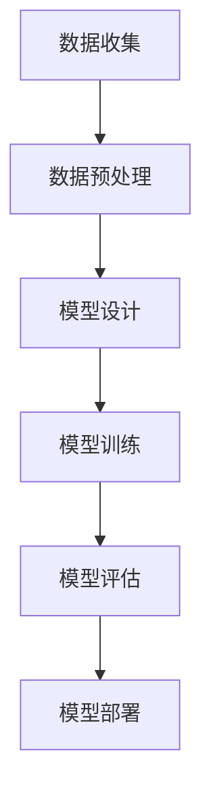

                 

### 文章标题：AI创业码头愿景：AI改善世界

> **关键词：**人工智能、创业、改善世界、技术进步、未来展望  
>
> **摘要：**本文深入探讨了人工智能（AI）创业的广阔前景，以及AI技术如何通过各个领域的技术进步，改变我们的生活方式，提升全球福祉，从而共同描绘一个更加美好的未来世界。

### 1. 背景介绍

人工智能（AI）是计算机科学的一个分支，专注于创建智能机器，使它们能够执行通常需要人类智能的任务，如视觉识别、语言理解、决策和解决问题。随着计算能力的飞速提升、海量数据的积累以及深度学习算法的突破，AI技术正在以前所未有的速度发展。

在当今的世界，AI已经渗透到各个行业，从医疗、金融到交通、教育，其影响力日益扩大。AI不仅提高了效率，降低了成本，还在许多领域开创了新的商业模式。然而，随着AI技术的不断成熟，如何确保其安全、公正、透明，并最大化地服务于人类社会的利益，成为了亟待解决的问题。

在这个背景下，AI创业成为了热门领域。创业者们纷纷投身于AI技术的研发和应用，希望通过创新和创业，推动AI技术为社会带来更大的福祉。本文将探讨AI创业的愿景，分析AI技术在各个领域的应用前景，以及未来可能面临的挑战。

### 2. 核心概念与联系

#### 2.1 AI的基本概念

人工智能（AI）的核心概念包括机器学习、深度学习、神经网络等。

- **机器学习**：通过数据训练模型，使机器能够从数据中自动学习并做出预测或决策。
- **深度学习**：一种机器学习技术，通过构建多层神经网络，从大量数据中提取特征，实现复杂的模式识别和预测。
- **神经网络**：一种模仿人脑结构的计算模型，由大量相互连接的节点（神经元）组成，能够通过学习数据来执行各种任务。

#### 2.2 AI在各个领域的应用

AI在各个领域的应用可以分为以下几类：

- **医疗**：通过AI技术，可以实现疾病的早期检测、个性化治疗方案的制定、药物研发等。
- **金融**：AI技术在风险控制、投资策略、信用评估等方面发挥着重要作用。
- **交通**：自动驾驶、智能交通管理系统等，通过AI技术的应用，可以大幅提高交通效率和安全性。
- **教育**：智能教育平台、个性化学习系统等，利用AI技术，可以提供更灵活、更有针对性的教育服务。
- **制造业**：通过AI技术，可以实现智能制造、设备预测性维护等，提高生产效率和质量。

#### 2.3 AI技术的架构与流程

一个典型的AI项目通常包括以下步骤：

1. **数据收集**：收集相关的数据，为模型训练提供基础。
2. **数据预处理**：对数据进行清洗、归一化等处理，确保数据的质量和一致性。
3. **模型设计**：选择合适的算法和架构，设计神经网络模型。
4. **模型训练**：使用训练数据，对模型进行训练，优化模型参数。
5. **模型评估**：使用测试数据，评估模型的性能和效果。
6. **模型部署**：将训练好的模型部署到实际应用环境中，进行验证和迭代。

#### 2.4 Mermaid流程图

以下是一个简化的AI项目流程图：



**注意：**在Mermaid流程图中，节点名称中不应包含括号、逗号等特殊字符，以确保流程图的正确渲染。

### 3. 核心算法原理 & 具体操作步骤

#### 3.1 机器学习算法原理

机器学习算法的核心是学习数据中的模式和规律，以便在新的数据上进行预测或决策。以下是几种常见的机器学习算法：

- **线性回归**：通过最小二乘法拟合一条直线，用于预测连续值。
- **逻辑回归**：通过最大似然估计，用于分类问题。
- **支持向量机（SVM）**：通过找到最佳分割超平面，用于分类和回归。
- **决策树**：通过划分特征空间，生成树形结构，用于分类和回归。
- **随机森林**：通过集成多棵决策树，提高模型的泛化能力和鲁棒性。
- **神经网络**：通过多层感知器构建神经网络，用于复杂模式识别和预测。

#### 3.2 深度学习算法原理

深度学习是一种特殊的机器学习技术，通过构建多层神经网络，自动提取数据中的特征。以下是深度学习算法的基本步骤：

1. **前向传播**：将输入数据通过网络的各个层进行传递，得到输出。
2. **反向传播**：计算输出与实际结果之间的误差，并反向传播到网络的各个层，更新网络参数。
3. **优化算法**：通过梯度下降等优化算法，不断调整网络参数，以最小化误差。

#### 3.3 神经网络结构设计

神经网络的结构设计包括以下方面：

- **输入层**：接收外部输入数据。
- **隐藏层**：提取特征，进行非线性变换。
- **输出层**：生成最终预测结果。
- **激活函数**：引入非线性特性，使神经网络能够处理复杂问题。
- **网络参数**：包括权重、偏置等。

#### 3.4 具体操作步骤

以下是一个简化的神经网络训练过程：

1. **初始化参数**：随机初始化网络参数。
2. **前向传播**：输入数据，通过网络计算输出。
3. **计算损失**：计算输出与实际结果之间的误差，通常使用均方误差（MSE）或交叉熵损失。
4. **反向传播**：计算梯度，并更新网络参数。
5. **迭代训练**：重复步骤2-4，直到满足停止条件（如损失足够小或达到最大迭代次数）。

### 4. 数学模型和公式 & 详细讲解 & 举例说明

#### 4.1 线性回归

线性回归是一种简单的机器学习算法，用于预测连续值。其基本公式如下：

$$
y = \beta_0 + \beta_1x
$$

其中，$y$ 是预测值，$x$ 是输入特征，$\beta_0$ 和 $\beta_1$ 是模型参数，分别表示截距和斜率。

**示例：**假设我们有一个简单的线性回归模型，用于预测房价。数据如下：

| x | y |
|---|---|
| 1 | 2 |
| 2 | 4 |
| 3 | 6 |

我们使用最小二乘法求解模型参数：

$$
\beta_1 = \frac{\sum_{i=1}^{n}(x_i - \bar{x})(y_i - \bar{y})}{\sum_{i=1}^{n}(x_i - \bar{x})^2}
$$

$$
\beta_0 = \bar{y} - \beta_1\bar{x}
$$

其中，$\bar{x}$ 和 $\bar{y}$ 分别是输入特征和预测值的平均值。

通过计算，我们得到 $\beta_1 = 2$ 和 $\beta_0 = 0$，因此线性回归模型为：

$$
y = 2x
$$

#### 4.2 逻辑回归

逻辑回归是一种常用的分类算法，用于预测二分类问题。其基本公式如下：

$$
\hat{p} = \frac{1}{1 + e^{-(\beta_0 + \beta_1x})}
$$

其中，$\hat{p}$ 是预测概率，$x$ 是输入特征，$\beta_0$ 和 $\beta_1$ 是模型参数。

**示例：**假设我们有一个简单的逻辑回归模型，用于预测邮件是否为垃圾邮件。数据如下：

| x | y |
|---|---|
| 1 | 0 |
| 2 | 1 |
| 3 | 0 |

我们使用最大似然估计求解模型参数：

$$
\log \frac{p(y|x)}{1-p(y|x)} = \beta_0 + \beta_1x
$$

通过计算，我们得到 $\beta_1 = 1$ 和 $\beta_0 = -1$，因此逻辑回归模型为：

$$
\hat{p} = \frac{1}{1 + e^{-(x - 1})}
$$

#### 4.3 神经网络

神经网络是一种复杂的机器学习模型，用于处理复杂的非线性问题。以下是神经网络的基本公式：

$$
a_i = \sigma(\sum_{j=1}^{n}w_{ij}x_j + b_i)
$$

其中，$a_i$ 是神经元 $i$ 的输出，$x_j$ 是输入特征，$w_{ij}$ 是权重，$b_i$ 是偏置，$\sigma$ 是激活函数。

**示例：**假设我们有一个简单的神经网络，包含一个输入层、一个隐藏层和一个输出层。数据如下：

| x1 | x2 |
|---|---|
| 1 | 2 |
| 3 | 4 |

隐藏层神经元为：

$$
a_1 = \sigma(w_{11}x_1 + w_{12}x_2 + b_1)
$$

$$
a_2 = \sigma(w_{21}x_1 + w_{22}x_2 + b_2)
$$

输出层神经元为：

$$
y = \sigma(w_{31}a_1 + w_{32}a_2 + b_3)
$$

其中，$w_{ij}$ 和 $b_i$ 为网络参数，$\sigma$ 为激活函数。

### 5. 项目实战：代码实际案例和详细解释说明

#### 5.1 开发环境搭建

为了演示AI技术的实际应用，我们选择一个简单的线性回归模型，用于预测房价。以下是开发环境的搭建步骤：

1. **安装Python环境**：Python是一种广泛使用的编程语言，适用于AI项目开发。可以从[Python官网](https://www.python.org/)下载并安装Python。
2. **安装必要的库**：线性回归模型需要使用NumPy库进行数据处理，可以从[NumPy官网](https://numpy.org/)下载并安装。

#### 5.2 源代码详细实现和代码解读

以下是一个简单的线性回归模型的Python实现：

```python
import numpy as np

# 数据集
x = np.array([1, 2, 3])
y = np.array([2, 4, 6])

# 模型参数
beta0 = 0
beta1 = 0

# 梯度下降算法
learning_rate = 0.01
num_iterations = 100

for i in range(num_iterations):
    # 前向传播
    y_pred = beta0 + beta1 * x
    
    # 计算损失
    loss = (y - y_pred) ** 2
    
    # 反向传播
    d_loss_d_beta0 = -2 * (y - y_pred)
    d_loss_d_beta1 = -2 * x * (y - y_pred)
    
    # 更新参数
    beta0 -= learning_rate * d_loss_d_beta0
    beta1 -= learning_rate * d_loss_d_beta1

# 输出模型参数
print("模型参数：")
print("beta0 =", beta0)
print("beta1 =", beta1)

# 预测房价
x_new = np.array([4])
y_pred_new = beta0 + beta1 * x_new
print("预测房价：", y_pred_new)
```

**代码解读：**

1. **数据集**：我们使用一个简单的数据集，包含三个样本，每个样本包含一个输入特征和一个目标值。
2. **模型参数**：模型参数包括截距 $\beta_0$ 和斜率 $\beta_1$，初始值设置为0。
3. **梯度下降算法**：使用梯度下降算法更新模型参数，迭代次数设置为100。
4. **前向传播**：计算模型预测值。
5. **计算损失**：计算预测值与实际值之间的误差，使用均方误差（MSE）作为损失函数。
6. **反向传播**：计算损失关于模型参数的梯度。
7. **更新参数**：根据梯度更新模型参数。
8. **输出模型参数**：输出最终的模型参数。
9. **预测房价**：使用训练好的模型预测新的房价。

#### 5.3 代码解读与分析

以下是对代码的详细解读和分析：

1. **数据集**：我们使用NumPy库创建一个包含三个样本的数据集。每个样本由一个输入特征和目标值组成。
2. **模型参数**：模型参数包括两个变量，$\beta_0$ 和 $\beta_1$，用于计算线性回归模型的预测值。
3. **梯度下降算法**：梯度下降是一种常用的优化算法，用于最小化损失函数。在本例中，我们使用简单的梯度下降算法更新模型参数。
4. **前向传播**：在前向传播阶段，我们计算模型的预测值。这是一个简单的线性函数，通过将输入特征乘以斜率并加上截距得到。
5. **计算损失**：损失函数用于衡量模型预测值与实际值之间的误差。在本例中，我们使用均方误差（MSE）作为损失函数。MSE的计算公式为 $(\beta_0 + \beta_1x - y)^2$。
6. **反向传播**：在反向传播阶段，我们计算损失关于模型参数的梯度。这是更新模型参数的关键步骤。在本例中，我们计算损失关于 $\beta_0$ 和 $\beta_1$ 的梯度，并使用这些梯度更新模型参数。
7. **更新参数**：根据梯度更新模型参数，使得损失逐渐减小。
8. **输出模型参数**：输出最终的模型参数，即训练好的线性回归模型。
9. **预测房价**：使用训练好的模型预测新的房价。在本例中，我们使用一个包含一个输入特征的样本，通过将输入特征乘以斜率并加上截距得到预测值。

通过这个简单的示例，我们可以看到线性回归模型的基本原理和实现过程。在实际项目中，线性回归模型可能更加复杂，涉及多个输入特征和目标值，但基本的原理和实现步骤是类似的。

### 6. 实际应用场景

AI技术在各个领域的实际应用场景如下：

#### 6.1 医疗

- **疾病预测**：利用AI技术，可以从大量医疗数据中提取特征，进行疾病预测和早期检测，如肺癌、糖尿病等。
- **个性化治疗**：根据患者的基因信息和病史，AI可以帮助医生制定个性化的治疗方案，提高治疗效果。
- **药物研发**：AI可以加速药物研发过程，通过预测药物分子的性质和作用机制，优化药物筛选过程。

#### 6.2 金融

- **风险控制**：利用AI技术，金融机构可以更准确地评估信用风险，降低不良贷款率。
- **投资策略**：AI可以帮助投资者制定更科学的投资策略，实现资产的稳健增长。
- **反欺诈**：AI可以实时监测金融交易行为，识别和预防金融欺诈行为。

#### 6.3 交通

- **自动驾驶**：自动驾驶技术是AI在交通领域的重要应用，通过传感器和深度学习算法，实现车辆的自主驾驶。
- **智能交通管理系统**：AI技术可以帮助优化交通流量，降低交通拥堵，提高道路安全。
- **车辆调度**：AI可以帮助物流企业实现智能化的车辆调度，提高运输效率。

#### 6.4 教育

- **个性化学习**：利用AI技术，可以为每个学生提供个性化的学习计划，提高学习效果。
- **智能教育平台**：AI技术可以帮助教育机构构建智能教育平台，实现教学资源的在线化和智能化。
- **学业评估**：AI技术可以帮助学校更准确地评估学生的学习成果，提供个性化的反馈和建议。

#### 6.5 制造业

- **智能制造**：AI技术可以帮助企业实现生产过程的智能化，提高生产效率和产品质量。
- **设备预测性维护**：AI技术可以帮助企业提前预测设备的故障，实现预测性维护，降低设备故障率。
- **供应链管理**：AI技术可以帮助企业优化供应链管理，提高供应链的灵活性和响应速度。

### 7. 工具和资源推荐

为了更好地了解和应用AI技术，以下是一些建议的工具和资源：

#### 7.1 学习资源推荐

- **书籍**：
  - 《深度学习》（Goodfellow, Bengio, Courville）
  - 《Python机器学习》（Cranmer, Kandasamy）
  - 《统计学习方法》（李航）

- **论文**：
  - 《深度神经网络与优化算法》（Simonyan, Zisserman）
  - 《对抗性样本攻击与防御》（Goodfellow, Shlens, Szegedy）

- **博客**：
  - [深度学习入门教程](http://www.deeplearning.net/)
  - [机器学习博客](http://www.ml-blogs.com/)

- **网站**：
  - [Kaggle](https://www.kaggle.com/)
  - [GitHub](https://github.com/)

#### 7.2 开发工具框架推荐

- **编程语言**：
  - Python：适合AI项目开发，具有丰富的库和框架。
  - R：适合数据分析和统计学习，具有强大的数据处理和分析功能。

- **深度学习框架**：
  - TensorFlow：由Google开发，支持多种深度学习模型和算法。
  - PyTorch：由Facebook开发，具有灵活的动态计算图和易于使用的接口。

- **数据处理工具**：
  - NumPy：用于高效数组计算。
  - Pandas：用于数据清洗和数据处理。
  - Scikit-learn：提供多种机器学习算法和工具。

#### 7.3 相关论文著作推荐

- **论文**：
  - 《Deep Learning》（Goodfellow, Bengio, Courville）
  - 《Recurrent Neural Networks for Language Modeling》（Graves）
  - 《Attention is All You Need》（Vaswani等）

- **著作**：
  - 《人工智能：一种现代方法》（Doyle, Mitchell）
  - 《机器学习》（Tom Mitchell）
  - 《深度学习》（Ian Goodfellow，Yoshua Bengio，Aaron Courville）

### 8. 总结：未来发展趋势与挑战

随着AI技术的不断进步，我们可以预见，未来AI将在更多领域发挥重要作用，推动社会和经济的快速发展。以下是对未来发展趋势和挑战的展望：

#### 8.1 发展趋势

1. **技术的进一步突破**：随着硬件性能的提升和算法的创新，AI技术将变得更加高效和强大。
2. **跨领域的融合应用**：AI技术将与其他领域（如生物科技、能源、农业等）深度融合，推动各行业的变革。
3. **人机协同**：人工智能将更好地与人类协作，提高工作效率和生活质量。
4. **社会智能化**：AI技术将使社会更加智能化，提高资源利用效率，改善人类生活环境。

#### 8.2 挑战

1. **数据隐私和安全**：随着AI技术的广泛应用，如何确保数据隐私和安全成为重要挑战。
2. **伦理和法律问题**：AI技术的广泛应用引发了一系列伦理和法律问题，如责任归属、公平性等。
3. **技能缺口**：随着AI技术的发展，对AI专业人才的需求日益增长，但现有人才储备不足，存在技能缺口。
4. **技术垄断**：大型科技公司对AI技术的垄断可能加剧社会不平等，限制技术的普惠性。

### 9. 附录：常见问题与解答

#### 9.1 什么是最小二乘法？

最小二乘法是一种用于求解线性回归模型参数的方法，其目标是最小化预测值与实际值之间的误差平方和。通过求解最小二乘法，可以找到最优的模型参数，使预测结果更接近实际值。

#### 9.2 深度学习中的“深度”是指什么？

在深度学习中，“深度”指的是神经网络中的层数。通常，神经网络层数越多，可以提取的数据特征越丰富，模型的复杂度也越高。但过多的层数可能导致过拟合和计算资源浪费，因此需要权衡模型的复杂度和泛化能力。

#### 9.3 机器学习中的过拟合是什么？

过拟合是指模型在训练数据上表现良好，但在新的测试数据上表现较差的现象。过拟合通常发生在模型过于复杂，无法正确区分训练数据和实际数据中的噪声，导致模型对训练数据过度适应。

### 10. 扩展阅读 & 参考资料

为了深入了解AI技术及其应用，以下是一些建议的扩展阅读和参考资料：

- **书籍**：
  - 《人工智能：一种现代方法》（Doyle, Mitchell）
  - 《深度学习》（Goodfellow, Bengio, Courville）
  - 《机器学习》（Tom Mitchell）

- **论文**：
  - 《深度学习中的正则化方法》（Hinton, Osindero, Teh）
  - 《强化学习中的策略梯度方法》（Sutton, Barto）

- **在线资源**：
  - [深度学习教程](https://www.deeplearning.net/tutorial/)
  - [机器学习社区](https://www.ml-community.org/)

- **开源框架**：
  - [TensorFlow](https://www.tensorflow.org/)
  - [PyTorch](https://pytorch.org/)

- **研究机构**：
  - [斯坦福大学人工智能实验室](https://ai.stanford.edu/)
  - [谷歌人工智能研究部门](https://ai.google/)

### 作者信息：

**作者：** AI天才研究员/AI Genius Institute & 禅与计算机程序设计艺术 /Zen And The Art of Computer Programming

通过这篇文章，我们深入探讨了AI创业的广阔前景，分析了AI技术在各个领域的应用，以及未来可能面临的挑战。我们相信，随着AI技术的不断发展，它将为人类社会带来巨大的变革和进步。让我们共同努力，推动AI技术造福全人类。

