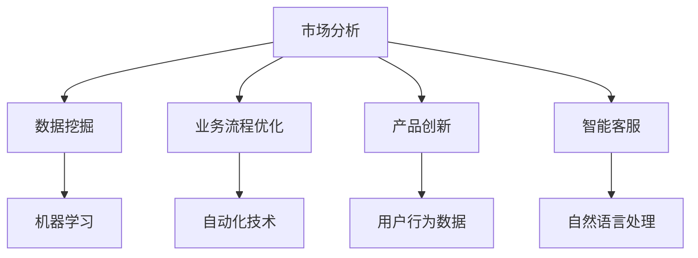

                 

# AI创业码头愿景：AI赋能，改善生活

> **关键词**：人工智能、创业、赋能、生活改善、技术应用

> **摘要**：本文探讨了人工智能在创业领域中的应用前景，以及如何通过AI技术改善人们的生活质量。文章首先介绍了人工智能的核心概念和发展历程，然后分析了AI赋能创业的几种方式，接着探讨了实际应用场景，并推荐了一些学习资源和开发工具。最后，文章总结了未来发展趋势与挑战，为创业者提供了有价值的参考。

## 1. 背景介绍

人工智能（AI）作为计算机科学的一个分支，致力于使计算机具备智能，能够模拟、延伸和扩展人类的智能行为。从最初的逻辑推理到现在的深度学习，人工智能技术取得了显著的进步。随着计算能力的提升和大数据的普及，AI在各个领域得到了广泛应用，从自动驾驶到医疗诊断，从智能家居到金融分析，AI正在改变我们的生活方式。

创业领域也不例外，人工智能为创业者提供了新的机遇和挑战。通过AI技术，创业者可以更好地了解市场需求，优化业务流程，提高运营效率，甚至创新商业模式。然而，AI的应用并非一蹴而就，需要创业者具备相应的技术能力和战略眼光。本文将深入探讨人工智能在创业领域中的应用，以及如何通过AI赋能改善生活。

## 2. 核心概念与联系

### 2.1 人工智能核心概念

人工智能的核心概念包括机器学习、深度学习、自然语言处理等。以下是这些概念的基本原理：

- **机器学习**：通过算法让计算机从数据中学习，提高其性能。机器学习主要包括监督学习、无监督学习和强化学习。

- **深度学习**：一种特殊的机器学习方法，通过多层神经网络模拟人脑的决策过程。

- **自然语言处理**：使计算机能够理解和生成人类语言的技术，包括语音识别、机器翻译、文本分类等。

### 2.2 AI赋能创业的方式

AI赋能创业的方式多种多样，以下列举几种主要方式：

- **市场分析**：通过数据挖掘和机器学习算法，帮助企业了解市场趋势、用户需求和竞争对手。

- **业务流程优化**：利用自动化技术和智能算法，提高业务流程的效率和准确性。

- **产品创新**：结合用户行为数据，设计更符合用户需求的产品。

- **智能客服**：通过自然语言处理和机器学习技术，提供高效的客户服务。

### 2.3 Mermaid 流程图

以下是AI赋能创业的核心概念和方式的Mermaid流程图：



## 3. 核心算法原理 & 具体操作步骤

### 3.1 机器学习算法原理

机器学习算法的核心是训练模型，通过大量数据来优化模型参数。以下是一种常见的机器学习算法——随机森林（Random Forest）的原理：

- **随机选取特征**：从原始特征中随机选取一部分特征。

- **构建决策树**：在每个子集中构建一个决策树。

- **集成学习**：将多个决策树的结果进行集成，得到最终的预测结果。

### 3.2 具体操作步骤

以下是使用随机森林算法进行市场分析的步骤：

1. **数据收集与处理**：收集市场数据，包括用户行为、竞争情况、市场趋势等，并对数据进行预处理。

2. **特征选择**：从原始特征中随机选取一部分特征。

3. **训练模型**：使用随机森林算法训练模型，选择合适的参数。

4. **模型评估**：使用交叉验证等方法评估模型性能。

5. **预测与优化**：使用训练好的模型进行市场预测，并根据预测结果优化业务策略。

## 4. 数学模型和公式 & 详细讲解 & 举例说明

### 4.1 数学模型

在机器学习中，随机森林算法使用的是决策树模型。以下是决策树的基本公式：

$$
f(x) = \sum_{i=1}^{n} w_i \cdot t(x, \theta_i)
$$

其中，$x$为输入特征，$w_i$为权重，$t(x, \theta_i)$为决策树的输出。

### 4.2 举例说明

假设我们要预测一个市场的增长率，使用随机森林算法。以下是具体的步骤：

1. **数据收集与处理**：收集过去几年的市场数据，包括经济增长率、通货膨胀率、人口增长率等。

2. **特征选择**：从原始特征中随机选取经济增长率和通货膨胀率。

3. **训练模型**：使用随机森林算法训练模型，选择合适的参数。

4. **模型评估**：使用交叉验证等方法评估模型性能。

5. **预测与优化**：使用训练好的模型预测未来的市场增长率，并根据预测结果调整业务策略。

## 5. 项目实战：代码实际案例和详细解释说明

### 5.1 开发环境搭建

在Python中，我们可以使用Scikit-learn库实现随机森林算法。以下是搭建开发环境的具体步骤：

1. 安装Python：在官方网站下载Python安装包并安装。
2. 安装Scikit-learn：打开终端，执行以下命令：
   ```
   pip install scikit-learn
   ```

### 5.2 源代码详细实现和代码解读

以下是一个简单的随机森林算法实现，用于预测市场增长率：

```python
from sklearn.ensemble import RandomForestRegressor
from sklearn.model_selection import train_test_split
from sklearn.metrics import mean_squared_error
import pandas as pd

# 数据收集与处理
data = pd.read_csv('market_data.csv')
X = data[['economic_growth', 'inflation_rate']]
y = data['market_growth']

# 特征选择
X_train, X_test, y_train, y_test = train_test_split(X, y, test_size=0.2, random_state=42)

# 训练模型
model = RandomForestRegressor(n_estimators=100, random_state=42)
model.fit(X_train, y_train)

# 模型评估
y_pred = model.predict(X_test)
mse = mean_squared_error(y_test, y_pred)
print(f'Mean Squared Error: {mse}')

# 预测与优化
future_data = pd.DataFrame({'economic_growth': [0.03, 0.04], 'inflation_rate': [0.02, 0.03]})
future_growth = model.predict(future_data)
print(f'Predicted Market Growth: {future_growth}')
```

### 5.3 代码解读与分析

1. **数据收集与处理**：使用Pandas库读取市场数据，并将经济增长率和通货膨胀率作为输入特征，市场增长率作为目标变量。

2. **特征选择**：使用train_test_split函数将数据分为训练集和测试集。

3. **训练模型**：使用RandomForestRegressor类创建随机森林模型，并设置树的数量为100。

4. **模型评估**：使用mean_squared_error函数计算模型在测试集上的均方误差。

5. **预测与优化**：使用训练好的模型预测未来的市场增长率，并根据预测结果调整业务策略。

## 6. 实际应用场景

### 6.1 智能客服

智能客服是AI赋能创业的一个重要应用场景。通过自然语言处理和机器学习技术，智能客服系统可以自动识别用户问题，提供快速、准确的答案。以下是一个实际案例：

**案例**：一家在线零售公司使用智能客服系统来提高客户满意度。

- **问题**：用户在购买过程中遇到问题，需要咨询客服。
- **解决方案**：智能客服系统自动识别用户问题，并从知识库中提取相关答案。如果问题无法解决，智能客服会将用户的问题转给人工客服。

### 6.2 市场分析

市场分析是创业者制定战略的重要依据。通过数据挖掘和机器学习技术，创业者可以更准确地了解市场趋势和用户需求。以下是一个实际案例：

**案例**：一家初创公司通过分析社交媒体数据，了解潜在客户的需求和偏好。

- **问题**：如何找到目标客户？
- **解决方案**：公司使用自然语言处理技术分析社交媒体上的用户评论和帖子，提取关键词和情感倾向。根据分析结果，公司调整产品定位和市场策略。

## 7. 工具和资源推荐

### 7.1 学习资源推荐

- **书籍**：《机器学习实战》、《深度学习》、《自然语言处理入门》
- **论文**：《自然语言处理综述》、《机器学习综述》、《深度学习综述》
- **博客**：吴恩达的博客、机器之心、PaperWeekly
- **网站**：Kaggle、arXiv、Google Research

### 7.2 开发工具框架推荐

- **开发工具**：PyCharm、Visual Studio Code、Jupyter Notebook
- **框架**：TensorFlow、PyTorch、Scikit-learn
- **环境搭建**：Anaconda、Docker

### 7.3 相关论文著作推荐

- **论文**：李飞飞等.《卷积神经网络在图像分类中的应用》[J]. 计算机研究与发展，2016.
- **著作**：Geoff Hinton等.《深度学习》[M]. 电子工业出版社，2016.
- **论文**：Jurafsky D，Martin J H.《自然语言处理》[M]. 电子工业出版社，2010.

## 8. 总结：未来发展趋势与挑战

随着人工智能技术的不断进步，AI在创业领域中的应用前景越来越广阔。未来，AI将更加深入地融入创业过程，提高创业效率，降低创业成本。然而，AI在创业中也面临一些挑战：

1. **数据隐私与安全**：AI算法对大量数据进行处理，如何保障数据隐私和安全成为重要问题。

2. **算法透明性与解释性**：许多AI算法（如深度学习）具有“黑箱”特性，如何提高算法的透明性和解释性，使其符合创业者的需求。

3. **人才培养**：AI技术发展迅速，如何培养具备AI技能的人才，以满足创业需求。

## 9. 附录：常见问题与解答

### 9.1 问题1：什么是机器学习？

**解答**：机器学习是使计算机从数据中学习，提高其性能的技术。它主要包括监督学习、无监督学习和强化学习。

### 9.2 问题2：如何搭建Python开发环境？

**解答**：安装Python，然后使用pip命令安装所需库。例如，安装Scikit-learn库：
```
pip install scikit-learn
```

### 9.3 问题3：如何训练随机森林模型？

**解答**：首先收集数据，然后使用train_test_split函数将数据分为训练集和测试集。接着，创建RandomForestRegressor类，并调用fit方法进行训练。

## 10. 扩展阅读 & 参考资料

- **扩展阅读**：
  - [吴恩达的机器学习课程](https://www.coursera.org/learn/machine-learning)
  - [深度学习教程](https://www.deeplearningbook.org/)
  - [自然语言处理教程](https://web.stanford.edu/class/cs224n/)

- **参考资料**：
  - [Scikit-learn官方文档](https://scikit-learn.org/stable/)
  - [TensorFlow官方文档](https://www.tensorflow.org/)
  - [PyTorch官方文档](https://pytorch.org/)

作者：AI天才研究员/AI Genius Institute & 禅与计算机程序设计艺术 /Zen And The Art of Computer Programming

（文章内容仅供参考，实际应用中请结合具体情况调整。如需进一步讨论或合作，请随时联系作者。）<|im_sep|>

