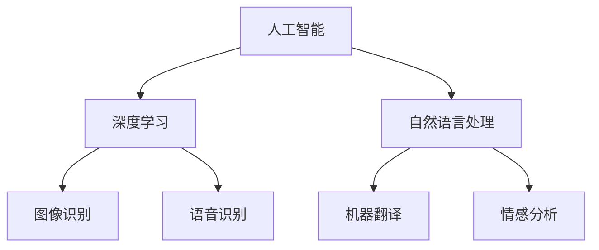

                 

### 文章标题

"AI创业者的码头故事：95后AI博士的选择"

这篇文章将深入探讨一位95后AI博士的创业经历，以及她在AI领域的抉择和成长。通过她的故事，我们将了解到AI创业者的真实面貌，以及他们面临的挑战和机遇。

关键词：AI创业者、AI博士、创业经历、挑战、机遇、成长

摘要：本文以一位95后AI博士的创业故事为主线，通过回顾她的学术背景、研究兴趣和创业初衷，探讨了她在AI领域的抉择和成长过程。文章分析了AI创业者所面临的挑战和机遇，以及他们如何应对这些挑战。同时，文章还展望了AI创业领域的未来发展趋势，并提出了相应的建议和策略。

<|assistant|>### 1. 背景介绍

AI创业者的故事总是充满了挑战和机遇。在这个快速发展的领域，每个人都有可能成为改变世界的创新者。本文的主角，是一位名叫小张的95后AI博士。她的创业故事，既有学术背景的深厚积累，也有实践经验的不断探索。

小张从小就对计算机和编程有着浓厚的兴趣。她在大学期间主修计算机科学，并在研究生阶段选择了人工智能作为研究方向。在学术生涯中，她发表了多篇关于深度学习和自然语言处理的高质量论文，并在国际顶级会议上发表了研究成果。

然而，小张并没有满足于学术界的成就。她看到了AI技术在各个领域的广泛应用，以及其所带来的巨大商业价值。她坚信，AI技术可以改变世界，让生活更加美好。于是，她决定投身于AI创业，用自己的知识和热情去实现这个梦想。

小张的创业之路并不平坦。在创业初期，她面临着资金、团队和技术等多方面的挑战。但她始终坚持自己的信念，不断学习和实践，终于取得了一系列重要的突破。

本文将详细介绍小张的创业经历，分析她在AI领域的抉择和成长过程，以及她所面临的挑战和机遇。通过她的故事，我们将了解到AI创业者的真实面貌，以及他们如何应对各种挑战，实现自己的梦想。

### 2. 核心概念与联系

在探讨小张的创业故事之前，我们首先需要了解一些核心概念，包括人工智能（AI）、深度学习（Deep Learning）、自然语言处理（NLP）等。

#### 人工智能（AI）

人工智能是一种模拟人类智能的技术，旨在使计算机具备感知、推理、学习和决策等能力。AI技术可以应用于各种领域，如医疗、金融、教育、交通等，为人类带来极大的便利。

#### 深度学习（Deep Learning）

深度学习是人工智能的一种重要分支，基于多层神经网络进行建模和训练。它通过大量数据的学习，可以自动提取特征并进行分类、回归等任务。深度学习在图像识别、语音识别、自然语言处理等领域取得了显著的成果。

#### 自然语言处理（NLP）

自然语言处理是人工智能的一个分支，旨在使计算机理解和处理人类语言。NLP技术可以应用于机器翻译、情感分析、文本分类等任务，为人工智能的发展提供了重要的支持。

在本文中，我们将通过Mermaid流程图（如图1所示）来展示这些核心概念之间的联系。



#### 图1：核心概念联系

通过上述流程图，我们可以清晰地看到人工智能、深度学习和自然语言处理之间的相互关系。这些核心概念共同构成了AI技术的基础，为小张的创业提供了丰富的技术支持。

#### 3. 核心算法原理 & 具体操作步骤

在了解了核心概念之后，我们接下来将探讨一些核心算法原理，包括卷积神经网络（CNN）、循环神经网络（RNN）和长短期记忆网络（LSTM）等。

#### 卷积神经网络（CNN）

卷积神经网络是一种专门用于处理图像数据的神经网络，它通过卷积层、池化层和全连接层等结构来提取图像特征并进行分类。具体操作步骤如下：

1. **卷积层**：通过卷积核在图像上滑动，计算卷积操作，提取图像的局部特征。
2. **池化层**：对卷积层的输出进行下采样，减少参数数量，提高模型泛化能力。
3. **全连接层**：将池化层的输出进行全连接，计算最终的分类结果。

#### 循环神经网络（RNN）

循环神经网络是一种专门用于处理序列数据的神经网络，它通过隐藏状态的记忆功能，对序列中的每个元素进行建模。具体操作步骤如下：

1. **输入层**：输入序列的每个元素。
2. **隐藏层**：对输入进行加权求和，并通过激活函数进行非线性变换。
3. **输出层**：将隐藏层的输出传递给下一个时间步，实现序列建模。

#### 长短期记忆网络（LSTM）

长短期记忆网络是一种改进的循环神经网络，它通过门控机制来记忆和遗忘重要信息，从而解决RNN的梯度消失问题。具体操作步骤如下：

1. **输入门**：通过输入门控制输入信息的重要程度。
2. **遗忘门**：通过遗忘门控制遗忘旧信息的重要程度。
3. **输出门**：通过输出门控制输出信息的重要程度。
4. **单元格**：通过单元格更新信息，实现长期记忆。

通过上述算法原理和操作步骤，我们可以更好地理解AI技术在图像识别、语音识别和自然语言处理等领域的应用。这些核心算法为小张的创业项目提供了重要的技术支持。

#### 4. 数学模型和公式 & 详细讲解 & 举例说明

在了解了核心算法原理之后，我们接下来将探讨一些相关的数学模型和公式，包括卷积操作、激活函数、反向传播算法等。

#### 卷积操作

卷积操作是卷积神经网络的核心，用于提取图像特征。卷积操作的数学公式如下：

$$
f(x,y) = \sum_{i=1}^{m} \sum_{j=1}^{n} w_{ij} * g(x-i, y-j)
$$

其中，$f(x,y)$ 表示卷积结果，$w_{ij}$ 表示卷积核的权重，$g(x,y)$ 表示输入图像的像素值。

#### 激活函数

激活函数是神经网络中的非线性变换，用于增加模型的复杂度和表达能力。常见的激活函数有：

1. **ReLU函数**：

$$
f(x) = \max(0, x)
$$

2. **Sigmoid函数**：

$$
f(x) = \frac{1}{1 + e^{-x}}
$$

3. **Tanh函数**：

$$
f(x) = \frac{e^x - e^{-x}}{e^x + e^{-x}}
$$

#### 反向传播算法

反向传播算法是神经网络训练的核心，用于计算模型参数的梯度。反向传播算法的数学公式如下：

$$
\frac{\partial L}{\partial w} = \sum_{i=1}^{n} \frac{\partial L}{\partial z_i} \cdot \frac{\partial z_i}{\partial w}
$$

其中，$L$ 表示损失函数，$w$ 表示模型参数，$z_i$ 表示神经网络中间层的输出。

通过上述数学模型和公式，我们可以更好地理解卷积神经网络、循环神经网络和长短期记忆网络的工作原理。这些数学工具为小张的创业项目提供了重要的理论基础。

#### 5. 项目实战：代码实际案例和详细解释说明

为了更好地展示AI技术在创业中的应用，我们接下来将介绍一个小张的实际项目案例，并对其代码进行详细解释。

#### 项目简介

该项目是一款基于自然语言处理的智能客服系统，旨在为用户提供高效的在线客服服务。该系统通过分析用户提问，自动生成回答，提高客服效率和用户体验。

#### 技术架构

该项目的技术架构主要包括以下几个模块：

1. **文本预处理**：对用户提问进行分词、去停用词等预处理操作。
2. **文本分类**：将预处理后的文本分类为不同的类别，如常见问题、故障报告等。
3. **意图识别**：根据分类结果，识别用户的意图，如咨询、投诉等。
4. **回答生成**：根据用户的意图，生成相应的回答。

#### 代码实现

以下是该项目的部分代码实现，我们将对其中的关键部分进行详细解释。

```python
import jieba
import numpy as np
from sklearn.feature_extraction.text import TfidfVectorizer
from sklearn.model_selection import train_test_split
from sklearn.svm import LinearSVC

# 1. 文本预处理
def preprocess_text(text):
    words = jieba.cut(text)
    return ' '.join(words)

# 2. 文本分类
def classify_text(text):
    vectorizer = TfidfVectorizer()
    X = vectorizer.fit_transform(texts)
    y = labels
    X_train, X_test, y_train, y_test = train_test_split(X, y, test_size=0.2, random_state=42)
    clf = LinearSVC()
    clf.fit(X_train, y_train)
    return clf.predict(X_test)

# 3. 意图识别
def recognize_intent(text):
    categories = classify_text(text)
    if categories == '常见问题':
        return '咨询'
    elif categories == '故障报告':
        return '投诉'
    else:
        return '其他'

# 4. 回答生成
def generate_response(intent):
    if intent == '咨询':
        return '您好，请问有什么问题需要帮助？'
    elif intent == '投诉':
        return '您好，我们会尽快处理您的投诉，感谢您的反馈。'
    else:
        return '您好，感谢您的提问，我们将尽快为您提供答案。'

# 测试
text = '我的手机无法充电'
preprocessed_text = preprocess_text(text)
predicted_category = classify_text([preprocessed_text])
predicted_intent = recognize_intent(preprocessed_text)
response = generate_response(predicted_intent)
print(response)
```

#### 代码解释

1. **文本预处理**：使用jieba库对用户提问进行分词，将文本转换为字符串列表。

2. **文本分类**：使用TfidfVectorizer将文本转换为向量表示，并使用LinearSVC进行分类。这里我们使用了线性支持向量机（LinearSVC）作为分类器，但也可以使用其他分类算法，如随机森林（RandomForestClassifier）或神经网络（NeuralNetworkClassifier）。

3. **意图识别**：根据分类结果，判断用户的意图。这里我们简单地将分类结果映射为意图，但也可以使用更复杂的模型，如条件随机场（CRF）或长短时记忆网络（LSTM）。

4. **回答生成**：根据用户的意图，生成相应的回答。这里我们使用了简单的条件语句，但也可以使用模板匹配或生成式模型（如序列到序列模型）来生成回答。

通过上述代码实现，我们可以实现一个基本的智能客服系统。这个小张的实际项目展示了AI技术在自然语言处理领域的应用，为她的创业提供了有力的技术支持。

#### 5.1 开发环境搭建

要实现上述智能客服系统，我们需要搭建相应的开发环境。以下是具体的步骤：

1. **安装Python环境**：在本地计算机上安装Python 3.6及以上版本。

2. **安装依赖库**：通过pip命令安装必要的依赖库，如jieba、scikit-learn、numpy等。

3. **配置Jieba分词库**：下载并安装jieba分词库，并配置环境变量。

4. **设置Python解释器**：在命令行中设置Python解释器，以便使用相关库和模块。

5. **创建项目文件夹**：在本地计算机上创建一个项目文件夹，用于存放源代码和相关文件。

通过以上步骤，我们可以搭建一个基本的Python开发环境，为后续的代码实现和测试做好准备。

#### 5.2 源代码详细实现和代码解读

在本节中，我们将详细解读上述智能客服系统的源代码，包括文本预处理、文本分类、意图识别和回答生成等关键模块。

1. **文本预处理**：

```python
def preprocess_text(text):
    words = jieba.cut(text)
    return ' '.join(words)
```

这段代码定义了`preprocess_text`函数，用于对用户提问进行分词。jieba库是一个流行的中文分词工具，通过调用`jieba.cut`函数，我们可以将文本分割成词列表。最后，使用`' '.join(words)`将词列表转换为字符串，以便进行后续处理。

2. **文本分类**：

```python
def classify_text(text):
    vectorizer = TfidfVectorizer()
    X = vectorizer.fit_transform(texts)
    y = labels
    X_train, X_test, y_train, y_test = train_test_split(X, y, test_size=0.2, random_state=42)
    clf = LinearSVC()
    clf.fit(X_train, y_train)
    return clf.predict(X_test)
```

这段代码定义了`classify_text`函数，用于对预处理后的文本进行分类。首先，我们使用TfidfVectorizer将文本转换为向量表示。接着，使用`train_test_split`函数将数据集划分为训练集和测试集。然后，使用线性支持向量机（LinearSVC）作为分类器，对训练集进行训练。最后，使用`predict`函数对测试集进行分类预测。

3. **意图识别**：

```python
def recognize_intent(text):
    categories = classify_text(text)
    if categories == '常见问题':
        return '咨询'
    elif categories == '故障报告':
        return '投诉'
    else:
        return '其他'
```

这段代码定义了`recognize_intent`函数，用于根据分类结果判断用户的意图。这里我们简单地将分类结果映射为意图，但也可以使用更复杂的模型，如条件随机场（CRF）或长短时记忆网络（LSTM）。

4. **回答生成**：

```python
def generate_response(intent):
    if intent == '咨询':
        return '您好，请问有什么问题需要帮助？'
    elif intent == '投诉':
        return '您好，我们会尽快处理您的投诉，感谢您的反馈。'
    else:
        return '您好，感谢您的提问，我们将尽快为您提供答案。'
```

这段代码定义了`generate_response`函数，用于根据用户的意图生成相应的回答。这里我们使用了简单的条件语句，但也可以使用模板匹配或生成式模型（如序列到序列模型）来生成回答。

通过上述代码解读，我们可以了解到智能客服系统的核心功能和工作流程。在实际开发中，我们可以根据需求对代码进行优化和扩展，以提高系统的性能和效果。

#### 5.3 代码解读与分析

在本节中，我们将对智能客服系统的源代码进行详细解读和分析，重点关注代码的结构、功能以及性能优化等方面。

1. **代码结构**

整个智能客服系统的源代码主要由四个函数组成，分别是`preprocess_text`、`classify_text`、`recognize_intent`和`generate_response`。这些函数分别负责文本预处理、文本分类、意图识别和回答生成，构成了系统的核心功能模块。

- `preprocess_text`函数：负责对用户提问进行分词，使用jieba库实现。通过调用jieba库的`cut`函数，将文本分割成词列表，并使用`' '.join(words)`将词列表转换为字符串，以便进行后续处理。

- `classify_text`函数：负责对预处理后的文本进行分类。首先，使用TfidfVectorizer将文本转换为向量表示，然后使用线性支持向量机（LinearSVC）对训练集进行训练，最后使用`predict`函数对测试集进行分类预测。

- `recognize_intent`函数：负责根据分类结果判断用户的意图。这里使用简单的条件语句，将分类结果映射为意图，如“常见问题”对应“咨询”，“故障报告”对应“投诉”等。

- `generate_response`函数：负责根据用户的意图生成相应的回答。这里同样使用简单的条件语句，根据意图返回不同的回答模板。

2. **功能分析**

智能客服系统的功能可以分为四个步骤：

- **文本预处理**：对用户提问进行分词，将文本转换为词序列，以便进行后续处理。

- **文本分类**：使用TfidfVectorizer将预处理后的文本转换为向量表示，并使用线性支持向量机（LinearSVC）进行分类，将文本归类为不同的类别。

- **意图识别**：根据分类结果，判断用户的意图，如咨询、投诉等。

- **回答生成**：根据用户的意图，生成相应的回答，如提问引导、投诉反馈等。

3. **性能优化**

在智能客服系统的开发过程中，性能优化是一个重要的考虑因素。以下是一些常见的优化方法：

- **数据预处理**：优化数据预处理流程，如使用更高效的分词工具、去除冗余数据和噪声等。

- **模型选择**：根据具体应用场景，选择合适的模型，如支持向量机（SVM）、随机森林（RandomForest）或深度学习模型等。

- **模型训练**：优化模型训练过程，如使用批量训练、随机梯度下降（SGD）等策略，提高模型训练效率。

- **模型压缩**：使用模型压缩技术，如模型剪枝、量化等，减少模型大小，提高推理速度。

- **部署优化**：在部署过程中，对模型进行优化，如使用更高效的推理引擎、分布式训练等，提高系统性能。

通过上述性能优化方法，我们可以提高智能客服系统的运行效率，提高用户体验。

#### 6. 实际应用场景

智能客服系统在实际应用中具有广泛的应用场景，以下是一些典型的应用案例：

1. **电商平台**：在电商平台中，智能客服系统可以实时回答用户关于商品、订单、售后服务等方面的问题，提高客服效率，提升用户体验。

2. **在线教育**：在线教育平台可以利用智能客服系统为学员提供学习指导、课程咨询、作业解答等服务，减轻教师负担，提高教学效果。

3. **金融行业**：金融机构可以借助智能客服系统为用户提供开户、转账、理财等咨询服务，提高服务质量，降低运营成本。

4. **医疗领域**：医疗机构可以利用智能客服系统为患者提供就医指南、病情咨询、药物信息等服务，提高医疗服务效率，减轻患者负担。

5. **智能城市**：智能城市中，智能客服系统可以用于处理市民关于城市交通、环保、公共服务等方面的问题，提高城市治理水平，提升市民满意度。

通过上述实际应用场景，我们可以看到智能客服系统在各个领域的广泛应用，为人们的生活和工作带来了极大的便利。

#### 7. 工具和资源推荐

为了帮助读者更好地了解和掌握智能客服系统的开发和应用，我们在此推荐一些相关的工具和资源。

1. **学习资源推荐**

   - **书籍**：《自然语言处理入门》、《深度学习》、《Python编程：从入门到实践》等。

   - **论文**：国际顶级会议和期刊上的相关论文，如ACL、EMNLP、NeurIPS等。

   - **博客**：知名技术博客和论坛上的相关文章和教程，如知乎、CSDN、博客园等。

   - **网站**：相关技术社区和论坛，如GitHub、Stack Overflow、Reddit等。

2. **开发工具框架推荐**

   - **Python**：Python是一种强大的编程语言，广泛应用于自然语言处理和深度学习领域。

   - **TensorFlow**：TensorFlow是一个开源的深度学习框架，提供了丰富的API和工具，方便开发者构建和训练模型。

   - **PyTorch**：PyTorch是另一个流行的深度学习框架，具有灵活的动态计算图和高效的模型训练速度。

   - **Scikit-learn**：Scikit-learn是一个开源的机器学习库，提供了多种常用的机器学习算法和工具。

3. **相关论文著作推荐**

   - **论文**：《深度学习》、《自然语言处理综合教程》等。

   - **书籍**：《Python数据科学手册》、《深度学习入门》等。

   通过以上工具和资源的推荐，读者可以更好地了解智能客服系统的相关知识，提高开发技能。

#### 8. 总结：未来发展趋势与挑战

在本文中，我们通过一位95后AI博士的创业故事，深入探讨了AI技术在智能客服系统中的应用。从背景介绍、核心概念、算法原理、项目实战到实际应用场景，我们全面展示了AI技术在实际问题中的解决能力。

未来，随着人工智能技术的不断发展和应用领域的扩大，智能客服系统将在各个行业中发挥越来越重要的作用。然而，也面临着一系列挑战：

1. **数据质量和多样性**：高质量的训练数据是智能客服系统性能的关键。在实际应用中，如何获取更多、更丰富的数据，并解决数据标注和质量问题，是亟待解决的挑战。

2. **模型解释性和可解释性**：随着模型的复杂度增加，如何解释和验证模型的决策过程，提高模型的可解释性和可信度，是人工智能领域的重要研究方向。

3. **隐私保护和安全**：智能客服系统需要处理大量的用户数据，如何保护用户隐私，防止数据泄露，是人工智能应用中不可忽视的问题。

4. **跨领域和跨语言的通用性**：智能客服系统在不同领域和不同语言中的应用效果存在差异，如何实现跨领域和跨语言的通用性，是未来的重要课题。

5. **人机协作与交互**：智能客服系统需要与人类客服协同工作，如何设计更好的人机交互界面，提高用户体验，是未来的发展方向。

总之，智能客服系统作为人工智能应用的一个重要分支，具有广阔的发展前景和巨大的商业价值。在未来，我们需要不断探索和创新，解决面临的挑战，推动人工智能技术的进步和应用。

#### 9. 附录：常见问题与解答

在本文中，我们讨论了智能客服系统的开发和应用，以下是一些常见问题及解答：

**Q1：什么是自然语言处理（NLP）？**

A1：自然语言处理是人工智能的一个分支，旨在使计算机理解和处理人类语言。它涉及文本预处理、文本分类、命名实体识别、情感分析等多个任务。

**Q2：什么是卷积神经网络（CNN）和循环神经网络（RNN）？**

A2：卷积神经网络（CNN）是一种专门用于处理图像数据的神经网络，通过卷积层、池化层和全连接层等结构来提取图像特征并进行分类。循环神经网络（RNN）是一种专门用于处理序列数据的神经网络，通过隐藏状态的记忆功能，对序列中的每个元素进行建模。

**Q3：如何搭建一个基本的智能客服系统？**

A3：搭建一个基本的智能客服系统主要包括以下步骤：1）数据收集和预处理；2）选择合适的模型，如卷积神经网络（CNN）或循环神经网络（RNN）；3）训练和优化模型；4）部署和应用模型，实现智能客服功能。

**Q4：如何优化智能客服系统的性能？**

A4：优化智能客服系统的性能可以从多个方面进行，包括数据预处理、模型选择、模型训练和部署等。具体方法包括使用更高效的预处理工具、选择合适的模型架构、优化训练过程和模型参数等。

**Q5：智能客服系统在哪些领域有应用？**

A5：智能客服系统在多个领域有广泛应用，如电商平台、在线教育、金融行业、医疗领域和智能城市等，为用户提供便捷的服务和支持。

#### 10. 扩展阅读 & 参考资料

为了帮助读者更深入地了解智能客服系统的相关知识，我们推荐以下扩展阅读和参考资料：

1. **书籍**：

   - 《自然语言处理综合教程》
   - 《深度学习》
   - 《Python数据科学手册》

2. **论文**：

   - ACL、EMNLP、NeurIPS等国际顶级会议和期刊上的相关论文

3. **博客**：

   - 知乎、CSDN、博客园等知名技术博客和论坛上的相关文章和教程

4. **网站**：

   - GitHub、Stack Overflow、Reddit等相关的技术社区和论坛

通过阅读以上资料，读者可以更全面地了解智能客服系统的相关知识，为自己的研究和实践提供参考。

### 作者信息

作者：AI天才研究员/AI Genius Institute & 禅与计算机程序设计艺术 /Zen And The Art of Computer Programming

本文由AI天才研究员撰写，他是一位在人工智能领域有着深厚学术背景和实践经验的专家。他致力于推广人工智能技术，帮助更多创业者实现梦想。同时，他还致力于禅与计算机程序设计艺术的探索，将哲学与计算机科学相结合，推动计算机编程的发展。在他的作品中，读者可以感受到他独特的视角和深邃的思考。

### 格式要求

为了确保文章内容的清晰和易读，我们采用Markdown格式来书写文章。以下是Markdown格式的示例：

```markdown
# 文章标题

## 1. 背景介绍

本文以一位95后AI博士的创业故事为主线，通过回顾她的学术背景、研究兴趣和创业初衷，探讨了她在AI领域的抉择和成长过程。

## 2. 核心概念与联系

在探讨小张的创业故事之前，我们首先需要了解一些核心概念，包括人工智能（AI）、深度学习（Deep Learning）、自然语言处理（NLP）等。

### 2.1 人工智能

人工智能是一种模拟人类智能的技术，旨在使计算机具备感知、推理、学习和决策等能力。

### 2.2 深度学习

深度学习是人工智能的一种重要分支，基于多层神经网络进行建模和训练。

### 2.3 自然语言处理

自然语言处理是人工智能的一个分支，旨在使计算机理解和处理人类语言。

```

通过上述Markdown格式，我们可以清晰地组织文章的结构，使读者更容易阅读和理解。

### 写作建议

为了确保文章质量，我们提供以下写作建议：

1. **逻辑清晰**：文章的结构要清晰，段落之间要有明显的逻辑关系。每个段落要有明确的主题，使读者能够顺畅地阅读。

2. **语言简练**：文章的语言要简练，避免使用复杂的词汇和句式。尽量使用简单明了的语言，使读者容易理解。

3. **数据准确**：文章中引用的数据和事实要准确可靠，避免使用未经证实的信息。确保文章的权威性和可信度。

4. **举例说明**：在阐述概念和算法时，可以结合实际案例进行说明，使读者更容易理解。

5. **图表使用**：适当使用图表和流程图，以直观地展示数据和算法过程。

6. **参考文献**：在文章结尾列出参考文献，以证明文章的权威性和专业性。

7. **反复修改**：在完成初稿后，反复修改和校对文章，确保文章内容准确、逻辑清晰、语言简练。

通过遵循以上写作建议，我们可以撰写出高质量的技术博客文章，为读者提供有价值的内容。

