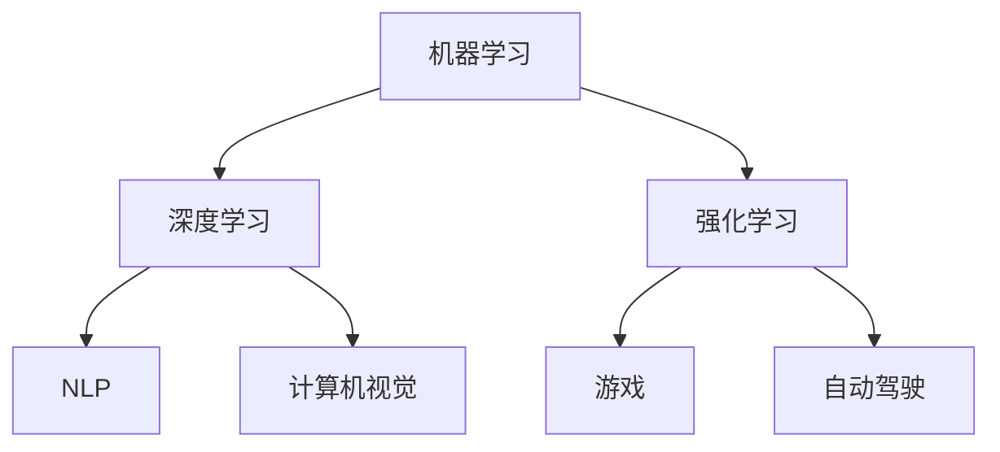

                 

# AI创业：人工智能的革命性突破

## 关键词：人工智能创业、AI 技术突破、技术分析、商业应用、未来趋势

> 摘要：本文旨在探讨人工智能领域在近年来的革命性突破，以及这些突破对创业公司带来的机遇和挑战。文章将深入分析AI技术的核心概念、算法原理、数学模型、实际应用场景，并推荐相关的学习资源和开发工具，最后总结未来发展趋势与挑战。

## 1. 背景介绍

人工智能（AI）作为计算机科学的一个分支，旨在使计算机具备类似于人类智能的能力，进行感知、学习、推理、决策等任务。近年来，随着计算能力的提升、大数据的涌现、算法的优化以及深度学习的兴起，人工智能技术取得了令人瞩目的突破。

### 1.1. 计算能力的提升

随着摩尔定律的持续推进，计算机的处理能力不断增长。这不仅为AI算法的复杂度提升提供了硬件基础，也为更大规模的模型训练和应用成为可能。

### 1.2. 大数据的涌现

互联网的普及和物联网的发展，使得大量数据得以生成和收集。这些数据为AI算法的训练提供了丰富的素材，使得模型更加精确和高效。

### 1.3. 算法的优化

机器学习算法的不断发展，尤其是深度学习的崛起，使得计算机在图像识别、自然语言处理、游戏对弈等方面取得了重大突破。

### 1.4. 商业应用的需求

随着AI技术的成熟，越来越多的企业开始将其应用于生产、运营、营销等各个环节，以提升效率和竞争力。这为AI创业公司提供了广阔的市场。

## 2. 核心概念与联系

为了更好地理解AI技术，我们需要明确以下几个核心概念及其之间的联系：

### 2.1. 机器学习

机器学习是一种让计算机通过数据学习规律和模式的方法。其主要目的是从数据中发现模式和规律，并利用这些规律进行预测和决策。

### 2.2. 深度学习

深度学习是机器学习的一种方法，其核心思想是通过多层神经网络模拟人类大脑的处理过程，从而实现复杂的模式识别和任务执行。

### 2.3. 强化学习

强化学习是一种通过试错和反馈来优化行为策略的方法。它通过与环境的交互来学习如何做出最优决策，常见于游戏、自动驾驶等领域。

### 2.4. 自然语言处理

自然语言处理（NLP）是AI技术的一个重要分支，旨在使计算机理解和生成人类语言。它广泛应用于语音识别、机器翻译、文本分类等领域。

### 2.5. 计算机视觉

计算机视觉是使计算机能够从图像或视频中提取有用信息的一种技术。它广泛应用于图像识别、目标检测、人脸识别等领域。

## 2.6. Mermaid 流程图



## 3. 核心算法原理 & 具体操作步骤

### 3.1. 深度学习算法原理

深度学习算法主要依赖于多层神经网络。其基本原理如下：

1. **输入层**：接收外部输入，如图像、文本等。
2. **隐藏层**：对输入数据进行特征提取和变换。
3. **输出层**：生成预测结果或决策。

具体操作步骤：

1. **数据预处理**：对输入数据进行归一化、标准化等处理，以便于模型训练。
2. **模型构建**：设计并构建多层神经网络，包括输入层、隐藏层和输出层。
3. **损失函数选择**：选择适当的损失函数，如均方误差、交叉熵等，以衡量预测结果与真实值之间的差距。
4. **反向传播**：通过反向传播算法更新模型参数，使损失函数值最小化。
5. **模型训练**：重复迭代训练过程，直到满足停止条件（如迭代次数、模型性能等）。

### 3.2. 强化学习算法原理

强化学习算法的核心思想是最大化回报，其基本原理如下：

1. **状态**：系统所处的某种情况。
2. **动作**：系统可以采取的行动。
3. **奖励**：动作在当前状态下带来的即时回报。

具体操作步骤：

1. **初始化**：设置初始状态、动作和回报。
2. **环境交互**：根据当前状态选择动作，并获取新的状态和奖励。
3. **更新策略**：基于奖励和策略更新模型参数，以最大化长期回报。
4. **重复迭代**：不断重复环境交互和策略更新的过程，直至达到目标状态或满足停止条件。

## 4. 数学模型和公式 & 详细讲解 & 举例说明

### 4.1. 深度学习数学模型

深度学习中的数学模型主要包括以下内容：

1. **激活函数**：如Sigmoid、ReLU、Tanh等，用于引入非线性变换。
2. **损失函数**：如均方误差（MSE）、交叉熵（CE）等，用于衡量预测结果与真实值之间的差距。
3. **优化算法**：如梯度下降（GD）、随机梯度下降（SGD）、Adam等，用于更新模型参数。

### 4.2. 举例说明

以深度学习中的多层感知机（MLP）为例，其基本结构如下：

1. **输入层**：\(x = [x_1, x_2, ..., x_n]\)
2. **隐藏层**：\(h = \sigma(Wx + b)\)，其中\(W\)为权重矩阵，\(b\)为偏置，\(\sigma\)为激活函数。
3. **输出层**：\(y = \sigma(W_h h + b_h)\)

假设我们有一个二分类问题，损失函数为交叉熵：

$$
L = -\sum_{i=1}^{m} [y_i \log(a^{(2)}_i) + (1 - y_i) \log(1 - a^{(2)}_i)]
$$

其中，\(y_i\)为真实标签，\(a^{(2)}_i\)为输出层的预测概率。

采用梯度下降算法进行参数更新：

$$
\frac{\partial L}{\partial W} = -\sum_{i=1}^{m} (y_i - a^{(2)}_i) x_i
$$

$$
\frac{\partial L}{\partial b} = -\sum_{i=1}^{m} (y_i - a^{(2)}_i)
$$

## 5. 项目实战：代码实际案例和详细解释说明

### 5.1. 开发环境搭建

在本案例中，我们将使用Python编程语言和TensorFlow框架来实现一个简单的深度神经网络。以下为开发环境搭建步骤：

1. **安装Python**：下载并安装Python 3.x版本。
2. **安装TensorFlow**：在终端执行以下命令：
   ```
   pip install tensorflow
   ```
3. **验证安装**：在终端执行以下命令：
   ```
   python -c "import tensorflow as tf; print(tf.__version__)"
   ```

### 5.2. 源代码详细实现和代码解读

以下是一个简单的深度神经网络实现，用于对手写数字进行分类：

```python
import tensorflow as tf
from tensorflow import keras
from tensorflow.keras import layers

# 加载数据集
(x_train, y_train), (x_test, y_test) = keras.datasets.mnist.load_data()

# 数据预处理
x_train = x_train.reshape((60000, 28, 28, 1)).astype("float32") / 255
x_test = x_test.reshape((10000, 28, 28, 1)).astype("float32") / 255
y_train = keras.utils.to_categorical(y_train, 10)
y_test = keras.utils.to_categorical(y_test, 10)

# 模型构建
model = keras.Sequential()
model.add(layers.Conv2D(32, (3, 3), activation='relu', input_shape=(28, 28, 1)))
model.add(layers.MaxPooling2D((2, 2)))
model.add(layers.Conv2D(64, (3, 3), activation='relu'))
model.add(layers.MaxPooling2D((2, 2)))
model.add(layers.Conv2D(64, (3, 3), activation='relu'))
model.add(layers.Flatten())
model.add(layers.Dense(64, activation='relu'))
model.add(layers.Dense(10, activation='softmax'))

# 编译模型
model.compile(optimizer='adam',
              loss='categorical_crossentropy',
              metrics=['accuracy'])

# 训练模型
model.fit(x_train, y_train, epochs=5, batch_size=64)

# 评估模型
test_loss, test_acc = model.evaluate(x_test, y_test, verbose=2)
print('\nTest accuracy:', test_acc)
```

### 5.3. 代码解读与分析

1. **数据预处理**：加载数字数据集，并进行归一化处理。
2. **模型构建**：构建一个包含卷积层、池化层和全连接层的深度神经网络。
3. **编译模型**：设置优化器、损失函数和评价指标。
4. **训练模型**：使用训练数据训练模型，迭代次数为5轮。
5. **评估模型**：在测试数据上评估模型性能，输出测试准确率。

## 6. 实际应用场景

### 6.1. 图像识别

深度学习在图像识别领域取得了显著成果，如人脸识别、物体检测、图像分类等。这些技术广泛应用于安全监控、智能家居、医疗诊断等领域。

### 6.2. 自然语言处理

自然语言处理技术已广泛应用于语音识别、机器翻译、文本分类、情感分析等领域。这些技术在智能客服、内容审核、推荐系统等领域具有重要应用。

### 6.3. 自动驾驶

自动驾驶技术依赖于计算机视觉、传感器融合和深度学习等技术。随着技术的不断进步，自动驾驶正逐步从实验室走向现实。

### 6.4. 金融科技

深度学习在金融科技领域也具有广泛的应用，如信用评分、风险控制、量化交易等。这些技术有助于提高金融机构的运营效率。

## 7. 工具和资源推荐

### 7.1. 学习资源推荐

1. **《深度学习》（Ian Goodfellow、Yoshua Bengio、Aaron Courville 著）**：深度学习领域的经典教材，详细介绍了深度学习的基本概念、算法和技术。
2. **《自然语言处理综论》（Daniel Jurafsky、James H. Martin 著）**：全面介绍了自然语言处理的基础知识和应用。
3. **《机器学习》（Tom Mitchell 著）**：机器学习领域的经典教材，涵盖了机器学习的基本概念、算法和应用。

### 7.2. 开发工具框架推荐

1. **TensorFlow**：由Google开发的一款开源深度学习框架，具有丰富的功能和支持。
2. **PyTorch**：由Facebook开发的一款开源深度学习框架，具有灵活的动态计算图和高效的GPU支持。
3. **Keras**：一个高层神经网络API，用于快速构建和训练深度学习模型。

### 7.3. 相关论文著作推荐

1. **《AlexNet：一种用于图像分类的深度卷积神经网络》**：提出了深度卷积神经网络（CNN）在图像分类中的成功应用。
2. **《BERT：预训练的深度语言理解模型》**：介绍了BERT模型在自然语言处理领域的突破性进展。
3. **《深度强化学习》**：详细介绍了深度强化学习的基本概念、算法和应用。

## 8. 总结：未来发展趋势与挑战

### 8.1. 发展趋势

1. **算法优化**：随着硬件性能的提升，算法的优化将成为重点，以实现更高的效率和性能。
2. **多模态学习**：融合不同模态的数据（如图像、文本、声音等），实现更全面的信息理解和处理。
3. **联邦学习**：解决数据隐私问题，实现分布式训练和推理。
4. **自动化机器学习**：自动化地搜索、设计和调优机器学习模型，降低开发门槛。

### 8.2. 挑战

1. **数据质量**：高质量的数据是AI算法成功的关键，但数据获取、清洗和标注等过程充满挑战。
2. **计算资源**：深度学习模型的训练和推理需要大量的计算资源，如何高效利用硬件成为关键问题。
3. **可解释性**：深度学习模型的黑箱特性导致其缺乏可解释性，如何提高模型的可解释性成为研究重点。
4. **法律法规**：随着AI技术的应用越来越广泛，如何制定相应的法律法规来规范其发展和应用成为重要议题。

## 9. 附录：常见问题与解答

### 9.1. 如何入门深度学习？

1. 学习Python编程语言，掌握基础语法和数据结构。
2. 学习数学基础知识，如线性代数、概率论和统计学。
3. 阅读相关教材和论文，了解深度学习的基本概念和算法。
4. 实践项目，动手实现深度学习模型。

### 9.2. 如何选择深度学习框架？

1. 根据项目需求选择合适的框架，如TensorFlow、PyTorch等。
2. 考虑框架的社区支持、文档质量和生态圈。
3. 考虑框架的易用性和可扩展性。

## 10. 扩展阅读 & 参考资料

1. **《深度学习》（Ian Goodfellow、Yoshua Bengio、Aaron Courville 著）**：https://www.deeplearningbook.org/
2. **《自然语言处理综论》（Daniel Jurafsky、James H. Martin 著）**：https://web.stanford.edu/~jurafsky/nlp/
3. **TensorFlow 官网**：https://www.tensorflow.org/
4. **PyTorch 官网**：https://pytorch.org/
5. **Keras 官网**：https://keras.io/

### 作者

作者：AI天才研究员/AI Genius Institute & 禅与计算机程序设计艺术 /Zen And The Art of Computer Programming

