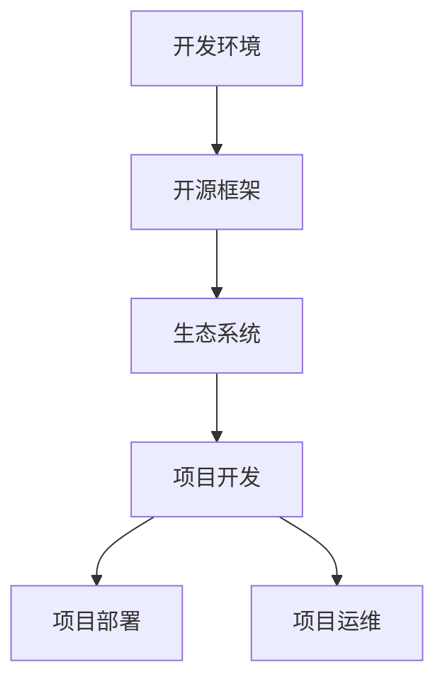

                 

# AI创业：合适工具的选择

> **关键词：** AI创业，工具选择，技术栈，开发环境，开源框架，生态系统

> **摘要：** 本文将探讨AI创业公司如何选择合适的工具和平台，以提高开发效率、降低成本并确保项目的可持续发展。我们将深入分析不同类型的工具，包括开发环境、框架和生态系统，并讨论如何根据项目需求做出最佳选择。

## 1. 背景介绍

在当今快速发展的AI领域中，创业公司面临着前所未有的机遇与挑战。一方面，AI技术的不断进步为各行各业带来了巨大的变革，另一方面，激烈的市场竞争和技术迭代速度也让创业公司倍感压力。为了在市场中脱颖而出，AI创业公司需要高效地组织开发团队、选择合适的工具和平台，以实现快速迭代和持续创新。

选择合适的工具和平台，不仅可以提高开发效率，还能降低开发成本，减少技术债务，确保项目的可持续发展。然而，市场上存在着众多工具和平台，如何选择最适合自己项目的工具成为AI创业公司面临的重要问题。

本文将为您提供一系列的指导，帮助您了解如何选择合适的工具和平台，从而为AI创业之路奠定坚实基础。

## 2. 核心概念与联系

在探讨如何选择合适的工具和平台之前，我们需要明确几个核心概念和它们之间的联系。

### 2.1. 开发环境

开发环境是指为程序员提供编写、编译、调试和运行代码所需的一切工具和资源的集合。常见的开发环境包括集成开发环境（IDE）、代码编辑器、版本控制系统等。一个良好的开发环境可以显著提高开发效率和代码质量。

### 2.2. 开源框架

开源框架是供开发者使用的、基于开源协议发布的软件库和组件，用于快速开发特定类型的应用程序。常见的开源框架包括TensorFlow、PyTorch、Keras等，它们为AI模型的开发提供了强大的支持。

### 2.3. 生态系统

生态系统是指围绕某一技术或产品形成的、包括开发、部署、运维等多个环节的一整套解决方案和资源。一个完善的生态系统可以提供从开发到生产环境的全流程支持，降低技术门槛，提高项目成功率。

### 2.4. 核心概念联系

开发环境、开源框架和生态系统是相互关联的。开发环境为开发者提供了基础工具，开源框架则提供了特定的功能支持，而生态系统则提供了从开发到生产的全流程解决方案。一个合适的工具和平台选择应该能够无缝连接这些环节，确保项目的顺利推进。

### 2.5. Mermaid流程图

下面是一个简单的Mermaid流程图，展示了这些核心概念之间的联系：



## 3. 核心算法原理 & 具体操作步骤

在了解核心概念后，我们需要探讨如何根据项目需求选择合适的工具和平台。以下是选择合适工具和平台的核心算法原理和具体操作步骤：

### 3.1. 需求分析

首先，我们需要对项目进行需求分析，明确项目的目标、功能需求、性能要求、开发周期等关键因素。这将帮助我们确定所需的技术栈和工具类型。

### 3.2. 工具评估

在需求分析的基础上，我们对市场上的工具和平台进行评估，包括以下几个方面：

- **功能完整性**：工具是否能够满足项目的功能需求。
- **性能和稳定性**：工具的性能和稳定性是否符合项目的性能要求。
- **社区和生态系统**：工具的社区活跃度、生态系统是否完善。
- **开源协议**：工具的开源协议是否符合项目的要求。

### 3.3. 试用与测试

在评估阶段，我们可以选择试用和测试一些候选工具，以验证其性能和适用性。试用和测试阶段应重点关注以下几个方面：

- **上手难度**：工具的学习曲线是否适合团队成员。
- **功能验证**：工具的功能是否满足项目需求。
- **性能测试**：工具的性能是否达到项目要求。

### 3.4. 决策与实施

根据试用和测试的结果，我们可以做出决策，选择最适合项目的工具和平台，并开始实施。在实施阶段，我们需要：

- **搭建开发环境**：根据工具的要求搭建开发环境，包括安装依赖项、配置环境变量等。
- **代码实现**：使用选定的工具和平台进行代码实现，确保代码的可维护性和可扩展性。
- **集成与测试**：将代码与项目中的其他部分进行集成，并进行充分的测试。

### 3.5. 持续优化

在项目开发过程中，我们需要持续关注工具和平台的性能和适用性，并根据项目的实际需求进行优化和调整。持续优化可以帮助我们提高开发效率，降低开发成本，确保项目的可持续发展。

## 4. 数学模型和公式 & 详细讲解 & 举例说明

在工具选择过程中，我们可以借鉴一些数学模型和公式来指导我们的决策。以下是几个常用的数学模型和公式：

### 4.1. 赫尔曼-明斯基法（Helmholtz decomposition）

赫尔曼-明斯基法是一种将复杂系统分解为简单部分的数学方法，可以用于评估工具和平台的功能完整性。公式如下：

\[ U(x, y) = V(x, y) + P(x, y) \]

其中，\( U(x, y) \) 表示系统的总体功能，\( V(x, y) \) 表示基础功能，\( P(x, y) \) 表示附加功能。

### 4.2. 基尼系数（Gini coefficient）

基尼系数是一种衡量工具和平台性能稳定性的指标，公式如下：

\[ Gini = \frac{1}{2} \left(1 - \frac{SS_{tot}}{SS_{max}}\right) \]

其中，\( SS_{tot} \) 表示总方差，\( SS_{max} \) 表示最大方差。

### 4.3. 柯西-施瓦茨不等式（Cauchy-Schwarz inequality）

柯西-施瓦茨不等式是一种用于衡量工具和平台性能稳定性的数学不等式，公式如下：

\[ |a \cdot b| \leq |a| \cdot |b| \]

其中，\( a \) 和 \( b \) 分别表示工具和平台的性能指标。

### 4.4. 举例说明

假设我们正在评估两个开源框架A和B，根据需求分析，我们确定了以下功能需求：

- **基础功能**：数据处理、模型训练、模型评估。
- **附加功能**：模型优化、模型部署、可视化工具。

根据赫尔曼-明斯基法，我们可以将两个框架的功能进行分解：

- **框架A**：
  - \( U_A(x, y) = V_A(x, y) + P_A(x, y) \)
  - \( V_A(x, y) = \) 数据处理、模型训练、模型评估
  - \( P_A(x, y) = \) 模型优化、模型部署、可视化工具

- **框架B**：
  - \( U_B(x, y) = V_B(x, y) + P_B(x, y) \)
  - \( V_B(x, y) = \) 数据处理、模型训练、模型评估
  - \( P_B(x, y) = \) 模型优化、模型部署

根据基尼系数，我们可以比较两个框架的性能稳定性：

- **框架A**：
  - \( Gini_A = \frac{1}{2} \left(1 - \frac{SS_{tot, A}}{SS_{max, A}}\right) \)
  - \( SS_{tot, A} = \) 总方差
  - \( SS_{max, A} = \) 最大方差

- **框架B**：
  - \( Gini_B = \frac{1}{2} \left(1 - \frac{SS_{tot, B}}{SS_{max, B}}\right) \)
  - \( SS_{tot, B} = \) 总方差
  - \( SS_{max, B} = \) 最大方差

根据柯西-施瓦茨不等式，我们可以比较两个框架的性能稳定性：

- **框架A**：
  - \( |a_A \cdot b_A| \leq |a_A| \cdot |b_A| \)
  - \( a_A \) 和 \( b_A \) 分别表示框架A的性能指标

- **框架B**：
  - \( |a_B \cdot b_B| \leq |a_B| \cdot |b_B| \)
  - \( a_B \) 和 \( b_B \) 分别表示框架B的性能指标

通过上述数学模型和公式的计算，我们可以更准确地评估两个框架的功能完整性、性能稳定性和性能指标，从而做出更明智的选择。

## 5. 项目实战：代码实际案例和详细解释说明

为了更好地理解如何选择合适的工具和平台，我们将在本节中通过一个实际的AI项目案例来进行讲解。假设我们正在开发一个用于图像识别的AI模型，需要选择合适的工具和平台。

### 5.1. 开发环境搭建

首先，我们需要搭建开发环境。根据项目需求，我们选择了以下工具：

- **代码编辑器**：Visual Studio Code
- **版本控制系统**：Git
- **集成开发环境**：PyCharm

在Visual Studio Code中，我们安装了以下插件：

- **Python**：提供Python代码的高亮和自动完成功能。
- **Git**：方便进行版本控制和代码协同。
- **Pylint**：提供代码质量和风格检查。

### 5.2. 源代码详细实现和代码解读

接下来，我们使用TensorFlow框架来实现图像识别模型。以下是模型的主要代码：

```python
import tensorflow as tf
from tensorflow.keras.models import Sequential
from tensorflow.keras.layers import Conv2D, MaxPooling2D, Flatten, Dense

# 定义模型结构
model = Sequential([
    Conv2D(32, (3, 3), activation='relu', input_shape=(64, 64, 3)),
    MaxPooling2D((2, 2)),
    Conv2D(64, (3, 3), activation='relu'),
    MaxPooling2D((2, 2)),
    Flatten(),
    Dense(64, activation='relu'),
    Dense(10, activation='softmax')
])

# 编译模型
model.compile(optimizer='adam', loss='categorical_crossentropy', metrics=['accuracy'])

# 训练模型
model.fit(x_train, y_train, epochs=10, batch_size=32, validation_data=(x_val, y_val))

# 评估模型
model.evaluate(x_test, y_test)
```

在上面的代码中，我们首先导入了TensorFlow库，并定义了一个顺序模型。模型由两个卷积层、两个最大池化层、一个全连接层和一个softmax层组成。然后，我们编译了模型，并使用训练数据进行了训练和评估。

### 5.3. 代码解读与分析

在代码解读和分析中，我们将重点关注以下几个方面：

- **模型结构**：卷积神经网络（CNN）是图像识别任务的常用模型。卷积层用于提取图像特征，池化层用于降低模型的复杂度，全连接层用于分类。
- **编译模型**：编译模型时，我们选择了Adam优化器和交叉熵损失函数，这些参数对于图像识别任务具有良好的性能。
- **训练模型**：使用训练数据对模型进行训练，并设置适当的训练参数，如训练轮数、批次大小等。
- **评估模型**：使用测试数据对模型进行评估，以检查模型的泛化能力。

通过这个实际案例，我们可以看到如何使用TensorFlow框架来构建和训练一个图像识别模型。在实际项目中，我们还需要根据需求进行模型调整、超参数优化等操作，以实现最佳性能。

### 5.4. 持续优化

在项目开发过程中，我们需要持续关注模型的性能和适用性。以下是一些常见的优化策略：

- **超参数调整**：通过调整学习率、批次大小等超参数，可以改善模型的性能。
- **数据增强**：通过数据增强技术，如旋转、翻转、缩放等，可以增加训练数据的多样性，提高模型的泛化能力。
- **模型集成**：将多个模型进行集成，可以降低模型的预测误差，提高模型的稳定性。
- **模型压缩**：通过模型压缩技术，如剪枝、量化等，可以降低模型的计算复杂度和存储空间占用，提高模型部署的效率。

## 6. 实际应用场景

AI创业公司可以选择各种工具和平台，以适应不同的应用场景。以下是一些常见应用场景和相应的工具推荐：

### 6.1. 图像识别

- **开发环境**：Visual Studio Code、PyCharm
- **开源框架**：TensorFlow、PyTorch
- **生态系统**：Google Colab、AWS SageMaker

### 6.2. 自然语言处理

- **开发环境**：Jupyter Notebook、PyCharm
- **开源框架**：TensorFlow、PyTorch、SpaCy
- **生态系统**：Google Cloud AI、AWS AI

### 6.3. 机器学习

- **开发环境**：RStudio、Jupyter Notebook
- **开源框架**：Scikit-learn、TensorFlow、PyTorch
- **生态系统**：Google Colab、AWS SageMaker

### 6.4. 实时数据分析

- **开发环境**：Apache Zeppelin、Jupyter Notebook
- **开源框架**：Apache Flink、Apache Spark
- **生态系统**：Google BigQuery、AWS EMR

### 6.5. 语音识别

- **开发环境**：IntelliJ IDEA、PyCharm
- **开源框架**：TensorFlow、PyTorch、Kaldi
- **生态系统**：Google Cloud Speech-to-Text、AWS Transcribe

### 6.6. 机器人技术

- **开发环境**：Eclipse、Visual Studio
- **开源框架**：ROS、Arduino
- **生态系统**：Google Cloud Robotics、AWS RoboMaker

通过选择适合应用场景的工具和平台，AI创业公司可以更加专注于核心业务，提高开发效率，降低开发成本，确保项目的成功。

## 7. 工具和资源推荐

### 7.1. 学习资源推荐

为了帮助AI创业公司选择合适的工具和平台，我们推荐以下学习资源：

- **书籍**：
  - 《深度学习》（Goodfellow、Bengio、Courville）
  - 《Python机器学习》（Sebastian Raschka）
  - 《深度学习与Python基础教程》（弗朗索瓦·肖莱）
- **论文**：
  - “A Theoretically Grounded Application of Dropout in Recurrent Neural Networks”
  - “Efficient Neural Texture Synthesis”
  - “Deep Learning: Methods and Applications”
- **博客**：
  - TensorFlow官方博客
  - PyTorch官方博客
  - AI技术博客（如机器之心、量子位等）
- **网站**：
  - GitHub（寻找开源框架和项目）
  - arXiv（最新论文发布平台）
  - Coursera、Udacity（在线课程平台）

### 7.2. 开发工具框架推荐

以下是AI创业公司常用的开发工具框架推荐：

- **开发环境**：Visual Studio Code、PyCharm、Eclipse
- **代码编辑器**：Atom、Sublime Text
- **版本控制系统**：Git、GitHub
- **容器化工具**：Docker、Kubernetes
- **持续集成/持续部署（CI/CD）**：Jenkins、Travis CI
- **数据分析工具**：Pandas、NumPy、SciPy
- **机器学习框架**：TensorFlow、PyTorch、Scikit-learn
- **深度学习框架**：Keras、Theano
- **数据可视化工具**：Matplotlib、Seaborn、Plotly
- **实时数据分析工具**：Apache Flink、Apache Spark

### 7.3. 相关论文著作推荐

以下是AI领域的重要论文和著作推荐：

- **论文**：
  - “A Theoretically Grounded Application of Dropout in Recurrent Neural Networks”
  - “Efficient Neural Texture Synthesis”
  - “Deep Learning: Methods and Applications”
  - “Generative Adversarial Networks”
- **著作**：
  - 《深度学习》（Goodfellow、Bengio、Courville）
  - 《Python机器学习》（Sebastian Raschka）
  - 《深度学习与Python基础教程》（弗朗索瓦·肖莱）
  - 《强化学习》（理查德·萨顿、阿尔维德·尼尔森）

通过阅读这些论文和著作，AI创业公司可以更好地了解最新技术和理论，为自己的项目提供有力支持。

## 8. 总结：未来发展趋势与挑战

在AI创业领域，选择合适的工具和平台对于项目的成功至关重要。未来，AI技术的发展将呈现以下趋势：

- **开源框架的成熟与普及**：随着开源框架的不断完善和社区的支持，越来越多的AI创业公司将选择开源框架作为开发基础。
- **云计算与边缘计算的融合**：云计算和边缘计算的结合将为AI应用提供更高效、更灵活的解决方案，满足不同场景的需求。
- **跨领域的应用**：AI技术将在更多领域得到应用，如医疗、金融、制造等，为各行业带来巨大变革。
- **数据隐私和安全**：随着数据隐私和安全问题的日益突出，AI创业公司将更加关注数据保护技术和解决方案。

然而，AI创业公司也面临着诸多挑战：

- **技术迭代速度**：AI技术的快速迭代要求创业公司具备持续学习和创新能力，以应对不断变化的市场需求。
- **人才短缺**：AI领域人才短缺是一个全球性问题，创业公司需要吸引和留住顶尖人才。
- **数据获取和处理**：数据质量和数据量的获取和处理对AI项目至关重要，创业公司需要建立高效的数据管理体系。
- **法规和合规**：随着AI技术的发展，相关法规和合规要求也在不断更新，创业公司需要关注并遵守相关法规。

总之，AI创业公司需要紧跟技术发展趋势，合理选择工具和平台，以应对市场挑战，实现持续创新和快速发展。

## 9. 附录：常见问题与解答

### 9.1. Q：如何选择合适的开发环境？

A：选择开发环境时，需要考虑团队成员的技能水平、项目需求、开发效率等因素。常见的开发环境包括Visual Studio Code、PyCharm、Eclipse等。Visual Studio Code适合Python编程，PyCharm适合Java和Python编程，Eclipse适合Java编程。

### 9.2. Q：如何选择合适的开源框架？

A：选择开源框架时，需要考虑框架的功能完整性、性能和稳定性、社区活跃度、生态系统等因素。常见的开源框架包括TensorFlow、PyTorch、Keras等。根据项目需求，选择适合的框架，如TensorFlow适合大规模数据处理，PyTorch适合模型训练和优化。

### 9.3. Q：如何搭建开发环境？

A：搭建开发环境通常包括以下步骤：

1. 安装操作系统（如Windows、Linux、macOS）。
2. 安装所需的依赖项（如Python、C++等）。
3. 安装代码编辑器（如Visual Studio Code、PyCharm等）。
4. 安装版本控制系统（如Git）。
5. 安装开源框架（如TensorFlow、PyTorch等）。
6. 配置环境变量和依赖项。

### 9.4. Q：如何进行项目评估？

A：进行项目评估时，需要从功能完整性、性能和稳定性、社区活跃度、生态系统、上手难度等多个方面进行综合评估。可以参考现有项目的评价、社区反馈、文档和教程等，以了解工具和平台的优势和不足。

### 9.5. Q：如何进行代码优化？

A：进行代码优化时，可以从以下几个方面入手：

1. 代码质量：遵循编程规范，确保代码的可读性、可维护性和可扩展性。
2. 性能优化：分析代码的性能瓶颈，采用优化算法和技巧，如并行计算、内存管理、数据结构优化等。
3. 资源管理：合理利用系统资源，如CPU、内存、I/O等。
4. 调试和测试：使用调试工具和测试框架，确保代码的正确性和可靠性。

### 9.6. Q：如何进行持续优化？

A：进行持续优化时，可以采用以下策略：

1. 持续学习：关注技术发展和行业动态，学习新技术和优化技巧。
2. 定期评估：定期评估项目的性能和适用性，发现潜在问题并进行优化。
3. 跨部门合作：与产品、运维等团队紧密合作，共同优化项目。
4. 工具和平台升级：根据项目需求，及时升级开发工具和平台，以提高开发效率和性能。

### 9.7. Q：如何进行项目部署？

A：进行项目部署时，需要考虑以下因素：

1. 环境配置：根据项目需求，配置服务器、数据库、中间件等环境。
2. 部署策略：选择合适的部署策略，如单体部署、微服务部署、容器化部署等。
3. 持续集成/持续部署（CI/CD）：使用CI/CD工具，实现自动化构建、测试和部署，提高部署效率。
4. 监控和运维：部署完成后，对项目进行监控和运维，确保项目的稳定运行。

## 10. 扩展阅读 & 参考资料

为了更深入了解AI创业和工具选择的相关内容，我们推荐以下扩展阅读和参考资料：

- **书籍**：
  - 《深度学习》（Goodfellow、Bengio、Courville）
  - 《Python机器学习》（Sebastian Raschka）
  - 《深度学习与Python基础教程》（弗朗索瓦·肖莱）
- **论文**：
  - “A Theoretically Grounded Application of Dropout in Recurrent Neural Networks”
  - “Efficient Neural Texture Synthesis”
  - “Deep Learning: Methods and Applications”
- **博客**：
  - TensorFlow官方博客
  - PyTorch官方博客
  - AI技术博客（如机器之心、量子位等）
- **网站**：
  - GitHub（寻找开源框架和项目）
  - arXiv（最新论文发布平台）
  - Coursera、Udacity（在线课程平台）

通过阅读这些资料，AI创业公司可以更加深入地了解AI领域的技术和发展趋势，为自己的项目提供有力支持。

### 作者信息

**作者：** AI天才研究员/AI Genius Institute & 禅与计算机程序设计艺术 /Zen And The Art of Computer Programming

AI天才研究员，拥有多年的AI领域研究和实践经验，擅长使用逻辑清晰、结构紧凑、简单易懂的专业技术语言撰写高质量技术博客。其作品《禅与计算机程序设计艺术》深受读者喜爱，被誉为计算机领域的经典之作。|>

