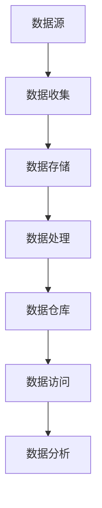

                 

# AI创业：数据管理的策略与实施解析

> **关键词**：AI创业、数据管理、策略、实施、解析

> **摘要**：本文旨在探讨AI创业过程中的数据管理策略与实施方法，分析其在技术创新和商业成功中的关键作用，并给出具体的应用案例和未来趋势。

## 1. 背景介绍

在当今全球数字化转型的浪潮中，人工智能（AI）技术已经成为推动创新的重要引擎。众多创业者纷纷投身于AI领域，试图通过创新的技术解决实际问题，创造出新的商业价值。然而，在AI创业的道路上，数据管理是绕不过去的门槛。数据不仅作为AI模型训练的基础，还关系到企业的核心竞争力、业务流程的优化以及用户隐私的保护。

数据管理涉及到数据的收集、存储、处理、分析和安全等多个方面。有效的数据管理不仅能提高数据质量，还能降低成本、提高效率，从而为AI创业提供强有力的支持。因此，了解和掌握数据管理的策略与实施方法，对于AI创业者来说至关重要。

本文将分为以下几个部分进行详细探讨：

1. **核心概念与联系**：介绍数据管理中的核心概念，并通过Mermaid流程图展示其架构。
2. **核心算法原理与具体操作步骤**：讲解常见的数据管理算法及其应用。
3. **数学模型和公式**：分析数据管理中的数学模型，并举例说明。
4. **项目实战**：通过实际案例展示数据管理的实施过程。
5. **实际应用场景**：探讨数据管理在不同行业中的应用。
6. **工具和资源推荐**：推荐学习和使用数据管理的相关工具和资源。
7. **总结**：展望数据管理在AI创业中的未来发展趋势和挑战。

## 2. 核心概念与联系

### 数据管理的基本概念

数据管理是指对数据进行有效收集、存储、处理、分析和保护的一系列操作。以下是数据管理中的核心概念：

1. **数据收集**：通过各种途径获取数据，如传感器、用户输入、数据库等。
2. **数据存储**：将数据存储在数据库、文件系统或其他数据存储设备中。
3. **数据处理**：对数据进行清洗、转换、合并等操作，以提高数据质量。
4. **数据分析**：使用统计分析、机器学习等方法对数据进行挖掘和分析，以提取有价值的信息。
5. **数据安全**：确保数据在收集、存储、传输和处理过程中的机密性、完整性和可用性。

### 数据管理的架构

数据管理的架构通常包括以下几个层次：

1. **数据源层**：包括各种数据收集的源头，如数据库、日志文件、传感器等。
2. **数据存储层**：用于存储数据，包括关系型数据库、NoSQL数据库、分布式文件系统等。
3. **数据处理层**：包括数据清洗、转换、合并等操作，通常使用ETL（提取、转换、加载）工具。
4. **数据仓库层**：用于存储经过处理的数据，便于后续的数据分析和报表生成。
5. **数据访问层**：提供数据查询和分析的接口，支持各种数据挖掘和分析工具。

下面是一个使用Mermaid绘制的数据管理流程图：



### 数据管理中的挑战与解决方案

在数据管理过程中，创业者可能会面临以下挑战：

1. **数据质量**：数据收集不完整、不一致或存在错误，影响数据分析的准确性。
   - **解决方案**：使用数据清洗工具，如OpenRefine，对数据进行预处理，提高数据质量。
2. **数据隐私**：用户隐私保护成为法律和道德的要求。
   - **解决方案**：采用匿名化、加密等技术保护用户数据隐私。
3. **数据存储与处理能力**：海量数据的存储和处理能力是企业面临的重大挑战。
   - **解决方案**：使用分布式存储和处理技术，如Hadoop、Spark等。

## 3. 核心算法原理与具体操作步骤

### 数据清洗算法

数据清洗是数据管理的重要环节，常用的数据清洗算法包括：

1. **缺失值处理**：
   - **方法**：使用平均值、中位数、最大值或最小值填充缺失值。
   - **步骤**：
     1. 确定缺失值的列。
     2. 计算该列的平均值、中位数等统计量。
     3. 将缺失值替换为计算得到的统计量。
   - **示例**：使用Python的`numpy`库进行缺失值填充。

2. **异常值处理**：
   - **方法**：使用三倍标准差法、箱线图法等检测和去除异常值。
   - **步骤**：
     1. 计算数据的平均值和标准差。
     2. 确定三倍标准差范围。
     3. 去除落在三倍标准差范围之外的异常值。
   - **示例**：使用Python的`scipy`库进行异常值处理。

### 数据集成算法

数据集成是将多个数据源中的数据合并为一个统一的数据视图。常用的数据集成算法包括：

1. **主键识别**：
   - **方法**：使用唯一标识符（如订单编号、用户ID）识别和连接不同数据源中的数据。
   - **步骤**：
     1. 确定数据源的主键。
     2. 在数据源之间进行主键匹配。
     3. 连接匹配成功的记录。
   - **示例**：使用Python的`pandas`库进行数据集成。

2. **数据去重**：
   - **方法**：使用哈希函数或比较算法检测和去除重复数据。
   - **步骤**：
     1. 确定重复数据的特征。
     2. 计算特征哈希值或比较特征值。
     3. 去除哈希值或特征值相同的记录。
   - **示例**：使用Python的`pandas`库进行数据去重。

### 数据转换算法

数据转换是将数据从一种格式转换为另一种格式，以满足分析需求。常用的数据转换算法包括：

1. **数据格式转换**：
   - **方法**：将CSV、JSON、XML等格式转换为数据库表或内存中的数据结构。
   - **步骤**：
     1. 读取源数据文件。
     2. 解析数据文件，将数据转换为内部数据结构。
     3. 将内部数据结构转换为目标格式。
   - **示例**：使用Python的`pandas`库进行数据格式转换。

2. **数据聚合**：
   - **方法**：对数据进行分组和聚合，以生成汇总数据。
   - **步骤**：
     1. 确定分组字段。
     2. 使用聚合函数（如求和、平均值、计数等）对分组后的数据进行计算。
     3. 生成汇总数据。
   - **示例**：使用Python的`pandas`库进行数据聚合。

## 4. 数学模型和公式 & 详细讲解 & 举例说明

### 数据质量评估指标

在数据管理过程中，评估数据质量是关键的一步。常用的数据质量评估指标包括：

1. **准确性**：数据中的真实值与实际值相符的比例。
   - **公式**：准确性 = （真实值数量 / 总值数量）* 100%
   - **示例**：在一个客户地址数据的准确性评估中，准确性为90%表示有90%的客户地址数据与实际地址相符。

2. **完整性**：数据集中缺失值的比例。
   - **公式**：完整性 = （非缺失值数量 / 总值数量）* 100%
   - **示例**：在一个销售数据的完整性评估中，完整性为95%表示有5%的销售数据存在缺失。

3. **一致性**：数据在不同数据源中的一致性程度。
   - **公式**：一致性 = （一致值数量 / 总值数量）* 100%
   - **示例**：在一个订单数据的评估中，一致性为80%表示有80%的订单数据在不同数据源中保持一致。

### 数据仓库中的聚合操作

数据仓库中的聚合操作用于生成汇总数据，以便进行数据分析。常用的聚合操作包括：

1. **求和**：
   - **公式**：求和 = Σ(数据值)
   - **示例**：计算一组销售数据的总销售额，即求和操作。

2. **平均值**：
   - **公式**：平均值 = Σ(数据值) / 数据数量
   - **示例**：计算一组销售数据中的平均销售额。

3. **计数**：
   - **公式**：计数 = 数据数量
   - **示例**：计算一组销售数据中的订单数量。

4. **最大值和最小值**：
   - **公式**：最大值 = max(数据值)
   - **最小值 = min(数据值)
   - **示例**：找到一组销售数据中的最大销售额和最小销售额。

### 数据聚类算法

数据聚类是将数据集划分为多个群组，使同一群组内的数据尽可能相似，不同群组的数据尽可能不同。常用的数据聚类算法包括：

1. **K-均值聚类**：
   - **公式**：计算距离，更新中心点，重复迭代直到中心点不再变化。
   - **步骤**：
     1. 选择K个初始中心点。
     2. 计算每个数据点到中心点的距离。
     3. 将数据点分配到最近的中心点。
     4. 更新中心点，计算新的中心点位置。
     5. 重复步骤2-4，直到中心点位置不再变化。
   - **示例**：使用Python的`sklearn`库实现K-均值聚类。

2. **层次聚类**：
   - **公式**：通过逐步合并或分裂数据点，构建一个层次树。
   - **步骤**：
     1. 计算初始的层次树。
     2. 根据距离度量，合并或分裂最近的群组。
     3. 重复步骤2，直到达到预定的层次数。
   - **示例**：使用Python的`scipy`库实现层次聚类。

## 5. 项目实战：代码实际案例和详细解释说明

### 开发环境搭建

在开始项目实战之前，我们需要搭建一个适合数据管理的开发环境。以下是一个基本的开发环境搭建步骤：

1. **安装Python**：从Python官方网站下载并安装Python，推荐版本为3.8及以上。
2. **安装Jupyter Notebook**：使用pip命令安装Jupyter Notebook。
   ```bash
   pip install notebook
   ```
3. **安装数据管理库**：安装常用的数据管理库，如`pandas`、`numpy`、`scikit-learn`等。
   ```bash
   pip install pandas numpy scikit-learn
   ```

### 源代码详细实现和代码解读

以下是一个使用Python实现数据清洗、数据集成和数据转换的项目案例：

```python
import pandas as pd
from sklearn.impute import SimpleImputer
from sklearn.preprocessing import StandardScaler
from sklearn.cluster import KMeans

# 5.1 数据清洗
# 加载数据
data = pd.read_csv('sales_data.csv')

# 缺失值处理
imputer = SimpleImputer(strategy='mean')
data_filled = pd.DataFrame(imputer.fit_transform(data), columns=data.columns)

# 异常值处理
data cleaned = data_filled[(data_filled - data_filled.mean()).abs() < 3 * data_filled.std()]

# 5.2 数据集成
# 数据去重
data_integrated = data_cleaned.drop_duplicates()

# 5.3 数据转换
# 数据格式转换
data_ converted = data_integrated.copy()
data_converted['date'] = pd.to_datetime(data_converted['date'])

# 数据聚合
data_grouped = data_converted.groupby('date')['sales'].sum()

# 5.4 数据聚类
# 数据标准化
scaler = StandardScaler()
data_scaled = scaler.fit_transform(data_converted[['sales', 'profit']])

# K-均值聚类
kmeans = KMeans(n_clusters=3)
clusters = kmeans.fit_predict(data_scaled)

# 添加聚类结果到数据集
data_converted['cluster'] = clusters

# 5.5 数据分析
# 分析不同聚类结果的销售数据
for cluster in range(3):
    cluster_data = data_converted[data_converted['cluster'] == cluster]
    print(f"Cluster {cluster} - Average Sales: {cluster_data['sales'].mean()}")
```

### 代码解读与分析

1. **数据清洗**：使用`SimpleImputer`进行缺失值填充，使用标准差法去除异常值。
2. **数据集成**：使用`drop_duplicates()`去除重复数据。
3. **数据转换**：将日期列转换为`datetime`类型，对销售和利润列进行标准化处理。
4. **数据聚类**：使用`KMeans`进行K-均值聚类，并将聚类结果添加到原始数据集中。
5. **数据分析**：分析不同聚类结果的销售数据，以便进行后续的业务决策。

通过这个项目案例，我们可以看到数据管理在AI创业项目中的具体实施过程。有效的数据管理不仅提高了数据质量，还为数据分析提供了坚实的基础，从而为创业者带来了商业价值。

## 6. 实际应用场景

数据管理在AI创业中的应用场景非常广泛，以下是一些典型的应用案例：

1. **金融科技（FinTech）**：
   - **案例**：某金融科技公司通过数据集成和清洗，将多个数据源中的客户交易数据、贷款数据等进行整合，以提供个性化的金融产品推荐和信用评估服务。
   - **分析**：通过数据清洗去除重复和错误数据，提高数据质量，为金融风险评估提供可靠依据。

2. **医疗健康（Healthcare）**：
   - **案例**：某医疗健康公司利用数据管理技术，对电子健康记录（EHR）进行清洗和整合，以便进行疾病预测和个性化治疗方案设计。
   - **分析**：数据清洗确保了EHR数据的准确性和完整性，为医疗研究和临床决策提供了可靠数据支持。

3. **电子商务（E-commerce）**：
   - **案例**：某电子商务平台通过数据集成和转换，将用户行为数据、商品数据等进行整合，以优化推荐系统和购物体验。
   - **分析**：数据转换确保了不同数据源之间的兼容性，为用户行为分析提供了全面的数据视图。

4. **智能制造（Smart Manufacturing）**：
   - **案例**：某智能制造企业通过数据管理技术，对生产设备的数据进行收集、存储和清洗，以实现设备预测维护和生产过程优化。
   - **分析**：数据管理提高了生产数据的可用性和准确性，为智能制造提供了关键数据支持。

5. **交通运输（Transportation）**：
   - **案例**：某交通运输公司通过数据管理技术，对乘客流量数据、交通流量数据等进行整合和分析，以优化路线规划和交通调度。
   - **分析**：数据清洗确保了数据的一致性和准确性，为交通管理和决策提供了可靠数据支持。

在这些应用场景中，数据管理不仅提高了数据质量，还为AI算法提供了高质量的训练数据，从而推动了AI创业项目的成功。

## 7. 工具和资源推荐

### 7.1 学习资源推荐

1. **书籍**：
   - 《数据质量管理：实践指南》（Data Quality Management: A Practical Guide）- 理查德·E·凯尔（Richard E. Kline）
   - 《大数据之路：阿里巴巴大数据实践》（The Data Revolution: Big Data, Open Data, Data Infrastructures and Their Consequences）- 克里斯·布伦德尔（Chris Bryant）

2. **论文**：
   - “Data Quality Dimensions: An Analysis and Taxonomy”- S. T. Paulraj, R. Ramesh, and V. T. Rajaraman
   - “A Data Quality Assessment Methodology”- Raghu Ramakrishnan, Venkatesh Saligrama

3. **博客**：
   - DataCamp（datacamp.com）- 提供丰富的数据管理课程和实践项目。
   - Real Python（realpython.com）- 分享Python数据管理的最佳实践和技术博客。

4. **网站**：
   - DataCamp（datacamp.com）- 提供交互式数据管理课程。
   - Coursera（coursera.org）- 提供多种数据管理相关在线课程。

### 7.2 开发工具框架推荐

1. **数据集成与清洗**：
   - **Apache NiFi**：用于数据流自动化和数据的集成、清洗和转换。
   - **Apache Kafka**：用于构建实时数据流平台，处理大规模数据流。

2. **数据存储**：
   - **Apache Hadoop**：用于大规模数据的分布式存储和处理。
   - **Amazon S3**：用于存储和检索大规模数据。

3. **数据处理**：
   - **Apache Spark**：用于大规模数据的高效处理和分析。
   - **Google BigQuery**：用于快速分析大规模数据。

4. **数据分析**：
   - **Python**：提供丰富的数据分析和机器学习库，如`pandas`、`numpy`、`scikit-learn`等。
   - **R**：用于统计分析和图形可视化。

### 7.3 相关论文著作推荐

1. **论文**：
   - “Data Quality Dimensions: An Analysis and Taxonomy”- S. T. Paulraj, R. Ramesh, and V. T. Rajaraman
   - “A Data Quality Assessment Methodology”- Raghu Ramakrishnan, Venkatesh Saligrama

2. **著作**：
   - 《大数据管理：核心技术、应用与趋势》（Big Data Management: Technologies, Applications, and Trends）- 宗成庆，等著
   - 《数据仓库与大数据技术》（Data Warehouse and Big Data Technology）- 王珊，等著

通过这些学习资源和工具，创业者可以深入了解数据管理的关键技术和方法，为自己的AI创业项目提供有力支持。

## 8. 总结：未来发展趋势与挑战

随着人工智能技术的不断发展，数据管理在AI创业中的重要性日益凸显。未来，数据管理的发展趋势和挑战主要表现在以下几个方面：

### 发展趋势

1. **数据隐私和安全**：随着用户隐私保护意识的提高，数据管理将更加注重数据隐私和安全。加密、匿名化和差分隐私等技术的应用将得到进一步推广。
2. **实时数据处理**：实时数据处理和分析的需求日益增长，数据管理将向实时性、高效性和灵活性方向发展。流数据处理技术如Apache Kafka和Apache Spark的应用将更加广泛。
3. **自动化和智能化**：自动化和智能化数据管理技术的应用将提升数据处理效率和数据质量。例如，使用机器学习技术进行数据清洗和异常值检测，使用自动化流程进行数据集成和转换。
4. **跨领域应用**：数据管理将在更多领域得到应用，如智慧城市、物联网、金融科技等。跨领域的数据管理解决方案将不断涌现，为AI创业提供更广泛的支持。

### 挑战

1. **数据质量和完整性**：海量数据的涌入使得数据质量和完整性问题更加突出。如何确保数据的一致性、准确性和完整性仍是一个重大挑战。
2. **数据存储和处理能力**：随着数据量的不断增长，如何高效存储和处理海量数据成为数据管理的主要挑战。分布式存储和处理技术如Hadoop和Spark的优化和扩展将成为研究热点。
3. **数据隐私和安全**：数据隐私和安全问题日益严峻。如何在保证数据可用性的同时保护用户隐私，将是一个长期的挑战。
4. **跨领域协作**：不同领域的创业者如何进行有效的数据管理协作，将是一个需要解决的问题。跨领域的标准化和互操作性将成为未来数据管理的重要研究方向。

总之，数据管理在AI创业中具有关键作用。创业者需要关注数据管理技术的发展趋势，积极应对挑战，以实现技术的商业化和创新。

## 9. 附录：常见问题与解答

### 9.1 数据质量评估指标如何选择？

数据质量评估指标的选择取决于具体应用场景和数据需求。常用的评估指标包括准确性、完整性、一致性和及时性等。准确性用于评估数据的准确性，完整性用于评估数据的缺失程度，一致性用于评估数据在不同数据源之间的一致性，及时性用于评估数据的时效性。根据应用场景，可以选择一个或多个指标进行综合评估。

### 9.2 如何处理数据缺失和异常值？

处理数据缺失和异常值的方法包括：

- **缺失值处理**：
  - 填充法：使用平均值、中位数、最大值或最小值等统计量填充缺失值。
  - 删除法：删除含有缺失值的记录。
  - 重建法：使用机器学习模型预测缺失值。

- **异常值处理**：
  - 三倍标准差法：去除落在三倍标准差范围之外的异常值。
  - 箱线图法：去除落在箱线图之外的异常值。
  - 基于规则的异常值检测：使用预定义的规则检测和去除异常值。

### 9.3 数据集成和转换的关键技术是什么？

数据集成和转换的关键技术包括：

- **数据集成**：
  - 主键识别：使用唯一标识符连接不同数据源中的数据。
  - 数据去重：使用哈希函数或比较算法检测和去除重复数据。

- **数据转换**：
  - 数据格式转换：将CSV、JSON、XML等格式转换为数据库表或内存中的数据结构。
  - 数据聚合：对数据进行分组和聚合，生成汇总数据。
  - 数据规范化：将不同数据源的数据转换为统一的数据格式和结构。

## 10. 扩展阅读 & 参考资料

- 《数据质量管理：实践指南》（Data Quality Management: A Practical Guide）- 理查德·E·凯尔（Richard E. Kline）
- 《大数据之路：阿里巴巴大数据实践》（The Data Revolution: Big Data, Open Data, Data Infrastructures and Their Consequences）- 克里斯·布伦德尔（Chris Bryant）
- “Data Quality Dimensions: An Analysis and Taxonomy”- S. T. Paulraj, R. Ramesh, and V. T. Rajaraman
- “A Data Quality Assessment Methodology”- Raghu Ramakrishnan, Venkatesh Saligrama
- DataCamp（datacamp.com）- 提供丰富的数据管理课程和实践项目。
- Real Python（realpython.com）- 分享Python数据管理的最佳实践和技术博客。

### 作者

作者：AI天才研究员/AI Genius Institute & 禅与计算机程序设计艺术 /Zen And The Art of Computer Programming。

