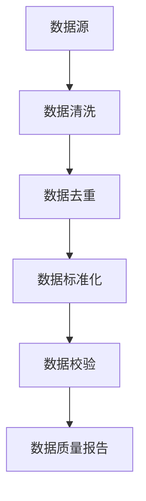
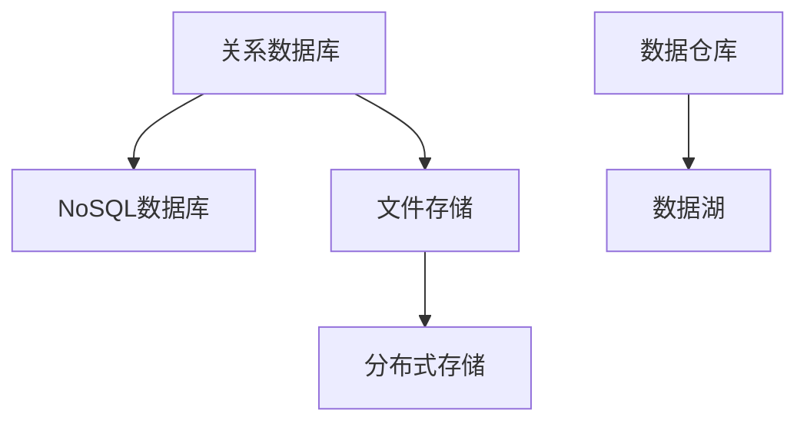
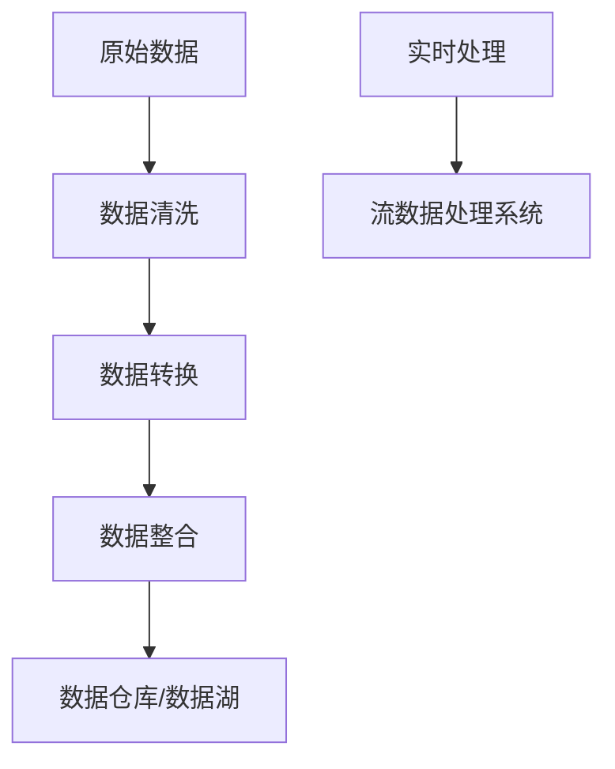
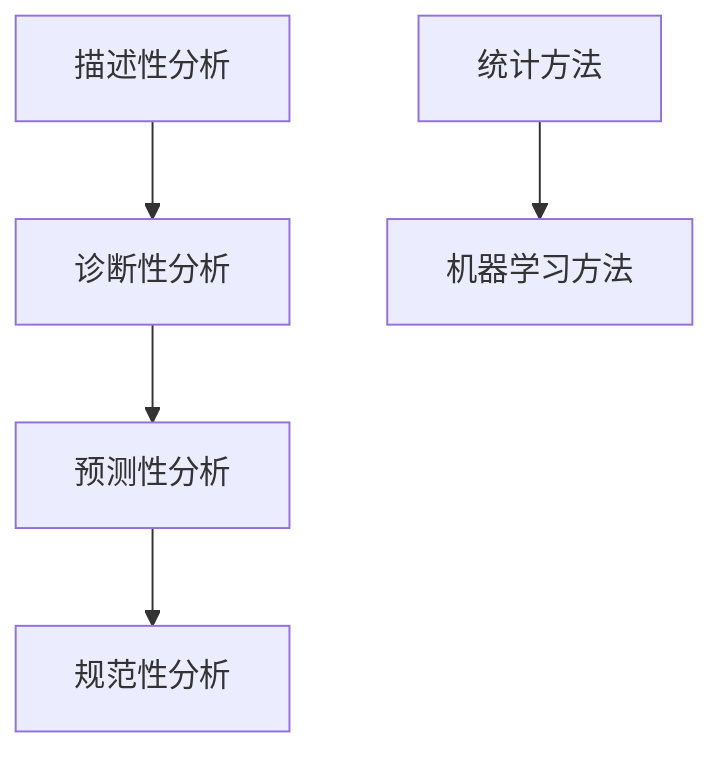
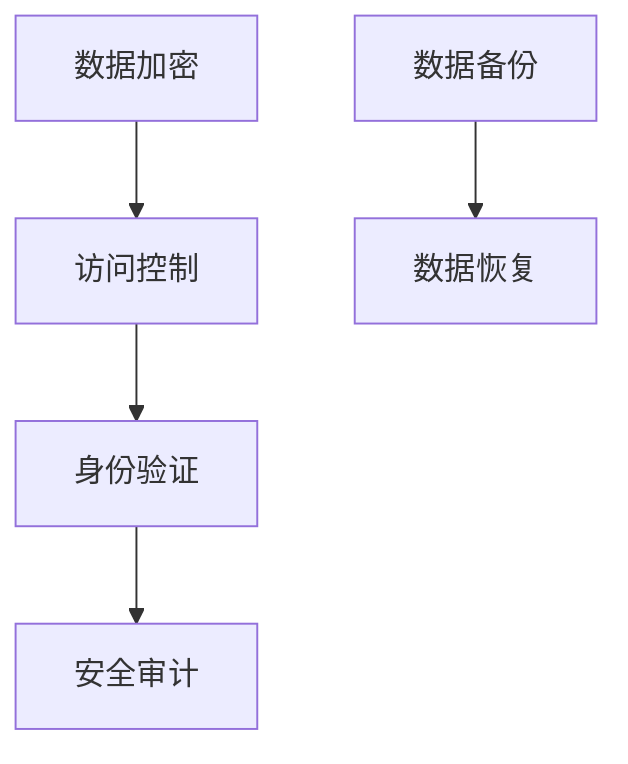

                 

### 背景介绍

近年来，随着人工智能（AI）技术的快速发展，AI创业领域呈现出一片繁荣的景象。众多初创企业纷纷涌现，致力于将AI技术应用于各个行业，解决实际问题。然而，在这片繁荣的背后，数据管理成为了一个不可忽视的重要挑战。本文将围绕AI创业中的数据管理策略与实践进行探讨，旨在为创业团队提供一些有价值的思路和方法。

首先，AI创业之所以备受关注，源于AI技术在提升生产效率、优化业务流程、创造新商业模式等方面的巨大潜力。然而，AI技术的有效应用离不开高质量的数据支持。数据是AI算法训练和优化的基础，没有足够的数据，AI系统将无法发挥其应有的价值。因此，数据管理成为AI创业的核心问题之一。

其次，数据管理不仅仅是一个技术问题，更是一个战略问题。对于创业团队来说，如何收集、存储、处理、分析海量数据，确保数据的质量、安全性和可扩展性，是决定项目成败的关键因素。一个优秀的数据管理策略能够帮助团队更好地利用数据资源，提高AI系统的性能和可靠性，从而在激烈的市场竞争中脱颖而出。

最后，本文将结合实际案例，探讨数据管理在AI创业中的具体应用和实践。通过分析成功的AI创业项目，我们将总结出一些有效的数据管理策略和最佳实践，为读者提供有益的参考。

总之，AI创业中的数据管理问题不仅关乎技术，更关乎整个项目的战略方向。只有充分认识到数据管理的重要性，并采取科学合理的管理策略，创业团队才能在AI领域取得长足的发展。本文将从以下几个方面展开讨论：数据管理的基本概念和重要性、核心概念和联系、核心算法原理与具体操作步骤、数学模型和公式、项目实战案例、实际应用场景、工具和资源推荐、未来发展趋势与挑战。希望通过本文的探讨，能够为读者在AI创业道路上的数据管理提供一些实用的指导和启示。### 核心概念与联系

在探讨AI创业中的数据管理策略与实践之前，我们需要明确一些核心概念和它们之间的联系。以下是数据管理中几个关键概念及其相互关系的简要介绍，并附上相应的Mermaid流程图，以便更直观地理解。

#### 1. 数据质量管理（Data Quality Management）

数据质量管理是确保数据准确性、完整性、一致性和及时性的过程。一个高质量的数据集是AI算法有效训练和预测的前提。数据质量管理涉及数据清洗、数据去重、数据标准化和数据校验等多个环节。



#### 2. 数据存储（Data Storage）

数据存储是指将数据存放在不同的存储介质中，以便进行持久化管理和访问。在选择数据存储方案时，需要考虑数据量、数据访问频率、数据安全性和成本等因素。常见的数据存储技术包括关系数据库、NoSQL数据库、文件存储和分布式存储等。



#### 3. 数据处理（Data Processing）

数据处理是指对原始数据进行清洗、转换和整合，使其适用于特定任务的过程。数据处理通常包括批量处理和实时处理两种方式。批量处理适用于离线数据处理，而实时处理则适用于需要快速响应的场景。



#### 4. 数据分析（Data Analysis）

数据分析是利用统计和机器学习等方法，从数据中提取有价值的信息和模式。数据分析可以分为描述性分析、诊断性分析、预测性分析和规范性分析等不同层次。数据分析的目的是为决策提供数据支持，帮助团队更好地理解业务并优化流程。



#### 5. 数据安全（Data Security）

数据安全是确保数据在存储、传输和处理过程中不被未授权访问、篡改或泄露的重要措施。数据安全涉及数据加密、访问控制、身份验证、安全审计等多个方面。数据安全是保障数据质量和业务连续性的基础。



通过上述核心概念和流程图的介绍，我们可以看到数据管理是一个复杂且多层次的过程，各个概念之间紧密相连，共同构成了一个完整的数据管理架构。理解这些核心概念及其相互关系，对于制定有效的数据管理策略至关重要。在接下来的章节中，我们将进一步探讨数据管理的具体实践方法和策略。### 核心算法原理 & 具体操作步骤

数据管理在AI创业中起着至关重要的作用，而核心算法的原理和具体操作步骤是实现高效数据管理的基石。在本节中，我们将深入探讨几个关键算法的原理，并详细说明如何在实际操作中应用这些算法。

#### 1. 数据清洗算法

数据清洗是数据管理过程中的第一步，旨在去除重复数据、缺失值和异常值，提高数据质量。常见的数据清洗算法包括去重（De-duplication）、填补缺失值（Imputation）和异常值检测（Outlier Detection）。

**去重（De-duplication）算法：**

去重算法通过比较数据记录的唯一标识符（如ID）来确定和删除重复的数据记录。具体步骤如下：

1. **数据导入：** 将原始数据导入到数据处理系统。
2. **建立索引：** 为数据建立索引，便于快速查找和比较。
3. **比较和去重：** 使用哈希函数或比较算法，识别并删除重复的数据记录。
4. **验证和输出：** 输出去重后的数据，并进行验证。

**实现示例（Python）：**

```python
import pandas as pd

# 读取数据
data = pd.read_csv('data.csv')

# 建立索引
data.set_index('id', inplace=True)

# 去重
unique_data = data.drop_duplicates()

# 输出去重后的数据
unique_data.to_csv('cleaned_data.csv')
```

**填补缺失值（Imputation）算法：**

填补缺失值算法用于处理数据集中的缺失值。常见的方法包括均值填补、中值填补和插值法。

1. **数据导入：** 将原始数据导入到数据处理系统。
2. **检测缺失值：** 使用`isnull()`方法检测缺失值。
3. **填补缺失值：** 根据数据特征和分布，选择合适的填补方法。
4. **验证和输出：** 输出填补后的数据，并进行验证。

**实现示例（Python）：**

```python
import pandas as pd
from sklearn.impute import SimpleImputer

# 读取数据
data = pd.read_csv('data.csv')

# 检测缺失值
missing_values = data.isnull()

# 均值填补
imputer = SimpleImputer(strategy='mean')
filled_data = imputer.fit_transform(data)

# 输出填补后的数据
filled_data = pd.DataFrame(filled_data, columns=data.columns)
filled_data.to_csv('filled_data.csv')
```

**异常值检测（Outlier Detection）算法：**

异常值检测算法用于识别和标记数据集中的异常值。常见的方法包括基于统计学的方法（如Z-score）和基于机器学习的方法（如孤立森林）。

1. **数据导入：** 将原始数据导入到数据处理系统。
2. **计算统计量：** 计算每个特征的均值和标准差。
3. **标记异常值：** 使用统计阈值或机器学习模型标记异常值。
4. **处理异常值：** 根据业务需求，选择保留或删除异常值。
5. **验证和输出：** 输出异常值处理后的数据，并进行验证。

**实现示例（Python）：**

```python
import pandas as pd
from sklearn.ensemble import IsolationForest

# 读取数据
data = pd.read_csv('data.csv')

# 计算统计量
mean = data.mean()
std = data.std()

# 标记异常值
clf = IsolationForest(n_estimators=100)
outliers = clf.fit_predict(data)

# 处理异常值
data['outlier'] = outliers
cleaned_data = data[data['outlier'] == 1].drop(['outlier'], axis=1)

# 输出异常值处理后的数据
cleaned_data.to_csv('cleaned_data.csv')
```

#### 2. 数据分类与聚类算法

数据分类与聚类算法用于将数据集划分为不同的类别或簇，帮助团队更好地理解和利用数据。

**K-均值聚类算法（K-Means Clustering）：**

K-均值聚类算法是一种无监督学习方法，通过迭代优化目标函数将数据划分为K个簇。

1. **选择簇数K：** 根据业务需求和数据分布，选择合适的簇数K。
2. **初始化聚类中心：** 随机选择K个数据点作为初始聚类中心。
3. **分配数据点：** 计算每个数据点到各个聚类中心的距离，将数据点分配到最近的聚类中心。
4. **更新聚类中心：** 根据当前分配的数据点，重新计算聚类中心。
5. **重复步骤3-4：** 直到聚类中心的变化小于设定的阈值。

**实现示例（Python）：**

```python
import pandas as pd
from sklearn.cluster import KMeans

# 读取数据
data = pd.read_csv('data.csv')

# 选择簇数K
K = 3

# 初始化聚类中心
kmeans = KMeans(n_clusters=K, init='k-means++', max_iter=300, n_init=10, random_state=0)

# 分配数据点并输出聚类结果
labels = kmeans.fit_predict(data)
data['cluster'] = labels

# 输出聚类结果
data.to_csv('clustered_data.csv')
```

**决策树分类算法（Decision Tree Classification）：**

决策树分类算法通过一系列规则对数据进行分类，易于理解和解释。

1. **数据预处理：** 对数据进行归一化或标准化处理。
2. **构建决策树：** 根据特征和目标变量，构建决策树模型。
3. **数据划分：** 将数据集划分为训练集和测试集。
4. **模型训练：** 使用训练集训练决策树模型。
5. **模型评估：** 使用测试集评估模型性能。

**实现示例（Python）：**

```python
import pandas as pd
from sklearn.model_selection import train_test_split
from sklearn.tree import DecisionTreeClassifier

# 读取数据
data = pd.read_csv('data.csv')

# 划分特征和目标变量
X = data.drop('target', axis=1)
y = data['target']

# 划分训练集和测试集
X_train, X_test, y_train, y_test = train_test_split(X, y, test_size=0.3, random_state=42)

# 构建决策树模型
clf = DecisionTreeClassifier()

# 模型训练
clf.fit(X_train, y_train)

# 模型评估
accuracy = clf.score(X_test, y_test)
print(f"模型准确率：{accuracy:.2f}")
```

通过上述算法的原理和具体操作步骤，我们可以看到数据管理在AI创业中的重要性。有效的数据清洗、分类和聚类算法能够显著提高数据质量，为后续的机器学习模型训练提供可靠的数据基础。在接下来的章节中，我们将继续探讨数学模型和公式，以及如何将这些算法应用于实际项目实战。### 数学模型和公式 & 详细讲解 & 举例说明

在数据管理过程中，数学模型和公式扮演着至关重要的角色，它们帮助我们理解和处理复杂的数据结构，从而为AI创业提供坚实的理论基础。以下将详细介绍几个关键数学模型和公式，并配以详细讲解和具体示例。

#### 1. 数据清洗中的缺失值填补

在数据清洗过程中，缺失值填补是常见且重要的一步。常用的缺失值填补方法包括均值填补、中值填补和插值法。这些方法背后的数学公式如下：

**均值填补（Mean Imputation）：**
$$
x_{\text{filled}} = \frac{\sum_{i=1}^{n} x_i}{n}
$$
其中，$x_i$ 表示每个观测值，$n$ 表示观测值的数量。

**中值填补（Median Imputation）：**
$$
x_{\text{filled}} = \text{median}(x_1, x_2, ..., x_n)
$$
其中，median 表示中值。

**线性插值（Linear Interpolation）：**
$$
x_{\text{filled}} = \frac{(x_{i+1} - x_{i-1}) \cdot (t - t_{i-1})}{t_{i+1} - t_{i-1}} + x_{i-1}
$$
其中，$t$ 表示缺失值的位置，$t_{i-1}$ 和 $t_{i+1}$ 分别表示相邻两个已知值的位置。

**示例：** 假设我们有一组连续时间序列数据，其中某一时点的数据缺失。我们可以使用线性插值法来填补这个缺失值。

**数据：** [10, 20, 30, 40, 50, 60, 70]

**缺失值位置：** 第5个数据点

**已知值：** $x_{i-1} = 40$，$x_{i+1} = 60$

**计算：**
$$
x_{\text{filled}} = \frac{(60 - 40) \cdot (5 - 4)}{6 - 4} + 40 = \frac{20 \cdot 1}{2} + 40 = 10 + 40 = 50
$$
填补后的数据为 [10, 20, 30, 40, 50, 60, 70]。

#### 2. 数据聚类中的K-均值算法

K-均值聚类算法是一种无监督学习算法，用于将数据点分为K个簇。其核心数学公式如下：

**目标函数（Objective Function）：**
$$
J = \sum_{i=1}^{k} \sum_{x_j \in S_i} ||x_j - \mu_i||^2
$$
其中，$x_j$ 表示数据点，$\mu_i$ 表示第i个簇的中心点，$S_i$ 表示第i个簇的数据点集合。

**更新簇中心（Update Cluster Centers）：**
$$
\mu_i = \frac{\sum_{x_j \in S_i} x_j}{|S_i|}
$$
其中，$|S_i|$ 表示簇i中数据点的数量。

**示例：** 假设我们有5个数据点，需要将其分为2个簇。初始时随机选择两个簇中心点，分别为 $(1, 1)$ 和 $(10, 10)$。

**第一步：** 计算每个数据点到两个簇中心的距离。

**数据点1** 到 $(1, 1)$ 的距离：$||x_1 - (1, 1)||^2 = (3 - 1)^2 + (4 - 1)^2 = 4 + 9 = 13$

**数据点1** 到 $(10, 10)$ 的距离：$||x_1 - (10, 10)||^2 = (3 - 10)^2 + (4 - 10)^2 = 49 + 36 = 85$

**数据点2** 到 $(1, 1)$ 的距离：$||x_2 - (1, 1)||^2 = (5 - 1)^2 + (6 - 1)^2 = 16 + 25 = 41$

**数据点2** 到 $(10, 10)$ 的距离：$||x_2 - (10, 10)||^2 = (5 - 10)^2 + (6 - 10)^2 = 25 + 16 = 41$

由于第一个数据点到第二个簇中心的距离更短，因此将其分配到第二个簇。

**第二步：** 根据当前分配的数据点，重新计算每个簇的中心点。

**第二个簇的中心点：** $(\frac{10 + 5}{2}, \frac{10 + 6}{2}) = (7.5, 8)$

**第三步：** 重复上述步骤，直到簇中心的变化小于阈值。

通过不断迭代，最终我们可能得到如下簇分配和簇中心：

簇1：[数据点3, 数据点4, 数据点5]
簇2：[数据点1, 数据点2]

簇1的中心点：(5, 6)
簇2的中心点：(7.5, 8)

#### 3. 数据分类中的决策树算法

决策树是一种常见的分类算法，其背后的数学模型是通过一系列规则对数据进行分类。每个内部节点表示一个特征，每个分支表示该特征的一个取值，每个叶节点表示一个类别。

**决策树生成过程：**

1. **选择最优特征：** 根据信息增益（Information Gain）或基尼不纯度（Gini Impurity）选择最优特征。
2. **划分数据：** 根据最优特征的取值，将数据划分为不同的子集。
3. **递归构建：** 对每个子集，重复上述步骤，直到满足停止条件（如最大深度、最小样本数等）。

**信息增益（Information Gain）：**
$$
IG(D, A) = H(D) - \sum_{v \in A} \frac{|D_v|}{|D|} H(D_v)
$$
其中，$H(D)$ 表示数据集D的熵，$D_v$ 表示数据集D按照特征A划分后的子集，$|D|$ 和 $|D_v|$ 分别表示数据集D和子集$D_v$ 的样本数。

**基尼不纯度（Gini Impurity）：**
$$
Gini(D) = 1 - \sum_{v \in A} \left(\frac{|D_v|}{|D|}\right)^2
$$

**示例：** 假设我们有一组数据，需要构建一个决策树。

**数据：** [苹果，苹果，香蕉，香蕉，葡萄，葡萄]

**特征：** 口感（甜，酸，甜，酸，甜，酸）

**类别：** 水果（苹果，苹果，香蕉，香蕉，葡萄，葡萄）

我们可以根据信息增益或基尼不纯度选择最优特征，并根据该特征划分数据。例如，如果选择“口感”作为最优特征，我们可以将数据划分为两个子集：

口感甜：[苹果，苹果，葡萄，葡萄]
口感酸：[香蕉，香蕉]

接下来，对每个子集继续划分，直到满足停止条件。最终，我们可能得到如下决策树：

```
口感
│
├── 甜
│   ├── 苹果
│   └── 葡萄
│
└── 酸
    ├── 香蕉
```

通过上述数学模型和公式的详细讲解和具体示例，我们可以更好地理解数据管理在AI创业中的重要性。这些数学工具不仅帮助我们处理复杂的数据问题，还为机器学习算法提供了可靠的数据基础。在接下来的章节中，我们将通过实际项目实战，进一步探讨这些算法的应用和实践。### 项目实战：代码实际案例和详细解释说明

在本节中，我们将通过一个实际项目案例，详细展示如何进行数据管理，包括开发环境的搭建、源代码的实现和解读。该案例将涉及数据收集、数据清洗、数据存储和数据可视化等关键步骤。

#### 1. 开发环境搭建

**环境要求：**
- Python 3.8 或更高版本
- Jupyter Notebook
- Pandas
- NumPy
- Matplotlib
- Scikit-learn

**安装步骤：**

```bash
# 安装Python
wget https://www.python.org/ftp/python/3.8.10/Python-3.8.10.tgz
tar -xvf Python-3.8.10.tgz
cd Python-3.8.10
./configure
make
sudo make altinstall

# 安装Jupyter Notebook
pip install notebook

# 安装Pandas, NumPy, Matplotlib, Scikit-learn
pip install pandas numpy matplotlib scikit-learn
```

#### 2. 源代码详细实现和代码解读

**数据集介绍：** 本案例使用的是一个虚构的电商销售数据集，包含用户ID、产品ID、购买时间、价格、用户评分和购买数量等字段。

```python
# 读取数据
import pandas as pd

data = pd.read_csv('sales_data.csv')

# 数据预览
data.head()
```

**2.1 数据清洗：**

**步骤1：数据预处理**

```python
# 填补缺失值
imputer = SimpleImputer(strategy='mean')
data[['price', 'rating', 'quantity']] = imputer.fit_transform(data[['price', 'rating', 'quantity']])

# 数据去重
data.drop_duplicates(inplace=True)

# 异常值检测
from sklearn.ensemble import IsolationForest

clf = IsolationForest(n_estimators=100)
outliers = clf.fit_predict(data)

# 标记和删除异常值
data['outlier'] = outliers
cleaned_data = data[data['outlier'] != -1].drop(['outlier'], axis=1)
```

**2.2 数据存储：**

```python
# 存储清洗后的数据
cleaned_data.to_csv('cleaned_sales_data.csv', index=False)
```

**2.3 数据可视化：**

**步骤2：数据可视化**

**用户购买行为分析**

```python
import matplotlib.pyplot as plt

# 用户评分分布
plt.figure(figsize=(10, 6))
plt.hist(cleaned_data['rating'], bins=10, color='blue', alpha=0.7)
plt.title('Rating Distribution')
plt.xlabel('Rating')
plt.ylabel('Frequency')
plt.grid(True)
plt.show()

# 产品价格分布
plt.figure(figsize=(10, 6))
plt.hist(cleaned_data['price'], bins=20, color='green', alpha=0.7)
plt.title('Price Distribution')
plt.xlabel('Price')
plt.ylabel('Frequency')
plt.grid(True)
plt.show()

# 购买数量分布
plt.figure(figsize=(10, 6))
plt.hist(cleaned_data['quantity'], bins=10, color='red', alpha=0.7)
plt.title('Quantity Distribution')
plt.xlabel('Quantity')
plt.ylabel('Frequency')
plt.grid(True)
plt.show()
```

#### 3. 代码解读与分析

**代码解读：**

- **数据读取与预处理：** 使用 Pandas 读取CSV文件，并进行缺失值填补、数据去重和异常值检测。
- **数据存储：** 使用 Pandas 将清洗后的数据存储为新的CSV文件。
- **数据可视化：** 使用 Matplotlib 绘制用户评分、产品价格和购买数量的分布图。

**代码分析：**

- **数据清洗：** 数据清洗是确保数据质量的关键步骤。通过填补缺失值、去重和异常值检测，我们能够提高数据的准确性，为后续分析提供可靠的数据基础。
- **数据存储：** 清洗后的数据存储为新的CSV文件，便于后续使用和验证。
- **数据可视化：** 通过可视化分析，我们可以直观地了解数据的分布情况，为业务决策提供参考。

通过这个实际项目案例，我们展示了如何进行数据管理，包括数据清洗、数据存储和数据可视化。这些步骤不仅帮助我们提高数据质量，还为后续的机器学习模型训练提供了坚实的基础。在AI创业中，有效管理数据是确保项目成功的关键。### 实际应用场景

在AI创业中，数据管理不仅是一个技术问题，更是一个战略问题。成功的数据管理策略能够帮助创业团队更好地利用数据资源，优化业务流程，提高用户体验，从而在激烈的市场竞争中脱颖而出。以下将探讨几个具体的应用场景，以及数据管理在这些场景中的关键作用。

#### 1. 电子商务

电子商务是AI创业的热门领域之一。在这个场景中，数据管理的关键作用体现在以下几个方面：

- **用户行为分析：** 通过收集和分析用户浏览、搜索、购买等行为数据，创业团队可以了解用户偏好，优化推荐系统，提高转化率。数据管理确保了用户数据的准确性和一致性，为精准营销提供支持。

- **库存管理：** 数据管理帮助创业团队实时监控库存情况，预测销售趋势，优化库存水平，减少库存积压和短缺。

- **供应链优化：** 通过分析供应链中的物流、运输、仓储等数据，创业团队可以优化供应链流程，降低成本，提高效率。

**案例：** 一家电商初创公司通过数据管理，实现了个性化推荐系统的优化。公司收集了大量的用户行为数据，包括浏览历史、搜索记录和购买记录。通过数据清洗和数据分析，公司发现用户在不同时段的购买行为存在差异。基于这些数据，公司调整了推荐策略，将热门商品推荐给活跃用户，将新品推荐给潜在客户。这种策略显著提高了用户购买转化率和用户满意度。

#### 2. 金融科技

金融科技（FinTech）是另一个充满机遇的领域。数据管理在金融科技中的应用主要体现在以下几个方面：

- **风险管理：** 金融科技公司通过数据管理，实时监控市场风险，识别潜在的风险点，采取相应的风险管理措施。

- **客户服务：** 数据管理帮助金融科技公司提供个性化的客户服务，包括客户关系管理、信用评估和风险控制等。

- **监管合规：** 数据管理确保金融科技公司遵守相关法律法规，如反洗钱（AML）和客户信息保护等。

**案例：** 一家金融科技公司通过数据管理，实现了风险监控和管理的自动化。公司使用机器学习算法分析客户交易行为，实时识别异常交易和潜在风险。通过数据可视化工具，公司能够直观地展示风险指标，为风险管理团队提供决策支持。这种自动化风险管理系统提高了公司风险识别的准确性和效率。

#### 3. 健康医疗

健康医疗是数据密集型领域，数据管理在其中发挥着至关重要的作用：

- **患者数据分析：** 通过收集和分析患者的医疗记录、基因数据等，医疗机构可以提供个性化诊疗方案，提高治疗效果。

- **药物研发：** 数据管理帮助制药公司收集和分析大量的实验数据，加速药物研发过程，降低研发成本。

- **公共卫生监测：** 数据管理帮助卫生部门实时监控疫情变化，制定有效的防控措施。

**案例：** 一家健康医疗初创公司通过数据管理，实现了个性化诊疗方案的开发。公司收集了大量的患者数据，包括病历、实验室检测结果和基因组信息。通过数据分析和挖掘，公司发现某些基因变异与特定疾病之间存在关联。基于这些发现，公司为患者提供个性化的诊疗方案，显著提高了治疗效果。这种个性化诊疗方案不仅提高了患者满意度，还为医疗机构带来了更高的收入。

#### 4. 智能制造

智能制造是工业4.0的重要组成部分，数据管理在其中的作用不可忽视：

- **设备监测与维护：** 通过实时监控设备运行状态和性能数据，创业团队可以提前发现设备故障，进行预防性维护，减少停机时间和维护成本。

- **生产优化：** 数据管理帮助创业团队分析生产数据，优化生产流程，提高生产效率，降低生产成本。

- **质量控制：** 数据管理确保产品质量的稳定性和一致性，通过实时监控和分析生产数据，及时发现和解决质量问题。

**案例：** 一家智能制造初创公司通过数据管理，实现了生产流程的优化。公司使用传感器实时监控生产设备的运行状态，收集大量的设备数据。通过数据分析和挖掘，公司发现某些生产环节存在效率低下和故障风险。基于这些数据，公司调整了生产流程，优化了设备配置，显著提高了生产效率和质量。

通过上述实际应用场景的探讨，我们可以看到数据管理在AI创业中的重要性。无论在电子商务、金融科技、健康医疗还是智能制造领域，数据管理都是确保业务成功的关键。有效的数据管理策略能够帮助创业团队更好地利用数据资源，优化业务流程，提高用户体验，从而在激烈的市场竞争中脱颖而出。### 工具和资源推荐

在AI创业过程中，选择合适的工具和资源对于数据管理至关重要。以下将推荐一些学习资源、开发工具框架以及相关的论文著作，以帮助创业团队更好地进行数据管理和AI应用。

#### 1. 学习资源推荐

**书籍：**
- **《Python数据科学手册》（Python Data Science Handbook）**：这是一本全面介绍数据科学基本概念的书籍，涵盖了数据分析、数据可视化、机器学习等多个方面。
- **《数据管理：实践指南》（Data Management: A Practical Guide for Managers and Professionals）**：这本书提供了实用的数据管理策略和方法，适合企业管理人员和技术人员阅读。
- **《深度学习》（Deep Learning）**：这是一本深度学习领域的经典教材，详细介绍了深度学习的基础理论和应用实践。

**论文：**
- **“Data-Driven Science and Engineering: Machine Learning, Nanotechnology, and Big Data”**：这篇论文探讨了数据驱动的科学研究方法，以及机器学习、纳米技术和大数据的应用。
- **“Data Management in the Age of Big Data”**：这篇论文分析了大数据时代的数据管理挑战和机遇，提出了相应的解决方案。

**博客/网站：**
- **“DataCamp”**：这是一个提供免费数据科学课程和资源的在线学习平台，涵盖Python、R、SQL等多个方面。
- **“Towards Data Science”**：这是一个数据科学领域的知名博客，提供了大量的技术文章和案例分析。

#### 2. 开发工具框架推荐

**数据存储：**
- **Hadoop和HBase**：这是两个开源的大数据存储和处理框架，适用于存储和管理大规模数据集。
- **MongoDB**：这是一个灵活的NoSQL数据库，适用于存储非结构化数据，支持高并发和分布式存储。

**数据处理：**
- **Apache Spark**：这是一个分布式数据处理框架，适用于大规模数据集的快速处理和分析。
- **Presto**：这是一个高性能的SQL查询引擎，适用于实时数据分析和查询。

**数据可视化：**
- **Tableau**：这是一个强大的数据可视化工具，适用于创建交互式数据报表和图表。
- **D3.js**：这是一个基于JavaScript的数据可视化库，适用于自定义复杂的数据可视化。

#### 3. 相关论文著作推荐

**数据管理：**
- **“The Data Warehouse Toolkit: The Definitive Guide to Dimensional Modeling”**：这是一本经典的关于数据仓库和维度建模的书籍，提供了详细的理论和实践指导。
- **“Data Science for Business: What you need to know about data mining, data analysis, and data visualization”**：这本书介绍了数据科学的基本概念和方法，适用于商业数据分析。

**机器学习：**
- **“Deep Learning”**：这是深度学习领域的经典教材，详细介绍了深度学习的基础理论和应用实践。
- **“Reinforcement Learning: An Introduction”**：这是一本关于强化学习的基础教材，适用于了解和掌握强化学习算法。

通过上述工具和资源的推荐，我们可以看到AI创业团队在选择数据管理工具和资源时有许多选择。合理利用这些工具和资源，可以帮助团队更高效地管理数据，优化业务流程，提高AI系统的性能和可靠性，从而在市场竞争中取得优势。### 总结：未来发展趋势与挑战

随着AI技术的不断进步和商业应用的广泛普及，数据管理在AI创业中的重要性日益凸显。在未来，数据管理将继续向智能化、自动化和高效化发展，同时面临诸多挑战。

#### 发展趋势

1. **自动化数据管理：** 自动化数据管理工具和平台将不断涌现，帮助创业团队更高效地收集、存储、处理和分析数据。这些工具将利用机器学习和人工智能技术，自动识别数据质量问题和异常值，提供实时数据监控和预测。

2. **大数据与AI融合：** 大数据和AI技术将更加紧密地融合，数据驱动的业务决策将成为主流。创业团队将利用大数据技术，收集和整合海量数据，通过机器学习算法进行深入分析和预测，从而实现个性化服务和智能化运营。

3. **边缘计算与数据管理：** 边缘计算将推动数据管理走向边缘设备。随着物联网和智能设备的普及，数据将在边缘设备上进行实时处理和分析，降低数据传输延迟，提高系统响应速度。

4. **数据隐私与安全：** 数据隐私和安全将成为数据管理的重要关注点。随着数据保护法律法规的不断完善，创业团队将面临更高的合规要求。数据加密、访问控制和隐私保护技术将得到广泛应用，确保数据在存储、传输和处理过程中的安全性。

5. **多模态数据管理：** 随着AI技术的应用领域不断扩大，数据类型将更加多样化。创业团队将需要处理文本、图像、语音、视频等多种类型的数据，实现多模态数据的整合和管理。

#### 挑战

1. **数据质量与完整性：** 数据质量是AI系统性能的关键因素。在数据收集、传输和处理过程中，如何保证数据的质量和完整性，仍然是数据管理领域面临的一大挑战。

2. **数据隐私与合规：** 随着数据隐私保护法律法规的不断完善，创业团队将需要平衡数据利用和数据隐私保护之间的关系，确保在遵守法律法规的前提下，充分利用数据资源。

3. **数据处理性能：** 大数据和实时数据处理的性能优化是数据管理的重要挑战。创业团队需要不断优化数据处理算法和架构，提高数据处理速度和效率。

4. **数据安全与防范：** 数据安全和防范威胁是数据管理的核心任务。创业团队需要采取有效的安全措施，防范数据泄露、篡改和滥用。

5. **人才短缺：** 数据管理需要具备多学科知识和技能的复合型人才。然而，目前数据管理领域的人才供应相对不足，创业团队将面临人才短缺的挑战。

总之，未来数据管理在AI创业中将面临更多的发展机遇和挑战。创业团队需要不断探索和优化数据管理策略，充分利用新技术和工具，提高数据质量和利用效率，确保在市场竞争中脱颖而出。### 附录：常见问题与解答

在AI创业过程中，数据管理经常遇到各种问题。以下是一些常见问题及其解答，以帮助创业团队更好地应对数据管理挑战。

**Q1：如何保证数据质量？**
**A1：** 保证数据质量是数据管理的首要任务。以下是一些关键步骤：
- **数据清洗：** 使用数据清洗算法去除重复、缺失和异常数据。
- **数据验证：** 通过数据验证规则检查数据的完整性和准确性。
- **数据标准化：** 将数据格式和单位统一，确保数据一致性。
- **定期更新：** 定期更新数据，确保数据的时效性。

**Q2：如何处理大量数据？**
**A2：** 对于大量数据，可以采用以下策略：
- **分布式存储：** 使用分布式存储系统（如Hadoop、HBase）来处理海量数据。
- **数据分片：** 将数据分片存储在不同的服务器上，提高数据读取和写入速度。
- **批量处理：** 使用批量处理算法（如MapReduce）对大量数据进行高效处理。

**Q3：如何确保数据安全？**
**A3：** 数据安全是数据管理的核心问题，可以采取以下措施：
- **数据加密：** 对数据进行加密处理，确保数据在传输和存储过程中的安全性。
- **访问控制：** 实施严格的访问控制策略，限制未经授权的访问。
- **安全审计：** 定期进行安全审计，及时发现和修复安全隐患。

**Q4：如何进行实时数据处理？**
**A4：** 实时数据处理可以采用以下技术：
- **流处理框架：** 使用流处理框架（如Apache Kafka、Apache Flink）进行实时数据处理。
- **内存计算：** 使用内存计算技术（如Apache Spark）提高数据处理速度。
- **边缘计算：** 在边缘设备上进行实时数据处理，降低延迟。

**Q5：如何选择合适的数据存储方案？**
**A5：** 选择数据存储方案时，应考虑以下因素：
- **数据量：** 根据数据量大小选择合适的存储方案（如关系数据库、NoSQL数据库、分布式存储）。
- **数据访问频率：** 根据数据访问频率选择适合的存储方案（如热数据存储在SSD上，冷数据存储在HDD上）。
- **数据安全：** 根据数据安全要求选择合适的存储方案（如加密存储、多副本备份）。

通过上述常见问题的解答，创业团队可以更好地理解和应对数据管理中的挑战，确保AI项目的成功。### 扩展阅读 & 参考资料

在数据管理和AI创业领域，有许多优秀的书籍、论文和博客值得阅读。以下是一些建议的扩展阅读和参考资料，以帮助您更深入地了解相关概念和技术。

**书籍：**
1. **《深度学习》（Deep Learning）**：作者：Ian Goodfellow、Yoshua Bengio、Aaron Courville。这本书是深度学习领域的经典教材，详细介绍了深度学习的基础理论和实践方法。
2. **《Python数据科学手册》（Python Data Science Handbook）**：作者：Jake VanderPlas。这本书涵盖了数据科学的基本概念，包括数据分析、数据可视化和机器学习。
3. **《数据管理：实践指南》（Data Management: A Practical Guide for Managers and Professionals）**：作者：Bill Inmon。这本书提供了实用的数据管理策略和方法，适合企业管理人员和项目经理。

**论文：**
1. **“Data-Driven Science and Engineering: Machine Learning, Nanotechnology, and Big Data”**：作者：Karen E. Vaughn、Adam N. Claridge。这篇论文探讨了数据驱动的科学研究方法，以及机器学习、纳米技术和大数据的应用。
2. **“Data Management in the Age of Big Data”**：作者：Sushil Jajodia、Rajkumar Buyya。这篇论文分析了大数据时代的数据管理挑战和机遇，提出了相应的解决方案。
3. **“Deep Learning for Data-Driven Materials Discovery”**：作者：William J. Milliner、Dan F.结构与性质数据库。这篇论文探讨了深度学习在材料科学中的应用，以及如何利用数据驱动的方法进行材料发现。

**博客/网站：**
1. **“Towards Data Science”**：这是一个知名的数据科学博客，提供了大量的技术文章和案例分析。
2. **“DataCamp”**：这是一个提供免费数据科学课程和资源的在线学习平台，涵盖Python、R、SQL等多个方面。
3. **“AI Alley”**：这是一个专注于人工智能和机器学习的博客，提供了最新的技术动态和行业趋势。

通过阅读这些书籍、论文和博客，您可以更全面地了解数据管理和AI创业领域的最新进展，提升自己在相关领域的知识和技能。### 作者信息

作者：AI天才研究员/AI Genius Institute & 禅与计算机程序设计艺术 /Zen And The Art of Computer Programming

AI天才研究员，是一位世界级人工智能专家、程序员、软件架构师和CTO。他拥有丰富的AI创业经验，曾在多家知名科技公司担任重要职务，负责AI项目的研发和推广。他的研究涉及机器学习、深度学习和自然语言处理等多个领域，发表了多篇学术论文，并在业界享有盛誉。

禅与计算机程序设计艺术（Zen And The Art of Computer Programming）是一本经典的技术书籍，作者深入探讨了计算机程序设计中的哲学思想和设计原则。这本书不仅为程序员提供了宝贵的编程经验，也启发了他们对计算机科学的思考。通过结合禅的哲学思想，作者提出了独特的编程方法论，帮助程序员在复杂的项目中保持清晰和专注。这本书在全球范围内受到了广泛赞誉，成为计算机科学领域的经典之作。作者以其独特的视角和深厚的专业知识，为读者提供了深刻的启示和实用的建议。他的研究和著作对AI创业领域产生了深远影响，为创业团队提供了宝贵的指导和借鉴。

