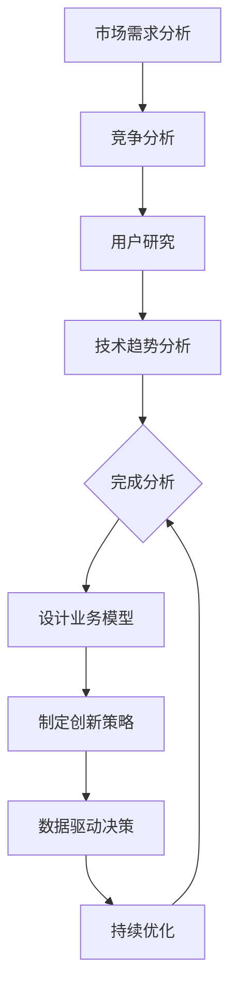

                 

# AI创业：识别行业需求

> **关键词：** AI创业，行业需求，市场分析，业务模型，数据驱动，创新

> **摘要：** 本文章深入探讨了AI创业企业如何通过识别和分析行业需求，实现商业成功。文章首先介绍了AI创业的背景，然后详细阐述了识别行业需求的重要性，最后提出了实用的方法和工具，帮助AI创业者在激烈的市场竞争中找到自己的立足点。

## 1. 背景介绍

人工智能（AI）技术在过去几年里取得了飞速发展，它不仅改变了我们的生活方式，也在各个行业中带来了革命性的变化。从自动驾驶汽车到智能家居，从医疗诊断到金融分析，AI的应用场景越来越广泛。随着技术的进步和成本的降低，越来越多的创业公司开始将AI技术作为核心驱动力，试图在这个快速发展的市场中分一杯羹。

然而，尽管AI技术具有巨大的潜力，但并非所有的AI创业项目都能成功。许多企业在初期就因为无法找到市场切入点或满足不了用户需求而失败。因此，如何识别和满足行业需求成为了AI创业成功的关键因素。

在AI创业领域，识别行业需求不仅仅是一个技术问题，更是一个商业问题。创业者需要深入了解目标市场的需求，理解客户的需求和痛点，才能设计出真正有价值的产品和服务。此外，创业者还需要具备一定的市场分析能力，以便在竞争激烈的市场中找到自己的差异化优势。

## 2. 核心概念与联系

### 2.1. 行业需求分析

行业需求分析是指对某一特定行业的需求进行系统性的研究和评估，以了解市场的现状、发展趋势以及潜在的机会。它包括以下几个方面：

- **市场需求分析**：研究市场需求的大小、增长趋势、用户需求和购买力。
- **竞争分析**：了解市场上的竞争对手，他们的产品、市场份额、竞争优势等。
- **用户研究**：通过用户调研、用户访谈、用户反馈等方式，了解目标用户的需求和痛点。
- **技术趋势分析**：研究AI技术的发展趋势，以及这些趋势如何影响行业需求。

### 2.2. 业务模型

业务模型是指企业如何通过产品和服务创造、传递和获取价值的过程。在AI创业中，业务模型的设计至关重要，它决定了企业的盈利模式和运营策略。常见的业务模型包括：

- **产品服务模型**：企业通过提供特定的产品或服务来满足用户需求，例如软件即服务（SaaS）、订阅制等。
- **平台模型**：企业构建一个平台，连接供需双方，例如电商平台、社交平台等。
- **价值链模型**：企业通过整合上游供应商和下游客户，优化整个价值链，提高效率，降低成本。

### 2.3. 数据驱动

数据驱动是指企业在决策过程中依赖数据进行分析和决策。在AI创业中，数据驱动尤为重要，因为AI技术的核心在于数据的处理和分析。数据驱动的业务模式包括：

- **数据收集**：通过传感器、用户行为、市场调研等方式收集数据。
- **数据存储**：将收集到的数据存储在数据库或数据湖中，便于管理和分析。
- **数据分析**：利用AI算法对数据进行分析，提取有价值的信息。
- **数据应用**：将分析结果应用于产品和服务中，提高用户体验，增加商业价值。

### 2.4. 创新

创新是AI创业成功的关键因素。创新包括技术创新、业务模式创新、市场创新等。在AI创业中，创新意味着：

- **技术创新**：开发新的AI算法或优化现有算法，提高效率和准确性。
- **业务模式创新**：创造新的商业模式，例如通过AI技术实现个性化服务、自动化运营等。
- **市场创新**：开拓新的市场领域，例如将AI技术应用于新的行业或市场。

### 2.5. Mermaid流程图

以下是行业需求分析的Mermaid流程图：



## 3. 核心算法原理 & 具体操作步骤

### 3.1. 市场需求分析算法

市场需求分析的核心算法是统计分析方法，主要包括以下步骤：

1. **数据收集**：收集行业数据，包括市场规模、用户需求、竞争对手等。
2. **数据预处理**：对收集到的数据进行清洗、归一化和标准化处理。
3. **描述性统计分析**：计算数据的均值、中位数、标准差等统计指标。
4. **关联性分析**：使用相关系数、聚类分析等方法，分析不同变量之间的相关性。
5. **趋势预测**：使用时间序列分析、回归分析等方法，预测市场发展趋势。

### 3.2. 竞争分析算法

竞争分析的核心算法是数据挖掘方法，主要包括以下步骤：

1. **数据收集**：收集竞争对手的数据，包括产品、市场份额、营销策略等。
2. **数据预处理**：对收集到的数据进行清洗、归一化和标准化处理。
3. **特征提取**：从数据中提取关键特征，例如产品功能、价格、用户评价等。
4. **聚类分析**：使用聚类算法，将竞争对手分为不同的群体。
5. **关联规则挖掘**：使用关联规则挖掘算法，分析竞争对手之间的关联关系。
6. **竞争策略分析**：根据分析结果，制定竞争策略。

### 3.3. 用户研究算法

用户研究的核心算法是用户行为分析，主要包括以下步骤：

1. **数据收集**：收集用户行为数据，包括点击、购买、搜索等。
2. **数据预处理**：对收集到的数据进行清洗、归一化和标准化处理。
3. **行为特征提取**：从数据中提取用户行为特征，例如访问时长、点击率、购买频次等。
4. **聚类分析**：使用聚类算法，将用户分为不同的群体。
5. **用户需求分析**：根据用户行为特征，分析用户需求。
6. **用户反馈分析**：收集用户反馈，分析用户对产品和服务的需求和满意度。

### 3.4. 技术趋势分析算法

技术趋势分析的核心算法是文本挖掘方法，主要包括以下步骤：

1. **数据收集**：收集技术文献、专利、论文等数据。
2. **数据预处理**：对收集到的数据进行清洗、归一化和标准化处理。
3. **关键词提取**：使用文本挖掘算法，提取关键技术词。
4. **趋势分析**：使用词频分析、词云等方法，分析技术趋势。
5. **技术预测**：使用时间序列分析、回归分析等方法，预测技术发展趋势。

## 4. 数学模型和公式 & 详细讲解 & 举例说明

### 4.1. 描述性统计分析

描述性统计分析是市场需求分析的基础，常用的数学模型和公式包括：

- **均值（Mean）**：
  $$ \bar{x} = \frac{\sum_{i=1}^{n} x_i}{n} $$
  其中，$x_i$ 是第 $i$ 个数据点，$n$ 是数据点的总数。

- **中位数（Median）**：
  $$ M = \begin{cases} 
  x_{\frac{n+1}{2}} & \text{如果 $n$ 是奇数} \\
  \frac{x_{\frac{n}{2}} + x_{\frac{n}{2} + 1}}{2} & \text{如果 $n$ 是偶数}
  \end{cases} $$

- **标准差（Standard Deviation）**：
  $$ \sigma = \sqrt{\frac{\sum_{i=1}^{n} (x_i - \bar{x})^2}{n-1}} $$

### 4.2. 关联性分析

关联性分析用于研究不同变量之间的相关性，常用的数学模型和公式包括：

- **相关系数（Correlation Coefficient）**：
  $$ r = \frac{\sum_{i=1}^{n} (x_i - \bar{x})(y_i - \bar{y})}{\sqrt{\sum_{i=1}^{n} (x_i - \bar{x})^2} \sqrt{\sum_{i=1}^{n} (y_i - \bar{y})^2}} $$

- **聚类分析（Clustering Analysis）**：
  聚类分析是一种无监督学习方法，用于将数据点划分为不同的组。其中，K均值聚类算法是一种常见的聚类算法。

  $$ \min \sum_{i=1}^{k} \sum_{x_j \in S_i} d(x_j, \mu_i) $$
  其中，$k$ 是聚类个数，$S_i$ 是第 $i$ 个聚类，$\mu_i$ 是聚类中心。

### 4.3. 趋势预测

趋势预测用于预测市场或技术的发展趋势，常用的数学模型和公式包括：

- **时间序列分析（Time Series Analysis）**：
  时间序列分析是一种统计方法，用于分析时间序列数据，并预测未来的趋势。

  $$ y_t = \phi y_{t-1} + \epsilon_t $$
  其中，$y_t$ 是第 $t$ 个时间点的数据，$\phi$ 是滞后系数，$\epsilon_t$ 是误差项。

- **回归分析（Regression Analysis）**：
  回归分析是一种用于研究变量之间关系的统计方法。

  $$ y = \beta_0 + \beta_1 x + \epsilon $$
  其中，$y$ 是因变量，$x$ 是自变量，$\beta_0$ 和 $\beta_1$ 是回归系数，$\epsilon$ 是误差项。

### 4.4. 举例说明

假设我们要分析一个电商市场的用户需求，数据包括用户的年龄、收入、购买频次等。以下是具体的分析过程：

1. **描述性统计分析**：
   计算用户的平均年龄、平均收入、平均购买频次等。

2. **关联性分析**：
   计算用户年龄与收入、购买频次之间的相关系数，分析它们之间的相关性。

3. **趋势预测**：
   使用时间序列分析，预测未来几个月用户的购买频次。

4. **聚类分析**：
   将用户分为不同的群体，例如高收入群体、低收入群体等。

5. **回归分析**：
   分析用户收入与购买频次之间的关系，预测不同收入水平用户的购买频次。

## 5. 项目实战：代码实际案例和详细解释说明

### 5.1. 开发环境搭建

在本文中，我们将使用Python作为主要编程语言，结合常用的数据分析和机器学习库，如NumPy、Pandas、Scikit-learn等。以下是搭建开发环境的基本步骤：

1. **安装Python**：下载并安装Python 3.8或更高版本。
2. **安装Jupyter Notebook**：使用pip命令安装Jupyter Notebook。
   ```shell
   pip install notebook
   ```
3. **安装相关库**：使用pip命令安装所需的库。
   ```shell
   pip install numpy pandas scikit-learn matplotlib
   ```

### 5.2. 源代码详细实现和代码解读

以下是关于用户需求分析的项目实战代码：

```python
import numpy as np
import pandas as pd
from sklearn.cluster import KMeans
from sklearn.preprocessing import StandardScaler
import matplotlib.pyplot as plt

# 5.2.1. 数据收集与预处理
data = pd.read_csv('user_data.csv')
data.head()

# 对数据进行归一化处理
scaler = StandardScaler()
data_scaled = scaler.fit_transform(data)

# 5.2.2. 聚类分析
kmeans = KMeans(n_clusters=3, random_state=0)
clusters = kmeans.fit_predict(data_scaled)

# 5.2.3. 结果可视化
plt.scatter(data_scaled[:, 0], data_scaled[:, 1], c=clusters)
plt.xlabel('Age')
plt.ylabel('Income')
plt.title('User Clusters')
plt.show()

# 5.2.4. 用户需求分析
cluster_stats = data.groupby(clusters).describe()
print(cluster_stats)

# 5.2.5. 趋势预测
# 使用时间序列分析预测购买频次
# 假设已经收集了用户购买频次的历史数据
purchase_data = pd.read_csv('purchase_data.csv')
purchase_data.head()

# 对数据进行预处理
purchase_data['Month'] = pd.to_datetime(purchase_data['Date']).dt.month
purchase_data.set_index('Month', inplace=True)
purchase_data_scaled = scaler.fit_transform(purchase_data)

# 使用ARIMA模型进行趋势预测
from statsmodels.tsa.arima.model import ARIMA
model = ARIMA(purchase_data_scaled, order=(1, 1, 1))
model_fit = model.fit()
forecast = model_fit.forecast(steps=6)

# 可视化预测结果
plt.plot(purchase_data.index, purchase_data['Frequency'], label='Historical')
plt.plot(pd.date_range(start=purchase_data.index[-1], periods=6, freq='M'), forecast, label='Forecast')
plt.xlabel('Month')
plt.ylabel('Frequency')
plt.title('Purchase Frequency Forecast')
plt.legend()
plt.show()
```

### 5.3. 代码解读与分析

1. **数据收集与预处理**：
   - 代码首先从CSV文件中读取用户数据，并进行归一化处理，以便后续的聚类分析。

2. **聚类分析**：
   - 使用KMeans算法对用户数据进行聚类，将用户分为不同的群体，并可视化结果。

3. **用户需求分析**：
   - 对不同聚类群体的用户数据进行分析，提取关键统计指标，以便了解各群体的特征。

4. **趋势预测**：
   - 使用ARIMA模型对用户购买频次进行时间序列分析，预测未来的购买趋势。

## 6. 实际应用场景

识别行业需求不仅在AI创业中至关重要，在各个行业中也有着广泛的应用。以下是一些实际应用场景：

- **金融行业**：通过分析市场数据和用户行为，预测股票走势和投资风险，为投资者提供决策支持。
- **医疗行业**：通过分析患者数据，预测疾病趋势和治疗方案，提高医疗服务的质量和效率。
- **零售行业**：通过分析消费者行为，预测商品需求，优化库存管理和销售策略。
- **教育行业**：通过分析学生学习数据，预测学习效果和个性化教学需求，提高教育质量。
- **制造行业**：通过分析生产线数据，预测设备故障和优化生产流程，提高生产效率。

## 7. 工具和资源推荐

### 7.1. 学习资源推荐

- **书籍**：
  - 《人工智能：一种现代的方法》
  - 《Python数据科学手册》
  - 《机器学习实战》
- **论文**：
  - Google Scholar：https://scholar.google.com/
  - arXiv：https://arxiv.org/
- **博客**：
  - Medium：https://medium.com/
  - towardsdatascience：https://towardsdatascience.com/
- **网站**：
  - Coursera：https://www.coursera.org/
  - edX：https://www.edx.org/

### 7.2. 开发工具框架推荐

- **开发环境**：
  - Jupyter Notebook：https://jupyter.org/
  - PyCharm：https://www.jetbrains.com/pycharm/
- **数据分析库**：
  - Pandas：https://pandas.pydata.org/
  - NumPy：https://numpy.org/
- **机器学习库**：
  - Scikit-learn：https://scikit-learn.org/
  - TensorFlow：https://www.tensorflow.org/
  - PyTorch：https://pytorch.org/

### 7.3. 相关论文著作推荐

- **论文**：
  - "Deep Learning" by Ian Goodfellow, Yoshua Bengio, and Aaron Courville
  - "Reinforcement Learning: An Introduction" by Richard S. Sutton and Andrew G. Barto
- **著作**：
  - 《人工智能：一种现代的方法》
  - 《Python数据科学手册》
  - 《机器学习实战》

## 8. 总结：未来发展趋势与挑战

AI创业的未来发展趋势体现在以下几个方面：

1. **技术创新**：随着AI技术的不断进步，更多的创新应用将不断涌现。
2. **跨界融合**：AI技术与其他领域的融合，如医疗、金融、教育等，将推动行业变革。
3. **规模化应用**：AI技术将在更多的行业中得到广泛应用，实现规模化应用。

然而，AI创业也面临着一些挑战：

1. **数据隐私**：如何保护用户数据隐私是AI创业的一大挑战。
2. **算法公平性**：确保算法的公平性和透明性，避免算法偏见。
3. **技术依赖**：过度依赖AI技术可能导致企业失去核心竞争力。

创业者需要密切关注行业动态，积极应对挑战，以实现可持续发展。

## 9. 附录：常见问题与解答

### 9.1. 如何进行行业需求分析？

- 通过市场调研、用户调研、竞争分析等方式收集数据。
- 使用描述性统计分析、关联性分析、趋势预测等方法进行分析。
- 制定业务模型，设计满足用户需求的产品和服务。

### 9.2. 如何进行数据驱动决策？

- 收集数据，确保数据质量。
- 使用数据分析方法，提取有价值的信息。
- 基于数据分析结果，制定业务策略和决策。

### 9.3. 如何进行用户研究？

- 通过用户调研、用户访谈、用户反馈等方式收集用户数据。
- 使用用户行为分析方法，提取用户特征。
- 分析用户需求，优化产品和服务。

## 10. 扩展阅读 & 参考资料

- 《人工智能：一种现代的方法》
- 《Python数据科学手册》
- 《机器学习实战》
- https://www.coursera.org/
- https://www.edx.org/
- https://towardsdatascience.com/
- https://www.tensorflow.org/
- https://pytorch.org/

---

**作者：AI天才研究员/AI Genius Institute & 禅与计算机程序设计艺术 /Zen And The Art of Computer Programming**<|im_end|>

