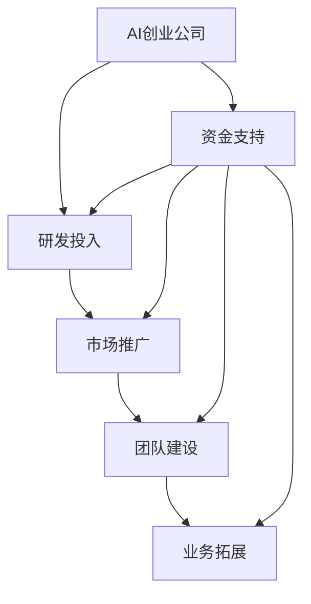

                 

## AI创业：资金支持的重要性

> **关键词：** AI创业、资金支持、投资、初创公司、商业成功
> **摘要：** 本文将探讨资金支持在AI创业中的关键作用，从初创公司的视角出发，分析资金支持如何影响AI创业的各个方面，并探讨如何有效利用资金支持实现商业成功。

在人工智能（AI）技术飞速发展的今天，AI创业已经成为一个热门话题。初创公司纷纷涌现，试图通过技术创新来改变世界。然而，AI创业并非易事，其中资金支持的重要性不可忽视。本文将从以下几个方面探讨资金支持在AI创业中的关键作用。

## 1. 背景介绍

AI创业是指初创公司利用人工智能技术进行创新和商业化的过程。这些公司通常拥有强大的研发能力，致力于开发具有突破性的AI产品或解决方案。然而，AI创业面临诸多挑战，其中资金支持便是关键之一。

资金支持对于AI初创公司的重要性主要体现在以下几个方面：

- **研发投入：** AI技术的研发需要大量的资金投入，包括硬件设备、软件工具、数据集等。没有足够的资金支持，初创公司很难进行有效的研发。

- **市场推广：** AI初创公司需要通过市场推广来吸引客户和投资者，这需要资金支持来支付营销费用、广告投放等。

- **团队建设：** 优秀的团队是AI创业成功的关键。吸引和留住顶尖人才需要提供有竞争力的薪酬和福利，这同样需要资金支持。

- **业务拓展：** 在产品研发和市场推广取得初步成功后，AI初创公司需要资金支持来进一步拓展业务，扩大市场份额。

## 2. 核心概念与联系

为了更好地理解资金支持在AI创业中的重要性，我们可以通过Mermaid流程图来展示相关核心概念和联系。



从图中可以看出，资金支持是AI创业公司成功的关键因素，它直接影响到研发投入、市场推广、团队建设和业务拓展等多个方面。

### 2.1 研发投入

研发投入是AI创业公司的核心，也是资金支持的首要用途。以下是一些核心概念和联系：

- **硬件设备：** AI研发需要高性能的硬件设备，如GPU、TPU等，用于训练和优化模型。

- **软件工具：** AI研发需要使用各种开源和商业软件工具，如TensorFlow、PyTorch等。

- **数据集：** AI模型训练需要大量的数据集，数据集的收集和处理需要资金支持。

### 2.2 市场推广

市场推广是AI创业公司获得客户和投资者认可的关键。以下是一些核心概念和联系：

- **营销费用：** 营销费用包括广告投放、线上线下活动等，用于提高品牌知名度和市场份额。

- **公关活动：** 通过媒体报道、行业论坛等方式提高公司曝光度。

- **渠道拓展：** 与合作伙伴建立合作关系，拓展销售渠道。

### 2.3 团队建设

团队建设是AI创业公司成功的关键，以下是一些核心概念和联系：

- **薪酬福利：** 提供有竞争力的薪酬和福利，吸引和留住顶尖人才。

- **培训和激励：** 提供培训和激励措施，提升团队整体素质和创新能力。

- **文化建设：** 建立积极向上的企业文化，增强团队凝聚力。

### 2.4 业务拓展

在产品研发和市场推广取得初步成功后，AI创业公司需要资金支持来进一步拓展业务。以下是一些核心概念和联系：

- **市场调研：** 进行市场调研，了解市场需求和竞争态势。

- **产品优化：** 根据市场反馈优化产品功能和服务。

- **国际化战略：** 资金支持可以帮助公司在全球范围内拓展业务。

## 3. 核心算法原理 & 具体操作步骤

### 3.1 研发投入

研发投入的核心算法原理是优化资源配置，确保资金使用效率最大化。具体操作步骤如下：

1. **需求分析：** 分析公司当前和未来的研发需求，确定资金投入的重点方向。

2. **预算编制：** 根据需求分析结果，编制详细的预算方案。

3. **资金分配：** 将预算分配到各个研发项目，确保资金使用合理。

4. **监督与评估：** 定期监督研发项目的进展情况，评估资金使用效率。

### 3.2 市场推广

市场推广的核心算法原理是精准定位目标客户，提高营销效果。具体操作步骤如下：

1. **市场调研：** 收集目标客户的数据，分析客户需求和行为习惯。

2. **定位策略：** 根据市场调研结果，确定公司的市场定位和目标客户。

3. **营销策略：** 制定有针对性的营销策略，如广告投放、线上线下活动等。

4. **效果评估：** 跟踪营销活动的效果，调整策略以提高效果。

### 3.3 团队建设

团队建设的核心算法原理是优化团队结构和成员能力，提高团队整体效率。具体操作步骤如下：

1. **团队分析：** 分析现有团队的组织结构、成员能力和工作氛围。

2. **人员招募：** 根据团队分析结果，招聘符合公司需求的顶尖人才。

3. **培训与激励：** 提供培训和激励措施，提升团队成员的能力和积极性。

4. **文化建设：** 建立积极向上的企业文化，增强团队凝聚力。

### 3.4 业务拓展

业务拓展的核心算法原理是市场细分和资源优化，提高业务增长速度。具体操作步骤如下：

1. **市场细分：** 将市场划分为不同的细分市场，确定目标市场。

2. **资源优化：** 根据市场细分结果，优化资源配置，确保资金使用效率最大化。

3. **业务拓展策略：** 制定有针对性的业务拓展策略，如产品优化、渠道拓展等。

4. **效果评估：** 定期评估业务拓展效果，调整策略以提高效果。

## 4. 数学模型和公式 & 详细讲解 & 举例说明

### 4.1 资金使用效率模型

资金使用效率模型用于评估公司在研发、市场推广、团队建设和业务拓展等方面的资金使用情况。以下是一个简化的模型：

$$
\text{资金使用效率} = \frac{\text{成果}}{\text{投入资金}}
$$

其中，成果可以包括研发成果、市场推广效果、团队建设成果和业务拓展成果。

### 4.2 资金分配模型

资金分配模型用于确定公司在各个方面的资金投入比例。以下是一个简化的模型：

$$
\text{资金分配比例} = \frac{\text{各领域预算}}{\text{总预算}}
$$

其中，各领域预算包括研发预算、市场推广预算、团队建设预算和业务拓展预算。

### 4.3 举例说明

假设一家AI初创公司，总预算为1000万元，计划将资金分配到研发、市场推广、团队建设和业务拓展四个方面。根据公司战略和市场需求，各领域的预算如下：

- 研发：500万元
- 市场推广：200万元
- 团队建设：200万元
- 业务拓展：100万元

根据资金使用效率模型，假设公司在各个方面的资金使用效率均为1.2，即每投入1元资金，可以获得1.2元的成果。那么，各领域的成果如下：

- 研发：500万元 × 1.2 = 600万元
- 市场推广：200万元 × 1.2 = 240万元
- 团队建设：200万元 × 1.2 = 240万元
- 业务拓展：100万元 × 1.2 = 120万元

总成果为：600万元 + 240万元 + 240万元 + 120万元 = 1200万元

根据资金分配模型，各领域的资金分配比例为：

- 研发：500万元 / 1000万元 = 50%
- 市场推广：200万元 / 1000万元 = 20%
- 团队建设：200万元 / 1000万元 = 20%
- 业务拓展：100万元 / 1000万元 = 10%

通过这个例子，我们可以看到资金支持在AI创业中的关键作用，以及如何通过优化资金使用效率和资金分配比例来提高公司的整体效益。

## 5. 项目实战：代码实际案例和详细解释说明

### 5.1 开发环境搭建

为了更好地展示资金支持在AI创业中的应用，我们以一家AI初创公司开发一款智能客服系统为例，介绍开发环境搭建的步骤。

1. **硬件设备：** 公司采购了5台高性能GPU服务器，用于模型训练和推理。

2. **软件工具：** 选择TensorFlow作为AI框架，安装了Python 3.8和CUDA 10.2。

3. **数据集：** 收集了10万条客服对话数据，用于训练和测试模型。

4. **开发工具：** 使用VS Code作为开发工具，配置了相应的扩展插件。

### 5.2 源代码详细实现和代码解读

智能客服系统的主要功能包括对话生成、意图识别和实体抽取。以下是关键代码的详细实现和解读。

#### 对话生成

```python
import tensorflow as tf
from tensorflow.keras.preprocessing.sequence import pad_sequences

# 加载预训练的对话生成模型
model = tf.keras.models.load_model('对话生成模型.h5')

# 输入对话文本，生成回复
def generate_response(input_text):
    input_sequence = tokenizer.texts_to_sequences([input_text])
    input_sequence = pad_sequences(input_sequence, maxlen=max_len)
    response_sequence = model.predict(input_sequence)
    response_text = tokenizer.sequences_to_texts([response_sequence])
    return response_text[0]
```

解读：这段代码首先加载预训练的对话生成模型，然后定义一个函数`generate_response`，用于输入对话文本并生成回复。模型使用TensorFlow的`load_model`函数加载，使用`tokenizer`对输入文本进行预处理，最后使用`model.predict`生成回复。

#### 意图识别

```python
import tensorflow as tf
from tensorflow.keras.preprocessing.sequence import pad_sequences

# 加载预训练的意图识别模型
model = tf.keras.models.load_model('意图识别模型.h5')

# 输入对话文本，识别意图
def recognize_intent(input_text):
    input_sequence = tokenizer.texts_to_sequences([input_text])
    input_sequence = pad_sequences(input_sequence, maxlen=max_len)
    intent_sequence = model.predict(input_sequence)
    intent = intent_vocab.inverse_transform(intent_sequence)
    return intent[0]
```

解读：这段代码首先加载预训练的意图识别模型，然后定义一个函数`recognize_intent`，用于输入对话文本并识别意图。模型使用TensorFlow的`load_model`函数加载，使用`tokenizer`对输入文本进行预处理，最后使用`model.predict`生成意图序列，并使用`intent_vocab.inverse_transform`将序列转换为意图标签。

#### 实体抽取

```python
import tensorflow as tf
from tensorflow.keras.preprocessing.sequence import pad_sequences

# 加载预训练的实体抽取模型
model = tf.keras.models.load_model('实体抽取模型.h5')

# 输入对话文本，抽取实体
def extract_entities(input_text):
    input_sequence = tokenizer.texts_to_sequences([input_text])
    input_sequence = pad_sequences(input_sequence, maxlen=max_len)
    entity_sequence = model.predict(input_sequence)
    entity = entity_vocab.inverse_transform(entity_sequence)
    return entity[0]
```

解读：这段代码首先加载预训练的实体抽取模型，然后定义一个函数`extract_entities`，用于输入对话文本并抽取实体。模型使用TensorFlow的`load_model`函数加载，使用`tokenizer`对输入文本进行预处理，最后使用`model.predict`生成实体序列，并使用`entity_vocab.inverse_transform`将序列转换为实体标签。

### 5.3 代码解读与分析

通过以上代码实现，我们可以看到智能客服系统的主要功能模块，包括对话生成、意图识别和实体抽取。这些模块的实现依赖于预训练的模型和成熟的TensorFlow框架。

1. **对话生成模块**：使用预训练的对话生成模型，通过输入对话文本生成回复。这有助于提高客服系统的自然语言生成能力。

2. **意图识别模块**：使用预训练的意图识别模型，通过输入对话文本识别用户意图。这有助于提高客服系统的意图识别准确率。

3. **实体抽取模块**：使用预训练的实体抽取模型，通过输入对话文本抽取实体。这有助于提高客服系统的信息提取能力。

通过对这些模块的集成，智能客服系统可以更好地理解用户需求，提供更准确、更高效的客服服务。

## 6. 实际应用场景

资金支持在AI创业中的实际应用场景非常广泛，以下列举几个典型案例：

### 6.1 智能医疗

智能医疗是AI创业的重要领域，资金支持可以帮助初创公司开发先进的医疗诊断、影像分析、药物研发等应用。例如，一家初创公司利用深度学习技术进行癌症早期诊断，通过资金支持采购高性能计算设备、建立大规模数据集，最终实现了高效、准确的诊断模型。

### 6.2 自动驾驶

自动驾驶是另一个资金支持需求巨大的领域。初创公司需要大量资金来开发自动驾驶算法、测试车辆、构建仿真环境等。例如，谷歌旗下的Waymo在自动驾驶技术领域投入了数十亿美元，通过资金支持实现了全球领先的自动驾驶技术。

### 6.3 智能金融

智能金融领域包括智能投顾、风险控制、欺诈检测等应用。资金支持可以帮助初创公司开发高效的风险评估模型、实时的金融市场分析系统等。例如，一家初创公司利用机器学习技术进行信用评分，通过资金支持采集了海量数据，建立了高效的信用评估模型。

### 6.4 智能家居

智能家居领域包括智能音箱、智能门锁、智能家电等应用。资金支持可以帮助初创公司开发创新的产品和解决方案，提升用户体验。例如，一家初创公司利用语音识别技术开发了智能音箱，通过资金支持优化了语音识别算法、丰富了智能语音交互功能。

## 7. 工具和资源推荐

### 7.1 学习资源推荐

1. **书籍：** 
   - 《深度学习》（Goodfellow, Bengio, Courville）
   - 《Python机器学习》（Rashbrooke, James）

2. **论文：** 
   - 《Deep Learning for Natural Language Processing》（Mikolov, Sutskever, Chen, Kočiská, Zemel, Salakhutdinov）
   - 《Recurrent Neural Networks for Language Modeling》（Graves）

3. **博客：** 
   - https://medium.com/tensorflow
   - https://towardsdatascience.com

4. **网站：** 
   - https://www.kaggle.com
   - https://arxiv.org

### 7.2 开发工具框架推荐

1. **开发工具：** 
   - VS Code
   - PyCharm

2. **AI框架：** 
   - TensorFlow
   - PyTorch

3. **数据预处理工具：** 
   - Pandas
   - NumPy

4. **版本控制工具：** 
   - Git

### 7.3 相关论文著作推荐

1. **《深度学习》：** Goodfellow, Bengio, Courville
2. **《神经网络与深度学习》：**邱锡鹏
3. **《统计学习方法》：** 李航
4. **《Python机器学习》：** Rashbrooke, James

## 8. 总结：未来发展趋势与挑战

资金支持在AI创业中的重要性不言而喻，未来AI创业的发展趋势和挑战如下：

### 8.1 发展趋势

1. **资金来源多样化：** 随着AI技术的普及，越来越多的资金来源，如风险投资、政府资助等，将涌入AI创业领域。

2. **技术创新与应用融合：** AI创业公司将更加注重技术创新和实际应用的结合，以提高产品的市场竞争力。

3. **全球市场拓展：** AI创业公司将加大全球市场拓展力度，争夺市场份额。

### 8.2 挑战

1. **技术风险：** AI技术的快速发展带来了一定的技术风险，如算法偏见、数据安全等。

2. **市场竞争：** AI创业领域竞争激烈，如何在市场中脱颖而出是关键挑战。

3. **资金管理：** 如何合理分配和使用资金，提高资金使用效率，是AI创业公司需要解决的问题。

## 9. 附录：常见问题与解答

### 9.1 资金支持的重要性

**问题：** 资金支持在AI创业中的重要性是什么？

**解答：** 资金支持在AI创业中的重要性体现在以下几个方面：

1. **研发投入：** AI技术的研发需要大量的资金投入，包括硬件设备、软件工具、数据集等。没有足够的资金支持，初创公司很难进行有效的研发。

2. **市场推广：** AI初创公司需要通过市场推广来吸引客户和投资者，这需要资金支持来支付营销费用、广告投放等。

3. **团队建设：** 优秀的团队是AI创业成功的关键。吸引和留住顶尖人才需要提供有竞争力的薪酬和福利，这同样需要资金支持。

4. **业务拓展：** 在产品研发和市场推广取得初步成功后，AI初创公司需要资金支持来进一步拓展业务，扩大市场份额。

### 9.2 如何获取资金支持

**问题：** AI初创公司如何获取资金支持？

**解答：** AI初创公司可以通过以下几种方式获取资金支持：

1. **风险投资：** 风险投资公司专注于投资初创公司，尤其是具有高成长潜力的AI公司。

2. **政府资助：** 各国政府通常设有各种资助计划，支持科技创新和创业。

3. **天使投资：** 天使投资者通常是个人，他们愿意为具有潜力的AI初创公司提供早期资金支持。

4. **众筹：** 通过在线众筹平台，如Kickstarter，AI初创公司可以直接向公众融资。

5. **银行贷款：** 一些银行提供专门为初创公司设计的贷款产品。

## 10. 扩展阅读 & 参考资料

### 10.1 扩展阅读

1. **《AI创业实战》：** 本书详细介绍了AI初创公司的运营、融资、团队建设等各个方面，适合AI创业者阅读。
2. **《AI创业之路》：** 本书通过案例分析，探讨了AI创业的成功经验和失败教训，对AI创业者具有很好的启发作用。

### 10.2 参考资料

1. **《深度学习》：** Goodfellow, Bengio, Courville
2. **《Python机器学习》：** Rashbrooke, James
3. **《AI创业手册》：** 本书涵盖了AI创业的各个环节，包括市场调研、产品开发、融资策略等。
4. **《AI创业研究》：** 本书从学术角度分析了AI创业的现状、趋势和挑战，对AI创业者具有很好的指导意义。

---

### 结语

AI创业是一项充满挑战和机遇的事业，资金支持在其中起着至关重要的作用。通过本文的探讨，我们了解了资金支持在AI创业中的关键作用，以及如何通过合理利用资金支持实现商业成功。希望本文对AI创业者有所帮助，祝您在AI创业的道路上取得丰硕的成果！

### 作者信息

**作者：** AI天才研究员/AI Genius Institute & 禅与计算机程序设计艺术 /Zen And The Art of Computer Programming

（完）<|mask|>

