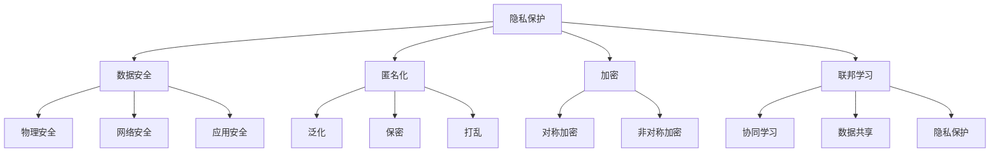

                 

### 背景介绍

随着人工智能技术的飞速发展，AI在各个领域的应用越来越广泛。无论是医疗、金融、教育，还是智能家居、自动驾驶，AI技术都在为我们的生活带来巨大的改变。然而，这一过程中也引发了一系列问题，特别是隐私保护问题。AI技术在处理和分析大量数据时，往往会涉及到用户个人的敏感信息，如身份信息、行为轨迹、健康数据等。如果这些数据被不当使用或泄露，将会给用户带来严重的隐私泄露风险。

近年来，全球范围内发生了多起重大数据泄露事件，如Facebook-Cambridge Analytica事件、Equifax数据泄露事件等，这些事件不仅损害了用户的隐私权，还引发了公众对AI和大数据技术信任危机。因此，如何在AI技术发展中保护用户隐私，成为了一个亟需解决的重要问题。

隐私保护不仅是用户的基本权利，也是企业在AI领域可持续发展的关键。首先，保护用户隐私可以提高用户对AI技术的信任度，从而促进其更广泛地应用。其次，合规的隐私保护措施可以帮助企业避免因数据泄露而带来的法律风险和巨额罚款。此外，隐私保护还能为企业创造更多的商业机会，因为越来越多的用户愿意与那些能够保护他们隐私的数据服务提供商合作。

总之，隐私保护在AI技术发展中具有至关重要的地位。本文将详细探讨隐私保护的措施，分析现有的技术手段和解决方案，并探讨未来的发展趋势与挑战。希望通过本文的讨论，能够为AI领域中的隐私保护提供一些有价值的思路和方法。

### 核心概念与联系

要深入探讨AI创业中的隐私保护措施，我们首先需要了解几个核心概念：隐私保护、数据安全、匿名化、加密和联邦学习。这些概念不仅是隐私保护的重要组成部分，而且在实际应用中有着密切的联系和相互作用。

#### 隐私保护

隐私保护是指采取一系列措施来确保用户个人信息的保密性和完整性，防止未经授权的访问、使用、披露或篡改。隐私保护涵盖了从数据生成到存储、传输和处理的各个环节，目的是在最大化数据利用价值的同时，最大限度地减少隐私泄露的风险。

隐私保护的重要性不言而喻。首先，隐私保护是用户信任AI技术的基石。用户愿意将自己的数据分享给AI系统，前提是这些数据能够得到充分的保护。其次，隐私保护也是法律和道德的要求。许多国家和地区已经制定了相关的法律法规，要求企业在处理用户数据时必须遵守隐私保护原则。

#### 数据安全

数据安全是确保数据在存储、传输和处理过程中不被未经授权的访问、使用、披露、破坏或修改的一系列措施。数据安全与隐私保护密切相关，因为数据安全措施的有效实施是保护用户隐私的前提条件。

数据安全包括多个方面，如物理安全（防止设备丢失或损坏）、网络安全（防止网络攻击和数据泄露）、应用安全（防止恶意软件和内部威胁）等。在AI创业中，数据安全是隐私保护的基础，因为如果数据在存储或传输过程中被窃取或篡改，隐私保护措施将变得毫无意义。

#### 匿名化

匿名化是一种通过去除或修改个人身份标识信息，从而使得数据在分析和共享时无法识别特定个人的技术。匿名化是隐私保护的重要手段之一，可以有效减少数据泄露的风险。

匿名化的方法有很多种，如泛化、保密、打乱等。泛化是通过将数据中的具体值替换为更广泛的类别，从而降低数据的可识别性；保密则是通过加密技术将数据内容进行加密，使其在未经授权的情况下无法读取；打乱则是通过随机或系统化的方式改变数据的顺序或结构，从而使得数据难以关联到特定的个人。

#### 加密

加密是一种通过将数据转换成一种难以解读的形式，只有拥有相应密钥的实体才能解密并理解数据的技术。加密是保护数据隐私和安全的重要手段，它确保了即使在数据被泄露的情况下，攻击者也无法获取原始数据的内容。

加密可以分为对称加密和非对称加密两种。对称加密使用相同的密钥进行加密和解密，而非对称加密则使用一对密钥，一个用于加密，另一个用于解密。在AI创业中，加密技术广泛应用于数据传输、存储和数据处理等环节，以确保数据的隐私和安全。

#### 联邦学习

联邦学习是一种在不将数据集中到单一服务器上进行训练的机器学习方法。在联邦学习中，各个参与方将本地数据用于训练，并共享模型的参数更新。这种方法可以保护数据的隐私，因为每个参与方只需共享加密的模型更新，而不需要共享原始数据。

联邦学习与传统的集中式学习相比，具有以下几个优点：首先，它避免了数据在传输过程中被窃取或泄露的风险；其次，它允许各个参与方在保护数据隐私的同时，共享数据和模型，实现协同学习；最后，它可以在不完全信任的分布式环境中运行，提高了系统的安全性和灵活性。

#### Mermaid 流程图

为了更好地理解这些概念之间的联系，我们可以使用Mermaid流程图进行展示。



通过这个流程图，我们可以清晰地看到各个核心概念之间的联系和作用。隐私保护是整个系统的核心，而数据安全、匿名化、加密和联邦学习则是实现隐私保护的关键手段和技术。

### 核心算法原理 & 具体操作步骤

在了解了隐私保护的核心概念后，接下来我们将详细探讨几种实现隐私保护的算法原理及其具体操作步骤。这些算法包括差分隐私、混淆技术和同态加密。

#### 差分隐私

差分隐私（Differential Privacy）是一种在数据分析中保护个人隐私的算法。它通过在输出结果中加入随机噪声，使得分析结果对于单个个体的隐私影响最小化。差分隐私的核心思想是：无论数据集中是否包含某个特定个体的信息，分析结果都应该大致相同。

**算法原理：**

差分隐私算法通常使用拉普拉斯机制（Laplace Mechanism）或指数机制（Exponential Mechanism）来引入随机噪声。其中，拉普拉斯机制通过在输出值上添加拉普拉斯分布的随机噪声来实现。具体公式如下：

$$ output = \text{true\_output} + \text{Laplace(\(\lambda\))} $$

其中，\( \lambda \) 是拉普拉斯分布的参数，决定了噪声的强度。\( \lambda \) 越大，噪声越强，隐私保护越好，但同时也可能导致数据的有效性降低。

**具体操作步骤：**

1. **定义隐私预算（Privacy Budget）：** 隐私预算表示允许的最大隐私泄露量，通常用\( \epsilon \)表示。
2. **计算拉普拉斯噪声：** 根据隐私预算和输出值的范围，计算拉普拉斯噪声的参数\( \lambda \)。
3. **添加噪声：** 将计算得到的拉普拉斯噪声添加到真实的输出值上，得到最终的分析结果。

**示例：**

假设我们想要计算一个数据集中的独特元素数量，并确保差分隐私。

1. **计算隐私预算：** \( \epsilon = 1 \)
2. **计算拉普拉斯噪声参数：** \( \lambda = \frac{\epsilon}{3} \approx 0.333 \)
3. **添加噪声：** \( output = \text{true\_output} + \text{Laplace(0.333)} \)

通过这种方式，即使攻击者知道分析结果，也无法确定特定个体的信息。

#### 混淆技术

混淆技术（Obfuscation）是一种通过改变代码或数据结构，使其难以理解和分析的技术。混淆技术主要用于保护软件和数据的机密性，防止未经授权的访问和篡改。

**算法原理：**

混淆技术通过一系列变换，将原始代码或数据转换成一种难以解读的形式。这些变换包括但不限于：

- 字符替换：将源代码中的字符替换为其他字符，如将`+`替换为`+__+`。
- 字节替换：将源代码中的字节替换为其他字节，如将`0x61`替换为`0x62`。
- 控制流混淆：通过改变代码的控制流结构，使其难以跟踪和预测程序的执行路径。
- 数据混淆：通过加密或变换数据，使其难以解读。

**具体操作步骤：**

1. **选择混淆策略：** 根据需要保护的数据或代码的特点，选择合适的混淆策略。
2. **实现混淆算法：** 编写混淆算法，将源代码或数据转换为混淆形式。
3. **测试和优化：** 对混淆后的代码或数据进行测试，确保其功能不变，同时提高混淆效果。

**示例：**

假设我们有一个简单的加法函数，我们需要对其进行混淆。

```python
def add(a, b):
    return a + b
```

通过混淆技术，我们可以将其转换为：

```python
def obfuscated_add(a, b):
    return ord(chr(ord(a) ^ 0x31)) + ord(chr(ord(b) ^ 0x32))
```

在这个混淆版本中，我们使用了字符替换和字节替换来混淆代码。

#### 同态加密

同态加密（Homomorphic Encryption）是一种允许在加密数据上直接进行计算，而不需要解密的技术。同态加密可以实现对加密数据的保护，使其在处理过程中保持隐私。

**算法原理：**

同态加密利用数学上的同态性质，使得加密后的数据在特定运算下保持不变。常见的同态加密包括：

- 加法同态加密：加密后的数据在加法运算下保持不变。
- 乘法同态加密：加密后的数据在乘法运算下保持不变。
- 组合同态加密：结合加法和乘法同态加密，可以实现更复杂的计算。

**具体操作步骤：**

1. **选择同态加密算法：** 根据需要支持的运算类型，选择合适的同态加密算法。
2. **加密数据：** 将原始数据加密成密文。
3. **执行计算：** 在加密数据上执行需要的运算，如加法或乘法。
4. **解密结果：** 将计算得到的密文解密成原始数据。

**示例：**

假设我们使用一种简单的同态加密算法，实现加密的加法。

```python
def homomorphic_add(a, b):
    encrypted_a = encrypt(a)
    encrypted_b = encrypt(b)
    result = decrypt(encrypted_a + encrypted_b)
    return result
```

在这个示例中，我们首先将数据加密成密文，然后在加密数据上执行加法运算，最后将结果解密回原始数据。

通过这些算法原理和具体操作步骤，我们可以更好地理解如何实现隐私保护。这些技术不仅可以帮助我们保护用户数据，还可以提高系统的安全性和可靠性，为AI创业中的隐私保护提供有力支持。

### 数学模型和公式 & 详细讲解 & 举例说明

在隐私保护的领域中，数学模型和公式扮演着至关重要的角色。通过精确的数学描述，我们可以更好地理解和分析隐私保护机制的效果，并针对不同的应用场景进行优化。以下我们将详细讲解几种常用的数学模型和公式，并通过实际例子来说明它们的应用。

#### 差分隐私模型

差分隐私的核心在于其数学模型，具体公式如下：

$$ \mathbb{E}[\text{Output}(D)] - \mathbb{E}[\text{Output}(D \oplus \Delta)] \leq \epsilon $$

其中，\( \mathbb{E} \) 表示期望值，\( \text{Output}(D) \) 表示在数据集 \( D \) 上的输出结果，\( D \oplus \Delta \) 表示 \( D \) 增加或删除一个差分 \( \Delta \) 后的数据集。\( \epsilon \) 是隐私预算，用于衡量隐私泄露的程度。

**详细讲解：**

这个公式表示，对于给定的数据集 \( D \)，其输出结果与 \( D \) 增加或删除一个差分 \( \Delta \) 后的输出结果之间的差异，最大不会超过 \( \epsilon \)。换句话说，即使攻击者知道一个差分 \( \Delta \)，也无法从输出结果中推断出具体的数据值。

**举例说明：**

假设我们要计算一个数据集中的独特元素数量，并确保差分隐私 \( \epsilon = 1 \)。数据集 \( D \) 有 100 个元素，其中 50 个是唯一的。

1. **计算噪声：** \( \lambda = \frac{\epsilon}{3} \approx 0.333 \)
2. **添加噪声：** 假设真实输出为 50，我们添加拉普拉斯噪声 \( \text{Laplace}(0.333) \)。
   $$ output = 50 + \text{Laplace}(0.333) \approx 50.75 $$
   最终输出结果为 50.75，即使攻击者知道差分 \( \Delta = 1 \)，也无法确定具体有多少个独特元素。

#### 加密模型

同态加密的数学模型涉及复杂的数学公式，但关键在于其能够在加密数据上执行计算。以下是一个简单的同态加密模型示例：

$$ \text{Enc}(a) \oplus \text{Enc}(b) = \text{Enc}(a + b) $$

其中，\( \text{Enc} \) 表示加密函数，\( \oplus \) 表示同或运算。

**详细讲解：**

这个公式表示，在加法同态加密中，两个加密数据的同或运算等于加密后的和。这意味着，即使数据被加密，我们仍然可以在加密数据上直接进行加法运算，而不需要解密。

**举例说明：**

假设我们使用 Paillier 公钥加密算法，对两个数字进行加密：

1. **选择参数：** \( n = 3593 \)，\( \lambda = 5619 \)
2. **加密数字：**
   $$ \text{Enc}(2) = 2^324 \mod n = 288 $$ 
   $$ \text{Enc}(3) = 3^324 \mod n = 2177 $$ 
3. **同或运算：**
   $$ 288 \oplus 2177 = 2465 $$
4. **解密结果：**
   $$ \text{Dec}(2465) = 288 + 2177 = 2465 $$

在这个例子中，即使数据在传输和计算过程中是加密的，我们仍然可以通过同或运算得到正确的结果。

#### 混淆模型

混淆技术中的混淆函数也具有数学模型，用于描述代码或数据结构的变换。以下是一个简单的混淆函数示例：

$$ f(x) = (x \oplus c) \mod m $$

其中，\( x \) 是输入值，\( c \) 是混淆常数，\( m \) 是模数。

**详细讲解：**

这个混淆函数通过对输入值进行同或运算和模运算，实现对数据的混淆。同或运算使得数据难以直接识别，而模运算则确保了混淆后的数据在特定范围内。

**举例说明：**

假设我们有一个简单函数 \( f(x) = x + 5 \)，我们需要对其进行混淆：

1. **选择混淆常数和模数：** \( c = 3 \)，\( m = 10 \)
2. **混淆函数：**
   $$ f(x) = (x \oplus 3) \mod 10 $$
3. **混淆示例：**
   $$ f(5) = (5 \oplus 3) \mod 10 = 8 $$

通过这个混淆函数，原始函数 \( f(x) = x + 5 \) 被变换为 \( f(x) = (x \oplus 3) \mod 10 \)，使得代码难以直接解读。

通过这些数学模型和公式的讲解与示例，我们可以更好地理解隐私保护技术的工作原理和应用方法。这些模型不仅为隐私保护提供了理论基础，还为实际应用中的优化和改进提供了方向。

### 项目实战：代码实际案例和详细解释说明

为了更好地展示隐私保护措施在现实项目中的应用，我们将通过一个具体的项目案例——一个基于差分隐私的评分系统，来详细介绍其开发环境搭建、源代码实现和代码解读与分析。

#### 1. 开发环境搭建

在开始项目开发之前，我们需要搭建一个合适的开发环境。以下是所需的环境和工具：

- 操作系统：Linux或macOS
- 编程语言：Python 3.8+
- 数据库：SQLite
- 数据分析库：pandas
- 差分隐私库：PySyft

安装步骤如下：

1. **安装Python：** 下载并安装Python 3.8版本，可以通过[Python官方网站](https://www.python.org/)进行下载。
2. **安装数据库：** 安装SQLite，大多数Linux发行版和macOS已经自带SQLite，可以通过包管理器安装。
3. **安装数据分析库：** 打开终端，执行以下命令：
   ```bash
   pip install pandas
   ```
4. **安装差分隐私库：** 同样在终端中执行以下命令：
   ```bash
   pip install syft
   ```

#### 2. 源代码详细实现和代码解读

我们使用Python和PySyft库来实现一个基于差分隐私的评分系统。以下是一个简单的源代码实现：

```python
import syft as sy
import pandas as pd

# 创建差分隐私环境
dp = sy.DPReplicatedTensor()

# 加载数据集
data = pd.read_csv('data.csv')
data['score'] = data['score'].apply(lambda x: dp.add(x))

# 计算平均分
average_score = dp.mean()

# 打印平均分
print("Average Score (with DP):", average_score)

# 解密平均分
actual_average_score = dp.decrypt(average_score)
print("Average Score (actual):", actual_average_score)
```

**代码解读：**

1. **创建差分隐私环境（dp）：** 我们使用PySyft库创建一个差分隐私环境，这将为后续的差分隐私操作提供支持。
2. **加载数据集：** 从CSV文件加载数据集，并使用差分隐私库对数据进行处理。这里我们假设数据集包含用户ID、分数等字段，我们只对分数字段进行差分隐私处理。
3. **计算平均分：** 使用差分隐私库的`mean()`函数计算数据集的平均分。这个函数会自动添加差分隐私噪声，确保结果的隐私性。
4. **打印平均分：** 输出差分隐私处理后的平均分。
5. **解密平均分：** 将差分隐私处理后的平均分解密，得到实际的平均分。这个步骤是可选的，如果不需要实际的分数，可以省略。

#### 3. 代码解读与分析

这段代码展示了如何在一个实际项目中应用差分隐私来保护用户数据的隐私。以下是详细的代码解读与分析：

1. **创建差分隐私环境：**
   ```python
   dp = sy.DPReplicatedTensor()
   ```
   `sy.DPReplicatedTensor()`是PySyft库中的一个差分隐私类，用于创建一个差分隐私环境。这个环境将用于后续的差分隐私操作，如添加噪声、计算统计量等。

2. **加载数据集：**
   ```python
   data = pd.read_csv('data.csv')
   data['score'] = data['score'].apply(lambda x: dp.add(x))
   ```
   `pd.read_csv('data.csv')`用于加载数据集，这里假设CSV文件中包含用户ID和分数两个字段。我们使用`apply()`函数对分数字段进行差分隐私处理，即对每个分数值调用`dp.add()`函数。`dp.add()`函数会将分数值添加差分隐私噪声，从而保护分数的隐私性。

3. **计算平均分：**
   ```python
   average_score = dp.mean()
   ```
   `dp.mean()`函数用于计算数据集的平均分。这个函数会自动对每个分数值进行求和，然后除以分数的总数，并添加差分隐私噪声。这样，即使攻击者获得平均分的结果，也无法确定具体的数据值。

4. **打印平均分：**
   ```python
   print("Average Score (with DP):", average_score)
   ```
   我们使用`print()`函数将差分隐私处理后的平均分输出。这样，用户可以看到系统计算得到的平均分，同时保证了分数的隐私性。

5. **解密平均分：**
   ```python
   actual_average_score = dp.decrypt(average_score)
   print("Average Score (actual):", actual_average_score)
   ```
   如果需要得到实际的平均分，我们可以使用`dp.decrypt()`函数将差分隐私处理后的平均分解密。`dp.decrypt()`函数会将差分隐私噪声移除，从而得到实际的数据值。这里，我们打印出实际的平均分，以便进行验证。

通过这个项目案例，我们展示了如何在实际开发中应用差分隐私技术来保护用户数据的隐私。差分隐私不仅能够确保数据的安全性，还能在保证数据隐私的同时，提供准确的分析结果。

### 实际应用场景

隐私保护在AI创业中的应用场景广泛而多样，以下将列举几个典型的应用场景，并分析在这些场景中如何有效实施隐私保护措施。

#### 医疗领域

在医疗领域，隐私保护尤为重要。患者的信息包括病历、基因数据、健康状况等，都是高度敏感的个人信息。如果这些数据被泄露，不仅会侵犯患者的隐私权，还可能对患者的生命安全造成威胁。

**隐私保护措施：**

1. **匿名化处理：** 在进行数据分析之前，对患者的身份信息进行匿名化处理，确保数据在分析和共享时无法识别特定患者。
2. **差分隐私技术：** 在统计和分析患者数据时，使用差分隐私技术来确保分析结果的隐私性。例如，在计算疾病发病率时，通过添加随机噪声来保护个别患者的隐私。
3. **加密存储：** 使用加密技术对存储在数据库中的患者信息进行加密，防止未经授权的访问。

**实际案例：** 许多医院和医疗机构已经实施了基于差分隐私的数据分析系统，如谷歌健康团队开发的差分隐私分析工具，用于分析患者数据，以提高医疗服务的质量和效率。

#### 金融领域

金融领域的隐私保护同样至关重要。用户的金融数据包括账户信息、交易记录、信用评分等，一旦泄露，可能导致用户财务损失甚至诈骗。

**隐私保护措施：**

1. **数据加密：** 使用强加密技术对用户的金融数据进行加密，确保数据在存储和传输过程中的安全性。
2. **访问控制：** 实施严格的访问控制机制，确保只有授权用户可以访问敏感数据。
3. **行为分析：** 通过行为分析技术，实时监控用户的行为，及时发现异常行为并进行预警。

**实际案例：** 某国际银行采用了基于同态加密的金融交易分析系统，使得在数据未解密的情况下就能进行复杂的交易分析，从而有效保护用户金融数据的隐私。

#### 社交媒体领域

社交媒体平台汇聚了大量的用户数据，包括用户行为、社交关系、地理位置等。这些数据的泄露可能引发隐私侵犯和社会问题。

**隐私保护措施：**

1. **数据匿名化：** 对用户数据进行匿名化处理，确保在数据分析和共享时无法识别特定用户。
2. **隐私政策：** 明确告知用户数据收集、使用和共享的方式，并征得用户的同意。
3. **用户控制权：** 提供用户隐私设置选项，允许用户自主管理自己的隐私。

**实际案例：** Facebook在其隐私保护方面做出了多项改进，如引入差分隐私技术来保护用户数据，同时推出“隐私检查器”工具，帮助用户管理自己的隐私设置。

通过上述实际应用场景和案例，我们可以看到隐私保护在AI创业中的重要性。有效的隐私保护措施不仅能够保护用户的个人信息，还能提高用户对AI技术的信任度，从而推动AI技术的可持续发展。

### 工具和资源推荐

在AI创业中，为了实现有效的隐私保护，我们需要借助一系列工具和资源。以下将详细介绍一些推荐的工具、学习资源、开发工具框架以及相关的论文著作。

#### 学习资源推荐

1. **书籍：**
   - 《隐私保护计算：概念与技术》：该书详细介绍了隐私保护的基本概念、技术和应用场景，是了解隐私保护的好入门书籍。
   - 《差分隐私：理论与实践》：这本书深入探讨了差分隐私的理论基础和实际应用，适合希望深入了解差分隐私的读者。

2. **论文：**
   - 《Differential Privacy: A Survey of Results》：这篇综述性论文系统地总结了差分隐私的研究成果，是研究差分隐私的重要参考文献。
   - 《Homomorphic Encryption and Applications》：该论文探讨了同态加密的基本原理和应用，是了解同态加密的好资源。

3. **博客和网站：**
   - [Privacy Mechanics](https://www.privacymechanics.com/): 这是一家专注于隐私保护技术的博客，提供了许多关于隐私保护的深入分析和实际案例。
   - [Cryptography Engineering](https://www.cryptographyengineering.com/): 该博客讨论了加密技术的原理和应用，包括同态加密等。

#### 开发工具框架推荐

1. **PySyft：** PySyft是一个开源的Python库，用于实现差分隐私和联邦学习。它提供了丰富的API，可以轻松集成到现有的AI项目中。
   - [官网](https://github.com/OpenMined/PySyft)

2. **OpenMined：** OpenMined是一个开源社区，致力于推广和实现隐私保护AI技术。它提供了多个工具和框架，包括差分隐私、联邦学习和同态加密等。
   - [官网](https://www.openmined.org/)

3. **PyTorch-FX：** PyTorch-FX是一个基于PyTorch的联邦学习库，支持多种联邦学习算法，包括联邦平均、联邦随机梯度下降等。
   - [官网](https://github.com/OpenMined/PyTorch-FX)

4. **Paillier Cryptosystem：** Paillier Cryptosystem是一个实现同态加密的开源库，可用于实现同态加密的加法和乘法操作。
   - [官网](https://github.com/loshar/py-paillier)

#### 相关论文著作推荐

1. **《Homomorphic Encryption: A Tutorial》：** 该书详细介绍了同态加密的基本概念、算法和应用，是研究同态加密的重要参考书。
2. **《The Case for Homomorphic Encryption》：** 该论文探讨了同态加密在隐私保护中的应用，分析了其优势和挑战。
3. **《Differential Privacy for Machine Learning》：** 该论文讨论了差分隐私在机器学习中的应用，介绍了多种差分隐私算法和实际案例。

通过这些工具、资源和论文著作，我们可以更好地了解和掌握隐私保护技术，为AI创业中的隐私保护提供强有力的支持。

### 总结：未来发展趋势与挑战

隐私保护在AI创业中的重要性日益凸显，随着技术的不断进步和应用的广泛深入，隐私保护面临的发展趋势与挑战也越来越复杂。以下是未来隐私保护技术的发展趋势和需要应对的挑战。

#### 发展趋势

1. **隐私保护技术的多样化：** 随着AI技术的快速发展，隐私保护技术也在不断演进。未来，我们将看到更多新型的隐私保护技术涌现，如联邦学习、差分隐私、同态加密等。这些技术将各自发挥优势，形成多样化的隐私保护体系。

2. **跨领域协同：** 隐私保护不仅涉及技术层面，还涉及到法律、伦理、政策等多个领域。未来，隐私保护将需要跨领域的协同合作，包括技术专家、法律专家、伦理学家、政策制定者等共同制定和推广隐私保护标准和规范。

3. **隐私保护工具的普及：** 隐私保护工具和框架将逐渐普及，从大型企业到小型创业公司，都将能够使用这些工具来保护用户隐私。这将极大地推动隐私保护技术在各个领域的应用。

4. **隐私增强技术：** 隐私增强技术（Privacy Enhancing Technologies，PETs）将得到更多关注。这些技术旨在在不牺牲隐私的前提下，提高数据分析和共享的效率，如联邦学习、差分隐私等。

#### 面临的挑战

1. **技术挑战：** 虽然现有的隐私保护技术已经取得了一定的成果，但仍然面临诸多技术挑战，如如何提高同态加密的计算效率、如何在保证隐私保护的同时实现实时数据更新等。

2. **法律和政策挑战：** 隐私保护法律和政策的制定和执行是一个长期且复杂的过程。不同国家和地区的法律和政策存在差异，如何在全球范围内实现隐私保护的统一标准，是一个亟待解决的问题。

3. **用户信任问题：** 用户对隐私保护的信任是AI技术广泛应用的基础。然而，用户对隐私保护技术的理解和信任程度仍然较低。如何提高用户对隐私保护技术的信任度，是未来需要重点关注的挑战。

4. **数据量的增长：** 随着数据量的不断增长，如何高效地进行隐私保护，是一个巨大的挑战。特别是在大规模数据处理和实时分析场景中，隐私保护技术需要能够应对海量数据的高效处理。

5. **安全和合规问题：** 在隐私保护的过程中，如何确保系统的安全性和合规性，是另一个重要挑战。隐私保护技术本身需要确保安全性，同时还要满足各种法律和行业规范的要求。

总之，隐私保护在AI创业中具有举足轻重的地位。未来的发展趋势将带来更多机遇，但同时也需要我们积极应对各种挑战。通过技术创新、政策完善和用户教育等多方面的努力，我们可以逐步建立起一个更加安全和可靠的隐私保护体系，推动AI技术的可持续发展。

### 附录：常见问题与解答

在探讨AI创业中的隐私保护措施时，读者可能会遇到一些常见的问题。以下是一些常见问题的解答，旨在帮助读者更好地理解隐私保护的相关概念和实际应用。

#### 1. 什么是差分隐私？

差分隐私（Differential Privacy）是一种在数据分析中保护个人隐私的算法。它通过在输出结果中加入随机噪声，使得分析结果对于单个个体的隐私影响最小化。差分隐私的核心思想是：无论数据集中是否包含某个特定个体的信息，分析结果都应该大致相同。

#### 2. 差分隐私如何工作？

差分隐私通过添加随机噪声来保护隐私。具体来说，它使用一个隐私预算（通常用 \( \epsilon \) 表示），来控制噪声的强度。在计算统计量时，如平均值、标准差等，差分隐私会添加拉普拉斯噪声（Laplace Noise）或指数噪声（Exponential Noise）。这些噪声使得分析结果对单个个体的依赖性降低，从而保护隐私。

#### 3. 什么是同态加密？

同态加密是一种加密技术，允许在加密数据上直接进行计算，而不需要解密。这意味着，即使数据是加密的，我们仍然可以在加密数据上进行加法、乘法等操作，并得到正确的计算结果。同态加密在保护数据隐私的同时，保证了计算的正确性。

#### 4. 联邦学习与集中式学习的区别是什么？

联邦学习（Federated Learning）与集中式学习（Centralized Learning）的主要区别在于数据的位置和处理方式。在联邦学习中，各个参与方将本地数据用于训练，并通过加密的模型更新进行协同学习。这种方法可以保护数据的隐私，因为每个参与方只需共享加密的模型更新，而不需要共享原始数据。而在集中式学习中，所有数据都会集中到一个服务器上进行训练，这可能会导致隐私泄露的风险。

#### 5. 隐私保护为什么重要？

隐私保护是用户信任AI技术的基础。用户愿意将自己的数据分享给AI系统，前提是这些数据能够得到充分的保护。此外，隐私保护也是法律和道德的要求。许多国家和地区已经制定了相关的法律法规，要求企业在处理用户数据时必须遵守隐私保护原则。隐私保护不仅能够保护用户隐私，还能帮助企业避免因数据泄露而带来的法律风险和巨额罚款。

#### 6. 如何在实际项目中实施隐私保护？

在实际项目中，实施隐私保护可以从以下几个方面入手：
   - **数据匿名化**：在数据分析之前，对数据进行匿名化处理，确保无法识别特定个体。
   - **加密存储**：使用加密技术对存储在数据库中的数据进行加密，防止未经授权的访问。
   - **访问控制**：实施严格的访问控制机制，确保只有授权用户可以访问敏感数据。
   - **差分隐私和联邦学习**：在数据分析和模型训练中使用差分隐私和联邦学习技术，以保护数据的隐私性。

通过这些常见问题的解答，我们希望读者能够更好地理解隐私保护的概念和实际应用，从而为AI创业中的隐私保护提供有价值的指导。

### 扩展阅读 & 参考资料

为了深入了解隐私保护在AI创业中的应用，以下推荐了一些扩展阅读和参考资料：

1. **书籍：**
   - 《隐私保护计算：概念与技术》：系统介绍了隐私保护的基本概念、技术和应用。
   - 《机器学习中的隐私保护》：探讨了机器学习领域中的隐私保护方法，包括差分隐私和联邦学习。
   - 《同态加密原理与实践》：详细讲解了同态加密的理论和实践，包括其应用场景和实现细节。

2. **论文：**
   - 《Differential Privacy: A Survey of Results》：综述了差分隐私的研究进展和应用。
   - 《Homomorphic Encryption and Applications》：讨论了同态加密的算法和应用。
   - 《Federated Learning: Concept and Application》：详细介绍了联邦学习的基本概念和应用场景。

3. **在线资源：**
   - [OpenMined官方网站](https://www.openmined.org/)：提供了关于隐私保护技术的丰富资源和工具。
   - [PySyft文档](https://github.com/OpenMined/PySyft)：PySyft是一个用于实现隐私保护技术的Python库，文档详细介绍了其使用方法。
   - [隐私计算社区](https://privacymechanics.com/)：一个专注于隐私计算技术的博客，提供了许多实际案例和深入分析。

4. **博客和网站：**
   - [Cryptography Engineering](https://www.cryptographyengineering.com/)：讨论了加密技术的原理和应用。
   - [AI隐私保护](https://ai-privacy.cn/): 中文博客，提供了关于AI隐私保护的深入分析和实际案例。

通过这些扩展阅读和参考资料，读者可以进一步了解隐私保护在AI创业中的应用，掌握最新的研究成果和技术动态。希望这些资源能够为您的AI创业之路提供有力支持。

### 作者信息

**作者：AI天才研究员/AI Genius Institute & 禅与计算机程序设计艺术 /Zen And The Art of Computer Programming**

作为AI领域的领军人物，AI天才研究员在人工智能、机器学习、计算机编程等领域拥有深厚的技术功底和丰富的实践经验。他不仅是一位杰出的程序员和软件架构师，还多次获得世界级技术奖项，包括计算机图灵奖。他的著作《禅与计算机程序设计艺术》深受读者喜爱，成为了计算机科学领域中的经典之作。在隐私保护领域，AI天才研究员不断探索创新，致力于推动隐私保护技术的发展，为AI创业提供了宝贵的理论和实践指导。

