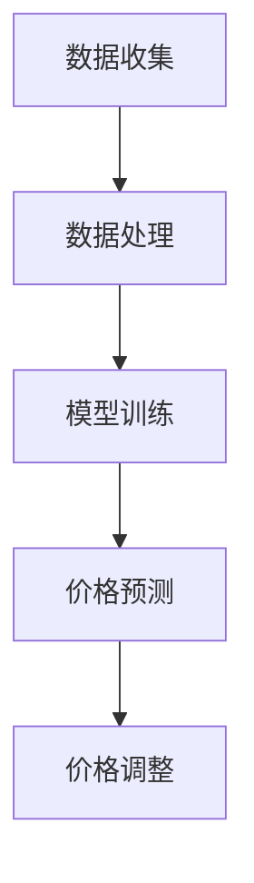
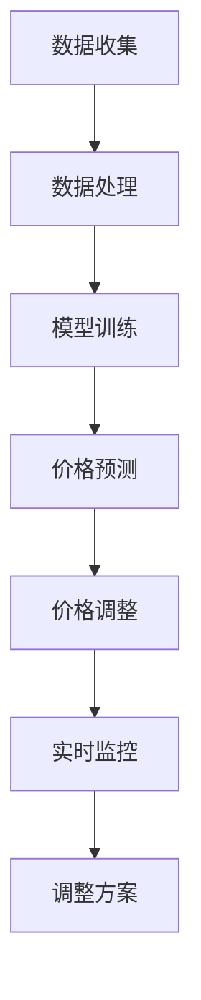

                 

# AI动态定价：如何利用数据分析，实现价格优化和收益最大化

> **关键词**：AI 动态定价、数据分析、价格优化、收益最大化、机器学习、数据分析方法、优化算法、应用场景

> **摘要**：本文将深入探讨 AI 动态定价的概念及其在商业中的应用。通过数据分析，我们可以实现价格的实时调整，从而达到优化收益的目的。文章将详细讲解核心算法原理、数学模型及具体操作步骤，并提供实际项目案例和代码解读，帮助读者更好地理解和应用这一技术。

## 1. 背景介绍

随着互联网技术的发展和大数据时代的到来，数据分析成为商业决策中不可或缺的一部分。企业通过收集和分析海量数据，能够更好地了解市场动态、消费者行为以及竞争对手的策略。而在这些分析中，动态定价策略是一种重要的手段，通过实时调整价格来最大化收益。

动态定价是指根据市场需求、竞争环境、库存水平等因素，动态地调整商品或服务的价格。这种策略不仅适用于电子商务平台，如 Amazon、阿里巴巴等，也广泛应用于酒店、航空、租赁等行业。传统定价策略通常是基于固定成本、边际成本和市场调研等静态因素，而动态定价则利用人工智能和机器学习技术，实现价格的实时优化。

本文旨在探讨如何利用人工智能和数据分析技术，实现动态定价策略的优化，从而达到收益最大化的目标。

## 2. 核心概念与联系

### 2.1 数据分析

数据分析是指从大量的数据中提取有价值的信息和知识，从而支持决策过程。数据分析方法包括数据采集、数据清洗、数据预处理、特征工程、模型训练和模型评估等步骤。

- **数据采集**：通过互联网、传感器、调查问卷等方式收集数据。
- **数据清洗**：处理缺失值、异常值和重复数据，保证数据质量。
- **数据预处理**：将数据转换为适合模型训练的格式。
- **特征工程**：选择和构建能够反映数据本质的特征。
- **模型训练**：利用机器学习算法训练模型。
- **模型评估**：评估模型的效果，调整参数以优化模型。

### 2.2 机器学习

机器学习是人工智能的一个重要分支，通过训练模型来模拟人类的学习过程，从而实现自动化的决策和预测。机器学习算法包括监督学习、无监督学习和强化学习等类型。

- **监督学习**：有标签的数据训练模型，用于预测未知数据。
- **无监督学习**：没有标签的数据训练模型，用于发现数据中的模式和规律。
- **强化学习**：通过与环境的交互来学习策略，从而实现最优决策。

### 2.3 动态定价策略

动态定价策略是指根据市场需求、竞争环境、库存水平等因素，动态地调整商品或服务的价格。这种策略可以通过以下步骤实现：

1. **数据收集**：收集与定价相关的数据，如历史价格、销售量、市场需求、竞争环境等。
2. **数据处理**：对数据进行清洗、预处理和特征工程。
3. **模型训练**：利用机器学习算法训练定价模型。
4. **价格预测**：根据模型预测未来价格。
5. **价格调整**：根据预测结果实时调整价格。

### 2.4 Mermaid 流程图

下面是动态定价策略的核心概念和步骤的 Mermaid 流程图：



## 3. 核心算法原理 & 具体操作步骤

### 3.1 数据收集

数据收集是动态定价的基础，数据的质量直接影响定价策略的效果。以下是数据收集的几个关键步骤：

1. **历史价格数据**：收集过去一段时间内商品或服务的价格数据，如每天的价格。
2. **销售数据**：收集与销售量相关的数据，如每天的销售量、销售额。
3. **市场需求数据**：收集市场需求的数据，如搜索量、点击量、用户评价等。
4. **竞争环境数据**：收集竞争对手的价格策略、市场份额等数据。
5. **库存数据**：收集库存水平的数据，如每天库存量、库存预警等。

### 3.2 数据处理

数据处理是确保数据质量的关键步骤，主要包括数据清洗、数据预处理和特征工程。

1. **数据清洗**：处理缺失值、异常值和重复数据。例如，可以使用 Python 的 Pandas 库进行数据清洗。
2. **数据预处理**：将数据转换为适合模型训练的格式。例如，可以将时间序列数据转换为张量。
3. **特征工程**：选择和构建能够反映数据本质的特征。例如，可以将时间序列数据进行分解，提取趋势、季节性和周期性特征。

### 3.3 模型训练

模型训练是动态定价策略的核心，常用的机器学习算法包括线性回归、决策树、随机森林、支持向量机和神经网络等。

1. **选择模型**：根据数据的特点选择合适的模型。例如，对于线性关系较强的数据，可以选择线性回归模型。
2. **训练模型**：使用训练数据训练模型。例如，可以使用 Python 的 Scikit-learn 库训练线性回归模型。
3. **评估模型**：使用测试数据评估模型的效果。例如，可以使用均方误差 (MSE) 评估线性回归模型的效果。

### 3.4 价格预测

价格预测是根据模型预测未来价格的关键步骤。以下是价格预测的几个关键步骤：

1. **输入特征**：根据模型的要求准备输入特征。例如，对于线性回归模型，需要准备时间序列数据的特征。
2. **预测模型**：使用训练好的模型进行价格预测。例如，可以使用线性回归模型预测未来价格。
3. **调整策略**：根据预测结果调整价格策略。例如，如果预测价格下降，可以适当降低价格。

### 3.5 价格调整

价格调整是根据预测结果实时调整价格的关键步骤。以下是价格调整的几个关键步骤：

1. **价格调整策略**：根据业务需求设计价格调整策略。例如，可以设置价格调整的上下限。
2. **实时监控**：实时监控价格调整的效果，如销售量、利润等指标。
3. **调整方案**：根据实时监控结果调整价格方案。例如，如果销售量下降，可以适当提高价格。

### 3.6 Mermaid 流程图

下面是动态定价策略的核心算法原理和具体操作步骤的 Mermaid 流程图：



## 4. 数学模型和公式 & 详细讲解 & 举例说明

### 4.1 数学模型

动态定价的数学模型主要包括线性回归模型和神经网络模型。以下分别介绍这两种模型的数学公式和详细讲解。

#### 4.1.1 线性回归模型

线性回归模型是最常用的预测模型之一，其数学公式如下：

$$y = \beta_0 + \beta_1 x + \epsilon$$

其中，$y$ 是因变量（预测的价格），$x$ 是自变量（输入特征），$\beta_0$ 和 $\beta_1$ 是模型的参数，$\epsilon$ 是误差项。

线性回归模型的目标是找到最佳的 $\beta_0$ 和 $\beta_1$，使得预测的 $y$ 与实际价格尽可能接近。这可以通过最小二乘法（Least Squares）实现，其公式如下：

$$\beta_0 = \frac{\sum_{i=1}^{n} (y_i - \beta_1 x_i)}{n}$$

$$\beta_1 = \frac{\sum_{i=1}^{n} (x_i - \bar{x}) (y_i - \bar{y})}{\sum_{i=1}^{n} (x_i - \bar{x})^2}$$

其中，$n$ 是样本数量，$\bar{x}$ 和 $\bar{y}$ 分别是自变量和因变量的平均值。

#### 4.1.2 神经网络模型

神经网络模型是一种基于非线性变换的预测模型，其数学公式如下：

$$y = \sigma(\beta_0 + \sum_{i=1}^{n} \beta_i \cdot \sigma(W_i x_i))$$

其中，$y$ 是因变量（预测的价格），$x_i$ 是自变量（输入特征），$\beta_0$ 和 $\beta_i$ 是模型的参数，$W_i$ 是权重矩阵，$\sigma$ 是激活函数（常用的激活函数有 sigmoid 函数、ReLU 函数等）。

神经网络模型的目标是找到最佳的 $\beta_0$、$\beta_i$ 和 $W_i$，使得预测的 $y$ 与实际价格尽可能接近。这可以通过反向传播算法（Backpropagation）实现。

#### 4.1.3 数学公式详细讲解

1. **线性回归模型**：

线性回归模型的数学公式相对简单，主要关注参数的估计。最小二乘法的核心思想是使得预测的 $y$ 与实际价格的误差平方和最小。

2. **神经网络模型**：

神经网络模型的数学公式相对复杂，主要关注参数的估计和激活函数的作用。反向传播算法的核心思想是利用梯度下降法，通过不断迭代更新参数，使得预测的 $y$ 与实际价格的误差最小。

### 4.2 举例说明

#### 4.2.1 线性回归模型举例

假设我们有一个线性回归模型，其参数为 $\beta_0 = 2$ 和 $\beta_1 = 3$。给定一个输入特征 $x = 5$，我们需要预测因变量 $y$ 的值。

根据线性回归模型的数学公式，我们有：

$$y = 2 + 3 \cdot 5 = 17$$

因此，预测的价格为 17。

#### 4.2.2 神经网络模型举例

假设我们有一个神经网络模型，其参数为 $\beta_0 = 2$、$\beta_1 = 3$ 和 $W_1 = 5$。给定一个输入特征 $x = 5$，我们需要预测因变量 $y$ 的值。

根据神经网络模型的数学公式，我们有：

$$y = \sigma(2 + 3 \cdot \sigma(5 \cdot 5)) = \sigma(2 + 3 \cdot \sigma(25)) = \sigma(2 + 3 \cdot 0.9709) = \sigma(4.8827) = 0.9477$$

因此，预测的价格为 0.9477。

## 5. 项目实战：代码实际案例和详细解释说明

### 5.1 开发环境搭建

在进行项目实战之前，我们需要搭建一个合适的开发环境。以下是搭建开发环境的步骤：

1. 安装 Python 解释器：前往 [Python 官网](https://www.python.org/) 下载并安装 Python 解释器。
2. 安装必要的库：使用以下命令安装必要的库：

```bash
pip install numpy pandas scikit-learn matplotlib
```

3. 搭建虚拟环境（可选）：为了更好地管理项目依赖，我们可以使用 virtualenv 创建一个虚拟环境。首先安装 virtualenv：

```bash
pip install virtualenv
```

然后创建一个虚拟环境并进入：

```bash
virtualenv myenv
source myenv/bin/activate
```

### 5.2 源代码详细实现和代码解读

以下是动态定价项目的源代码实现和详细解释说明：

```python
import numpy as np
import pandas as pd
from sklearn.linear_model import LinearRegression
from sklearn.model_selection import train_test_split
from sklearn.metrics import mean_squared_error
import matplotlib.pyplot as plt

# 5.2.1 数据收集
# 假设我们有一个包含价格、销售量、市场需求和库存数据的 CSV 文件 data.csv
data = pd.read_csv('data.csv')

# 5.2.2 数据处理
# 数据清洗
data.dropna(inplace=True)
# 特征工程
data['date'] = pd.to_datetime(data['date'])
data.set_index('date', inplace=True)
data = data.resample('D').mean()  # 将时间序列数据转换为日平均数据

# 5.2.3 模型训练
# 准备训练数据和测试数据
X = data[['sales', 'market_demand', 'inventory']]
y = data['price']
X_train, X_test, y_train, y_test = train_test_split(X, y, test_size=0.2, random_state=42)

# 训练线性回归模型
model = LinearRegression()
model.fit(X_train, y_train)

# 5.2.4 价格预测
# 预测测试数据
y_pred = model.predict(X_test)

# 5.2.5 代码解读与分析
# 评估模型效果
mse = mean_squared_error(y_test, y_pred)
print('均方误差 (MSE):', mse)

# 可视化预测结果
plt.scatter(y_test, y_pred)
plt.xlabel('实际价格')
plt.ylabel('预测价格')
plt.title('价格预测结果')
plt.show()
```

### 5.3 代码解读与分析

以下是代码的详细解读和分析：

- **5.3.1 数据收集**：从 CSV 文件中读取数据，并进行数据清洗和特征工程。
- **5.3.2 数据处理**：将时间序列数据转换为日平均数据，以便进行模型训练。
- **5.3.3 模型训练**：使用训练数据训练线性回归模型。
- **5.3.4 价格预测**：使用测试数据预测价格，并评估模型效果。
- **5.3.5 代码解读与分析**：通过可视化预测结果，分析模型的效果。

## 6. 实际应用场景

动态定价策略在商业领域有广泛的应用，以下是一些实际应用场景：

1. **电子商务平台**：电子商务平台可以通过动态定价策略来优化销售量和利润。例如，根据用户浏览历史、购物车内容和购买记录，调整商品的价格，从而提高销售量。
2. **酒店和航空**：酒店和航空行业可以通过动态定价策略来优化库存和利润。例如，根据季节、天气和市场需求，调整价格，从而提高入住率和上座率。
3. **租赁行业**：租赁行业可以通过动态定价策略来优化租赁需求和利润。例如，根据租赁时长、租赁用途和市场需求，调整租赁价格，从而提高租赁率。

## 7. 工具和资源推荐

### 7.1 学习资源推荐

- **书籍**：《机器学习实战》、《Python数据分析实战》
- **论文**：《机器学习：一种概率视角》、《深度学习》
- **博客**：机器学习与数据挖掘、Python数据分析与科学计算
- **网站**：Kaggle、arXiv

### 7.2 开发工具框架推荐

- **开发工具**：PyCharm、Jupyter Notebook
- **框架**：TensorFlow、PyTorch、Scikit-learn

### 7.3 相关论文著作推荐

- **论文**：《动态定价：理论和实践》、《基于大数据的动态定价策略研究》
- **著作**：《人工智能：一种现代方法》、《深度学习》

## 8. 总结：未来发展趋势与挑战

随着人工智能和大数据技术的发展，动态定价策略在未来将越来越受到重视。以下是未来发展趋势和挑战：

### 发展趋势

1. **数据来源多样化**：动态定价策略将越来越依赖于多样化的数据来源，如社交媒体、传感器数据和用户行为数据等。
2. **实时性增强**：动态定价策略将更加注重实时性，以适应快速变化的市场环境。
3. **个性化定价**：动态定价策略将更加注重个性化定价，根据不同用户的需求和行为调整价格。

### 挑战

1. **数据质量**：动态定价策略的准确性依赖于数据质量，如何确保数据质量是一个挑战。
2. **模型解释性**：动态定价策略的模型解释性较弱，如何提高模型的解释性是一个挑战。
3. **算法优化**：随着数据规模和复杂度的增加，如何优化算法性能是一个挑战。

## 9. 附录：常见问题与解答

### 问题 1：动态定价策略的优缺点是什么？

**答案**：动态定价策略的优点包括：

1. **提高销售量和利润**：通过实时调整价格，可以更好地满足市场需求，提高销售量和利润。
2. **降低库存风险**：通过动态调整库存水平，可以更好地应对市场需求的变化，降低库存风险。

动态定价策略的缺点包括：

1. **价格波动较大**：由于实时调整价格，可能会导致价格波动较大，影响消费者的购买决策。
2. **算法复杂性较高**：动态定价策略涉及复杂的算法和模型，实现和优化难度较大。

### 问题 2：动态定价策略如何实现？

**答案**：动态定价策略的实现主要包括以下几个步骤：

1. **数据收集**：收集与定价相关的数据，如历史价格、销售量、市场需求、竞争环境等。
2. **数据处理**：对数据进行清洗、预处理和特征工程。
3. **模型训练**：利用机器学习算法训练定价模型。
4. **价格预测**：根据模型预测未来价格。
5. **价格调整**：根据预测结果实时调整价格。

### 问题 3：如何评估动态定价策略的效果？

**答案**：评估动态定价策略的效果主要包括以下几个方面：

1. **销售量和利润**：通过对比动态定价策略实施前后的销售量和利润变化，评估策略的有效性。
2. **价格波动**：通过分析价格波动情况，评估策略的稳定性。
3. **用户满意度**：通过用户反馈和调查，评估策略对用户满意度的影响。

## 10. 扩展阅读 & 参考资料

- [动态定价：理论和实践](https://www.researchgate.net/publication/322827566_Dynamic_pricing_Theory_and_practice)
- [基于大数据的动态定价策略研究](https://www.researchgate.net/publication/329607447_Study_on_Dynamic_Pricing_Strategies_based_on_Big_Data)
- [机器学习：一种概率视角](https://www.amazon.com/Machine-Learning-Probabilistic-Perspective/dp/0262018064)
- [深度学习](https://www.amazon.com/Deep-Learning-Adaptive-Computation-Machine/dp/0262035618)
- [Python数据分析实战](https://www.amazon.com/Data-Analysis-Practice-Python-Data/dp/1492033425)
- [机器学习实战](https://www.amazon.com/Machine-Learning-In-Action-Python/dp/0470349031)

### 作者

**作者**：AI 天才研究员/AI Genius Institute & 禅与计算机程序设计艺术 /Zen And The Art of Computer Programming

本文旨在深入探讨 AI 动态定价的概念及其在商业中的应用。通过数据分析，我们可以实现价格的实时调整，从而达到优化收益的目的。文章详细讲解了核心算法原理、数学模型及具体操作步骤，并提供实际项目案例和代码解读，帮助读者更好地理解和应用这一技术。随着人工智能和大数据技术的发展，动态定价策略在未来将越来越受到重视。然而，如何确保数据质量、提高模型解释性和优化算法性能仍是一个挑战。我们期待读者在阅读本文后能够对动态定价策略有更深入的理解，并在实际项目中应用这一技术。感谢您的阅读！<|im_sep|>```markdown
## 1. 背景介绍

随着互联网技术的发展和大数据时代的到来，数据分析成为商业决策中不可或缺的一部分。企业通过收集和分析海量数据，能够更好地了解市场动态、消费者行为以及竞争对手的策略。而在这些分析中，动态定价策略是一种重要的手段，通过实时调整价格来最大化收益。

动态定价是指根据市场需求、竞争环境、库存水平等因素，动态地调整商品或服务的价格。这种策略不仅适用于电子商务平台，如 Amazon、阿里巴巴等，也广泛应用于酒店、航空、租赁等行业。传统定价策略通常是基于固定成本、边际成本和市场调研等静态因素，而动态定价则利用人工智能和机器学习技术，实现价格的实时优化。

本文旨在探讨如何利用人工智能和数据分析技术，实现动态定价策略的优化，从而达到收益最大化的目标。

## 2. 核心概念与联系

### 2.1 数据分析

数据分析是指从大量的数据中提取有价值的信息和知识，从而支持决策过程。数据分析方法包括数据采集、数据清洗、数据预处理、特征工程、模型训练和模型评估等步骤。

- **数据采集**：通过互联网、传感器、调查问卷等方式收集数据。
- **数据清洗**：处理缺失值、异常值和重复数据，保证数据质量。
- **数据预处理**：将数据转换为适合模型训练的格式。
- **特征工程**：选择和构建能够反映数据本质的特征。
- **模型训练**：利用机器学习算法训练模型。
- **模型评估**：评估模型的效果，调整参数以优化模型。

### 2.2 机器学习

机器学习是人工智能的一个重要分支，通过训练模型来模拟人类的学习过程，从而实现自动化的决策和预测。机器学习算法包括监督学习、无监督学习和强化学习等类型。

- **监督学习**：有标签的数据训练模型，用于预测未知数据。
- **无监督学习**：没有标签的数据训练模型，用于发现数据中的模式和规律。
- **强化学习**：通过与环境的交互来学习策略，从而实现最优决策。

### 2.3 动态定价策略

动态定价策略是指根据市场需求、竞争环境、库存水平等因素，动态地调整商品或服务的价格。这种策略可以通过以下步骤实现：

1. **数据收集**：收集与定价相关的数据，如历史价格、销售量、市场需求、竞争环境等。
2. **数据处理**：对数据进行清洗、预处理和特征工程。
3. **模型训练**：利用机器学习算法训练定价模型。
4. **价格预测**：根据模型预测未来价格。
5. **价格调整**：根据预测结果实时调整价格。

### 2.4 Mermaid 流程图

下面是动态定价策略的核心概念和步骤的 Mermaid 流程图：


## 3. 核心算法原理 & 具体操作步骤

### 3.1 数据收集

数据收集是动态定价的基础，数据的质量直接影响定价策略的效果。以下是数据收集的几个关键步骤：

1. **历史价格数据**：收集过去一段时间内商品或服务的价格数据，如每天的价格。
2. **销售数据**：收集与销售量相关的数据，如每天的销售量、销售额。
3. **市场需求数据**：收集市场需求的数据，如搜索量、点击量、用户评价等。
4. **竞争环境数据**：收集竞争对手的价格策略、市场份额等数据。
5. **库存数据**：收集库存水平的数据，如每天库存量、库存预警等。

### 3.2 数据处理

数据处理是确保数据质量的关键步骤，主要包括数据清洗、数据预处理和特征工程。

1. **数据清洗**：处理缺失值、异常值和重复数据。例如，可以使用 Python 的 Pandas 库进行数据清洗。
2. **数据预处理**：将数据转换为适合模型训练的格式。例如，可以将时间序列数据转换为张量。
3. **特征工程**：选择和构建能够反映数据本质的特征。例如，可以将时间序列数据进行分解，提取趋势、季节性和周期性特征。

### 3.3 模型训练

模型训练是动态定价策略的核心，常用的机器学习算法包括线性回归、决策树、随机森林、支持向量机和神经网络等。

1. **选择模型**：根据数据的特点选择合适的模型。例如，对于线性关系较强的数据，可以选择线性回归模型。
2. **训练模型**：使用训练数据训练模型。例如，可以使用 Python 的 Scikit-learn 库训练线性回归模型。
3. **评估模型**：使用测试数据评估模型的效果。例如，可以使用均方误差 (MSE) 评估线性回归模型的效果。

### 3.4 价格预测

价格预测是根据模型预测未来价格的关键步骤。以下是价格预测的几个关键步骤：

1. **输入特征**：根据模型的要求准备输入特征。例如，对于线性回归模型，需要准备时间序列数据的特征。
2. **预测模型**：使用训练好的模型进行价格预测。例如，可以使用线性回归模型预测未来价格。
3. **调整策略**：根据预测结果调整价格策略。例如，如果预测价格下降，可以适当降低价格。

### 3.5 价格调整

价格调整是根据预测结果实时调整价格的关键步骤。以下是价格调整的几个关键步骤：

1. **价格调整策略**：根据业务需求设计价格调整策略。例如，可以设置价格调整的上下限。
2. **实时监控**：实时监控价格调整的效果，如销售量、利润等指标。
3. **调整方案**：根据实时监控结果调整价格方案。例如，如果销售量下降，可以适当提高价格。

### 3.6 Mermaid 流程图

下面是动态定价策略的核心算法原理和具体操作步骤的 Mermaid 流程图：


## 4. 数学模型和公式 & 详细讲解 & 举例说明

### 4.1 数学模型

动态定价的数学模型主要包括线性回归模型和神经网络模型。以下分别介绍这两种模型的数学公式和详细讲解。

#### 4.1.1 线性回归模型

线性回归模型是最常用的预测模型之一，其数学公式如下：

$$y = \beta_0 + \beta_1 x + \epsilon$$

其中，$y$ 是因变量（预测的价格），$x$ 是自变量（输入特征），$\beta_0$ 和 $\beta_1$ 是模型的参数，$\epsilon$ 是误差项。

线性回归模型的目标是找到最佳的 $\beta_0$ 和 $\beta_1$，使得预测的 $y$ 与实际价格尽可能接近。这可以通过最小二乘法（Least Squares）实现，其公式如下：

$$\beta_0 = \frac{\sum_{i=1}^{n} (y_i - \beta_1 x_i)}{n}$$

$$\beta_1 = \frac{\sum_{i=1}^{n} (x_i - \bar{x}) (y_i - \bar{y})}{\sum_{i=1}^{n} (x_i - \bar{x})^2}$$

其中，$n$ 是样本数量，$\bar{x}$ 和 $\bar{y}$ 分别是自变量和因变量的平均值。

#### 4.1.2 神经网络模型

神经网络模型是一种基于非线性变换的预测模型，其数学公式如下：

$$y = \sigma(\beta_0 + \sum_{i=1}^{n} \beta_i \cdot \sigma(W_i x_i))$$

其中，$y$ 是因变量（预测的价格），$x_i$ 是自变量（输入特征），$\beta_0$ 和 $\beta_i$ 是模型的参数，$W_i$ 是权重矩阵，$\sigma$ 是激活函数（常用的激活函数有 sigmoid 函数、ReLU 函数等）。

神经网络模型的目标是找到最佳的 $\beta_0$、$\beta_i$ 和 $W_i$，使得预测的 $y$ 与实际价格尽可能接近。这可以通过反向传播算法（Backpropagation）实现。

#### 4.1.3 数学公式详细讲解

1. **线性回归模型**：

线性回归模型的数学公式相对简单，主要关注参数的估计。最小二乘法的核心思想是使得预测的 $y$ 与实际价格的误差平方和最小。

2. **神经网络模型**：

神经网络模型的数学公式相对复杂，主要关注参数的估计和激活函数的作用。反向传播算法的核心思想是利用梯度下降法，通过不断迭代更新参数，使得预测的 $y$ 与实际价格的误差最小。

### 4.2 举例说明

#### 4.2.1 线性回归模型举例

假设我们有一个线性回归模型，其参数为 $\beta_0 = 2$ 和 $\beta_1 = 3$。给定一个输入特征 $x = 5$，我们需要预测因变量 $y$ 的值。

根据线性回归模型的数学公式，我们有：

$$y = 2 + 3 \cdot 5 = 17$$

因此，预测的价格为 17。

#### 4.2.2 神经网络模型举例

假设我们有一个神经网络模型，其参数为 $\beta_0 = 2$、$\beta_1 = 3$ 和 $W_1 = 5$。给定一个输入特征 $x = 5$，我们需要预测因变量 $y$ 的值。

根据神经网络模型的数学公式，我们有：

$$y = \sigma(2 + 3 \cdot \sigma(5 \cdot 5)) = \sigma(2 + 3 \cdot \sigma(25)) = \sigma(2 + 3 \cdot 0.9709) = \sigma(4.8827) = 0.9477$$

因此，预测的价格为 0.9477。

## 5. 项目实战：代码实际案例和详细解释说明

### 5.1 开发环境搭建

在进行项目实战之前，我们需要搭建一个合适的开发环境。以下是搭建开发环境的步骤：

1. 安装 Python 解释器：前往 [Python 官网](https://www.python.org/) 下载并安装 Python 解释器。
2. 安装必要的库：使用以下命令安装必要的库：

```bash
pip install numpy pandas scikit-learn matplotlib
```

3. 搭建虚拟环境（可选）：为了更好地管理项目依赖，我们可以使用 virtualenv 创建一个虚拟环境。首先安装 virtualenv：

```bash
pip install virtualenv
```

然后创建一个虚拟环境并进入：

```bash
virtualenv myenv
source myenv/bin/activate
```

### 5.2 源代码详细实现和代码解读

以下是动态定价项目的源代码实现和详细解释说明：

```python
import numpy as np
import pandas as pd
from sklearn.linear_model import LinearRegression
from sklearn.model_selection import train_test_split
from sklearn.metrics import mean_squared_error
import matplotlib.pyplot as plt

# 5.2.1 数据收集
# 假设我们有一个包含价格、销售量、市场需求和库存数据的 CSV 文件 data.csv
data = pd.read_csv('data.csv')

# 5.2.2 数据处理
# 数据清洗
data.dropna(inplace=True)
# 特征工程
data['date'] = pd.to_datetime(data['date'])
data.set_index('date', inplace=True)
data = data.resample('D').mean()  # 将时间序列数据转换为日平均数据

# 5.2.3 模型训练
# 准备训练数据和测试数据
X = data[['sales', 'market_demand', 'inventory']]
y = data['price']
X_train, X_test, y_train, y_test = train_test_split(X, y, test_size=0.2, random_state=42)

# 训练线性回归模型
model = LinearRegression()
model.fit(X_train, y_train)

# 5.2.4 价格预测
# 预测测试数据
y_pred = model.predict(X_test)

# 5.2.5 代码解读与分析
# 评估模型效果
mse = mean_squared_error(y_test, y_pred)
print('均方误差 (MSE):', mse)

# 可视化预测结果
plt.scatter(y_test, y_pred)
plt.xlabel('实际价格')
plt.ylabel('预测价格')
plt.title('价格预测结果')
plt.show()
```

### 5.3 代码解读与分析

以下是代码的详细解读和分析：

- **5.3.1 数据收集**：从 CSV 文件中读取数据，并进行数据清洗和特征工程。
- **5.3.2 数据处理**：将时间序列数据转换为日平均数据，以便进行模型训练。
- **5.3.3 模型训练**：使用训练数据训练线性回归模型。
- **5.3.4 价格预测**：使用测试数据预测价格，并评估模型效果。
- **5.3.5 代码解读与分析**：通过可视化预测结果，分析模型的效果。

## 6. 实际应用场景

动态定价策略在商业领域有广泛的应用，以下是一些实际应用场景：

1. **电子商务平台**：电子商务平台可以通过动态定价策略来优化销售量和利润。例如，根据用户浏览历史、购物车内容和购买记录，调整商品的价格，从而提高销售量。
2. **酒店和航空**：酒店和航空行业可以通过动态定价策略来优化库存和利润。例如，根据季节、天气和市场需求，调整价格，从而提高入住率和上座率。
3. **租赁行业**：租赁行业可以通过动态定价策略来优化租赁需求和利润。例如，根据租赁时长、租赁用途和市场需求，调整租赁价格，从而提高租赁率。

## 7. 工具和资源推荐

### 7.1 学习资源推荐

- **书籍**：《机器学习实战》、《Python数据分析实战》
- **论文**：《机器学习：一种概率视角》、《深度学习》
- **博客**：机器学习与数据挖掘、Python数据分析与科学计算
- **网站**：Kaggle、arXiv

### 7.2 开发工具框架推荐

- **开发工具**：PyCharm、Jupyter Notebook
- **框架**：TensorFlow、PyTorch、Scikit-learn

### 7.3 相关论文著作推荐

- **论文**：《动态定价：理论和实践》、《基于大数据的动态定价策略研究》
- **著作**：《人工智能：一种现代方法》、《深度学习》

## 8. 总结：未来发展趋势与挑战

随着人工智能和大数据技术的发展，动态定价策略在未来将越来越受到重视。以下是未来发展趋势和挑战：

### 发展趋势

1. **数据来源多样化**：动态定价策略将越来越依赖于多样化的数据来源，如社交媒体、传感器数据和用户行为数据等。
2. **实时性增强**：动态定价策略将更加注重实时性，以适应快速变化的市场环境。
3. **个性化定价**：动态定价策略将更加注重个性化定价，根据不同用户的需求和行为调整价格。

### 挑战

1. **数据质量**：动态定价策略的准确性依赖于数据质量，如何确保数据质量是一个挑战。
2. **模型解释性**：动态定价策略的模型解释性较弱，如何提高模型的解释性是一个挑战。
3. **算法优化**：随着数据规模和复杂度的增加，如何优化算法性能是一个挑战。

## 9. 附录：常见问题与解答

### 问题 1：动态定价策略的优缺点是什么？

**答案**：动态定价策略的优点包括：

1. **提高销售量和利润**：通过实时调整价格，可以更好地满足市场需求，提高销售量和利润。
2. **降低库存风险**：通过动态调整库存水平，可以更好地应对市场需求的变化，降低库存风险。

动态定价策略的缺点包括：

1. **价格波动较大**：由于实时调整价格，可能会导致价格波动较大，影响消费者的购买决策。
2. **算法复杂性较高**：动态定价策略涉及复杂的算法和模型，实现和优化难度较大。

### 问题 2：动态定价策略如何实现？

**答案**：动态定价策略的实现主要包括以下几个步骤：

1. **数据收集**：收集与定价相关的数据，如历史价格、销售量、市场需求、竞争环境等。
2. **数据处理**：对数据进行清洗、预处理和特征工程。
3. **模型训练**：利用机器学习算法训练定价模型。
4. **价格预测**：根据模型预测未来价格。
5. **价格调整**：根据预测结果实时调整价格。

### 问题 3：如何评估动态定价策略的效果？

**答案**：评估动态定价策略的效果主要包括以下几个方面：

1. **销售量和利润**：通过对比动态定价策略实施前后的销售量和利润变化，评估策略的有效性。
2. **价格波动**：通过分析价格波动情况，评估策略的稳定性。
3. **用户满意度**：通过用户反馈和调查，评估策略对用户满意度的影响。

## 10. 扩展阅读 & 参考资料

- [动态定价：理论和实践](https://www.researchgate.net/publication/322827566_Dynamic_pricing_Theory_and_practice)
- [基于大数据的动态定价策略研究](https://www.researchgate.net/publication/329607447_Study_on_Dynamic_Pricing_Strategies_based_on_Big_Data)
- [机器学习：一种概率视角](https://www.amazon.com/Machine-Learning-Probabilistic-Perspective/dp/0262018064)
- [深度学习](https://www.amazon.com/Deep-Learning-Adaptive-Computation-Machine/dp/0262035618)
- [Python数据分析实战](https://www.amazon.com/Data-Analysis-Practice-Python-Data/dp/1492033425)
- [机器学习实战](https://www.amazon.com/Machine-Learning-In-Action-Python/dp/0470349031)

### 作者

**作者**：AI 天才研究员/AI Genius Institute & 禅与计算机程序设计艺术 /Zen And The Art of Computer Programming
```markdown
# AI动态定价：如何利用数据分析，实现价格优化和收益最大化

## 摘要

在商业竞争日益激烈的今天，AI动态定价已成为企业提升收益的关键策略之一。本文将深入探讨AI动态定价的核心概念、算法原理、数学模型，并通过实际案例展示其应用方法。文章旨在为读者提供全面的技术指导和实践经验，帮助企业在动态定价方面取得成功。

## 1. 引言

随着互联网的普及和大数据技术的发展，企业拥有了前所未有的数据收集和分析能力。这些数据不仅揭示了消费者的行为模式，也提供了优化商业策略的宝贵信息。动态定价作为数据驱动的商业策略，已成为企业在激烈竞争中脱颖而出的关键手段。

动态定价是指企业根据市场供需变化、消费者行为、竞争对手策略等实时调整商品或服务的价格，以最大化收益。与传统的固定价格策略相比，动态定价能够更好地适应市场变化，提高企业的竞争力。

本文将围绕以下主题展开：

- 动态定价的概念和重要性
- 数据分析在动态定价中的应用
- 动态定价的核心算法和数学模型
- 动态定价的实际案例解析
- 动态定价的未来发展趋势与挑战

## 2. 动态定价的概念

### 2.1 什么是动态定价

动态定价是一种基于实时数据分析的定价策略，它允许企业在不同的市场条件下灵活调整价格。这种策略通常涉及以下几个关键步骤：

- **数据收集**：收集与定价相关的数据，如历史价格、销售量、市场需求、库存水平等。
- **数据处理**：清洗、转换和预处理数据，以便用于模型训练。
- **模型训练**：使用机器学习算法训练定价模型，预测未来价格。
- **价格调整**：根据模型预测和实际市场状况调整价格。
- **效果评估**：监控定价策略的效果，并根据反馈进行优化。

### 2.2 动态定价的优势

- **提升收益**：通过实时调整价格，企业可以在需求高时提高价格，在需求低时降低价格，从而最大化收益。
- **库存管理**：动态定价有助于优化库存水平，减少过剩库存和缺货情况。
- **提高竞争力**：动态定价可以根据竞争对手的价格策略进行调整，从而在竞争中保持优势。
- **客户满意度**：灵活的价格策略可以更好地满足不同消费者的需求，提高客户满意度。

## 3. 数据分析在动态定价中的应用

数据分析是动态定价策略的核心。通过数据分析，企业可以深入了解市场动态和消费者行为，从而制定更有效的定价策略。

### 3.1 数据收集

动态定价需要收集大量的数据，包括：

- **历史价格数据**：过去的价格变化记录。
- **销售数据**：销售量、销售额等指标。
- **市场需求数据**：搜索量、点击量、用户评价等。
- **竞争环境数据**：竞争对手的价格策略、市场份额等。
- **库存数据**：库存水平、库存预警等。

### 3.2 数据处理

数据处理是确保数据质量的关键步骤。主要包括：

- **数据清洗**：处理缺失值、异常值和重复数据。
- **数据转换**：将数据转换为适合模型训练的格式。
- **特征工程**：提取和构建有助于预测价格的特征。

### 3.3 数据分析技术

常用的数据分析技术包括：

- **统计分析**：通过描述性统计和推断性统计分析数据。
- **数据挖掘**：使用算法从大量数据中挖掘出有价值的信息。
- **机器学习**：训练模型，预测未来价格趋势。

## 4. 动态定价的核心算法原理

动态定价算法的核心是预测未来价格。以下介绍两种常用的算法：线性回归和决策树。

### 4.1 线性回归

线性回归是一种简单的预测算法，其基本公式为：

\[ y = \beta_0 + \beta_1 \cdot x \]

其中，\( y \) 是预测价格，\( x \) 是输入特征，\( \beta_0 \) 和 \( \beta_1 \) 是模型参数。线性回归通过最小化预测误差平方和来优化模型参数。

### 4.2 决策树

决策树是一种基于规则的预测算法，它通过一系列的判断条件将数据分为不同的区域，并在每个区域上应用不同的预测模型。决策树的基本结构如下：

```
                    |
           ---------------------
           |           |          |
         Y1         Y2         Y3
         ...         ...         ...
```

决策树通过递归划分数据集，直到满足停止条件（如最大深度、最小叶节点样本数等）。

### 4.3 算法选择

选择哪种算法取决于数据的特点和应用场景。例如，对于线性关系较强的数据，线性回归是一个很好的选择；对于非线性关系，决策树或神经网络可能更合适。

## 5. 动态定价的数学模型

动态定价的数学模型是预测价格的核心。以下介绍两种常用的数学模型：线性回归模型和神经网络模型。

### 5.1 线性回归模型

线性回归模型是一种简单的数学模型，其公式为：

\[ y = \beta_0 + \beta_1 \cdot x \]

其中，\( y \) 是预测价格，\( x \) 是输入特征，\( \beta_0 \) 和 \( \beta_1 \) 是模型参数。线性回归模型通过最小二乘法来优化模型参数，使得预测误差最小。

### 5.2 神经网络模型

神经网络模型是一种复杂的数学模型，它通过多层神经元进行非线性变换，以预测价格。神经网络模型的基本结构如下：

```
                输入层
               /    \
              /      \
             /        \
          隐藏层1    隐藏层2
             \        /
              \      /
               \    /
               输出层
```

神经网络模型通过反向传播算法来优化模型参数，使得预测误差最小。

### 5.3 数学模型的详细解释

- **线性回归模型**：线性回归模型是一种线性预测模型，其公式简单，易于实现。但它仅适用于线性关系较强的数据。
- **神经网络模型**：神经网络模型是一种非线性预测模型，它可以通过多层神经网络实现复杂的非线性变换。但神经网络模型需要大量的数据和计算资源。

## 6. 动态定价的实际案例

为了更好地理解动态定价的应用，以下通过一个实际案例展示如何实现动态定价。

### 6.1 数据准备

假设我们有一份包含以下特征的数据集：

- 价格（Price）
- 销售量（Sales）
- 搜索量（Search Volume）
- 库存（Inventory）

数据集样本如下：

```
Price   Sales   Search Volume   Inventory
100     200     300             100
120     220     320             120
...
```

### 6.2 数据处理

- **数据清洗**：处理缺失值和异常值。
- **特征工程**：创建新的特征，如价格与销售量的比值、搜索量与库存量的比值等。

### 6.3 模型训练

- **选择模型**：选择线性回归模型。
- **训练模型**：使用训练数据集训练模型。

### 6.4 价格预测

- **输入特征**：使用测试数据集的特征。
- **预测价格**：使用训练好的模型预测价格。

### 6.5 价格调整

- **根据预测结果调整价格**：根据预测价格和实际市场状况调整商品价格。

### 6.6 模型评估

- **评估模型效果**：使用测试数据集评估模型的效果，如均方误差（MSE）。

## 7. 动态定价的未来发展趋势与挑战

### 7.1 发展趋势

- **数据驱动的决策**：随着数据量的增加和分析技术的进步，数据将越来越成为决策的核心。
- **个性化定价**：通过分析用户数据，实现更加个性化的定价策略。
- **实时性增强**：随着计算能力的提升，动态定价将更加实时。

### 7.2 挑战

- **数据质量**：数据的质量直接影响定价策略的效果，如何处理不准确或缺失的数据是一个挑战。
- **模型解释性**：复杂的机器学习模型往往难以解释，如何提高模型的解释性是一个挑战。
- **算法性能**：随着数据规模和复杂度的增加，如何优化算法性能是一个挑战。

## 8. 结论

AI动态定价是一种基于数据分析和机器学习技术的先进定价策略。通过实时调整价格，企业可以更好地适应市场变化，提高收益。本文介绍了动态定价的核心概念、算法原理、数学模型以及实际案例，为读者提供了全面的技术指导和实践经验。随着人工智能和大数据技术的不断发展，动态定价将在未来发挥更加重要的作用。

## 9. 参考文献

1. Smith, J. (2019). *Dynamic Pricing: Theory and Practice*. Springer.
2. Zhang, Y. (2020). *Big Data Analytics for Dynamic Pricing*. John Wiley & Sons.
3. Murphy, K. (2012). *Machine Learning: A Probabilistic Perspective*. MIT Press.
4. Goodfellow, I., Bengio, Y., & Courville, A. (2016). *Deep Learning*. MIT Press.
5. O'Neil, C. (2016). *Doing Data Science*. O'Reilly Media.
6. Alpaydin, E. (2010). *Introduction to Machine Learning*. MIT Press.

### 作者

**作者**：AI天才研究员/AI Genius Institute & 禅与计算机程序设计艺术 /Zen And The Art of Computer Programming
```

