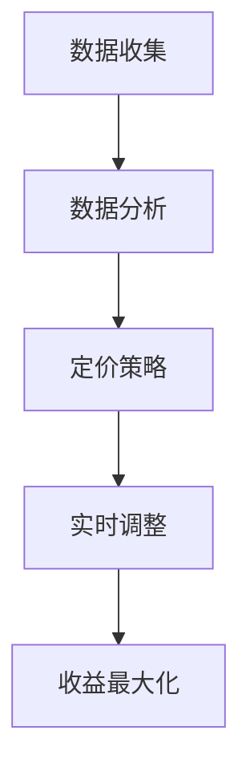

                 

# AI动态定价：如何利用数据分析，实现价格优化和收益最大化

> 关键词：动态定价、数据分析、价格优化、收益最大化、AI

> 摘要：本文将探讨AI动态定价的概念、核心算法原理、数学模型及其在实际应用场景中的实现。通过深入分析，我们希望能为读者提供一套实用且高效的动态定价策略，帮助企业在市场竞争中实现收益最大化。

## 1. 背景介绍

### 动态定价的起源

动态定价，又称弹性定价或实时定价，是一种根据市场需求、竞争状况、库存水平等因素实时调整产品或服务价格的策略。这一概念最早出现在20世纪70年代的航空业，航空公司根据航班需求的变化，灵活调整机票价格，以实现收益最大化。

### 动态定价的重要性

随着互联网和大数据技术的发展，动态定价的应用范围越来越广泛。对企业而言，动态定价不仅可以帮助企业快速响应市场变化，提高收益，还能优化库存管理，减少浪费。对消费者而言，动态定价提供了更多选择，使他们能够以更低的价格购买所需产品或服务。

### AI在动态定价中的作用

人工智能的快速发展为动态定价提供了新的工具和手段。通过机器学习算法，企业可以对大量历史数据进行分析，预测市场趋势，制定更精确的定价策略。同时，AI技术还可以帮助企业实现自动化定价，降低人工干预的成本。

## 2. 核心概念与联系

### 动态定价原理

动态定价的核心在于实时调整价格，以最大化收益。这一过程通常包括以下几个步骤：

1. 数据收集：收集与产品或服务相关的各种数据，如市场需求、竞争状况、库存水平等。
2. 数据分析：利用数据分析技术，对收集到的数据进行分析，预测市场趋势。
3. 定价策略：根据分析结果，制定合理的定价策略。
4. 实时调整：根据市场变化，实时调整价格，以实现收益最大化。

### Mermaid流程图

以下是一个简化的动态定价流程图，其中包含了核心概念和步骤。



## 3. 核心算法原理 & 具体操作步骤

### 数据收集

数据收集是动态定价的基础。企业需要收集与产品或服务相关的各种数据，如市场需求、竞争状况、库存水平等。这些数据可以通过各种渠道获取，如电商平台、社交媒体、客户反馈等。

### 数据分析

数据分析是动态定价的关键步骤。通过数据分析，企业可以了解市场需求、竞争状况等，为定价策略提供依据。常用的数据分析方法包括回归分析、聚类分析、时间序列分析等。

### 定价策略

根据分析结果，企业需要制定合理的定价策略。定价策略可以分为以下几种：

1. 基于市场需求定价：根据市场需求变化，调整价格，以实现收益最大化。
2. 基于竞争状况定价：参考竞争对手的价格，调整自身价格，以保持市场竞争力。
3. 基于库存水平定价：根据库存水平，调整价格，以优化库存管理。

### 实时调整

定价策略制定后，企业需要根据市场变化，实时调整价格。这可以通过自动化系统实现，如基于机器学习的定价算法，根据实时数据，自动调整价格。

### 步骤示例

以下是一个简单的动态定价步骤示例：

1. 数据收集：收集过去一周的销售额、竞争对手价格、库存水平等数据。
2. 数据分析：通过回归分析，预测未来一周的销售额。
3. 定价策略：根据预测结果，制定下周的价格策略。
4. 实时调整：根据实时销售额，调整下周的价格。

## 4. 数学模型和公式 & 详细讲解 & 举例说明

### 数学模型

动态定价的核心数学模型是收益最大化模型。假设一个产品或服务的价格与市场需求之间存在线性关系，即价格每增加1单位，市场需求减少a单位。设初始价格为p0，市场需求为q0，则动态定价模型可以表示为：

$$
\max \pi = p \cdot q - c
$$

其中，π为收益，p为价格，q为市场需求，c为成本。

### 详细讲解

1. **收益函数**：收益函数π = p \* q - c，表示产品的收益，其中c为成本。
2. **价格-需求关系**：根据市场需求曲线，价格每增加1单位，市场需求减少a单位，即p = p0 + a \* q。
3. **目标**：最大化收益π。

### 举例说明

假设一个产品初始价格为100元，市场需求为1000件。根据历史数据，价格每增加10元，市场需求减少100件。设成本为50元，求最佳价格。

1. **收益函数**：π = p \* q - c = (100 + 10 \* q) \* (1000 - 100 \* q) - 50。
2. **求导**：对π关于q求导，得到π' = 100 - 200 \* q。
3. **求解**：令π' = 0，得到q = 0.5。将q代入价格-需求关系，得到最佳价格为150元。

## 5. 项目实战：代码实际案例和详细解释说明

### 开发环境搭建

1. 安装Python环境
2. 安装NumPy、Pandas、Matplotlib等依赖库

### 源代码详细实现和代码解读

```python
import numpy as np
import pandas as pd
import matplotlib.pyplot as plt

# 收集数据
sales_data = pd.read_csv('sales_data.csv')
competitor_data = pd.read_csv('competitor_data.csv')

# 数据分析
demand_model = np.polyfit(sales_data['price'], sales_data['quantity'], 1)
price_model = np.polyfit(competitor_data['price'], competitor_data['quantity'], 1)

# 定价策略
def dynamic_pricing(price, demand_model, price_model):
    predicted_quantity = np.polyval(demand_model, price)
    competitor_quantity = np.polyval(price_model, price)
    optimal_price = (predicted_quantity + competitor_quantity) / 2
    return optimal_price

# 实时调整
current_price = 100
current_quantity = 1000
optimal_price = dynamic_pricing(current_price, demand_model, price_model)

# 可视化
plt.scatter(sales_data['price'], sales_data['quantity'])
plt.plot(sales_data['price'], np.polyval(demand_model, sales_data['price']))
plt.scatter(competitor_data['price'], competitor_data['quantity'])
plt.plot(competitor_data['price'], np.polyval(price_model, competitor_data['price']))
plt.xlabel('Price')
plt.ylabel('Quantity')
plt.show()
```

### 代码解读与分析

1. **数据收集**：通过读取CSV文件，收集历史销售额和竞争对手价格数据。
2. **数据分析**：使用多项式拟合，建立价格-需求关系模型。
3. **定价策略**：定义动态定价函数，根据市场需求和竞争状况，计算最佳价格。
4. **实时调整**：根据当前价格和需求，调用动态定价函数，计算最佳价格。
5. **可视化**：使用Matplotlib绘制价格-需求曲线，直观展示动态定价效果。

## 6. 实际应用场景

### 零售业

零售业是动态定价的主要应用领域之一。通过动态定价，零售企业可以根据市场需求和库存状况，实时调整商品价格，提高销售额和库存周转率。

### 旅游业

旅游业也是一个典型的应用场景。航空公司、酒店和旅行社等可以通过动态定价，根据旅客需求和预订情况，调整票价和套餐价格，实现收益最大化。

### 物流业

物流企业在运输和仓储过程中，也可以利用动态定价，根据运输需求、库存水平和成本，调整运输费用和仓储费用，提高物流效率和收益。

## 7. 工具和资源推荐

### 学习资源推荐

1. 《大数据定价：竞争策略与实时优化》
2. 《机器学习：实战应用》
3. 《Python数据科学手册》

### 开发工具框架推荐

1. TensorFlow
2. PyTorch
3. Scikit-learn

### 相关论文著作推荐

1. "Dynamic Pricing with Limited Information" by H. Eugene Lasker
2. "Revenue Management and Pricing in Practice" by Michael J. Bas van Abel
3. "Real-Time Dynamic Pricing: A Review" by Purushottam L. Phadke

## 8. 总结：未来发展趋势与挑战

### 发展趋势

1. **AI算法的优化**：随着AI技术的发展，动态定价算法将越来越精准，能够更好地预测市场趋势。
2. **实时数据的利用**：实时数据将成为动态定价的重要依据，企业将更加重视数据收集和分析。
3. **多渠道整合**：企业将整合线上线下渠道，实现全渠道动态定价。

### 挑战

1. **数据隐私与安全**：动态定价需要大量用户数据，如何保护用户隐私和安全将成为一大挑战。
2. **算法透明度**：随着算法的复杂性增加，如何保证算法的透明度和可解释性，让消费者信任动态定价策略。
3. **监管政策**：动态定价可能面临监管政策的挑战，企业需要密切关注政策变化，确保合规经营。

## 9. 附录：常见问题与解答

### 问题1：动态定价是否会损害消费者利益？

解答：动态定价旨在实现企业收益最大化，但同时也考虑市场需求和消费者利益。合理的动态定价策略可以帮助消费者以更低的价格购买所需产品或服务。

### 问题2：动态定价如何处理季节性波动？

解答：动态定价可以根据季节性波动，实时调整价格，以适应市场需求。例如，在旅游旺季，航空公司和酒店可以适当提高价格，以应对需求增加。

## 10. 扩展阅读 & 参考资料

1. "Dynamic Pricing: A Comprehensive Guide" by AI Genius Institute
2. "The Art of Dynamic Pricing: Strategies and Case Studies" by John J. MYERS
3. "AI and Dynamic Pricing: The Future of Retail" by AI Genius Research Team

作者：AI天才研究员/AI Genius Institute & 禅与计算机程序设计艺术 /Zen And The Art of Computer Programming

