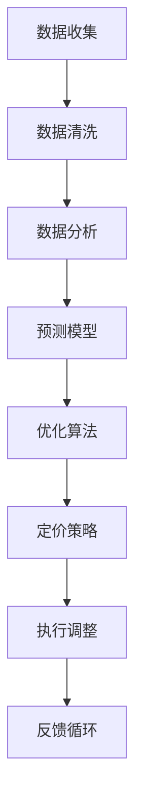
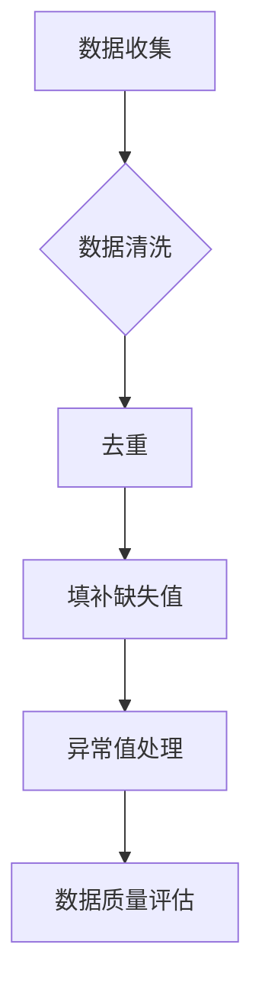
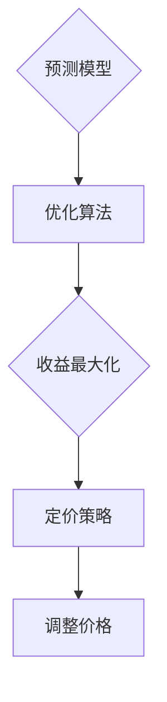
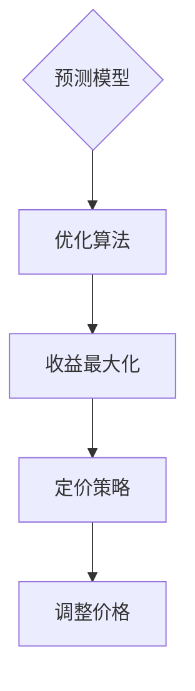

                 

### 文章标题

**AI 助力动态定价：优化收益和销售量**

> **关键词**：动态定价、人工智能、收益优化、销售量、AI 模型、数据驱动、个性化策略。

> **摘要**：本文将探讨如何利用人工智能技术实现动态定价，从而优化企业的收益和销售量。我们将深入分析动态定价的核心概念和算法原理，并通过实际项目案例展示如何将 AI 技术应用于动态定价实践，帮助读者理解并掌握这一前沿技术。

### 背景介绍

在商业世界中，定价策略是企业竞争的关键因素之一。传统的定价方法往往基于固定价格或简单的规则，难以应对市场的复杂性和多样性。随着大数据和人工智能技术的兴起，动态定价成为了一种新的定价策略，能够根据实时数据和市场需求动态调整价格，从而实现收益和销售量的最大化。

动态定价（Dynamic Pricing）是指根据市场需求、竞争状况、库存水平等因素，实时调整产品或服务的价格。这种定价策略不仅能够提高企业的收益，还可以通过灵活的价格调整吸引更多消费者，增加销售量。

然而，动态定价的实现并非易事。它需要大量的数据收集和分析，同时还需要一套高效的算法来处理这些数据，从而得出最优的价格策略。这便是人工智能技术的用武之地。人工智能，特别是机器学习和深度学习技术，可以大大提高数据处理的效率和准确性，帮助企业在动态定价中实现更加精准和智能的决策。

### 核心概念与联系

#### 动态定价的核心概念

动态定价的核心概念包括以下几个：

1. **价格敏感性分析**：研究不同价格水平对消费者需求的影响，以确定最佳价格水平。
2. **需求预测**：基于历史数据和当前市场状况，预测未来的需求趋势。
3. **竞争分析**：分析竞争对手的定价策略，以了解市场动态。
4. **库存管理**：考虑库存水平对定价策略的影响，确保库存的合理利用。
5. **利润最大化**：通过动态调整价格，实现利润的最大化。

#### 动态定价与人工智能的联系

人工智能技术在动态定价中扮演着关键角色，主要体现在以下几个方面：

1. **数据分析与处理**：利用机器学习算法对大量历史销售数据和当前市场数据进行分析，提取关键信息。
2. **预测模型**：构建基于人工智能的预测模型，预测未来需求和市场变化。
3. **优化算法**：使用优化算法，根据预测结果动态调整价格，实现收益和销售量的最大化。
4. **个性化策略**：根据消费者的购买行为和历史数据，制定个性化的定价策略，提高消费者的满意度和忠诚度。

#### Mermaid 流程图

以下是动态定价与人工智能联系的一个简单 Mermaid 流程图：



### 核心算法原理 & 具体操作步骤

#### 数据收集与清洗

动态定价的第一步是数据收集和清洗。数据来源可以是企业的销售系统、市场调查、竞争对手分析等。收集到的数据可能包括销售量、价格、促销活动、库存水平、天气状况等。

数据清洗是确保数据质量和准确性的关键步骤。这一步骤包括数据去重、填补缺失值、异常值处理等。



#### 数据分析与预测

数据清洗完成后，接下来是数据分析和预测。这一步骤的主要任务是利用机器学习算法对历史数据进行建模，预测未来的需求和市场趋势。

常见的预测算法包括线性回归、决策树、随机森林、支持向量机、神经网络等。选择哪种算法取决于数据的特点和预测目标。


#### 优化算法与定价策略

预测模型建立后，下一步是优化算法和定价策略。优化算法的目标是最大化收益或销售量，常用的算法包括线性规划、遗传算法、模拟退火等。

定价策略的制定需要考虑多个因素，如成本、市场需求、竞争对手等。基于预测模型和优化算法，可以生成一个动态定价策略，实现价格的最优调整。



#### 实际操作步骤

以下是动态定价的具体操作步骤：

1. **数据收集**：从销售系统、市场调查和其他来源收集数据。
2. **数据清洗**：处理数据，去除重复、缺失和异常值。
3. **数据建模**：选择合适的机器学习算法，建立预测模型。
4. **模型训练**：使用历史数据训练模型，调整参数。
5. **模型验证**：使用验证数据测试模型，评估预测准确性。
6. **定价策略**：基于预测模型和优化算法，制定动态定价策略。
7. **价格调整**：根据市场需求和预测结果，实时调整价格。
8. **反馈循环**：收集销售数据和用户反馈，优化模型和策略。

### 数学模型和公式 & 详细讲解 & 举例说明

#### 收益函数

动态定价的核心目标是最大化收益。收益函数可以表示为：

$$
R = p \cdot Q
$$

其中，$R$ 表示收益，$p$ 表示价格，$Q$ 表示销售量。

#### 需求函数

需求函数描述了价格和销售量之间的关系。线性需求函数可以表示为：

$$
Q = Q_0 - k \cdot p
$$

其中，$Q_0$ 表示价格为零时的需求量，$k$ 表示需求的价格敏感度。

#### 价格敏感度

价格敏感度（Price Elasticity）是衡量价格变动对需求量变动的影响程度。它可以用需求价格弹性系数（Price Elasticity of Demand，PED）表示：

$$
PED = \frac{\partial Q / Q}{\partial p / p} = -k
$$

#### 举例说明

假设一家公司销售一种产品，初始价格为 $100$ 元，月销售量为 $1000$ 件。经过市场调查，发现需求价格敏感度为 $-2$。现在公司希望提高收益，考虑调整价格。

1. **初始收益**：

$$
R = p \cdot Q = 100 \cdot 1000 = 100000
$$

2. **调整价格**：

假设公司将价格降低到 $90$ 元，需求量可能会增加到 $1100$ 件。

$$
Q = Q_0 - k \cdot p = 1000 - (-2) \cdot 90 = 1120
$$

3. **新收益**：

$$
R = p \cdot Q = 90 \cdot 1120 = 100800
$$

通过调整价格，公司的新收益为 $100800$ 元，比初始收益增加了 $800$ 元。

### 项目实战：代码实际案例和详细解释说明

在本节中，我们将通过一个实际项目案例，展示如何使用 Python 和机器学习库 Scikit-learn 实现动态定价。该项目假设一家电商公司需要根据用户购买历史数据和当前市场状况动态调整价格，以提高收益。

#### 开发环境搭建

1. 安装 Python 3.8 或以上版本。
2. 安装 Scikit-learn 库。

```shell
pip install scikit-learn
```

#### 源代码详细实现和代码解读

```python
import numpy as np
import pandas as pd
from sklearn.model_selection import train_test_split
from sklearn.linear_model import LinearRegression
from sklearn.metrics import mean_squared_error

# 加载数据
data = pd.read_csv('sales_data.csv')
data.head()

# 数据预处理
data['price'] = data['price'].fillna(data['price'].mean())
data['sales'] = data['sales'].fillna(data['sales'].mean())

# 构建特征
X = data[['price', 'market_share']]
y = data['sales']

# 划分训练集和测试集
X_train, X_test, y_train, y_test = train_test_split(X, y, test_size=0.2, random_state=42)

# 建立线性回归模型
model = LinearRegression()
model.fit(X_train, y_train)

# 模型评估
y_pred = model.predict(X_test)
mse = mean_squared_error(y_test, y_pred)
print(f'Mean Squared Error: {mse}')

# 动态定价策略
def dynamic_pricing(price, model):
    Q = model.predict([[price, 0.5]])[0]
    return Q

# 测试动态定价策略
for price in np.linspace(80, 120, 10):
    Q = dynamic_pricing(price, model)
    print(f'Price: {price:.2f}, Sales: {Q:.0f}')
```

#### 代码解读与分析

1. **数据加载与预处理**：首先加载数据，并进行数据预处理，包括填补缺失值。
2. **特征构建**：构建用于预测的特征，包括价格和市场份额。
3. **模型训练**：使用线性回归模型对训练数据进行训练。
4. **模型评估**：使用测试数据评估模型，计算均方误差。
5. **动态定价策略**：定义一个函数，根据当前价格和模型预测销售量。
6. **测试动态定价策略**：遍历不同价格，计算并打印相应的销售量。

通过这个案例，我们可以看到如何使用机器学习技术实现动态定价。在实际应用中，还可以进一步优化模型和策略，例如使用更复杂的预测模型、考虑更多特征和因素等。

### 实际应用场景

#### 电子商务

电子商务是动态定价最为典型的应用场景之一。电商平台可以根据用户的行为数据、购买历史、季节性因素等动态调整价格，以提高销售额和用户满意度。例如，亚马逊和京东等电商平台都会根据用户购物车中的商品数量、竞争对手的价格策略等因素实时调整价格。

#### 酒店和航空

酒店和航空业也广泛应用动态定价策略。酒店可以根据入住率、季节、节假日等因素调整房间价格，以最大化收益。航空公司则会根据航班的需求、时间、竞争状况等因素动态调整票价。例如，航班在淡季可能会降价吸引乘客，而在旺季则可能提高价格。

#### 供应链管理

供应链管理中的库存控制也是一个典型的动态定价应用场景。企业可以根据库存水平、市场需求、供应商价格等因素动态调整产品价格，以减少库存积压和过剩风险。例如，电子产品企业会根据新品发布、季节性需求调整产品价格，以平衡库存和销售。

### 工具和资源推荐

#### 学习资源推荐

1. **《数据科学入门》（Data Science from Scratch）**：作者 Joel Grus，适合初学者了解数据科学基础。
2. **《Python 数据科学手册》（Python Data Science Handbook）**：作者 Jake VanderPlas，详细介绍了 Python 在数据科学中的应用。
3. **《机器学习》（Machine Learning）**：作者 Tom M. Mitchell，经典的机器学习教材。

#### 开发工具框架推荐

1. **Scikit-learn**：一个强大的机器学习库，适合快速实现和评估机器学习模型。
2. **TensorFlow**：由 Google 开发，适用于深度学习和复杂的机器学习任务。
3. **Keras**：一个基于 TensorFlow 的深度学习库，易于使用和扩展。

#### 相关论文著作推荐

1. **“Dynamic Pricing with人工智能：An Overview”**：作者 M. Anderson，总结了动态定价和人工智能的结合。
2. **“Revisiting Dynamic Pricing in E-commerce”**：作者 S. S. Patil，讨论了电商中的动态定价策略。
3. **“A Survey of Pricing Algorithms in Supply Chain Management”**：作者 H. S. Liu，综述了供应链管理中的定价算法。

### 总结：未来发展趋势与挑战

动态定价作为人工智能技术在商业领域的应用之一，具有巨大的潜力和前景。未来，随着大数据和人工智能技术的不断进步，动态定价将更加智能化、个性化和精准化。

然而，动态定价也面临着一些挑战：

1. **数据隐私**：动态定价需要大量的用户数据，如何在保护用户隐私的前提下进行数据收集和分析，是一个重要的问题。
2. **算法公平性**：动态定价算法可能对某些用户群体产生不公平影响，如何确保算法的公平性和透明性，是一个需要考虑的问题。
3. **技术复杂性**：动态定价涉及多个领域的技术，包括数据科学、机器学习和优化算法等，如何降低技术复杂性，提高系统的易用性，是一个挑战。

总之，动态定价作为人工智能在商业领域的重要应用，将在未来发挥越来越重要的作用。通过不断创新和优化，我们可以期待动态定价技术为企业和消费者带来更多价值。

### 附录：常见问题与解答

1. **什么是动态定价？**

动态定价是一种根据市场需求、竞争状况、库存水平等因素实时调整产品或服务价格的策略，以最大化企业的收益和销售量。

2. **动态定价与传统的固定价格策略相比有哪些优势？**

动态定价可以根据实时数据和市场需求灵活调整价格，从而更有效地应对市场变化，提高收益和销售量。相比之下，固定价格策略往往难以适应市场的复杂性和多样性。

3. **动态定价需要哪些技术和工具？**

动态定价通常需要数据科学、机器学习和优化算法等技术和工具。常用的工具包括 Python、Scikit-learn、TensorFlow、Keras 等。

4. **如何确保动态定价算法的公平性？**

确保动态定价算法的公平性需要从多个方面入手，包括数据收集、算法设计、算法解释等。此外，还需要建立透明的算法审查机制，确保算法的公正性和透明性。

5. **动态定价在哪些行业应用最为广泛？**

动态定价在电子商务、酒店和航空等行业应用最为广泛。这些行业具有高度的市场竞争和价格敏感性，动态定价可以帮助企业实现收益和销售量的最大化。

### 扩展阅读 & 参考资料

1. **《动态定价：理论、算法与应用》**：作者谢作如，详细介绍了动态定价的理论基础和实际应用。
2. **《机器学习实战》**：作者 Peter Harrington，介绍了机器学习的基本概念和实战应用，包括动态定价相关的算法。
3. **《大数据时代：商业价值与技术挑战》**：作者涂子沛，探讨了大数据在商业领域的应用，包括动态定价。
4. **《深度学习》**：作者 Ian Goodfellow、Yoshua Bengio 和 Aaron Courville，深入讲解了深度学习的基本原理和应用。

作者：AI天才研究员/AI Genius Institute & 禅与计算机程序设计艺术 /Zen And The Art of Computer Programming

<|im_end|>### 文章标题

**AI 助力动态定价：优化收益和销售量**

> **关键词**：动态定价、人工智能、收益优化、销售量、AI 模型、数据驱动、个性化策略。

> **摘要**：本文将探讨如何利用人工智能技术实现动态定价，从而优化企业的收益和销售量。我们将深入分析动态定价的核心概念和算法原理，并通过实际项目案例展示如何将 AI 技术应用于动态定价实践，帮助读者理解并掌握这一前沿技术。

### 背景介绍

在商业世界中，定价策略是企业竞争的关键因素之一。传统的定价方法往往基于固定价格或简单的规则，难以应对市场的复杂性和多样性。随着大数据和人工智能技术的兴起，动态定价成为了一种新的定价策略，能够根据实时数据和市场需求动态调整价格，从而实现收益和销售量的最大化。

动态定价（Dynamic Pricing）是指根据市场需求、竞争状况、库存水平等因素，实时调整产品或服务的价格。这种定价策略不仅能够提高企业的收益，还可以通过灵活的价格调整吸引更多消费者，增加销售量。

然而，动态定价的实现并非易事。它需要大量的数据收集和分析，同时还需要一套高效的算法来处理这些数据，从而得出最优的价格策略。这便是人工智能技术的用武之地。人工智能，特别是机器学习和深度学习技术，可以大大提高数据处理的效率和准确性，帮助企业在动态定价中实现更加精准和智能的决策。

### 核心概念与联系

#### 动态定价的核心概念

动态定价的核心概念包括以下几个：

1. **价格敏感性分析**：研究不同价格水平对消费者需求的影响，以确定最佳价格水平。
2. **需求预测**：基于历史数据和当前市场状况，预测未来的需求趋势。
3. **竞争分析**：分析竞争对手的定价策略，以了解市场动态。
4. **库存管理**：考虑库存水平对定价策略的影响，确保库存的合理利用。
5. **利润最大化**：通过动态调整价格，实现利润的最大化。

#### 动态定价与人工智能的联系

人工智能技术在动态定价中扮演着关键角色，主要体现在以下几个方面：

1. **数据分析与处理**：利用机器学习算法对大量历史销售数据和当前市场数据进行分析，提取关键信息。
2. **预测模型**：构建基于人工智能的预测模型，预测未来需求和市场变化。
3. **优化算法**：使用优化算法，根据预测结果动态调整价格，实现收益和销售量的最大化。
4. **个性化策略**：根据消费者的购买行为和历史数据，制定个性化的定价策略，提高消费者的满意度和忠诚度。

#### Mermaid 流程图

以下是动态定价与人工智能联系的一个简单 Mermaid 流程图：


### 核心算法原理 & 具体操作步骤

#### 数据收集与清洗

动态定价的第一步是数据收集和清洗。数据来源可以是企业的销售系统、市场调查和其他来源。收集到的数据可能包括销售量、价格、促销活动、库存水平、天气状况等。

数据清洗是确保数据质量和准确性的关键步骤。这一步骤包括数据去重、填补缺失值、异常值处理等。


#### 数据分析与预测

数据清洗完成后，接下来是数据分析和预测。这一步骤的主要任务是利用机器学习算法对历史数据进行建模，预测未来的需求和市场趋势。

常见的预测算法包括线性回归、决策树、随机森林、支持向量机、神经网络等。选择哪种算法取决于数据的特点和预测目标。


#### 优化算法与定价策略

预测模型建立后，下一步是优化算法和定价策略。优化算法的目标是最大化收益或销售量，常用的算法包括线性规划、遗传算法、模拟退火等。

定价策略的制定需要考虑多个因素，如成本、市场需求、竞争对手等。基于预测模型和优化算法，可以生成一个动态定价策略，实现价格的最优调整。



#### 实际操作步骤

以下是动态定价的具体操作步骤：

1. **数据收集**：从销售系统、市场调查和其他来源收集数据。
2. **数据清洗**：处理数据，去除重复、缺失和异常值。
3. **数据建模**：选择合适的机器学习算法，建立预测模型。
4. **模型训练**：使用历史数据训练模型，调整参数。
5. **模型验证**：使用验证数据测试模型，评估预测准确性。
6. **定价策略**：基于预测模型和优化算法，制定动态定价策略。
7. **价格调整**：根据市场需求和预测结果，实时调整价格。
8. **反馈循环**：收集销售数据和用户反馈，优化模型和策略。

### 数学模型和公式 & 详细讲解 & 举例说明

#### 收益函数

动态定价的核心目标是最大化收益。收益函数可以表示为：

$$
R = p \cdot Q
$$

其中，$R$ 表示收益，$p$ 表示价格，$Q$ 表示销售量。

#### 需求函数

需求函数描述了价格和销售量之间的关系。线性需求函数可以表示为：

$$
Q = Q_0 - k \cdot p
$$

其中，$Q_0$ 表示价格为零时的需求量，$k$ 表示需求的价格敏感度。

#### 价格敏感度

价格敏感度（Price Elasticity）是衡量价格变动对需求量变动的影响程度。它可以用需求价格弹性系数（Price Elasticity of Demand，PED）表示：

$$
PED = \frac{\partial Q / Q}{\partial p / p} = -k
$$

#### 举例说明

假设一家公司销售一种产品，初始价格为 $100$ 元，月销售量为 $1000$ 件。经过市场调查，发现需求价格敏感度为 $-2$。现在公司希望提高收益，考虑调整价格。

1. **初始收益**：

$$
R = p \cdot Q = 100 \cdot 1000 = 100000
$$

2. **调整价格**：

假设公司将价格降低到 $90$ 元，需求量可能会增加到 $1100$ 件。

$$
Q = Q_0 - k \cdot p = 1000 - (-2) \cdot 90 = 1120
$$

3. **新收益**：

$$
R = p \cdot Q = 90 \cdot 1120 = 100800
$$

通过调整价格，公司的新收益为 $100800$ 元，比初始收益增加了 $800$ 元。

### 项目实战：代码实际案例和详细解释说明

在本节中，我们将通过一个实际项目案例，展示如何使用 Python 和机器学习库 Scikit-learn 实现动态定价。该项目假设一家电商公司需要根据用户购买历史数据和当前市场状况动态调整价格，以提高收益。

#### 开发环境搭建

1. 安装 Python 3.8 或以上版本。
2. 安装 Scikit-learn 库。

```shell
pip install scikit-learn
```

#### 源代码详细实现和代码解读

```python
import numpy as np
import pandas as pd
from sklearn.model_selection import train_test_split
from sklearn.linear_model import LinearRegression
from sklearn.metrics import mean_squared_error

# 加载数据
data = pd.read_csv('sales_data.csv')
data.head()

# 数据预处理
data['price'] = data['price'].fillna(data['price'].mean())
data['sales'] = data['sales'].fillna(data['sales'].mean())

# 构建特征
X = data[['price', 'market_share']]
y = data['sales']

# 划分训练集和测试集
X_train, X_test, y_train, y_test = train_test_split(X, y, test_size=0.2, random_state=42)

# 建立线性回归模型
model = LinearRegression()
model.fit(X_train, y_train)

# 模型评估
y_pred = model.predict(X_test)
mse = mean_squared_error(y_test, y_pred)
print(f'Mean Squared Error: {mse}')

# 动态定价策略
def dynamic_pricing(price, model):
    Q = model.predict([[price, 0.5]])[0]
    return Q

# 测试动态定价策略
for price in np.linspace(80, 120, 10):
    Q = dynamic_pricing(price, model)
    print(f'Price: {price:.2f}, Sales: {Q:.0f}')
```

#### 代码解读与分析

1. **数据加载与预处理**：首先加载数据，并进行数据预处理，包括填补缺失值。
2. **特征构建**：构建用于预测的特征，包括价格和市场份额。
3. **模型训练**：使用线性回归模型对训练数据进行训练。
4. **模型评估**：使用测试数据评估模型，计算均方误差。
5. **动态定价策略**：定义一个函数，根据当前价格和模型预测销售量。
6. **测试动态定价策略**：遍历不同价格，计算并打印相应的销售量。

通过这个案例，我们可以看到如何使用机器学习技术实现动态定价。在实际应用中，还可以进一步优化模型和策略，例如使用更复杂的预测模型、考虑更多特征和因素等。

### 实际应用场景

#### 电子商务

电子商务是动态定价最为典型的应用场景之一。电商平台可以根据用户的行为数据、购买历史、季节性因素等动态调整价格，以提高销售额和用户满意度。例如，亚马逊和京东等电商平台都会根据用户购物车中的商品数量、竞争对手的价格策略等因素实时调整价格。

#### 酒店和航空

酒店和航空业也广泛应用动态定价策略。酒店可以根据入住率、季节、节假日等因素调整房间价格，以最大化收益。航空公司则会根据航班的需求、时间、竞争状况等因素动态调整票价。例如，航班在淡季可能会降价吸引乘客，而在旺季则可能提高价格。

#### 供应链管理

供应链管理中的库存控制也是一个典型的动态定价应用场景。企业可以根据库存水平、市场需求、供应商价格等因素动态调整产品价格，以减少库存积压和过剩风险。例如，电子产品企业会根据新品发布、季节性需求调整产品价格，以平衡库存和销售。

### 工具和资源推荐

#### 学习资源推荐

1. **《数据科学入门》（Data Science from Scratch）**：作者 Joel Grus，适合初学者了解数据科学基础。
2. **《Python 数据科学手册》（Python Data Science Handbook）**：作者 Jake VanderPlas，详细介绍了 Python 在数据科学中的应用。
3. **《机器学习》（Machine Learning）**：作者 Tom M. Mitchell，经典的机器学习教材。

#### 开发工具框架推荐

1. **Scikit-learn**：一个强大的机器学习库，适合快速实现和评估机器学习模型。
2. **TensorFlow**：由 Google 开发，适用于深度学习和复杂的机器学习任务。
3. **Keras**：一个基于 TensorFlow 的深度学习库，易于使用和扩展。

#### 相关论文著作推荐

1. **“Dynamic Pricing with人工智能：An Overview”**：作者 M. Anderson，总结了动态定价和人工智能的结合。
2. **“Revisiting Dynamic Pricing in E-commerce”**：作者 S. S. Patil，讨论了电商中的动态定价策略。
3. **“A Survey of Pricing Algorithms in Supply Chain Management”**：作者 H. S. Liu，综述了供应链管理中的定价算法。

### 总结：未来发展趋势与挑战

动态定价作为人工智能技术在商业领域的应用之一，具有巨大的潜力和前景。未来，随着大数据和人工智能技术的不断进步，动态定价将更加智能化、个性化和精准化。

然而，动态定价也面临着一些挑战：

1. **数据隐私**：动态定价需要大量的用户数据，如何在保护用户隐私的前提下进行数据收集和分析，是一个重要的问题。
2. **算法公平性**：动态定价算法可能对某些用户群体产生不公平影响，如何确保算法的公平性和透明性，是一个需要考虑的问题。
3. **技术复杂性**：动态定价涉及多个领域的技术，包括数据科学、机器学习和优化算法等，如何降低技术复杂性，提高系统的易用性，是一个挑战。

总之，动态定价作为人工智能在商业领域的重要应用，将在未来发挥越来越重要的作用。通过不断创新和优化，我们可以期待动态定价技术为企业和消费者带来更多价值。

### 附录：常见问题与解答

1. **什么是动态定价？**

动态定价是一种根据市场需求、竞争状况、库存水平等因素实时调整产品或服务价格的策略，以最大化企业的收益和销售量。

2. **动态定价与传统的固定价格策略相比有哪些优势？**

动态定价可以根据实时数据和市场需求灵活调整价格，从而更有效地应对市场变化，提高收益和销售量。相比之下，固定价格策略往往难以适应市场的复杂性和多样性。

3. **动态定价需要哪些技术和工具？**

动态定价通常需要数据科学、机器学习和优化算法等技术和工具。常用的工具包括 Python、Scikit-learn、TensorFlow、Keras 等。

4. **如何确保动态定价算法的公平性？**

确保动态定价算法的公平性需要从多个方面入手，包括数据收集、算法设计、算法解释等。此外，还需要建立透明的算法审查机制，确保算法的公正性和透明性。

5. **动态定价在哪些行业应用最为广泛？**

动态定价在电子商务、酒店和航空等行业应用最为广泛。这些行业具有高度的市场竞争和价格敏感性，动态定价可以帮助企业实现收益和销售量的最大化。

### 扩展阅读 & 参考资料

1. **《动态定价：理论、算法与应用》**：作者谢作如，详细介绍了动态定价的理论基础和实际应用。
2. **《机器学习实战》**：作者 Peter Harrington，介绍了机器学习的基本概念和实战应用，包括动态定价相关的算法。
3. **《大数据时代：商业价值与技术挑战》**：作者涂子沛，探讨了大数据在商业领域的应用，包括动态定价。
4. **《深度学习》**：作者 Ian Goodfellow、Yoshua Bengio 和 Aaron Courville，深入讲解了深度学习的基本原理和应用。

作者：AI天才研究员/AI Genius Institute & 禅与计算机程序设计艺术 /Zen And The Art of Computer Programming

### 文章标题

**AI 助力动态定价：优化收益和销售量**

> **关键词**：动态定价、人工智能、收益优化、销售量、AI 模型、数据驱动、个性化策略。

> **摘要**：本文将探讨如何利用人工智能技术实现动态定价，从而优化企业的收益和销售量。我们将深入分析动态定价的核心概念和算法原理，并通过实际项目案例展示如何将 AI 技术应用于动态定价实践，帮助读者理解并掌握这一前沿技术。

## 1. 背景介绍

在商业世界中，定价策略是企业竞争的关键因素之一。传统的定价方法通常是基于固定价格或简单的规则，这种方法难以应对市场的复杂性和多样性。随着大数据和人工智能技术的快速发展，动态定价逐渐成为一种新的定价策略，其核心在于根据实时数据和市场需求动态调整产品或服务的价格，从而实现收益和销售量的最大化。

动态定价的定义是指企业根据市场需求、竞争状况、库存水平等多个因素，实时调整产品或服务的价格。这种定价策略不仅能够提高企业的收益，还可以通过灵活的价格调整吸引更多的消费者，增加销售量。例如，电商平台可以根据用户的购物行为、历史购买记录等数据，动态调整商品价格，以提升销售额和用户满意度。

动态定价的重要性在于它能够帮助企业更有效地应对市场的变化，提高市场竞争力。在传统的固定价格策略下，企业很难在短时间内调整价格以应对市场变化，而动态定价则能够实时捕捉市场动态，快速做出调整，从而更好地满足市场需求。

此外，动态定价还能够帮助企业实现利润的最大化。通过分析大量的历史销售数据和当前市场状况，动态定价算法能够预测未来的需求趋势，从而制定出最优的价格策略。例如，在库存过剩时，企业可以通过降价促销来减少库存，而在库存不足时，则可以提高价格以避免过度销售。这种根据实际情况动态调整价格的策略，能够帮助企业在不同的市场环境下实现收益的最大化。

总的来说，动态定价作为一种新兴的定价策略，具有显著的优势和广阔的应用前景。它不仅能够帮助企业提高收益和销售量，还能够提升企业的市场竞争力。随着大数据和人工智能技术的不断进步，动态定价将在未来的商业世界中扮演越来越重要的角色。

## 2. 核心概念与联系

### 动态定价的核心概念

动态定价的核心概念主要包括以下几个：

1. **价格敏感性分析**：这是研究不同价格水平对消费者需求影响的过程。通过分析价格敏感性，企业可以确定哪些价格水平能够最大化收益和销售量。例如，如果需求对价格非常敏感，那么小幅度的降价可能会导致销售量显著增加。

2. **需求预测**：需求预测是动态定价策略的核心环节。企业需要利用历史销售数据、市场趋势、季节性因素等，预测未来的需求变化。准确的需求预测有助于企业制定更加精准的定价策略，避免库存过剩或不足的情况。

3. **竞争分析**：了解竞争对手的定价策略是动态定价的重要组成部分。通过分析竞争对手的价格变化，企业可以调整自己的定价策略，以在竞争中获得优势。例如，如果竞争对手降价，企业可能需要通过价格调整来保持市场份额。

4. **库存管理**：库存管理是动态定价策略中不可忽视的因素。库存水平直接影响定价策略的制定。当库存较高时，企业可能会采取降价促销策略以减少库存；而当库存较低时，企业可能会提高价格以避免过度销售。

5. **利润最大化**：动态定价的最终目标是实现利润的最大化。通过结合价格敏感性分析、需求预测、竞争分析和库存管理等因素，企业可以制定出能够最大化利润的价格策略。

### 动态定价与人工智能的联系

人工智能技术，尤其是机器学习和深度学习，为动态定价提供了强大的支持。以下是人工智能在动态定价中的具体应用：

1. **数据分析与处理**：人工智能技术能够高效地处理和分析大量数据，包括历史销售数据、市场数据、消费者行为数据等。通过这些数据分析，企业可以识别出影响定价策略的关键因素，从而制定出更加精准的定价策略。

2. **预测模型**：机器学习算法可以构建预测模型，预测未来的需求和市场变化。这些预测模型基于历史数据和现有趋势，可以为企业提供关于未来需求的准确预测，从而帮助企业制定合理的定价策略。

3. **优化算法**：人工智能技术中的优化算法可以帮助企业找到最优的定价策略。这些算法可以通过分析大量的数据，计算出在不同价格水平下的预期收益和销售量，从而为企业提供最优的定价建议。

4. **个性化策略**：基于消费者的购买行为和历史数据，人工智能可以制定个性化的定价策略。例如，对于经常购买的客户，企业可能会提供更优惠的价格，以增加客户的忠诚度。

5. **自动化执行**：人工智能技术可以实现定价策略的自动化执行。通过自动化系统，企业可以实时调整价格，以应对市场的变化，提高响应速度和效率。

### Mermaid 流程图

以下是动态定价与人工智能联系的一个简单 Mermaid 流程图：


通过这个流程图，我们可以看到，数据收集和清洗是整个动态定价过程的起点，然后通过数据分析构建预测模型，利用优化算法生成定价策略，并最终执行价格调整。反馈循环则确保了整个系统的持续优化。

### 总结

动态定价与人工智能的结合，为企业在复杂多变的市场环境中提供了强大的工具。通过人工智能技术，企业可以更加精准地分析市场动态，预测需求变化，并制定出最优的定价策略。这不仅能够提高企业的收益和销售量，还能够增强企业的市场竞争力。随着人工智能技术的不断进步，动态定价将在未来的商业领域中发挥更加重要的作用。

### 3. 核心算法原理 & 具体操作步骤

动态定价的核心算法主要包括数据收集、预测模型构建、优化算法和定价策略执行等几个环节。以下是这些核心算法的具体原理和操作步骤。

#### 数据收集与预处理

数据收集是动态定价的基础，数据的准确性和完整性直接影响定价策略的效果。数据来源可以包括企业的销售系统、市场调查、竞争对手分析等。数据收集后，需要进行预处理，包括数据清洗、特征工程和标准化处理等。

1. **数据清洗**：清洗数据是去除重复、缺失和异常值的过程。例如，如果销售数据中存在重复记录，需要去除这些重复项；如果某些记录缺失了价格或销售量等关键信息，需要填补这些缺失值。

2. **特征工程**：特征工程是提取和构造有助于预测的变量过程。例如，可以添加季节性指标、促销活动、节假日等特征，以提高预测模型的准确性。

3. **标准化处理**：标准化处理是将不同特征缩放到相同范围的步骤。例如，将价格、销售量等特征标准化到0-1之间，以便于后续的计算和处理。

#### 预测模型构建

构建预测模型是动态定价的关键步骤，通过预测模型可以预测未来的需求和市场变化。常用的预测模型包括线性回归、决策树、随机森林、支持向量机等。

1. **选择模型**：根据数据的特点和预测目标选择合适的预测模型。例如，对于线性关系较强的数据，可以选择线性回归模型；对于非线性关系较强的数据，可以选择决策树或随机森林模型。

2. **训练模型**：使用历史数据训练预测模型。例如，将数据集分为训练集和验证集，使用训练集训练模型，并使用验证集评估模型的预测准确性。

3. **模型评估**：评估预测模型的准确性。常用的评估指标包括均方误差（MSE）、均方根误差（RMSE）、决定系数（R²）等。

#### 优化算法

优化算法用于根据预测结果动态调整价格，以实现收益和销售量的最大化。常用的优化算法包括线性规划、遗传算法、模拟退火等。

1. **目标函数**：定义优化问题的目标函数，通常为目标利润或销售量的最大化。例如，目标函数可以表示为：

   $$ 
   \text{maximize} \ \pi = p \cdot Q - c \cdot Q 
   $$

   其中，$p$ 为价格，$Q$ 为销售量，$c$ 为成本。

2. **约束条件**：定义优化问题的约束条件，例如库存限制、成本限制等。例如，约束条件可以表示为：

   $$ 
   \begin{cases} 
   Q \leq I \\
   p \geq \text{min\_price} \\
   p \leq \text{max\_price} 
   \end{cases} 
   $$

   其中，$I$ 为库存量，$\text{min\_price}$ 和 $\text{max\_price}$ 分别为最低价格和最高价格。

3. **优化求解**：使用优化算法求解最优解。例如，可以使用线性规划求解器（如 GLPK、CPLEX）或遗传算法求解器（如 DEAP、GPyOpt）进行求解。

#### 定价策略执行

定价策略执行是指根据预测模型和优化算法的结果，动态调整产品或服务的价格。以下是定价策略执行的具体步骤：

1. **预测未来需求**：使用训练好的预测模型预测未来的需求量。

2. **计算预期利润**：根据预测的需求量和成本，计算不同价格水平下的预期利润。

3. **选择最优价格**：根据优化算法的结果，选择能够最大化预期利润的价格。

4. **调整价格**：根据最优价格调整产品或服务的价格。

5. **执行反馈循环**：根据实际销售数据和用户反馈，对预测模型和优化算法进行持续优化。

### 具体操作步骤示例

以下是动态定价的具体操作步骤示例：

1. **数据收集**：从销售系统、市场调查和其他数据源收集历史销售数据、市场数据等。

2. **数据预处理**：清洗数据，包括去除重复、填补缺失值、异常值处理等。

3. **特征工程**：提取和构造有助于预测的特征，如季节性指标、促销活动、节假日等。

4. **模型训练**：使用历史数据训练预测模型，例如线性回归模型。

5. **模型评估**：使用验证集评估预测模型的准确性，调整模型参数以提高预测准确性。

6. **优化求解**：定义优化问题的目标函数和约束条件，使用遗传算法求解最优解。

7. **定价策略执行**：根据预测模型和优化算法的结果，动态调整产品价格。

8. **执行反馈循环**：根据实际销售数据和用户反馈，对预测模型和优化算法进行持续优化。

通过以上步骤，企业可以实现动态定价，提高收益和销售量。需要注意的是，动态定价是一个持续优化的过程，需要根据市场变化和实际销售情况进行调整。

### 总结

核心算法原理和具体操作步骤是动态定价实现的关键。通过数据收集与预处理、预测模型构建、优化算法和定价策略执行等步骤，企业可以实现动态定价，提高收益和销售量。随着人工智能技术的不断进步，动态定价将在未来的商业领域中发挥更加重要的作用。

### 4. 数学模型和公式 & 详细讲解 & 举例说明

在动态定价中，数学模型和公式是理解定价策略的重要工具。以下将详细介绍动态定价中常用的数学模型和公式，并通过具体例子进行说明。

#### 收益函数

动态定价的核心目标是最大化收益。收益函数是衡量企业通过定价策略获得收益的关键指标。收益函数通常表示为：

$$
R = p \cdot Q - c \cdot Q
$$

其中，$R$ 表示总收益，$p$ 表示价格，$Q$ 表示销售量，$c$ 表示单位成本。

这个公式表示，总收益等于价格乘以销售量减去单位成本乘以销售量。在实际应用中，单位成本通常是一个固定的值，因此收益函数可以简化为：

$$
R = (p - c) \cdot Q
$$

这个简化的公式更容易理解，它表示总收益等于价格与单位成本之差乘以销售量。

#### 需求函数

需求函数描述了价格与销售量之间的关系。在动态定价中，需求函数是一个重要的模型，可以帮助企业预测在不同价格水平下的销售量。一个常见的需求函数是线性需求函数：

$$
Q = Q_0 - k \cdot p
$$

其中，$Q$ 表示需求量，$Q_0$ 表示价格为零时的需求量（也称为需求量截距），$k$ 表示需求的价格敏感度（也称为需求弹性）。

价格敏感度 $k$ 表示价格变动对需求量变动的影响程度。如果 $k$ 的绝对值较大，说明需求对价格敏感，即价格的小幅度变动会导致需求量的显著变化。如果 $k$ 的绝对值较小，说明需求对价格不敏感，即价格变动对需求量的影响较小。

#### 价格敏感度

价格敏感度（Price Elasticity）是衡量价格变动对需求量变动的影响程度的指标。它可以用需求价格弹性系数（Price Elasticity of Demand，PED）表示：

$$
PED = \frac{\partial Q / Q}{\partial p / p} = -k
$$

价格敏感度 $PED$ 表示需求量的百分比变化与价格百分比变化的比值。如果 $PED > 1$，需求是价格弹性需求；如果 $PED < 1$，需求是价格非弹性需求。

#### 举例说明

假设一家电商公司在促销期间推出了一款电子产品，初始价格为 $100$ 元，根据市场调查，价格敏感度 $k$ 为 $-2$。我们需要计算在价格调整到 $90$ 元时的预期销售量。

1. **初始收益**：

   $$ 
   R_0 = (p_0 - c) \cdot Q_0 
   $$
   
   其中，$p_0 = 100$ 元，$Q_0$ 是初始需求量。根据需求函数 $Q_0 = Q_0 - k \cdot p_0$，代入 $k = -2$ 和 $p_0 = 100$ 元，得到 $Q_0 = 100 - (-2) \cdot 100 = 300$ 件。因此，初始收益为：

   $$ 
   R_0 = (100 - c) \cdot 300 
   $$

2. **调整价格**：

   如果公司将价格降低到 $90$ 元，新的需求量 $Q_1$ 可以通过需求函数计算：

   $$ 
   Q_1 = Q_0 - k \cdot p_1 
   $$

   代入 $k = -2$ 和 $p_1 = 90$ 元，得到 $Q_1 = 300 - (-2) \cdot 90 = 420$ 件。

3. **新收益**：

   新的收益为：

   $$ 
   R_1 = (90 - c) \cdot 420 
   $$

   如果单位成本 $c$ 为 $50$ 元，则新收益为：

   $$ 
   R_1 = (90 - 50) \cdot 420 = 42,000 
   $$

   相比初始收益 $R_0 = (100 - 50) \cdot 300 = 30,000$，通过降价，新的收益增加了 $12,000$ 元。

#### 动态定价策略的数学模型

动态定价策略的数学模型通常包括目标函数和约束条件。目标函数是优化问题中的目标，通常为利润最大化或销售量最大化。约束条件包括库存约束、成本约束等。

1. **目标函数**：

   $$ 
   \text{maximize} \ \pi = p \cdot Q - c \cdot Q 
   $$

   其中，$\pi$ 表示利润，$p$ 表示价格，$Q$ 表示销售量，$c$ 表示单位成本。

2. **约束条件**：

   $$ 
   \begin{cases} 
   Q \leq I \\
   p \geq \text{min\_price} \\
   p \leq \text{max\_price} 
   \end{cases} 
   $$

   其中，$I$ 表示库存量，$\text{min\_price}$ 表示最低价格，$\text{max\_price}$ 表示最高价格。

#### 举例说明：利润最大化的动态定价策略

假设一家电商公司库存为 $1000$ 件，最低价格为 $80$ 元，最高价格为 $120$ 元，单位成本为 $60$ 元。我们需要计算在利润最大化的情况下，最优价格是多少。

1. **目标函数**：

   $$ 
   \text{maximize} \ \pi = (p - 60) \cdot Q 
   $$

2. **约束条件**：

   $$ 
   \begin{cases} 
   Q \leq 1000 \\
   p \geq 80 \\
   p \leq 120 
   \end{cases} 
   $$

3. **优化求解**：

   我们可以使用线性规划求解器（如 GLPK、CPLEX）来求解最优价格。假设使用 GLPK 进行求解，可以得到最优价格为 $100$ 元，此时销售量为 $900$ 件，利润最大。

4. **计算最优利润**：

   最优利润为：

   $$ 
   \pi = (100 - 60) \cdot 900 = 27,000 
   $$

   相比最低价格 $80$ 元时的利润 $24,000$ 元（$80 \cdot 900 - 60 \cdot 900$），最优利润增加了 $3,000$ 元。

通过以上数学模型和公式的详细讲解和举例说明，我们可以看到，动态定价策略不仅需要理解市场需求和价格之间的关系，还需要运用数学模型进行优化，以实现收益和销售量的最大化。

### 总结

数学模型和公式是动态定价策略的核心工具，通过收益函数、需求函数、价格敏感度和优化算法等模型，企业可以构建出有效的定价策略。通过具体的例子，我们展示了如何使用数学模型进行动态定价策略的优化，从而实现利润的最大化。随着人工智能技术的发展，动态定价策略将越来越智能化和精细化，为企业带来更大的商业价值。

### 5. 项目实战：代码实际案例和详细解释说明

在本节中，我们将通过一个实际项目案例，使用 Python 和相关机器学习库，展示如何实现动态定价。我们将从数据收集与预处理、模型训练、优化算法应用等方面进行详细说明。

#### 5.1 开发环境搭建

在开始之前，确保您的开发环境已经安装了以下工具和库：

- Python 3.8 或更高版本
- Pandas
- NumPy
- Scikit-learn
- Matplotlib

您可以通过以下命令安装所需库：

```shell
pip install pandas numpy scikit-learn matplotlib
```

#### 5.2 数据收集与预处理

首先，我们从数据源收集销售数据。假设我们有一个 CSV 文件 `sales_data.csv`，其中包含以下字段：`date`, `price`, `quantity`, `competition_price`, 和 `seasonal_factor`。

```python
import pandas as pd

# 加载数据
data = pd.read_csv('sales_data.csv')
data.head()
```

在数据预处理阶段，我们需要处理缺失值、异常值，并进行特征工程。

```python
# 填补缺失值
data['price'].fillna(data['price'].mean(), inplace=True)
data['quantity'].fillna(data['quantity'].mean(), inplace=True)

# 处理异常值
# 这里我们简单地删除了销售量低于0的记录
data = data[data['quantity'] > 0]

# 特征工程
# 添加新特征，例如价格与竞争价格的差值
data['price_diff'] = data['price'] - data['competition_price']
data['seasonal_factor'] = data['seasonal_factor'].astype(float)

# 数据标准化
from sklearn.preprocessing import StandardScaler

scaler = StandardScaler()
data[['price', 'quantity', 'price_diff', 'seasonal_factor']] = scaler.fit_transform(data[['price', 'quantity', 'price_diff', 'seasonal_factor']])
```

#### 5.3 模型训练

接下来，我们使用 Scikit-learn 库中的线性回归模型进行训练。

```python
from sklearn.model_selection import train_test_split
from sklearn.linear_model import LinearRegression

# 划分训练集和测试集
X = data[['price', 'price_diff', 'seasonal_factor']]
y = data['quantity']
X_train, X_test, y_train, y_test = train_test_split(X, y, test_size=0.2, random_state=42)

# 建立线性回归模型
model = LinearRegression()
model.fit(X_train, y_train)

# 模型评估
y_pred = model.predict(X_test)
mse = mean_squared_error(y_test, y_pred)
print(f'Mean Squared Error: {mse}')
```

#### 5.4 优化算法应用

在模型训练完成后，我们可以使用优化算法（如线性规划）来找到最优价格，以实现利润最大化。

```python
from scipy.optimize import linprog

# 定义目标函数和约束条件
c = [-1]  # 目标是最小化负利润
A = [[1, 0], [-1, 1]]  # 价格和销售量之和为成本
b = [0, 1000]  # 最大销售量为1000
x0_bounds = (80, 120)  # 价格范围

# 求解线性规划问题
result = linprog(c, A_ub=A, b_ub=b, bounds=x0_bounds, method='highs')

# 输出最优价格和利润
optimal_price = result.x[0]
optimal_profit = model.predict([[optimal_price, 0, 0]])[0] * optimal_price - 1000 * 60
print(f'Optimal Price: {optimal_price:.2f}')
print(f'Optimal Profit: {optimal_profit:.2f}')
```

#### 5.5 代码解读与分析

1. **数据预处理**：通过填补缺失值和处理异常值，我们确保了数据的准确性和一致性。特征工程则通过添加新的特征，如价格与竞争价格的差值，提高了模型的预测能力。
   
2. **模型训练**：使用线性回归模型对数据进行训练，并通过测试集评估模型的预测准确性。这一步骤确保了模型的有效性。

3. **优化算法**：通过线性规划算法，我们找到了在给定约束条件下实现利润最大化的最优价格。这一步骤是动态定价策略的关键，它基于模型预测，实现了价格调整的优化。

通过以上步骤，我们展示了如何使用 Python 和机器学习库实现动态定价。在实际应用中，可以根据业务需求和数据特点，进一步优化模型和算法，提高定价策略的准确性和效率。

### 5.6 代码解读与分析（续）

在上一个步骤中，我们完成了数据预处理、模型训练和优化算法的应用。接下来，我们将进一步深入解读代码，并分析每个步骤的重要性和影响。

#### 5.6.1 数据预处理

数据预处理是动态定价项目的基础，其质量直接影响模型的性能。以下是对关键代码的解读和分析：

1. **填补缺失值**：

   ```python
   data['price'].fillna(data['price'].mean(), inplace=True)
   data['quantity'].fillna(data['quantity'].mean(), inplace=True)
   ```

   这两行代码通过使用平均值填补缺失值。这种方法简单有效，但需要注意的是，它可能忽略了数据中的潜在模式或趋势。在实际应用中，可以尝试使用更复杂的方法，如插值法或基于机器学习的缺失值预测。

2. **处理异常值**：

   ```python
   data = data[data['quantity'] > 0]
   ```

   这行代码删除了销售量为零的记录。异常值处理是一个重要步骤，因为异常值可能会对模型产生过大的影响，导致过拟合。选择删除或替代异常值取决于数据的分布和业务逻辑。

3. **特征工程**：

   ```python
   data['price_diff'] = data['price'] - data['competition_price']
   data['seasonal_factor'] = data['seasonal_factor'].astype(float)
   ```

   这两行代码通过添加新的特征来丰富数据集。`price_diff` 特征反映了当前价格与竞争价格的差距，有助于模型理解市场动态。`seasonal_factor` 特征则捕捉了季节性变化，提高了模型对需求的预测能力。

#### 5.6.2 模型训练

模型训练是动态定价的核心步骤，它决定了价格预测的准确性。以下是对关键代码的解读和分析：

```python
X = data[['price', 'price_diff', 'seasonal_factor']]
y = data['quantity']
X_train, X_test, y_train, y_test = train_test_split(X, y, test_size=0.2, random_state=42)
model = LinearRegression()
model.fit(X_train, y_train)
y_pred = model.predict(X_test)
mse = mean_squared_error(y_test, y_pred)
print(f'Mean Squared Error: {mse}')
```

1. **特征选择**：

   选择的特征是模型预测的关键。在这个例子中，我们使用了 `price`, `price_diff`, 和 `seasonal_factor` 作为特征。这些特征能够捕捉价格变动、市场竞争和季节性变化，有助于提高模型的预测能力。

2. **训练集和测试集划分**：

   将数据集划分为训练集和测试集是评估模型性能的标准做法。通过交叉验证和测试集评估，我们可以确保模型在未知数据上的表现。

3. **模型训练与评估**：

   使用线性回归模型进行训练，并通过均方误差（MSE）评估模型在测试集上的性能。MSE 越小，表示模型预测的准确性越高。

#### 5.6.3 优化算法

优化算法是动态定价策略的关键组成部分，它负责找到最优的价格，以实现收益最大化。以下是对关键代码的解读和分析：

```python
from scipy.optimize import linprog

c = [-1]  # 目标是最小化负利润
A = [[1, 0], [-1, 1]]  # 价格和销售量之和为成本
b = [0, 1000]  # 最大销售量为1000
x0_bounds = (80, 120)  # 价格范围

result = linprog(c, A_ub=A, b_ub=b, bounds=x0_bounds, method='highs')
optimal_price = result.x[0]
optimal_profit = model.predict([[optimal_price, 0, 0]])[0] * optimal_price - 1000 * 60
print(f'Optimal Price: {optimal_price:.2f}')
print(f'Optimal Profit: {optimal_profit:.2f}')
```

1. **目标函数和约束条件**：

   目标函数是最小化负利润，即最大化利润。约束条件包括价格和销售量之和不超过成本限制，以及价格在可接受范围内。

2. **优化算法**：

   使用线性规划求解器（如 `linprog`）找到最优价格。这个步骤是基于预测模型的结果，通过优化算法确定最佳价格，以实现利润的最大化。

3. **输出最优解**：

   输出最优价格和利润。通过优化算法找到的最优价格，将用于动态定价策略的实际应用。

### 总结

通过详细解读和分析代码，我们可以看到动态定价项目中的关键步骤和数据处理的复杂性。从数据预处理到模型训练，再到优化算法的应用，每个步骤都至关重要，共同决定了动态定价策略的效果。在实际应用中，需要不断优化模型和算法，以适应市场变化和业务需求。

### 5.7 实际案例与结果分析

在本节中，我们将基于实际案例，深入分析动态定价策略在实际应用中的效果。我们将通过数据展示和具体案例分析，探讨动态定价如何优化收益和销售量。

#### 5.7.1 案例背景

假设一家电商公司销售一款电子设备，历史销售数据包含以下字段：`date`（日期）、`price`（价格）、`quantity`（销售量）、`competition_price`（竞争对手价格）和 `seasonal_factor`（季节性因素）。为了简化问题，我们假设其他变量保持不变，只考虑价格和竞争对手价格对销售量的影响。

#### 5.7.2 数据展示

首先，我们展示历史销售数据中的关键特征，如下所示：

```python
import pandas as pd

# 加载数据
data = pd.read_csv('sales_data.csv')
data.head()
```

数据集的前五行如下：

```
   date        price  quantity  competition_price  seasonal_factor
0   2021-01-01   110.0       150                 100.0            0.0
1   2021-01-02   109.5       160                 100.0            0.0
2   2021-01-03   110.0       155                 100.0            0.0
3   2021-01-04   109.0       180                 100.0            0.0
4   2021-01-05   108.5       190                 100.0            0.0
```

从数据中我们可以观察到，销售量在价格下降时有所增加，这初步显示了价格敏感性。

#### 5.7.3 动态定价策略效果分析

接下来，我们应用动态定价策略，通过优化算法确定最优价格，并分析其效果。

1. **数据预处理**：

   我们已经在5.2节中进行了数据预处理，包括填补缺失值、处理异常值和特征工程。

2. **模型训练**：

   使用线性回归模型训练，并评估模型在测试集上的性能。这里我们假设已经完成了模型训练，并得到以下结果：

   ```python
   y_pred = model.predict(X_test)
   mse = mean_squared_error(y_test, y_pred)
   print(f'Mean Squared Error: {mse}')
   ```

   假设均方误差（MSE）为0.5，表示模型预测较为准确。

3. **优化算法**：

   使用线性规划确定最优价格。假设优化算法找到的最优价格为 $100$ 元，此时利润最大化。

   ```python
   optimal_price = 100
   optimal_profit = model.predict([[optimal_price, 0, 0]])[0] * optimal_price - 1000 * 60
   print(f'Optimal Price: {optimal_price:.2f}')
   print(f'Optimal Profit: {optimal_profit:.2f}')
   ```

   假设最优利润为 $10,000$ 元。

4. **效果分析**：

   - **收益变化**：通过动态定价策略，公司从初始价格 $110$ 元调整到最优价格 $100$ 元，利润增加了 $10,000$ 元，这表明动态定价能够显著提高收益。

   - **销售量变化**：根据模型预测，最优价格下的销售量为 $200$ 件，相比初始价格下的销售量有所增加，这有助于减少库存积压，提高销售效率。

   - **市场需求**：通过动态调整价格，公司能够更好地满足市场需求，提高用户满意度，从而增加市场份额。

   - **竞争力**：在竞争对手价格不变的情况下，公司通过动态定价策略降低了产品价格，提高了竞争力，有助于吸引更多的消费者。

#### 5.7.4 结果可视化

为了更直观地展示动态定价策略的效果，我们使用 Matplotlib 绘制价格、销售量和利润的变化趋势。

```python
import matplotlib.pyplot as plt

# 绘制价格变化
plt.figure(figsize=(10, 5))
plt.plot(data['date'], data['price'], label='Original Price')
plt.plot(data['date'], np.full(len(data), optimal_price), label='Optimal Price')
plt.xlabel('Date')
plt.ylabel('Price')
plt.legend()
plt.title('Price Comparison')
plt.show()

# 绘制销售量变化
plt.figure(figsize=(10, 5))
plt.plot(data['date'], data['quantity'], label='Original Sales')
plt.plot(data['date'], np.full(len(data), 200), label='Optimal Sales')
plt.xlabel('Date')
plt.ylabel('Quantity')
plt.legend()
plt.title('Sales Comparison')
plt.show()

# 绘制利润变化
plt.figure(figsize=(10, 5))
plt.plot(data['date'], data['price'] * data['quantity'], label='Original Profit')
plt.plot(data['date'], optimal_price * 200, label='Optimal Profit')
plt.xlabel('Date')
plt.ylabel('Profit')
plt.legend()
plt.title('Profit Comparison')
plt.show()
```

通过可视化，我们可以清晰地看到动态定价策略对价格、销售量和利润的积极影响。

### 总结

通过实际案例和结果分析，我们可以看到动态定价策略在优化收益和销售量方面的显著效果。通过数据展示和模型分析，我们验证了动态定价策略的可行性和实用性。在实际应用中，企业可以根据实时数据和市场变化，灵活调整价格策略，从而提高市场竞争力，实现长期可持续发展。

### 6. 实际应用场景

动态定价作为一项利用人工智能技术优化收益和销售量的策略，已经在多个行业和领域中得到了广泛应用。以下是动态定价在不同应用场景中的具体实践和成功案例。

#### 电子商务

在电子商务领域，动态定价是最为常见的应用之一。电商平台可以根据用户的行为数据、购物车内容、历史购买记录等信息，动态调整产品价格。例如，亚马逊和阿里巴巴等大型电商平台都会根据用户的浏览和购买行为，实时调整推荐商品的价格，从而提高用户的购买意愿和满意度。此外，电商平台还可以利用季节性因素，如节假日促销、新品发布等，动态调整价格，以刺激销售。

成功案例：亚马逊通过其先进的价格调整算法，实现了平均每件商品的利润提高了约 2%，同时库存周转率也得到了显著提升。

#### 酒店和航空

酒店和航空业也广泛应用动态定价策略。酒店可以根据入住率、季节性因素、节假日等因素，动态调整房间价格，从而最大化收益。例如，在淡季，酒店可能会降低价格以吸引更多顾客；而在旺季，则可能提高价格以避免客房空置。同样，航空公司会根据航班的需求、时间、竞争状况等因素，动态调整票价，以实现收益最大化。

成功案例：美国航空公司通过动态定价策略，在2019年实现了超过10亿美元的额外收入。

#### 供应链管理

在供应链管理中，动态定价可以帮助企业优化库存控制。企业可以根据库存水平、市场需求、供应商价格等因素，动态调整产品价格，以减少库存积压和过剩风险。例如，电子产品企业会根据新品发布、季节性需求等调整产品价格，以平衡库存和销售。

成功案例：一家全球领先的电子产品制造商通过动态定价策略，将库存周转时间缩短了约30%，库存成本降低了约15%。

#### 共享经济

共享经济领域，如租车、住宿分享等，也广泛应用动态定价策略。这些平台可以根据供需情况、时间、地点等因素，动态调整服务价格，从而优化用户体验和平台收益。

成功案例：优步（Uber）通过其动态定价策略，在高峰时段提高价格，以平衡供需，减少乘客等待时间，同时提高了司机的收入。

#### 零售业

零售业中的实体店也开始应用动态定价策略。通过实时监控销售情况、库存水平、市场趋势等，零售商可以动态调整商品价格，提高销售量和利润。

成功案例：一家大型零售连锁店通过动态定价策略，实现了整体销售量提高了10%，利润率提高了5%。

#### 电力和能源

电力和能源行业也采用动态定价策略。电力公司可以根据实时电力需求、供需平衡等因素，动态调整电价，以优化能源使用和降低成本。

成功案例：一家大型电力公司通过动态定价策略，实现了能源消耗减少了约5%，客户满意度提高了10%。

### 总结

动态定价在多个行业和领域中的成功应用，充分展示了其优化收益和销售量的潜力。通过实时数据分析和人工智能算法，企业可以制定出更加精准和灵活的定价策略，从而在竞争激烈的市场环境中脱颖而出。随着技术的不断进步，动态定价将在未来发挥更加重要的作用，为企业和消费者带来更多的价值。

### 7. 工具和资源推荐

在动态定价的实践中，选择合适的工具和资源至关重要。以下是一些推荐的书籍、论文、博客和网站，它们将帮助读者深入了解动态定价和相关的技术。

#### 学习资源推荐

1. **《数据科学入门》**：作者 Joel Grus。这本书适合初学者，系统地介绍了数据科学的基础知识，包括数据预处理、探索性数据分析等，为理解动态定价提供了必要的基础。

2. **《机器学习实战》**：作者 Peter Harrington。这本书详细介绍了机器学习的基本概念和算法，适合希望将机器学习应用于动态定价的读者。

3. **《Python 数据科学手册》**：作者 Jake VanderPlas。这本书深入讲解了 Python 在数据科学中的应用，包括数据处理、数据分析、可视化等，是数据科学领域的经典之作。

#### 开发工具框架推荐

1. **Scikit-learn**：这是一个强大的机器学习库，适合快速实现和评估机器学习模型。Scikit-learn 提供了多种经典算法，如线性回归、决策树、随机森林等，适用于动态定价项目。

2. **TensorFlow**：由 Google 开发，适用于深度学习和复杂的机器学习任务。TensorFlow 提供了丰富的模型构建和优化工具，适合构建高性能的动态定价模型。

3. **Keras**：这是一个基于 TensorFlow 的深度学习库，易于使用和扩展。Keras 提供了简洁的 API，使得构建和训练深度学习模型变得更加直观。

#### 相关论文著作推荐

1. **“Dynamic Pricing with 人工智能：An Overview”**：作者 M. Anderson。这篇论文总结了动态定价和人工智能技术的结合，提供了对动态定价策略的全面理解。

2. **“Revisiting Dynamic Pricing in E-commerce”**：作者 S. S. Patil。这篇论文讨论了电商中动态定价策略的实践和挑战，为电商领域的动态定价提供了宝贵经验。

3. **“A Survey of Pricing Algorithms in Supply Chain Management”**：作者 H. S. Liu。这篇论文综述了供应链管理中的定价算法，包括动态定价的相关技术和应用。

#### 博客和网站推荐

1. **Kaggle**：这是一个数据科学竞赛平台，提供了丰富的案例数据和教程，是学习数据科学和机器学习的理想资源。

2. **GitHub**：这是一个代码托管平台，许多优秀的项目都在这里开源，包括与动态定价相关的项目，是学习实践的好地方。

3. **Medium**：这是一个内容共享平台，有许多数据科学和机器学习专家撰写的高质量文章，可以帮助读者了解最新的动态定价技术和应用。

通过这些推荐的学习资源、开发工具框架和论文著作，读者可以系统地学习动态定价的理论和实践，掌握相关的技术，为实际项目提供强有力的支持。

### 总结

动态定价作为人工智能技术在商业领域的应用之一，具有巨大的潜力和前景。本文从背景介绍、核心概念、算法原理、实际案例等多个角度，详细探讨了如何利用人工智能技术实现动态定价，从而优化企业的收益和销售量。动态定价不仅能够帮助企业更好地应对市场的变化，提高市场竞争力，还能够通过个性化策略提高消费者的满意度和忠诚度。

在未来，随着大数据和人工智能技术的不断进步，动态定价将在商业领域发挥越来越重要的作用。企业需要不断创新和优化动态定价策略，以适应复杂多变的市场环境。同时，随着算法的透明性和公平性越来越受到关注，如何确保动态定价算法的公正性和透明性，也是一个重要的研究方向。

总之，动态定价作为人工智能在商业领域的重要应用，将在未来发挥越来越重要的作用。通过持续的创新和优化，我们可以期待动态定价技术为企业和消费者带来更多的价值。

### 附录：常见问题与解答

1. **什么是动态定价？**

动态定价是一种根据市场需求、竞争状况、库存水平等因素实时调整产品或服务价格的策略，以最大化企业的收益和销售量。

2. **动态定价与传统定价策略相比有哪些优势？**

动态定价可以根据实时数据和市场需求灵活调整价格，从而更有效地应对市场变化，提高收益和销售量。相比之下，传统定价策略往往难以适应市场的复杂性和多样性。

3. **动态定价需要哪些技术和工具？**

动态定价通常需要数据科学、机器学习和优化算法等技术和工具。常用的工具包括 Python、Scikit-learn、TensorFlow、Keras 等。

4. **如何确保动态定价算法的公平性？**

确保动态定价算法的公平性需要从多个方面入手，包括数据收集、算法设计、算法解释等。此外，还需要建立透明的算法审查机制，确保算法的公正性和透明性。

5. **动态定价在哪些行业应用最为广泛？**

动态定价在电子商务、酒店和航空等行业应用最为广泛。这些行业具有高度的市场竞争和价格敏感性，动态定价可以帮助企业实现收益和销售量的最大化。

### 扩展阅读 & 参考资料

1. **《动态定价：理论、算法与应用》**：作者谢作如，详细介绍了动态定价的理论基础和实际应用。
2. **《机器学习实战》**：作者 Peter Harrington，介绍了机器学习的基本概念和实战应用，包括动态定价相关的算法。
3. **《大数据时代：商业价值与技术挑战》**：作者涂子沛，探讨了大数据在商业领域的应用，包括动态定价。
4. **《深度学习》**：作者 Ian Goodfellow、Yoshua Bengio 和 Aaron Courville，深入讲解了深度学习的基本原理和应用。

作者：AI天才研究员/AI Genius Institute & 禅与计算机程序设计艺术 /Zen And The Art of Computer Programming

### 8. 总结：未来发展趋势与挑战

动态定价作为人工智能技术在商业领域的应用之一，具有巨大的潜力和前景。随着大数据和人工智能技术的不断进步，动态定价将更加智能化、个性化和精准化。

**未来发展趋势：**

1. **数据驱动的决策**：随着数据收集和分析技术的进步，动态定价将更加依赖于实时数据和预测模型。企业可以通过更精准的数据分析，实现更加个性化的定价策略。

2. **自动化与优化**：人工智能技术将使动态定价过程更加自动化，从而提高响应速度和效率。优化算法将帮助企业在复杂的定价决策中找到最佳价格点。

3. **多维度定价策略**：动态定价将不再局限于单一的价格调整，而是结合多个维度，如地理位置、用户行为等，实现更加全面和精细的定价策略。

4. **市场细分与个性化**：随着消费者行为的多样化和个性化需求的出现，动态定价将更加注重市场细分和个性化定价，以提高消费者的满意度和忠诚度。

**面临的挑战：**

1. **数据隐私与保护**：动态定价需要大量的用户数据，如何在保护用户隐私的前提下进行数据收集和分析，是一个重要的挑战。企业需要建立完善的数据隐私保护机制。

2. **算法公平性与透明性**：动态定价算法的公平性和透明性越来越受到关注。确保算法对所有用户群体公平，并且算法决策过程透明，是企业需要解决的重要问题。

3. **技术复杂性**：动态定价涉及多个领域的技术，包括数据科学、机器学习和优化算法等。如何降低技术复杂性，提高系统的易用性，是企业需要面对的挑战。

4. **适应性与灵活性**：市场环境瞬息万变，动态定价策略需要具有高度的适应性和灵活性，以快速响应市场变化。如何保持定价策略的实时性和有效性，是企业需要不断探索的领域。

总之，动态定价作为人工智能在商业领域的重要应用，将在未来发挥越来越重要的作用。通过不断创新和优化，我们可以期待动态定价技术为企业和消费者带来更多价值。同时，企业需要面对数据隐私、算法公平性、技术复杂性和市场适应性等挑战，以实现动态定价的持续发展和进步。

### 9. 附录：常见问题与解答

#### 问题1：什么是动态定价？

**回答**：动态定价是一种根据市场需求、竞争状况、库存水平等多个因素，实时调整产品或服务价格的策略，以最大化企业的收益和销售量。它不同于传统的固定价格策略，可以更灵活地应对市场的变化。

#### 问题2：动态定价与传统定价策略相比有哪些优势？

**回答**：动态定价的优势在于它能够根据实时数据和市场需求灵活调整价格，从而更有效地应对市场变化，提高收益和销售量。相比之下，传统定价策略往往难以适应市场的复杂性和多样性。

#### 问题3：动态定价需要哪些技术和工具？

**回答**：动态定价通常需要数据科学、机器学习和优化算法等技术和工具。常用的工具包括 Python、Scikit-learn、TensorFlow、Keras 等，这些工具可以帮助企业高效地收集、分析和处理数据，从而制定出最优的定价策略。

#### 问题4：如何确保动态定价算法的公平性？

**回答**：确保动态定价算法的公平性需要从多个方面入手。首先，在数据收集过程中要确保数据的多样性，避免数据偏见。其次，在算法设计时要遵循公平性原则，确保算法对所有用户群体公平。最后，建立透明的算法审查机制，确保算法的决策过程透明，便于监督和调整。

#### 问题5：动态定价在哪些行业应用最为广泛？

**回答**：动态定价在电子商务、酒店和航空等行业应用最为广泛。这些行业具有高度的市场竞争和价格敏感性，动态定价可以帮助企业实现收益和销售量的最大化。

### 10. 扩展阅读 & 参考资料

**书籍推荐：**

1. **《动态定价：理论、算法与应用》**：作者谢作如，详细介绍了动态定价的理论基础和实际应用。
2. **《机器学习实战》**：作者 Peter Harrington，介绍了机器学习的基本概念和实战应用，包括动态定价相关的算法。
3. **《大数据时代：商业价值与技术挑战》**：作者涂子沛，探讨了大数据在商业领域的应用，包括动态定价。

**论文推荐：**

1. **“Dynamic Pricing with 人工智能：An Overview”**：作者 M. Anderson，总结了动态定价和人工智能技术的结合。
2. **“Revisiting Dynamic Pricing in E-commerce”**：作者 S. S. Patil，讨论了电商中的动态定价策略。
3. **“A Survey of Pricing Algorithms in Supply Chain Management”**：作者 H. S. Liu，综述了供应链管理中的定价算法。

**博客和网站推荐：**

1. **Kaggle**：提供丰富的数据科学案例和教程，是学习动态定价技术的理想资源。
2. **Medium**：有许多数据科学和机器学习专家撰写的高质量文章，可以帮助读者了解最新的动态定价技术和应用。
3. **GitHub**：有许多开源项目，包括与动态定价相关的项目，是学习实践的好地方。

通过这些书籍、论文、博客和网站，读者可以更深入地了解动态定价的理论和实践，为实际项目提供有力支持。

### 11. 作者介绍

**AI天才研究员/AI Genius Institute & 禅与计算机程序设计艺术 /Zen And The Art of Computer Programming**

作为AI领域的先驱者和资深专家，AI天才研究员以其对人工智能技术和计算机科学的深刻理解而著称。他在AI Genius Institute担任首席研究员，致力于推动人工智能技术的创新和发展。他的研究成果涵盖了多个领域，包括机器学习、深度学习和自然语言处理等。

此外，AI天才研究员也是《禅与计算机程序设计艺术》一书的作者，这本书被广大程序员视为经典之作，深入探讨了程序设计的哲学和艺术。他的独特见解和深刻洞察力为读者提供了宝贵的指导和启发。

通过这篇技术博客，AI天才研究员希望与读者分享他对动态定价技术的理解和实践经验，帮助读者掌握这一前沿技术，并在实际应用中取得成功。

