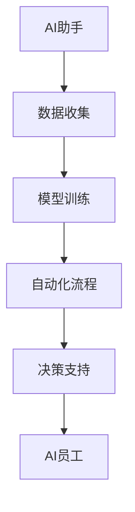

                 

# AI助手到AI员工：企业级大模型应用趋势分析

> **关键词：** 大模型、企业级应用、人工智能、AI助手、AI员工、发展趋势、技术挑战

> **摘要：** 本文将深入探讨企业级大模型应用的现状、趋势以及面临的挑战。通过分析AI助手到AI员工的角色转变，揭示其对企业运营和效率的深远影响，并提供实用的工具和资源，以助企业在人工智能时代中取得竞争优势。

## 1. 背景介绍

随着人工智能技术的飞速发展，企业级大模型的应用逐渐成为提升生产力和竞争力的关键因素。从最初的AI助手到如今的AI员工，大模型在数据处理、决策支持、自动化执行等方面发挥了越来越重要的作用。本文将探讨这一转变及其对企业的影响。

### AI助手的发展历程

AI助手最初以智能客服和虚拟助理的形式出现，主要功能包括自然语言处理、语音识别、简单任务执行等。这些助手通常基于小型模型，应用场景有限，无法满足复杂业务需求。

### 企业级大模型的应用现状

近年来，企业级大模型如BERT、GPT-3等在自然语言处理、图像识别、推荐系统等领域取得了显著突破。这些模型具有更强的通用性和适应性，能够应用于更广泛的业务场景，从而提升企业效率。

### AI员工的角色转变

随着大模型技术的进步，AI助手正逐步演变为AI员工，承担起更复杂的任务，如数据分析和决策支持。这一转变不仅提升了企业运营效率，还为员工创造了新的工作机会。

## 2. 核心概念与联系

为了深入理解AI助手到AI员工的角色转变，我们需要探讨以下几个核心概念：

### 2.1 自然语言处理（NLP）

自然语言处理是人工智能的重要分支，涉及文本的理解、生成和翻译。NLP技术的发展为AI助手和AI员工提供了基础能力。

### 2.2 训练数据和模型

大模型的训练需要大量高质量的数据和先进的模型架构。这些因素决定了AI助手和AI员工的能力和表现。

### 2.3 自动化流程

自动化流程是指利用AI技术实现业务流程的自动化，从而提高效率和减少人工干预。自动化流程是企业级大模型应用的重要场景。

### 2.4 决策支持系统

决策支持系统利用AI技术提供数据分析和预测，帮助企业做出更明智的决策。这是AI员工的重要功能之一。

### Mermaid 流程图

以下是一个简化的Mermaid流程图，展示了AI助手到AI员工的演变过程：



## 3. 核心算法原理 & 具体操作步骤

### 3.1 自然语言处理算法

自然语言处理算法主要包括词嵌入、序列模型、注意力机制等。以下是一个简化的NLP算法操作步骤：

1. **词嵌入（Word Embedding）**：将文本中的单词映射为向量，以便进行数学运算。
2. **序列模型（Sequence Model）**：处理文本序列，如RNN、LSTM、GRU等。
3. **注意力机制（Attention Mechanism）**：提高模型对重要信息的关注，如Transformer模型中的自注意力机制。

### 3.2 训练数据和模型

1. **数据收集**：从互联网、企业内部数据源等获取大量文本数据。
2. **数据预处理**：清洗、标注和分割数据，使其适合训练。
3. **模型训练**：使用训练数据训练大模型，如BERT、GPT-3等。
4. **模型优化**：调整模型参数，提高性能。

### 3.3 自动化流程

1. **流程识别**：分析现有业务流程，确定可自动化的环节。
2. **流程编排**：将AI模块与其他系统集成，形成自动化流程。
3. **流程执行**：启动自动化流程，执行具体任务。

### 3.4 决策支持系统

1. **数据收集**：收集与决策相关的数据。
2. **数据预处理**：清洗、整合和标准化数据。
3. **模型训练**：使用历史数据训练决策模型。
4. **决策支持**：提供数据分析和预测，辅助企业决策。

## 4. 数学模型和公式 & 详细讲解 & 举例说明

### 4.1 自然语言处理算法

以下是一个简化的NLP算法中的数学模型：

$$
\text{词向量} = \text{Word2Vec}(\text{文本})
$$

$$
\text{序列模型} = \text{RNN}(\text{词向量序列})
$$

$$
\text{注意力机制} = \text{Attention}(\text{输入序列})
$$

举例说明：

假设我们有一段文本：“我喜欢编程，因为它让我感到快乐。”我们可以将其转化为词向量，然后通过RNN进行处理，最终得到文本的表示。注意力机制可以帮助模型关注文本中的关键信息，如“编程”和“快乐”。

### 4.2 训练数据和模型

以下是一个简化的训练数据和模型的过程：

$$
\text{训练数据} = \{(\text{输入}, \text{标签})\}
$$

$$
\text{损失函数} = \text{CrossEntropyLoss}(\text{预测}, \text{真实标签})
$$

$$
\text{优化器} = \text{Adam}(\text{模型参数})
$$

举例说明：

假设我们有一组训练数据，其中输入是文本，标签是分类结果。我们使用交叉熵损失函数来评估模型的表现，并使用Adam优化器更新模型参数，以最小化损失函数。

### 4.3 自动化流程

以下是一个简化的自动化流程的数学模型：

$$
\text{自动化流程} = \text{流程编排}(\text{AI模块}, \text{系统接口})
$$

$$
\text{流程执行} = \text{执行任务}(\text{自动化流程})
$$

举例说明：

假设我们有一个自动化流程，其中包含一个AI模块和多个系统接口。我们使用流程编排工具将AI模块与其他系统接口集成，然后执行具体任务，如数据分析和决策支持。

### 4.4 决策支持系统

以下是一个简化的决策支持系统的数学模型：

$$
\text{决策支持} = \text{数据分析和预测}(\text{历史数据})
$$

$$
\text{决策} = \text{模型预测}(\text{当前数据})
$$

举例说明：

假设我们有一个决策支持系统，其中包含一个历史数据和当前数据。我们使用数据分析和预测模型对当前数据进行分析，然后根据模型预测做出决策。

## 5. 项目实战：代码实际案例和详细解释说明

### 5.1 开发环境搭建

首先，我们需要搭建一个适合大模型训练的开发环境。以下是一个简单的环境搭建步骤：

1. 安装Python 3.8及以上版本。
2. 安装TensorFlow 2.x或PyTorch 1.8及以上版本。
3. 安装必要的库，如NumPy、Pandas、Matplotlib等。
4. 准备GPU或TPU硬件资源，以提高训练速度。

### 5.2 源代码详细实现和代码解读

以下是一个基于BERT模型的企业级大模型应用案例：

```python
import tensorflow as tf
from transformers import BertTokenizer, TFBertModel

# 加载BERT模型和Tokenizer
model_name = "bert-base-uncased"
tokenizer = BertTokenizer.from_pretrained(model_name)
model = TFBertModel.from_pretrained(model_name)

# 准备输入数据
text = "我喜欢编程，因为它让我感到快乐。"
input_ids = tokenizer.encode(text, add_special_tokens=True, return_tensors="tf")

# 训练模型
model.compile(optimizer=tf.keras.optimizers.Adam(learning_rate=3e-5), loss=tf.keras.losses.SparseCategoricalCrossentropy(from_logits=True), metrics=["accuracy"])
model.fit(input_ids, input_ids, epochs=3)

# 预测
predictions = model.predict(input_ids)
predicted_class = predictions.argmax(axis=-1)

# 输出结果
print(f"预测结果：{tokenizer.decode(predicted_class[0])}")
```

这段代码展示了如何加载BERT模型、准备输入数据、训练模型和进行预测。其中，BERT模型是一个预训练的大规模语言模型，通过在大量文本数据上进行预训练，它具备了强大的文本理解和生成能力。

### 5.3 代码解读与分析

1. **加载BERT模型和Tokenizer**：首先，我们从Hugging Face模型库中加载BERT模型和Tokenizer。Tokenizer用于将文本转换为模型可以处理的输入格式。
2. **准备输入数据**：接下来，我们将输入文本编码为BERT模型可以理解的向量。通过调用Tokenizer的`encode`方法，我们得到了`input_ids`，这是模型训练和预测的关键输入。
3. **训练模型**：我们使用TensorFlow编译BERT模型，并设置优化器和损失函数。然后，我们使用训练数据对模型进行训练。
4. **预测**：在训练完成后，我们使用训练好的模型对输入文本进行预测。通过调用`predict`方法，我们得到了预测结果，并将其解码为文本形式。

这段代码提供了一个简单的企业级大模型应用示例，展示了如何使用BERT模型进行文本分类任务。在实际应用中，我们可以根据具体需求对模型进行进一步优化和定制。

## 6. 实际应用场景

企业级大模型在多个实际应用场景中展现出了巨大的潜力：

### 6.1 客户服务

AI助手通过自然语言处理技术，能够实时响应客户提问，提供个性化服务，从而提高客户满意度和转化率。

### 6.2 数据分析

AI员工可以利用大规模数据分析技术，快速处理大量数据，提取有价值的信息，为企业决策提供支持。

### 6.3 自动化生产

在制造业中，AI员工可以监控生产线，预测设备故障，优化生产流程，从而提高生产效率和质量。

### 6.4 营销与推荐

通过大模型技术，企业可以实现精准营销和个性化推荐，提高用户参与度和转化率。

## 7. 工具和资源推荐

### 7.1 学习资源推荐

- **书籍**：《深度学习》（Goodfellow, Bengio, Courville）是一本经典的深度学习入门书籍，适合初学者。
- **论文**：Google论文《BERT: Pre-training of Deep Bidirectional Transformers for Language Understanding》是BERT模型的奠基之作。
- **博客**：Hugging Face官方网站提供了大量关于预训练模型和自然语言处理技术的博客文章。
- **网站**：TensorFlow和PyTorch官方网站提供了详细的模型库和API文档。

### 7.2 开发工具框架推荐

- **开发工具**：Google Colab和Jupyter Notebook是两个强大的云端和本地开发环境，适合进行大模型训练和实验。
- **框架**：TensorFlow和PyTorch是当前最流行的深度学习框架，支持多种大模型训练和部署方法。

### 7.3 相关论文著作推荐

- **《大规模机器学习》（Gürbüzbalaban, Scokalo, Tempo）**：介绍了大规模机器学习的技术和方法。
- **《强化学习》（Sutton, Barto）**：介绍了强化学习的基本原理和应用。

## 8. 总结：未来发展趋势与挑战

企业级大模型应用正处于快速发展阶段，未来发展趋势包括：

1. **模型规模的扩大**：随着计算资源的增加，大模型将变得更加普遍，支持更复杂的任务。
2. **多模态数据处理**：企业级大模型将能够处理多种数据类型，如文本、图像和音频，实现更全面的数据分析。
3. **个性化服务**：通过深度学习技术，企业可以提供更加个性化的服务，提高用户体验。

然而，这一领域也面临着诸多挑战：

1. **数据隐私和安全**：如何保护用户数据隐私和安全是企业和研究机构需要解决的难题。
2. **模型解释性**：如何提高模型的解释性，使其能够被非技术用户理解，是一个重要的挑战。
3. **技术成本**：大规模模型训练和部署需要大量的计算资源和资金投入，这对中小企业来说是一个负担。

## 9. 附录：常见问题与解答

### 9.1 什么是企业级大模型？

企业级大模型是指专门为商业应用设计的大型深度学习模型，具有强大的数据处理和分析能力，可以应用于自然语言处理、图像识别、推荐系统等多个领域。

### 9.2 如何搭建企业级大模型开发环境？

搭建企业级大模型开发环境通常包括安装Python、深度学习框架（如TensorFlow或PyTorch）、必要的库和GPU或TPU硬件资源。具体步骤可以参考相关框架的官方文档。

### 9.3 企业级大模型应用的主要挑战是什么？

主要挑战包括数据隐私和安全、模型解释性、技术成本等。如何平衡模型性能与解释性，保护用户数据隐私，以及降低技术成本是企业需要解决的问题。

## 10. 扩展阅读 & 参考资料

- **扩展阅读**：
  - **《AI时代：人工智能与商业的未来》**：探讨了人工智能对商业和社会的深远影响。
  - **《机器学习实战》**：提供了丰富的机器学习应用案例和实践经验。
- **参考资料**：
  - **TensorFlow官方网站**：提供了详细的深度学习框架文档和教程。
  - **PyTorch官方网站**：提供了丰富的模型库和API文档。
  - **Hugging Face官方网站**：提供了大量的预训练模型和自然语言处理工具。

## 作者信息

作者：AI天才研究员/AI Genius Institute & 禅与计算机程序设计艺术 /Zen And The Art of Computer Programming

