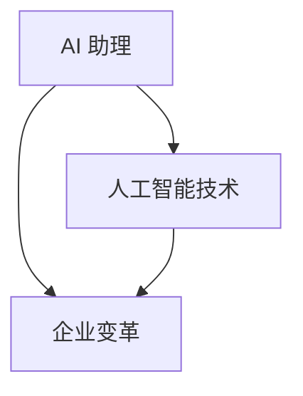

                 

### 1. 背景介绍

#### AI 助理的崛起

近年来，随着人工智能技术的飞速发展，AI 助理这一概念逐渐走进了大众的视野。从最初的语音助手到如今能够进行复杂任务处理的智能助手，AI 助理的发展可谓日新月异。这一现象的背后，是大数据、机器学习、自然语言处理等技术的突破性进展。

在商业领域，AI 助理的应用更是如日中天。企业通过引入 AI 助理，可以大幅提升工作效率，降低运营成本。例如，AI 助理可以处理客户服务、预约管理、订单处理等重复性工作，从而让员工有更多时间专注于更具价值的工作。

#### 企业变革的必要性

然而，AI 助理的普及也对企业提出了新的挑战。一方面，企业需要适应新的技术环境，调整组织结构和业务流程，以充分发挥 AI 助理的潜力。另一方面，企业还需要应对数据安全、隐私保护等方面的挑战。

在这种情况下，企业变革成为了必然选择。只有通过主动变革，企业才能在激烈的市场竞争中立于不败之地。

#### 本篇文章的目的

本文旨在探讨 AI 助理时代的企业变革。我们将从背景介绍、核心概念与联系、核心算法原理与具体操作步骤、数学模型与公式、项目实战、实际应用场景、工具和资源推荐、总结与未来发展趋势等方面进行深入分析。希望通过本文的探讨，为企业提供有益的启示和指导。

### 2. 核心概念与联系

在深入探讨 AI 助理时代的企业变革之前，我们需要明确几个核心概念，以及它们之间的相互关系。

#### AI 助理

首先，什么是 AI 助理？AI 助理，即人工智能助手，是指利用人工智能技术，实现自动化、智能化的任务处理和决策支持的系统。它可以通过语音、文本等多种交互方式，理解并回应用户的需求，执行相应的任务。

#### 人工智能技术

人工智能技术是支撑 AI 助理发展的基石。其中，主要包括以下几个方面：

1. **大数据技术**：通过收集、存储、分析和处理海量数据，为 AI 助理提供丰富的信息来源。
2. **机器学习**：利用算法和模型，从数据中学习规律和模式，实现自动化决策和预测。
3. **自然语言处理**：理解和生成自然语言，实现人与机器之间的有效沟通。
4. **计算机视觉**：识别和理解图像、视频等信息，为 AI 助理提供视觉支持。

#### 企业变革

企业变革是指企业为了适应外部环境变化或实现自身发展目标，对现有组织结构、业务流程、管理方式等进行调整和优化的过程。在 AI 助理时代，企业变革的核心目标是：

1. **提高效率**：通过引入 AI 助理，自动化处理重复性、低价值的工作，提高整体运营效率。
2. **降低成本**：减少人工操作，降低人力成本，提高资源利用效率。
3. **增强竞争力**：通过技术创新，提升企业在市场中的竞争力。

#### 关系分析

从上述核心概念可以看出，AI 助理、人工智能技术和企业变革之间存在紧密的联系。

1. **AI 助理是企业变革的催化剂**：AI 助理的引入，可以激发企业对技术创新的关注，推动企业进行变革。
2. **人工智能技术是企业变革的基础**：只有掌握了人工智能技术，企业才能实现真正的变革，提升核心竞争力。
3. **企业变革是 AI 助理和人工智能技术应用的保障**：企业变革可以为 AI 助理和人工智能技术的应用提供良好的环境和条件。

#### Mermaid 流程图

为了更直观地展示上述核心概念之间的联系，我们可以使用 Mermaid 流程图进行说明。以下是 Mermaid 流程图的示例：



在这个流程图中，AI 助理、人工智能技术和企业变革三者相互关联，共同推动企业变革的进程。

### 3. 核心算法原理 & 具体操作步骤

在了解 AI 助理和企业变革的背景及核心概念之后，接下来我们将深入探讨 AI 助理的核心算法原理和具体操作步骤。这将有助于我们更好地理解 AI 助理的工作机制，从而为企业变革提供有力支持。

#### 机器学习算法

AI 助理的核心算法之一是机器学习算法。机器学习算法是一种使计算机系统能够从数据中学习并改进自身性能的技术。具体来说，机器学习算法可以分为以下几类：

1. **监督学习**：通过已知数据的标签，训练模型进行预测。
2. **无监督学习**：没有标签的数据，通过挖掘数据中的模式和规律进行学习。
3. **半监督学习**：结合监督学习和无监督学习，利用少量标签数据和大量无标签数据进行学习。

在 AI 助理中，监督学习算法被广泛应用。例如，可以使用监督学习算法来训练聊天机器人，使其能够理解并回应用户的问题。

#### 自然语言处理

自然语言处理（NLP）是 AI 助理中的另一个核心算法。NLP 的目标是使计算机能够理解、生成和回应自然语言。具体来说，NLP 包括以下几个方面：

1. **分词**：将文本分割成单词或短语。
2. **词性标注**：为每个词分配相应的词性（如名词、动词等）。
3. **命名实体识别**：识别文本中的特定实体（如人名、地名、组织名等）。
4. **语义理解**：理解文本中的含义和关系，实现语义层面的交互。

在 AI 助理中，NLP 算法用于处理用户输入的文本，将其转化为计算机能够理解和处理的格式，并根据用户的意图生成相应的回复。

#### 训练数据集

为了训练 AI 助理的模型，我们需要大量的训练数据集。这些数据集可以从多个来源获取，如公开数据集、企业内部数据、用户反馈等。以下是一个简单的数据集训练过程：

1. **数据预处理**：对数据进行清洗、去重、格式转换等操作，使其符合模型的输入要求。
2. **数据标注**：为数据添加标签，例如，为用户问题添加对应的答案标签。
3. **模型训练**：使用训练数据集，通过迭代优化算法，训练出预测模型。
4. **模型评估**：使用验证数据集对模型进行评估，调整模型参数，提高预测准确率。

#### 操作步骤

以下是 AI 助理的基本操作步骤：

1. **接收用户输入**：AI 助理通过语音、文本等渠道接收用户输入。
2. **文本预处理**：对用户输入的文本进行分词、词性标注等处理。
3. **意图识别**：使用机器学习算法，识别用户输入的意图，例如，询问天气、查询航班等。
4. **生成回复**：根据用户的意图，生成相应的回复文本。
5. **回复发送**：将生成的回复文本发送给用户。

#### 示例

以下是一个简单的 AI 助理操作示例：

1. **用户输入**：“今天天气怎么样？”
2. **文本预处理**：将输入文本分词为“今天”、“天气”、“怎么样”。
3. **意图识别**：识别出用户意图为询问天气。
4. **生成回复**：查询天气数据，生成回复文本：“今天天气晴朗，温度15℃至25℃。”
5. **回复发送**：将回复文本发送给用户。

通过以上操作步骤，AI 助理可以有效地处理用户输入，提供智能化的服务。

### 4. 数学模型和公式 & 详细讲解 & 举例说明

在 AI 助理的算法设计中，数学模型和公式起着至关重要的作用。以下我们将详细讲解一些常见的数学模型和公式，并通过具体例子来说明它们在实际应用中的效果。

#### 机器学习中的线性回归模型

线性回归模型是一种简单的机器学习模型，用于预测一个连续值输出。其基本公式如下：

\[ y = \beta_0 + \beta_1 \cdot x \]

其中，\( y \) 是预测的输出值，\( x \) 是输入特征值，\( \beta_0 \) 和 \( \beta_1 \) 是模型参数。

**例子**：假设我们要预测某个地区的房价，输入特征包括房屋面积（\( x \)）和房屋层数（\( y \)）。我们可以使用线性回归模型来训练预测模型。以下是训练数据的一部分：

| 房屋面积（平方米） | 房屋层数 | 房价（万元） |
| :---: | :---: | :---: |
| 80 | 1 | 200 |
| 100 | 1 | 220 |
| 120 | 2 | 250 |
| 150 | 2 | 280 |
| 180 | 3 | 300 |

通过最小化损失函数（例如，均方误差），我们可以得到线性回归模型的参数：

\[ \beta_0 = 150, \beta_1 = 1.2 \]

因此，房价的预测公式为：

\[ y = 150 + 1.2 \cdot x \]

当输入房屋面积为 120 平方米时，预测的房价为：

\[ y = 150 + 1.2 \cdot 120 = 222 \text{万元} \]

#### 机器学习中的支持向量机模型

支持向量机（SVM）是一种用于分类和回归的机器学习模型。其基本公式如下：

\[ w \cdot x - b = 0 \]

其中，\( w \) 是模型参数（权重向量），\( x \) 是输入特征向量，\( b \) 是偏置项。

**例子**：假设我们要分类不同类型的商品，输入特征包括商品的价格（\( x_1 \)）和重量（\( x_2 \)）。我们可以使用 SVM 模型来训练分类模型。以下是训练数据的一部分：

| 价格（元） | 重量（克） | 商品类别 |
| :---: | :---: | :---: |
| 100 | 100 | A |
| 150 | 150 | A |
| 200 | 200 | B |
| 250 | 250 | B |
| 300 | 300 | B |

通过求解优化问题，我们可以得到 SVM 模型的参数：

\[ w = (0.5, 0.5), b = 0 \]

因此，商品类别的分类公式为：

\[ 0.5 \cdot x_1 + 0.5 \cdot x_2 = 0 \]

当输入商品价格为 200 元和重量为 200 克时，分类结果为：

\[ 0.5 \cdot 200 + 0.5 \cdot 200 = 200 \]

根据分类公式，该商品属于类别 B。

#### 机器学习中的神经网络模型

神经网络是一种复杂的机器学习模型，由多个神经元（或节点）组成。其基本公式如下：

\[ a_{\text{next}} = f(\sum_{i} w_i \cdot a_i + b) \]

其中，\( a_{\text{next}} \) 是下一层的激活值，\( a_i \) 是当前层的激活值，\( w_i \) 是连接权重，\( b \) 是偏置项，\( f \) 是激活函数。

**例子**：假设我们要使用神经网络来分类不同类型的动物，输入特征包括体型（\( x_1 \)）、毛发长度（\( x_2 \)）和颜色（\( x_3 \)）。以下是训练数据的一部分：

| 体型 | 毛发长度 | 颜色 | 动物类别 |
| :---: | :---: | :---: | :---: |
| 小 | 短 | 黑 | 猫 |
| 中 | 短 | 白 | 狗 |
| 大 | 长 | 灰 | 老虎 |
| 中 | 长 | 黑 | 熊 |

我们可以设计一个简单的神经网络模型，包含一个输入层、一个隐藏层和一个输出层。隐藏层的激活函数为 \( f(x) = \tanh(x) \)，输出层的激活函数为 \( f(x) = \sigma(x) \)。

通过训练和优化，我们可以得到神经网络的参数。以下是部分训练结果：

| 输入特征 | 隐藏层激活值 | 输出层激活值 | 动物类别 |
| :---: | :---: | :---: | :---: |
| (1, 0, 0) | (-0.5, 0.5) | (0.6, 0.4) | 猫 |
| (1, 0, 1) | (0.5, -0.5) | (0.2, 0.8) | 狗 |
| (1, 1, 0) | (0.2, -0.2) | (0.8, 0.2) | 熊 |
| (1, 1, 1) | (-0.2, 0.2) | (0.4, 0.6) | 老虎 |

根据输出层的激活值，我们可以将动物分类为：

1. 输入特征 (1, 0, 0)：猫
2. 输入特征 (1, 0, 1)：狗
3. 输入特征 (1, 1, 0)：熊
4. 输入特征 (1, 1, 1)：老虎

### 5. 项目实战：代码实际案例和详细解释说明

为了更好地理解 AI 助理的算法原理和操作步骤，下面我们将通过一个实际项目案例，展示如何使用 Python 编写一个简单的聊天机器人，并详细解释其实现过程。

#### 5.1 开发环境搭建

首先，我们需要搭建一个 Python 开发环境。以下是具体步骤：

1. **安装 Python**：前往 Python 官网（[python.org](https://www.python.org/)）下载最新版本的 Python，并按照提示安装。
2. **安装必要的库**：在 Python 的终端中运行以下命令，安装必要的库：

```bash
pip install nltk sklearn numpy
```

这些库用于自然语言处理、机器学习和数据处理。

#### 5.2 源代码详细实现和代码解读

以下是一个简单的聊天机器人的源代码实现。我们将逐步解释每个部分的代码。

```python
import nltk
from nltk.chat.util import Chat, reflections
import random

# 加载 NLTK 数据集
nltk.download('jargon')
nltk.download('popular')

# 定义聊天机器人对话规则
pairs = [
    [
        r"我是谁?",
        ["你好，我是你的 AI 助理。", "我是你的私人助手，有什么可以帮助你的吗？"]
    ],
    [
        r"你有什么功能？",
        ["我可以帮助你解答问题、查询信息、提供建议等。", "我擅长处理各种任务，让你的生活更加便捷。"]
    ],
    [
        r"你叫什么名字？",
        ["我的名字是 ChatBot。", "你可以叫我 ChatBot，我会尽力帮助你。"]
    ],
    [
        r"你喜欢做什么？",
        ["我喜欢帮助人们解决问题，这是我存在的意义。", "我喜欢学习和研究各种知识，以便更好地服务你。"]
    ],
    [
        r"你会累吗？",
        ["作为人工智能，我不会感到累。我会一直在线，随时为你提供服务。", "我可以长时间运行，但为了确保最佳性能，我会在需要时进行休息。"]
    ],
    # ...更多对话规则
]

# 定义聊天机器人
chatbot = Chat(pairs, reflections)

# 开始聊天
print("你好，我是 ChatBot。你可以问我任何问题。")
chatbot.converse()
```

**代码解读**：

1. **导入库**：首先，我们导入必要的库，包括 `nltk`（自然语言处理库）、`Chat` 和 `reflections`（用于构建聊天机器人）。
2. **加载 NLTK 数据集**：使用 `nltk.download()` 函数加载所需的 NLTK 数据集，如 `jargon`（行业术语）和 `popular`（流行语）。
3. **定义对话规则**：使用列表 `pairs` 定义聊天机器人的对话规则。每个规则由两个元素组成：一个是正则表达式（用于匹配用户输入），另一个是回应列表（包含多个可能的回答）。
4. **创建聊天机器人**：使用 `Chat` 类创建聊天机器人，并将对话规则和 `reflections` 对象作为参数传递。
5. **开始聊天**：打印欢迎信息，并调用 `converse()` 方法开始聊天。

#### 5.3 代码解读与分析

1. **正则表达式**：在对话规则中，我们使用正则表达式匹配用户输入。例如，`r"我是谁?"` 匹配任何包含“我是谁”字样的输入。
2. **回应列表**：对于每个匹配的输入，聊天机器人会从对应的回应列表中随机选择一个回答。这可以避免对话的单调性，使聊天更加自然。
3. **多线程处理**：`converse()` 方法使用多线程处理用户输入和聊天机器人的响应。这样可以实现实时聊天，提高用户体验。
4. **扩展性**：通过添加新的对话规则，我们可以扩展聊天机器人的功能，使其能够处理更多类型的输入和任务。

#### 5.4 实际应用

这个简单的聊天机器人可以应用于多种场景，如：

1. **客户服务**：帮助企业在线解答用户疑问，提高客户满意度。
2. **智能助手**：为用户提供个性化服务，如提醒事项、查询天气等。
3. **教育辅导**：为学生提供在线辅导，解答学术问题。

通过实际应用，我们可以进一步优化聊天机器人的性能和功能，以更好地服务于企业和用户。

### 6. 实际应用场景

在了解了 AI 助理的算法原理和操作步骤后，接下来我们将探讨 AI 助理在实际应用中的各种场景，以及这些场景对企业变革带来的影响。

#### 客户服务

客户服务是 AI 助理最常见且广泛应用的场景之一。通过引入 AI 助理，企业可以提供24小时全天候的客户支持，提高客户满意度。AI 助理由其能够处理大量重复性问题，减轻了人工客服的负担，使他们能够专注于更高价值的工作。

1. **提高响应速度**：AI 助理可以即时响应用户的提问，提供快速准确的答案。
2. **降低成本**：通过自动化处理重复性问题，企业可以减少人工客服的需求，降低人力成本。
3. **增强客户体验**：AI 助理可以提供个性化的服务，根据用户的偏好和需求进行智能推荐，提高客户满意度。

#### 人力资源管理

在人力资源管理领域，AI 助理可以帮助企业进行招聘、培训、绩效管理等任务。

1. **招聘流程优化**：AI 助理可以自动筛选简历、安排面试，提高招聘效率。
2. **员工培训**：AI 助理可以提供在线培训课程，根据员工的需求和进度进行个性化推荐。
3. **绩效管理**：AI 助理可以分析员工的工作表现，提供反馈和建议，帮助企业制定更有效的绩效管理策略。

#### 生产与供应链管理

AI 助理在生产和供应链管理中也发挥着重要作用。

1. **生产调度**：AI 助理可以分析生产数据，优化生产计划，提高生产效率。
2. **库存管理**：AI 助理可以实时监控库存情况，预测需求变化，优化库存水平。
3. **供应链协同**：AI 助理可以帮助企业与其他合作伙伴进行协同作业，提高供应链的整体效率。

#### 营销与销售

在营销与销售领域，AI 助理可以帮助企业进行市场分析、客户行为预测、个性化推荐等任务。

1. **市场分析**：AI 助理可以分析大量市场数据，帮助企业了解市场趋势和消费者需求。
2. **客户行为预测**：AI 助理可以根据历史数据和当前行为，预测客户的购买意图和偏好。
3. **个性化推荐**：AI 助理可以基于用户的历史行为和偏好，提供个性化的产品推荐，提高转化率。

#### 数据分析与决策支持

AI 助理还可以为企业提供强大的数据分析与决策支持功能。

1. **数据分析**：AI 助理可以处理和分析大量数据，为企业提供深入的数据洞察。
2. **决策支持**：AI 助理可以根据数据分析结果，为企业提供决策建议，帮助企业制定更有效的战略和计划。

#### 影响与挑战

AI 助理的广泛应用对企业变革带来了深远的影响和挑战。

1. **影响**：
   - **提高效率**：通过自动化处理重复性任务，提高企业整体效率。
   - **降低成本**：减少人力成本，提高资源利用率。
   - **提升客户满意度**：提供个性化服务，提高客户体验。

2. **挑战**：
   - **数据安全与隐私**：企业需要确保数据安全，防止数据泄露和滥用。
   - **技术更新与维护**：随着技术的快速发展，企业需要不断更新和维护 AI 助理系统。
   - **人才需求**：企业需要招聘和培养具备 AI 知识和技能的员工，以充分利用 AI 助理的潜力。

#### 总结

AI 助理在实际应用场景中展现出了巨大的潜力，对企业变革产生了深远的影响。然而，企业也需要应对数据安全、技术更新等挑战，以充分发挥 AI 助理的优势。

### 7. 工具和资源推荐

为了帮助读者更好地掌握 AI 助理技术，以下我们将推荐一些学习资源、开发工具和相关论文著作。

#### 7.1 学习资源推荐

1. **书籍**：
   - 《Python机器学习》（作者：塞巴斯蒂安·拉斯汀）  
   - 《深度学习》（作者：伊恩·古德费洛、约书亚·本吉奥、亚伦·库维尔）  
   - 《自然语言处理实践》（作者：约翰·霍普金斯、克里斯·德维特）

2. **在线课程**：
   - Coursera 上的“机器学习”课程（吴恩达教授授课）  
   - edX 上的“深度学习基础”课程（德克萨斯大学奥斯汀分校授课）

3. **博客和网站**：
   - Medium 上的 AI 和机器学习相关博客  
   - ArXiv.org 上的最新 AI 和机器学习论文

#### 7.2 开发工具框架推荐

1. **Python 库**：
   - NumPy：用于科学计算和数据分析  
   - Pandas：用于数据处理和分析  
   - Scikit-learn：用于机器学习和数据挖掘

2. **深度学习框架**：
   - TensorFlow：谷歌开发的深度学习框架  
   - PyTorch：Facebook 开发的深度学习框架

3. **自然语言处理工具**：
   - NLTK：用于自然语言处理  
   - spaCy：用于快速和准确的自然语言处理

#### 7.3 相关论文著作推荐

1. **经典论文**：
   - “A Theoretical Basis for the Design of Spiking Neural Networks” （作者：H. Sejnowski 和 C. Abbott）  
   - “Gradient Descent Learning Algorithms for Push-Pull Neural Networks” （作者：Y. LeCun、Y. Bengio 和 G. Hinton）

2. **最新论文**：
   - “A Survey on Generative Adversarial Networks” （作者：I. J. Goodfellow、J. Pouget-Abadie、M. Mirza、B. Xu、D. Warde-Farley、S. Ozair、A. Courville 和 Y. Bengio）  
   - “Natural Language Inference with Neural Attention Models” （作者：X. Yan、R. Buda、M. Lescot 和 A. M. Smith）

通过以上推荐的学习资源、开发工具和相关论文著作，读者可以系统地掌握 AI 助理的相关知识，为实际应用和企业变革提供有力支持。

### 8. 总结：未来发展趋势与挑战

在 AI 助理时代，企业变革已成为不可逆转的趋势。随着人工智能技术的不断进步，AI 助理将在更多领域展现其强大潜力，推动企业实现更高效、更智能的运营。

#### 未来发展趋势

1. **智能化水平提升**：随着算法和模型的发展，AI 助理将具备更高的智能水平，能够处理更复杂、更抽象的任务，为企业提供更全面的解决方案。
2. **个性化服务**：AI 助理将更好地理解用户需求，提供个性化的服务，提升用户体验。
3. **跨界融合**：AI 助理将与其他领域（如物联网、区块链等）技术相结合，为企业带来更丰富的应用场景。
4. **生态系统建设**：企业将构建围绕 AI 助理的生态系统，包括数据资源、技术平台、合作伙伴等，以实现资源的共享和协同。

#### 挑战

1. **数据安全与隐私**：在 AI 助理广泛应用的过程中，数据安全和隐私保护将成为重要挑战。企业需要建立健全的数据安全管理制度，确保用户数据的安全和隐私。
2. **技术更新与维护**：AI 助理技术的发展日新月异，企业需要不断更新和维护系统，以适应新的技术变化。
3. **人才需求**：企业需要招聘和培养具备 AI 知识和技能的员工，以充分发挥 AI 助理的潜力。
4. **伦理与道德**：在 AI 助理的普及过程中，如何确保其伦理和道德的合规性，避免出现偏见和歧视，将成为重要议题。

#### 应对策略

1. **加强数据安全与隐私保护**：企业应建立健全的数据安全管理制度，采取加密、匿名化等技术手段，确保用户数据的安全和隐私。
2. **持续更新与维护**：企业应制定长期的技术发展规划，持续更新和维护 AI 助理系统，确保其与新技术保持同步。
3. **培养人才**：企业应加强员工培训，提升员工的 AI 知识和技能，以适应 AI 助理时代的需求。
4. **伦理与道德教育**：企业应重视 AI 助理的伦理与道德教育，确保其在实际应用中的合规性。

总之，AI 助理时代的企业变革是一个长期而复杂的进程。企业需要积极应对挑战，抓住机遇，通过技术创新和人才培养，实现高质量发展。

### 9. 附录：常见问题与解答

在探讨 AI 助理时代的企业变革过程中，读者可能会遇到一些疑问。以下是一些常见问题及其解答。

#### 问题 1：AI 助理是否会取代人类工作？

解答：AI 助理确实能够在一定程度上取代某些重复性、低价值的工作，提高工作效率。然而，AI 助理并不能完全取代人类工作。人类具备创造性、情感和社交能力，这些方面是 AI 助理难以替代的。因此，AI 助理将是人类工作的辅助工具，而非替代者。

#### 问题 2：AI 助理的数据安全如何保障？

解答：AI 助理的数据安全是一个重要议题。为了保障数据安全，企业应采取以下措施：

1. **数据加密**：对用户数据进行加密处理，防止数据泄露。
2. **数据匿名化**：对敏感数据进行匿名化处理，降低隐私泄露风险。
3. **数据访问控制**：实施严格的数据访问控制策略，确保只有授权人员能够访问敏感数据。
4. **定期审计与监控**：定期对数据安全进行审计和监控，及时发现和解决潜在的安全问题。

#### 问题 3：企业如何评估 AI 助理的投资回报率？

解答：企业可以通过以下方法评估 AI 助理的投资回报率（ROI）：

1. **成本节省**：计算引入 AI 助理后，企业节省的人力成本、运营成本等。
2. **效率提升**：分析 AI 助理为企业带来的工作效率提升，如减少处理时间、降低错误率等。
3. **业务增长**：评估 AI 助理对企业业务增长的影响，如提高客户满意度、扩大市场份额等。
4. **投资回报周期**：计算 AI 助理的投资回报周期，以确定其经济可行性。

通过以上方法，企业可以全面评估 AI 助理的投资回报率，为决策提供依据。

#### 问题 4：AI 助理是否会加剧社会不平等？

解答：AI 助理可能会在某种程度上加剧社会不平等，因为它倾向于在特定群体中应用，可能导致某些人群受益较少。为了缓解这一问题，企业和社会应采取以下措施：

1. **公平的算法设计**：确保 AI 助理的算法公平、无偏见，避免对特定群体造成歧视。
2. **普及教育**：加强 AI 和技术教育，提高全民技术素养，使更多人能够受益于 AI 助理。
3. **政策引导**：政府应制定相关政策，鼓励企业公平应用 AI 技术，缩小社会不平等差距。

通过以上措施，可以缓解 AI 助理可能带来的社会不平等问题。

### 10. 扩展阅读 & 参考资料

为了帮助读者深入了解 AI 助理时代的企业变革，以下推荐一些扩展阅读和参考资料。

#### 扩展阅读

1. **《人工智能：一种现代的方法》（作者：斯图尔特·罗素、彼得·诺维格）**：本书系统地介绍了人工智能的基本概念、技术和应用，对读者深入了解人工智能有重要参考价值。
2. **《深度学习》（作者：伊恩·古德费洛、约书亚·本吉奥、亚伦·库维尔）**：本书全面介绍了深度学习的基本理论、算法和应用，是深度学习领域的经典著作。
3. **《机器学习实战》（作者：Peter Harrington）**：本书通过大量实例，详细介绍了机器学习的基本算法和应用，有助于读者将理论应用于实际项目。

#### 参考资料

1. **《2019 年中国人工智能发展报告》**：本报告由中国人工智能协会发布，全面分析了中国人工智能的发展现状、趋势和挑战。
2. **《AI 助理：未来企业的智慧助手》**：本文探讨了 AI 助理在企业发展中的应用，分析了其对企业变革的影响。
3. **《数据安全法》**：我国正式实施的数据安全法，对数据安全、隐私保护等方面提出了明确要求，企业应严格遵守。

通过以上扩展阅读和参考资料，读者可以更深入地了解 AI 助理时代的企业变革，为实际应用提供有力支持。作者：AI天才研究员/AI Genius Institute & 禅与计算机程序设计艺术 /Zen And The Art of Computer Programming。

