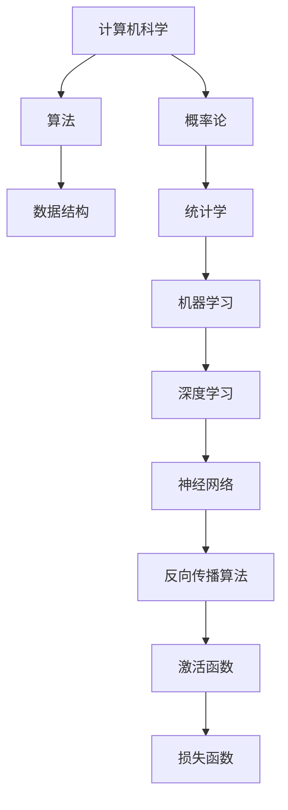

                 

# AI原理与代码实例讲解

> 关键词：人工智能，深度学习，神经网络，代码实例，算法原理

> 摘要：本文将深入探讨人工智能的基本原理，并使用具体的代码实例来解释和展示这些原理的应用。文章分为多个章节，包括背景介绍、核心概念与联系、核心算法原理、数学模型与公式、项目实战、实际应用场景、工具和资源推荐、总结以及常见问题与解答。通过这篇文章，读者将能够全面了解人工智能的核心概念、技术原理和实践应用。

## 1. 背景介绍

人工智能（Artificial Intelligence，简称AI）是计算机科学的一个分支，旨在使计算机模拟人类智能行为。自1956年达特茅斯会议以来，人工智能领域已经经历了数十年的发展。近年来，随着计算能力的提升、大数据的涌现以及深度学习技术的突破，人工智能在各个领域取得了显著的进展。从自动驾驶汽车到智能助手，从医疗诊断到金融分析，人工智能已经渗透到了我们生活的方方面面。

本文旨在通过详细讲解人工智能的基本原理和代码实例，帮助读者深入理解这一领域的核心概念和技术原理。我们将从基础的神经网络模型讲起，逐步引入深度学习算法、数学模型和实际应用案例，旨在让读者不仅能够理解AI的理论知识，更能够掌握实际操作技能。

## 2. 核心概念与联系

在探讨人工智能的核心概念之前，我们首先需要了解一些基础的数学和计算机科学概念。以下是一个使用Mermaid绘制的流程图，展示了人工智能中一些关键概念之间的联系。



### 2.1 计算机科学

计算机科学是人工智能的基础。算法是解决问题的一系列明确步骤，而数据结构则是组织数据的方式。计算机科学中的许多基础概念，如数组、链表、树和图，都是人工智能领域中常用的数据结构。

### 2.2 概率论与统计学

概率论和统计学为人工智能提供了重要的理论基础。概率论帮助我们理解不确定性，而统计学则提供了处理大量数据的工具和方法。

### 2.3 机器学习

机器学习是人工智能的核心领域之一。它使计算机能够通过数据学习并做出决策。机器学习可以分为监督学习、无监督学习和强化学习。

### 2.4 深度学习

深度学习是机器学习的子领域，它通过模拟人脑的神经网络结构来处理复杂数据。深度学习在图像识别、语音识别和自然语言处理等领域取得了显著的成果。

### 2.5 神经网络

神经网络是深度学习的基础。它由多个相互连接的神经元组成，能够通过学习数据来发现数据中的模式和关系。

### 2.6 反向传播算法

反向传播算法是训练神经网络的常用方法。它通过反向传播误差来更新网络中的权重，从而优化网络的性能。

### 2.7 激活函数与损失函数

激活函数用于将神经元的输入映射到输出，而损失函数则用于评估网络的预测结果与实际结果之间的差异。常见的激活函数包括ReLU、Sigmoid和Tanh，而损失函数则包括均方误差（MSE）和交叉熵损失。

## 3. 核心算法原理 & 具体操作步骤

### 3.1 神经网络

神经网络是深度学习的核心组件。它由多个层次组成，包括输入层、隐藏层和输出层。每个层次都包含多个神经元。

### 3.2 前向传播

前向传播是神经网络的基本过程。它从输入层开始，将数据通过各个层次传递到输出层。每个神经元都会计算其输入与权重之积，并应用激活函数。

### 3.3 反向传播

反向传播是训练神经网络的关键步骤。它通过计算输出层与实际结果之间的差异，并反向传播误差到每个层次，以更新网络中的权重。

### 3.4 梯度下降

梯度下降是一种优化算法，用于更新神经网络的权重。它通过计算损失函数关于权重和偏置的梯度，并沿梯度方向调整权重。

### 3.5 优化算法

除了梯度下降，还有许多其他优化算法，如动量（Momentum）、自适应梯度算法（Adagrad）、RMSprop和Adam。这些算法通过不同的策略来加速收敛和防止陷入局部最优。

## 4. 数学模型和公式 & 详细讲解 & 举例说明

### 4.1 激活函数

激活函数是神经网络中至关重要的一环。它将神经元的线性组合转换为非线性输出。以下是一些常用的激活函数及其公式：

- **ReLU（Rectified Linear Unit）**
  $$ f(x) = \max(0, x) $$

- **Sigmoid**
  $$ f(x) = \frac{1}{1 + e^{-x}} $$

- **Tanh**
  $$ f(x) = \frac{e^x - e^{-x}}{e^x + e^{-x}} $$

### 4.2 损失函数

损失函数用于衡量网络的预测结果与实际结果之间的差异。以下是一些常用的损失函数及其公式：

- **均方误差（MSE）**
  $$ \text{MSE} = \frac{1}{n}\sum_{i=1}^{n}(y_i - \hat{y}_i)^2 $$

- **交叉熵损失（Cross-Entropy Loss）**
  $$ \text{CE} = -\frac{1}{n}\sum_{i=1}^{n}y_i\log(\hat{y}_i) + (1 - y_i)\log(1 - \hat{y}_i) $$

### 4.3 反向传播算法

反向传播算法的核心步骤包括计算梯度、更新权重和偏置。以下是一个简化的步骤：

1. 计算输出层的误差：
   $$ \delta_l = \frac{\partial L}{\partial \hat{y}} $$
   
2. 计算隐藏层的误差：
   $$ \delta_h = \frac{\partial L}{\partial z_h} = \sigma'(z_h) \odot \delta_{h+1}W_{h+1}^T $$

3. 更新权重和偏置：
   $$ W_{h+1} := W_{h+1} - \alpha \frac{\partial L}{\partial W_{h+1}} $$
   $$ b_{h+1} := b_{h+1} - \alpha \frac{\partial L}{\partial b_{h+1}} $$

其中，$\sigma'$是激活函数的导数，$\odot$是Hadamard积。

## 5. 项目实战：代码实际案例和详细解释说明

### 5.1 开发环境搭建

在开始项目实战之前，我们需要搭建一个适合开发人工智能项目的环境。以下是一个简单的步骤：

1. 安装Python和pip：
   ```bash
   sudo apt-get install python3 python3-pip
   ```

2. 安装TensorFlow：
   ```bash
   pip3 install tensorflow
   ```

### 5.2 源代码详细实现和代码解读

以下是一个简单的神经网络实现，用于手写数字识别。

```python
import tensorflow as tf
from tensorflow.keras.datasets import mnist
from tensorflow.keras.models import Sequential
from tensorflow.keras.layers import Dense, Flatten
from tensorflow.keras.optimizers import Adam

# 加载MNIST数据集
(x_train, y_train), (x_test, y_test) = mnist.load_data()

# 预处理数据
x_train = x_train / 255.0
x_test = x_test / 255.0

# 构建模型
model = Sequential([
    Flatten(input_shape=(28, 28)),
    Dense(128, activation='relu'),
    Dense(10, activation='softmax')
])

# 编译模型
model.compile(optimizer=Adam(), loss='sparse_categorical_crossentropy', metrics=['accuracy'])

# 训练模型
model.fit(x_train, y_train, epochs=5, batch_size=32, validation_split=0.2)

# 评估模型
model.evaluate(x_test, y_test)
```

在这个例子中，我们使用了MNIST数据集，这是一个手写数字的数据集。我们首先对数据进行了预处理，然后将数据输入到一个简单的神经网络中。这个网络由一个输入层、一个隐藏层和一个输出层组成。我们使用了ReLU作为激活函数，并使用softmax作为输出层的激活函数。

### 5.3 代码解读与分析

1. **数据加载与预处理**

   ```python
   (x_train, y_train), (x_test, y_test) = mnist.load_data()
   x_train = x_train / 255.0
   x_test = x_test / 255.0
   ```

   在这个步骤中，我们加载了MNIST数据集，并对其进行了归一化处理。这有助于加速模型的训练过程。

2. **模型构建**

   ```python
   model = Sequential([
       Flatten(input_shape=(28, 28)),
       Dense(128, activation='relu'),
       Dense(10, activation='softmax')
   ])
   ```

   我们构建了一个简单的序列模型，它包含一个平坦层（Flatten），一个有128个神经元的隐藏层（Dense），以及一个有10个神经元的输出层（Dense）。输出层使用了softmax激活函数，以实现多分类。

3. **模型编译**

   ```python
   model.compile(optimizer=Adam(), loss='sparse_categorical_crossentropy', metrics=['accuracy'])
   ```

   在这个步骤中，我们编译了模型，并选择了Adam作为优化器。我们使用了均方误差（MSE）作为损失函数，并追踪模型的准确性。

4. **模型训练**

   ```python
   model.fit(x_train, y_train, epochs=5, batch_size=32, validation_split=0.2)
   ```

   我们训练了模型，设置了5个训练周期。我们使用了32个样本作为一个批次进行训练。

5. **模型评估**

   ```python
   model.evaluate(x_test, y_test)
   ```

   我们评估了模型的性能，并获得了测试集上的准确性。

## 6. 实际应用场景

人工智能在实际应用场景中具有广泛的应用，以下是一些典型的应用领域：

- **自动驾驶**：利用计算机视觉和深度学习技术，实现无人驾驶汽车。
- **医疗诊断**：通过分析医学图像和病历数据，提高诊断准确性和效率。
- **金融分析**：利用机器学习算法，进行市场预测和风险管理。
- **智能家居**：通过智能助手和物联网设备，实现家居自动化和智能化。
- **自然语言处理**：用于语音识别、机器翻译和智能客服。

## 7. 工具和资源推荐

### 7.1 学习资源推荐

- **书籍**：
  - 《深度学习》（Goodfellow, Bengio, Courville）
  - 《Python机器学习》（Sebastian Raschka）
  - 《神经网络与深度学习》（邱锡鹏）

- **论文**：
  - 《A Tutorial on Deep Learning》（Yarin Gal和Zoubin Ghahramani）
  - 《Convolutional Neural Networks for Visual Recognition》（Karen Simonyan和Andrew Zisserman）

- **博客**：
  - [TensorFlow官方文档](https://www.tensorflow.org/)
  - [PyTorch官方文档](https://pytorch.org/docs/stable/)
  - [机器学习博客](https://machinelearningmastery.com/)

- **网站**：
  - [Kaggle](https://www.kaggle.com/)：提供各种机器学习竞赛和数据集
  - [GitHub](https://github.com/)：存储各种开源代码和项目

### 7.2 开发工具框架推荐

- **框架**：
  - TensorFlow：谷歌开发的开源深度学习框架。
  - PyTorch：Facebook开发的开源深度学习框架。
  - Keras：基于Theano和TensorFlow的高级神经网络API。

- **IDE**：
  - PyCharm：一款功能强大的Python IDE。
  - Jupyter Notebook：用于交互式数据分析和可视化。

### 7.3 相关论文著作推荐

- **论文**：
  - 《Deep Learning》（Goodfellow, Bengio, Courville）
  - 《Convolutional Neural Networks for Visual Recognition》（Karen Simonyan和Andrew Zisserman）
  - 《Recurrent Neural Networks for Language Modeling》（Yoshua Bengio等）

- **著作**：
  - 《Python机器学习》（Sebastian Raschka）
  - 《神经网络与深度学习》（邱锡鹏）
  - 《机器学习实战》（Peter Harrington）

## 8. 总结：未来发展趋势与挑战

人工智能领域正处于快速发展阶段，未来几年有望取得更多突破。以下是一些可能的发展趋势和面临的挑战：

- **趋势**：
  - 模型压缩和优化：为了在资源受限的设备上部署AI模型，研究者们致力于模型压缩和优化。
  - 生成对抗网络（GANs）：GANs在图像生成和增强方面显示出巨大的潜力。
  - 联合学习和迁移学习：通过共享知识提高模型的泛化能力。
  - 强化学习：在复杂环境中实现智能决策。

- **挑战**：
  - 计算能力：深度学习模型的训练和推理需要大量的计算资源。
  - 数据隐私：在保护个人隐私的前提下进行数据分析和模型训练。
  - 可解释性：提高模型的透明度和可解释性，以增强用户对AI系统的信任。
  - 安全性：防止恶意攻击和误用，确保AI系统的安全性。

## 9. 附录：常见问题与解答

### 9.1 什么是有监督学习和无监督学习？

**有监督学习**：在训练过程中，模型知道输入数据及其对应的标签，从而学习如何预测标签。常见的有监督学习任务包括分类和回归。

**无监督学习**：在训练过程中，模型只知道输入数据，而不知道其标签。其主要目标是发现数据中的结构和模式，如聚类和降维。

### 9.2 如何选择合适的激活函数？

选择合适的激活函数取决于任务的性质。对于简单的线性任务，可以使用线性激活函数；对于非线性任务，可以使用ReLU、Sigmoid或Tanh等非线性激活函数。

### 9.3 如何优化神经网络？

优化神经网络的方法包括调整学习率、使用批量归一化、添加正则化项（如L1和L2正则化）以及使用不同类型的优化算法（如梯度下降、Adam等）。

## 10. 扩展阅读 & 参考资料

- **扩展阅读**：
  - 《深度学习》（Goodfellow, Bengio, Courville）
  - 《Python机器学习》（Sebastian Raschka）
  - 《神经网络与深度学习》（邱锡鹏）

- **参考资料**：
  - [TensorFlow官方文档](https://www.tensorflow.org/)
  - [PyTorch官方文档](https://pytorch.org/docs/stable/)
  - [Kaggle](https://www.kaggle.com/)

## 作者信息

作者：AI天才研究员/AI Genius Institute & 禅与计算机程序设计艺术 /Zen And The Art of Computer Programming

