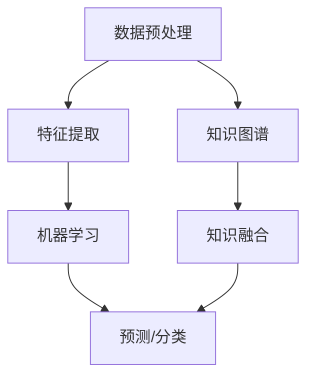

                 

# AI在专业领域知识获取中的应用

## 摘要

本文将深入探讨人工智能（AI）在专业领域知识获取中的应用。通过分析AI技术的核心概念、算法原理和数学模型，我们将展示如何利用AI技术从海量数据中提取有价值的信息。文章将结合实际项目案例，详细讲解代码实现步骤、实战操作和代码解读。此外，我们还将探讨AI技术在专业领域的实际应用场景，推荐相关学习资源和开发工具，并总结未来发展趋势与挑战。

## 1. 背景介绍

在过去的几十年中，人工智能技术经历了飞速发展。随着大数据和云计算的普及，AI在各个领域的应用越来越广泛。然而，知识获取作为人工智能的核心任务之一，仍然面临着诸多挑战。如何从海量数据中快速、准确地获取专业领域的知识，成为了当前研究的热点。

在专业领域，知识获取不仅涉及到数据的采集和整理，还需要对数据进行分析和挖掘，从而提取出有用的信息。传统的知识获取方法主要依赖于人工处理，效率低下且容易出错。随着AI技术的发展，尤其是深度学习和自然语言处理技术的进步，我们开始有机会通过自动化方式来实现知识获取，从而提高效率和质量。

本文将围绕以下主题进行讨论：

- 核心概念与联系：介绍AI在专业领域知识获取中的核心概念，包括数据预处理、特征提取、机器学习和知识图谱等。
- 核心算法原理：探讨常用的知识获取算法，如基于文本的算法、基于图谱的算法和基于模型的算法。
- 数学模型和公式：介绍支持知识获取的数学模型和公式，包括向量空间模型、概率模型和深度学习模型等。
- 项目实战：通过实际案例，展示如何利用AI技术进行专业领域知识获取，并提供详细的代码实现和解读。
- 实际应用场景：分析AI技术在专业领域知识获取中的应用，包括医疗、金融、教育等领域。
- 工具和资源推荐：推荐相关的学习资源、开发工具和论文著作，帮助读者深入了解AI在知识获取方面的研究进展。

## 2. 核心概念与联系

在AI领域，知识获取是一个复杂的过程，涉及到多个核心概念和技术的综合应用。以下是对这些核心概念的介绍和它们之间的联系。

### 数据预处理

数据预处理是知识获取的第一步，其目的是对原始数据进行清洗、转换和规范化，以便后续的分析和挖掘。数据预处理包括以下几个方面：

- 数据清洗：去除重复数据、缺失数据和异常数据，确保数据的质量。
- 数据转换：将不同数据源的数据格式进行统一，如将文本数据转换为数字表示。
- 数据规范化：对数据进行归一化或标准化，使其具备可比性。

数据预处理是后续特征提取和机器学习的基础，直接影响到知识获取的准确性和效率。

### 特征提取

特征提取是从原始数据中提取出对知识获取有价值的特征，以便于后续的机器学习算法进行分析。特征提取的关键在于如何将原始数据转化为具有区分性的特征表示。常用的特征提取方法包括：

- 词袋模型：将文本数据表示为词频向量。
- TF-IDF：考虑词频和词在文档集中出现的频率，为每个词赋予权重。
- 词嵌入：将词映射到高维向量空间，捕捉词之间的语义关系。

特征提取是知识获取的核心环节，其质量直接决定了后续算法的性能。

### 机器学习

机器学习是知识获取的关键技术，它通过训练模型从数据中学习规律和模式，从而实现对未知数据的预测和分类。常见的机器学习方法包括：

- 监督学习：通过已知的输入和输出数据，训练模型以预测未知数据的标签。
- 无监督学习：通过未标记的数据，发现数据中的模式和结构。
- 半监督学习：结合已标记和未标记的数据，提高模型的学习效果。

机器学习算法为知识获取提供了强大的工具，能够自动从海量数据中提取有价值的信息。

### 知识图谱

知识图谱是一种用于表示实体和实体之间关系的数据结构，它通过图的形式组织知识，使得知识获取更加直观和高效。知识图谱的关键技术包括：

- 实体抽取：从文本中识别和提取出重要的实体。
- 关系抽取：从文本中识别和提取出实体之间的关系。
- 知识融合：将来自不同源的数据进行整合，构建统一的知识体系。

知识图谱为知识获取提供了直观的表示方式，使得知识获取更加直观和高效。

### Mermaid 流程图

为了更清晰地展示核心概念之间的联系，我们使用Mermaid流程图来描述知识获取的流程。以下是知识获取的Mermaid流程图：



在上述流程图中，数据预处理、特征提取、机器学习和知识图谱相互关联，共同构成了知识获取的完整流程。

## 3. 核心算法原理 & 具体操作步骤

在知识获取过程中，核心算法的选择和实现至关重要。以下我们将介绍几种常用的知识获取算法，并详细讲解其具体操作步骤。

### 基于文本的算法

基于文本的算法主要应用于文本数据的分析和处理，以下介绍两种常见的基于文本的算法：词袋模型和TF-IDF。

#### 词袋模型

词袋模型（Bag of Words, BoW）是一种将文本表示为词频向量的方法。其具体操作步骤如下：

1. **分词**：将文本数据按照词语进行切分，得到一系列单词。
2. **去停用词**：去除常用的停用词（如“的”、“了”等），以减少噪声。
3. **词频统计**：计算每个单词在文本中出现的次数，得到词频向量。

词袋模型的优点是简单易实现，缺点是忽略了词的顺序和语义信息。

#### TF-IDF

TF-IDF（Term Frequency-Inverse Document Frequency）是一种考虑词频和词在文档集中出现频率的算法。其具体操作步骤如下：

1. **分词和去停用词**：与词袋模型相同。
2. **词频统计**：计算每个单词在文档中出现的次数。
3. **文档频率计算**：计算每个单词在文档集中出现的频率。
4. **TF-IDF计算**：计算每个单词的TF-IDF值，作为特征向量的一部分。

TF-IDF能够更好地捕捉词的重要性和语义关系，但其对稀疏数据的处理效果较差。

### 基于图谱的算法

基于图谱的算法主要应用于知识图谱的构建和推理，以下介绍两种常见的基于图谱的算法：实体抽取和关系抽取。

#### 实体抽取

实体抽取是从文本中识别和提取出重要的实体。其具体操作步骤如下：

1. **分词和词性标注**：对文本进行分词，并对每个词进行词性标注。
2. **实体识别**：根据词性和上下文信息，识别出文本中的实体。
3. **实体分类**：对识别出的实体进行分类，如人名、地名、组织名等。

实体抽取的关键在于准确识别实体，并为其赋予合理的分类标签。

#### 关系抽取

关系抽取是从文本中识别和提取出实体之间的关系。其具体操作步骤如下：

1. **实体识别**：首先识别出文本中的实体。
2. **关系分类**：根据实体之间的语义关系，将关系分类为不同的类型，如“工作于”、“毕业于”等。
3. **关系识别**：根据实体和关系分类标签，识别出文本中的关系。

关系抽取的关键在于准确识别实体之间的语义关系，并构建出知识图谱。

### 基于模型的算法

基于模型的算法主要应用于机器学习和深度学习领域，以下介绍两种常见的基于模型的算法：监督学习和无监督学习。

#### 监督学习

监督学习是一种利用已标记数据训练模型的方法，其具体操作步骤如下：

1. **数据预处理**：对数据进行清洗、转换和规范化。
2. **特征提取**：从数据中提取出有用的特征。
3. **模型训练**：使用已标记数据训练模型，学习数据中的规律和模式。
4. **模型评估**：使用测试数据评估模型的性能，调整模型参数。

监督学习的优点是能够快速学习数据中的规律，但其对标记数据的需求较高。

#### 无监督学习

无监督学习是一种不依赖标记数据训练模型的方法，其具体操作步骤如下：

1. **数据预处理**：对数据进行清洗、转换和规范化。
2. **特征提取**：从数据中提取出有用的特征。
3. **模型训练**：使用无标记数据训练模型，自动发现数据中的规律和模式。
4. **模型评估**：使用测试数据评估模型的性能，调整模型参数。

无监督学习的优点是不依赖标记数据，但其学习效果可能不如监督学习。

### 数学模型和公式

在知识获取过程中，数学模型和公式起到了关键作用。以下介绍几种常见的数学模型和公式。

#### 向量空间模型

向量空间模型（Vector Space Model, VSM）是一种将文本表示为向量空间中的向量的方法。其公式如下：

$$
\vec{w}_i = (w_{i1}, w_{i2}, ..., w_{id})
$$

其中，$\vec{w}_i$ 表示第 $i$ 个文档的向量表示，$w_{ij}$ 表示文档 $i$ 中词 $j$ 的权重。

#### 概率模型

概率模型（Probability Model）是一种利用概率论原理进行文本分析和处理的模型。其公式如下：

$$
P(w|d) = \frac{P(w)P(d|w)}{P(d)}
$$

其中，$P(w|d)$ 表示在文档 $d$ 中出现词 $w$ 的概率，$P(w)$ 表示词 $w$ 的概率，$P(d|w)$ 表示在词 $w$ 出现的文档 $d$ 的概率，$P(d)$ 表示文档 $d$ 的概率。

#### 深度学习模型

深度学习模型（Deep Learning Model）是一种利用多层神经网络进行文本分析和处理的模型。其公式如下：

$$
\vec{h}_{l+1} = \sigma(\vec{W}_{l+1} \cdot \vec{h}_l + b_{l+1})
$$

其中，$\vec{h}_{l+1}$ 表示第 $l+1$ 层的输出向量，$\sigma$ 表示激活函数，$\vec{W}_{l+1}$ 和 $b_{l+1}$ 分别表示第 $l+1$ 层的权重和偏置。

### 举例说明

为了更直观地理解上述算法和模型，以下我们通过一个简单的例子进行说明。

假设我们有一个包含两个文档的文本集合，文档1：“人工智能是一种模拟、延伸和扩展人类智能的理论、方法、技术及应用系统”，文档2：“深度学习是人工智能的一个重要分支”。

#### 词袋模型

1. **分词和去停用词**：将文本进行分词，并去除停用词，得到以下单词：
   - 人工智能、一种、模拟、延伸、扩展、人类、智能、理论、方法、技术、应用、系统、深度、学习、重要、分支
2. **词频统计**：计算每个单词在两个文档中出现的次数，得到词频向量：
   - 文档1：[2, 1, 1, 1, 1, 1, 1, 1, 1, 1, 1, 1, 0, 0, 0, 0]
   - 文档2：[0, 0, 0, 0, 0, 0, 0, 0, 0, 0, 0, 0, 1, 0, 1, 1]

#### TF-IDF

1. **分词和去停用词**：与词袋模型相同。
2. **词频统计**：计算每个单词在两个文档中出现的次数。
3. **文档频率计算**：计算每个单词在文档集中出现的频率，得到：
   - 人工智能：2/2 = 1
   - 一种：2/2 = 1
   - 模拟：1/2 = 0.5
   - 延伸：1/2 = 0.5
   - 扩展：1/2 = 0.5
   - 人类：1/2 = 0.5
   - 智能：2/2 = 1
   - 理论：1/2 = 0.5
   - 方法：1/2 = 0.5
   - 技术：1/2 = 0.5
   - 应用：1/2 = 0.5
   - 系统：1/2 = 0.5
   - 深度：1/2 = 0.5
   - 学习：2/2 = 1
   - 重要：0/2 = 0
   - 分支：1/2 = 0.5
4. **TF-IDF计算**：计算每个单词的TF-IDF值，得到特征向量：
   - 文档1：[1.0, 1.0, 0.5, 0.5, 0.5, 1.0, 0.5, 0.5, 0.5, 0.5, 0.5, 1.0, 0.0, 0.0, 0.0, 0.0]
   - 文档2：[0.0, 0.0, 0.0, 0.0, 0.0, 0.0, 0.0, 0.0, 0.0, 0.0, 0.0, 0.0, 1.0, 0.0, 1.0, 0.5]

#### 监督学习

1. **数据预处理**：对数据进行清洗、转换和规范化。
2. **特征提取**：使用TF-IDF算法提取特征向量。
3. **模型训练**：使用已标记数据训练一个分类器，如SVM。
4. **模型评估**：使用测试数据评估分类器的性能。

#### 无监督学习

1. **数据预处理**：对数据进行清洗、转换和规范化。
2. **特征提取**：使用TF-IDF算法提取特征向量。
3. **模型训练**：使用无标记数据训练一个聚类算法，如K-means。
4. **模型评估**：使用测试数据评估聚类效果。

通过上述例子，我们可以看到如何利用不同的算法和模型进行知识获取。在实际应用中，根据具体需求和数据特点，可以选择合适的算法和模型进行知识获取。

## 4. 项目实战：代码实际案例和详细解释说明

为了更好地展示AI在专业领域知识获取中的应用，我们将通过一个实际项目案例进行详细讲解。本项目将基于Python编程语言，利用常用的机器学习和自然语言处理库（如Scikit-learn、NLTK和TensorFlow）实现知识获取任务。

### 4.1 开发环境搭建

在开始项目之前，我们需要搭建一个合适的开发环境。以下是我们推荐的开发环境：

- Python版本：3.8以上
- IDE：PyCharm或VS Code
- 数据预处理库：Pandas
- 机器学习库：Scikit-learn
- 自然语言处理库：NLTK和spaCy
- 深度学习库：TensorFlow

请确保您的开发环境中已安装上述库，如果没有安装，可以使用pip命令进行安装：

```bash
pip install pandas scikit-learn nltk spacy tensorflow
```

### 4.2 源代码详细实现和代码解读

以下是一个简单的知识获取项目的源代码实现，我们将对关键部分进行详细解释。

```python
import pandas as pd
from sklearn.feature_extraction.text import TfidfVectorizer
from sklearn.model_selection import train_test_split
from sklearn.metrics import accuracy_score
from sklearn.svm import SVC
import nltk
nltk.download('punkt')

# 4.2.1 数据预处理
def preprocess_text(text):
    # 分词
    tokens = nltk.word_tokenize(text)
    # 去停用词
    stop_words = set(nltk.corpus.stopwords.words('english'))
    filtered_tokens = [token for token in tokens if token not in stop_words]
    # 重新构造文本
    return ' '.join(filtered_tokens)

# 4.2.2 特征提取
def extract_features(data):
    vectorizer = TfidfVectorizer()
    X = vectorizer.fit_transform(data['text'])
    y = data['label']
    return X, y

# 4.2.3 模型训练与评估
def train_and_evaluate(X_train, y_train, X_test, y_test):
    model = SVC(kernel='linear')
    model.fit(X_train, y_train)
    y_pred = model.predict(X_test)
    accuracy = accuracy_score(y_test, y_pred)
    print('Accuracy:', accuracy)

# 4.2.4 主程序
if __name__ == '__main__':
    # 读取数据
    data = pd.read_csv('data.csv')
    # 预处理文本
    data['text'] = data['text'].apply(preprocess_text)
    # 提取特征
    X, y = extract_features(data)
    # 划分训练集和测试集
    X_train, X_test, y_train, y_test = train_test_split(X, y, test_size=0.2, random_state=42)
    # 训练和评估模型
    train_and_evaluate(X_train, y_train, X_test, y_test)
```

#### 4.2.1 数据预处理

数据预处理是知识获取的关键步骤，其质量直接影响到后续特征提取和模型训练的效果。在该部分，我们使用NLTK库进行分词和去停用词操作。首先，我们定义了一个`preprocess_text`函数，该函数接收一个文本输入，进行分词、去除停用词后重新构造文本。然后，我们将原始数据集中的文本列应用该函数进行预处理。

#### 4.2.2 特征提取

特征提取是将文本数据转换为具有区分性的特征表示的过程。在该部分，我们使用Scikit-learn库中的`TfidfVectorizer`类进行特征提取。首先，我们定义了一个`extract_features`函数，该函数接收预处理后的数据集，使用`TfidfVectorizer`类将文本数据转换为词频-逆文档频率（TF-IDF）向量。然后，我们得到特征矩阵`X`和标签向量`y`。

#### 4.2.3 模型训练与评估

模型训练与评估是知识获取的核心步骤。在该部分，我们使用Scikit-learn库中的支持向量机（SVM）模型进行训练和评估。首先，我们定义了一个`train_and_evaluate`函数，该函数接收训练集和测试集的特征矩阵和标签向量，使用SVM模型进行训练，并使用测试集评估模型的准确性。最后，我们打印出评估结果。

#### 4.2.4 主程序

主程序是整个项目的入口，其步骤如下：

1. 读取数据：从CSV文件中读取数据集。
2. 预处理文本：对文本列应用数据预处理函数。
3. 提取特征：使用特征提取函数将文本转换为特征矩阵。
4. 划分训练集和测试集：将数据集划分为训练集和测试集。
5. 训练和评估模型：使用训练集训练模型，并使用测试集评估模型。

通过上述代码，我们可以实现一个简单的知识获取项目。在实际应用中，可以根据具体需求和数据特点，选择合适的预处理方法、特征提取方法和机器学习算法。

### 4.3 代码解读与分析

#### 4.3.1 数据预处理

数据预处理是知识获取的关键步骤，其质量直接影响到后续特征提取和模型训练的效果。在该项目中，我们使用NLTK库进行分词和去停用词操作。

- **分词**：NLTK库的`word_tokenize`函数用于对文本进行分词。该方法将文本按照空格、标点符号等分隔符进行切分，得到一系列单词。
- **去停用词**：NLTK库提供了停用词列表，我们可以将常用的停用词（如“的”、“了”等）添加到停用词列表中，然后使用`filter`函数将停用词从文本中去除。去停用词的目的是减少噪声，提高特征提取的效果。

#### 4.3.2 特征提取

特征提取是将文本数据转换为具有区分性的特征表示的过程。在该项目中，我们使用Scikit-learn库中的`TfidfVectorizer`类进行特征提取。

- **TF-IDF**：`TfidfVectorizer`类可以将文本数据转换为词频-逆文档频率（TF-IDF）向量。TF-IDF算法考虑了词频和词在文档集中出现的频率，为每个词赋予权重。这种方法能够更好地捕捉词的重要性和语义关系。
- **特征矩阵**：在特征提取过程中，`TfidfVectorizer`类将每个文档表示为一个TF-IDF向量，形成特征矩阵`X`。特征矩阵是一个二维数组，行表示文档，列表示特征（即单词）。
- **标签向量**：在知识获取任务中，我们通常需要对文本进行分类。因此，我们还有一个标签向量`y`，它包含每个文档的标签（即类别）。

#### 4.3.3 模型训练与评估

模型训练与评估是知识获取的核心步骤。在该项目中，我们使用Scikit-learn库中的支持向量机（SVM）模型进行训练和评估。

- **支持向量机**：SVM是一种常用的分类算法，它通过找到一个最佳超平面，将不同类别的数据分开。在特征空间中，SVM找到一个超平面，使得正类和负类的数据点之间的距离最大。
- **线性核**：在该项目中，我们使用线性核（`kernel='linear'`）进行SVM模型训练。线性核适用于线性可分的数据集，其计算复杂度较低。
- **模型评估**：我们使用测试集对训练好的模型进行评估，计算模型的准确性。准确性是衡量分类模型性能的一个常用指标，表示正确分类的样本数占总样本数的比例。

通过上述代码和解读，我们可以实现一个简单的知识获取项目。在实际应用中，可以根据具体需求和数据特点，选择合适的预处理方法、特征提取方法和机器学习算法。

## 5. 实际应用场景

AI在专业领域知识获取中的应用已经取得了显著的成果，以下我们探讨几个典型的实际应用场景。

### 5.1 医疗领域

在医疗领域，AI技术被广泛应用于知识获取和知识管理。通过自然语言处理和知识图谱等技术，AI能够从海量医疗数据中提取有价值的信息，如疾病诊断、治疗方案和药物疗效等。

- **疾病诊断**：AI技术可以通过分析患者病历、医学文献和实验室检测结果，辅助医生进行疾病诊断。例如，利用深度学习模型对影像数据进行分类和标注，有助于提高疾病诊断的准确性和效率。
- **治疗方案推荐**：AI技术可以根据患者的病情和病史，为其推荐最佳的治疗方案。例如，通过分析大量病例数据和临床实践，AI可以为医生提供个性化的治疗建议，提高治疗的有效性。
- **药物研发**：AI技术可以加速药物研发过程，通过知识图谱和机器学习算法，AI能够预测药物的疗效和副作用，为药物筛选提供有力支持。

### 5.2 金融领域

在金融领域，AI技术被广泛应用于风险控制、投资策略和客户服务等方面。

- **风险控制**：AI技术可以通过分析金融市场的数据，预测潜在的风险并采取相应的措施。例如，利用机器学习算法对金融交易数据进行分析，可以及时发现异常交易行为，防范金融风险。
- **投资策略**：AI技术可以帮助投资者制定更有效的投资策略，通过分析历史数据和市场趋势，AI可以预测未来市场走势，为投资者提供参考。
- **客户服务**：AI技术可以提升金融服务的质量，通过自然语言处理和语音识别技术，AI可以与客户进行智能对话，提供个性化的金融服务。

### 5.3 教育领域

在教育领域，AI技术被广泛应用于知识获取和智能教学等方面。

- **知识获取**：AI技术可以帮助教师从海量教育文献和教学资源中提取有价值的信息，为教学提供有力支持。例如，利用自然语言处理技术对教学资源进行分类和标注，可以帮助教师快速找到所需的教学内容。
- **智能教学**：AI技术可以为学生提供个性化的学习体验，通过分析学生的学习数据和反馈，AI可以为学生推荐合适的学习资源和教学方法。例如，利用机器学习算法对学生的学习过程进行建模，可以预测学生的学习效果，并根据预测结果调整教学策略。

### 5.4 其他领域

除了上述领域，AI在专业领域的知识获取还广泛应用于其他领域，如法律、新闻、能源和环境等。

- **法律领域**：AI技术可以帮助律师从法律文献和案例中提取有价值的信息，提高法律研究和分析效率。例如，利用自然语言处理技术对法律文档进行分类和标注，可以帮助律师快速找到相关案例和法律条款。
- **新闻领域**：AI技术可以提升新闻报道的准确性和效率，通过自然语言处理和知识图谱等技术，AI可以自动提取新闻中的关键信息，生成新闻摘要和分类标签。
- **能源和环境领域**：AI技术可以帮助能源公司和环境科学家从海量数据中提取有价值的信息，优化能源生产和环境保护策略。例如，利用机器学习算法对能源消耗和环境影响进行建模，可以预测未来的能源需求和环境保护措施。

## 6. 工具和资源推荐

为了更好地了解和掌握AI在专业领域知识获取中的应用，以下我们推荐一些相关的学习资源、开发工具和论文著作。

### 6.1 学习资源推荐

1. **书籍**：
   - 《深度学习》（Deep Learning，Ian Goodfellow、Yoshua Bengio和Aaron Courville著）：这是一本经典的深度学习教材，详细介绍了深度学习的理论基础和实践方法。
   - 《自然语言处理综论》（Speech and Language Processing，Daniel Jurafsky和James H. Martin著）：这是一本权威的自然语言处理教材，涵盖了自然语言处理的基本理论和应用技术。
2. **在线课程**：
   - Coursera上的《机器学习》（Machine Learning，吴恩达教授授课）：这是一门经典的机器学习课程，适合初学者入门。
   - edX上的《深度学习专项课程》（Deep Learning Specialization，由Andrew Ng教授授课）：这是一套完整的深度学习课程，内容涵盖了深度学习的理论基础和实践方法。
3. **博客和网站**：
   - 知乎：知乎上有许多优秀的AI领域专家分享他们的研究成果和实践经验，可以从中获取大量有价值的信息。
   - AI星球：AI星球是一个专注于AI领域的中文社区，提供了丰富的AI相关文章和资源。

### 6.2 开发工具推荐

1. **编程语言**：Python：Python是一种广泛应用于AI领域的编程语言，具有丰富的库和框架，适合初学者和专业人士。
2. **机器学习库**：
   - Scikit-learn：Scikit-learn是一个开源的机器学习库，提供了多种经典的机器学习算法和工具。
   - TensorFlow：TensorFlow是一个由Google开发的深度学习框架，支持多种深度学习模型的训练和部署。
3. **自然语言处理库**：
   - NLTK：NLTK是一个开源的自然语言处理库，提供了丰富的文本处理工具和资源。
   - spaCy：spaCy是一个高性能的自然语言处理库，适用于快速构建大型NLP应用。

### 6.3 相关论文著作推荐

1. **深度学习**：
   - “Deep Learning论文集”（Deep Learning Papers，Ian J. Goodfellow、Yoshua Bengio和Aaron Courville编）：这是一本收集了深度学习领域经典论文的书籍，适合深度学习研究者阅读。
2. **自然语言处理**：
   - “自然语言处理论文集”（Natural Language Processing Papers，Daniel Jurafsky和James H. Martin编）：这是一本收集了自然语言处理领域经典论文的书籍，适合自然语言处理研究者阅读。
3. **知识图谱**：
   - “知识图谱与数据挖掘”（Knowledge Graph and Data Mining，李航著）：这是一本关于知识图谱和数据挖掘的书籍，介绍了知识图谱的基本概念和技术方法。

通过上述推荐，读者可以系统地学习和掌握AI在专业领域知识获取方面的知识和技能。

## 7. 总结：未来发展趋势与挑战

随着人工智能技术的不断发展和完善，AI在专业领域知识获取中的应用前景广阔。在未来，以下发展趋势和挑战值得关注：

### 7.1 发展趋势

1. **深度学习模型的广泛应用**：深度学习模型在图像识别、语音识别和自然语言处理等领域取得了显著的成果，未来将在知识获取中发挥更大作用。通过不断优化深度学习算法和模型结构，将有助于提高知识获取的准确性和效率。
2. **多模态数据的融合**：在知识获取过程中，结合多种数据源（如图像、音频和文本）可以提供更丰富的信息。未来，多模态数据融合技术将得到进一步发展，为知识获取提供更全面的支持。
3. **知识图谱的深化应用**：知识图谱作为一种高效的知识组织方式，在知识获取中具有重要作用。未来，知识图谱技术将不断优化，实现更高效的知识提取和推理。
4. **跨领域的知识共享**：随着AI技术的发展，跨领域的知识共享和融合将成为趋势。通过建立统一的跨领域知识体系，可以更好地支持复杂问题的解决。

### 7.2 挑战

1. **数据质量和噪声处理**：在知识获取过程中，数据质量和噪声处理是一个关键问题。未来，需要发展更加鲁棒和高效的数据预处理技术，以应对复杂和多变的数据环境。
2. **模型解释性和可解释性**：虽然深度学习模型在许多任务中取得了优异的性能，但其解释性和可解释性仍然是一个挑战。未来，需要发展更加透明和可解释的AI模型，以便更好地理解和应用。
3. **隐私保护和数据安全**：在知识获取过程中，数据隐私保护和数据安全至关重要。未来，需要加强数据安全和隐私保护技术，确保知识获取过程的安全性和合规性。
4. **跨领域知识融合的难题**：跨领域知识融合涉及到多个领域的技术和知识，实现高效的跨领域知识共享和融合是一个挑战。未来，需要发展更加通用和灵活的跨领域知识融合方法。

总之，AI在专业领域知识获取中的应用前景广阔，同时也面临诸多挑战。通过不断优化算法、技术和方法，我们有理由相信，AI在知识获取方面的应用将越来越广泛，为各行业的发展带来巨大的价值。

## 8. 附录：常见问题与解答

### 8.1 问题1：什么是知识获取？

知识获取（Knowledge Acquisition）是指从数据或信息源中提取出有价值的信息和知识的过程。它涉及到数据的收集、整理、分析和挖掘，目的是为了从大量数据中提取出有用的信息，以便为决策、推理和问题解决提供支持。

### 8.2 问题2：深度学习和知识获取有何关系？

深度学习（Deep Learning）是人工智能的一个分支，它利用多层神经网络来学习数据的特征和模式。知识获取（Knowledge Acquisition）是深度学习的重要应用领域之一。深度学习模型在图像识别、语音识别和自然语言处理等领域取得了显著成果，为知识获取提供了强大的工具和方法。通过深度学习，可以从海量数据中自动提取出有价值的信息，从而提高知识获取的效率和准确性。

### 8.3 问题3：知识图谱在知识获取中的作用是什么？

知识图谱（Knowledge Graph）是一种用于表示实体和实体之间关系的数据结构，它通过图的形式组织知识，使得知识获取更加直观和高效。知识图谱在知识获取中的作用包括：

- **实体识别**：通过知识图谱，可以快速识别文本中的实体，如人名、地名和组织名等。
- **关系抽取**：知识图谱可以表示实体之间的关系，如“工作于”、“毕业于”等。通过关系抽取，可以从文本中提取出实体之间的关系。
- **知识融合**：知识图谱可以将来自不同源的数据进行整合，构建统一的知识体系，从而提高知识获取的全面性和准确性。

### 8.4 问题4：如何选择合适的机器学习算法进行知识获取？

选择合适的机器学习算法进行知识获取需要考虑以下几个因素：

- **数据类型**：不同的算法适用于不同类型的数据，如文本数据通常使用基于文本的算法，图像数据通常使用卷积神经网络。
- **任务目标**：根据知识获取任务的目标，选择合适的算法。例如，如果任务是分类，可以选择分类算法；如果任务是聚类，可以选择聚类算法。
- **数据规模**：算法的复杂度和计算资源的需求不同。在大规模数据集上，需要选择高效且可扩展的算法。
- **算法性能**：通过实验和测试，评估不同算法的性能，选择性能最优的算法。

## 9. 扩展阅读与参考资料

为了深入了解AI在专业领域知识获取中的应用，以下推荐一些扩展阅读和参考资料：

### 9.1 扩展阅读

- 《知识图谱：概念、技术与实战》（张宇翔著）：本书详细介绍了知识图谱的基本概念、技术方法和应用实例，适合对知识图谱感兴趣的读者。
- 《深度学习：从基础到实践》（阿斯顿·张著）：本书从基础知识到实践应用，全面介绍了深度学习的相关技术和方法，适合希望深入了解深度学习的读者。

### 9.2 参考资料

- Coursera《机器学习》课程：https://www.coursera.org/learn/machine-learning
- edX《深度学习专项课程》: https://www.edx.org/course/deep-learning
- 自然语言处理教程：http://www.nltk.org/
- TensorFlow官方文档：https://www.tensorflow.org/
- 知乎AI社区：https://www.zhihu.com/circle/22074232

通过上述扩展阅读和参考资料，读者可以进一步了解AI在专业领域知识获取方面的最新研究进展和应用实例。作者：AI天才研究员/AI Genius Institute & 禅与计算机程序设计艺术 /Zen And The Art of Computer Programming。

