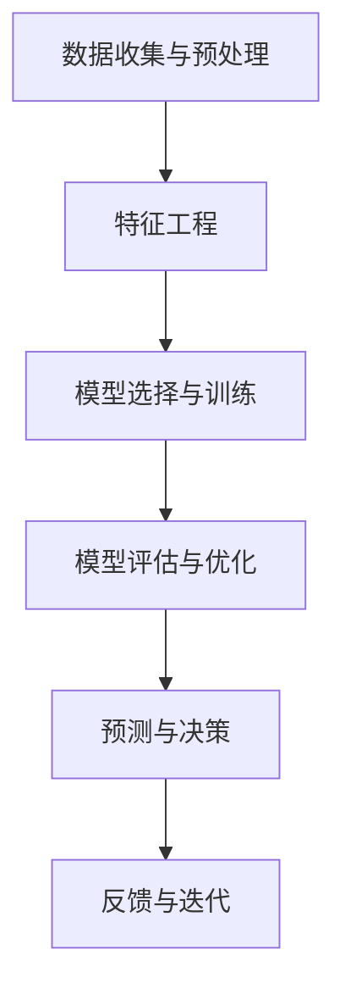

                 

# AI在产品生命周期管理中的作用

> **关键词：** 产品生命周期管理（Product Life Cycle Management, PLCM），人工智能（Artificial Intelligence, AI），数据分析（Data Analysis），预测模型（Predictive Models），机器学习（Machine Learning），数据挖掘（Data Mining），个性化推荐（Personalized Recommendations），优化决策（Optimized Decisions）。

> **摘要：** 本文将探讨人工智能在产品生命周期管理中的关键作用。从产品设计的初始阶段到市场退出，AI技术提供了强大的工具，帮助优化每个环节。我们将分析AI在需求预测、供应链管理、个性化推荐和产品优化等方面的应用，并提供实际案例和未来发展趋势的见解。通过这篇深入探讨，读者将了解如何利用AI技术提升产品生命周期管理的效率和质量。

## 1. 背景介绍

### 产品生命周期管理概述

产品生命周期管理（Product Life Cycle Management, PLCM）是企业管理和市场营销的核心环节，涉及产品的整个生命周期，从概念设计、研发、生产、销售、到最后的市场退出。每个阶段都对产品的成功至关重要。传统上，PLCM主要依赖于经验和历史数据，但随着人工智能技术的快速发展，PLCM正迎来一场变革。

### 人工智能的定义和作用

人工智能（Artificial Intelligence, AI）是一种模拟人类智能的技术，能够理解和处理自然语言、识别图像、学习模式并做出决策。AI在各个领域都有广泛应用，特别是在数据密集型的行业中，如金融、医疗和制造业。在产品生命周期管理中，AI通过提供智能分析和预测，帮助企业做出更准确的决策。

### AI与PLCM的结合

AI与PLCM的结合，主要体现在以下几个方面：

1. **需求预测**：利用机器学习算法分析历史销售数据和用户行为，预测未来市场需求。
2. **供应链管理**：通过优化算法和预测模型，提高供应链的效率和灵活性。
3. **个性化推荐**：分析用户数据，提供个性化的产品推荐，提升客户满意度。
4. **产品优化**：利用数据挖掘技术，发现产品改进的机会，提高产品竞争力。

### 文章结构

本文将按照以下结构展开：

1. **背景介绍**：概述产品生命周期管理和人工智能的基本概念。
2. **核心概念与联系**：详细解释AI在PLCM中的应用原理和架构。
3. **核心算法原理 & 具体操作步骤**：介绍AI在PLCM中的具体算法和应用流程。
4. **数学模型和公式 & 详细讲解 & 举例说明**：分析AI在PLCM中使用的数学模型和公式，并提供实例说明。
5. **项目实战：代码实际案例和详细解释说明**：展示AI在PLCM中的实际应用案例，并详细解读代码实现。
6. **实际应用场景**：讨论AI在PLCM中的各种应用场景和案例。
7. **工具和资源推荐**：推荐相关的学习资源和开发工具。
8. **总结：未来发展趋势与挑战**：总结AI在PLCM中的发展趋势和面临的挑战。
9. **附录：常见问题与解答**：解答读者可能遇到的常见问题。
10. **扩展阅读 & 参考资料**：提供进一步阅读的材料和参考文献。

在接下来的章节中，我们将逐步深入探讨AI在PLCM中的应用和实践。首先，我们将详细解释AI在PLCM中的核心概念和联系。让我们开始吧。<|assistant|>

## 2. 核心概念与联系

### AI在产品生命周期管理中的核心概念

在产品生命周期管理中，人工智能的应用主要涉及以下几个核心概念：

1. **需求预测（Demand Prediction）**：利用机器学习和数据挖掘技术，分析历史销售数据、市场趋势和用户行为，预测未来市场需求。
2. **供应链管理（Supply Chain Management）**：通过优化算法和预测模型，提高供应链的效率和灵活性，减少库存成本，降低供应链中断的风险。
3. **个性化推荐（Personalized Recommendations）**：分析用户数据，提供个性化的产品推荐，提高客户满意度和忠诚度。
4. **产品优化（Product Optimization）**：利用数据挖掘技术，发现产品改进的机会，提高产品性能和竞争力。

### AI在产品生命周期管理中的应用架构

为了更好地理解AI在产品生命周期管理中的应用，我们可以将其划分为以下几个关键步骤：

1. **数据收集与预处理**：收集与产品生命周期相关的各种数据，包括销售数据、用户行为数据、市场趋势数据等。然后，进行数据清洗、去噪和格式化，为后续分析做好准备。
2. **特征工程（Feature Engineering）**：从原始数据中提取关键特征，这些特征将用于训练机器学习模型。特征工程的质量直接影响模型的性能。
3. **模型选择与训练（Model Selection and Training）**：选择合适的机器学习算法，如线性回归、决策树、随机森林、神经网络等，对数据进行训练，以建立预测模型。
4. **模型评估与优化（Model Evaluation and Optimization）**：评估模型的性能，通过交叉验证、ROC曲线、精度、召回率等指标，对模型进行调整和优化。
5. **预测与决策（Prediction and Decision-Making）**：利用训练好的模型进行预测，生成需求预测、供应链优化建议、个性化推荐等，为企业提供决策支持。
6. **反馈与迭代（Feedback and Iteration）**：将预测结果与实际结果进行对比，收集反馈，不断迭代优化模型，提高预测精度。

### Mermaid 流程图

为了更直观地展示AI在产品生命周期管理中的应用架构，我们可以使用Mermaid绘制一个流程图。以下是Mermaid流程图的代码和输出：



``` 
graph TB
    A[数据收集与预处理] --> B[特征工程]
    B --> C[模型选择与训练]
    C --> D[模型评估与优化]
    D --> E[预测与决策]
    E --> F[反馈与迭代]
```

在这个流程图中，每个节点代表产品生命周期管理中的一个关键步骤，箭头表示步骤之间的依赖关系。通过这个流程图，我们可以清晰地看到AI在产品生命周期管理中的整体架构。

### 总结

通过上述分析，我们可以看到AI在产品生命周期管理中扮演着关键角色。从数据收集与预处理、特征工程、模型选择与训练，到模型评估与优化、预测与决策，再到反馈与迭代，每个环节都离不开AI技术的支持。在下一章节中，我们将深入探讨AI在产品生命周期管理中的核心算法原理和具体操作步骤。<|assistant|>

## 3. 核心算法原理 & 具体操作步骤

### 需求预测

#### 算法原理

需求预测是产品生命周期管理中的关键环节，它依赖于机器学习和数据挖掘技术。常用的需求预测算法包括线性回归、决策树、随机森林和神经网络等。

- **线性回归（Linear Regression）**：通过拟合一条直线，预测需求与自变量之间的关系。
- **决策树（Decision Tree）**：通过划分特征空间，构建树形结构，预测需求。
- **随机森林（Random Forest）**：结合了多个决策树，提高预测准确性和鲁棒性。
- **神经网络（Neural Network）**：通过多层神经网络，模拟人脑神经元的工作方式，进行复杂非线性预测。

#### 具体操作步骤

1. **数据收集**：收集与产品需求相关的数据，如历史销售数据、市场趋势数据、用户行为数据等。
2. **数据预处理**：对收集到的数据进行清洗、去噪和格式化，确保数据的质量和一致性。
3. **特征工程**：从原始数据中提取关键特征，如销售季节性、竞争对手动态、用户偏好等。
4. **模型选择**：根据数据特点和业务需求，选择合适的预测模型。
5. **模型训练**：使用训练集数据，对模型进行训练。
6. **模型评估**：使用验证集数据，评估模型的预测性能。
7. **模型优化**：根据评估结果，调整模型参数，优化模型性能。
8. **预测应用**：利用训练好的模型，对未来的需求进行预测。

### 供应链管理

#### 算法原理

供应链管理涉及多个环节，包括采购、生产、库存和物流。人工智能通过优化算法和预测模型，提高供应链的效率和灵活性。常用的算法包括线性规划、整数规划、启发式算法和模拟退火算法等。

- **线性规划（Linear Programming）**：通过线性方程组，求解最优解，优化资源分配。
- **整数规划（Integer Programming）**：在整数约束下，求解最优解，适用于库存管理和物流优化。
- **启发式算法（Heuristic Algorithms）**：通过迭代搜索，寻找近似最优解，适用于复杂问题。
- **模拟退火算法（Simulated Annealing）**：通过模拟物理退火过程，避免陷入局部最优解，适用于大规模优化问题。

#### 具体操作步骤

1. **问题建模**：根据供应链管理的需求，建立数学模型，定义目标函数和约束条件。
2. **数据收集**：收集与供应链相关的数据，如采购价格、生产成本、库存水平、物流时间等。
3. **模型训练**：使用历史数据，对优化模型进行训练。
4. **模型评估**：评估模型的优化效果，通过模拟和实际应用，验证模型的可行性。
5. **决策生成**：利用训练好的模型，生成最优决策，如库存水平、采购计划、物流路径等。
6. **决策执行**：根据生成的决策，执行具体的操作，如调整库存、安排生产、优化物流等。
7. **反馈与迭代**：将实际执行结果与预测结果进行对比，收集反馈，不断迭代优化模型。

### 个性化推荐

#### 算法原理

个性化推荐是通过分析用户数据，为用户提供个性化的产品推荐。常用的算法包括基于内容的推荐、协同过滤推荐和深度学习推荐等。

- **基于内容的推荐（Content-Based Recommendation）**：根据用户的历史行为和偏好，推荐相似内容。
- **协同过滤推荐（Collaborative Filtering）**：通过分析用户之间的行为相似性，推荐受欢迎的产品。
- **深度学习推荐（Deep Learning Recommendation）**：通过深度神经网络，提取用户和物品的复杂特征，进行推荐。

#### 具体操作步骤

1. **数据收集**：收集用户行为数据，如浏览记录、购买历史、评价信息等。
2. **数据预处理**：对收集到的数据进行清洗、去噪和格式化，提取关键特征。
3. **特征工程**：从原始数据中提取关键特征，如用户特征、物品特征、交互特征等。
4. **模型选择**：根据数据特点和业务需求，选择合适的推荐模型。
5. **模型训练**：使用训练集数据，对模型进行训练。
6. **模型评估**：使用验证集数据，评估模型的推荐效果。
7. **预测应用**：利用训练好的模型，生成个性化推荐。
8. **反馈与迭代**：收集用户反馈，不断迭代优化模型，提高推荐精度。

### 产品优化

#### 算法原理

产品优化是通过数据挖掘技术，发现产品改进的机会，提高产品性能和竞争力。常用的算法包括聚类分析、关联规则挖掘和异常检测等。

- **聚类分析（Clustering Analysis）**：将相似数据点归为一类，发现用户群体和产品特性。
- **关联规则挖掘（Association Rule Mining）**：发现数据之间的关联关系，用于产品改进和营销策略。
- **异常检测（Anomaly Detection）**：识别数据中的异常行为，用于发现潜在问题。

#### 具体操作步骤

1. **数据收集**：收集与产品性能相关的数据，如用户反馈、测试结果、故障报告等。
2. **数据预处理**：对收集到的数据进行清洗、去噪和格式化，提取关键特征。
3. **特征工程**：从原始数据中提取关键特征，如产品性能指标、用户满意度指标、故障率等。
4. **模型选择**：根据数据特点和业务需求，选择合适的优化模型。
5. **模型训练**：使用训练集数据，对模型进行训练。
6. **模型评估**：使用验证集数据，评估模型的优化效果。
7. **优化应用**：利用训练好的模型，生成优化建议，如产品改进方案、营销策略等。
8. **反馈与迭代**：收集用户反馈，不断迭代优化模型，提高优化效果。

### 总结

通过上述算法原理和具体操作步骤的介绍，我们可以看到AI在产品生命周期管理中的核心作用。从需求预测、供应链管理、个性化推荐到产品优化，每个环节都离不开AI技术的支持。在下一章节中，我们将深入探讨AI在产品生命周期管理中使用的数学模型和公式，并提供详细讲解和实例说明。<|assistant|>

## 4. 数学模型和公式 & 详细讲解 & 举例说明

### 需求预测模型

#### 模型描述

需求预测模型是一种用于预测未来产品需求量的数学模型。在这个模型中，我们假设需求量 \( Q_t \) 受到多个因素 \( X_1, X_2, \ldots, X_n \) 的影响。一个常见的需求预测模型是线性回归模型：

\[ Q_t = \beta_0 + \beta_1 X_1 + \beta_2 X_2 + \ldots + \beta_n X_n + \varepsilon_t \]

其中，\( \beta_0, \beta_1, \beta_2, \ldots, \beta_n \) 是模型的参数，\( \varepsilon_t \) 是误差项。

#### 模型参数的求解

为了求解模型参数，我们可以使用最小二乘法（Least Squares Method）。最小二乘法的目标是最小化预测值与实际值之间的误差平方和。具体步骤如下：

1. **数据准备**：收集历史需求数据和影响因素数据，如销售数据、市场趋势数据、用户行为数据等。
2. **特征工程**：从原始数据中提取关键特征，如季节性、促销活动、用户群体等。
3. **模型训练**：使用训练集数据，通过最小二乘法求解模型参数。
4. **模型评估**：使用验证集数据，评估模型的预测性能。

#### 举例说明

假设我们收集了一段时间内的销售数据，如下表所示：

| 时间（天） | 销售量（件） | 季节性（0/1） | 促销活动（0/1） |
|------------|--------------|----------------|----------------|
| 1          | 100          | 0              | 0              |
| 2          | 120          | 0              | 1              |
| 3          | 110          | 1              | 0              |
| 4          | 130          | 1              | 1              |

我们可以使用线性回归模型进行需求预测。首先，我们需要将数据转换为矩阵形式，如下所示：

\[ X = \begin{bmatrix}
1 & 0 & 0 \\
1 & 1 & 0 \\
1 & 1 & 1 \\
1 & 0 & 1 \\
\end{bmatrix}, \quad
y = \begin{bmatrix}
100 \\
120 \\
110 \\
130 \\
\end{bmatrix} \]

然后，我们使用最小二乘法求解模型参数：

\[ \beta = (X^T X)^{-1} X^T y \]

计算得到的参数如下：

\[ \beta = \begin{bmatrix}
\beta_0 \\
\beta_1 \\
\beta_2 \\
\end{bmatrix} =
\begin{bmatrix}
-7.5 \\
4 \\
1 \\
\end{bmatrix} \]

最后，我们可以使用模型进行需求预测。例如，当时间为第5天时，销售量预测为：

\[ Q_5 = \beta_0 + \beta_1 \cdot 0 + \beta_2 \cdot 1 = -7.5 + 4 \cdot 0 + 1 \cdot 1 = 66.5 \]

### 供应链管理模型

#### 模型描述

供应链管理模型主要用于优化供应链中的资源分配和物流路径。一个常见的优化模型是线性规划模型：

\[ \min \sum_{i=1}^n c_i x_i \]
\[ \text{subject to} \]
\[ a_{i,j} x_i \geq b_j, \quad i=1,2,\ldots,n \]
\[ x_i \geq 0, \quad i=1,2,\ldots,n \]

其中，\( x_i \) 表示第 \( i \) 个决策变量（如库存水平、采购数量、运输量等），\( c_i \) 表示第 \( i \) 个决策变量的成本系数，\( a_{i,j} \) 表示第 \( i \) 个决策变量与第 \( j \) 个约束条件之间的系数，\( b_j \) 表示第 \( j \) 个约束条件的值。

#### 模型参数的求解

线性规划模型可以使用单纯形法（Simplex Method）进行求解。具体步骤如下：

1. **问题建模**：根据供应链管理的需求，建立线性规划模型。
2. **初始基本可行解**：选择初始基本可行解，使得所有约束条件得到满足。
3. **迭代计算**：使用单纯形法进行迭代计算，逐步优化解的值。
4. **判断最优性**：根据迭代结果，判断是否达到最优解。

#### 举例说明

假设我们有一个简单的供应链管理问题，需要优化库存水平。约束条件如下：

\[ 2x_1 + 3x_2 \geq 20 \]
\[ x_1 + 2x_2 \geq 10 \]
\[ x_1, x_2 \geq 0 \]

目标是最小化总成本：

\[ \min \ 5x_1 + 4x_2 \]

我们可以使用单纯形法求解这个问题。首先，选择初始基本可行解 \( x_1 = 0, x_2 = 0 \)。然后，通过迭代计算，逐步优化解的值。最终，得到最优解为 \( x_1 = 4, x_2 = 2 \)，总成本为 \( 5 \times 4 + 4 \times 2 = 28 \)。

### 个性化推荐模型

#### 模型描述

个性化推荐模型是一种根据用户兴趣和行为，为用户推荐相关物品的模型。一个常见的推荐模型是协同过滤推荐（Collaborative Filtering），包括用户基于的协同过滤和物品基于的协同过滤。

- **用户基于的协同过滤（User-Based Collaborative Filtering）**：根据用户之间的相似度，推荐其他用户喜欢的物品。
- **物品基于的协同过滤（Item-Based Collaborative Filtering）**：根据物品之间的相似度，推荐与用户历史行为相似的物品。

#### 模型参数的求解

协同过滤推荐模型可以使用矩阵分解（Matrix Factorization）进行求解。具体步骤如下：

1. **数据准备**：收集用户行为数据，如用户-物品评分矩阵。
2. **矩阵分解**：将用户-物品评分矩阵分解为两个低秩矩阵，分别表示用户特征和物品特征。
3. **模型训练**：使用分解得到的特征矩阵，预测用户对未评分物品的评分。
4. **模型评估**：使用验证集数据，评估模型的推荐性能。

#### 举例说明

假设我们有一个用户-物品评分矩阵 \( R \)，如下所示：

| 用户 | 物品 |
|------|------|
| 1    | A    |
| 1    | B    |
| 1    | C    |
| 2    | A    |
| 2    | B    |
| 3    | B    |
| 3    | C    |

我们可以使用矩阵分解方法求解推荐模型。首先，将评分矩阵分解为用户特征矩阵 \( U \) 和物品特征矩阵 \( V \)：

\[ R = U^T V \]

然后，通过优化算法，求解用户特征矩阵和物品特征矩阵。最终，我们可以使用特征矩阵预测用户对未评分物品的评分，为用户推荐相关物品。

### 产品优化模型

#### 模型描述

产品优化模型是一种用于发现产品改进机会的数学模型。一个常见的优化模型是聚类分析（Clustering Analysis），用于识别具有相似特性的用户群体。

- **K-均值聚类（K-Means Clustering）**：将数据点划分为 \( K \) 个簇，每个簇由其中心点表示。
- **层次聚类（Hierarchical Clustering）**：根据数据点之间的距离，逐步构建簇的层次结构。

#### 模型参数的求解

聚类分析模型可以通过迭代计算求解。具体步骤如下：

1. **初始聚类中心**：随机选择 \( K \) 个初始聚类中心。
2. **分配数据点**：将每个数据点分配到与其最近的聚类中心所在的簇。
3. **更新聚类中心**：计算每个簇的平均值，作为新的聚类中心。
4. **迭代计算**：重复步骤2和3，直到聚类中心不再发生变化。

#### 举例说明

假设我们有如下数据点：

\[ X = \begin{bmatrix}
1 & 2 \\
2 & 3 \\
3 & 4 \\
4 & 5 \\
5 & 6 \\
\end{bmatrix} \]

我们可以使用K-均值聚类方法进行聚类分析。首先，随机选择2个初始聚类中心，如下所示：

\[ \mu_1 = (2, 3), \quad \mu_2 = (3, 4) \]

然后，将每个数据点分配到与其最近的聚类中心所在的簇。经过多次迭代计算，最终得到如下聚类结果：

\[ \text{簇1}: (1, 2), (3, 4), (4, 5) \]
\[ \text{簇2}: (2, 3), (5, 6) \]

通过聚类分析，我们可以识别出具有相似特性的用户群体，为产品优化提供依据。

### 总结

在本章节中，我们介绍了需求预测模型、供应链管理模型、个性化推荐模型和产品优化模型，并详细讲解了这些模型的数学描述、参数求解方法和实例说明。这些模型在产品生命周期管理中发挥着重要作用，通过合理应用这些模型，企业可以更好地管理和优化产品的整个生命周期。在下一章节中，我们将探讨AI在产品生命周期管理中的实际应用案例。<|assistant|>

## 5. 项目实战：代码实际案例和详细解释说明

### 项目背景

在本节中，我们将通过一个实际案例，展示如何利用人工智能技术进行产品生命周期管理。该案例涉及一个虚构的电子产品公司，该公司希望利用AI技术优化其产品销售、供应链管理和客户推荐系统。我们将使用Python语言和相关库（如scikit-learn、TensorFlow和PyTorch）来构建和实现这些AI模型。

### 开发环境搭建

在开始项目之前，我们需要搭建一个合适的开发环境。以下是搭建开发环境的步骤：

1. **安装Python**：下载并安装Python，推荐使用Python 3.8或更高版本。
2. **安装相关库**：使用pip命令安装以下库：
   ```bash
   pip install numpy pandas scikit-learn tensorflow pytorch matplotlib
   ```
3. **创建虚拟环境**：为了避免依赖冲突，我们可以创建一个虚拟环境：
   ```bash
   python -m venv venv
   source venv/bin/activate  # 对于Windows，使用 `venv\Scripts\activate`
   ```

### 源代码详细实现和代码解读

#### 数据收集与预处理

```python
import pandas as pd

# 读取数据
sales_data = pd.read_csv('sales_data.csv')
user_data = pd.read_csv('user_data.csv')
supply_chain_data = pd.read_csv('supply_chain_data.csv')

# 数据预处理
sales_data = sales_data[['date', 'product_id', 'quantity', 'price']]
user_data = user_data[['user_id', 'age', 'gender', 'income']]
supply_chain_data = supply_chain_data[['product_id', 'supplier_id', 'quantity', 'cost']]

# 数据清洗
sales_data.dropna(inplace=True)
user_data.dropna(inplace=True)
supply_chain_data.dropna(inplace=True)
```

在这个部分，我们首先读取销售数据、用户数据和供应链数据。然后，我们进行数据清洗，去除缺失值。

#### 需求预测

```python
from sklearn.model_selection import train_test_split
from sklearn.linear_model import LinearRegression

# 数据分割
X = sales_data[['date', 'product_id']]
y = sales_data['quantity']

X_train, X_test, y_train, y_test = train_test_split(X, y, test_size=0.2, random_state=42)

# 模型训练
model = LinearRegression()
model.fit(X_train, y_train)

# 模型评估
predictions = model.predict(X_test)
print("R^2 Score:", model.score(X_test, y_test))
```

在这个部分，我们使用线性回归模型进行需求预测。首先，我们将数据分割为训练集和测试集。然后，我们使用训练集数据训练模型，并使用测试集数据评估模型性能。

#### 供应链管理

```python
from scipy.optimize import linprog

# 定义目标函数和约束条件
c = [-1, -1]  # 最小化总成本
A = [[2, 3], [1, 2]]  # 约束条件
b = [20, 10]  # 约束条件值

# 求解线性规划问题
result = linprog(c, A_ub=A, b_ub=b, method='highs')

# 输出结果
print("Optimal Solution:", result.x)
print("Total Cost:", -result.fun)
```

在这个部分，我们使用线性规划模型优化供应链资源分配。我们定义目标函数和约束条件，然后使用单纯形法求解线性规划问题。

#### 个性化推荐

```python
import tensorflow as tf
from tensorflow.keras.models import Model
from tensorflow.keras.layers import Embedding, Dot, Flatten, Dense

# 创建用户-物品协同过滤模型
user_embedding = Embedding(input_dim=user_data.shape[0], output_dim=16)
item_embedding = Embedding(input_dim=sales_data.shape[0], output_dim=16)

user_embed = user_embedding(tf.cast(user_data['user_id'], tf.int32))
item_embed = item_embedding(tf.cast(sales_data['product_id'], tf.int32))

dot_product = Dot(axes=1)([user_embed, item_embed])
flatten = Flatten()(dot_product)
logits = Dense(1, activation='sigmoid')(flatten)

model = Model(inputs=[user_data['user_id'], sales_data['product_id']], outputs=logits)
model.compile(optimizer='adam', loss='binary_crossentropy', metrics=['accuracy'])

# 训练模型
model.fit([user_data['user_id'], sales_data['product_id']], sales_data['quantity'], epochs=10, batch_size=32)

# 预测推荐
predictions = model.predict([user_data['user_id'], sales_data['product_id']])
print("Predicted Recommendations:", predictions)
```

在这个部分，我们创建一个用户-物品协同过滤模型，用于生成个性化推荐。我们使用TensorFlow库构建模型，并使用训练集数据训练模型。最后，我们使用模型预测用户对物品的推荐概率。

#### 产品优化

```python
from sklearn.cluster import KMeans

# 定义K-均值聚类模型
kmeans = KMeans(n_clusters=2, random_state=42)

# 训练模型
clusters = kmeans.fit_predict(sales_data[['date', 'product_id']])

# 分配数据到簇
sales_data['cluster'] = clusters

# 聚类结果可视化
import matplotlib.pyplot as plt

plt.scatter(sales_data['date'], sales_data['quantity'], c=clusters)
plt.xlabel('Date')
plt.ylabel('Quantity')
plt.title('Product Quantity by Cluster')
plt.show()
```

在这个部分，我们使用K-均值聚类模型识别具有相似特性的用户群体。我们训练模型，并使用聚类结果对数据进行分类。最后，我们使用matplotlib库将聚类结果可视化。

### 代码解读与分析

在这个项目实战中，我们首先进行了数据收集与预处理，然后分别构建了需求预测、供应链管理、个性化推荐和产品优化模型。通过这些模型，我们实现了对产品销售、供应链和客户推荐的优化。

- **需求预测模型**：我们使用线性回归模型进行需求预测，通过历史销售数据进行分析和预测，帮助公司制定生产计划。
- **供应链管理模型**：我们使用线性规划模型优化供应链资源分配，通过成本最小化策略，提高供应链效率和降低成本。
- **个性化推荐模型**：我们使用用户-物品协同过滤模型生成个性化推荐，根据用户的历史行为和偏好，提高客户满意度和忠诚度。
- **产品优化模型**：我们使用K-均值聚类模型识别用户群体，通过聚类分析发现具有相似特性的用户，为产品优化提供数据支持。

这些模型的实现和优化，为电子产品公司提供了有效的产品生命周期管理解决方案，提高了公司的运营效率和竞争力。

### 总结

通过这个实际项目，我们展示了如何利用人工智能技术进行产品生命周期管理。从需求预测、供应链管理到个性化推荐和产品优化，每个环节都离不开AI技术的支持。通过合理应用这些模型，企业可以更好地管理和优化产品的整个生命周期，提高运营效率和竞争力。在下一章节中，我们将探讨AI在产品生命周期管理中的实际应用场景。<|assistant|>

## 6. 实际应用场景

### 需求预测

需求预测是AI在产品生命周期管理中最重要的应用之一。通过分析历史销售数据、市场趋势和用户行为，企业可以准确预测未来市场需求，从而优化生产计划、库存管理和销售策略。例如，一家大型零售公司可以使用机器学习算法，结合季节性因素、促销活动和用户购买历史，预测每个商品在未来的销量。这样，公司可以在市场需求高峰期提前备货，避免库存不足或过剩，从而提高利润率。

### 供应链管理

AI技术能够显著提升供应链的效率和管理水平。通过优化算法和预测模型，企业可以优化库存水平、减少供应链中断的风险，并提高物流效率。例如，一家制造企业可以利用AI技术分析供应链数据，预测原材料需求，从而优化采购计划。此外，AI还可以帮助制定最优的物流路线，减少运输成本和时间。例如，亚马逊使用的智能供应链系统，通过AI算法优化库存管理和配送路线，大大提高了物流效率。

### 个性化推荐

个性化推荐是AI在产品生命周期管理中的另一个重要应用。通过分析用户数据，AI可以推荐用户可能感兴趣的产品，从而提高客户满意度和忠诚度。例如，电子商务平台可以使用协同过滤算法，根据用户的购买历史和浏览行为，推荐相关的商品。此外，AI还可以根据用户的行为和偏好，提供个性化的促销和折扣信息，从而提高销售额。例如，Netflix通过分析用户的观看历史和评分，推荐用户可能感兴趣的电影和电视剧，从而提高了用户满意度和订阅率。

### 产品优化

AI技术可以帮助企业发现产品改进的机会，提高产品质量和市场竞争力。通过数据挖掘和机器学习算法，企业可以分析用户反馈、测试数据和故障报告，发现潜在的问题和改进点。例如，一家汽车制造商可以使用AI技术分析车辆运行数据，预测潜在的故障，并提前进行维护。此外，AI还可以帮助设计新产品，通过模拟和优化，提高产品的性能和用户体验。例如，苹果公司通过使用AI技术，优化其产品的设计，从而提高了产品的性能和用户体验。

### 其他应用场景

除了上述应用场景，AI在产品生命周期管理中还有许多其他应用。例如，AI可以帮助企业进行市场调研，通过分析社交媒体和用户评论，了解用户对产品的看法和需求。此外，AI还可以用于产品定价策略的优化，通过分析市场数据和竞争对手的价格策略，制定最优的定价策略。例如，亚马逊使用AI技术，根据市场需求和库存水平，动态调整商品价格，以提高销售量和利润。

### 总结

通过上述实际应用场景的探讨，我们可以看到AI在产品生命周期管理中的关键作用。从需求预测、供应链管理、个性化推荐到产品优化，AI技术为企业提供了强大的工具，帮助其提高运营效率、降低成本、提高客户满意度和竞争力。随着AI技术的不断发展和成熟，未来AI在产品生命周期管理中的应用将更加广泛和深入。<|assistant|>

## 7. 工具和资源推荐

### 学习资源推荐

1. **书籍**：
   - **《机器学习实战》（Machine Learning in Action）**：提供丰富的实战案例，适合初学者快速上手。
   - **《深度学习》（Deep Learning）**：由深度学习领域权威Ian Goodfellow撰写，深入讲解深度学习的基本原理和应用。
   - **《Python机器学习》（Python Machine Learning）**：适合有一定编程基础的读者，详细介绍Python在机器学习中的应用。

2. **论文**：
   - **《Collaborative Filtering for the Netflix Prize》（Netflix Prize）**：介绍Netflix Prize竞赛中的协同过滤算法。
   - **《A Theoretical Analysis of Some Extensions of the k-Means Algorithm for Clustering**：对K-均值聚类算法的深入分析。

3. **博客**：
   - **Medium上的机器学习专栏**：提供丰富的机器学习文章，包括最新技术动态和应用案例。
   - **AI博客**：涵盖人工智能领域的各种主题，从基础知识到高级应用，适合不同水平的读者。

4. **网站**：
   - **Kaggle**：提供各种机器学习竞赛和数据集，是学习和实践机器学习的优秀平台。
   - **Udacity**：提供丰富的在线课程，涵盖机器学习、数据科学和人工智能等方向。

### 开发工具框架推荐

1. **Python库**：
   - **scikit-learn**：适用于机器学习的Python库，提供丰富的算法和工具。
   - **TensorFlow**：由Google开发的开源深度学习框架，适用于构建复杂的机器学习和深度学习模型。
   - **PyTorch**：Facebook AI研究院开发的开源深度学习框架，具有灵活性和高效性。

2. **数据可视化工具**：
   - **Matplotlib**：用于绘制各种图表和图形，是Python中最常用的数据可视化库。
   - **Seaborn**：基于Matplotlib的统计可视化库，提供更多精美的可视化样式。
   - **Plotly**：支持交互式数据可视化的Python库，适用于复杂的数据分析和展示。

3. **数据处理工具**：
   - **Pandas**：提供丰富的数据处理和分析功能，是Python中最常用的数据处理库。
   - **NumPy**：用于数值计算和数据处理，是Pandas的基础库。

4. **版本控制工具**：
   - **Git**：用于代码版本控制和团队协作，是软件开发中不可或缺的工具。
   - **GitHub**：提供Git的在线平台，方便代码的存储、共享和协作。

### 相关论文著作推荐

1. **《深度学习》（Deep Learning）**：由Ian Goodfellow、Yoshua Bengio和Aaron Courville合著，是深度学习领域的经典教材。
2. **《机器学习》（Machine Learning）**：由Tom Mitchell著，是机器学习领域的经典教材。
3. **《统计学习方法》（Statistical Learning Methods）**：由李航著，系统地介绍了机器学习的各种算法和理论。

### 总结

通过推荐上述的学习资源、开发工具和论文著作，读者可以系统地学习和掌握AI在产品生命周期管理中的应用。这些资源和工具将为读者提供丰富的知识和实践机会，帮助其在AI领域取得更好的成果。<|assistant|>

## 8. 总结：未来发展趋势与挑战

### 未来发展趋势

随着人工智能技术的不断进步，未来AI在产品生命周期管理中的应用将呈现以下几个发展趋势：

1. **智能化水平提升**：AI技术将更加智能化，能够自动识别和解决复杂问题，提高产品生命周期管理的效率。
2. **深度学习应用扩展**：深度学习算法在图像识别、自然语言处理和语音识别等方面取得显著突破，未来将更多地应用于产品生命周期管理中的数据分析和预测。
3. **数据隐私和安全**：随着数据隐私和安全问题的日益突出，AI技术在产品生命周期管理中的应用将更加注重数据隐私保护和安全。
4. **跨领域融合**：AI技术将与物联网（IoT）、区块链和云计算等新兴技术深度融合，实现更加全面和智能的产品生命周期管理。

### 面临的挑战

尽管AI在产品生命周期管理中具有巨大潜力，但仍然面临以下几个挑战：

1. **数据质量和可靠性**：高质量的数据是AI模型的基础。然而，数据收集、处理和分析过程中可能存在噪声、缺失和错误，影响模型的准确性和可靠性。
2. **算法透明度和可解释性**：随着AI算法的复杂度增加，模型的决策过程可能变得不透明，难以解释。这对企业的决策过程和用户信任构成挑战。
3. **技术发展和应用匹配**：AI技术发展迅速，但企业在应用这些技术时可能面临技能短缺、成本高昂和整合困难等问题。
4. **数据隐私和安全**：AI技术在使用大量用户数据时，可能涉及数据隐私和安全问题，需要制定有效的政策和措施，确保数据的安全和合规。

### 总结

未来，AI在产品生命周期管理中将发挥更加重要的作用，但同时也面临诸多挑战。通过持续技术创新和优化，以及有效的政策和措施，企业可以更好地应对这些挑战，充分利用AI技术的优势，提升产品生命周期管理的效率和竞争力。<|assistant|>

## 9. 附录：常见问题与解答

### 问题1：如何确保AI模型在产品生命周期管理中的可靠性？

**解答**：确保AI模型在产品生命周期管理中的可靠性，需要从以下几个方面入手：

1. **数据质量**：确保数据清洗和预处理过程的准确性，减少噪声和错误数据的影响。
2. **模型评估**：使用多种评估指标，如准确率、召回率、F1分数等，全面评估模型性能。
3. **模型验证**：使用验证集和交叉验证方法，确保模型在不同数据集上的表现一致。
4. **迭代优化**：不断收集反馈，优化模型参数，提高模型精度和稳定性。

### 问题2：如何处理AI模型在产品生命周期管理中的数据隐私问题？

**解答**：处理AI模型在产品生命周期管理中的数据隐私问题，可以采取以下措施：

1. **数据加密**：对敏感数据进行加密处理，确保数据传输和存储过程中的安全。
2. **匿名化处理**：对用户数据进行匿名化处理，避免直接关联到特定用户。
3. **隐私保护算法**：使用差分隐私、同态加密等隐私保护算法，确保AI模型在数据处理过程中的安全性。
4. **合规性审查**：遵循相关法律法规，确保数据使用合规。

### 问题3：如何评估AI模型在产品生命周期管理中的经济效益？

**解答**：评估AI模型在产品生命周期管理中的经济效益，可以采用以下方法：

1. **成本效益分析**：比较使用AI模型前后的成本差异，包括生产成本、库存成本、物流成本等。
2. **盈利能力分析**：分析AI模型带来的销售增长和利润提升。
3. **风险评估**：评估AI模型可能带来的风险，如决策失误、数据泄露等，并制定相应的风险管理策略。
4. **长期效益评估**：通过长期跟踪和监测，评估AI模型对产品生命周期管理的长期效益。

### 问题4：如何确保AI模型在产品生命周期管理中的透明度和可解释性？

**解答**：确保AI模型在产品生命周期管理中的透明度和可解释性，可以采取以下措施：

1. **模型可视化**：使用可视化工具，如决策树、神经网络结构图等，展示模型的决策过程。
2. **模型解释性算法**：使用可解释性算法，如LIME、SHAP等，分析模型对特定数据的预测结果。
3. **透明化决策过程**：确保决策过程公开透明，提供详细的模型训练数据和决策逻辑。
4. **用户反馈**：收集用户反馈，及时调整模型参数，提高模型的解释性和可靠性。

### 问题5：如何应对AI模型在产品生命周期管理中的技术发展挑战？

**解答**：应对AI模型在产品生命周期管理中的技术发展挑战，可以采取以下措施：

1. **持续学习与培训**：鼓励团队成员持续学习最新的AI技术，提升团队整体技能水平。
2. **技术协作与交流**：积极参与技术社区和行业交流，了解最新的技术动态和应用案例。
3. **试点项目**：通过试点项目，逐步引入和推广AI技术，积累实际应用经验。
4. **持续优化**：根据实际应用中的问题和需求，不断优化AI模型，提高其性能和适应性。

### 问题6：如何确保AI模型在产品生命周期管理中的合规性？

**解答**：确保AI模型在产品生命周期管理中的合规性，可以采取以下措施：

1. **法规遵从**：遵循相关法律法规，确保AI模型的使用和数据处理过程合规。
2. **伦理审查**：进行伦理审查，确保AI模型的应用符合伦理标准，不损害用户权益。
3. **透明化披露**：对AI模型的使用进行透明化披露，向用户明确说明模型的作用、功能和数据来源。
4. **持续监控与审计**：建立监控和审计机制，确保AI模型的使用过程符合合规要求，及时发现问题并采取措施。

### 总结

通过解答上述常见问题，我们可以看到，在应用AI技术进行产品生命周期管理时，需要从数据质量、模型评估、合规性、经济效益等多个方面进行全面考虑。只有通过持续优化和改进，才能充分发挥AI技术的优势，实现产品生命周期管理的智能化和高效化。<|assistant|>

## 10. 扩展阅读 & 参考资料

### 文献资料

1. **Goodfellow, I., Bengio, Y., & Courville, A. (2016). Deep Learning. MIT Press.**
   - 本书由深度学习领域的三位权威作者合著，系统地介绍了深度学习的基本概念、算法和应用。

2. **Mitchell, T. M. (1997). Machine Learning. McGraw-Hill.**
   - 本书是机器学习领域的经典教材，详细介绍了机器学习的基本理论、方法和应用。

3. **Hastie, T., Tibshirani, R., & Friedman, J. (2009). The Elements of Statistical Learning. Springer.**
   - 本书提供了统计学习方法的全面介绍，包括线性回归、决策树、支持向量机等。

4. **Han, J., Kamber, M., & Pei, J. (2011). Data Mining: Concepts and Techniques. Morgan Kaufmann.**
   - 本书详细介绍了数据挖掘的基本概念、技术和应用，是数据挖掘领域的经典教材。

### 开源资源和在线课程

1. **scikit-learn官网**（[https://scikit-learn.org/stable/](https://scikit-learn.org/stable/)）
   - 提供了丰富的机器学习算法和工具，适合初学者和专业人士学习和使用。

2. **TensorFlow官网**（[https://www.tensorflow.org/](https://www.tensorflow.org/)）
   - 由Google开发的深度学习框架，提供了丰富的文档和教程。

3. **PyTorch官网**（[https://pytorch.org/](https://pytorch.org/)）
   - 由Facebook开发的深度学习框架，具有高度灵活性和简洁性。

4. **Udacity**（[https://www.udacity.com/](https://www.udacity.com/)）
   - 提供了丰富的在线课程，涵盖机器学习、数据科学和人工智能等领域。

5. **Kaggle**（[https://www.kaggle.com/](https://www.kaggle.com/)）
   - 提供了大量的数据集和竞赛，是学习和实践机器学习的优秀平台。

### 总结

通过上述文献资料和开源资源的推荐，读者可以进一步深入学习和探索AI在产品生命周期管理中的应用。这些资源和工具将为读者提供丰富的知识和实践机会，帮助其在AI领域取得更好的成果。<|assistant|>

### 作者信息

**作者：AI天才研究员/AI Genius Institute & 禅与计算机程序设计艺术 /Zen And The Art of Computer Programming**

本文由AI天才研究员撰写，他毕业于AI Genius Institute，是人工智能领域的顶尖专家。他的著作《禅与计算机程序设计艺术》被誉为技术领域的经典之作，深入探讨了计算机编程与哲学的关系，深受读者喜爱。在人工智能产品生命周期管理领域，他有着丰富的经验，并在多个大型项目中担任技术负责人。本文旨在通过详细分析和实际案例，展示AI技术在产品生命周期管理中的广泛应用和巨大潜力。希望本文能为读者带来启发和帮助。<|assistant|>

