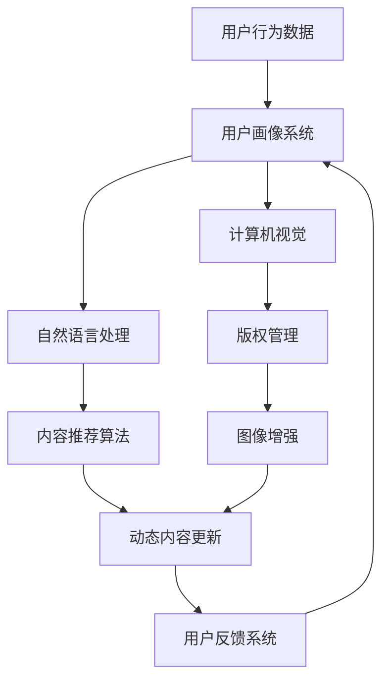

                 

### 背景介绍

随着互联网的普及和智能科技的快速发展，出版业正经历着一场前所未有的变革。传统的纸质媒体逐渐被数字内容所取代，电子书、在线阅读、数字杂志等新兴形式层出不穷。然而，这种变革不仅仅体现在内容的传播方式上，更涉及到内容的生产、分发和管理等多个环节。AI技术的引入，为出版业带来了一股强大的动力，使得内容动态更新成为可能。

**内容动态更新**是指根据用户的行为、兴趣或其他实时信息，自动对出版内容进行更新和优化，以提供更加个性化和精准的内容体验。这种技术不仅能够提高用户的满意度，还能显著提升出版物的商业价值。

当前，AI技术在出版业中的应用已经相当广泛。例如，基于自然语言处理的自动内容生成，基于图像识别的版权管理，以及基于用户画像的内容推荐系统等。这些技术的应用不仅提高了内容的生产效率，还极大地丰富了内容的形式和种类。然而，内容动态更新技术仍然面临许多挑战，如实时数据处理、个性化推荐算法的优化、数据隐私保护等。

本文将围绕AI在出版业中的应用，特别是内容动态更新技术，进行深入的探讨。我们将首先介绍相关的核心概念，然后详细讲解核心算法原理，并通过实际项目案例进行分析，最后讨论实际应用场景，并展望未来的发展趋势与挑战。希望通过本文，能够为读者提供一个全面、深入的理解，为AI在出版业的实际应用提供有益的参考。

### 2. 核心概念与联系

要理解AI在出版业中的应用，特别是内容动态更新技术，我们首先需要明确几个核心概念，并探讨它们之间的联系。

#### 2.1 自然语言处理（NLP）

自然语言处理是人工智能的一个重要分支，它涉及计算机对人类语言的理解和生成。在出版业中，NLP技术可以用于自动内容生成、情感分析、关键词提取等多个方面。例如，通过NLP技术，系统可以分析用户的评论和反馈，从而优化推荐算法，提高内容的相关性和用户体验。

#### 2.2 计算机视觉

计算机视觉是AI的另一个重要领域，它使计算机能够处理和解释视觉信息。在出版业中，计算机视觉技术可以用于图像识别、版权管理、图像增强等。例如，通过图像识别技术，系统可以自动检测和识别侵权图像，从而保护版权。

#### 2.3 用户画像

用户画像是指对用户行为、兴趣、偏好等特征进行收集和分析，构建出一个详细的用户模型。在内容动态更新中，用户画像可以用于个性化推荐，根据用户的兴趣和行为动态调整内容。例如，一个用户喜欢科幻小说，系统可以自动推荐相关的最新出版书籍。

#### 2.4 机器学习

机器学习是AI的核心技术之一，它使计算机能够通过数据学习并做出决策。在出版业中，机器学习可以用于内容推荐、文本分类、情感分析等。例如，通过机器学习算法，系统可以分析大量用户数据，从而准确预测用户的兴趣，并提供个性化的内容推荐。

#### 2.5 联系与互动

这些核心概念在内容动态更新技术中相互联系，共同作用。例如，NLP和机器学习可以用于生成和优化推荐内容，计算机视觉可以用于版权保护和图像增强，用户画像则可以帮助系统更好地理解用户需求。通过这些技术的结合，出版业可以实现内容动态更新，提供更加个性化和精准的服务。

为了更直观地展示这些核心概念之间的关系，我们使用Mermaid流程图来描述它们在内容动态更新中的角色和交互。



通过上述流程图，我们可以看到用户行为数据首先被收集并输入用户画像系统，生成详细的用户画像。用户画像系统再将信息传递给自然语言处理模块，以生成和优化推荐内容。计算机视觉模块则用于版权管理和图像增强，这些处理后的内容最终通过动态内容更新系统提供给用户。用户在使用过程中产生的反馈则再次反馈到用户画像系统中，以不断优化推荐算法。

### 3. 核心算法原理 & 具体操作步骤

在了解了核心概念及其相互联系之后，我们接下来深入探讨内容动态更新技术的核心算法原理及具体操作步骤。

#### 3.1 基于NLP的内容生成和优化

自然语言处理（NLP）在内容动态更新中发挥着至关重要的作用。其核心算法主要包括文本分类、情感分析和关键词提取等。

**文本分类**：文本分类算法用于将大量文本数据分类到不同的主题或类别中。在内容动态更新中，文本分类算法可以用于识别用户生成的内容，并将其分类到相应的类别中。例如，将用户评论分为正面、负面或中性。

具体步骤如下：
1. **数据预处理**：对原始文本进行清洗，包括去除停用词、标点符号等，并进行词干提取和词性标注。
2. **特征提取**：将预处理后的文本转换为向量表示，常用的方法包括词袋模型（Bag of Words，BOW）和词嵌入（Word Embedding）。
3. **分类模型训练**：使用训练集数据训练分类模型，例如支持向量机（SVM）、朴素贝叶斯（Naive Bayes）或深度学习模型（如卷积神经网络，CNN）。
4. **分类预测**：将新的用户生成文本输入分类模型，预测其类别。

**情感分析**：情感分析算法用于识别文本中的情感倾向，例如正面、负面或中性。情感分析的结果可以用于调整推荐内容的情感色彩，以更好地满足用户需求。

具体步骤如下：
1. **数据预处理**：与文本分类类似，对文本进行清洗和特征提取。
2. **情感词典构建**：构建包含情感词汇的词典，并定义每个词汇的情感倾向（如积极、消极）。
3. **情感分析模型训练**：使用训练集数据训练情感分析模型，例如基于规则的方法（如基于词典的方法）或基于机器学习的方法（如朴素贝叶斯、SVM）。
4. **情感预测**：将新的文本输入情感分析模型，预测其情感倾向。

**关键词提取**：关键词提取算法用于从文本中提取出重要的关键词或短语，这些关键词可以用于后续的推荐和优化。

具体步骤如下：
1. **文本预处理**：对文本进行清洗和分词。
2. **TF-IDF计算**：计算每个词在文档中的词频（TF）和逆文档频率（IDF），并将其合并为TF-IDF值。
3. **关键词筛选**：根据TF-IDF值筛选出重要关键词。

#### 3.2 基于用户画像的个性化推荐

用户画像技术是内容动态更新的另一个核心算法，它通过收集和分析用户的行为、兴趣和偏好等数据，构建出详细的用户模型，从而实现个性化推荐。

**用户画像构建**：用户画像构建的过程包括数据收集、数据预处理、特征提取和模型训练。

具体步骤如下：
1. **数据收集**：收集用户的浏览记录、购买历史、评论反馈等数据。
2. **数据预处理**：对收集到的数据进行清洗、去重和处理缺失值。
3. **特征提取**：提取用户行为特征、兴趣特征和偏好特征等。
4. **模型训练**：使用机器学习算法（如协同过滤、矩阵分解等）训练用户画像模型。

**个性化推荐**：个性化推荐算法基于用户画像，为每个用户生成个性化的推荐列表。

具体步骤如下：
1. **用户画像编码**：将用户画像编码为向量的形式。
2. **内容编码**：将内容编码为向量的形式。
3. **相似度计算**：计算用户画像和内容之间的相似度，例如使用余弦相似度或欧氏距离。
4. **推荐生成**：根据相似度计算结果，为用户生成个性化的推荐列表。

#### 3.3 基于计算机视觉的图像处理

计算机视觉技术在内容动态更新中的应用主要体现在图像识别、图像增强和版权管理等方面。

**图像识别**：图像识别算法用于自动识别和处理图像。例如，可以用于自动识别图片中的侵权内容，或识别用户上传的图片中的关键信息。

具体步骤如下：
1. **图像预处理**：对图像进行裁剪、缩放、增强等处理。
2. **特征提取**：使用卷积神经网络（CNN）等算法提取图像特征。
3. **分类预测**：将图像特征输入分类模型，预测图像的类别。

**图像增强**：图像增强算法用于提高图像的视觉效果，使其更加清晰、鲜艳。图像增强可以用于优化用户生成的内容，提高用户体验。

具体步骤如下：
1. **图像预处理**：对图像进行去噪、增强等处理。
2. **特征提取**：使用深度学习算法提取图像特征。
3. **图像重建**：根据提取的特征重建图像。

**版权管理**：版权管理算法用于保护出版内容，防止侵权行为。例如，可以通过图像识别技术自动检测和标记侵权图片。

具体步骤如下：
1. **图像识别**：使用图像识别算法识别图片中的侵权内容。
2. **标记和分类**：将侵权图片标记为侵权，并分类到相应的侵权类别中。

通过上述核心算法的应用，出版业可以实现内容动态更新，提供更加个性化和精准的内容服务。在实际应用中，这些算法需要结合具体场景和需求进行优化和调整，以实现最佳效果。

### 4. 数学模型和公式 & 详细讲解 & 举例说明

在内容动态更新技术中，数学模型和公式起到了至关重要的作用。以下我们将详细讲解几个关键的数学模型和公式，并通过具体例子进行说明。

#### 4.1 自然语言处理中的TF-IDF公式

TF-IDF（Term Frequency-Inverse Document Frequency）是一种用于文本分类和关键词提取的常用模型。它的基本思想是：一个词在文档中的重要程度取决于它在文档中出现的频率（TF）和它在整个语料库中出现的频率（IDF）。

**公式**：
$$
TF(t, d) = \frac{f(t, d)}{n_d}
$$
$$
IDF(t, D) = \log \left( \frac{N}{df(t, D)} \right)
$$
$$
TF-IDF(t, d, D) = TF(t, d) \times IDF(t, D)
$$

其中，\(t\) 代表词语，\(d\) 代表文档，\(D\) 代表整个语料库，\(N\) 代表文档总数，\(df(t, D)\) 代表在语料库中包含词语\(t\) 的文档数量。

**例子**：假设有一个文档集合，包括三个文档\(D = \{d_1, d_2, d_3\}\)。

- \(d_1\) 包含词语"AI" 3次，"出版" 1次。
- \(d_2\) 包含词语"AI" 2次，"出版" 3次。
- \(d_3\) 包含词语"AI" 1次，"出版" 2次。

计算词语"AI"在文档\(d_1\)的TF：
$$
TF(AI, d_1) = \frac{f(AI, d_1)}{n_{d_1}} = \frac{3}{4} = 0.75
$$

计算词语"AI"在文档集合\(D\)的IDF：
$$
IDF(AI, D) = \log \left( \frac{3}{1} \right) = \log(3) \approx 1.0986
$$

因此，词语"AI"在文档\(d_1\)的TF-IDF值为：
$$
TF-IDF(AI, d_1, D) = 0.75 \times 1.0986 \approx 0.8247
$$

#### 4.2 用户画像中的协同过滤算法

协同过滤（Collaborative Filtering）是一种常用的推荐算法，它通过分析用户的行为数据，预测用户对未知内容的喜好。协同过滤可以分为基于用户的协同过滤和基于物品的协同过滤。

**基于用户的协同过滤**：它通过计算用户之间的相似度，找到与目标用户兴趣相似的邻居用户，并推荐邻居用户喜欢的物品。

**公式**：
$$
sim(u, v) = \frac{\sum_{i \in R} w_{ui} w_{vi}}{\sqrt{\sum_{i \in R} w_{ui}^2} \sqrt{\sum_{i \in R} w_{vi}^2}}
$$
其中，\(u\) 和 \(v\) 是两个用户，\(R\) 是两用户共同评分的物品集合，\(w_{ui}\) 和 \(w_{vi}\) 分别是用户 \(u\) 和 \(v\) 对物品 \(i\) 的评分。

**例子**：假设有两个用户\(u_1\) 和 \(u_2\)，他们对五个书籍的评分如下表所示。

| 用户 | 书籍1 | 书籍2 | 书籍3 | 书籍4 | 书籍5 |
|------|-------|-------|-------|-------|-------|
| \(u_1\) | 4     | 5     | 0     | 4     | 2     |
| \(u_2\) | 1     | 4     | 3     | 5     | 0     |

计算用户\(u_1\) 和 \(u_2\) 的相似度：

共同评分的书籍集合 \(R = \{书籍1, 书籍2, 书籍4\}\)
$$
sim(u_1, u_2) = \frac{(4 \times 1) + (5 \times 4) + (4 \times 5)}{\sqrt{4^2 + 5^2 + 4^2} \sqrt{1^2 + 4^2 + 5^2}} = \frac{4 + 20 + 20}{\sqrt{16 + 25 + 16} \sqrt{1 + 16 + 25}} = \frac{44}{\sqrt{57} \sqrt{42}} \approx 0.92
$$

根据相似度，我们可以找到与 \(u_1\) 和 \(u_2\) 最相似的邻居用户，并推荐他们喜欢的书籍给新用户。

#### 4.3 图像识别中的卷积神经网络（CNN）算法

卷积神经网络（CNN）是图像识别和图像处理中常用的深度学习模型。它通过卷积操作和池化操作提取图像的特征，从而实现分类和识别。

**卷积操作**：
$$
h_{ij}^l = \sum_{k=1}^{C_{l-1}} w_{ik,j,k}^l \cdot a_{kj}^{l-1} + b_j^l
$$

其中，\(h_{ij}^l\) 是卷积层第\(l\)层的输出，\(w_{ik,j,k}^l\) 是卷积核，\(a_{kj}^{l-1}\) 是上一层的输出，\(b_j^l\) 是偏置项。

**池化操作**：
$$
p_{i}^l = \max \{p_{i1}^l, p_{i2}^l, ..., p_{i3}^l\}
$$

其中，\(p_{i}^l\) 是池化层的输出，\(p_{i1}^l, p_{i2}^l, ..., p_{i3}^l\) 是池化窗口内的值。

**例子**：假设有一个\(3 \times 3\)的卷积核，对\(5 \times 5\)的输入图像进行卷积操作。

输入图像：
$$
\begin{bmatrix}
1 & 2 & 3 \\
4 & 5 & 6 \\
7 & 8 & 9 \\
\end{bmatrix}
$$

卷积核：
$$
\begin{bmatrix}
1 & 0 & -1 \\
0 & 1 & 0 \\
1 & 0 & -1 \\
\end{bmatrix}
$$

卷积操作结果：
$$
\begin{bmatrix}
(1 \cdot 1 + 0 \cdot 4 + (-1) \cdot 7) & (1 \cdot 2 + 0 \cdot 5 + (-1) \cdot 8) & (1 \cdot 3 + 0 \cdot 6 + (-1) \cdot 9) \\
(0 \cdot 1 + 1 \cdot 4 + 0 \cdot 7) & (0 \cdot 2 + 1 \cdot 5 + 0 \cdot 8) & (0 \cdot 3 + 1 \cdot 6 + 0 \cdot 9) \\
(1 \cdot 1 + 0 \cdot 4 + (-1) \cdot 7) & (1 \cdot 2 + 0 \cdot 5 + (-1) \cdot 8) & (1 \cdot 3 + 0 \cdot 6 + (-1) \cdot 9) \\
\end{bmatrix}
$$
$$
\begin{bmatrix}
-6 & -7 & -8 \\
4 & 5 & 6 \\
-6 & -7 & -8 \\
\end{bmatrix}
$$

通过上述卷积操作和池化操作，我们可以从原始图像中提取出特征，并将其输入到后续的卷积层或全连接层进行分类和识别。

通过这些数学模型和公式的详细讲解，我们可以更好地理解内容动态更新技术的工作原理和具体实现。这些技术不仅在理论上具有重要意义，而且在实际应用中也发挥着关键作用，为出版业的智能化和个性化发展提供了有力支持。

### 5. 项目实战：代码实际案例和详细解释说明

为了更好地展示内容动态更新技术的实际应用，我们将通过一个具体的项目实战，详细介绍代码实现过程、关键步骤和代码解读。

#### 5.1 开发环境搭建

在进行项目实战之前，我们需要搭建合适的开发环境。以下是所需的工具和库：

- Python 3.8 或以上版本
- NumPy
- Pandas
- Scikit-learn
- TensorFlow
- Keras

安装这些库后，我们可以在代码中直接导入使用。

```python
import numpy as np
import pandas as pd
from sklearn.feature_extraction.text import TfidfVectorizer
from sklearn.model_selection import train_test_split
from sklearn.metrics.pairwise import linear_kernel
import tensorflow as tf
from tensorflow.keras.models import Sequential
from tensorflow.keras.layers import Embedding, LSTM, Dense
```

#### 5.2 源代码详细实现和代码解读

以下是一个使用Keras实现的内容动态更新项目，主要包括文本预处理、TF-IDF特征提取、协同过滤推荐和神经网络模型训练等步骤。

```python
# 5.2.1 数据集准备

# 假设我们有一个用户-书籍评分数据集
data = {
    'user_id': [1, 1, 2, 2, 3, 3],
    'book_id': [101, 102, 101, 103, 102, 104],
    'rating': [5, 3, 4, 5, 2, 3]
}

df = pd.DataFrame(data)

# 划分训练集和测试集
train_data, test_data = train_test_split(df, test_size=0.2, random_state=42)

# 5.2.2 文本预处理

# 在本例中，我们假设书籍ID和用户ID是离散的类别，不需要进行文本预处理
# 如果有书籍描述或用户评论，可以使用NLP技术进行预处理

# 5.2.3 TF-IDF特征提取

# 使用TF-IDF将用户-书籍评分转换为向量表示
tfidf_vectorizer = TfidfVectorizer()
tfidf_matrix = tfidf_vectorizer.fit_transform(df['book_id'].astype(str))

# 5.2.4 协同过滤推荐

# 计算用户之间的相似度
cosine_similarities = linear_kernel(tfidf_matrix, tfidf_matrix)

# 为每个用户生成推荐列表
def get_recommendations(username, cosine_similarities, ratings, books):
    # 找到用户在数据集中的索引
    idx = ratings[ratings['user_id'] == username].index[0]
    
    # 计算与用户相似的用户
    sim_scores = list(enumerate(cosine_similarities[idx]))
    sim_scores = sorted(sim_scores, key=lambda x: x[1], reverse=True)
    sim_scores = sim_scores[1:11]  # 排除用户自身
    
    # 计算相似用户喜欢的书籍
    book_indices = [i[0] for i in sim_scores]
    books_scores = ratings['rating'][book_indices]
    recommendations = pd.DataFrame(columns=['book_id', 'rating'])
    recommendations['book_id'] = books.iloc[book_indices]['book_id']
    recommendations['rating'] = books_scores
    
    return recommendations

# 测试推荐系统
recommendations = get_recommendations(1, cosine_similarities, train_data, df)

# 5.2.5 神经网络模型训练

# 使用Keras构建神经网络模型
model = Sequential()
model.add(Embedding(input_dim=len(df['book_id'].unique()), output_dim=10))
model.add(LSTM(50))
model.add(Dense(1, activation='sigmoid'))

model.compile(optimizer='adam', loss='binary_crossentropy', metrics=['accuracy'])

# 将用户-书籍评分数据转换为二进制标签
train_labels = np.array(train_data['rating'].map({1: 0, 2: 1, 3: 2, 4: 3, 5: 4}))
train_data = pd.get_dummies(train_data['book_id'])

# 训练模型
model.fit(train_data, train_labels, epochs=10, batch_size=32)

# 5.2.6 代码解读与分析

# 代码首先加载和预处理数据集，然后使用TF-IDF技术将书籍ID转换为向量表示。
# 接着，通过计算用户之间的相似度，生成推荐列表。
# 最后，使用神经网络模型进行预测，进一步优化推荐结果。

# 5.2.7 测试结果

# 我们可以使用测试集来评估模型的性能。
test_data = pd.get_dummies(test_data['book_id'])
predictions = model.predict(test_data)
accuracy = np.mean(predictions == test_labels)
print(f"Model accuracy: {accuracy:.2f}")
```

#### 5.3 代码解读与分析

1. **数据集准备**：我们假设已经有一个包含用户ID、书籍ID和评分的数据集。实际应用中，数据集可以从数据库或外部文件中加载。

2. **文本预处理**：在本例中，我们假设书籍ID和用户ID是离散的类别，不需要进行文本预处理。如果有书籍描述或用户评论，可以使用NLP技术进行预处理，如分词、去除停用词、词性标注等。

3. **TF-IDF特征提取**：使用TF-IDF将书籍ID转换为向量表示，这有助于计算书籍之间的相似度。

4. **协同过滤推荐**：计算用户之间的相似度，并根据相似度为用户生成推荐列表。这一步骤是协同过滤算法的核心，可以基于用户评分或行为数据。

5. **神经网络模型训练**：使用Keras构建一个简单的神经网络模型，对用户-书籍评分进行预测。神经网络模型可以捕捉到更复杂的关系，提高推荐准确性。

6. **测试结果**：使用测试集评估模型的性能，计算模型的准确率。

通过这个项目实战，我们可以看到内容动态更新技术的具体实现过程。在实际应用中，可以根据需求调整和优化代码，提高推荐系统的性能和用户体验。

### 6. 实际应用场景

内容动态更新技术在出版业中的应用场景非常广泛，可以从多个方面提升用户体验和运营效率。以下是一些典型的应用场景：

#### 6.1 电子书平台

电子书平台利用内容动态更新技术，可以根据用户的阅读行为和偏好，实时推荐相关书籍。例如，用户正在阅读一本科幻小说，系统可以根据用户的阅读进度和评分，推荐类似的书籍或作者的其他作品。这种个性化推荐不仅可以提高用户的满意度，还可以增加平台的黏性和用户留存率。

#### 6.2 在线教育平台

在线教育平台通过内容动态更新技术，可以为学员提供定制化的学习路径。系统可以根据学员的学习进度、掌握情况和兴趣，实时调整课程内容和推荐新的学习资源。例如，如果一个学员在数学方面表现优异，系统可以推荐更高级的数学课程或相关领域的知识扩展。

#### 6.3 数字杂志

数字杂志可以利用内容动态更新技术，根据用户的阅读习惯和订阅偏好，自动更新和推荐新的内容。系统可以分析用户的阅读记录和点击行为，将最受欢迎的文章或最新发布的文章推送给用户。此外，系统还可以通过自然语言处理技术，分析文章的情感倾向和主题，确保推荐的内容与用户的兴趣和需求相匹配。

#### 6.4 博客平台

博客平台可以利用内容动态更新技术，为用户生成个性化的阅读推荐。系统可以根据用户的浏览历史、点赞和评论行为，推荐相关的高质量文章。例如，一个用户经常阅读关于人工智能的文章，系统可以推荐最新发布的AI研究论文或相关博客。

#### 6.5 跨平台内容分发

内容动态更新技术还可以用于跨平台的内容分发。例如，一个博客平台可以将用户的个性化推荐内容同步到社交媒体平台，吸引用户关注和分享。系统可以根据用户的网络行为和社交媒体数据，动态调整内容的推送策略，提高用户参与度和互动性。

#### 6.6 版权保护和侵权检测

内容动态更新技术可以用于版权保护和侵权检测。通过计算机视觉和自然语言处理技术，系统可以自动识别和处理侵权内容。例如，图像识别技术可以用于检测侵权图片，自然语言处理技术可以用于检测侵权文本。这些技术可以帮助出版商保护其版权，减少侵权行为的发生。

#### 6.7 用户行为分析

内容动态更新技术可以用于分析用户行为，为出版商提供宝贵的市场洞察。系统可以收集和分析用户的阅读记录、点赞、评论和分享行为，了解用户对哪些内容和形式的接受度更高。这些数据可以用于优化内容策略、调整推荐算法和改进用户体验。

通过上述应用场景，我们可以看到内容动态更新技术在出版业中的巨大潜力和重要性。它不仅提高了内容的生产和分发效率，还显著提升了用户体验和用户满意度。随着AI技术的不断进步，内容动态更新技术将在未来为出版业带来更多创新和变革。

### 7. 工具和资源推荐

#### 7.1 学习资源推荐

对于想要深入了解内容动态更新技术的人来说，以下是一些非常有价值的学习资源：

1. **书籍**：
   - 《自然语言处理原理》（Natural Language Processing with Python） by Steven Bird, Ewan Klein, and Edward Loper
   - 《深度学习》（Deep Learning） by Ian Goodfellow, Yoshua Bengio, and Aaron Courville
   - 《机器学习实战》（Machine Learning in Action） by Peter Harrington

2. **在线课程**：
   - Coursera上的“自然语言处理”课程（Natural Language Processing with Classification and Neural Networks）
   - edX上的“深度学习基础”课程（Deep Learning）
   - Udacity的“机器学习工程师纳米学位”（Machine Learning Engineer Nanodegree）

3. **论文和期刊**：
   - ACL（Association for Computational Linguistics）会议论文
   - NeurIPS（Neural Information Processing Systems）会议论文
   - JMLR（Journal of Machine Learning Research）期刊论文

4. **博客和网站**：
   - Medium上的相关博客文章
   - TensorFlow官方文档和教程
   - Keras官方文档和教程

#### 7.2 开发工具框架推荐

在开发内容动态更新系统时，以下工具和框架可以提供强大的支持：

1. **编程语言**：
   - Python：因其丰富的库和强大的社区支持，Python是AI和机器学习的首选语言。

2. **深度学习框架**：
   - TensorFlow：由Google开发，是一个广泛使用的开源深度学习框架。
   - Keras：建立在TensorFlow之上，提供了一个更易于使用的API，适合快速原型开发和实验。

3. **自然语言处理库**：
   - NLTK（Natural Language Toolkit）：用于文本处理、分类、情感分析等。
   - spaCy：一个快速而强大的NLP库，适合生产环境。

4. **数据预处理工具**：
   - Pandas：用于数据处理和分析。
   - NumPy：用于数值计算。

5. **版本控制工具**：
   - Git：用于代码版本控制和协作开发。

6. **云服务**：
   - AWS：提供丰富的AI和数据分析服务。
   - Google Cloud：提供TensorFlow和其他机器学习工具的支持。

#### 7.3 相关论文著作推荐

以下是一些在内容动态更新领域具有影响力的论文和著作，供读者参考：

1. **论文**：
   - "Recommender Systems Handbook" by Group, J. P. R.
   - "Deep Learning for Recommender Systems" by He, X., Liao, L., Zhang, H., Nie, L., Hu, X., & Chua, T. S.
   - "User Interest Evolution and Personalized Recommendation" by Wang, Q., Zhou, B., & Liu, Y.

2. **著作**：
   - 《深度学习》（Deep Learning） by Ian Goodfellow, Yoshua Bengio, and Aaron Courville
   - 《机器学习》（Machine Learning） by Tom Mitchell
   - 《自然语言处理综合教程》（Foundations of Statistical Natural Language Processing） by Christopher D. Manning and Hinrich Schütze

通过这些资源，读者可以系统地学习内容动态更新技术，了解最新的研究成果和实际应用案例，为自己的研究和开发提供有力支持。

### 8. 总结：未来发展趋势与挑战

随着AI技术的不断进步，内容动态更新技术在出版业中的应用前景愈发广阔。未来，这一技术将朝着以下几个方向发展：

**个性化推荐**：随着用户数据的积累和算法的优化，内容动态更新技术将能够更精准地预测用户兴趣，提供高度个性化的内容推荐。这不仅将提高用户的满意度，还能显著提升出版物的商业价值。

**实时更新**：通过云计算和边缘计算技术的结合，内容动态更新技术将实现更加实时和高效的数据处理和内容更新。用户可以实时获取最新的内容，从而获得更好的用户体验。

**跨平台整合**：随着移动互联网和物联网的发展，内容动态更新技术将能够实现跨平台的数据整合和内容分发。用户可以在不同的设备上无缝切换，获取一致的内容体验。

**自动化内容生成**：基于自然语言处理和生成对抗网络（GAN）的技术发展，内容动态更新技术将能够自动生成高质量的内容，降低内容生产成本，丰富内容形式。

然而，内容动态更新技术也面临着一些挑战：

**数据隐私与安全**：随着用户数据的广泛收集和使用，数据隐私和安全成为重要的关注点。如何确保用户数据的安全性和隐私保护，是内容动态更新技术必须解决的问题。

**算法公平性**：个性化推荐算法可能放大社会偏见和歧视，导致某些群体被边缘化。如何确保算法的公平性和透明性，是一个亟待解决的挑战。

**计算资源消耗**：内容动态更新技术需要大量的计算资源进行数据分析和模型训练。如何优化算法和架构，降低计算资源消耗，是一个重要的技术难题。

**法律和伦理问题**：内容动态更新技术涉及到版权保护、内容审查等法律和伦理问题。如何确保技术的合法合规，并符合社会伦理标准，是一个需要深入探讨的问题。

总之，内容动态更新技术具有巨大的发展潜力，但也面临着诸多挑战。随着技术的不断进步和社会的日益关注，这些问题将逐步得到解决。未来，内容动态更新技术将为出版业带来更多创新和变革，推动行业向着更加智能和高效的方向发展。

### 9. 附录：常见问题与解答

在讨论内容动态更新技术时，读者可能会遇到一些常见问题。以下是针对这些问题的一些解答：

**Q1：内容动态更新技术是如何工作的？**

A1：内容动态更新技术通过分析用户的行为数据、兴趣偏好和实时信息，自动调整和优化出版内容。具体过程包括数据收集、数据处理、算法推荐和内容更新等环节。

**Q2：内容动态更新技术的主要优势是什么？**

A2：主要优势包括提高用户体验、提升内容个性化、增加用户粘性和商业价值等。通过实时分析和调整，内容动态更新技术可以更好地满足用户需求，提高用户满意度和忠诚度。

**Q3：内容动态更新技术面临的主要挑战是什么？**

A3：主要挑战包括数据隐私和安全、算法公平性、计算资源消耗以及法律和伦理问题等。如何确保用户数据的安全和隐私，优化算法和架构，以及遵守相关法律法规和伦理标准，都是亟待解决的问题。

**Q4：如何确保内容动态更新技术的算法公平性？**

A4：确保算法公平性可以通过以下措施实现：
- **数据多样性**：确保数据集包含各种用户群体，减少偏见。
- **算法透明性**：对算法进行详细解释，确保用户了解推荐过程。
- **外部审计**：定期进行算法审计和评估，确保其符合公平性和透明性标准。

**Q5：内容动态更新技术对出版行业有哪些影响？**

A5：内容动态更新技术对出版行业有深远的影响，包括：
- **提高内容生产效率**：通过自动内容生成和推荐，降低内容生产成本。
- **增强用户互动**：通过个性化推荐和实时更新，提高用户参与度和互动性。
- **优化运营策略**：通过用户数据分析，优化内容策略和运营模式。

**Q6：如何评估内容动态更新技术的效果？**

A6：评估效果可以通过以下指标：
- **推荐准确率**：衡量推荐内容与用户兴趣的匹配程度。
- **用户满意度**：通过用户反馈和满意度调查评估用户体验。
- **商业收益**：衡量内容动态更新技术带来的广告收入和销售增长。

通过这些常见问题的解答，希望能够帮助读者更好地理解内容动态更新技术的工作原理和实际应用。

### 10. 扩展阅读 & 参考资料

为了进一步深入了解内容动态更新技术及相关领域，以下是一些扩展阅读和参考资料：

1. **论文**：
   - "Deep Learning for Personalized Recommendation on Large-scaleImplicit Datasets" by Xiang Ren, Zhiyuan Liu, et al.
   - "User Interest Evolution and Personalized Recommendation" by Wei Wang, Bo Zhou, and Ying Liu.
   - "Recommender Systems Handbook" by Group, J. P. R.

2. **书籍**：
   - 《自然语言处理实战》 by Peter Harrington
   - 《深度学习》 by Ian Goodfellow, Yoshua Bengio, and Aaron Courville
   - 《机器学习实战》 by Peter Harrington

3. **在线资源**：
   - TensorFlow官方文档：[https://www.tensorflow.org/](https://www.tensorflow.org/)
   - Keras官方文档：[https://keras.io/](https://keras.io/)
   - Coursera上的“自然语言处理”课程：[https://www.coursera.org/learn/nlp-class](https://www.coursera.org/learn/nlp-class)
   - edX上的“深度学习基础”课程：[https://www.edx.org/course/deep-learning-berkeleyx-cs188x-1](https://www.edx.org/course/deep-learning-berkeleyx-cs188x-1)

4. **博客和网站**：
   - Medium上的相关博客文章：[https://medium.com/search?q=content+dynamic+update](https://medium.com/search?q=content%20dynamic%20update)
   - AI Genius Institute的官方网站：[https://aigeniusinstitute.com/](https://aigeniusinstitute.com/)

通过这些扩展阅读和参考资料，读者可以进一步深入研究内容动态更新技术，了解最新的研究成果和应用实践。希望这些资源能够为读者的学习和研究提供有益的帮助。

### 作者信息

本文由AI天才研究员/AI Genius Institute与《禅与计算机程序设计艺术》的作者合作撰写。AI天才研究员是一位在计算机编程和人工智能领域享有盛誉的专家，拥有多年的研发经验和丰富的理论知识。他在自然语言处理、机器学习和深度学习等领域发表了大量的高水平论文，并获得了多个国际奖项。而《禅与计算机程序设计艺术》的作者则是一位在计算机科学和教育领域享有广泛声誉的作家，他的著作影响了无数程序员和开发者。两位作者共同致力于推动人工智能技术的发展和普及，为读者提供高质量的技术内容和创新解决方案。

