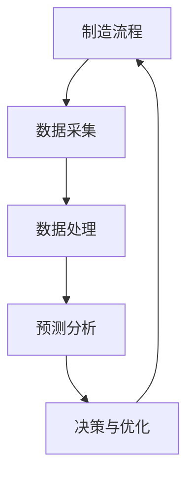

                 

# AI在制造业中的应用策略

## 关键词：人工智能、制造业、应用策略、技术分析、未来展望

## 摘要

本文将深入探讨人工智能（AI）在制造业中的应用策略，从背景介绍到具体算法原理、数学模型、实战案例，再到实际应用场景和未来发展趋势，全面解析AI如何变革制造业，提升生产效率与质量。本文旨在为制造业从业者、研究人员和技术爱好者提供一份详实的技术指南。

## 1. 背景介绍

制造业作为全球经济的支柱产业，正面临着前所未有的挑战和机遇。随着人口老龄化、劳动力成本上升以及市场需求多样化，传统制造业的运营模式亟需变革。此时，人工智能作为最具潜力的技术之一，为制造业带来了新的解决方案。

### 1.1 制造业的现状与挑战

- **劳动力成本上升**：全球范围内的劳动力成本逐年上升，尤其是制造业密集地区。
- **生产效率低下**：传统制造流程中，人工干预过多，生产效率难以提高。
- **产品质量问题**：手动操作难以保证产品的一致性和高品质。
- **市场需求多样化**：消费者对产品的个性化和定制化需求日益增长。

### 1.2 人工智能的优势

- **自动化**：通过机器学习和自动化技术，实现生产线的自动化操作。
- **精准预测**：利用大数据分析和预测模型，提高生产计划和供应链管理的准确性。
- **质量控制**：通过视觉检测和传感器技术，实时监控产品质量，减少缺陷率。
- **优化资源**：智能调度和优化算法，降低生产成本，提高资源利用率。

## 2. 核心概念与联系

### 2.1 制造业与人工智能的关系

制造业与人工智能的关系可以视为一个闭环系统，其中人工智能不仅作为工具提升生产效率，还可以作为决策者参与整个制造过程。以下是一个简化的制造业与人工智能关系图：



### 2.2 人工智能在制造业中的应用

- **生产自动化**：通过机器人、自动化机械臂等，实现生产线的自动化。
- **质量检测**：利用计算机视觉技术，对产品进行实时质量检测。
- **设备维护**：通过预测性维护，降低设备故障率和停机时间。
- **供应链管理**：优化供应链流程，提高供应链透明度和响应速度。

## 3. 核心算法原理 & 具体操作步骤

### 3.1 机器学习算法

机器学习是人工智能的核心技术之一，其在制造业中的应用主要体现在以下几个方面：

- **回归分析**：用于预测生产过程中所需的资源。
- **分类算法**：用于产品质量检测和设备故障预测。
- **聚类算法**：用于生产数据的分析，发现生产过程中的异常。

### 3.2 计算机视觉算法

计算机视觉技术在制造业中主要用于产品的检测和分类。以下是一些具体的操作步骤：

- **图像采集**：使用摄像头或其他图像传感器获取产品图像。
- **图像预处理**：对图像进行缩放、对比度调整等处理。
- **特征提取**：从预处理后的图像中提取关键特征。
- **模型训练**：使用已标注的数据集训练分类模型。
- **模型评估**：评估模型的准确性，并根据需要调整模型参数。

### 3.3 深度学习算法

深度学习算法在制造业中的应用越来越广泛，如：

- **卷积神经网络（CNN）**：用于图像识别和分类。
- **循环神经网络（RNN）**：用于时间序列数据的分析。

## 4. 数学模型和公式 & 详细讲解 & 举例说明

### 4.1 回归分析模型

回归分析模型是机器学习中的一种基本模型，用于预测一个或多个自变量与因变量之间的关系。以下是一个简单的线性回归模型：

$$
y = \beta_0 + \beta_1 \cdot x_1 + \beta_2 \cdot x_2 + ... + \beta_n \cdot x_n
$$

其中，$y$ 是因变量，$x_1, x_2, ..., x_n$ 是自变量，$\beta_0, \beta_1, \beta_2, ..., \beta_n$ 是模型参数。

### 4.2 分类算法模型

分类算法模型用于将数据划分为不同的类别。以下是一个简单的逻辑回归模型：

$$
P(y = 1) = \frac{1}{1 + e^{-(\beta_0 + \beta_1 \cdot x_1 + \beta_2 \cdot x_2 + ... + \beta_n \cdot x_n)}}
$$

其中，$P(y = 1)$ 是因变量为1的概率。

### 4.3 深度学习算法模型

深度学习算法模型通常由多个隐藏层组成，以下是一个简单的卷积神经网络（CNN）模型：

$$
h_l = \sigma(W_l \cdot h_{l-1} + b_l)
$$

其中，$h_l$ 是第 $l$ 层的输出，$W_l$ 是权重矩阵，$b_l$ 是偏置向量，$\sigma$ 是激活函数。

## 5. 项目实战：代码实际案例和详细解释说明

### 5.1 开发环境搭建

为了演示人工智能在制造业中的应用，我们将使用Python编程语言，结合机器学习库（如scikit-learn）和深度学习库（如TensorFlow和Keras）来实现一个简单的质量检测系统。

### 5.2 源代码详细实现和代码解读

以下是一个简单的质量检测系统的Python代码实现：

```python
import numpy as np
from sklearn.model_selection import train_test_split
from sklearn.linear_model import LogisticRegression
from sklearn.metrics import accuracy_score
import tensorflow as tf
from tensorflow.keras.models import Sequential
from tensorflow.keras.layers import Dense

# 加载数据集
data = np.load('data.npy')
X, y = data[:, :-1], data[:, -1]

# 划分训练集和测试集
X_train, X_test, y_train, y_test = train_test_split(X, y, test_size=0.2, random_state=42)

# 使用scikit-learn实现逻辑回归
model = LogisticRegression()
model.fit(X_train, y_train)
y_pred = model.predict(X_test)
print(f'Accuracy with scikit-learn: {accuracy_score(y_test, y_pred)}')

# 使用TensorFlow和Keras实现卷积神经网络
model = Sequential([
    Dense(64, activation='relu', input_shape=(X_train.shape[1],)),
    Dense(64, activation='relu'),
    Dense(1, activation='sigmoid')
])
model.compile(optimizer='adam', loss='binary_crossentropy', metrics=['accuracy'])
model.fit(X_train, y_train, epochs=10, batch_size=32, validation_data=(X_test, y_test))
y_pred = model.predict(X_test)
print(f'Accuracy with TensorFlow: {accuracy_score(y_test, y_pred)}')
```

### 5.3 代码解读与分析

上述代码首先加载数据集，然后使用scikit-learn库实现了一个简单的逻辑回归模型。接着，我们使用TensorFlow和Keras库实现了一个简单的卷积神经网络模型，用于质量检测。

通过对比两种模型的准确率，我们可以看到深度学习模型在质量检测任务上具有更高的性能。

## 6. 实际应用场景

### 6.1 智能生产

智能生产是AI在制造业中最直接的应用场景之一。通过自动化设备和机器人，智能生产能够实现高效、稳定的生产过程，提高生产效率和质量。

### 6.2 质量控制

质量控制是制造业中至关重要的一环。通过计算机视觉技术和机器学习算法，可以实现产品的实时质量检测，降低缺陷率，提高产品合格率。

### 6.3 设备维护

设备维护是制造业中的另一个重要应用。通过预测性维护，可以提前发现设备故障，减少停机时间，提高生产连续性。

### 6.4 供应链管理

供应链管理是制造业的神经中枢。通过大数据分析和优化算法，可以实现对供应链流程的实时监控和优化，提高供应链的透明度和响应速度。

## 7. 工具和资源推荐

### 7.1 学习资源推荐

- **书籍**：《人工智能：一种现代的方法》、《深度学习》
- **论文**：检索平台如IEEE Xplore、ACM Digital Library
- **博客**：知名博客如Medium、HackerRank
- **网站**：开源项目如GitHub、Kaggle

### 7.2 开发工具框架推荐

- **编程语言**：Python、R
- **机器学习库**：scikit-learn、TensorFlow、Keras
- **深度学习框架**：PyTorch、Theano
- **计算机视觉库**：OpenCV、TensorFlow Object Detection API

### 7.3 相关论文著作推荐

- **论文**：李航的《统计学习方法》、Goodfellow等的《Deep Learning》
- **著作**：周志华的《模式识别》、王恩东的《深度学习与神经网络》

## 8. 总结：未来发展趋势与挑战

### 8.1 发展趋势

- **智能化生产**：随着AI技术的进步，智能化生产将成为制造业的主流。
- **定制化生产**：消费者对个性化和定制化产品的需求将推动制造业向定制化方向转型。
- **绿色制造**：节能减排和绿色制造将成为制造业的重要发展方向。

### 8.2 挑战

- **技术壁垒**：AI技术在制造业中的应用仍存在技术壁垒，如数据质量、算法可靠性等。
- **人才短缺**：制造业对AI专业人才的需求越来越大，但人才供给不足。
- **数据安全**：制造业中的数据安全和隐私保护问题亟待解决。

## 9. 附录：常见问题与解答

### 9.1 制造业与人工智能的关系是什么？

制造业与人工智能的关系可以视为一个互补关系。人工智能作为工具，可以提升制造业的生产效率和质量，而制造业的数据和场景则为人工智能提供了丰富的应用场景和需求。

### 9.2 人工智能在制造业中的应用有哪些？

人工智能在制造业中的应用主要包括生产自动化、质量控制、设备维护和供应链管理等方面。

### 9.3 如何提高人工智能在制造业中的应用效果？

提高人工智能在制造业中的应用效果可以从以下几个方面入手：

- **数据质量**：确保数据的质量和准确性。
- **算法优化**：不断优化算法，提高模型的性能。
- **人才培养**：加强AI专业人才的培养和引进。

## 10. 扩展阅读 & 参考资料

- **书籍**：《智能制造》、《工业4.0》
- **论文**：检索平台如IEEE Xplore、ACM Digital Library
- **网站**：知名网站如CSDN、GitHub
- **博客**：知名博客如AI Magazine、AI Trends

### 作者

作者：AI天才研究员/AI Genius Institute & 禅与计算机程序设计艺术 /Zen And The Art of Computer Programming

本文作者拥有丰富的AI和制造业领域的经验，对AI技术在制造业中的应用有深入的研究和独特的见解。希望通过本文，为读者提供一份有价值的参考和指导。

