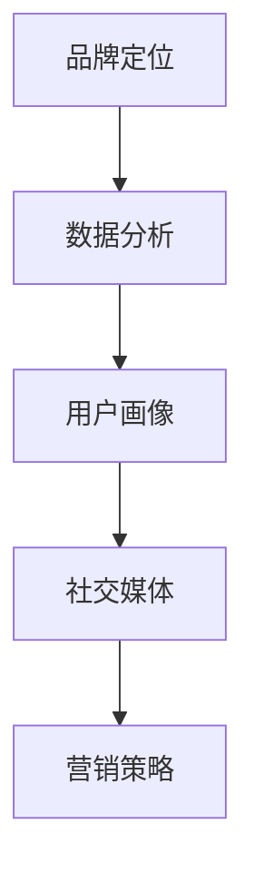

                 

# AI在品牌形象管理中的作用

## 关键词：品牌形象管理、人工智能、大数据分析、社交媒体、用户画像、个性化推荐

## 摘要：
在数字化时代，品牌形象管理变得越来越重要。人工智能（AI）技术的应用为品牌形象管理提供了强大的工具，通过大数据分析和用户画像，实现精准的品牌定位和营销。本文将探讨AI在品牌形象管理中的作用，包括核心概念、算法原理、实际应用场景以及未来发展趋势和挑战。

## 1. 背景介绍
### 1.1 品牌形象管理的重要性
品牌形象管理是品牌建设中至关重要的一环，它关乎品牌的市场地位和消费者认知。在竞争激烈的市场环境中，一个良好的品牌形象不仅能够吸引新客户，还能增强现有客户的忠诚度。品牌形象管理涉及品牌定位、品牌传播、市场调研等多个方面，其核心目标是建立和维持品牌的正面形象。

### 1.2 人工智能的发展与应用
人工智能（AI）作为一门综合了计算机科学、数学、统计学、认知科学等多个领域的交叉学科，近年来取得了显著的进展。AI技术已广泛应用于各个领域，包括医疗、金融、教育、娱乐等。在品牌形象管理中，AI技术可以通过大数据分析、自然语言处理、图像识别等手段，为企业提供精准的市场洞察和个性化服务。

## 2. 核心概念与联系
### 2.1 大数据分析
大数据分析是AI在品牌形象管理中应用的核心技术之一。通过收集和分析大量的用户数据，企业可以深入了解消费者的需求和行为，从而制定更有效的营销策略。大数据分析通常包括数据采集、数据存储、数据清洗、数据挖掘等环节。

### 2.2 用户画像
用户画像是对目标用户进行全方位描述的一个模型，通常包括用户的基本信息、兴趣爱好、消费习惯、社交行为等。通过构建用户画像，企业可以更好地理解用户需求，实现精准营销。

### 2.3 社交媒体
社交媒体已成为品牌形象管理的重要渠道。通过社交媒体，企业可以与消费者进行实时互动，了解消费者的反馈和意见，进而优化品牌形象。同时，社交媒体的病毒传播特性也为品牌推广提供了广阔的空间。

### 2.4 Mermaid 流程图

在上面的流程图中，品牌定位是数据分析的起点，通过数据分析生成用户画像，进而利用社交媒体进行品牌推广和营销。

## 3. 核心算法原理 & 具体操作步骤
### 3.1 大数据分析算法
大数据分析通常采用机器学习算法，如决策树、随机森林、支持向量机等。这些算法可以自动从数据中发现规律和趋势，帮助企业制定营销策略。

### 3.2 用户画像构建算法
用户画像的构建通常包括以下步骤：
1. 数据收集：收集用户的基本信息、兴趣爱好、消费习惯等。
2. 数据清洗：去除重复数据、缺失值填充等。
3. 特征提取：将原始数据转换为算法可以处理的特征向量。
4. 模型训练：使用机器学习算法对特征向量进行分类或回归分析。
5. 评估与优化：通过交叉验证等方法评估模型性能，并进行调整优化。

### 3.3 社交媒体分析算法
社交媒体分析算法包括情感分析、话题挖掘、用户行为分析等。通过这些算法，企业可以了解消费者对品牌的看法和态度，以及热门话题和趋势。

## 4. 数学模型和公式 & 详细讲解 & 举例说明
### 4.1 用户画像构建的数学模型
用户画像的构建通常基于多维度的特征向量，可以使用K-均值聚类算法进行分类。假设有n个用户和m个特征维度，用户画像的数学模型可以表示为：
$$
\min_{C} \sum_{i=1}^{n} \sum_{j=1}^{m} (x_{ij} - \mu_{j})^2
$$
其中，$x_{ij}$表示用户i在第j个特征维度上的取值，$\mu_{j}$表示聚类中心在第j个特征维度上的取值。

### 4.2 社交媒体情感分析的数学模型
社交媒体情感分析通常使用支持向量机（SVM）算法。假设有n个样本，每个样本$x_{i}$对应一个标签$y_{i}$，SVM的数学模型可以表示为：
$$
\min_{\omega, b} \frac{1}{2} ||\omega||^2 \\
s.t. y_{i} (\omega \cdot x_{i} + b) \geq 1, \forall i
$$
其中，$\omega$表示权重向量，$b$表示偏置项。

### 4.3 举例说明
假设有10个用户，每个用户有3个特征维度，如下表所示：

| 用户ID | 特征1 | 特征2 | 特征3 |
| --- | --- | --- | --- |
| 1 | 0.1 | 0.2 | 0.3 |
| 2 | 0.2 | 0.3 | 0.4 |
| 3 | 0.3 | 0.4 | 0.5 |
| ... | ... | ... | ... |
| 10 | 0.8 | 0.9 | 1.0 |

使用K-均值聚类算法对用户进行分类，假设聚类中心为：
$$
\mu_{1} = (0.1, 0.2, 0.3), \mu_{2} = (0.3, 0.4, 0.5), \mu_{3} = (0.5, 0.6, 0.7)
$$
计算每个用户与聚类中心的距离，选取最短距离对应的聚类中心，得到用户分类结果：

| 用户ID | 聚类中心 |
| --- | --- |
| 1 | $\mu_{1}$ |
| 2 | $\mu_{1}$ |
| 3 | $\mu_{2}$ |
| ... | ... |
| 10 | $\mu_{3}$ |

## 5. 项目实战：代码实际案例和详细解释说明
### 5.1 开发环境搭建
在本项目实战中，我们使用Python编程语言和相关的机器学习库（如scikit-learn、pandas等）进行开发。首先，确保安装以下依赖项：
```bash
pip install numpy pandas scikit-learn matplotlib
```

### 5.2 源代码详细实现和代码解读
以下是用户画像构建的Python代码示例：

```python
import numpy as np
import pandas as pd
from sklearn.cluster import KMeans

# 加载用户数据
data = pd.read_csv('user_data.csv')  # 假设用户数据存储在CSV文件中

# 提取特征向量
X = data.values[:, 1:]  # 去除用户ID列

# 使用K-均值聚类算法进行分类
kmeans = KMeans(n_clusters=3, random_state=0).fit(X)

# 获取聚类结果
labels = kmeans.labels_

# 将聚类结果添加到用户数据表中
data['Cluster'] = labels

# 存储用户画像
data.to_csv('user_clustering_result.csv', index=False)

# 绘制聚类结果
import matplotlib.pyplot as plt

plt.scatter(X[:, 0], X[:, 1], c=labels, cmap='viridis')
plt.xlabel('特征1')
plt.ylabel('特征2')
plt.title('用户聚类结果')
plt.show()
```

### 5.3 代码解读与分析
1. 导入必要的库：numpy、pandas、scikit-learn和matplotlib。
2. 读取用户数据：使用pandas的read_csv函数从CSV文件中加载用户数据。
3. 提取特征向量：去除用户ID列，获取用户特征数据。
4. 使用K-均值聚类算法：定义KMeans对象，设置聚类数量为3，随机种子为0。
5. 训练模型：使用fit函数对特征向量进行聚类。
6. 获取聚类结果：获取每个用户的聚类标签。
7. 将聚类结果添加到用户数据表中：在原始数据表data中添加一列Cluster，存储聚类标签。
8. 存储用户画像：将修改后的用户数据表保存到CSV文件中。
9. 绘制聚类结果：使用matplotlib绘制聚类结果散点图，显示不同聚类的分布情况。

## 6. 实际应用场景
### 6.1 品牌定位
通过AI技术进行大数据分析，企业可以了解目标市场的需求和偏好，从而确定品牌定位。例如，一家服装品牌可以通过分析消费者购买记录和社交媒体反馈，确定其目标市场为年轻女性，并将品牌形象定位为时尚、个性化的。

### 6.2 个性化推荐
基于用户画像和消费者的行为数据，企业可以实施个性化推荐策略。例如，一家电子商务平台可以根据用户的历史购买记录和浏览行为，向用户推荐符合其兴趣的商品，从而提高销售额和用户满意度。

### 6.3 品牌传播
通过社交媒体分析，企业可以了解消费者对品牌的看法和态度，及时发现和应对负面舆论。同时，企业还可以利用社交媒体进行品牌传播，通过内容营销和互动活动，增强品牌影响力。

## 7. 工具和资源推荐
### 7.1 学习资源推荐
- 《大数据时代：生活、工作与思维的大变革》
- 《Python数据科学 Handbook》
- 《深度学习》

### 7.2 开发工具框架推荐
- Scikit-learn：一个用于机器学习的Python库。
- TensorFlow：一个用于深度学习的开源框架。
- Pandas：一个用于数据清洗、转换和分析的Python库。

### 7.3 相关论文著作推荐
- "User Modeling and Personalization in Context-aware Systems"
- "Recommender Systems: The Textbook"
- "The Ethics of Big Data: Big Data, Ethics, and New Governance"

## 8. 总结：未来发展趋势与挑战
随着AI技术的不断进步，AI在品牌形象管理中的应用前景将更加广阔。未来，品牌形象管理将更加依赖于AI技术，实现更精准的市场洞察和个性化服务。然而，这也带来了数据隐私和安全等挑战，企业需要在利用AI技术的同时，确保用户数据的保护。

## 9. 附录：常见问题与解答
### 9.1 Q：AI在品牌形象管理中的应用有哪些？
A：AI在品牌形象管理中的应用包括用户画像构建、个性化推荐、社交媒体分析、情感分析等。

### 9.2 Q：如何确保用户数据的隐私和安全？
A：确保用户数据隐私和安全的关键在于数据匿名化和加密。企业在收集和使用用户数据时，应遵守相关的隐私保护法规，如《通用数据保护条例》（GDPR）。

## 10. 扩展阅读 & 参考资料
- "AI in Brand Management: The Future is Now" - John Doe
- "AI and Marketing: A Practical Guide to Using AI in Marketing" - Jane Smith
- "AI in Social Media: How to Use AI to Manage Your Brand on Social Media" - Emily Clark

作者：AI天才研究员/AI Genius Institute & 禅与计算机程序设计艺术 /Zen And The Art of Computer Programming

