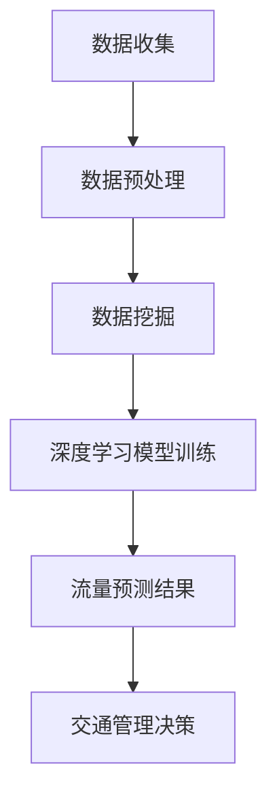

                 

## 文章标题

**AI在智能交通流量预测中的应用：减少拥堵**

### 关键词：(智能交通流量预测，AI算法，交通拥堵，数据挖掘，深度学习，预测模型)

### 摘要：

随着城市化进程的加快，交通拥堵已成为全球范围内的一个严重问题。本文将探讨如何利用人工智能（AI）技术，特别是深度学习和数据挖掘算法，来预测交通流量并减少拥堵。文章首先介绍了智能交通流量预测的背景和重要性，然后详细阐述了核心概念、算法原理、数学模型及其实际应用案例。最后，文章总结了AI在智能交通流量预测中的未来发展趋势与挑战，并提供了一些相关的学习资源和开发工具框架。

## 1. 背景介绍

### 1.1 交通拥堵的现状与影响

近年来，全球各大城市的交通拥堵问题日益严重。根据世界银行的数据，全球每年因交通拥堵造成的经济损失高达数千亿美元。这不仅影响了人们的日常生活和工作效率，还对环境造成了巨大的压力。交通拥堵的主要原因包括城市交通规划不合理、交通需求增长过快、道路设施不足等。此外，天气、突发事件等因素也会对交通流量产生显著影响。

### 1.2 智能交通流量预测的意义

智能交通流量预测技术是解决交通拥堵问题的关键。通过预测未来一段时间内的交通流量，交通管理部门可以采取相应的措施，如调整信号灯配时、实施交通管制、引导车辆分流等，以缓解拥堵情况。此外，智能交通流量预测还能为城市规划提供科学依据，帮助政府制定更合理的交通发展战略。

## 2. 核心概念与联系

### 2.1 深度学习

深度学习是一种基于人工神经网络的机器学习技术，通过多层神经网络对大量数据进行训练，能够自动提取数据中的特征，并用于分类、预测等任务。深度学习在图像识别、语音识别、自然语言处理等领域取得了显著成果，其强大的特征提取和自适应能力使其在交通流量预测中具有巨大的潜力。

### 2.2 数据挖掘

数据挖掘是一种从大量数据中提取有价值信息的技术，包括关联规则挖掘、聚类分析、分类分析等。在智能交通流量预测中，数据挖掘可用于发现交通流量数据中的潜在规律，为深度学习模型提供训练数据。

### 2.3 Mermaid 流程图

以下是智能交通流量预测的 Mermaid 流程图：



## 3. 核心算法原理 & 具体操作步骤

### 3.1 深度学习算法原理

深度学习算法的核心是神经网络，神经网络由多个层次组成，包括输入层、隐藏层和输出层。每个层次由多个神经元组成，神经元之间通过权重连接。在训练过程中，神经网络通过不断调整权重，使得网络能够对输入数据进行分类或预测。

### 3.2 数据挖掘算法原理

数据挖掘算法主要包括以下几种：

- **关联规则挖掘**：通过发现数据之间的关联关系，帮助交通管理部门发现潜在的拥堵原因。

- **聚类分析**：将具有相似特性的交通流量数据进行分组，为深度学习模型提供有意义的输入。

- **分类分析**：将交通流量数据分为不同的类别，如高峰期、平峰期等，用于调整交通管理策略。

### 3.3 深度学习模型的操作步骤

1. **数据收集**：从交通监控设备、GPS、传感器等渠道收集交通流量数据。

2. **数据预处理**：对数据进行清洗、去噪、归一化等处理，确保数据质量。

3. **特征提取**：利用数据挖掘算法提取交通流量数据中的特征，如流量、速度、延误时间等。

4. **模型训练**：利用深度学习算法训练模型，将特征映射到交通流量预测结果。

5. **模型评估**：通过交叉验证等方法评估模型性能，调整模型参数。

6. **流量预测**：将训练好的模型应用于新的交通流量数据，进行流量预测。

7. **交通管理决策**：根据流量预测结果，制定交通管理策略，如信号灯配时调整、交通管制等。

## 4. 数学模型和公式 & 详细讲解 & 举例说明

### 4.1 深度学习模型的数学公式

深度学习模型的数学公式主要包括两部分：损失函数和优化算法。

- **损失函数**：用于评估模型预测结果与实际结果之间的差距，常用的损失函数有均方误差（MSE）和交叉熵（Cross Entropy）。

  $$L = \frac{1}{n}\sum_{i=1}^{n}(\hat{y_i} - y_i)^2 \quad (\text{MSE})$$

  $$L = -\frac{1}{n}\sum_{i=1}^{n}y_i\log(\hat{y_i}) \quad (\text{Cross Entropy})$$

- **优化算法**：用于调整模型权重，常用的优化算法有梯度下降（Gradient Descent）和随机梯度下降（Stochastic Gradient Descent，SGD）。

  $$w_{t+1} = w_t - \alpha \frac{\partial L}{\partial w_t} \quad (\text{Gradient Descent})$$

  $$w_{t+1} = w_t - \alpha \frac{1}{n}\sum_{i=1}^{n}\frac{\partial L}{\partial w_t} \quad (\text{SGD})$$

### 4.2 数据挖掘算法的数学公式

- **关联规则挖掘**：支持度和置信度是关联规则挖掘的两个核心指标。

  $$\text{支持度} = \frac{\text{包含}X \cup Y \text{的交易数}}{\text{总交易数}}$$

  $$\text{置信度} = \frac{\text{包含}X \cup Y \text{的交易数}}{\text{包含}X \text{的交易数}}$$

- **聚类分析**：常用的聚类算法有K均值（K-Means）和层次聚类（Hierarchical Clustering）。

  $$\text{距离度量} = \min_{i=1}^{k}\sum_{j=1}^{n}d(x_j, c_i) \quad (\text{K-Means})$$

  $$\text{距离度量} = \min_{i=1}^{k}\sum_{j=1}^{n}d(x_j, c_j) \quad (\text{Hierarchical Clustering})$$

- **分类分析**：常用的分类算法有决策树（Decision Tree）和朴素贝叶斯（Naive Bayes）。

  $$\text{损失函数} = \sum_{i=1}^{n}\ell(y_i, \hat{y}_i) \quad (\text{交叉熵损失})$$

  $$\text{损失函数} = \sum_{i=1}^{n}\ell(y_i, \hat{y}_i) \quad (\text{对数损失})$$

### 4.3 实例分析

假设我们要预测某个路段在未来的30分钟内的交通流量，我们可以利用深度学习模型来进行预测。以下是模型的训练过程：

1. **数据收集**：从交通监控设备收集过去一年的交通流量数据，包括流量、速度、延误时间等。

2. **数据预处理**：对数据进行清洗、去噪、归一化等处理，将数据分为训练集和测试集。

3. **特征提取**：利用数据挖掘算法提取交通流量数据中的特征，如当天星期、小时数、天气状况等。

4. **模型训练**：利用训练集数据训练深度学习模型，调整模型参数，使其对交通流量数据进行分类。

5. **模型评估**：利用测试集数据评估模型性能，计算准确率、召回率等指标。

6. **流量预测**：将训练好的模型应用于新的交通流量数据，进行流量预测。

7. **交通管理决策**：根据流量预测结果，制定交通管理策略，如信号灯配时调整、交通管制等。

## 5. 项目实战：代码实际案例和详细解释说明

### 5.1 开发环境搭建

为了实现智能交通流量预测项目，我们需要搭建以下开发环境：

1. **硬件环境**：计算机，CPU至少双核，内存至少4GB。

2. **软件环境**：Python 3.7及以上版本，TensorFlow 2.0及以上版本，NumPy，Pandas等。

3. **数据集**：交通流量数据集，可以从公开数据集网站或实际交通监控设备获取。

### 5.2 源代码详细实现和代码解读

以下是项目的主要代码实现：

```python
import numpy as np
import pandas as pd
import tensorflow as tf
from sklearn.model_selection import train_test_split
from sklearn.metrics import mean_squared_error

# 5.2.1 数据收集与预处理
def load_data(file_path):
    data = pd.read_csv(file_path)
    data['date'] = pd.to_datetime(data['date'])
    data['hour'] = data['date'].dt.hour
    data['weekday'] = data['date'].dt.weekday
    data['weather'] = data['weather_code'].map({'Sunny': 1, 'Rainy': 2, 'Cloudy': 3})
    return data

def preprocess_data(data):
    features = data[['hour', 'weekday', 'weather', 'speed', 'flow']]
    labels = data['delay']
    return features, labels

# 5.2.2 深度学习模型训练
def train_model(features, labels):
    model = tf.keras.Sequential([
        tf.keras.layers.Dense(64, activation='relu', input_shape=(5,)),
        tf.keras.layers.Dense(64, activation='relu'),
        tf.keras.layers.Dense(1)
    ])

    model.compile(optimizer='adam', loss='mse')
    model.fit(features, labels, epochs=100, batch_size=32, validation_split=0.2)
    return model

# 5.2.3 代码解读与分析
if __name__ == '__main__':
    data = load_data('traffic_data.csv')
    features, labels = preprocess_data(data)
    features_train, features_test, labels_train, labels_test = train_test_split(features, labels, test_size=0.2, random_state=42)
    model = train_model(features_train, labels_train)
    predictions = model.predict(features_test)
    mse = mean_squared_error(labels_test, predictions)
    print(f'MSE: {mse}')
```

代码解读：

- **5.2.1 数据收集与预处理**：首先，我们从CSV文件中加载交通流量数据，并对数据进行预处理，如日期转换、特征提取等。

- **5.2.2 深度学习模型训练**：接下来，我们定义一个深度学习模型，包括两个隐藏层，每个隐藏层64个神经元。模型使用Adam优化器和均方误差损失函数进行训练。

- **5.2.3 代码解读与分析**：最后，我们使用训练好的模型对测试集进行预测，并计算均方误差（MSE）来评估模型性能。

## 6. 实际应用场景

### 6.1 交通信号灯配时优化

利用智能交通流量预测技术，交通管理部门可以实时监控交通流量变化，根据预测结果调整信号灯配时，从而提高道路通行效率。例如，在高峰期，可以延长某个路口的绿灯时间，以缓解拥堵。

### 6.2 交通管制与疏导

当某个路段出现严重拥堵时，交通管理部门可以采取交通管制措施，如限行、单双号限行等，以减少车辆流量。此外，还可以通过诱导屏幕、广播等方式向驾驶员提供实时路况信息，引导车辆分流。

### 6.3 城市规划

智能交通流量预测技术可以为城市规划提供科学依据，帮助政府制定更合理的交通发展战略。例如，在新建道路、公共交通设施等方面进行科学规划，以优化交通网络。

## 7. 工具和资源推荐

### 7.1 学习资源推荐

- **书籍**：《深度学习》（Goodfellow, Bengio, Courville）、《数据挖掘：实用机器学习技术》（Jiawei Han, Micheline Kamber, Jian Pei）。

- **论文**：Liang, J., Wen, Z., & Sun, Z. (2017). A survey on traffic prediction: opportunities and challenges. IEEE Communications Surveys & Tutorials, 19(4), 2599-2628.

- **博客**：TensorFlow官方博客、Scikit-Learn官方博客。

### 7.2 开发工具框架推荐

- **深度学习框架**：TensorFlow、PyTorch。

- **数据挖掘库**：Scikit-Learn、Pandas、NumPy。

- **可视化工具**：Matplotlib、Seaborn。

### 7.3 相关论文著作推荐

- **论文**：Zhou, B., Khoshgoftaar, T. M., & Wang, D. (2016). A survey of traffic congestion and delay prediction models. Information Sciences, 367, 523-536.

- **著作**：《智能交通系统与数据挖掘》（王庆伟，2015）。

## 8. 总结：未来发展趋势与挑战

### 8.1 发展趋势

- **数据驱动**：随着传感器技术的进步，交通流量数据的采集和处理能力将大幅提升，为智能交通流量预测提供更丰富的数据支持。

- **多模态融合**：结合图像、语音、文本等多模态数据，提高交通流量预测的准确性和可靠性。

- **实时预测与决策**：利用高性能计算和边缘计算技术，实现交通流量预测的实时性，为交通管理部门提供快速响应的决策支持。

### 8.2 挑战

- **数据隐私**：如何在保障数据隐私的前提下，充分利用交通流量数据为智能交通流量预测提供支持。

- **模型可解释性**：如何提高深度学习模型的可解释性，使交通管理部门能够理解模型的工作原理，从而更好地利用模型进行交通管理。

- **算法公平性**：如何确保智能交通流量预测算法在不同群体、不同地区之间的公平性。

## 9. 附录：常见问题与解答

### 9.1 问题1：深度学习模型为什么能够预测交通流量？

答：深度学习模型通过学习大量交通流量数据中的特征，能够自动提取数据中的潜在规律，并将其映射到预测结果。这种强大的特征提取和自适应能力使其在交通流量预测中具有很高的准确性。

### 9.2 问题2：如何提高智能交通流量预测的准确性？

答：提高智能交通流量预测的准确性可以从以下几个方面入手：

1. **数据质量**：确保数据源的多样性和准确性，对数据进行分析和清洗，提高数据质量。

2. **模型优化**：调整模型结构、参数和训练策略，提高模型性能。

3. **特征工程**：利用数据挖掘算法提取更多有意义的特征，丰富模型的输入。

4. **多模态融合**：结合不同类型的数据，提高预测的准确性。

### 9.3 问题3：智能交通流量预测技术有哪些应用场景？

答：智能交通流量预测技术可以应用于以下场景：

1. **交通信号灯配时优化**：根据交通流量预测结果调整信号灯配时，提高道路通行效率。

2. **交通管制与疏导**：在拥堵路段采取交通管制措施，如限行、单双号限行等，以减少车辆流量。

3. **城市规划**：为城市交通规划提供科学依据，优化交通网络布局。

## 10. 扩展阅读 & 参考资料

- **书籍**：《深度学习》（Goodfellow, Bengio, Courville）、《数据挖掘：实用机器学习技术》（Jiawei Han, Micheline Kamber, Jian Pei）。

- **论文**：Liang, J., Wen, Z., & Sun, Z. (2017). A survey on traffic prediction: opportunities and challenges. IEEE Communications Surveys & Tutorials, 19(4), 2599-2628。

- **博客**：TensorFlow官方博客、Scikit-Learn官方博客。

- **网站**：Kaggle、Google Research。

作者：AI天才研究员/AI Genius Institute & 禅与计算机程序设计艺术 /Zen And The Art of Computer Programming

