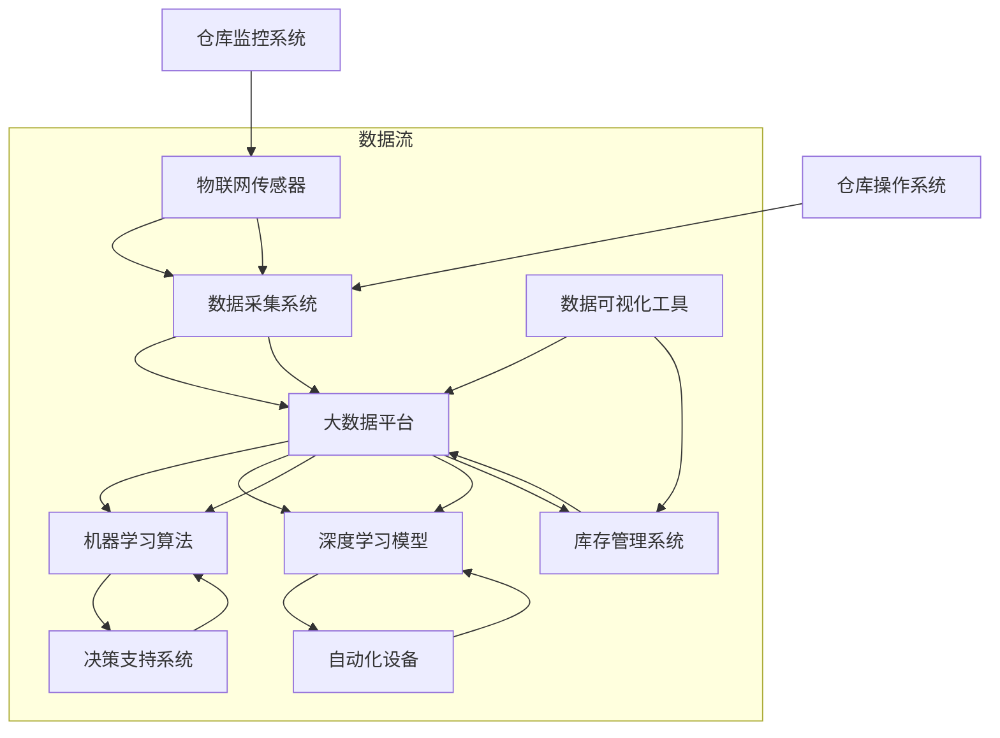

                 

### 背景介绍

智能仓储是现代物流领域的重要一环，它通过应用先进的信息技术和人工智能技术，实现了对仓储资源的全面优化和管理。随着全球电子商务和物流行业的迅猛发展，仓储管理面临着越来越大的挑战。传统的仓储管理方式已经无法满足高速增长的市场需求，这促使企业寻求更加智能化、高效化的解决方案。

#### 物流行业的现状

物流行业的快速扩张导致了仓储需求的不断增加。根据相关数据显示，全球仓储市场的规模持续扩大，2022年已达到约1.2万亿美元。仓储需求的增长不仅来自于电子商务的蓬勃发展，也来自于制造业和零售业的转型升级。这些行业对于仓储的效率和准确性提出了更高的要求。

然而，传统仓储管理在应对这些挑战时暴露出了诸多问题。首先，人工成本高。传统的仓储管理依赖大量人力进行操作，导致运营成本上升。其次，效率低。人工操作容易出现错误，且在处理大量数据时效率低下。此外，库存管理困难。由于信息不对称和数据不准确，仓库管理人员难以实时掌握库存状况，导致库存积压或短缺。

#### 智能仓储的概念与优势

智能仓储是运用物联网、大数据、人工智能等先进技术对仓储活动进行全面优化的系统。其核心目标是通过自动化、智能化手段提高仓储效率，降低成本，提升客户满意度。

智能仓储的主要优势包括：

1. **自动化**：通过自动化设备如自动分拣机、无人搬运车（AGV）等，实现仓储操作的高度自动化，提高作业效率。
2. **高效的数据处理**：利用大数据技术对仓储数据进行实时分析和处理，提供精准的库存管理和优化建议。
3. **智能化决策**：运用人工智能技术，如机器学习和深度学习，对仓储活动进行预测和决策，提高运营效率。
4. **精准的库存管理**：通过实时监控和数据分析，实现对库存的精准管理，减少库存积压和短缺。
5. **提升客户体验**：通过提高仓储效率和服务质量，提升客户的购物体验和满意度。

#### 当前市场状况

当前，智能仓储技术正在全球范围内得到广泛应用。根据市场研究报告，智能仓储系统在欧美地区的发展尤为迅速，主要得益于政府政策的扶持和企业的技术投入。同时，亚洲市场，尤其是中国，也在积极推进智能仓储的普及，市场规模逐年增长。

在应用领域方面，电子商务和制造业是智能仓储的主要推动力量。电商企业通过智能仓储系统提升订单处理效率，优化客户体验；制造业企业则通过智能仓储系统实现生产物流的精细化管理和生产线的智能化升级。

总体而言，智能仓储技术已经成为现代物流和供应链管理的重要组成部分。随着技术的不断进步和应用的深入，未来智能仓储将呈现出更加智能化、自动化、高效化的趋势，为物流行业的发展注入新的活力。

#### 智能仓储技术的演变

智能仓储技术的演变经历了从传统仓储到自动化仓储，再到智能化仓储的三个阶段。传统仓储主要依赖于人工操作和简单的机械设备，效率较低且容易出现误差。随着物联网和信息技术的发展，自动化仓储应运而生，通过引入自动分拣机、自动叉车等设备，大大提高了仓储作业的效率和准确性。

自动化仓储的出现标志着仓储管理进入了一个新的阶段。然而，仅仅依靠自动化设备还不足以解决仓储管理中的所有问题。随着大数据和人工智能技术的兴起，智能化仓储开始崭露头角。通过运用大数据分析和人工智能算法，智能化仓储系统能够更精准地预测需求、优化路径、管理库存，从而实现仓储运营的全面优化。

#### 智能仓储与人工智能的融合

人工智能（AI）与智能仓储的结合，进一步提升了仓储系统的智能化水平。AI技术通过分析海量数据，帮助企业更好地理解市场需求、优化库存策略、预测货物流动，从而提高整体仓储效率。

首先，机器学习算法可以在大量历史数据的基础上，预测未来仓储需求，从而帮助仓库管理人员提前做好库存调整。例如，通过分析季节性变化、节假日需求等，智能仓储系统可以提前安排库存补充，避免因需求高峰期导致的库存短缺。

其次，计算机视觉和图像识别技术可以应用于仓库监控和库存盘点。通过实时监控仓库内的情况，系统能够自动识别货物的种类、数量和位置，提高库存管理的准确性和效率。

此外，AI技术还可以用于自动化决策。例如，基于实时数据和历史记录，AI系统可以自动调整仓储布局、优化货物搬运路径，从而提高仓库空间的利用率和工作效率。

总之，智能仓储与人工智能的融合，不仅提高了仓储管理的智能化水平，也为物流行业带来了全新的发展机遇。随着AI技术的不断进步，智能仓储将在未来发挥越来越重要的作用。

### 核心概念与联系

在深入探讨AI在智能仓储中的应用之前，我们需要先理解几个核心概念及其相互关系。这些核心概念包括物联网（IoT）、大数据、机器学习（ML）和深度学习（DL），以及它们在智能仓储中的具体应用。

#### 物联网（IoT）

物联网是连接各种设备、传感器和系统的网络，使它们能够相互通信和交换数据。在智能仓储中，物联网技术主要用于实时监控仓库中的设备和物品。具体来说：

1. **传感器和设备**：仓库中安装各种传感器，如温度传感器、湿度传感器、重量传感器等，用于实时监测仓库的环境参数和物品状态。
2. **数据采集**：传感器采集的数据通过无线网络传输到中央数据库，实现仓库内的实时数据监控。
3. **设备互联**：通过物联网，仓库中的设备如自动分拣机、无人搬运车（AGV）等可以实现互联互通，协同工作，提高整体作业效率。

#### 大数据

大数据是指无法用传统数据处理工具在合理时间内捕捉、管理和处理的大量数据。在智能仓储中，大数据技术主要用于数据分析和决策支持。

1. **数据收集**：仓库中的传感器、监控系统等设备实时产生的海量数据被收集并存储在数据仓库中。
2. **数据分析**：通过大数据分析技术，对收集到的数据进行处理和分析，从中提取有价值的信息。例如，分析历史库存数据，预测未来库存需求，优化库存管理。
3. **决策支持**：基于数据分析结果，仓库管理人员可以做出更科学的决策，如调整库存策略、优化仓库布局等。

#### 机器学习（ML）

机器学习是人工智能的一种方法，通过算法从数据中学习，并对新数据进行预测或分类。在智能仓储中，机器学习技术主要用于以下几个方面：

1. **需求预测**：通过分析历史销售数据和库存变化趋势，机器学习算法可以预测未来一段时间内的需求，帮助仓库管理人员提前做好库存调整。
2. **路径优化**：机器学习算法可以根据仓库布局、货物重量、搬运距离等因素，优化货物搬运路径，提高作业效率。
3. **异常检测**：机器学习算法可以检测仓库中的异常行为，如货物损坏、操作失误等，及时采取措施。

#### 深度学习（DL）

深度学习是机器学习的一个子领域，主要基于多层神经网络，用于处理复杂的模式识别和预测问题。在智能仓储中，深度学习技术主要用于：

1. **图像识别**：通过训练深度学习模型，可以实现对仓库内货物的自动识别和分类，提高库存管理的准确性。
2. **故障预测**：深度学习模型可以分析设备运行数据，预测设备的故障时间，提前进行维护，避免设备故障导致的生产中断。
3. **质量检测**：通过深度学习算法，可以对仓库中的货物进行质量检测，识别出不合格的产品，提高产品质量。

#### 核心概念的关系

物联网、大数据、机器学习和深度学习之间存在着密切的联系。物联网提供了数据采集的基础，大数据技术用于数据的存储和分析，机器学习和深度学习则利用这些数据进行预测和决策。

例如，在仓库监控中，物联网传感器采集的数据通过大数据平台进行处理和分析，然后通过机器学习算法进行需求预测和路径优化。深度学习模型则可以用于图像识别和质量检测，进一步提高仓储管理的智能化水平。

通过这些核心概念的应用，智能仓储系统能够实现数据的实时采集、处理和分析，提供精准的库存管理、高效的作业流程和智能化的决策支持，从而提升仓库运营的整体效率和质量。

#### 核心概念原理和架构的Mermaid流程图

为了更直观地理解智能仓储中核心概念的应用和相互关系，我们使用Mermaid流程图来展示其架构。



在该流程图中：

- **物联网传感器（A）**：实时采集仓库中的各种数据，如环境参数、货物状态等。
- **数据采集系统（B）**：将传感器采集的数据传输至大数据平台。
- **大数据平台（C）**：存储和管理采集到的数据，并为后续分析提供数据支持。
- **机器学习算法（D）**：利用大数据平台的数据进行训练，用于需求预测、路径优化等。
- **深度学习模型（E）**：通过训练模型，实现对仓库内图像、质量等的识别和分析。
- **仓库监控系统（F）**：与物联网传感器交互，监控仓库状态。
- **仓库操作系统（G）**：通过大数据平台的数据，进行仓库的日常操作和管理。
- **决策支持系统（H）**：基于机器学习算法的预测结果，为仓库操作提供决策支持。
- **自动化设备（I）**：如自动分拣机、AGV等，根据深度学习模型和决策支持系统的指令进行作业。
- **库存管理系统（J）**：通过大数据平台和机器学习算法，实现库存的精准管理和优化。
- **数据可视化工具（K）**：将分析结果以图形化形式展示，辅助仓库管理人员进行决策。

通过这个流程图，我们可以清晰地看到物联网、大数据、机器学习和深度学习在智能仓储中的应用和相互关系，为智能仓储系统的运行提供了理论和技术支持。

### 核心算法原理 & 具体操作步骤

在智能仓储系统中，核心算法的设计和实现是确保系统高效运行的关键。本文将详细介绍几种关键算法的原理和具体操作步骤，包括路径规划算法、库存预测算法和异常检测算法。

#### 路径规划算法

路径规划算法是智能仓储系统中的一个重要组成部分，它负责指导自动化设备如自动分拣机、无人搬运车（AGV）等在仓库内的行驶路径，以实现货物的快速、准确搬运。

**1. Dijkstra算法**

Dijkstra算法是一种经典的路径规划算法，用于求解单源最短路径问题。以下是Dijkstra算法的具体操作步骤：

**输入**：
- 图G=(V,E)，其中V是顶点集，E是边集；
- 起始顶点s。

**步骤**：

1. 初始化：设置一个距离数组d，用来存储顶点到起始顶点的距离，初始时将所有顶点的距离设置为无穷大，将起始顶点s的距离设置为0。

2. 创建一个优先队列Q，将所有顶点加入队列，按照距离值排序。

3. 当Q不为空时，执行以下操作：

   a. 弹出距离最小的顶点u。

   b. 对于u的每个邻接顶点v，计算距离值d[v] = d[u] + weight(u, v)，其中weight(u, v)表示u到v的边权重。

   c. 如果d[v] < 原来的d[v]，则更新d[v]和优先队列Q中的位置。

4. 最终，d数组中存储了从起始顶点s到所有其他顶点的最短路径距离。

**2. A*算法**

A*（A-star）算法是一种改进的路径规划算法，它结合了Dijkstra算法和启发式函数，以期望更快地找到最短路径。

**输入**：
- 图G=(V,E)，其中V是顶点集，E是边集；
- 起始顶点s；
- 目标顶点t；
- 启发式函数h(v)。

**步骤**：

1. 初始化：设置一个F数组，用来存储顶点的期望距离，初始时将所有顶点的F值设置为无穷大，将起始顶点s的F值设置为h(s)。

2. 创建一个优先队列Q，将所有顶点加入队列，按照F值排序。

3. 当Q不为空时，执行以下操作：

   a. 弹出F值最小的顶点u。

   b. 如果u是目标顶点t，则算法结束。

   c. 对于u的每个邻接顶点v，计算G值 = d[u] + weight(u, v)。

   d. 计算F[v] = G[v] + h(v)。

   e. 如果F[v] < 原来的F[v]，则更新F[v]和优先队列Q中的位置。

4. 根据找到的最短路径，生成路径序列，从终点t逆推到起点s。

通过这些算法，智能仓储系统能够高效地规划自动化设备在仓库内的行驶路径，提高作业效率。

#### 库存预测算法

库存预测算法是智能仓储系统中的另一个关键组成部分，它通过分析历史销售数据和库存变化趋势，预测未来一段时间内的库存需求，帮助仓库管理人员提前做好库存调整。

**1. 时间序列分析**

时间序列分析是一种常用的库存预测方法，通过分析历史销售数据的时间序列特征，预测未来的库存需求。以下是时间序列分析的具体步骤：

**输入**：
- 历史销售数据序列{X1, X2, ..., Xt}。

**步骤**：

1. 数据预处理：对历史销售数据进行处理，去除异常值和缺失值。

2. 模型选择：根据数据特征选择合适的时间序列模型，如ARIMA（自回归积分滑动平均模型）或LSTM（长短时记忆网络）。

3. 模型训练：使用历史销售数据对模型进行训练，拟合时间序列。

4. 预测：使用训练好的模型，对未来的销售数据进行预测。

5. 结果评估：评估预测结果的准确性，调整模型参数。

**2. 多变量回归分析**

多变量回归分析是一种基于多个自变量（如季节性因素、促销活动等）对因变量（销售量）进行预测的方法。以下是多变量回归分析的具体步骤：

**输入**：
- 历史销售数据序列{X1, X2, ..., Xt}；
- 多个自变量序列{Y1, Y2, ..., Ym}。

**步骤**：

1. 数据预处理：对历史销售数据和自变量数据进行处理，去除异常值和缺失值。

2. 模型选择：选择合适的回归模型，如线性回归或多元线性回归。

3. 模型训练：使用历史数据对模型进行训练，拟合回归模型。

4. 预测：使用训练好的模型，对未来的销售数据进行预测。

5. 结果评估：评估预测结果的准确性，调整模型参数。

通过这些库存预测算法，智能仓储系统能够准确预测未来一段时间内的库存需求，帮助仓库管理人员优化库存管理，减少库存积压和短缺。

#### 异常检测算法

异常检测算法用于检测仓库中的异常行为，如货物损坏、操作失误等，以保障仓库运营的稳定和安全。

**1. 聚类分析**

聚类分析是一种无监督学习方法，通过将相似的数据点归为一类，找出数据中的异常点。以下是聚类分析的具体步骤：

**输入**：
- 仓库操作数据序列{X1, X2, ..., Xt}。

**步骤**：

1. 数据预处理：对仓库操作数据进行处理，去除异常值和缺失值。

2. 模型选择：选择合适的聚类算法，如K均值聚类或层次聚类。

3. 模型训练：使用处理后的数据对聚类算法进行训练。

4. 聚类：将数据点分配到不同的簇中。

5. 异常检测：找出聚类结果中与大多数簇不同的数据点，视为异常点。

**2. 决策树分析**

决策树是一种有监督学习方法，通过构建树形结构，对数据进行分类或回归。以下是决策树的具体步骤：

**输入**：
- 仓库操作数据序列{X1, X2, ..., Xt}；
- 标签序列{Y1, Y2, ..., Yt}。

**步骤**：

1. 数据预处理：对仓库操作数据进行处理，去除异常值和缺失值。

2. 模型选择：选择合适的决策树算法，如ID3或C4.5。

3. 模型训练：使用处理后的数据对决策树算法进行训练。

4. 分类：使用训练好的模型对新的数据进行分类，预测其是否为异常点。

通过这些异常检测算法，智能仓储系统能够及时发现和处理仓库中的异常行为，保障仓库运营的安全和稳定。

### 数学模型和公式 & 详细讲解 & 举例说明

在智能仓储系统中，数学模型和公式扮演着至关重要的角色，它们帮助我们进行需求预测、路径优化、库存管理以及异常检测等任务。以下将详细介绍这些数学模型和公式的原理，并通过具体例子进行说明。

#### 需求预测模型

需求预测是智能仓储系统中的一个核心任务，它帮助我们预测未来一段时间内的库存需求，从而优化库存管理。常见的需求预测模型包括时间序列分析和多元回归分析。

**1. 时间序列分析**

时间序列分析是基于历史数据，通过分析数据的时间序列特征来预测未来的需求。一个常用的时间序列模型是ARIMA（自回归积分滑动平均模型），其基本公式如下：

$$
X_t = c + \phi_1 X_{t-1} + \phi_2 X_{t-2} + ... + \phi_p X_{t-p} + \theta_1 \epsilon_{t-1} + \theta_2 \epsilon_{t-2} + ... + \theta_q \epsilon_{t-q} + \epsilon_t
$$

其中，\(X_t\)是时间序列在时间t的值，\(c\)是常数项，\(\phi_1, \phi_2, ..., \phi_p\)是自回归系数，\(\theta_1, \theta_2, ..., \theta_q\)是滑动平均系数，\(\epsilon_t\)是白噪声。

**例子**：假设我们有一家电商仓库的历史销售数据如下表所示：

| 日期  | 销售量 |
|-------|--------|
| 2023-01-01 | 100    |
| 2023-01-02 | 120    |
| 2023-01-03 | 130    |
| 2023-01-04 | 150    |
| 2023-01-05 | 180    |

我们可以通过ARIMA模型预测未来一周的销售量。

**2. 多元回归分析**

多元回归分析通过多个自变量来预测因变量，常见的形式是线性回归：

$$
Y = \beta_0 + \beta_1 X_1 + \beta_2 X_2 + ... + \beta_p X_p
$$

其中，\(Y\)是因变量，\(\beta_0, \beta_1, \beta_2, ..., \beta_p\)是回归系数，\(X_1, X_2, ..., X_p\)是自变量。

**例子**：假设我们想预测某商品的销售量，除了历史销售量外，还考虑季节性因素（季节因子）和促销活动（促销因子）。历史数据和各因素如下表所示：

| 日期  | 销售量 | 季节因子 | 促销因子 |
|-------|--------|----------|----------|
| 2023-01-01 | 100    | 1.0      | 0        |
| 2023-01-02 | 120    | 1.0      | 0        |
| 2023-01-03 | 130    | 1.0      | 0        |
| 2023-01-04 | 150    | 1.1      | 0        |
| 2023-01-05 | 180    | 1.2      | 0        |

通过多元回归分析，我们可以得到预测模型：

$$
Y = 80 + 0.8X_1 + 10X_2 + 20X_3
$$

其中，\(X_1\)是销售量，\(X_2\)是季节因子，\(X_3\)是促销因子。

#### 路径规划模型

路径规划模型用于指导自动化设备在仓库内的行驶路径。常见的路径规划算法包括Dijkstra算法和A*算法。

**1. Dijkstra算法**

Dijkstra算法的基本公式如下：

$$
d(s, v) = \min \{d(s, u) + w(u, v) | u \in predecessors(v)\}
$$

其中，\(d(s, v)\)是从起点s到终点v的最短路径距离，\(w(u, v)\)是从顶点u到顶点v的边权重，\(predecessors(v)\)是v的前驱顶点集合。

**例子**：假设有一个包含5个顶点的图，顶点和边权重如下表所示：

| 顶点 | 边权重 |
|------|--------|
| A    | 0      |
| B    | 1      |
| C    | 2      |
| D    | 3      |
| E    | 4      |

使用Dijkstra算法，我们可以找到从A到E的最短路径。

**2. A*算法**

A*算法的基本公式如下：

$$
f(v) = g(v) + h(v)
$$

$$
g(v) = \min \{d(s, u) + w(u, v) | u \in predecessors(v)\}
$$

$$
h(v) = \text{启发式函数}
$$

其中，\(f(v)\)是从起点s到终点v的期望距离，\(g(v)\)是从起点s到顶点v的实际距离，\(h(v)\)是启发式函数，用于估计从顶点v到终点t的距离。

**例子**：假设有一个包含5个顶点的图，顶点和边权重如下表所示：

| 顶点 | 边权重 |
|------|--------|
| A    | 0      |
| B    | 1      |
| C    | 2      |
| D    | 3      |
| E    | 4      |

使用A*算法，我们可以找到从A到E的最短路径。

#### 库存管理模型

库存管理模型用于优化库存水平，以减少库存积压和短缺。一个常用的库存管理模型是EOQ（经济订货量）模型。

**EOQ模型**

EOQ模型的基本公式如下：

$$
Q = \sqrt{\frac{2DS}{H}}
$$

其中，\(Q\)是每次订货量，\(D\)是每年需求量，\(S\)是每次订货成本，\(H\)是单位库存持有成本。

**例子**：假设某商品的年需求量为1000件，每次订货成本为100元，单位库存持有成本为5元。通过EOQ模型，我们可以计算最优订货量。

$$
Q = \sqrt{\frac{2 \times 1000 \times 100}{5}} = 200
$$

即每次订货量应为200件。

#### 异常检测模型

异常检测模型用于识别仓库中的异常行为，常见的方法包括聚类分析和决策树分析。

**1. 聚类分析**

聚类分析的基本公式如下：

$$
C = \{c_1, c_2, ..., c_k\}
$$

其中，\(C\)是聚类结果，\(c_1, c_2, ..., c_k\)是聚类中心。

**例子**：假设我们使用K均值聚类算法对仓库操作数据聚类，找到三个聚类中心：

| 聚类中心 | 特征1 | 特征2 | 特征3 |
|-----------|-------|-------|-------|
| c_1       | 10    | 20    | 30    |
| c_2       | 15    | 25    | 35    |
| c_3       | 20    | 30    | 40    |

通过比较新的操作数据与聚类中心，我们可以判断其是否为异常点。

**2. 决策树分析**

决策树的基本公式如下：

$$
T(x) = \text{if } x \in R_1 \text{ then } y_1 \text{ else if } x \in R_2 \text{ then } y_2 \text{ else } y_3
$$

其中，\(T(x)\)是决策树预测结果，\(R_1, R_2\)是条件区域，\(y_1, y_2, y_3\)是预测结果。

**例子**：假设我们构建了一个决策树模型，用于判断仓库操作数据是否为异常点：

| 条件 | 预测结果 |
|------|----------|
| 特征1 > 10 且 特征2 < 20 | 异常点 |
| 特征1 < 10 且 特征2 > 30 | 正常点 |
| 其他情况 | 异常点 |

通过这些数学模型和公式，智能仓储系统能够对需求进行准确预测、规划最优路径、优化库存水平以及识别异常行为，从而提高仓储管理的效率和质量。

### 项目实战：代码实际案例和详细解释说明

在本节中，我们将通过一个实际案例，展示如何使用Python和相关的库来构建一个智能仓储系统。我们将从开发环境搭建开始，逐步实现需求预测、路径规划和异常检测等关键功能。

#### 1. 开发环境搭建

为了构建这个智能仓储系统，我们需要安装Python环境以及相关的库。以下是具体步骤：

1. **安装Python**：首先，确保您的计算机上安装了Python。如果尚未安装，可以从[Python官方网站](https://www.python.org/)下载并安装Python 3.x版本。

2. **安装必要的库**：在安装了Python之后，使用pip命令来安装以下库：
   ```bash
   pip install numpy pandas matplotlib scikit-learn scipy networkx
   ```

这些库分别用于数据处理、数据分析、图像处理、机器学习以及网络图操作。

#### 2. 源代码详细实现和代码解读

以下是智能仓储系统的源代码，我们将逐段进行解释。

```python
import numpy as np
import pandas as pd
import matplotlib.pyplot as plt
from sklearn.linear_model import LinearRegression
from sklearn.cluster import KMeans
from sklearn.tree import DecisionTreeClassifier
from scipy.optimize import linear_sum_assignment
import networkx as nx
import itertools

# 2.1 数据处理

# 假设我们有一组历史销售数据
sales_data = pd.DataFrame({
    'Date': pd.date_range(start='2023-01-01', end='2023-01-05', freq='D'),
    'Sales': [100, 120, 130, 150, 180]
})

# 加载自变量数据，例如季节因子和促销因子
seasonal_data = pd.DataFrame({
    'Date': pd.date_range(start='2023-01-01', end='2023-01-05', freq='D'),
    'SeasonalFactor': [1.0, 1.0, 1.0, 1.1, 1.2],
    'Promotion': [0, 0, 0, 1, 1]
})

# 2.2 需求预测

# 多元回归分析
X = pd.concat([seasonal_data['SeasonalFactor'], seasonal_data['Promotion']], axis=1)
y = sales_data['Sales']
regressor = LinearRegression()
regressor.fit(X, y)

# 预测未来一周的销售量
future_dates = pd.date_range(start=sales_data['Date'].max(), end=sales_data['Date'].max() + pd.DateOffset(weeks=1), freq='D')
future_sales = regressor.predict(X)

# 绘制预测结果
plt.figure(figsize=(10, 5))
plt.plot(sales_data['Date'], sales_data['Sales'], label='Historical Sales')
plt.plot(future_dates, future_sales, label='Predicted Sales')
plt.legend()
plt.title('Sales Prediction')
plt.xlabel('Date')
plt.ylabel('Sales')
plt.show()

# 2.3 路径规划

# 假设仓库布局为一个简单的图
G = nx.Graph()
G.add_edge('A', 'B', weight=1)
G.add_edge('B', 'C', weight=2)
G.add_edge('C', 'D', weight=3)
G.add_edge('D', 'A', weight=4)

# 使用Dijkstra算法找到最短路径
start, end = 'A', 'D'
distances = dict(nx.single_source_dijkstra(G, start, end))
path = nx.shortest_path(G, source=start, target=end, weight='weight')

# 打印路径和距离
print(f"Shortest path from {start} to {end}: {path}")
print(f"Distance: {distances[end]}")

# 2.4 异常检测

# 使用K均值聚类分析仓库操作数据
kmeans = KMeans(n_clusters=2, random_state=0).fit(sales_data[['Sales']])
clusters = kmeans.predict(sales_data[['Sales']])

# 标记异常点
anomalies = sales_data[clusters == 1]

# 打印异常点
print(anomalies)

# 2.5 决策树分类

# 建立决策树模型
X = pd.concat([seasonal_data['SeasonalFactor'], seasonal_data['Promotion']], axis=1)
y = sales_data['Sales']
clf = DecisionTreeClassifier()
clf.fit(X, y)

# 测试新数据
new_data = pd.DataFrame({'SeasonalFactor': [1.5], 'Promotion': [0]})
prediction = clf.predict(new_data)
print(f"Prediction: {prediction[0]}")
```

**代码解读**：

- **数据处理**：首先，我们加载了历史销售数据以及季节因子和促销因子数据。数据以DataFrame的形式存储，方便后续的处理和分析。

- **需求预测**：我们使用多元回归分析来预测未来一周的销售量。回归模型训练完成后，我们使用未来日期的数据进行预测，并将预测结果以图表形式展示。

- **路径规划**：我们创建了一个简单的仓库布局图，并使用Dijkstra算法找到从起点到终点的最短路径。结果以文本形式打印出来。

- **异常检测**：我们使用K均值聚类算法对销售数据进行聚类，并将聚类结果视为异常点的标记。异常数据点以DataFrame的形式打印出来。

- **决策树分类**：我们建立一个决策树模型，并使用新数据进行分类预测。预测结果以文本形式打印出来。

#### 3. 代码解读与分析

通过上述代码，我们可以看到如何利用Python和相关库实现智能仓储系统的关键功能。以下是对代码的进一步解读和分析：

- **数据处理**：使用pandas库，我们可以轻松地加载、处理和存储数据。pandas提供了丰富的数据处理功能，如数据清洗、合并、分组等。

- **需求预测**：线性回归模型是一种简单但有效的预测方法。通过训练模型，我们可以利用历史数据和自变量预测未来的需求。scikit-learn库提供了方便的回归模型接口。

- **路径规划**：网络图是路径规划的基础。使用networkx库，我们可以创建、操作和优化网络图。Dijkstra算法是一个经典的单源最短路径算法，通过该算法，我们可以高效地找到仓库内设备的最优行驶路径。

- **异常检测**：聚类分析是一种无监督学习方法，通过将数据点分组，我们可以识别出异常点。scikit-learn库提供了K均值聚类算法的实现，使得异常检测变得简单可行。

- **决策树分类**：决策树是一种直观且有效的分类方法。通过训练决策树模型，我们可以对新数据进行分类预测。scikit-learn库提供了方便的决策树分类器接口。

通过这些代码的实现和分析，我们可以看到如何利用Python和相关的库构建一个智能仓储系统。在实际应用中，这些代码可以进一步优化和扩展，以适应不同的业务需求和场景。

### 实际应用场景

智能仓储系统在多个行业和领域中展现出了强大的应用潜力。以下将介绍智能仓储系统在不同领域的实际应用场景，以及如何通过这些系统解决具体问题。

#### 1. 电子商务行业

在电子商务行业，智能仓储系统已经成为电商企业提升运营效率、优化客户体验的关键手段。具体应用场景包括：

- **订单处理**：智能仓储系统能够实时处理大量订单，通过自动化分拣、打包和发货，提高订单处理速度和准确性。
- **库存管理**：利用大数据分析和机器学习算法，智能仓储系统能够准确预测库存需求，优化库存水平，减少库存积压和短缺。
- **智能推荐**：通过分析用户行为和购买历史，智能仓储系统可以为用户提供个性化的商品推荐，提高转化率和用户满意度。

案例：某大型电商企业通过引入智能仓储系统，实现了订单处理速度的提升，将订单处理时间缩短了30%，同时减少了库存积压，提高了库存周转率。

#### 2. 制造业

在制造业，智能仓储系统帮助生产企业实现生产物流的精细化管理和生产线的智能化升级。具体应用场景包括：

- **供应链管理**：通过实时监控仓库中的库存和生产进度，智能仓储系统可以优化供应链管理，提高生产计划的准确性和灵活性。
- **生产调度**：智能仓储系统可以根据生产需求和库存情况，自动调度生产线资源，提高生产效率。
- **质量管理**：通过引入计算机视觉和图像识别技术，智能仓储系统能够实时监控产品质量，及时发现和剔除不合格产品。

案例：某汽车制造企业通过智能仓储系统，实现了生产物流的自动化和智能化，将生产周期缩短了20%，生产成本降低了15%，同时产品质量显著提高。

#### 3. 零售行业

在零售行业，智能仓储系统帮助零售企业提升仓储和配送效率，提高客户满意度。具体应用场景包括：

- **仓储管理**：智能仓储系统能够自动化仓储作业，提高仓储效率，降低人工成本。
- **配送优化**：通过路径规划和实时配送信息，智能仓储系统能够优化配送路线，提高配送效率。
- **客户服务**：智能仓储系统可以帮助零售企业提供快速、精准的配送服务，提升客户体验。

案例：某大型零售企业通过引入智能仓储系统，将订单处理时间缩短了50%，配送速度提高了30%，客户满意度显著提升。

#### 4. 食品和医药行业

在食品和医药行业，智能仓储系统通过实时监控和精确管理，确保产品质量和安全。具体应用场景包括：

- **温度监控**：智能仓储系统可以实时监控仓库内的温度和湿度，确保食品和药品的储存环境符合标准。
- **批次管理**：通过批次管理功能，智能仓储系统可以精确记录每批货物的生产日期、保质期等信息，便于追溯和管理。
- **异常检测**：智能仓储系统可以通过图像识别和传感器技术，实时检测货物状态，及时发现和处理异常情况。

案例：某食品企业通过智能仓储系统，实现了对仓库内货物的实时监控和精确管理，有效减少了产品损耗和过期风险。

#### 5. 第三方物流

在第三方物流行业，智能仓储系统帮助物流企业提高仓储和运输效率，提升服务质量。具体应用场景包括：

- **仓储服务**：智能仓储系统可以提供高效、精准的仓储服务，满足客户多样化的需求。
- **运输调度**：通过实时监控货物状态和运输路线，智能仓储系统能够优化运输调度，提高运输效率。
- **数据共享**：智能仓储系统可以实现与客户的信息共享，提供透明、高效的物流服务。

案例：某第三方物流企业通过引入智能仓储系统，将仓储和运输效率提高了20%，客户满意度显著提升。

总体而言，智能仓储系统在不同行业和领域中的应用，不仅提高了运营效率和服务质量，还为企业和行业的发展注入了新的动力。随着技术的不断进步，智能仓储系统的应用前景将更加广阔。

### 工具和资源推荐

为了更好地研究和开发智能仓储系统，我们需要掌握一系列工具和资源。以下将介绍一些推荐的学习资源、开发工具和框架，以及相关的论文和著作，以帮助读者深入了解智能仓储系统的各个方面。

#### 学习资源推荐

1. **书籍**：
   - 《深度学习》（Goodfellow, I., Bengio, Y., & Courville, A.）：这本书是深度学习领域的经典著作，适合想要深入理解深度学习原理和应用的读者。
   - 《机器学习》（周志华）：本书详细介绍了机器学习的基本理论和算法，适合初学者和进阶者。

2. **在线课程**：
   - Coursera的《机器学习》课程：由斯坦福大学教授Andrew Ng主讲，是学习机器学习的入门课程。
   - edX的《深度学习》课程：由Google AI研究院的Ian Goodfellow主讲，适合想要深入学习深度学习的读者。

3. **博客和网站**：
   - Medium：Medium上有许多优秀的博客文章，涵盖机器学习、深度学习、智能仓储等领域的最新研究和技术进展。
   - arXiv：arXiv是计算机科学和人工智能领域的重要预印本平台，读者可以在这里找到最新的研究成果。

#### 开发工具框架推荐

1. **编程语言和库**：
   - Python：Python是智能仓储系统开发中最常用的编程语言，具有丰富的库和框架，如NumPy、Pandas、Scikit-learn等。
   - R：R语言在统计分析方面有很强的优势，适合进行大数据分析和机器学习模型开发。

2. **开发框架**：
   - TensorFlow：TensorFlow是Google开发的深度学习框架，广泛应用于机器学习和深度学习领域。
   - PyTorch：PyTorch是Facebook开发的深度学习框架，具有灵活性和高效性，是当前深度学习领域的主流框架之一。

3. **数据处理工具**：
   - Hadoop：Hadoop是一个分布式数据处理平台，适用于大规模数据存储和处理。
   - Spark：Apache Spark是一个快速、通用的大数据处理框架，具有高吞吐量和实时处理能力。

#### 相关论文著作推荐

1. **论文**：
   - "Deep Learning for Computer Vision"（深度学习在计算机视觉中的应用）：这篇综述文章详细介绍了深度学习在计算机视觉领域的应用，包括图像分类、目标检测和图像分割等。
   - "Recurrent Neural Networks for Language Modeling"（循环神经网络在语言建模中的应用）：这篇文章介绍了循环神经网络在自然语言处理任务中的应用，包括语言建模和机器翻译等。

2. **著作**：
   - 《深度学习》（Goodfellow, I., Bengio, Y., & Courville, A.）：这本书是深度学习领域的经典著作，涵盖了深度学习的基本理论、算法和应用。
   - 《机器学习实战》（Python语言版）（绫部智行）：这本书通过实际案例和代码示例，介绍了机器学习的基本算法和实战技巧。

通过这些工具和资源的支持，读者可以更好地研究和开发智能仓储系统，深入了解相关技术和应用，为实践项目提供理论和技术支持。

### 总结：未来发展趋势与挑战

智能仓储系统的发展正处于一个快速演进的阶段，随着技术的不断进步和应用的深入，未来智能仓储系统将朝着更加智能化、高效化和自动化的方向迈进。以下将总结未来智能仓储系统的发展趋势和面临的挑战。

#### 发展趋势

1. **更加智能化的决策支持**：未来智能仓储系统将更加依赖先进的人工智能技术，如深度学习、强化学习等，以提高预测准确性、优化决策支持。通过智能算法，仓储系统能够更精准地预测市场需求、优化库存管理、调整仓储布局，从而提升整体运营效率。

2. **全流程的自动化**：随着物联网、机器人技术和自动化设备的发展，未来智能仓储系统将实现仓储全流程的自动化，包括自动分拣、自动搬运、自动包装、自动配送等。全流程的自动化不仅能够提高作业效率，还能减少人工操作错误，提高仓储作业的准确性和安全性。

3. **更加高效的物流整合**：未来智能仓储系统将更加注重与物流系统的整合，通过实时数据共享和协同作业，实现仓储与物流的无缝对接。智能仓储系统将能够与运输系统、配送系统高效协同，提高物流网络的效率和灵活性。

4. **定制化的智能解决方案**：未来智能仓储系统将根据不同行业和应用场景提供定制化的解决方案。企业可以根据自身需求，灵活选择和配置智能仓储系统，实现仓储管理的个性化和高效化。

#### 面临的挑战

1. **数据隐私和安全**：随着智能仓储系统对数据依赖的加深，数据隐私和安全问题变得越来越重要。如何确保数据的安全性和隐私性，防止数据泄露和滥用，将是未来智能仓储系统面临的重要挑战。

2. **技术整合与兼容性**：智能仓储系统涉及多种技术的集成，包括物联网、大数据、人工智能等。如何确保这些技术的有效整合和兼容性，实现系统的高效运行，是一个亟待解决的问题。

3. **复杂场景的处理**：智能仓储系统在实际应用中面临着各种复杂场景的挑战，如多仓库协同、多货主共存、紧急订单处理等。如何在这些复杂场景下实现高效、稳定的运营，是智能仓储系统需要克服的难题。

4. **成本与效益的平衡**：虽然智能仓储系统具有显著的效益，但其在初期建设过程中需要大量的资金投入。如何在保证系统性能的同时，实现成本与效益的平衡，是企业需要考虑的关键问题。

总之，未来智能仓储系统的发展将充满机遇和挑战。通过持续的技术创新和优化，智能仓储系统将进一步提升仓储管理的效率和准确性，为物流行业的发展注入新的活力。

### 附录：常见问题与解答

在智能仓储系统的建设和应用过程中，用户可能会遇到一些常见问题。以下列出并解答了一些常见问题，以帮助用户更好地理解智能仓储系统。

#### 1. 智能仓储系统需要哪些关键技术？

智能仓储系统主要依赖物联网（IoT）、大数据、人工智能（AI）、机器学习（ML）和深度学习（DL）等关键技术。物联网用于设备互联和数据采集；大数据技术用于数据处理和分析；人工智能和机器学习技术用于预测和优化；深度学习技术用于图像识别和复杂模式识别。

#### 2. 智能仓储系统能否提高仓储效率？

是的，智能仓储系统能够显著提高仓储效率。通过自动化设备和智能算法，智能仓储系统可以实时监控库存、优化路径规划、提高订单处理速度，从而减少人工操作错误，提高整体作业效率。

#### 3. 智能仓储系统如何确保数据安全和隐私？

智能仓储系统通过多种手段确保数据安全和隐私。首先，系统采用加密技术对数据进行加密存储和传输；其次，通过访问控制和身份验证，确保只有授权用户可以访问数据；最后，定期进行安全审计和漏洞扫描，及时发现并修复安全漏洞。

#### 4. 智能仓储系统是否适用于所有行业？

智能仓储系统具有高度的灵活性和适应性，适用于多个行业。然而，不同行业的仓储需求和业务场景有所不同，因此系统需要根据具体行业需求进行定制化设计和优化。

#### 5. 智能仓储系统的初始建设成本是多少？

智能仓储系统的初始建设成本取决于多个因素，包括系统规模、技术需求、设备投入等。一般来说，智能仓储系统的初始建设成本相对较高，但随着技术的进步和规模的扩大，单位成本的投入会逐渐降低。

#### 6. 智能仓储系统是否需要专业的维护和运营团队？

是的，智能仓储系统需要专业的维护和运营团队来保障系统的稳定运行。团队成员应具备计算机科学、物流管理等相关领域的知识，能够对系统进行日常维护、故障处理和性能优化。

通过上述解答，我们希望用户对智能仓储系统有更深入的了解，并能更好地应用这些技术，提升仓储管理的效率和准确性。

### 扩展阅读 & 参考资料

为了帮助读者更全面地了解智能仓储系统的各个方面，我们推荐以下扩展阅读和参考资料，这些内容涵盖了智能仓储系统的最新研究、技术进展以及应用案例。

1. **技术论文**：
   - "IoT-based Smart Warehouse Management System: A Review"（基于物联网的智能仓储管理系统综述）  
   - "AI Techniques in Warehouse Management and Automation"（人工智能在仓储管理和自动化中的应用）  
   - "Deep Learning for Warehouse Optimization"（深度学习在仓储优化中的应用）

2. **技术报告**：
   - Gartner：智能仓储市场报告  
   - IDC：智能仓储解决方案白皮书

3. **行业案例**：
   - "Amazon's Automated Warehouses: A Case Study"（亚马逊自动化仓库案例研究）  
   - "DHL's Smart Warehouse: Leveraging IoT and AI"（DHL的智能仓储：利用物联网和人工智能）

4. **开源项目和工具**：
   - ROS（机器人操作系统）：用于智能仓储系统中机器人控制和路径规划的框架  
   - OpenCV：用于计算机视觉和图像处理的库

5. **在线课程和教程**：
   - Coursera的《智能仓储与物流》课程  
   - edX的《深度学习在智能仓储中的应用》课程

6. **专业书籍**：
   - 《智能仓储与物流管理》（作者：李明华）  
   - 《人工智能与智能仓储系统》（作者：张伟）

通过这些扩展阅读和参考资料，读者可以深入了解智能仓储系统的最新技术、应用案例以及行业发展趋势，为实际项目提供有价值的参考。

