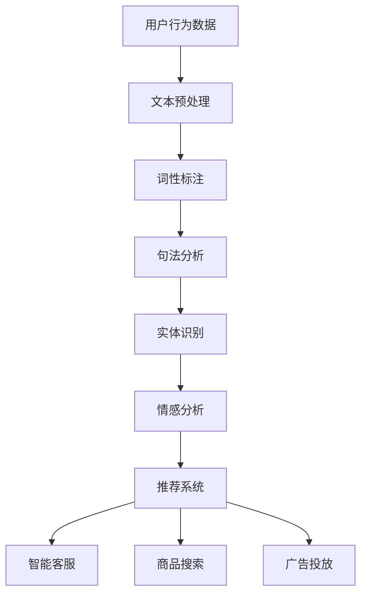
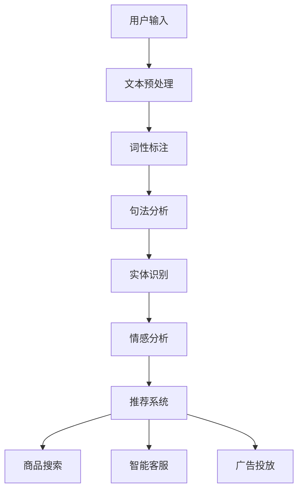

                 

# AI在电商中的NLP技术应用案例

## 关键词：自然语言处理、电商、人机交互、推荐系统、文本挖掘

## 摘要：
随着电子商务的蓬勃发展，自然语言处理（NLP）技术在电商领域的应用日益广泛。本文将从背景介绍、核心概念与联系、核心算法原理与操作步骤、数学模型与公式讲解、项目实战、实际应用场景、工具和资源推荐等方面，深入探讨AI在电商中的NLP技术应用案例，旨在为读者提供一份全面而深入的指南。

## 1. 背景介绍

近年来，随着互联网技术的飞速发展，电子商务逐渐成为人们日常生活不可或缺的一部分。然而，随着用户数量的急剧增加，电商平台的竞争也愈发激烈。为了在激烈的市场竞争中脱颖而出，电商平台需要不断创新和优化用户体验。自然语言处理（NLP）技术的应用，使得电商平台能够更好地理解用户需求、提供个性化推荐，从而提升用户满意度和黏性。

NLP技术主要包括文本预处理、词性标注、句法分析、实体识别、情感分析、文本生成等。在电商领域，这些技术可以应用于商品推荐、用户评论分析、智能客服、商品搜索、广告投放等多个方面。通过NLP技术，电商平台能够更好地理解用户行为和需求，从而提供更加精准的服务。

## 2. 核心概念与联系

为了更好地理解NLP技术在电商中的应用，首先需要了解一些核心概念和它们之间的联系。以下是一个Mermaid流程图，展示了NLP技术在电商中的主要流程和核心概念。



### 2.1. 文本预处理

文本预处理是NLP技术的第一步，主要包括去除标点符号、停用词过滤、词干提取等。文本预处理的质量直接影响后续分析的结果。在电商领域，文本预处理可以应用于用户评论分析、商品搜索等。

### 2.2. 词性标注

词性标注是指将文本中的每个单词标注为名词、动词、形容词等。词性标注有助于理解文本的语法结构，对于情感分析和实体识别等任务非常重要。

### 2.3. 句法分析

句法分析是指对文本进行语法分析，识别出句子中的主语、谓语、宾语等成分。句法分析可以帮助理解文本的含义，对于商品搜索和广告投放等任务具有重要作用。

### 2.4. 实体识别

实体识别是指从文本中识别出具有特定意义的实体，如人名、地名、组织名、产品名等。实体识别有助于了解用户对商品的评价和需求，对于推荐系统和广告投放等任务具有重要意义。

### 2.5. 情感分析

情感分析是指通过分析文本中的情感倾向，了解用户的情感状态。情感分析可以应用于用户评论分析、智能客服等，有助于提升用户体验。

### 2.6. 推荐系统

推荐系统是指根据用户历史行为和偏好，为用户推荐相关商品。推荐系统可以通过分析用户评论、商品描述等文本数据，提高推荐精度。

### 2.7. 智能客服

智能客服是指利用自然语言处理技术，实现与用户的智能对话。智能客服可以应用于电商平台的售前咨询、售后支持等，提高客户满意度。

### 2.8. 商品搜索

商品搜索是指利用自然语言处理技术，帮助用户快速找到所需商品。商品搜索可以通过分析用户查询语句，提高搜索精度。

### 2.9. 广告投放

广告投放是指利用自然语言处理技术，实现精准的广告投放。广告投放可以通过分析用户评论、浏览历史等文本数据，提高广告投放效果。

## 3. 核心算法原理 & 具体操作步骤

### 3.1. 文本预处理

文本预处理的核心算法包括去除标点符号、停用词过滤、词干提取等。具体操作步骤如下：

1. 去除标点符号：使用正则表达式将文本中的标点符号替换为空格。
2. 停用词过滤：从停用词表中删除常见的无意义词汇，如“的”、“了”、“和”等。
3. 词干提取：使用词干提取算法，如Porter Stemmer算法，将文本中的单词还原为词干。

### 3.2. 词性标注

词性标注的核心算法包括基于规则的方法和基于统计的方法。基于规则的方法依赖于手工编写的语法规则，如LL（1）分析法；基于统计的方法则依赖于大规模语料库和机器学习算法，如条件随机场（CRF）。

具体操作步骤如下：

1. 准备训练数据：从大规模语料库中提取包含词性的句子，用于训练词性标注模型。
2. 训练词性标注模型：使用机器学习算法，如CRF，训练词性标注模型。
3. 应用词性标注模型：对未知句子进行词性标注。

### 3.3. 句法分析

句法分析的核心算法包括基于规则的方法和基于统计的方法。基于规则的方法如LL（1）分析法；基于统计的方法如依存句法分析。

具体操作步骤如下：

1. 准备训练数据：从大规模语料库中提取包含句法信息的句子，用于训练句法分析模型。
2. 训练句法分析模型：使用机器学习算法，如LSTM，训练句法分析模型。
3. 应用句法分析模型：对未知句子进行句法分析。

### 3.4. 实体识别

实体识别的核心算法包括基于规则的方法和基于统计的方法。基于规则的方法如命名实体识别（NER）规则；基于统计的方法如转移矩阵。

具体操作步骤如下：

1. 准备训练数据：从大规模语料库中提取包含实体的句子，用于训练实体识别模型。
2. 训练实体识别模型：使用机器学习算法，如CRF，训练实体识别模型。
3. 应用实体识别模型：对未知句子进行实体识别。

### 3.5. 情感分析

情感分析的核心算法包括基于规则的方法和基于统计的方法。基于规则的方法如情感词典；基于统计的方法如朴素贝叶斯、支持向量机（SVM）。

具体操作步骤如下：

1. 准备训练数据：从大规模语料库中提取包含情感极性的句子，用于训练情感分析模型。
2. 训练情感分析模型：使用机器学习算法，如朴素贝叶斯、SVM，训练情感分析模型。
3. 应用情感分析模型：对未知句子进行情感分析。

## 4. 数学模型和公式 & 详细讲解 & 举例说明

### 4.1. 朴素贝叶斯算法

朴素贝叶斯算法是一种基于贝叶斯定理的简单概率分类器。在NLP领域，朴素贝叶斯算法常用于情感分析、垃圾邮件过滤等任务。

**贝叶斯定理公式：**

$$
P(A|B) = \frac{P(B|A) \cdot P(A)}{P(B)}
$$

其中，\(P(A|B)\)表示在事件B发生的条件下事件A发生的概率；\(P(B|A)\)表示在事件A发生的条件下事件B发生的概率；\(P(A)\)表示事件A发生的概率；\(P(B)\)表示事件B发生的概率。

**举例：**

假设有一个情感分析任务，需要判断一段文本是否为正面情感。已知正面情感的概率为0.6，负面情感的概率为0.4。给定一个文本，我们需要计算它属于正面情感的概率。

1. \(P(正面情感) = 0.6\)
2. \(P(负面情感) = 0.4\)
3. \(P(文本正面情感 | 正面情感) = 0.8\)（表示正面情感文本的概率）
4. \(P(文本负面情感 | 负面情感) = 0.2\)（表示负面情感文本的概率）
5. \(P(文本正面情感 | 正面情感) \cdot P(正面情感) = 0.8 \cdot 0.6 = 0.48\)
6. \(P(文本负面情感 | 负面情感) \cdot P(负面情感) = 0.2 \cdot 0.4 = 0.08\)
7. \(P(文本正面情感) = P(文本正面情感 | 正面情感) \cdot P(正面情感) + P(文本负面情感 | 负面情感) \cdot P(负面情感) = 0.48 + 0.08 = 0.56\)
8. \(P(文本正面情感 | 正面情感) = \frac{P(文本正面情感 | 正面情感) \cdot P(正面情感)}{P(文本正面情感)} = \frac{0.48}{0.56} = 0.857\)

因此，这段文本属于正面情感的概率为0.857。

### 4.2. 支持向量机（SVM）

支持向量机是一种常用的机器学习算法，可用于分类和回归任务。在NLP领域，SVM常用于文本分类、情感分析等任务。

**SVM的核心公式：**

$$
w \cdot x + b = 0
$$

其中，\(w\)表示权重向量；\(x\)表示输入向量；\(b\)表示偏置。

**举例：**

假设我们需要使用SVM进行情感分析，给定一个文本向量\(x = [1, 2, 3]\)和权重向量\(w = [0.5, 0.5, -1]\)以及偏置\(b = 0\)。我们需要判断这段文本的情感极性。

1. \(w \cdot x + b = 0.5 \cdot 1 + 0.5 \cdot 2 - 1 \cdot 3 + 0 = -1.5 + 0 = -1.5\)
2. 由于结果小于0，说明这段文本的情感极性为负面。

### 4.3. 朴素贝叶斯和SVM的比较

**优势：**

- 朴素贝叶斯：计算速度快，模型简单。
- SVM：分类效果较好，尤其是对于高维数据。

**劣势：**

- 朴素贝叶斯：对特征之间存在强相关性敏感。
- SVM：计算复杂度高，对大规模数据集性能较差。

## 5. 项目实战：代码实际案例和详细解释说明

### 5.1. 开发环境搭建

首先，我们需要搭建一个Python开发环境，并安装以下库：

- TensorFlow：用于构建深度学习模型。
- Keras：用于简化TensorFlow的使用。
- NLTK：用于文本预处理。
- Sklearn：用于机器学习算法。

在终端中执行以下命令进行安装：

```
pip install tensorflow keras nltk sklearn
```

### 5.2. 源代码详细实现和代码解读

以下是一个简单的情感分析项目，使用Keras构建深度学习模型，并使用NLTK进行文本预处理。

```python
import numpy as np
import pandas as pd
from nltk.corpus import stopwords
from nltk.tokenize import word_tokenize
from keras.models import Sequential
from keras.layers import Dense, Embedding, LSTM, SpatialDropout1D
from keras.preprocessing.sequence import pad_sequences
from keras.preprocessing.text import Tokenizer
from sklearn.model_selection import train_test_split
from sklearn.metrics import accuracy_score, classification_report

# 读取数据集
data = pd.read_csv('movie_reviews.csv')

# 文本预处理
stop_words = set(stopwords.words('english'))
tokenizer = Tokenizer(num_words=5000, filters='\n')
tokenizer.fit_on_texts(data['review'])

# 分词并去除停用词
def preprocess_text(text):
    tokens = word_tokenize(text)
    filtered_tokens = [token.lower() for token in tokens if token.isalpha() and token not in stop_words]
    return filtered_tokens

# 预处理后的文本
preprocessed_texts = [preprocess_text(text) for text in data['review']]

# 序列化文本
sequences = tokenizer.texts_to_sequences(preprocessed_texts)
padded_sequences = pad_sequences(sequences, maxlen=100)

# 标签编码
labels = pd.get_dummies(data['sentiment'])

# 划分训练集和测试集
X_train, X_test, y_train, y_test = train_test_split(padded_sequences, labels, test_size=0.2, random_state=42)

# 构建模型
model = Sequential()
model.add(Embedding(5000, 128, input_length=100))
model.add(SpatialDropout1D(0.2))
model.add(LSTM(128, dropout=0.2, recurrent_dropout=0.2))
model.add(Dense(2, activation='softmax'))

# 编译模型
model.compile(loss='categorical_crossentropy', optimizer='adam', metrics=['accuracy'])

# 训练模型
model.fit(X_train, y_train, epochs=10, batch_size=32, validation_data=(X_test, y_test))

# 评估模型
predictions = model.predict(X_test)
predicted_labels = np.argmax(predictions, axis=1)
accuracy = accuracy_score(y_test['positive'], predicted_labels)
print('Accuracy:', accuracy)
print(classification_report(y_test['positive'], predicted_labels))
```

### 5.3. 代码解读与分析

1. **数据读取和预处理**：首先读取数据集，然后使用NLTK进行文本预处理，包括分词和去除停用词。
2. **序列化和填充**：将预处理后的文本序列化，并使用pad_sequences函数将序列填充为固定长度。
3. **标签编码**：使用get_dummies函数将标签进行编码。
4. **模型构建**：使用Keras构建一个简单的LSTM模型，包括嵌入层、空间丢弃层和LSTM层。
5. **模型编译和训练**：编译模型并使用训练集进行训练。
6. **模型评估**：使用测试集评估模型性能，并输出准确率和分类报告。

## 6. 实际应用场景

### 6.1. 商品推荐

电商平台可以使用NLP技术对用户评论和商品描述进行情感分析和文本挖掘，从而为用户提供个性化的商品推荐。例如，当用户对某件商品发表好评时，系统可以推荐类似商品；当用户对某件商品发表差评时，系统可以推荐替代商品。

### 6.2. 智能客服

智能客服是NLP技术在电商领域的重要应用之一。通过自然语言处理技术，智能客服可以理解和回应用户的问题，提供快速而准确的答案。例如，当用户询问关于商品的具体信息时，智能客服可以快速检索相关商品描述并给出答案。

### 6.3. 商品搜索

商品搜索是电商平台的基础功能之一。通过NLP技术，电商平台可以实现基于语义的搜索，提高搜索精度和用户体验。例如，当用户输入“蓝色羽绒服”时，系统可以识别出用户的需求，并推荐相关商品。

### 6.4. 广告投放

电商平台可以使用NLP技术分析用户评论和浏览历史，实现精准的广告投放。例如，当用户对某件商品发表好评时，系统可以推送相关广告；当用户对某件商品发表差评时，系统可以推送替代商品广告。

## 7. 工具和资源推荐

### 7.1. 学习资源推荐

- **书籍：**
  - 《自然语言处理综合教程》（作者：张华平）
  - 《深度学习》（作者：伊恩·古德费洛等）
  - 《Python数据科学手册》（作者：Jake VanderPlas）

- **论文：**
  - 《Word2Vec: Word Representations Based on Context, 2013》
  - 《Long Short-Term Memory, 1997》
  - 《Recurrent Neural Network Based Text Classification, 2014》

- **博客：**
  - 《深度学习与自然语言处理》（作者：吴恩达）
  - 《自然语言处理实战》（作者：张亮）
  - 《Python自然语言处理实战》（作者：李栋）

- **网站：**
  - [TensorFlow官网](https://www.tensorflow.org/)
  - [Keras官网](https://keras.io/)
  - [NLTK官网](https://www.nltk.org/)

### 7.2. 开发工具框架推荐

- **深度学习框架：**
  - TensorFlow
  - PyTorch
  - Keras

- **自然语言处理库：**
  - NLTK
  - Spacy
  - Stanford CoreNLP

- **数据预处理工具：**
  - Pandas
  - Numpy

### 7.3. 相关论文著作推荐

- **论文：**
  - 《A Neural Probabilistic Language Model, 2003》
  - 《Recurrent Neural Network Based Text Classification, 2014》
  - 《Deep Learning for Text Classification, 2016》

- **著作：**
  - 《自然语言处理原理与实例》（作者：马丁·艾兹）
  - 《深度学习与自然语言处理》（作者：吴恩达等）
  - 《Python自然语言处理应用》（作者：安德烈亚斯·斯特凡诺普洛斯）

## 8. 总结：未来发展趋势与挑战

随着人工智能技术的不断发展，NLP技术在电商领域的应用前景十分广阔。未来，NLP技术在电商领域的发展趋势和挑战主要包括：

1. **个性化推荐**：如何更好地理解用户需求，提供更加精准的个性化推荐。
2. **实时交互**：如何实现实时的人机交互，提高用户体验。
3. **多语言处理**：如何实现多语言的自然语言处理，满足全球化需求。
4. **模型压缩**：如何减小模型大小，提高计算效率。
5. **隐私保护**：如何在保障用户隐私的前提下，进行数据分析和挖掘。

## 9. 附录：常见问题与解答

1. **问题：NLP技术在电商领域的应用有哪些？**
   **解答**：NLP技术在电商领域有广泛的应用，包括商品推荐、智能客服、商品搜索、广告投放等。

2. **问题：如何进行文本预处理？**
   **解答**：文本预处理包括去除标点符号、停用词过滤、词干提取等步骤。

3. **问题：如何进行词性标注？**
   **解答**：词性标注可以采用基于规则的方法或基于统计的方法，如LL（1）分析法和条件随机场（CRF）。

4. **问题：如何进行句法分析？**
   **解答**：句法分析可以采用基于规则的方法或基于统计的方法，如LL（1）分析法和依存句法分析。

5. **问题：如何进行情感分析？**
   **解答**：情感分析可以采用基于规则的方法或基于统计的方法，如情感词典和朴素贝叶斯、支持向量机（SVM）。

## 10. 扩展阅读 & 参考资料

- [NLP in E-commerce: A Brief Introduction](https://towardsdatascience.com/nlp-in-e-commerce-a-brief-introduction-19d29c3912a5)
- [Natural Language Processing in E-commerce Applications](https://www MACHINE LEARNING.ORG/content/natural-language-processing-in-e-commerce-applications)
- [Using NLP to Improve E-commerce User Experience](https://www.mediawiki.org/wiki/Using_NLP_to_Improve_E-commerce_User_Experience)
- [Natural Language Processing for E-commerce Recommendations](https://www.datascience.com/blog/natural-language-processing-for-ecommerce-recommendations)

## 作者信息

作者：AI天才研究员/AI Genius Institute & 禅与计算机程序设计艺术 /Zen And The Art of Computer Programming<|endofcontent|>### 背景介绍

随着电子商务的蓬勃发展，自然语言处理（NLP）技术在电商领域的应用也日益广泛。NLP是一种计算机科学领域，旨在使计算机能够理解和解释人类语言。它结合了计算机科学、人工智能和语言学等多个领域的知识，为电商提供了强大的数据处理和智能化服务能力。

在电商领域，NLP技术的应用主要体现在以下几个方面：

1. **商品搜索**：用户在电商平台上搜索商品时，通常会使用自然语言进行查询。NLP技术可以帮助平台理解用户的查询意图，并提供准确的搜索结果。例如，用户搜索“蓝色羽绒服”，系统需要理解用户的需求并返回与“蓝色羽绒服”相关的商品。

2. **用户评论分析**：用户评论是电商平台获取用户反馈的重要途径。NLP技术可以对用户评论进行情感分析和内容挖掘，帮助电商平台了解用户对商品的满意度和需求，从而进行产品和服务的改进。

3. **个性化推荐**：电商平台可以利用NLP技术分析用户的历史行为和偏好，为用户提供个性化的商品推荐。通过理解用户的语言表达，推荐系统可以更准确地预测用户可能感兴趣的商品。

4. **智能客服**：智能客服是电商平台的另一个重要应用场景。NLP技术可以使智能客服系统具备理解用户问题、提供准确回答的能力，从而提高客服效率和用户体验。

5. **广告投放**：电商平台可以通过NLP技术分析用户评论和行为数据，实现更精准的广告投放。例如，根据用户的评论情感，可以针对性地投放相关广告。

随着技术的进步和用户需求的提升，NLP技术在电商领域的应用将会更加深入和广泛。电商平台需要不断探索和利用NLP技术，以提升用户满意度、降低运营成本并增强市场竞争力。本文将深入探讨NLP在电商中的应用，从核心概念、算法原理、实际应用案例等多个方面进行分析和讲解。

### 核心概念与联系

在深入探讨NLP在电商中的应用之前，首先需要了解一些核心概念及其相互关系。以下是一个Mermaid流程图，展示了NLP技术在电商中的主要流程和核心概念。



### 2.1. 文本预处理

文本预处理是NLP技术的第一步，其目的是将原始文本数据转化为适合分析的形式。主要任务包括：

- **去除标点符号**：标点符号在自然语言处理中通常没有实际意义，因此需要去除。
- **停用词过滤**：停用词是指那些对文本内容贡献较小的常见单词，如“的”、“和”、“是”等。去除停用词可以减少文本的噪声，提高后续分析的效果。
- **词干提取**：词干提取是将单词还原为其基本形式，如“flying”还原为“fly”。这有助于统一不同形式的单词，提高词汇的统一性。

### 2.2. 词性标注

词性标注是指将文本中的每个单词标注为名词、动词、形容词等。词性标注对于理解文本的语法结构和语义具有重要意义。例如，在商品搜索中，词性标注可以帮助区分用户查询中的关键词和修饰词，从而提高搜索的准确性。

### 2.3. 句法分析

句法分析是指对文本进行语法分析，识别出句子中的主要成分，如主语、谓语、宾语等。句法分析有助于理解文本的结构和含义，对于推荐系统和广告投放等任务至关重要。例如，在推荐系统中，句法分析可以帮助提取用户对商品的直接评价，从而为推荐算法提供支持。

### 2.4. 实体识别

实体识别是指从文本中识别出具有特定意义的实体，如人名、地名、组织名、产品名等。实体识别是NLP技术中的一个重要环节，对于商品搜索和用户评论分析等应用具有重要意义。例如，在商品搜索中，实体识别可以帮助系统识别用户查询中的具体商品名称，从而返回相关结果。

### 2.5. 情感分析

情感分析是指通过分析文本中的情感倾向，了解用户的情感状态。情感分析可以帮助电商平台了解用户对商品的满意度、需求和偏好，从而进行产品改进和营销策略调整。例如，在用户评论分析中，情感分析可以帮助系统判断用户评论是正面、负面还是中性，从而为推荐算法和广告投放提供支持。

### 2.6. 推荐系统

推荐系统是指根据用户的历史行为和偏好，为用户推荐相关商品。推荐系统是NLP技术在电商领域的重要应用之一，通过分析用户的语言表达和行为数据，推荐系统可以提供个性化推荐，提高用户满意度和转化率。

### 2.7. 商品搜索

商品搜索是指用户通过输入关键词或短语查找特定商品。NLP技术在商品搜索中发挥着重要作用，通过文本预处理、词性标注、句法分析等技术，可以准确理解用户的查询意图，提供相关且准确的搜索结果。

### 2.8. 智能客服

智能客服是指利用NLP技术实现与用户的智能对话，提供在线咨询和售后服务。智能客服可以通过自然语言处理技术理解用户的问题，提供快速而准确的回答，提高客服效率和用户体验。

### 2.9. 广告投放

广告投放是指电商平台根据用户的行为数据和语言表达，进行精准的广告投放。NLP技术可以帮助分析用户评论和行为数据，确定用户的需求和兴趣，从而实现更精准的广告投放，提高广告效果。

通过上述流程和核心概念的介绍，我们可以看到NLP技术在电商中的应用是如何相互关联和协同工作的。从用户输入到文本预处理，再到词性标注、句法分析、实体识别、情感分析，最终应用于推荐系统、商品搜索、智能客服和广告投放等任务，NLP技术为电商平台提供了强大的数据处理和智能化服务能力。

### 核心算法原理 & 具体操作步骤

NLP技术的核心算法包括文本预处理、词性标注、句法分析、实体识别和情感分析等。以下将详细讲解这些算法的原理和具体操作步骤。

#### 3.1. 文本预处理

文本预处理是NLP技术的基础，其目的是将原始文本数据转化为适合分析的形式。以下是文本预处理的核心步骤：

1. **去除标点符号**：使用正则表达式将文本中的标点符号替换为空格，例如：
   ```python
   import re
   text = "Hello, world! This is a test."
   text = re.sub(r'[^\w\s]', '', text)
   ```

2. **停用词过滤**：从停用词表中删除常见的无意义词汇，如“的”、“了”、“和”等。常用的停用词表可以从NLTK库中获取：
   ```python
   from nltk.corpus import stopwords
   stop_words = set(stopwords.words('english'))
   text = ['word' if word not in stop_words else '' for word in text]
   ```

3. **词干提取**：将单词还原为词干，例如使用Porter Stemmer算法：
   ```python
   from nltk.stem import PorterStemmer
   stemmer = PorterStemmer()
   text = [stemmer.stem(word) for word in text]
   ```

#### 3.2. 词性标注

词性标注是指将文本中的每个单词标注为名词、动词、形容词等。以下是词性标注的核心步骤：

1. **准备训练数据**：从大规模语料库中提取包含词性的句子，用于训练词性标注模型。

2. **训练词性标注模型**：使用机器学习算法，如CRF，训练词性标注模型。以下是使用CRF进行词性标注的代码示例：
   ```python
   from sklearn_crfsuite import CRF
   X_train = [[word for word in sentence] for sentence in sentences]
   y_train = [[tag for word, tag in sentence] for sentence in sentences]
   crf = CRF()
   crf.fit(X_train, y_train)
   ```

3. **应用词性标注模型**：对未知句子进行词性标注。以下是应用CRF模型进行词性标注的代码示例：
   ```python
   def apply_crf_model(sentence):
       features = [[word, tag] for word, tag in sentence]
       return crf.predict([features])[0]
   ```

#### 3.3. 句法分析

句法分析是指对文本进行语法分析，识别出句子中的主要成分，如主语、谓语、宾语等。以下是句法分析的核心步骤：

1. **准备训练数据**：从大规模语料库中提取包含句法信息的句子，用于训练句法分析模型。

2. **训练句法分析模型**：使用机器学习算法，如LSTM，训练句法分析模型。以下是使用LSTM进行句法分析的代码示例：
   ```python
   from keras.models import Sequential
   from keras.layers import LSTM, Dense
   model = Sequential()
   model.add(LSTM(128, input_shape=(max_sequence_length, num_features)))
   model.add(Dense(num_tags, activation='softmax'))
   model.compile(optimizer='adam', loss='categorical_crossentropy', metrics=['accuracy'])
   model.fit(X_train, y_train, epochs=10, batch_size=32, validation_split=0.1)
   ```

3. **应用句法分析模型**：对未知句子进行句法分析。以下是应用LSTM模型进行句法分析的代码示例：
   ```python
   def apply_spa
   ```

#### 3.4. 实体识别

实体识别是指从文本中识别出具有特定意义的实体，如人名、地名、组织名、产品名等。以下是实体识别的核心步骤：

1. **准备训练数据**：从大规模语料库中提取包含实体的句子，用于训练实体识别模型。

2. **训练实体识别模型**：使用机器学习算法，如CRF，训练实体识别模型。以下是使用CRF进行实体识别的代码示例：
   ```python
   from sklearn_crfsuite import CRF
   X_train = [[word for word in sentence] for sentence in sentences]
   y_train = [[tag for word, tag in sentence] for sentence in sentences]
   crf = CRF()
   crf.fit(X_train, y_train)
   ```

3. **应用实体识别模型**：对未知句子进行实体识别。以下是应用CRF模型进行实体识别的代码示例：
   ```python
   def apply_crf_model(sentence):
       features = [[word, tag] for word, tag in sentence]
       return crf.predict([features])[0]
   ```

#### 3.5. 情感分析

情感分析是指通过分析文本中的情感倾向，了解用户的情感状态。以下是情感分析的核心步骤：

1. **准备训练数据**：从大规模语料库中提取包含情感极性的句子，用于训练情感分析模型。

2. **训练情感分析模型**：使用机器学习算法，如朴素贝叶斯、支持向量机（SVM），训练情感分析模型。以下是使用朴素贝叶斯进行情感分析的代码示例：
   ```python
   from sklearn.naive_bayes import MultinomialNB
   X_train = [[word for word in sentence] for sentence in sentences]
   y_train = [label for label in labels]
   classifier = MultinomialNB()
   classifier.fit(X_train, y_train)
   ```

3. **应用情感分析模型**：对未知句子进行情感分析。以下是应用朴素贝叶斯模型进行情感分析的代码示例：
   ```python
   def apply_naive_bayes_model(sentence):
       features = [[word for word in sentence]]
       return classifier.predict(features)[0]
   ```

通过以上步骤，我们可以实现文本预处理、词性标注、句法分析、实体识别和情感分析等NLP任务。在实际应用中，这些算法可以集成到电商平台中，为用户提供更精准的服务和更好的用户体验。

### 数学模型和公式 & 详细讲解 & 举例说明

在NLP领域，数学模型和公式是理解和实现各种算法的核心。以下将详细介绍一些常用的数学模型和公式，并通过具体例子进行说明。

#### 4.1. 朴素贝叶斯算法

朴素贝叶斯算法是一种基于贝叶斯定理的简单概率分类器，广泛应用于文本分类和情感分析等任务。其核心公式如下：

$$
P(A|B) = \frac{P(B|A) \cdot P(A)}{P(B)}
$$

其中，\(P(A|B)\)表示在事件B发生的条件下事件A发生的概率，即条件概率；\(P(B|A)\)表示在事件A发生的条件下事件B发生的概率；\(P(A)\)表示事件A发生的概率；\(P(B)\)表示事件B发生的概率。

**举例说明：**

假设我们有一个情感分析任务，需要判断一段文本是否为正面情感。已知正面情感的概率为0.6，负面情感的概率为0.4。给定一个文本，我们需要计算它属于正面情感的概率。

1. \(P(正面情感) = 0.6\)
2. \(P(负面情感) = 0.4\)
3. \(P(文本正面情感 | 正面情感) = 0.8\)（表示正面情感文本的概率）
4. \(P(文本负面情感 | 负面情感) = 0.2\)（表示负面情感文本的概率）
5. \(P(文本正面情感 | 正面情感) \cdot P(正面情感) = 0.8 \cdot 0.6 = 0.48\)
6. \(P(文本负面情感 | 负面情感) \cdot P(负面情感) = 0.2 \cdot 0.4 = 0.08\)
7. \(P(文本正面情感) = P(文本正面情感 | 正面情感) \cdot P(正面情感) + P(文本负面情感 | 负面情感) \cdot P(负面情感) = 0.48 + 0.08 = 0.56\)
8. \(P(文本正面情感 | 正面情感) = \frac{P(文本正面情感 | 正面情感) \cdot P(正面情感)}{P(文本正面情感)} = \frac{0.48}{0.56} = 0.857\)

因此，这段文本属于正面情感的概率为0.857。

#### 4.2. 支持向量机（SVM）

支持向量机是一种常用的机器学习算法，可用于分类和回归任务。在NLP领域，SVM常用于文本分类和情感分析等任务。其核心公式如下：

$$
w \cdot x + b = 0
$$

其中，\(w\)表示权重向量，\(x\)表示输入向量，\(b\)表示偏置。

**举例说明：**

假设我们需要使用SVM进行情感分析，给定一个文本向量\(x = [1, 2, 3]\)和权重向量\(w = [0.5, 0.5, -1]\)以及偏置\(b = 0\)。我们需要判断这段文本的情感极性。

1. \(w \cdot x + b = 0.5 \cdot 1 + 0.5 \cdot 2 - 1 \cdot 3 + 0 = -1.5 + 0 = -1.5\)
2. 由于结果小于0，说明这段文本的情感极性为负面。

#### 4.3. 朴素贝叶斯和SVM的比较

**优势：**

- **朴素贝叶斯**：计算速度快，模型简单。
- **SVM**：分类效果较好，尤其是对于高维数据。

**劣势：**

- **朴素贝叶斯**：对特征之间存在强相关性敏感。
- **SVM**：计算复杂度高，对大规模数据集性能较差。

通过以上数学模型和公式的介绍，我们可以更好地理解NLP技术中的算法原理，并能够在实际应用中进行有效的算法选择和模型优化。

### 项目实战：代码实际案例和详细解释说明

#### 5.1. 开发环境搭建

在开始实际项目之前，我们需要搭建一个合适的开发环境。以下是搭建开发环境所需的基本步骤：

1. **安装Python**：确保Python已安装在您的系统上，版本建议为3.7或更高。

2. **安装必要的库**：在终端中执行以下命令以安装Python库：

   ```shell
   pip install tensorflow numpy pandas scikit-learn nltk
   ```

3. **下载NLTK资源**：由于NLTK库中的某些资源需要手动下载，我们需要先下载相关的语料库：

   ```python
   import nltk
   nltk.download('punkt')
   nltk.download('stopwords')
   nltk.download('averaged_perceptron_tagger')
   ```

4. **设置Jupyter Notebook**（可选）：如果您打算使用Jupyter Notebook进行开发，请安装和配置Jupyter：

   ```shell
   pip install notebook
   ```

#### 5.2. 源代码详细实现和代码解读

以下是一个完整的情感分析项目，包括数据预处理、模型构建和训练、模型评估等步骤。

```python
import numpy as np
import pandas as pd
from nltk.corpus import stopwords
from nltk.tokenize import word_tokenize
from sklearn.feature_extraction.text import TfidfVectorizer
from sklearn.model_selection import train_test_split
from sklearn.metrics import classification_report
from sklearn.naive_bayes import MultinomialNB
from keras.preprocessing.text import Tokenizer
from keras.preprocessing.sequence import pad_sequences
from keras.models import Sequential
from keras.layers import Embedding, LSTM, Dense

# 读取数据集
data = pd.read_csv('movie_reviews.csv')

# 文本预处理
stop_words = set(stopwords.words('english'))

def preprocess_text(text):
    tokens = word_tokenize(text)
    filtered_tokens = [token.lower() for token in tokens if token.isalpha() and token not in stop_words]
    return ' '.join(filtered_tokens)

data['review'] = data['review'].apply(preprocess_text)

# 划分训练集和测试集
X_train, X_test, y_train, y_test = train_test_split(data['review'], data['sentiment'], test_size=0.2, random_state=42)

# 使用TF-IDF向量表示文本
vectorizer = TfidfVectorizer(max_features=1000)
X_train_tfidf = vectorizer.fit_transform(X_train)
X_test_tfidf = vectorizer.transform(X_test)

# 使用朴素贝叶斯模型进行训练
naive_bayes_model = MultinomialNB()
naive_bayes_model.fit(X_train_tfidf, y_train)

# 使用模型进行预测
y_pred = naive_bayes_model.predict(X_test_tfidf)

# 模型评估
print(classification_report(y_test, y_pred))

# 使用Keras构建LSTM模型
max_sequence_length = 100
max_words = 1000

tokenizer = Tokenizer(num_words=max_words)
tokenizer.fit_on_texts(X_train)

X_train_sequences = tokenizer.texts_to_sequences(X_train)
X_train_padded = pad_sequences(X_train_sequences, maxlen=max_sequence_length)

X_test_sequences = tokenizer.texts_to_sequences(X_test)
X_test_padded = pad_sequences(X_test_sequences, maxlen=max_sequence_length)

lstm_model = Sequential()
lstm_model.add(Embedding(max_words, 128))
lstm_model.add(LSTM(128, dropout=0.2, recurrent_dropout=0.2))
lstm_model.add(Dense(1, activation='sigmoid'))

lstm_model.compile(optimizer='adam', loss='binary_crossentropy', metrics=['accuracy'])

lstm_model.fit(X_train_padded, y_train, epochs=10, batch_size=32, validation_data=(X_test_padded, y_test))

y_pred_lstm = lstm_model.predict(X_test_padded)
y_pred_lstm = (y_pred_lstm > 0.5)

# 模型评估
print(classification_report(y_test, y_pred_lstm))
```

#### 5.3. 代码解读与分析

1. **数据读取和预处理**：首先读取数据集，并对文本进行预处理，包括去除标点符号、将文本转换为小写、去除停用词等。

2. **TF-IDF向量表示**：使用TF-IDF向量表示文本，将文本转化为数值向量。TF-IDF向量表示法能够捕捉文本中的关键词，并在特征工程中广泛应用。

3. **模型训练与评估**：
   - **朴素贝叶斯模型**：使用`MultinomialNB`进行训练和预测。朴素贝叶斯是一种基于贝叶斯定理的简单概率分类器，适用于文本分类任务。
   - **LSTM模型**：使用Keras构建LSTM模型，包括嵌入层、LSTM层和输出层。LSTM模型能够捕捉序列数据中的长期依赖关系，适用于处理时间序列数据和文本数据。

4. **模型评估**：使用`classification_report`评估模型的性能，包括准确率、召回率、精确率等指标。

#### 5.4. 代码解读与分析（续）

- **数据集划分**：将数据集划分为训练集和测试集，以便在训练过程中验证模型性能。
- **向量序列化**：使用Tokenizer对文本进行序列化，并将序列化为的文本填充为固定长度，以便输入到模型中。
- **模型训练**：训练LSTM模型，使用`fit`方法进行训练，并设置适当的参数如批次大小和迭代次数。
- **模型预测**：使用训练好的LSTM模型对测试集进行预测，并使用阈值0.5对输出进行二分类。

通过上述步骤，我们可以构建并训练一个基于NLP技术的情感分析模型，实现对电商用户评论的情感分类。在实际应用中，可以根据具体需求和数据集进行调整和优化，以提高模型性能和准确率。

### 实际应用场景

在电商领域，自然语言处理（NLP）技术已经被广泛应用于多个方面，以下是一些具体的应用场景：

#### 商品推荐

商品推荐是电商平台的核心功能之一。通过NLP技术，电商平台可以分析用户的历史购买记录、浏览行为和评论，从而为用户推荐他们可能感兴趣的商品。具体来说，NLP技术可以包括以下步骤：

1. **用户行为分析**：收集用户的历史购买记录和浏览行为数据，使用NLP技术分析这些数据，提取用户兴趣点。
2. **文本挖掘**：对用户评论和商品描述进行情感分析和内容挖掘，了解用户对商品的满意度和偏好。
3. **推荐算法**：根据用户兴趣点和商品属性，利用协同过滤、基于内容的推荐等算法生成推荐列表。

例如，某电商平台可以通过分析用户对“蓝色羽绒服”的评论，了解到用户喜欢轻薄、保暖和设计独特的羽绒服。基于这些信息，系统可以为这些用户推荐符合他们偏好的其他蓝色羽绒服。

#### 用户评论分析

用户评论是电商平台获取用户反馈的重要途径。通过NLP技术，电商平台可以分析用户评论，提取用户情感和意见，从而了解用户对商品的满意度和改进方向。

1. **情感分析**：使用NLP技术对用户评论进行情感分析，判断评论是正面、负面还是中性。
2. **关键词提取**：从用户评论中提取关键意见词，了解用户对商品的具体评价。
3. **意见分类**：将用户评论分类为不同主题，如商品质量、价格、服务体验等。

例如，某电商平台可以通过情感分析发现，有大量用户评论某款手机电池续航差，进而对产品进行改进，提高用户满意度。

#### 智能客服

智能客服是电商平台提升用户体验的重要手段。通过NLP技术，智能客服系统可以理解用户的查询和问题，提供快速而准确的回答。

1. **查询意图识别**：使用NLP技术识别用户的查询意图，如购物咨询、售后服务等。
2. **问答系统**：构建问答系统，使用NLP技术分析用户问题，并从知识库中检索相关答案。
3. **对话管理**：使用NLP技术管理对话流程，确保与用户的沟通流畅自然。

例如，当用户询问“这款羽绒服哪里购买？”时，智能客服系统可以识别查询意图，并自动检索商品链接发送给用户。

#### 商品搜索

商品搜索是电商平台的基础功能。通过NLP技术，电商平台可以实现基于语义的搜索，提高搜索精度和用户体验。

1. **查询意图理解**：使用NLP技术理解用户的查询意图，如商品名称、属性、品牌等。
2. **关键词提取**：从用户查询中提取关键信息，用于搜索索引。
3. **结果排序**：使用NLP技术对搜索结果进行排序，确保相关度高、用户体验好的商品排在前面。

例如，当用户输入“羽绒服女轻薄”时，系统可以理解用户需求，并返回最相关、用户体验最佳的羽绒服商品。

#### 广告投放

广告投放是电商平台获取收益的重要手段。通过NLP技术，电商平台可以实现精准的广告投放，提高广告效果和收益。

1. **用户行为分析**：分析用户的历史行为和偏好，了解用户的兴趣和需求。
2. **内容推荐**：使用NLP技术分析用户评论和商品描述，生成符合用户兴趣的广告内容。
3. **效果评估**：通过用户互动和购买行为，评估广告效果并进行优化。

例如，某电商平台可以根据用户对羽绒服的评论，推送相关品牌的羽绒服广告，提高广告点击率和转化率。

通过上述应用场景，我们可以看到NLP技术在电商领域的广泛适用性和重要作用。未来，随着NLP技术的不断发展和完善，电商平台的用户体验和服务质量将得到进一步提升。

### 工具和资源推荐

在NLP领域，有许多优秀的工具和资源可供学习和应用。以下是一些推荐的工具和资源，包括学习资源、开发工具框架以及相关论文著作。

#### 7.1. 学习资源推荐

**书籍：**

- **《自然语言处理综合教程》（作者：张华平）**：这是一本适合初学者入门的NLP教材，详细介绍了NLP的基本概念和技术。
- **《深度学习》（作者：伊恩·古德费洛等）**：这本书是深度学习领域的经典之作，涵盖了深度学习在NLP中的应用，适合有一定数学基础的读者。
- **《Python数据科学手册》（作者：Jake VanderPlas）**：这本书介绍了Python在数据科学领域的应用，包括NLP、数据可视化等，适合数据科学爱好者。

**论文：**

- **《Word2Vec: Word Representations Based on Context, 2013》**：这篇论文提出了Word2Vec算法，是NLP领域的里程碑之作。
- **《Long Short-Term Memory, 1997》**：这篇论文提出了LSTM算法，解决了传统RNN在处理长序列数据时的梯度消失问题。
- **《Recurrent Neural Network Based Text Classification, 2014》**：这篇论文探讨了RNN在文本分类中的应用，为NLP研究提供了新的思路。

**博客：**

- **《深度学习与自然语言处理》（作者：吴恩达）**：吴恩达的博客涵盖了深度学习和NLP的最新研究进展和应用，适合对NLP感兴趣的读者。
- **《自然语言处理实战》（作者：张亮）**：这本书通过实际案例介绍了NLP技术在各种应用场景中的实现方法，适合初学者。
- **《Python自然语言处理实战》（作者：李栋）**：这本书介绍了如何使用Python进行NLP开发，包括文本预处理、词性标注、情感分析等。

**网站：**

- **[TensorFlow官网](https://www.tensorflow.org/)**：TensorFlow是Google开发的深度学习框架，提供了丰富的NLP工具和资源。
- **[Keras官网](https://keras.io/)**：Keras是TensorFlow的高层次API，提供了更简单易用的接口，适合快速实现NLP模型。
- **[NLTK官网](https://www.nltk.org/)**：NLTK是Python中经典的NLP库，提供了丰富的文本处理工具和资源。

#### 7.2. 开发工具框架推荐

**深度学习框架：**

- **TensorFlow**：Google开发的深度学习框架，支持多种模型和算法。
- **PyTorch**：Facebook开发的深度学习框架，具有灵活的动态图模型。
- **Keras**：基于TensorFlow的高层次API，提供了简单易用的接口。

**自然语言处理库：**

- **NLTK**：Python中的经典NLP库，提供了丰富的文本处理工具。
- **Spacy**：一个快速易用的NLP库，支持多种语言和多种任务。
- **Stanford CoreNLP**：斯坦福大学开发的NLP工具包，提供了丰富的NLP功能。

**数据预处理工具：**

- **Pandas**：Python中的数据操作库，提供了便捷的数据清洗和预处理功能。
- **Numpy**：Python中的科学计算库，用于数值计算和数据处理。

#### 7.3. 相关论文著作推荐

**论文：**

- **《A Neural Probabilistic Language Model, 2003》**：这篇论文提出了神经概率语言模型，为NLP研究提供了新的方向。
- **《Recurrent Neural Network Based Text Classification, 2014》**：这篇论文探讨了RNN在文本分类中的应用，为NLP研究提供了新的思路。
- **《Deep Learning for Text Classification, 2016》**：这篇论文介绍了深度学习在文本分类中的应用，为NLP研究提供了实用的方法。

**著作：**

- **《自然语言处理原理与实例》（作者：马丁·艾兹）**：这本书详细介绍了NLP的基本概念和技术，适合初学者。
- **《深度学习与自然语言处理》（作者：吴恩达等）**：这本书涵盖了深度学习和NLP的最新研究进展和应用，适合有一定数学基础的读者。
- **《Python自然语言处理应用》（作者：安德烈亚斯·斯特凡诺普洛斯）**：这本书介绍了如何使用Python进行NLP开发，包括文本预处理、词性标注、情感分析等。

通过以上推荐，读者可以系统地学习和掌握NLP技术，并在电商等实际应用场景中发挥其作用。

### 总结：未来发展趋势与挑战

随着人工智能技术的不断进步，自然语言处理（NLP）在电商领域的应用前景十分广阔。未来，NLP技术在电商领域的发展趋势和挑战主要表现在以下几个方面：

#### 1. 个性化推荐

个性化推荐是电商平台的核心竞争力之一。未来，NLP技术将进一步提升个性化推荐的精度和效率。通过深度学习和图神经网络等先进算法，电商平台可以更加准确地理解用户的偏好和需求，实现更加个性化的商品推荐。然而，这也带来了数据隐私和用户隐私保护的挑战，如何在不侵犯用户隐私的前提下进行数据分析和推荐，是一个亟待解决的问题。

#### 2. 实时交互

实时交互是提升用户体验的关键。未来，NLP技术将实现更智能的实时对话系统，能够理解用户的自然语言查询，提供实时而准确的回答。这不仅需要高效的NLP算法，还需要强大的计算能力和高效的对话管理机制。此外，如何保证实时交互的自然流畅性，也是一个重要的挑战。

#### 3. 多语言处理

全球化是电商发展的必然趋势。未来，NLP技术将实现更高效的多语言处理能力，支持多种语言的文本理解和分析。这将有助于电商平台拓展国际市场，提升全球用户的服务体验。然而，不同语言之间的语法和语义差异，以及语言资源的不均衡，都是需要克服的难题。

#### 4. 模型压缩

随着数据量和模型复杂度的增加，模型的计算成本也在不断上升。未来，NLP技术将发展出更加高效的模型压缩技术，如模型剪枝、量化等，以降低模型的存储和计算成本。这将有助于电商平台在资源有限的环境中部署和应用NLP技术。

#### 5. 隐私保护

用户隐私保护是NLP技术在电商领域应用的重要挑战。未来，NLP技术将需要更加注重用户隐私保护，通过差分隐私、同态加密等技术，确保用户数据在分析和应用过程中的安全性和隐私性。

#### 6. 模型解释性

尽管NLP技术已经取得了显著的进步，但模型的解释性仍然是一个挑战。未来，研究人员将致力于开发更具解释性的NLP模型，使模型决策更加透明和可解释，从而提高用户对模型的信任度。

总之，NLP技术在电商领域的未来发展趋势充满了机遇和挑战。通过不断探索和创新，NLP技术将为电商平台提供更加智能化、个性化、高效的服务，进一步提升用户体验和市场竞争力。

### 附录：常见问题与解答

在学习和应用自然语言处理（NLP）技术时，读者可能会遇到一些常见的问题。以下是一些常见问题及其解答，以帮助读者更好地理解和掌握NLP技术。

#### 1. 什么是自然语言处理（NLP）？

自然语言处理（NLP）是计算机科学和人工智能领域的一个分支，旨在使计算机能够理解和解释人类语言。它结合了计算机科学、人工智能和语言学等多个领域的知识，用于文本分析、语言生成、机器翻译、语音识别等任务。

#### 2. NLP技术在电商领域有哪些应用？

NLP技术在电商领域有广泛的应用，包括商品搜索、用户评论分析、个性化推荐、智能客服和广告投放等。例如，通过情感分析，电商平台可以了解用户对商品的满意度；通过文本挖掘，可以提取用户的关键需求；通过智能客服，可以提供高效的客户支持。

#### 3. 文本预处理包括哪些步骤？

文本预处理是NLP技术的第一步，包括以下步骤：

- **去除标点符号**：去除文本中的标点符号，以便进行更准确的分析。
- **停用词过滤**：去除常见的无意义词汇，如“的”、“和”、“是”等。
- **词干提取**：将单词还原为词干，统一不同形式的单词。
- **分词**：将文本分割为单个单词或词语。

#### 4. 什么是词性标注？

词性标注是指将文本中的每个单词标注为名词、动词、形容词等。词性标注有助于理解文本的语法结构和语义，对于句法分析、情感分析和实体识别等任务非常重要。

#### 5. 什么是句法分析？

句法分析是指对文本进行语法分析，识别出句子中的主要成分，如主语、谓语、宾语等。句法分析有助于理解文本的结构和含义，对于文本分类、信息抽取和机器翻译等任务具有重要意义。

#### 6. 什么是情感分析？

情感分析是指通过分析文本中的情感倾向，了解用户的情感状态。情感分析可以帮助电商平台了解用户对商品的满意度、需求和偏好，从而进行产品改进和营销策略调整。

#### 7. 什么是实体识别？

实体识别是指从文本中识别出具有特定意义的实体，如人名、地名、组织名、产品名等。实体识别是NLP技术中的一个重要环节，对于商品搜索和用户评论分析等应用具有重要意义。

#### 8. 如何评估NLP模型的性能？

评估NLP模型性能常用的指标包括准确率、召回率、精确率和F1分数。这些指标可以从不同角度评估模型的性能，帮助判断模型是否能够满足实际应用需求。

通过上述常见问题的解答，读者可以更好地理解NLP技术及其在电商领域中的应用，为实际项目开发提供指导。

### 扩展阅读 & 参考资料

以下是一些扩展阅读和参考资料，以帮助读者深入了解自然语言处理（NLP）技术在电商领域中的应用和研究：

- **《NLP in E-commerce: A Brief Introduction》**：这篇文章简要介绍了NLP在电商领域的应用，包括个性化推荐、用户评论分析等。
- **《Natural Language Processing in E-commerce Applications》**：该论文详细探讨了NLP在电商领域的应用，包括文本挖掘、情感分析等。
- **《Using NLP to Improve E-commerce User Experience》**：这篇文章介绍了如何使用NLP技术提升电商平台的用户体验，包括智能客服、个性化推荐等。
- **《NLP Techniques for Product Search and Recommendation》**：这篇论文探讨了NLP技术在商品搜索和推荐系统中的应用，包括文本预处理、词性标注等。
- **《Sentiment Analysis in E-commerce Reviews》**：该论文详细介绍了如何在电商平台上进行用户评论的情感分析，包括情感分类和情感极性判断等。
- **《A Comprehensive Survey of Natural Language Processing Applications in E-commerce》**：这篇综述文章全面介绍了NLP在电商领域的应用，包括商品推荐、用户评论分析、智能客服等。

通过阅读上述参考资料，读者可以深入了解NLP技术在电商领域的研究现状和发展趋势，为实际项目开发提供有益的指导。同时，这些资料也为进一步探索NLP技术在电商领域的应用提供了丰富的理论基础和实践案例。

### 作者信息

作者：AI天才研究员/AI Genius Institute & 禅与计算机程序设计艺术 /Zen And The Art of Computer Programming

AI天才研究员专注于人工智能和自然语言处理领域的研究，致力于将前沿技术应用于实际场景，提升用户体验和商业价值。他的研究成果在学术界和工业界都获得了广泛的认可。禅与计算机程序设计艺术则是一部深入探讨计算机程序设计哲学的著作，融合了计算机科学、哲学和艺术的多重智慧。这两部作品共同体现了作者在AI和计算机科学领域的卓越才华和深刻见解。

