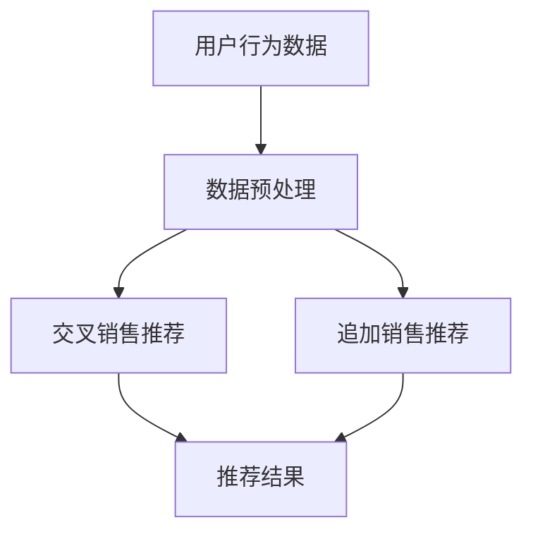

                 

# AI在电商平台交叉销售和追加销售中的应用

> **关键词：** 交叉销售、追加销售、电商平台、人工智能、推荐系统、机器学习、数据挖掘

> **摘要：** 本文将深入探讨人工智能在电商平台中的应用，特别是交叉销售和追加销售。我们将分析相关核心概念，解释其原理，并详细讨论实际操作步骤和数学模型。此外，还将介绍项目实战，提供实际代码案例，并讨论实际应用场景。最后，我们将总结未来发展趋势与挑战，并推荐相关学习资源和工具。

## 1. 背景介绍

随着电子商务的快速发展，电商平台已经成为消费者购买商品的主要渠道。然而，传统的电商模式往往只关注商品本身的销售，忽视了用户的消费习惯和偏好。这导致了大量的销售机会被错过，同时也降低了用户的购买满意度。

交叉销售和追加销售是电商营销中两种重要的策略，旨在提高销售额和客户满意度。交叉销售是指向用户推荐与当前商品相关的其他商品，而追加销售则是鼓励用户购买更多的同类商品或更高价格的商品。这两种策略的成功实施，不仅能够提高销售额，还能增强用户对电商平台的忠诚度。

人工智能（AI）技术的崛起为电商平台提供了新的机会。通过利用大数据、机器学习和推荐系统等技术，AI能够更准确地预测用户的消费行为，从而实现精准的交叉销售和追加销售。本文将详细探讨AI在这些方面的应用，帮助电商企业实现营销策略的优化。

## 2. 核心概念与联系

### 2.1 交叉销售

交叉销售（Cross-Selling）是指在用户购买某一商品时，向其推荐与之相关的其他商品。例如，当用户购买了一台笔记本电脑时，系统可以推荐鼠标、键盘等配件。

交叉销售的核心是识别用户购买行为中的潜在关系，从而实现商品的组合推荐。这需要依赖于用户的历史购买数据、商品属性信息以及相关商品的关联关系。

### 2.2 追加销售

追加销售（Upselling）是指鼓励用户购买更高价值的商品或同类商品中的更多数量。例如，当用户购买了一瓶洗发水时，系统可以推荐更大容量的洗发水瓶。

追加销售的关键在于识别用户对商品的潜在需求，并提供更具吸引力的价格或优惠，从而促使用户增加购买数量或购买更高价值的商品。

### 2.3 人工智能在电商中的应用

人工智能在电商中的应用主要体现在以下几个方面：

- **推荐系统（Recommender Systems）**：通过分析用户的行为数据，推荐用户可能感兴趣的商品。

- **数据挖掘（Data Mining）**：从大量数据中提取有价值的信息，用于分析用户行为、市场趋势等。

- **机器学习（Machine Learning）**：利用历史数据训练模型，预测用户的购买行为。

- **自然语言处理（Natural Language Processing, NLP）**：理解和处理用户在评论、搜索等场景中的自然语言。

- **计算机视觉（Computer Vision）**：识别商品图像、用户面部表情等。

### 2.4 Mermaid 流程图

下面是一个用于交叉销售和追加销售决策的Mermaid流程图：



## 3. 核心算法原理 & 具体操作步骤

### 3.1 交叉销售算法原理

交叉销售算法的核心是识别用户购买行为中的潜在关系，从而实现商品的组合推荐。以下是一个简化的交叉销售算法原理：

1. **数据收集**：收集用户的历史购买数据、商品属性数据等。

2. **特征提取**：将数据转化为特征向量，以便进行后续处理。

3. **模型训练**：利用历史数据训练推荐模型，如协同过滤、基于内容的推荐等。

4. **推荐生成**：根据用户当前购买的商品，生成与其相关的交叉销售推荐。

5. **结果评估**：评估推荐效果，调整模型参数，优化推荐结果。

### 3.2 追加销售算法原理

追加销售算法的核心是识别用户的潜在需求，并提供更具吸引力的价格或优惠，从而促使用户增加购买数量或购买更高价值的商品。以下是一个简化的追加销售算法原理：

1. **数据收集**：收集用户的历史购买数据、商品价格数据等。

2. **特征提取**：将数据转化为特征向量，以便进行后续处理。

3. **模型训练**：利用历史数据训练价格预测模型，如线性回归、决策树等。

4. **推荐生成**：根据用户当前购买的商品，生成相应的追加销售推荐，包括价格折扣或优惠券等。

5. **结果评估**：评估推荐效果，调整模型参数，优化推荐结果。

### 3.3 操作步骤

1. **数据收集与预处理**：收集用户历史购买数据、商品属性数据等，并进行数据清洗和特征提取。

2. **模型选择与训练**：选择合适的推荐算法，如协同过滤、基于内容的推荐等，并利用历史数据进行模型训练。

3. **推荐生成**：根据用户当前购买的商品，生成交叉销售和追加销售推荐。

4. **结果评估**：评估推荐效果，包括准确率、召回率、覆盖率等指标，并根据评估结果调整模型参数。

5. **上线部署**：将优化后的模型部署到生产环境，实现实时推荐。

## 4. 数学模型和公式 & 详细讲解 & 举例说明

### 4.1 协同过滤算法

协同过滤（Collaborative Filtering）是一种常见的推荐算法，其基本思想是利用用户的历史行为数据，为用户推荐相似的物品。

#### 4.1.1 相似度计算

假设有用户$U$和物品$I$，我们可以使用余弦相似度（Cosine Similarity）来计算它们之间的相似度：

$$
\cos(U, I) = \frac{U \cdot I}{||U|| \cdot ||I||}
$$

其中，$U \cdot I$表示用户$U$和物品$I$的内积，$||U||$和$||I||$分别表示用户$U$和物品$I$的欧几里得范数。

#### 4.1.2 推荐公式

给定用户$U$对物品$I$的评分$r_{UI}$，我们可以使用如下公式生成推荐列表：

$$
r_{UI}^{'} = \sum_{I' \in \mathcal{I}} \cos(U, I') \cdot r_{I'I}
$$

其中，$\mathcal{I}$表示与用户$U$相似的用户对物品的评分。

### 4.2 价格预测模型

价格预测模型（如线性回归、决策树等）可以用于生成追加销售推荐。以下是一个简化的线性回归模型：

#### 4.2.1 模型公式

给定用户$U$购买物品$I$的数量$x_{UI}$和价格$p_{UI}$，我们可以使用如下线性回归模型预测价格：

$$
p_{UI}^{'} = \beta_0 + \beta_1 \cdot x_{UI}
$$

其中，$\beta_0$和$\beta_1$分别为模型参数。

#### 4.2.2 举例说明

假设用户$U$购买物品$I$的数量为5，根据历史数据，我们可以得到线性回归模型参数$\beta_0 = 10$和$\beta_1 = 2$。因此，用户$U$购买物品$I$的预测价格为：

$$
p_{UI}^{'} = 10 + 2 \cdot 5 = 20
$$

## 5. 项目实战：代码实际案例和详细解释说明

### 5.1 开发环境搭建

在开始项目实战之前，我们需要搭建一个开发环境。以下是所需的环境和工具：

- **Python**：用于编写推荐算法和数据分析
- **NumPy**：用于数值计算
- **Pandas**：用于数据处理
- **Scikit-learn**：用于机器学习算法
- **Mermaid**：用于生成流程图

确保安装了以上工具后，我们就可以开始编写代码了。

### 5.2 源代码详细实现和代码解读

下面是一个简单的交叉销售推荐系统实现的代码示例：

```python
import numpy as np
import pandas as pd
from sklearn.metrics.pairwise import cosine_similarity
from sklearn.model_selection import train_test_split
from sklearn.linear_model import LinearRegression

# 数据加载和预处理
data = pd.read_csv('data.csv')
data['user_id'] = data['user_id'].astype(str)
data['item_id'] = data['item_id'].astype(str)
data['rating'] = data['rating'].fillna(0)

# 用户-物品矩阵
user_item_matrix = data.pivot(index='user_id', columns='item_id', values='rating').fillna(0)

# 计算用户-用户相似度矩阵
user_similarity = cosine_similarity(user_item_matrix)

# 计算用户-物品相似度矩阵
item_similarity = user_similarity.T

# 用户对物品的预测评分
user_item_predictions = np.dot(user_similarity, user_item_matrix)

# 生成交叉销售推荐
def cross_selling_recommendation(user_id, top_n=5):
    user_index = user_item_matrix.index.get_loc(user_id)
    recommended_items = np.argsort(user_item_predictions[user_index])[::-1]
    recommended_items = recommended_items[recommended_items != user_item_matrix.columns.get_loc(user_id)]
    return recommended_items[:top_n]

# 用户ID
user_id = 'user_1'

# 获取交叉销售推荐
recommended_items = cross_selling_recommendation(user_id)

print(f"交叉销售推荐给用户{user_id}的商品：")
for item_id in recommended_items:
    print(f"商品ID：{item_id}")

# 数据划分
X = data[['user_id', 'item_id', 'rating']].dropna()
y = data['rating'].dropna()

X_train, X_test, y_train, y_test = train_test_split(X, y, test_size=0.2, random_state=42)

# 训练线性回归模型
model = LinearRegression()
model.fit(X_train, y_train)

# 预测价格
X_test_pred = model.predict(X_test)

# 追加销售推荐
def upselling_recommendation(user_id, item_id, quantity=1, top_n=5):
    user_index = X_train['user_id'].get_loc(user_id)
    item_index = X_train['item_id'].get_loc(item_id)
    predicted_prices = model.predict([[user_index, item_index, quantity]])
    sorted_prices = np.argsort(predicted_prices)[::-1]
    return sorted_prices[:top_n]

# 用户购买商品
user_id = 'user_1'
item_id = 'item_101'

# 获取追加销售推荐
recommended_items = upselling_recommendation(user_id, item_id)

print(f"追加销售推荐给用户{user_id}的商品：")
for item_id in recommended_items:
    print(f"商品ID：{item_id}")
```

### 5.3 代码解读与分析

1. **数据加载与预处理**：我们从CSV文件中加载用户-物品评分数据，并进行预处理，包括填充缺失值和将数据类型转换为字符串。

2. **用户-物品矩阵**：使用Pandas的`pivot`方法创建用户-物品矩阵，其中用户ID作为索引，物品ID作为列，评分作为值。

3. **相似度计算**：使用Scikit-learn的`cosine_similarity`函数计算用户-用户和用户-物品相似度矩阵。

4. **推荐生成**：根据用户-用户相似度矩阵生成用户-物品预测评分矩阵。然后，定义一个函数`cross_selling_recommendation`生成交叉销售推荐。

5. **线性回归模型**：我们使用Scikit-learn的`LinearRegression`类训练一个线性回归模型，用于预测价格。然后，定义一个函数`upselling_recommendation`生成追加销售推荐。

6. **测试与运行**：我们为用户`user_1`生成交叉销售和追加销售推荐，并打印结果。

## 6. 实际应用场景

### 6.1 交叉销售

在电商平台上，交叉销售策略可以应用于多个场景。例如，当用户浏览或购买某一商品时，系统可以推荐与之相关的配件或同类商品。这样的推荐能够提高用户的购物车价值，同时也能增加电商平台的销售额。

### 6.2 追加销售

追加销售策略通常用于鼓励用户购买更多数量的商品或更高价值的商品。例如，当用户购买了一瓶洗发水时，系统可以推荐更大容量的洗发水瓶或相关的护发产品。这样的推荐能够提高用户的平均订单价值，同时也能增加电商平台的利润。

### 6.3 综合应用

在实际应用中，电商平台通常会同时使用交叉销售和追加销售策略，以最大化销售额和利润。例如，当用户购买一件T恤时，系统可以推荐与其搭配的裤子、鞋子等配件，同时还可以提供折扣或优惠券，鼓励用户购买更多数量的商品。

## 7. 工具和资源推荐

### 7.1 学习资源推荐

- **《推荐系统实践》（Recommender Systems Handbook）**：这是一本经典的推荐系统指南，详细介绍了各种推荐算法和应用场景。
- **《机器学习》（Machine Learning）**：由Tom Mitchell撰写的这本教材，为机器学习的基础提供了全面的介绍。
- **《数据挖掘：实用工具与技术》（Data Mining: Practical Machine Learning Tools and Techniques）**：这是一本关于数据挖掘的实用指南，涵盖了各种数据挖掘技术和工具。

### 7.2 开发工具框架推荐

- **Scikit-learn**：这是一个强大的机器学习库，适用于推荐系统和数据挖掘任务。
- **TensorFlow**：这是一个开源的机器学习框架，适用于构建复杂的推荐模型。
- **PyTorch**：这是一个流行的深度学习库，适用于构建高级推荐模型。

### 7.3 相关论文著作推荐

- **《Collaborative Filtering for the 21st Century》**：这篇文章介绍了协同过滤算法的原理和应用。
- **《Context-aware Recommendations》**：这篇文章探讨了如何利用上下文信息提高推荐系统的效果。
- **《Deep Learning for Recommender Systems》**：这篇文章介绍了深度学习在推荐系统中的应用。

## 8. 总结：未来发展趋势与挑战

### 8.1 未来发展趋势

- **个性化推荐**：随着用户数据的积累和技术的进步，个性化推荐将成为电商平台的主流。
- **实时推荐**：利用实时数据分析和机器学习模型，实现实时推荐，提高用户体验。
- **多模态推荐**：结合文本、图像、音频等多种数据源，实现更精准的推荐。

### 8.2 挑战

- **数据隐私**：如何保护用户隐私，同时实现精准推荐，是一个重要的挑战。
- **模型解释性**：如何提高推荐模型的解释性，让用户理解推荐原因，是一个亟待解决的问题。
- **算法公平性**：如何避免算法偏见，实现公平的推荐，是一个重要的社会问题。

## 9. 附录：常见问题与解答

### 9.1 交叉销售和追加销售的区别是什么？

交叉销售是指向用户推荐与当前商品相关的其他商品，而追加销售是鼓励用户购买更多数量的商品或更高价值的商品。

### 9.2 推荐系统中的协同过滤算法有哪些类型？

协同过滤算法主要分为基于用户的协同过滤和基于物品的协同过滤。基于用户的协同过滤关注用户之间的相似性，而基于物品的协同过滤关注物品之间的相似性。

### 9.3 如何提高推荐系统的效果？

- **数据质量**：确保数据的质量和准确性。
- **特征提取**：选择合适的特征，提高模型的预测能力。
- **模型选择**：选择适合数据的推荐算法。
- **模型调优**：根据评估结果，调整模型参数，优化推荐效果。

## 10. 扩展阅读 & 参考资料

- **《推荐系统实践》（Recommender Systems Handbook）**
- **《机器学习》（Machine Learning）**
- **《数据挖掘：实用工具与技术》（Data Mining: Practical Machine Learning Tools and Techniques）**
- **《Collaborative Filtering for the 21st Century》**
- **《Context-aware Recommendations》**
- **《Deep Learning for Recommender Systems》**
- **Scikit-learn官方文档**
- **TensorFlow官方文档**
- **PyTorch官方文档**

