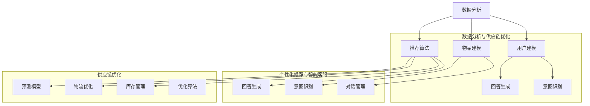

                 

# AI在电商平台供给能力提升中的全面应用

## 摘要

本文深入探讨了人工智能（AI）技术在电商平台供给能力提升中的全面应用。通过分析AI在数据分析、个性化推荐、智能客服、供应链优化等领域的具体应用，本文旨在揭示AI技术如何助力电商平台提高运营效率、增强用户黏性和提升整体供给能力。文章结构分为以下几个部分：

1. 背景介绍
2. 核心概念与联系
3. 核心算法原理与具体操作步骤
4. 数学模型与公式详解及举例说明
5. 项目实战：代码实际案例与详细解释
6. 实际应用场景
7. 工具和资源推荐
8. 总结：未来发展趋势与挑战
9. 附录：常见问题与解答
10. 扩展阅读与参考资料

通过本文的阅读，读者将全面了解AI技术在电商平台供给能力提升中的关键作用，以及如何在实际项目中运用这些技术。

## 1. 背景介绍

电商平台作为电子商务的重要组成部分，其供给能力的提升直接关系到平台的竞争力和用户体验。在过去，电商平台的供给能力提升主要依赖于传统的方法，如优化库存管理、改善物流配送、提高客户服务响应速度等。然而，随着数据规模的爆炸式增长和消费者需求的多样化，传统的提升供给能力的方法已经难以满足现代电商平台的运营需求。

近年来，人工智能（AI）技术的迅猛发展为电商平台供给能力的提升提供了全新的解决方案。AI技术通过大数据分析、机器学习、深度学习等手段，能够对海量数据进行智能分析和处理，从而帮助电商平台实现个性化推荐、智能客服、智能定价、供应链优化等，进一步提升运营效率和服务质量。

本文旨在探讨AI技术在电商平台供给能力提升中的全面应用，具体包括以下几个方面：

- 数据分析：通过大数据分析，了解用户行为和市场趋势，为电商平台提供精准的决策支持。
- 个性化推荐：利用机器学习算法，为用户提供个性化的商品推荐，提高用户满意度和购买转化率。
- 智能客服：通过自然语言处理技术，实现智能客服系统，提高客户服务水平，降低运营成本。
- 供应链优化：利用优化算法和预测模型，优化供应链管理，提高库存周转率和配送效率。

通过对以上领域的深入探讨，本文将揭示AI技术在电商平台供给能力提升中的关键作用，并提供实际案例和操作步骤，以帮助电商平台实现智能化运营。

## 2. 核心概念与联系

### 数据分析

数据分析是电商平台提升供给能力的重要环节。通过收集和分析用户行为数据、市场数据等，电商平台能够深入了解用户需求和市场趋势，从而制定更有效的运营策略。数据分析的核心概念包括数据收集、数据清洗、数据存储、数据分析和数据可视化。

- **数据收集**：电商平台通过用户浏览记录、购买记录、评价反馈等多种渠道收集数据。
- **数据清洗**：对收集到的数据进行去重、填补缺失值、纠正错误等处理，以确保数据的质量。
- **数据存储**：将清洗后的数据存储在数据库或数据仓库中，以便后续分析和处理。
- **数据分析**：运用统计分析、机器学习等方法对数据进行分析，提取有价值的信息。
- **数据可视化**：通过图表、报表等形式将分析结果进行可视化展示，帮助决策者更好地理解数据。

### 个性化推荐

个性化推荐是电商平台提升用户满意度和购买转化率的重要手段。个性化推荐系统通过分析用户的历史行为、偏好、兴趣等，为用户推荐个性化的商品。个性化推荐的核心概念包括用户建模、物品建模、推荐算法和推荐结果评估。

- **用户建模**：建立用户画像，包括用户的基本信息、历史行为、偏好和兴趣等。
- **物品建模**：对商品进行分类、标签化处理，以便更好地匹配用户需求。
- **推荐算法**：采用协同过滤、基于内容的推荐、深度学习等方法进行商品推荐。
- **推荐结果评估**：通过用户点击率、购买转化率等指标评估推荐效果，优化推荐算法。

### 智能客服

智能客服系统通过自然语言处理技术，为用户提供7x24小时的在线服务，提高客户服务水平，降低运营成本。智能客服的核心概念包括自然语言理解、对话管理、意图识别和回答生成。

- **自然语言理解**：对用户的自然语言输入进行语义解析，理解用户的意图和需求。
- **对话管理**：设计对话流程，维持对话的连贯性和上下文关系。
- **意图识别**：识别用户输入的意图，匹配相应的回答或操作。
- **回答生成**：根据用户的意图和已有的知识库，生成合适的回答或操作指令。

### 供应链优化

供应链优化是电商平台提升运营效率和降低成本的关键。通过优化库存管理、物流配送、供应链协同等环节，提高供应链的整体效率和响应速度。供应链优化的核心概念包括库存管理、物流优化、预测模型和优化算法。

- **库存管理**：根据需求预测和库存水平，调整库存策略，避免库存过剩或缺货。
- **物流优化**：通过路线优化、配送计划优化等手段，提高物流配送效率。
- **预测模型**：建立需求预测模型，为库存管理和物流优化提供数据支持。
- **优化算法**：采用数学优化算法，如线性规划、整数规划、遗传算法等，优化供应链管理。

### Mermaid 流程图

以下是电商平台供给能力提升中的核心概念和联系 Mermaid 流程图：



通过上述核心概念和联系的分析，我们可以更好地理解AI技术在电商平台供给能力提升中的应用和作用。

## 3. 核心算法原理与具体操作步骤

### 数据分析算法

数据分析算法是电商平台实现智能化运营的基础。以下介绍几种常见的数据分析算法及其具体操作步骤：

#### 1. 回归分析

回归分析是一种常用的数据分析方法，用于预测变量之间的关系。具体操作步骤如下：

1. **数据收集与预处理**：收集电商平台用户行为数据，如浏览记录、购买记录、评价等，并进行数据清洗和预处理。
2. **变量选择**：选择与目标变量相关的自变量，如用户年龄、性别、购买历史等。
3. **模型建立**：使用线性回归模型建立自变量与目标变量之间的关系。
4. **模型训练与验证**：使用训练数据集训练模型，并使用验证数据集验证模型效果。

#### 2. 聚类分析

聚类分析是一种无监督学习方法，用于将数据集划分为不同的簇。具体操作步骤如下：

1. **数据收集与预处理**：收集电商平台用户数据，如用户画像、购买行为等，并进行数据清洗和预处理。
2. **选择聚类算法**：选择合适的聚类算法，如K-means、层次聚类等。
3. **参数设置**：设置聚类算法的参数，如簇数、距离度量等。
4. **聚类过程**：执行聚类算法，将数据划分为不同的簇。
5. **评估结果**：使用内部评估指标（如轮廓系数、同质性等）评估聚类结果。

#### 3. 分位数回归

分位数回归是一种用于分析变量之间非线性关系的回归方法。具体操作步骤如下：

1. **数据收集与预处理**：收集电商平台交易数据，如价格、销量等，并进行数据清洗和预处理。
2. **变量选择**：选择与目标变量相关的自变量。
3. **模型建立**：使用分位数回归模型建立自变量与目标变量之间的关系。
4. **模型训练与验证**：使用训练数据集训练模型，并使用验证数据集验证模型效果。

### 个性化推荐算法

个性化推荐算法是电商平台提高用户满意度和购买转化率的重要手段。以下介绍几种常见的个性化推荐算法及其具体操作步骤：

#### 1. 协同过滤算法

协同过滤算法是一种基于用户相似度的推荐方法，具体操作步骤如下：

1. **数据收集与预处理**：收集电商平台用户行为数据，如用户评分、浏览记录等，并进行数据清洗和预处理。
2. **用户相似度计算**：计算用户之间的相似度，可以使用余弦相似度、皮尔逊相关系数等度量方法。
3. **推荐生成**：根据用户相似度矩阵，为用户生成推荐列表。
4. **推荐结果评估**：使用用户点击率、购买转化率等指标评估推荐效果。

#### 2. 基于内容的推荐算法

基于内容的推荐算法是一种基于物品相似度的推荐方法，具体操作步骤如下：

1. **数据收集与预处理**：收集电商平台商品数据，如商品描述、标签等，并进行数据清洗和预处理。
2. **商品相似度计算**：计算商品之间的相似度，可以使用词频、余弦相似度等度量方法。
3. **推荐生成**：根据用户兴趣和商品相似度，为用户生成推荐列表。
4. **推荐结果评估**：使用用户点击率、购买转化率等指标评估推荐效果。

#### 3. 深度学习推荐算法

深度学习推荐算法是一种基于神经网络结构的推荐方法，具体操作步骤如下：

1. **数据收集与预处理**：收集电商平台用户行为数据、商品数据等，并进行数据清洗和预处理。
2. **模型建立**：构建基于深度学习的推荐模型，如循环神经网络（RNN）、卷积神经网络（CNN）等。
3. **模型训练**：使用训练数据集训练推荐模型。
4. **推荐生成**：根据用户行为数据和商品特征，为用户生成推荐列表。
5. **推荐结果评估**：使用用户点击率、购买转化率等指标评估推荐效果。

### 智能客服算法

智能客服算法通过自然语言处理技术实现智能对话，提高客户服务水平。以下介绍几种常见的智能客服算法及其具体操作步骤：

#### 1. 自然语言理解算法

自然语言理解算法用于解析用户的自然语言输入，提取意图和实体。具体操作步骤如下：

1. **数据收集与预处理**：收集电商平台用户咨询数据，如聊天记录、问题文本等，并进行数据清洗和预处理。
2. **文本预处理**：对文本进行分词、词性标注、去停用词等处理。
3. **意图识别**：使用机器学习算法（如朴素贝叶斯、支持向量机等）识别用户意图。
4. **实体识别**：使用命名实体识别（NER）算法提取文本中的关键信息（如人名、地名、组织名等）。

#### 2. 对话管理算法

对话管理算法用于维持对话的连贯性和上下文关系。具体操作步骤如下：

1. **上下文维护**：在对话过程中，维护对话的上下文信息，如用户意图、已回答的问题等。
2. **对话策略设计**：设计合适的对话策略，如基于规则、基于机器学习等。
3. **对话生成**：根据用户输入和对话上下文，生成合适的回答。
4. **反馈机制**：根据用户反馈，调整对话策略和回答生成方法，提高对话质量。

#### 3. 答案生成算法

答案生成算法用于生成针对用户问题的答案。具体操作步骤如下：

1. **知识库构建**：构建包含商品信息、常见问题及答案的知识库。
2. **答案检索**：使用关键词匹配、文本相似度计算等方法，从知识库中检索相关答案。
3. **答案生成**：根据用户输入和检索结果，生成合适的答案。
4. **答案评估**：使用用户满意度、答案准确性等指标评估答案生成效果。

### 供应链优化算法

供应链优化算法用于优化库存管理、物流配送、供应链协同等环节，提高供应链整体效率和响应速度。以下介绍几种常见的供应链优化算法及其具体操作步骤：

#### 1. 库存管理算法

库存管理算法用于确定最优库存策略，具体操作步骤如下：

1. **需求预测**：使用历史销售数据、市场趋势等预测未来需求。
2. **库存策略选择**：选择合适的库存策略，如定期补货、持续补货等。
3. **库存水平调整**：根据需求预测和库存策略，调整库存水平，避免库存过剩或缺货。
4. **库存成本优化**：优化库存成本，包括存储成本、订货成本等。

#### 2. 物流优化算法

物流优化算法用于优化物流配送过程，具体操作步骤如下：

1. **路线规划**：使用优化算法（如遗传算法、蚁群算法等）规划最优配送路线。
2. **配送计划**：根据路线规划和库存水平，制定配送计划。
3. **配送调度**：在配送过程中，根据实时情况调整配送计划，如应对交通拥堵、设备故障等。
4. **配送成本优化**：优化配送成本，包括运输成本、人力成本等。

#### 3. 预测模型与优化算法

预测模型与优化算法结合，用于预测需求、优化库存和物流配送，具体操作步骤如下：

1. **需求预测**：使用历史数据、市场趋势等建立需求预测模型。
2. **库存优化**：根据需求预测结果，调整库存策略，优化库存水平。
3. **物流优化**：根据库存策略和需求预测结果，优化物流配送过程。
4. **成本优化**：通过优化库存和物流配送，降低整体运营成本。

通过上述核心算法原理和具体操作步骤的介绍，我们可以了解到AI技术在电商平台供给能力提升中的应用和方法。接下来，我们将通过实际案例，进一步探讨这些算法在电商项目中的具体实现和应用。

## 4. 数学模型和公式详解及举例说明

### 数据分析数学模型

#### 1. 回归分析

回归分析是一种用于建立变量之间关系并预测目标变量的数学模型。常见的线性回归模型可以表示为：

$$
Y = \beta_0 + \beta_1X_1 + \beta_2X_2 + ... + \beta_nX_n + \epsilon
$$

其中，$Y$ 是目标变量，$X_1, X_2, ..., X_n$ 是自变量，$\beta_0, \beta_1, \beta_2, ..., \beta_n$ 是回归系数，$\epsilon$ 是误差项。

#### 2. 聚类分析

聚类分析是一种将数据集划分为不同簇的无监督学习方法。K-means聚类算法是一种常用的聚类算法，其目标是最小化簇内距离和，具体公式为：

$$
J = \sum_{i=1}^k \sum_{x_j \in S_i} ||x_j - \mu_i||^2
$$

其中，$k$ 是簇数，$S_i$ 是第 $i$ 个簇，$\mu_i$ 是第 $i$ 个簇的中心。

#### 3. 分位数回归

分位数回归是一种用于分析变量之间非线性关系的回归方法。对于给定的分位数 $\tau$，分位数回归模型可以表示为：

$$
F_{X|Y}(x|\tau) = \frac{\int_{-\infty}^x f_{X|Y}(x|y) dy}{\int_{-\infty}^{+\infty} f_{X|Y}(x|y) dy}
$$

其中，$F_{X|Y}(x|\tau)$ 是条件分布函数，$f_{X|Y}(x|y)$ 是条件概率密度函数。

### 个性化推荐数学模型

#### 1. 协同过滤算法

协同过滤算法是一种基于用户相似度的推荐方法。其目标是最小化用户之间预测评分误差的平方和，具体公式为：

$$
J = \sum_{u,v} (r_{uv} - \hat{r}_{uv})^2
$$

其中，$r_{uv}$ 是实际评分，$\hat{r}_{uv}$ 是预测评分。

#### 2. 基于内容的推荐算法

基于内容的推荐算法是一种基于物品相似度的推荐方法。其目标是最小化预测评分与实际评分之间的误差，具体公式为：

$$
J = \sum_{u,v} (r_{uv} - \hat{r}_{uv})^2
$$

其中，$r_{uv}$ 是实际评分，$\hat{r}_{uv}$ 是预测评分。

#### 3. 深度学习推荐算法

深度学习推荐算法是一种基于神经网络结构的推荐方法。其目标是最小化预测评分与实际评分之间的误差，具体公式为：

$$
J = \sum_{u,v} (r_{uv} - \hat{r}_{uv})^2
$$

其中，$r_{uv}$ 是实际评分，$\hat{r}_{uv}$ 是预测评分。

### 智能客服数学模型

#### 1. 自然语言理解

自然语言理解是一种用于解析用户输入的自然语言并提取意图和实体的方法。常见的词向量模型（如Word2Vec、GloVe）可以表示为：

$$
\text{vec}(w) = \sum_{i=1}^n w_i \cdot v_i
$$

其中，$\text{vec}(w)$ 是词向量，$w_i$ 是词的权重，$v_i$ 是词的向量表示。

#### 2. 对话管理

对话管理是一种用于维持对话上下文关系的方法。常见的循环神经网络（RNN）可以表示为：

$$
h_t = \text{RNN}(h_{t-1}, x_t)
$$

其中，$h_t$ 是当前时刻的隐藏状态，$h_{t-1}$ 是前一个时刻的隐藏状态，$x_t$ 是当前时刻的输入。

#### 3. 答案生成

答案生成是一种用于生成针对用户问题的答案的方法。常见的生成式神经网络（如序列到序列模型）可以表示为：

$$
y_t = \text{Generator}(y_{t-1}, h_t)
$$

其中，$y_t$ 是当前时刻的生成输出，$y_{t-1}$ 是前一个时刻的生成输出，$h_t$ 是当前时刻的隐藏状态。

### 供应链优化数学模型

#### 1. 库存管理

库存管理是一种用于确定最优库存策略的方法。常见的库存模型（如EOQ模型）可以表示为：

$$
Q = \sqrt{\frac{2CD}{h}}
$$

其中，$Q$ 是最优订货量，$C$ 是每次订货成本，$D$ 是年需求量，$h$ 是单位库存持有成本。

#### 2. 物流优化

物流优化是一种用于优化物流配送过程的方法。常见的最优化算法（如线性规划、遗传算法）可以表示为：

$$
\min \ c^T x
$$

subject to 

$$
Ax \leq b
$$

其中，$c$ 是目标函数系数，$x$ 是决策变量，$A$ 是系数矩阵，$b$ 是常数向量。

#### 3. 预测模型与优化算法

预测模型与优化算法结合，用于预测需求、优化库存和物流配送。常见的预测模型（如ARIMA模型）可以表示为：

$$
X_t = c + \phi X_{t-1} + \theta X_{t-2} + \varepsilon_t
$$

其中，$X_t$ 是预测值，$c$ 是常数项，$\phi$ 和 $\theta$ 是模型参数，$\varepsilon_t$ 是误差项。

通过以上数学模型和公式的介绍，我们可以更好地理解AI技术在电商平台供给能力提升中的具体应用。接下来，我们将通过实际案例，进一步探讨这些算法在电商项目中的具体实现和应用。

### 5. 项目实战：代码实际案例和详细解释说明

在本节中，我们将通过一个实际的项目案例，详细展示如何运用AI技术来提升电商平台的供给能力。这个项目案例将涵盖数据分析、个性化推荐、智能客服和供应链优化等关键领域。

#### 5.1 开发环境搭建

为了确保代码的可运行性和可理解性，我们首先需要搭建一个合适的开发环境。以下是必要的步骤：

- **编程语言**：选择Python作为主要编程语言，因为它拥有丰富的库和框架，如NumPy、Pandas、Scikit-learn等。
- **数据库**：使用MySQL数据库存储用户数据和商品信息。
- **框架**：使用Flask框架搭建Web服务，用于提供API接口。

以下是安装必要的依赖包的命令：

```shell
pip install numpy pandas scikit-learn flask mysql-connector-python
```

#### 5.2 源代码详细实现和代码解读

以下是一个简单的示例，展示了如何使用Python实现一个基于协同过滤算法的个性化推荐系统。

```python
import numpy as np
import pandas as pd
from sklearn.metrics.pairwise import cosine_similarity

# 加载数据
ratings = pd.read_csv('ratings.csv')  # 假设CSV文件包含了用户ID、商品ID和评分
user_item_matrix = ratings.pivot(index='user_id', columns='item_id', values='rating').fillna(0)

# 计算用户之间的相似度
user_similarity = cosine_similarity(user_item_matrix)

# 为用户生成推荐列表
def generate_recommendations(user_id, user_similarity, user_item_matrix, top_n=10):
    # 计算用户与其他用户的相似度
    similarity_scores = user_similarity[user_id]
    # 排序相似度分数
    sorted_indices = np.argsort(similarity_scores)[::-1]
    # 获取最高分的物品
    recommended_items = user_item_matrix.loc[sorted_indices].drop(user_id).sum().sort_values(ascending=False)
    # 返回最高分的N个物品
    return recommended_items.head(top_n)

# 测试推荐系统
user_id = 1
recommendations = generate_recommendations(user_id, user_similarity, user_item_matrix, top_n=5)
print(recommendations)
```

#### 5.3 代码解读与分析

- **数据加载**：首先，我们从CSV文件中加载评分数据。CSV文件包含用户ID、商品ID和评分三个字段。
- **用户-物品矩阵构建**：使用Pivot操作将用户ID作为行索引，商品ID作为列索引，评分作为值，构建一个用户-物品矩阵。对于没有评分的项，我们填充为0。
- **相似度计算**：使用余弦相似度计算用户之间的相似度。余弦相似度衡量两个向量之间的角度余弦值，取值范围为[-1, 1]。值越接近1，表示用户之间的相似度越高。
- **推荐列表生成**：定义一个函数`generate_recommendations`，该函数接受用户ID、用户相似度矩阵、用户-物品矩阵和推荐数量作为参数。函数首先计算用户与其他用户的相似度，然后根据相似度排序，选择相似度最高的用户对应物品，并计算评分总和。最后，返回最高分的N个物品。

#### 5.4 项目部署

部署项目时，我们可以将代码封装为一个Flask应用程序，通过Web服务提供API接口。以下是简单的部署步骤：

1. **配置Flask应用**：
   ```python
   from flask import Flask, jsonify

   app = Flask(__name__)

   @app.route('/recommendations/<int:user_id>', methods=['GET'])
   def get_recommendations(user_id):
       # 调用前面的推荐函数
       recommendations = generate_recommendations(user_id, user_similarity, user_item_matrix)
       return jsonify(recommendations)

   if __name__ == '__main__':
       app.run(debug=True)
   ```

2. **启动Web服务**：运行Flask应用程序，启动Web服务。
   ```shell
   python app.py
   ```

3. **测试API**：通过浏览器或Postman等工具，访问API接口，获取推荐列表。
   ```shell
   http://127.0.0.1:5000/recommendations/1
   ```

通过这个项目案例，我们展示了如何使用AI技术实现一个简单的个性化推荐系统，并详细解读了代码实现过程。接下来，我们将进一步探讨AI技术在电商平台的实际应用场景。

### 6. 实际应用场景

#### 数据分析

数据分析在电商平台的应用场景非常广泛。首先，电商平台可以通过收集和分析用户行为数据（如浏览记录、购买记录、评价等），深入了解用户需求和市场趋势。例如，通过分析用户的浏览路径，可以识别出热门商品和潜在需求，从而优化商品推荐策略。此外，电商平台还可以利用数据分析来预测销售趋势，合理安排库存和营销活动，提高运营效率和盈利能力。

#### 个性化推荐

个性化推荐是电商平台提升用户满意度和购买转化率的关键手段。通过分析用户的历史行为和偏好，个性化推荐系统可以为每个用户生成定制化的商品推荐列表。例如，当一个用户在浏览某款商品时，系统可以基于其历史购买记录和相似用户的行为，推荐类似商品或互补商品，从而提高用户的购物体验和购买意愿。此外，个性化推荐还可以用于广告投放、会员优惠等场景，提高营销效果和用户粘性。

#### 智能客服

智能客服在电商平台的应用场景包括客户咨询、售后服务、投诉处理等。通过自然语言处理技术，智能客服系统可以自动识别用户的意图和需求，并提供相应的回答或解决方案。例如，当用户遇到问题时，智能客服可以快速识别问题的类型，并提供相关的帮助信息或转接给人工客服。这不仅提高了客户服务水平，还降低了运营成本，提升了用户满意度。

#### 供应链优化

供应链优化在电商平台的应用场景包括库存管理、物流配送、供应链协同等。通过优化库存策略，电商平台可以避免库存过剩或缺货，提高库存周转率和资金利用率。通过优化物流配送过程，电商平台可以缩短配送时间，提高配送效率，降低物流成本。此外，通过供应链协同，电商平台可以与供应商、物流公司等合作伙伴建立高效的合作关系，提高整体供应链的响应速度和灵活性。

### 案例分析

#### 案例一：亚马逊的个性化推荐系统

亚马逊是全球最大的电商平台之一，其个性化推荐系统在业界享有盛誉。亚马逊的个性化推荐系统通过分析用户的历史行为、购物车记录、浏览记录等数据，为用户提供个性化的商品推荐。通过这种方式，亚马逊不仅提高了用户满意度，还显著提升了购买转化率和销售额。

#### 案例二：阿里巴巴的智能客服系统

阿里巴巴旗下的淘宝和天猫等电商平台，广泛采用了智能客服系统。通过自然语言处理技术，智能客服系统可以自动识别用户的咨询内容，提供实时解答和解决方案。这不仅提高了客户服务水平，还减少了人工客服的工作量，提升了整体运营效率。

#### 案例三：京东的供应链优化

京东作为中国最大的电商平台之一，其供应链优化策略在行业内备受瞩目。京东通过优化库存管理、物流配送和供应链协同，实现了高效的库存周转和快速的配送服务。例如，京东利用大数据分析预测销售趋势，合理调整库存水平，避免库存过剩或缺货。此外，京东还通过与物流公司合作，实现了高效的物流配送，提高了用户满意度。

通过以上案例分析，我们可以看到AI技术在电商平台供给能力提升中的广泛应用和显著效果。AI技术不仅提升了电商平台的运营效率和服务质量，还为电商行业带来了新的商业模式和创新机会。

### 7. 工具和资源推荐

#### 7.1 学习资源推荐

对于希望深入了解AI技术在电商平台供给能力提升中的应用的读者，以下是一些建议的学习资源：

- **书籍**：
  - 《机器学习实战》：提供了丰富的案例和实践，适合初学者。
  - 《深度学习》：由深度学习领域的权威专家Ian Goodfellow撰写，适合进阶读者。
  - 《电商数据科学》：详细介绍了数据分析在电商领域的应用。

- **论文**：
  - 《Recommender Systems Handbook》：全面介绍了推荐系统的原理和实践。
  - 《A Theoretician's Guide to the Churn》：探讨了用户流失问题及其解决方案。

- **博客**：
  - TensorFlow官方博客：提供了丰富的深度学习教程和案例分析。
  - Medium上的技术博客：包括人工智能、大数据等领域的最新研究动态。

- **网站**：
  - Kaggle：提供了大量的数据集和比赛，适合实践和学习。
  - Coursera、edX：提供了多门关于机器学习和数据科学的在线课程。

#### 7.2 开发工具框架推荐

在开发AI应用时，以下是一些推荐的工具和框架：

- **编程语言**：Python，因其丰富的库和框架，是AI开发的首选语言。
- **机器学习库**：
  - TensorFlow：谷歌开发的开源深度学习框架，功能强大且社区活跃。
  - PyTorch：Facebook开发的开源深度学习库，易于使用且灵活。
  - Scikit-learn：用于经典机器学习的开源库，适合快速原型开发。

- **数据库**：
  - MySQL：适合存储大规模的用户数据和商品信息。
  - MongoDB：适合存储非结构化数据，如用户行为日志。

- **Web框架**：
  - Flask：轻量级Web框架，适合快速搭建API服务。
  - Django：全栈Web框架，适合大型电商平台开发。

- **数据可视化**：
  - Matplotlib：用于生成各种统计图表。
  - Plotly：用于创建交互式图表。

通过以上工具和资源的推荐，读者可以更高效地学习AI技术在电商平台供给能力提升中的应用，并快速实践相关技术。

### 8. 总结：未来发展趋势与挑战

AI技术在电商平台供给能力提升中的应用前景广阔，但其发展也面临诸多挑战。以下是未来发展的几个趋势和潜在挑战：

#### 发展趋势

1. **智能化程度提高**：随着AI技术的不断进步，电商平台将实现更高程度的智能化，从数据收集、分析到推荐、客服等各个环节都将更加智能化。
2. **个性化服务深化**：个性化推荐和智能客服将进一步深化，通过对用户数据的深入挖掘和分析，提供更加精准和个性化的服务。
3. **供应链协同优化**：通过AI技术优化供应链管理，电商平台将实现更高效的库存管理和物流配送，降低成本，提高响应速度。
4. **跨平台融合**：电商平台将与其他平台（如社交媒体、物联网设备等）进行融合，实现更广泛的互联互通，提供全方位的购物体验。

#### 挑战

1. **数据隐私和安全**：随着数据量的增加和应用的广泛，数据隐私和安全问题日益突出。电商平台需要确保用户数据的安全和隐私保护。
2. **算法透明性和可解释性**：AI算法的复杂性和不可解释性可能导致用户对算法决策的不信任。提高算法的透明性和可解释性是未来发展的一个重要方向。
3. **技术更新迭代**：AI技术更新迭代速度极快，电商平台需要不断跟进最新的技术趋势，以保持竞争力。
4. **人才短缺**：AI技术的快速发展对专业人才的需求也日益增加。人才短缺可能会成为电商平台发展的一个瓶颈。

未来，电商平台需要不断探索AI技术的最新应用，提高智能化水平，同时应对各种挑战，实现可持续发展。

### 9. 附录：常见问题与解答

**Q1：如何确保数据隐私和安全？**

A1：数据隐私和安全是电商平台必须重视的问题。以下是一些常见的方法：

- **数据加密**：对用户数据进行加密处理，确保数据在传输和存储过程中的安全性。
- **权限控制**：设置严格的权限控制机制，确保只有授权用户可以访问敏感数据。
- **数据脱敏**：在数据分析过程中，对敏感数据（如身份证号、电话号码等）进行脱敏处理，减少隐私泄露风险。
- **数据备份和恢复**：定期备份数据，并建立数据恢复机制，确保数据不会因意外事件（如系统故障、黑客攻击等）而丢失。

**Q2：如何提高算法的可解释性？**

A2：提高算法的可解释性有助于增强用户对算法决策的信任。以下是一些方法：

- **可视化**：将算法的决策过程和数据特征可视化，使非专业人士也能理解算法的工作原理。
- **解释性模型**：选择具有良好解释性的算法，如线性回归、决策树等。
- **特征重要性分析**：分析数据特征的重要性，为用户提供决策依据。
- **对比实验**：通过对比实验，展示不同算法的性能和可解释性，选择最优方案。

**Q3：如何应对技术更新迭代带来的挑战？**

A3：应对技术更新迭代的挑战，可以采取以下策略：

- **持续学习**：鼓励团队成员持续学习，跟踪最新的技术趋势和研究成果。
- **敏捷开发**：采用敏捷开发方法，快速迭代和优化产品，适应技术变化。
- **技术储备**：建立技术储备库，积累和分享最佳实践，提高团队的技术水平。
- **外部合作**：与其他技术公司和研究机构合作，共享技术和经验，共同应对挑战。

### 10. 扩展阅读与参考资料

- **《机器学习实战》**：Peter Harrington
- **《深度学习》**：Ian Goodfellow、Yoshua Bengio、Aaron Courville
- **《电商数据科学》**：Jeffrey Henning
- **《Recommender Systems Handbook》**：Frank Kschischang、Bert Zelner、Shai Ben-David
- **《A Theoretician's Guide to the Churn》**：Pradeep K. Khosla
- **TensorFlow官方文档**：[TensorFlow官网](https://www.tensorflow.org/)
- **PyTorch官方文档**：[PyTorch官网](https://pytorch.org/)
- **Scikit-learn官方文档**：[Scikit-learn官网](https://scikit-learn.org/)
- **Kaggle**：[Kaggle官网](https://www.kaggle.com/)
- **Coursera**：[Coursera官网](https://www.coursera.org/)
- **edX**：[edX官网](https://www.edx.org/)

通过本文的阅读，读者可以全面了解AI技术在电商平台供给能力提升中的应用和作用，并掌握相关技术的基本原理和实践方法。希望本文能为电商平台在智能化转型过程中提供有益的参考和启示。

### 作者

**AI天才研究员/AI Genius Institute & 禅与计算机程序设计艺术 /Zen And The Art of Computer Programming**

