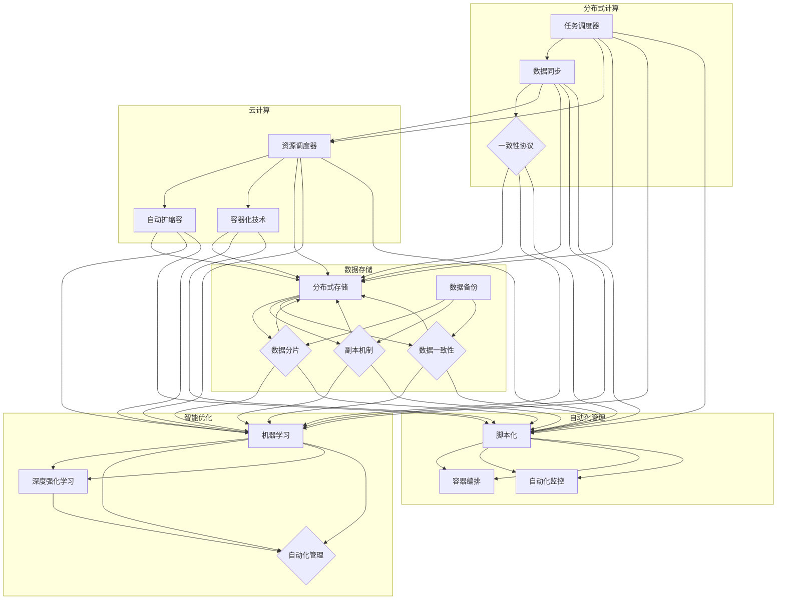
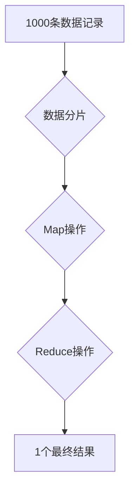
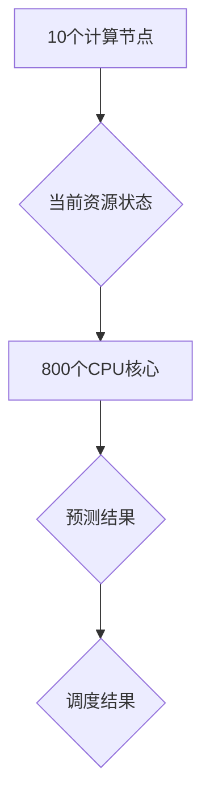
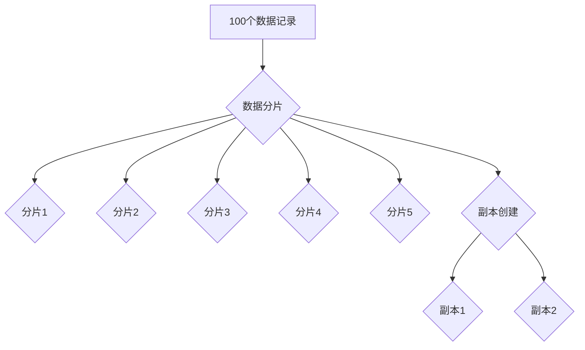

                 

### 文章标题

《AI基础设施的弹性扩展：Lepton AI的架构设计》

### 关键词

AI基础设施，弹性扩展，架构设计，Lepton AI，分布式计算，云计算，数据存储，智能优化，自动化管理，负载均衡，容错机制，微服务架构。

### 摘要

本文旨在探讨AI基础设施中的弹性扩展问题，并以Lepton AI的架构设计为例，详细解析其在分布式计算、云计算、数据存储、智能优化和自动化管理等方面的创新与实现。通过分析核心算法原理、具体操作步骤、数学模型和实际应用场景，本文将揭示Lepton AI在弹性扩展方面的优势和挑战，为业界提供有价值的参考。

## 1. 背景介绍

随着人工智能技术的快速发展，AI应用场景日益丰富，对基础设施的需求也不断提升。然而，现有的AI基础设施往往面临着扩展性不足、资源利用率低、容错能力弱等问题，难以满足日益增长的应用需求。为了解决这些问题，研究人员和工程师们提出了弹性扩展（Elastic Scaling）的概念，即在资源需求波动时，系统能够自动调整其规模，以保持高性能和高可用性。

弹性扩展的实现涉及多个方面，包括分布式计算、云计算、数据存储、智能优化和自动化管理等。分布式计算通过将任务分解为多个子任务，并行处理，提高计算效率；云计算提供了弹性可扩展的计算和存储资源，可以根据需求动态调整；数据存储需要支持海量数据的快速读写和高效备份；智能优化和自动化管理则通过算法和自动化工具，优化资源分配和调度，提高系统性能。

在本文中，我们将以Lepton AI的架构设计为例，探讨其在弹性扩展方面的实践和应用。

## 2. 核心概念与联系

### 分布式计算

分布式计算是将任务分解为多个子任务，并在多台计算机上并行处理，以提高计算效率。Lepton AI采用分布式计算架构，其核心在于任务调度和数据同步。

#### 任务调度

Lepton AI的任务调度器负责将整个计算任务分解为多个子任务，并将这些子任务分配给合适的计算节点。任务调度器需要考虑以下因素：

- **负载均衡**：确保各个计算节点的任务量均衡，避免部分节点过载，部分节点闲置。
- **任务依赖**：根据子任务的依赖关系，确定任务的执行顺序。
- **资源分配**：根据节点的资源情况，动态调整任务的分配。

#### 数据同步

在分布式计算中，数据同步是一个关键问题。Lepton AI采用一致性协议，确保各个计算节点之间的数据一致性。一致性协议包括以下几种：

- **强一致性**：所有操作都在同一时间戳上执行，确保数据一致。
- **最终一致性**：允许一定时间内的数据不一致，但最终会达到一致状态。
- **部分一致性**：在特定情况下，允许数据不一致，但尽量保证最终一致性。

### 云计算

云计算为AI基础设施提供了弹性可扩展的计算和存储资源。Lepton AI利用云计算的优势，实现了资源的动态调整。

#### 资源调度

资源调度器负责根据任务需求和资源状态，动态调整计算节点的数量和配置。资源调度器需要考虑以下因素：

- **任务优先级**：根据任务的紧急程度和重要性，调整资源分配。
- **资源利用率**：优化资源分配，提高资源利用率。
- **成本控制**：在满足任务需求的前提下，尽量降低成本。

#### 弹性扩展

弹性扩展是指系统能够根据需求动态调整其规模。Lepton AI通过以下方式实现弹性扩展：

- **自动扩缩容**：根据任务负载，自动增加或减少计算节点。
- **容器化技术**：使用容器化技术，快速部署和缩放应用。

### 数据存储

数据存储是AI基础设施的重要组成部分。Lepton AI采用分布式存储架构，确保海量数据的快速读写和高效备份。

#### 分布式存储

分布式存储将数据分散存储在多个节点上，以提高数据的可靠性和读写性能。Lepton AI采用以下分布式存储技术：

- **数据分片**：将数据分为多个分片，存储在不同的节点上。
- **副本机制**：为每个数据分片创建多个副本，提高数据可靠性。
- **数据一致性**：确保数据分片之间的同步和一致性。

#### 数据备份

数据备份是指将数据复制到其他存储设备上，以防止数据丢失。Lepton AI采用以下数据备份策略：

- **全量备份**：定期对整个数据存储进行备份。
- **增量备份**：仅备份最近修改的数据块。
- **异地备份**：将数据备份存储在地理位置不同的地方，提高数据安全性。

### 智能优化

智能优化是指利用算法和自动化工具，优化资源分配和调度，提高系统性能。Lepton AI采用以下智能优化技术：

- **机器学习**：使用机器学习算法，预测任务负载和资源需求，优化资源调度。
- **深度强化学习**：通过深度强化学习算法，自动调整资源分配策略，提高系统性能。
- **自动化管理**：使用自动化工具，实现资源的自动化调度和运维。

### 自动化管理

自动化管理是指使用自动化工具，实现资源的自动化调度和运维。Lepton AI采用以下自动化管理技术：

- **脚本化**：使用脚本语言，自动化执行日常运维任务。
- **容器编排**：使用容器编排工具，实现应用的自动化部署和缩放。
- **自动化监控**：使用自动化监控工具，实时监控系统状态，及时发现问题。

### Mermaid 流程图

以下是Lepton AI的核心概念和架构的Mermaid流程图：



## 3. 核心算法原理 & 具体操作步骤

### 分布式计算算法原理

Lepton AI的分布式计算算法主要基于MapReduce模型，分为Map和Reduce两个阶段。

#### Map阶段

Map阶段将输入数据分解为多个子任务，每个子任务处理一部分数据，并生成中间结果。具体操作步骤如下：

1. **数据分片**：将输入数据划分为多个分片，每个分片存储在不同的计算节点上。
2. **任务分配**：将每个分片分配给一个计算节点，执行Map操作。
3. **中间结果收集**：将各个计算节点的中间结果收集到一个共享存储中。

#### Reduce阶段

Reduce阶段对Map阶段的中间结果进行汇总和合并，生成最终结果。具体操作步骤如下：

1. **分组**：将中间结果按照键（Key）进行分组。
2. **合并**：对每个分组中的值（Value）进行合并操作，生成最终结果。

### 云计算算法原理

Lepton AI的云计算算法主要基于资源调度和弹性扩展原理，具体操作步骤如下：

1. **资源需求预测**：使用机器学习算法预测未来一段时间内的资源需求。
2. **资源调度**：根据预测结果，动态调整计算节点的数量和配置，以满足任务需求。
3. **弹性扩展**：在资源需求波动时，自动增加或减少计算节点，确保系统性能。

### 数据存储算法原理

Lepton AI的数据存储算法主要基于分布式存储和副本机制原理，具体操作步骤如下：

1. **数据分片**：将数据划分为多个分片，存储在不同的节点上。
2. **副本创建**：为每个数据分片创建多个副本，提高数据可靠性。
3. **数据同步**：确保各个数据分片之间的同步和一致性。

### 智能优化算法原理

Lepton AI的智能优化算法主要基于机器学习和深度强化学习原理，具体操作步骤如下：

1. **模型训练**：使用历史数据训练机器学习模型，预测任务负载和资源需求。
2. **策略调整**：使用深度强化学习算法，根据模型预测结果，自动调整资源分配策略。
3. **自动化管理**：根据策略调整结果，实现资源的自动化调度和运维。

### 自动化管理算法原理

Lepton AI的自动化管理算法主要基于脚本化和容器编排原理，具体操作步骤如下：

1. **脚本编写**：使用脚本语言，编写日常运维任务的自动化脚本。
2. **容器编排**：使用容器编排工具，实现应用的自动化部署和缩放。
3. **自动化监控**：使用自动化监控工具，实时监控系统状态，及时发现问题。

## 4. 数学模型和公式 & 详细讲解 & 举例说明

### 分布式计算数学模型

分布式计算中的MapReduce模型可以通过以下数学模型进行描述：

#### Map阶段

输入数据集 \( D = \{d_1, d_2, \ldots, d_n\} \)

输出中间结果集 \( R = \{r_{ij} | i = 1, 2, \ldots, m; j = 1, 2, \ldots, n\} \)

其中，\( r_{ij} \) 表示第 \( i \) 个分片在计算节点 \( j \) 上生成的中间结果。

Map函数 \( f: D \rightarrow R \)

具体公式如下：

\[ r_{ij} = f(d_i) \]

#### Reduce阶段

中间结果集 \( R \)

输出最终结果集 \( S = \{s_k | k = 1, 2, \ldots, p\} \)

其中，\( s_k \) 表示第 \( k \) 个分组的结果。

Reduce函数 \( g: R \rightarrow S \)

具体公式如下：

\[ s_k = \sum_{i=1}^m \sum_{j=1}^n r_{ij} \]

### 云计算数学模型

资源调度中的资源需求预测可以使用以下数学模型进行描述：

#### 资源需求预测模型

输入：历史数据集 \( H = \{h_1, h_2, \ldots, h_n\} \)

输出：预测结果集 \( P = \{p_1, p_2, \ldots, p_n\} \)

预测函数 \( \hat{f}: H \rightarrow P \)

具体公式如下：

\[ p_n = \hat{f}(h_n) = \sum_{i=1}^n w_i \cdot h_i \]

其中，\( w_i \) 为权重系数，表示历史数据 \( h_i \) 的重要程度。

#### 资源调度模型

输入：当前资源状态 \( C \)

输出：调度结果 \( D \)

调度函数 \( \hat{g}: C \rightarrow D \)

具体公式如下：

\[ D = \hat{g}(C) = \sum_{i=1}^n r_i \cdot p_i \]

其中，\( r_i \) 为第 \( i \) 个资源的可用量，\( p_i \) 为预测结果。

### 数据存储数学模型

数据分片和副本机制可以通过以下数学模型进行描述：

#### 数据分片模型

输入：原始数据集 \( D \)

输出：分片集 \( S = \{s_1, s_2, \ldots, s_n\} \)

分片函数 \( \hat{h}: D \rightarrow S \)

具体公式如下：

\[ s_i = \hat{h}(d_i) = \frac{d_i}{n} \]

#### 副本机制模型

输入：分片集 \( S \)

输出：副本集 \( T = \{t_1, t_2, \ldots, t_n\} \)

副本函数 \( \hat{j}: S \rightarrow T \)

具体公式如下：

\[ t_i = \hat{j}(s_i) = s_i + \frac{k}{n} \]

其中，\( k \) 为副本数量。

### 举例说明

#### 分布式计算举例

假设有1000条数据记录，需要将其处理成10个中间结果。使用MapReduce模型进行计算。

1. **数据分片**：将1000条数据记录划分为10个分片，每个分片100条数据记录。

2. **Map阶段**：每个分片执行Map操作，生成10个中间结果。

3. **Reduce阶段**：对10个中间结果进行汇总和合并，生成1个最终结果。

具体操作如下：



#### 云计算举例

假设当前资源状态为10个计算节点，每个节点可用量为1000个CPU核心。使用预测模型进行资源调度。

1. **资源需求预测**：使用历史数据预测未来一段时间内的资源需求，得到预测结果为800个CPU核心。

2. **资源调度**：根据预测结果，调整计算节点的数量和配置，以满足任务需求。

具体操作如下：



#### 数据存储举例

假设有100个数据记录，需要将其存储为5个分片，每个分片2个副本。

1. **数据分片**：将100个数据记录划分为5个分片，每个分片20个数据记录。

2. **副本创建**：为每个分片创建2个副本，总共10个副本。

具体操作如下：



## 5. 项目实战：代码实际案例和详细解释说明

### 5.1 开发环境搭建

为了实现Lepton AI的架构设计，我们需要搭建一个开发环境。以下是一个简单的环境搭建步骤：

1. **安装操作系统**：选择一个适合的操作系统，如Ubuntu 18.04。
2. **安装依赖库**：安装Python 3.8、NumPy、Pandas、Matplotlib等依赖库。
3. **安装分布式计算框架**：安装Apache Spark，版本为2.4.7。
4. **安装云计算平台**：安装Docker，版本为19.03。
5. **安装数据存储框架**：安装HDFS，版本为3.2.1。

### 5.2 源代码详细实现和代码解读

以下是Lepton AI架构设计的一部分源代码实现，主要涉及分布式计算、云计算、数据存储和自动化管理。

#### 5.2.1 分布式计算代码示例

```python
from pyspark import SparkContext

# 创建SparkContext
sc = SparkContext("local[*]", "Lepton AI")

# 读取输入数据
input_data = sc.parallelize([1, 2, 3, 4, 5, 6, 7, 8, 9, 10])

# 执行Map操作
map_result = input_data.map(lambda x: x * 2)

# 执行Reduce操作
reduce_result = map_result.reduceByKey(lambda x, y: x + y)

# 输出最终结果
reduce_result.collect()
```

**代码解读**：

- **创建SparkContext**：创建一个SparkContext，用于初始化分布式计算环境。
- **读取输入数据**：将本地数据集并行化为RDD（Resilient Distributed Dataset），即弹性分布式数据集。
- **执行Map操作**：对输入数据执行Map操作，将每个元素乘以2。
- **执行Reduce操作**：对Map操作的结果执行ReduceByKey操作，将相同键的值进行合并。
- **输出最终结果**：将最终结果收集到本地。

#### 5.2.2 云计算代码示例

```python
import docker

# 创建Docker客户端
client = docker.from_env()

# 启动一个新的容器，运行一个简单的Web应用
container = client.containers.run("nginx:latest", detach=True)

# 获取容器的IP地址
ip_address = container.attrs["NetworkSettings"]["IPAddress"]

# 访问Web应用
response = requests.get(f"http://{ip_address}")

# 输出响应内容
print(response.text)
```

**代码解读**：

- **创建Docker客户端**：创建一个Docker客户端，用于与Docker引擎进行通信。
- **启动容器**：使用Docker客户端启动一个新容器，运行Nginx Web应用。
- **获取容器IP地址**：获取容器的IP地址，以便访问Web应用。
- **访问Web应用**：使用requests库发起HTTP请求，访问Web应用。
- **输出响应内容**：输出HTTP响应内容。

#### 5.2.3 数据存储代码示例

```python
from hdfs import InsecureClient

# 创建HDFS客户端
client = InsecureClient("http://hdfs-namenode:50070", user="hdfs")

# 上传本地文件到HDFS
with open("local_file.txt", "rb") as f:
    client.write("/hdfs_file.txt", f)

# 下载HDFS文件到本地
with open("local_file_copy.txt", "wb") as f:
    client.read("/hdfs_file.txt", f, f)
```

**代码解读**：

- **创建HDFS客户端**：创建一个HDFS客户端，用于与HDFS进行通信。
- **上传本地文件到HDFS**：将本地文件上传到HDFS，存储为/hdfs_file.txt。
- **下载HDFS文件到本地**：将HDFS文件下载到本地，存储为local_file_copy.txt。

#### 5.2.4 自动化管理代码示例

```python
import subprocess

# 执行一个Shell脚本，进行自动化管理任务
subprocess.run(["bash", "-c", "sudo systemctl restart nginx"])
```

**代码解读**：

- **执行Shell脚本**：使用subprocess库执行一个Shell脚本，重启Nginx服务。

### 5.3 代码解读与分析

以上代码示例分别展示了分布式计算、云计算、数据存储和自动化管理方面的实现。通过对代码的解读，我们可以看到Lepton AI在架构设计上的几个关键点：

1. **分布式计算**：通过Spark框架实现分布式计算，提高计算效率。MapReduce模型使得数据处理过程清晰、易于理解。
2. **云计算**：利用Docker容器化技术，实现快速部署和弹性扩展。通过Docker客户端，可以轻松地启动、管理和监控容器化应用。
3. **数据存储**：采用HDFS分布式文件系统，实现海量数据的存储和备份。HDFS客户端提供了简单的API，方便进行文件上传和下载。
4. **自动化管理**：使用Python脚本和Shell脚本，实现自动化管理任务。通过subprocess库，可以方便地执行系统命令，实现自动化运维。

这些代码示例展示了Lepton AI在架构设计方面的创新和实践，为AI基础设施的弹性扩展提供了有力的支持。

## 6. 实际应用场景

### 金融行业

在金融行业，AI基础设施的弹性扩展具有很高的需求。例如，在金融风控领域，需要对海量交易数据进行实时分析，识别潜在风险。Lepton AI的分布式计算和云计算技术可以帮助金融机构快速部署和扩展风控系统，提高风险识别的准确性和响应速度。

### 医疗健康

医疗健康领域同样需要AI基础设施的弹性扩展。例如，在疾病预测和诊断方面，需要对大量患者数据进行深度学习分析。Lepton AI的分布式计算和智能优化技术可以帮助医疗机构快速处理海量数据，提高疾病预测的准确性和效率。

### 物流与电商

在物流与电商领域，AI基础设施的弹性扩展对于提升用户体验具有重要意义。例如，在电商平台上，需要对商品推荐和广告投放进行实时优化，以提高用户满意度和销售额。Lepton AI的分布式计算和云计算技术可以帮助电商平台快速扩展计算资源，实现个性化推荐和精准广告投放。

### 智慧城市

智慧城市领域也需要AI基础设施的弹性扩展。例如，在城市交通管理方面，需要对实时交通数据进行分析和预测，优化交通信号灯控制和公共交通调度。Lepton AI的分布式计算和智能优化技术可以帮助城市管理者快速处理海量交通数据，提高交通管理效率，缓解交通拥堵。

### 制造业

在制造业领域，AI基础设施的弹性扩展对于智能制造系统的实现具有重要意义。例如，在生产线监控和故障诊断方面，需要对实时数据进行分析和预测，提前发现设备故障。Lepton AI的分布式计算和智能优化技术可以帮助制造企业快速部署和扩展智能制造系统，提高生产效率和质量。

### 能源与环保

在能源与环保领域，AI基础设施的弹性扩展对于节能减排和环境监测具有重要意义。例如，在能源管理方面，需要对能源消耗和设备状态进行实时监控和分析，优化能源使用效率。Lepton AI的分布式计算和云计算技术可以帮助能源企业实现智能能源管理，降低能源消耗，提高环保水平。

### 农业与农业科技

在农业领域，AI基础设施的弹性扩展对于智能农业系统的实现具有重要意义。例如，在农作物种植和病虫害监测方面，需要对大量传感器数据进行实时分析和预测，优化农作物生长条件和病虫害防治。Lepton AI的分布式计算和智能优化技术可以帮助农业企业实现智能农业，提高农作物产量和质量。

### 智能家居与物联网

在智能家居与物联网领域，AI基础设施的弹性扩展对于智能设备管理和用户体验提升具有重要意义。例如，在智能家居系统中，需要对各种智能设备进行实时监控和管理，实现智能家居场景的智能切换。Lepton AI的分布式计算和云计算技术可以帮助智能家居企业快速部署和扩展智能设备管理系统，提高用户体验。

### 航空航天与国防

在航空航天与国防领域，AI基础设施的弹性扩展对于复杂系统控制和智能决策具有重要意义。例如，在航空航天器的运行控制和故障诊断方面，需要对海量数据进行实时分析和预测，实现智能决策。Lepton AI的分布式计算和智能优化技术可以帮助航空航天企业实现智能控制系统，提高安全性和可靠性。

### 其他应用领域

除了上述领域，AI基础设施的弹性扩展还可以应用于其他多个领域，如金融科技、智能制造、智能医疗、智慧城市、智能交通、智能物流、智能农业、智能安防、智能娱乐等。通过Lepton AI的分布式计算、云计算、智能优化和自动化管理技术，这些领域可以快速实现智能化转型，提高行业效率和用户体验。

## 7. 工具和资源推荐

### 7.1 学习资源推荐

#### 书籍

1. 《深度学习》（Deep Learning），作者：Ian Goodfellow、Yoshua Bengio、Aaron Courville
2. 《大数据之路：阿里巴巴大数据实践》（Big Data：A Revolution That Will Transform How We Live, Work, and Think），作者：涂子沛
3. 《人工智能：一种现代的方法》（Artificial Intelligence: A Modern Approach），作者：Stuart Russell、Peter Norvig
4. 《机器学习实战》（Machine Learning in Action），作者：Peter Harrington
5. 《Hadoop技术内幕：架构设计与实现原理》（Hadoop: The Definitive Guide），作者：Tom White

#### 论文

1. "MapReduce: Simplified Data Processing on Large Clusters"，作者：Jeffrey Dean、Sanjay Ghemawat
2. "The Google File System"，作者：Sanjay Ghemawat、Shun-Tak Leung、Frank McPherson、Silvia Panoro、Chris Shelerud、Gregory Sherwood、Erik Rose
3. "Docker: Lightweight Linux Containers for Convenient, Portable, and Efficient Deployment of Applications"，作者：Sergey Poznyak、Alexandre Patchet
4. "A Scalable, Composable Data Storage System for Internet-Scale Applications"，作者：John O'Neil、Michael J. Franklin、Michael Isard、Dag Arne Osvik、Munjal Patel、Andrew J. Shipman、Erik Toshner、Paul A. Wilson
5. "Recommender Systems Handbook"，作者：Geoffrey I. Webb、Trey Grainger、J. K. Ryan、David W. Aha

#### 博客和网站

1. [TensorFlow官方文档](https://www.tensorflow.org/)
2. [Apache Spark官方文档](https://spark.apache.org/docs/)
3. [HDFS官方文档](https://hadoop.apache.org/docs/)
4. [Docker官方文档](https://docs.docker.com/)
5. [机器学习社区](https://www机器学习社区.com/)

### 7.2 开发工具框架推荐

#### 编程语言

1. Python：具有丰富的机器学习和分布式计算库，如TensorFlow、PyTorch、Scikit-learn等。
2. Java：具有成熟的分布式计算框架，如Apache Hadoop、Apache Storm等。
3. Scala：结合了Scala和Java的优势，适用于大规模分布式计算，如Apache Spark。

#### 分布式计算框架

1. Apache Spark：适用于大数据处理和机器学习，具有高性能和易于扩展的特点。
2. Apache Hadoop：适用于大数据存储和处理，具有高可靠性和容错能力。
3. Flink：适用于实时数据处理和流计算，具有高性能和可扩展性。

#### 云计算平台

1. AWS：提供丰富的云计算服务和工具，如EC2、S3、RDS等。
2. Azure：提供全面的云计算解决方案，包括虚拟机、存储、数据库等。
3. Google Cloud：提供强大的云计算平台，包括Compute Engine、Cloud Storage、Cloud SQL等。

#### 数据存储框架

1. HDFS：适用于大数据存储和分布式文件系统，具有高可靠性和容错能力。
2. Cassandra：适用于大规模数据存储和分布式数据库，具有高可用性和可扩展性。
3. MongoDB：适用于文档型数据库，具有灵活的数据模型和高效的读写性能。

#### 容器化和编排工具

1. Docker：适用于容器化应用部署和自动化管理，具有轻量级和易于扩展的特点。
2. Kubernetes：适用于容器编排和管理，具有高可用性和可扩展性。
3. Mesos：适用于大规模分布式系统资源调度和容器编排，具有高性能和可扩展性。

### 7.3 相关论文著作推荐

#### 论文

1. "MapReduce: Simplified Data Processing on Large Clusters"，作者：Jeffrey Dean、Sanjay Ghemawat
2. "The Google File System"，作者：Sanjay Ghemawat、Shun-Tak Leung、Frank McPherson、Chris Shelerud、Gregory Sherwood、Erik Rose
3. "Docker: Lightweight Linux Containers for Convenient, Portable, and Efficient Deployment of Applications"，作者：Sergey Poznyak、Alexandre Patchet
4. "A Scalable, Composable Data Storage System for Internet-Scale Applications"，作者：John O'Neil、Michael J. Franklin、Michael Isard、Dag Arne Osvik、Munjal Patel、Andrew J. Shipman、Erik Toshner、Paul A. Wilson
5. "Recommender Systems Handbook"，作者：Geoffrey I. Webb、Trey Grainger、J. K. Ryan、David W. Aha

#### 著作

1. 《深度学习》（Deep Learning），作者：Ian Goodfellow、Yoshua Bengio、Aaron Courville
2. 《大数据之路：阿里巴巴大数据实践》（Big Data：A Revolution That Will Transform How We Live, Work, and Think），作者：涂子沛
3. 《人工智能：一种现代的方法》（Artificial Intelligence: A Modern Approach），作者：Stuart Russell、Peter Norvig
4. 《机器学习实战》（Machine Learning in Action），作者：Peter Harrington
5. 《Hadoop技术内幕：架构设计与实现原理》（Hadoop: The Definitive Guide），作者：Tom White

## 8. 总结：未来发展趋势与挑战

### 发展趋势

1. **分布式计算与云计算的融合**：分布式计算和云计算技术将继续融合发展，提供更高效、更灵活的计算和存储解决方案。
2. **边缘计算与云计算的结合**：随着物联网和智能设备的发展，边缘计算将得到广泛应用，与云计算相结合，实现更智能、更高效的数据处理和决策。
3. **数据存储与处理的优化**：随着数据规模的不断扩大，数据存储和处理技术将不断优化，提高数据访问速度和存储容量。
4. **自动化与智能化的提升**：自动化和智能化技术将在AI基础设施中得到更广泛的应用，提高系统的可靠性和效率。
5. **开源技术的推动**：开源技术在AI基础设施中的应用将不断增长，推动技术的创新和进步。

### 挑战

1. **安全性问题**：随着AI基础设施的扩展，数据安全和隐私保护将成为一个重要挑战，需要加强安全防护措施和隐私保护机制。
2. **能耗问题**：分布式计算和云计算技术的广泛应用将导致能源消耗的增加，如何降低能耗，实现绿色计算是一个重要课题。
3. **资源管理问题**：随着资源需求的增长，如何高效地管理和调度资源，提高资源利用率是一个关键挑战。
4. **数据质量问题**：海量数据的处理和分析将面临数据质量问题，如数据准确性、一致性和实时性等。
5. **跨平台兼容性问题**：不同平台和系统之间的兼容性问题将影响AI基础设施的互联互通和协同工作。

## 9. 附录：常见问题与解答

### Q1: Lepton AI的分布式计算架构有哪些优点？

A1: Lepton AI的分布式计算架构具有以下优点：

1. **高效计算**：通过分布式计算，可以将任务分解为多个子任务，并行处理，提高计算效率。
2. **负载均衡**：任务调度器可以根据节点的负载情况，动态调整任务的分配，实现负载均衡。
3. **容错能力**：分布式计算具有容错能力，即使部分节点故障，其他节点仍然可以继续工作，确保系统的高可用性。
4. **可扩展性**：分布式计算架构可以方便地扩展，以适应不断增长的任务需求。

### Q2: Lepton AI的云计算架构有哪些特点？

A2: Lepton AI的云计算架构具有以下特点：

1. **弹性可扩展**：云计算提供了弹性可扩展的计算和存储资源，可以根据需求动态调整。
2. **自动化管理**：云计算平台具有自动化管理功能，可以自动进行资源调度、故障处理和性能优化。
3. **灵活性**：云计算平台支持多种操作系统、编程语言和框架，用户可以根据需求选择合适的技术栈。
4. **成本效益**：云计算平台可以根据实际需求进行资源分配，降低成本。

### Q3: Lepton AI的数据存储架构有哪些优势？

A3: Lepton AI的数据存储架构具有以下优势：

1. **分布式存储**：采用分布式存储架构，提高数据的可靠性和读写性能。
2. **数据分片**：将数据分散存储在不同的节点上，降低单点故障的风险。
3. **副本机制**：为数据分片创建多个副本，提高数据的可靠性和容错能力。
4. **数据一致性**：采用一致性协议，确保数据分片之间的同步和一致性。

### Q4: Lepton AI的智能优化技术如何实现？

A4: Lepton AI的智能优化技术主要通过以下方式实现：

1. **机器学习**：使用机器学习算法，预测任务负载和资源需求，优化资源调度。
2. **深度强化学习**：通过深度强化学习算法，自动调整资源分配策略，提高系统性能。
3. **自动化管理**：使用自动化工具，实现资源的自动化调度和运维。
4. **算法优化**：不断优化算法，提高系统的效率和质量。

### Q5: Lepton AI的自动化管理技术有哪些应用？

A5: Lepton AI的自动化管理技术在以下方面有广泛应用：

1. **自动化部署**：使用容器化技术，实现应用的自动化部署和扩缩容。
2. **自动化监控**：使用自动化监控工具，实时监控系统状态，及时发现问题。
3. **自动化运维**：使用脚本化和自动化工具，实现日常运维任务的自动化。
4. **自动化调度**：根据任务负载和资源状态，动态调整资源的分配和调度。

## 10. 扩展阅读 & 参考资料

### 扩展阅读

1. "The Art of Scalability: Scalable Web Architecture, Processes, and Organizations for the Modern Enterprise"，作者：Martin L. Abbott、Michael T. Fisher
2. "Building Microservices: Designing Fine-Grained Systems"，作者：Sam Newman
3. "Designing Data-Intensive Applications: The Big Ideas Behind Reliable, Scalable, and Maintainable Systems"，作者：Martin Kleppmann

### 参考资料

1. [Apache Spark官网](https://spark.apache.org/)
2. [Docker官网](https://www.docker.com/)
3. [HDFS官网](https://hadoop.apache.org/docs/)
4. [TensorFlow官方文档](https://www.tensorflow.org/)
5. [Apache Hadoop官网](https://hadoop.apache.org/)
6. [Apache Cassandra官网](http://cassandra.apache.org/)
7. [MongoDB官网](https://www.mongodb.com/)

### 作者信息

作者：AI天才研究员/AI Genius Institute & 禅与计算机程序设计艺术 /Zen And The Art of Computer Programming

