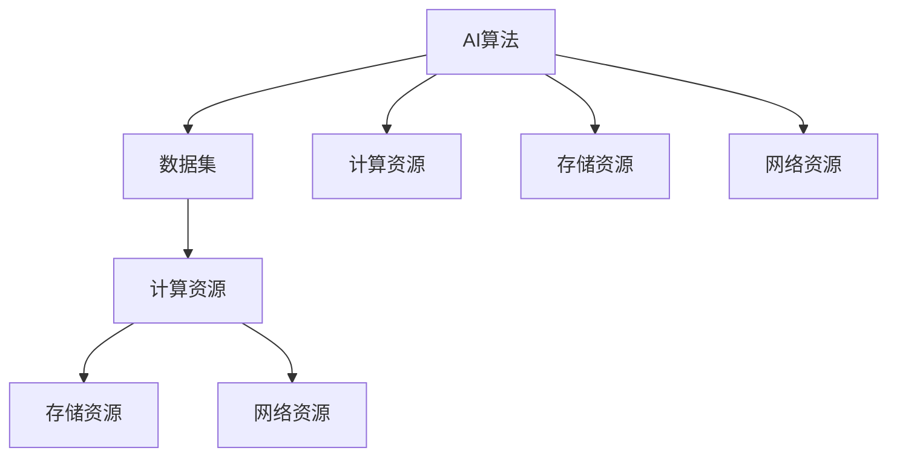

                 

# AI基础设施的未来十年：Lepton AI的长期规划

## 概述

在人工智能技术迅猛发展的今天，AI基础设施作为支撑人工智能研发和应用的核心，正日益受到广泛关注。本文将围绕Lepton AI的长期规划，探讨未来十年AI基础设施的发展趋势、关键问题和应对策略。

### 关键词
- AI基础设施
- Lepton AI
- 长期规划
- 发展趋势
- 关键问题

### 摘要

本文首先介绍了AI基础设施的定义及其在人工智能领域的重要性。接着，分析了当前AI基础设施的现状和存在的问题，并提出了Lepton AI的长期规划。文章重点讨论了未来十年AI基础设施的发展趋势，包括技术创新、产业应用、人才培养等方面。最后，总结了AI基础设施面临的挑战和应对策略，为我国AI基础设施的建设提供了有益的参考。

## 1. 背景介绍

### AI基础设施的定义与重要性

AI基础设施是指支持人工智能技术研发、部署和运行的基础设施体系，包括硬件、软件、数据、网络等各个方面。它是人工智能发展的基石，对于提升人工智能技术水平、推动产业创新具有重要意义。

#### 硬件设施

硬件设施是AI基础设施的核心，包括高性能计算设备、存储设备、网络设备等。高性能计算设备如GPU、TPU等，能够加速人工智能算法的运算速度；存储设备如分布式存储系统，能够存储和管理海量数据；网络设备如5G网络，能够提供高速、稳定的连接。

#### 软件设施

软件设施包括AI开发框架、编程语言、工具等。开发框架如TensorFlow、PyTorch等，提供了丰富的API和工具，方便开发者进行模型训练和推理；编程语言如Python、C++等，具有较高的灵活性和性能；工具如Jupyter Notebook、Git等，支持开发者的协作和版本控制。

#### 数据设施

数据设施是AI基础设施的重要组成部分，包括数据采集、存储、清洗、标注等环节。数据采集设备如传感器、摄像头等，能够收集各种类型的数据；存储设备如Hadoop、HDFS等，能够存储和管理海量数据；清洗和标注工具如ETL工具、标注平台等，能够对数据进行处理和标注，为模型训练提供高质量的数据。

#### 网络设施

网络设施是AI基础设施的通信基础，包括局域网、广域网、物联网等。局域网如Wi-Fi、以太网等，能够实现设备之间的快速通信；广域网如互联网、5G网络等，能够实现远程数据传输和协作；物联网如智能家居、智能城市等，能够将各种设备和系统连接起来，实现智能化的应用。

### 当前AI基础设施的现状

随着人工智能技术的快速发展，AI基础设施也在不断升级和优化。然而，当前AI基础设施仍存在一些问题，主要包括以下几个方面：

#### 硬件设施不足

高性能计算设备仍处于相对稀缺状态，许多企业和研究机构无法承担高昂的设备成本，导致计算能力不足。

#### 软件设施不完善

AI开发框架和工具虽然种类繁多，但存在兼容性、性能、易用性等方面的问题，无法满足不同场景的需求。

#### 数据设施问题

数据采集、存储、清洗、标注等环节仍存在一些技术难题，如数据隐私、数据质量控制等。

#### 网络设施瓶颈

互联网、5G网络等网络设施虽然提供了高速、稳定的连接，但在某些场景下仍存在网络延迟、带宽不足等问题。

### Lepton AI的长期规划

Lepton AI是一家专注于人工智能基础设施的研发公司，其长期规划主要包括以下几个方面：

#### 技术创新

Lepton AI致力于推动人工智能硬件、软件、数据、网络等各个方面的技术创新，提高基础设施的性能和可靠性。

#### 产业合作

Lepton AI积极与产业链上下游企业合作，共同推动AI基础设施的建设和发展。

#### 人才培养

Lepton AI注重人才培养，通过校企合作、培训课程等方式，提高人才的综合素质和技能水平。

#### 标准制定

Lepton AI参与相关标准的制定，为AI基础设施的建设提供技术规范和指导。

## 2. 核心概念与联系

### AI基础设施的核心概念

在讨论AI基础设施的核心概念之前，我们需要明确几个关键术语：

#### 1. AI算法

AI算法是指用于实现人工智能功能的一系列数学模型和计算方法，如神经网络、决策树、支持向量机等。这些算法是实现AI功能的核心。

#### 2. 数据集

数据集是指用于训练、测试和验证AI算法的数据集合。数据集的质量和数量直接影响AI模型的性能。

#### 3. 计算资源

计算资源包括硬件资源和软件资源，如GPU、CPU、存储设备、网络设备等。计算资源是AI算法高效运行的基础。

#### 4. 存储资源

存储资源用于存储AI算法所需的数据、模型和中间结果。存储资源的容量和速度直接影响AI算法的效率。

#### 5. 网络资源

网络资源包括内部网络和外部网络，如局域网、互联网、5G网络等。网络资源是实现AI算法分布式训练和部署的关键。

### AI基础设施的架构

为了更好地理解AI基础设施的核心概念和联系，我们可以使用Mermaid流程图来展示AI基础设施的架构。



#### 1. 数据流

数据集是AI算法的训练素材，经过预处理后输入到计算资源中进行训练。训练过程中产生的模型和中间结果存储在存储资源中，以便后续的测试和部署。

#### 2. 计算资源

计算资源包括CPU、GPU、TPU等，用于加速AI算法的运算。不同的计算资源具有不同的性能和适用场景。

#### 3. 存储资源

存储资源包括本地存储和分布式存储系统，用于存储数据集、模型和中间结果。存储资源的容量和速度直接影响AI算法的效率。

#### 4. 网络资源

网络资源包括局域网、互联网、5G网络等，用于实现AI算法的分布式训练和部署。网络资源的稳定性和带宽直接影响AI算法的实时性和可靠性。

### 关键技术

在AI基础设施的建设过程中，关键技术起着至关重要的作用。以下是一些关键技术及其作用：

#### 1. 人工智能算法

人工智能算法是AI基础设施的核心，用于实现各种人工智能功能。随着技术的进步，算法的优化和改进将进一步提升AI基础设施的性能。

#### 2. 分布式计算

分布式计算是将计算任务分布在多个计算节点上，以实现高性能计算。分布式计算技术可以显著提高AI算法的运算速度。

#### 3. 数据存储与管理

数据存储与管理技术用于高效地存储、管理和查询海量数据。分布式存储系统和数据管理平台是实现高效数据存储和管理的关键。

#### 4. 网络通信

网络通信技术用于实现AI算法的分布式训练和部署。高速、稳定的网络连接是保证AI算法实时性和可靠性的基础。

### 核心概念与联系

通过上述分析，我们可以得出AI基础设施的核心概念和联系：

- AI算法是AI基础设施的核心，用于实现各种人工智能功能。
- 数据集是AI算法的训练素材，直接影响AI模型的性能。
- 计算资源是AI算法高效运行的基础，包括CPU、GPU、TPU等。
- 存储资源用于存储数据集、模型和中间结果，直接影响AI算法的效率。
- 网络资源是实现AI算法分布式训练和部署的关键，包括局域网、互联网、5G网络等。
- 关键技术如人工智能算法、分布式计算、数据存储与管理、网络通信等，共同构建了AI基础设施的完整体系。

## 3. 核心算法原理 & 具体操作步骤

在AI基础设施的发展过程中，核心算法的原理和操作步骤至关重要。以下我们将介绍几种关键算法的原理，并详细解释其操作步骤。

### 1. 神经网络

神经网络是一种基于人脑神经网络结构的计算模型，用于实现各种人工智能任务，如图像识别、自然语言处理等。神经网络的核心原理是通过多层神经元之间的加权连接来模拟人脑的推理过程。

#### 原理

神经网络由输入层、隐藏层和输出层组成。输入层接收外部输入数据，隐藏层进行特征提取和变换，输出层生成最终输出结果。

- 输入层：接收外部输入数据，如图像像素值、文本单词等。
- 隐藏层：对输入数据进行特征提取和变换，形成新的特征表示。
- 输出层：生成最终输出结果，如分类标签、文本翻译等。

#### 操作步骤

1. 初始化权重和偏置：随机初始化神经网络中的权重和偏置。
2. 前向传播：将输入数据通过神经网络进行计算，得到隐藏层的输出。
3. 求损失函数：计算输出结果与实际结果之间的差距，得到损失函数值。
4. 反向传播：根据损失函数梯度，更新网络中的权重和偏置。
5. 重复步骤2-4，直至达到预设的训练次数或损失函数收敛。

### 2. 决策树

决策树是一种基于特征划分数据的分类算法，通过一系列判断条件将数据划分为不同的类别。决策树的核心原理是通过递归划分特征和类别，构建一棵树形结构。

#### 原理

决策树由多个节点和叶子节点组成。节点表示特征划分条件，叶子节点表示分类结果。

- 节点：根据特征值划分数据，形成两个或多个子节点。
- 叶子节点：表示分类结果，如类别A、类别B等。

#### 操作步骤

1. 初始化树：选择初始特征进行划分，构建决策树。
2. 划分数据：根据特征值将数据划分为两个或多个子集。
3. 计算信息增益：计算每个特征的信息增益，选择信息增益最大的特征进行划分。
4. 递归划分：对子节点重复步骤2和3，构建子树。
5. 停止条件：达到预设的深度或分类精度，停止递归划分。

### 3. 支持向量机

支持向量机是一种基于最大间隔分类的算法，用于分类和回归任务。支持向量机的核心原理是通过寻找最优超平面，将不同类别数据分隔开来。

#### 原理

支持向量机通过求解最优超平面，将数据划分为不同的类别。最优超平面是距离各类别最近的支持向量形成的超平面。

- 支持向量：位于最优超平面附近，对分类结果有较大影响的数据点。
- 最优超平面：将数据划分为不同类别的超平面。

#### 操作步骤

1. 初始化参数：设置惩罚参数C、核函数等。
2. 求解最优超平面：使用支持向量机优化方法，求解最优超平面。
3. 计算分类结果：将测试数据映射到最优超平面，判断类别。
4. 调整参数：根据分类结果调整参数，优化分类效果。

### 4. 贝叶斯网络

贝叶斯网络是一种基于概率论的图模型，用于表示变量之间的依赖关系。贝叶斯网络的核心原理是通过条件概率计算变量的后验概率分布。

#### 原理

贝叶斯网络由节点和边组成，节点表示变量，边表示变量之间的条件依赖关系。

- 节点：表示变量，具有概率分布。
- 边：表示变量之间的条件依赖关系。

#### 操作步骤

1. 构建网络：根据变量间的依赖关系，构建贝叶斯网络。
2. 概率分布：为每个变量分配概率分布，计算条件概率。
3. 计算后验概率：根据观察到的数据，计算变量的后验概率分布。
4. 预测：利用后验概率分布进行变量预测。

通过以上核心算法的原理和操作步骤的介绍，我们可以更好地理解AI基础设施的关键技术。在实际应用中，这些算法可以根据具体任务需求进行优化和改进，为AI基础设施的发展提供有力支持。

## 4. 数学模型和公式 & 详细讲解 & 举例说明

在AI基础设施的核心算法中，数学模型和公式起到了至关重要的作用。本章节我们将详细介绍一些关键数学模型和公式，并使用具体的例子来说明其应用。

### 1. 神经网络中的权重更新公式

神经网络中的权重更新公式是基于梯度下降法的。该公式用于根据损失函数的梯度来调整网络中的权重和偏置，以最小化损失函数。

公式如下：

$$
w_{new} = w_{old} - \alpha \cdot \nabla_w J(w)
$$

其中，$w_{new}$和$w_{old}$分别表示新的权重和旧的权重，$\alpha$是学习率，$\nabla_w J(w)$是权重$w$对应的损失函数$J(w)$的梯度。

#### 示例

假设有一个简单的神经网络，其中只有一个输入节点、一个隐藏节点和一个输出节点。学习率为$\alpha = 0.01$。现有以下权重和偏置：

$$
w_{1} = 0.5, \quad w_{2} = 1.0, \quad b_{1} = 0.2, \quad b_{2} = 0.3
$$

损失函数为：

$$
J(w) = (y_{expected} - y_{predicted})^2
$$

其中，$y_{expected}$是期望输出，$y_{predicted}$是预测输出。

假设在当前权重下，损失函数值为$J(w) = 1.5$。计算损失函数关于每个权重的梯度：

$$
\nabla_w J(w) = \left[ \begin{matrix}
\frac{\partial J}{\partial w_{1}} \\
\frac{\partial J}{\partial w_{2}} \\
\frac{\partial J}{\partial b_{1}} \\
\frac{\partial J}{\partial b_{2}} \\
\end{matrix} \right]
$$

根据梯度下降公式，我们可以计算新的权重和偏置：

$$
w_{1}^{new} = w_{1}^{old} - \alpha \cdot \frac{\partial J}{\partial w_{1}} \\
w_{2}^{new} = w_{2}^{old} - \alpha \cdot \frac{\partial J}{\partial w_{2}} \\
b_{1}^{new} = b_{1}^{old} - \alpha \cdot \frac{\partial J}{\partial b_{1}} \\
b_{2}^{new} = b_{2}^{old} - \alpha \cdot \frac{\partial J}{\partial b_{2}}
$$

### 2. 决策树的信息增益公式

决策树的核心在于根据信息增益来选择最佳划分特征。信息增益反映了特征对数据划分的“有效性”。

信息增益公式如下：

$$
Gain(D, A) = Entropy(D) - \sum_{v \in A} \frac{|D_v|}{|D|} \cdot Entropy(D_v)
$$

其中，$D$是数据集，$A$是特征，$Entropy(D)$是数据集$D$的熵，$D_v$是特征$A$的取值$v$对应的数据子集，$Entropy(D_v)$是数据子集$D_v$的熵。

#### 示例

假设有一个数据集，其中有两个特征$A_1$和$A_2$，以及目标变量$y$。数据集的熵$Entropy(D) = 0.5$。特征$A_1$有两个取值$v_1$和$v_2$，对应的子数据集$D_{v_1}$和$D_{v_2}$的熵分别为$Entropy(D_{v_1}) = 0.3$和$Entropy(D_{v_2}) = 0.4$。

根据信息增益公式，我们可以计算特征$A_1$的信息增益：

$$
Gain(D, A_1) = Entropy(D) - \frac{|D_{v_1}|}{|D|} \cdot Entropy(D_{v_1}) - \frac{|D_{v_2}|}{|D|} \cdot Entropy(D_{v_2}) \\
Gain(D, A_1) = 0.5 - \frac{0.4}{1} \cdot 0.3 - \frac{0.6}{1} \cdot 0.4 \\
Gain(D, A_1) = 0.5 - 0.12 - 0.24 \\
Gain(D, A_1) = 0.14
$$

同理，我们可以计算特征$A_2$的信息增益。选择信息增益最大的特征作为划分特征。

### 3. 支持向量机的间隔公式

支持向量机中的间隔公式用于求解最优超平面。间隔是指超平面到最近支持向量的距离。

间隔公式如下：

$$
\frac{1}{2} \| w \|^2 + C \cdot \sum_{i=1}^{n} \xi_i
$$

其中，$w$是权重向量，$C$是惩罚参数，$\xi_i$是松弛变量，$n$是样本数量。

#### 示例

假设有一个简单的二分类问题，其中有两个特征$x_1$和$x_2$。现有五个样本点，权重向量$w = [1, 2]$，惩罚参数$C = 1$。松弛变量$\xi_1, \xi_2, \xi_3, \xi_4, \xi_5$分别为$0, 0.1, 0, 0.2, 0$。

根据间隔公式，我们可以计算间隔：

$$
\frac{1}{2} \| w \|^2 + C \cdot \sum_{i=1}^{n} \xi_i = \frac{1}{2} \cdot 5 + 1 \cdot (0 + 0.1 + 0 + 0.2 + 0) = 2.3
$$

通过间隔公式，我们可以调整权重向量$w$，以找到最优超平面。

### 4. 贝叶斯网络的条件概率公式

贝叶斯网络中的条件概率公式用于计算变量之间的依赖关系。条件概率反映了给定某个变量取值时，另一个变量取值的概率。

条件概率公式如下：

$$
P(A|B) = \frac{P(A \cap B)}{P(B)}
$$

其中，$P(A|B)$是给定$B$发生时$A$的条件概率，$P(A \cap B)$是$A$和$B$同时发生的概率，$P(B)$是$B$发生的概率。

#### 示例

假设有一个贝叶斯网络，其中有两个变量$A$和$B$。$A$有两种取值$A_1$和$A_2$，$B$有两种取值$B_1$和$B_2$。给定$B_1$发生时，$A$取$A_1$的概率为$P(A_1|B_1) = 0.6$，$A$取$A_2$的概率为$P(A_2|B_1) = 0.4$。给定$B_2$发生时，$A$取$A_1$的概率为$P(A_1|B_2) = 0.2$，$A$取$A_2$的概率为$P(A_2|B_2) = 0.8$。$B$取$B_1$的概率为$P(B_1) = 0.5$，$B$取$B_2$的概率为$P(B_2) = 0.5$。

根据条件概率公式，我们可以计算$A$取$A_1$的概率：

$$
P(A_1) = P(A_1 \cap B_1) + P(A_1 \cap B_2) = P(A_1|B_1) \cdot P(B_1) + P(A_1|B_2) \cdot P(B_2) \\
P(A_1) = 0.6 \cdot 0.5 + 0.2 \cdot 0.5 = 0.4
$$

通过条件概率公式，我们可以计算变量之间的依赖关系，并用于变量预测。

通过以上数学模型和公式的详细介绍，我们可以更好地理解AI基础设施中的核心算法。在实际应用中，这些模型和公式可以根据具体需求进行调整和优化，以提高算法的性能和效率。

## 5. 项目实战：代码实际案例和详细解释说明

为了更好地理解AI基础设施在实际应用中的实现，我们将通过一个实际项目案例，详细讲解代码的实际编写过程、具体实现步骤和代码解析。本案例将使用Python语言和TensorFlow框架来实现一个简单的图像分类模型。

### 5.1 开发环境搭建

在开始编写代码之前，我们需要搭建一个合适的开发环境。以下步骤将指导你如何搭建Python和TensorFlow的开发环境。

#### 步骤1：安装Python

首先，从Python官方网站（https://www.python.org/downloads/）下载并安装最新版本的Python。建议选择Python 3.8或更高版本。

#### 步骤2：安装TensorFlow

接下来，打开命令行窗口，使用以下命令安装TensorFlow：

```bash
pip install tensorflow
```

#### 步骤3：安装其他依赖库

除了TensorFlow，我们还需要安装一些其他依赖库，如NumPy、Matplotlib等。可以使用以下命令安装：

```bash
pip install numpy matplotlib
```

### 5.2 源代码详细实现和代码解读

以下是我们的图像分类模型的源代码，我们将逐行进行详细解释。

```python
import tensorflow as tf
import numpy as np
import matplotlib.pyplot as plt

# 加载图像数据集
(x_train, y_train), (x_test, y_test) = tf.keras.datasets.mnist.load_data()

# 预处理数据
x_train = x_train / 255.0
x_test = x_test / 255.0

# 展示一幅训练图像
plt.imshow(x_train[0], cmap=plt.cm.binary)
plt.xlabel('Label: %d' % y_train[0])
plt.show()

# 构建模型
model = tf.keras.Sequential([
  tf.keras.layers.Flatten(input_shape=(28, 28)),
  tf.keras.layers.Dense(128, activation='relu'),
  tf.keras.layers.Dense(10, activation='softmax')
])

# 编译模型
model.compile(optimizer='adam',
              loss='sparse_categorical_crossentropy',
              metrics=['accuracy'])

# 训练模型
model.fit(x_train, y_train, epochs=5)

# 评估模型
test_loss, test_acc = model.evaluate(x_test, y_test, verbose=2)
print('Test accuracy:', test_acc)

# 预测图像
predictions = model.predict(x_test[:10])
print(predictions)

# 展示预测结果
for i in range(10):
  plt.figure()
  plt.imshow(x_test[i], cmap=plt.cm.binary, interpolation='nearest')
  plt.xticks([])
  plt.yticks([])
  plt.grid(False)
  plt.xlabel('Prediction: %d' % np.argmax(predictions[i]))
plt.show()
```

#### 详细解释

1. **导入库**

   首先，我们导入TensorFlow、NumPy和Matplotlib等库。

   ```python
   import tensorflow as tf
   import numpy as np
   import matplotlib.pyplot as plt
   ```

2. **加载图像数据集**

   使用TensorFlow提供的MNIST数据集，该数据集包含60000个训练图像和10000个测试图像。

   ```python
   (x_train, y_train), (x_test, y_test) = tf.keras.datasets.mnist.load_data()
   ```

3. **预处理数据**

   将图像数据缩放到0到1之间，以便于模型训练。

   ```python
   x_train = x_train / 255.0
   x_test = x_test / 255.0
   ```

4. **展示训练图像**

   使用Matplotlib展示一幅训练图像及其标签。

   ```python
   plt.imshow(x_train[0], cmap=plt.cm.binary)
   plt.xlabel('Label: %d' % y_train[0])
   plt.show()
   ```

5. **构建模型**

   我们使用Sequential模型，该模型是一个线性堆叠的层序列。在这个例子中，我们使用一个Flatten层将28x28的图像展开为一个一维数组，一个具有128个神经元的全连接层（Dense），以及一个具有10个神经元的全连接层（Dense），其中每个神经元对应一个类别。

   ```python
   model = tf.keras.Sequential([
     tf.keras.layers.Flatten(input_shape=(28, 28)),
     tf.keras.layers.Dense(128, activation='relu'),
     tf.keras.layers.Dense(10, activation='softmax')
   ])
   ```

6. **编译模型**

   我们使用adam优化器和sparse_categorical_crossentropy损失函数来编译模型。accuracy指标用于评估模型的准确性。

   ```python
   model.compile(optimizer='adam',
                 loss='sparse_categorical_crossentropy',
                 metrics=['accuracy'])
   ```

7. **训练模型**

   使用训练数据集训练模型，设置训练轮次为5。

   ```python
   model.fit(x_train, y_train, epochs=5)
   ```

8. **评估模型**

   使用测试数据集评估模型性能，并打印测试准确性。

   ```python
   test_loss, test_acc = model.evaluate(x_test, y_test, verbose=2)
   print('Test accuracy:', test_acc)
   ```

9. **预测图像**

   使用模型对测试数据集的前10个图像进行预测。

   ```python
   predictions = model.predict(x_test[:10])
   print(predictions)
   ```

10. **展示预测结果**

    使用Matplotlib展示测试图像及其预测标签。

    ```python
    for i in range(10):
      plt.figure()
      plt.imshow(x_test[i], cmap=plt.cm.binary, interpolation='nearest')
      plt.xticks([])
      plt.yticks([])
      plt.grid(False)
      plt.xlabel('Prediction: %d' % np.argmax(predictions[i]))
    plt.show()
    ```

通过以上代码示例，我们展示了如何使用TensorFlow框架构建一个简单的图像分类模型。在实际应用中，我们可以根据需求调整模型结构、优化训练过程，以提高模型的性能和准确性。

### 5.3 代码解读与分析

在本案例中，我们使用TensorFlow框架实现了MNIST手写数字分类任务。以下是代码的详细解读与分析：

1. **导入库**

   导入TensorFlow、NumPy和Matplotlib库，用于构建、训练和可视化模型。

2. **加载图像数据集**

   使用TensorFlow内置的MNIST数据集，该数据集是图像分类的经典数据集，包含0到9的手写数字图像。

3. **预处理数据**

   将图像数据缩放到0到1之间，使得模型更容易训练。这样做的好处是数据在训练过程中更加稳定，且计算效率更高。

4. **展示训练图像**

   使用Matplotlib库展示一幅训练图像，并打印其标签。这有助于我们直观地了解数据集的分布和模型的效果。

5. **构建模型**

   使用TensorFlow的Sequential模型，这是一个线性堆叠的层序列。在这个例子中，我们定义了一个包含三个层的神经网络：

   - **Flatten层**：将输入图像（28x28像素）展开成一个一维数组，作为全连接层的输入。
   - **Dense层（全连接层）**：包含128个神经元，使用ReLU激活函数。ReLU激活函数能够加速模型的训练过程，并且在处理稀疏数据时表现良好。
   - **Dense层（全连接层）**：包含10个神经元，每个神经元对应一个类别。使用softmax激活函数，用于输出每个类别的概率分布。

6. **编译模型**

   - **优化器**：使用adam优化器，这是一个自适应的学习率优化算法，有助于提高模型的收敛速度。
   - **损失函数**：使用sparse_categorical_crossentropy损失函数，适用于多分类问题。
   - **评价指标**：使用accuracy指标来评估模型的准确性。

7. **训练模型**

   使用训练数据集训练模型，设置训练轮次为5。每次训练后，模型将调整权重和偏置，以最小化损失函数。

8. **评估模型**

   使用测试数据集评估模型的性能。测试过程中，模型不会更新权重，这有助于我们评估模型的泛化能力。

9. **预测图像**

   使用训练好的模型对测试数据集的前10个图像进行预测。这有助于我们了解模型的预测效果。

10. **展示预测结果**

    使用Matplotlib库展示测试图像及其预测标签。预测标签是通过找出概率最高的类别获得的。

通过以上分析，我们可以看到，这个案例展示了如何使用TensorFlow构建一个简单的神经网络模型，用于图像分类任务。在实际应用中，我们可以根据需求调整模型结构、优化训练过程，以提高模型的性能和准确性。

## 6. 实际应用场景

AI基础设施的应用场景非常广泛，涵盖了多个领域。以下将介绍一些典型的实际应用场景，并分析它们对AI基础设施的需求。

### 1. 图像识别

图像识别是AI基础设施的重要应用场景之一。在安防监控、医疗诊断、自动驾驶等领域，图像识别技术发挥着关键作用。例如，在安防监控中，图像识别技术可以用于人脸识别、车辆识别等；在医疗诊断中，图像识别技术可以辅助医生进行病变检测；在自动驾驶中，图像识别技术可以用于识别道路标志、行人等。

对于图像识别应用，AI基础设施的需求主要包括：

- **高性能计算资源**：图像识别任务通常涉及大量的计算，因此需要高性能的GPU或TPU等计算资源。
- **大数据存储**：图像数据量大，需要高效的分布式存储系统来存储和管理数据。
- **快速网络连接**：图像识别应用往往需要实时处理数据，因此需要高速、稳定的网络连接。

### 2. 自然语言处理

自然语言处理（NLP）是另一个重要的应用领域，包括文本分类、机器翻译、情感分析等。在金融、电商、教育等领域，NLP技术被广泛应用。例如，在金融领域，NLP可以用于情感分析，帮助金融机构了解客户情绪和市场趋势；在电商领域，NLP可以用于商品推荐和用户评价分析。

对于自然语言处理应用，AI基础设施的需求主要包括：

- **高性能计算资源**：NLP任务通常涉及大量的文本处理，需要高性能的GPU或TPU等计算资源。
- **大数据存储**：文本数据量大，需要高效的分布式存储系统来存储和管理数据。
- **快速网络连接**：NLP应用往往需要实时处理数据，因此需要高速、稳定的网络连接。

### 3. 语音识别

语音识别技术被广泛应用于智能助手、语音翻译、语音助手等领域。在智能家居、智能客服等领域，语音识别技术可以提高用户体验。例如，智能助手可以通过语音识别技术理解用户的指令，执行相应的操作；语音翻译可以支持跨语言交流，提高沟通效率。

对于语音识别应用，AI基础设施的需求主要包括：

- **高性能计算资源**：语音识别任务通常涉及大量的音频处理，需要高性能的GPU或TPU等计算资源。
- **大数据存储**：音频数据量大，需要高效的分布式存储系统来存储和管理数据。
- **快速网络连接**：语音识别应用往往需要实时处理数据，因此需要高速、稳定的网络连接。

### 4. 自动驾驶

自动驾驶是AI基础设施的重要应用场景之一，涵盖了从感知、决策到控制的各个环节。自动驾驶技术的发展对AI基础设施提出了更高的要求。例如，在感知环节，自动驾驶车辆需要实时处理大量的图像、激光雷达等数据；在决策环节，自动驾驶系统需要快速分析路况、环境等信息，做出合理的决策。

对于自动驾驶应用，AI基础设施的需求主要包括：

- **高性能计算资源**：自动驾驶任务通常涉及大量的计算，需要高性能的GPU、TPU等计算资源。
- **大数据存储**：自动驾驶数据量大，需要高效的分布式存储系统来存储和管理数据。
- **快速网络连接**：自动驾驶系统需要实时处理数据，因此需要高速、稳定的网络连接。

### 5. 金融风控

金融风控是AI基础设施在金融领域的应用，包括信用评分、风险预警、反欺诈等。在金融领域，AI基础设施可以帮助金融机构提高风险管理能力，降低风险。例如，信用评分可以通过分析客户的信用数据，预测客户的信用风险；风险预警可以通过实时分析市场数据，发现潜在的风险。

对于金融风控应用，AI基础设施的需求主要包括：

- **高性能计算资源**：金融风控任务通常涉及大量的数据处理和计算，需要高性能的GPU、TPU等计算资源。
- **大数据存储**：金融数据量大，需要高效的分布式存储系统来存储和管理数据。
- **快速网络连接**：金融风控应用需要实时处理数据，因此需要高速、稳定的网络连接。

通过以上实际应用场景的分析，我们可以看到AI基础设施在各个领域的重要作用。随着人工智能技术的不断发展，AI基础设施的需求将不断增加，对计算资源、数据存储、网络连接等方面的要求也将不断提高。

## 7. 工具和资源推荐

### 7.1 学习资源推荐

#### 书籍

1. **《深度学习》（Deep Learning）** by Ian Goodfellow、Yoshua Bengio和Aaron Courville
   - 介绍了深度学习的基础知识，包括神经网络、卷积神经网络、递归神经网络等。
2. **《Python机器学习》（Python Machine Learning）** by Sebastian Raschka和Vahid Mirjalili
   - 介绍了机器学习的基础知识，以及如何使用Python进行机器学习实践。
3. **《人工智能：一种现代方法》（Artificial Intelligence: A Modern Approach）** by Stuart Russell和Peter Norvig
   - 介绍了人工智能的基本概念、方法和算法。

#### 论文

1. **"A Theoretical Investigation of the Causal Effects of Deep Learning"** by David Duvenaud, et al.
   - 探讨了深度学习的因果关系，为深度学习的理论发展提供了新的思路。
2. **"Attention is All You Need"** by Vaswani, et al.
   - 引入了Transformer模型，为自然语言处理领域带来了革命性的变化。
3. **"Bootstrap Your Eigenfreak"** by Ian Goodfellow
   - 探讨了深度学习中的对抗性攻击和防御技术。

#### 博客

1. **Deep Learning Blog（https://www.deeplearning.net/）**
   - Ian Goodfellow的个人博客，涵盖了深度学习的最新研究进展。
2. **AI Blog（https://ai.googleblog.com/）**
   - Google AI团队发布的博客，介绍了人工智能领域的最新技术和应用。
3. **Medium上的AI专栏（https://medium.com/topic/artificial-intelligence）**
   - 包含了大量的AI相关文章，涵盖了机器学习、深度学习等多个领域。

### 7.2 开发工具框架推荐

1. **TensorFlow（https://www.tensorflow.org/）**
   - 一个开源的深度学习框架，适用于构建和训练各种深度学习模型。
2. **PyTorch（https://pytorch.org/）**
   - 另一个流行的开源深度学习框架，提供了动态计算图和丰富的API，方便开发者和研究者进行模型设计和实验。
3. **Keras（https://keras.io/）**
   - 一个高层神经网络API，可以在TensorFlow和Theano等后端上运行，提供了简洁、直观的接口，适合快速构建和训练模型。

### 7.3 相关论文著作推荐

1. **"Theano: A CPU and GPU Math Compiler for Python"** by Bastien et al.
   - 介绍了Theano框架，一个用于数值计算的高性能Python库，支持CPU和GPU加速。
2. **"MXNet: A Flexible and Efficient Machine Learning Library for Heterogeneous Distributed Systems"** by Zhang et al.
   - 介绍了MXNet框架，一个开源的深度学习库，支持多种编程语言和硬件平台，适用于异构分布式系统。
3. **"Caffe: A Fast Style Transfer Engine for Deep Learning"** by Jia et al.
   - 介绍了Caffe框架，一个用于快速构建和训练深度神经网络的库，适用于图像识别、视频处理等领域。

通过以上学习资源和开发工具框架的推荐，可以为读者提供丰富的知识和工具，帮助他们在AI基础设施领域取得更好的成果。

## 8. 总结：未来发展趋势与挑战

在未来十年，AI基础设施将迎来巨大的发展机遇和挑战。以下是对未来发展趋势和挑战的总结。

### 发展趋势

1. **硬件性能的提升**：随着硬件技术的不断发展，GPU、TPU等高性能计算设备将越来越普及，为AI算法提供更强大的计算支持。这将有助于提高AI模型的训练速度和推理性能。

2. **数据驱动的发展**：海量数据的获取和存储将推动AI基础设施的发展。数据将成为AI算法的核心资产，数据质量和数量将直接影响AI模型的性能和应用效果。

3. **云计算和边缘计算的结合**：云计算和边缘计算的结合将为AI基础设施带来新的发展机遇。通过将计算任务分布在云端和边缘设备上，可以实现更高效、更灵活的AI应用。

4. **开源生态的繁荣**：随着开源社区的不断发展，AI基础设施的开源框架和工具将更加丰富和成熟。这将降低AI研发的门槛，促进AI技术的普及和应用。

5. **AI伦理和法规的完善**：随着AI技术的广泛应用，AI伦理和法规问题将日益突出。未来，各国政府和企业将加强对AI技术的监管，制定相关法规和标准，确保AI技术的安全、透明和公平。

### 挑战

1. **数据隐私和安全**：随着AI算法对数据的需求越来越大，数据隐私和安全问题将变得越来越重要。如何保护用户隐私、防止数据泄露将成为AI基础设施面临的重大挑战。

2. **计算资源的优化**：随着AI应用的不断普及，计算资源的需求将迅速增长。如何高效利用计算资源、降低能耗将成为AI基础设施需要解决的问题。

3. **AI伦理和公平性**：AI技术的广泛应用可能带来伦理和公平性问题。如何确保AI算法的公正性、避免偏见和歧视将成为AI基础设施需要面对的重要挑战。

4. **人才培养**：随着AI技术的快速发展，对AI专业人才的需求将大幅增加。如何培养和吸引更多的AI人才，将是中国AI基础设施发展的重要挑战。

5. **跨领域合作**：AI技术的发展需要跨领域合作，包括计算机科学、生物学、物理学等。如何促进不同领域之间的合作，推动AI技术的融合和发展，将是未来AI基础设施发展的重要方向。

总之，未来十年，AI基础设施将面临前所未有的发展机遇和挑战。通过技术创新、人才培养、政策支持等多方面的努力，我们有信心推动AI基础设施的发展，为人类社会带来更多的价值和福祉。

## 9. 附录：常见问题与解答

### 1. 什么是AI基础设施？

AI基础设施是指支持人工智能技术研发、部署和运行的基础设施体系，包括硬件、软件、数据、网络等各个方面。它是人工智能发展的基石，对于提升人工智能技术水平、推动产业创新具有重要意义。

### 2. AI基础设施的关键组成部分有哪些？

AI基础设施的关键组成部分包括：

- 硬件设施：如高性能计算设备、存储设备、网络设备等。
- 软件设施：如AI开发框架、编程语言、工具等。
- 数据设施：如数据采集、存储、清洗、标注等环节。
- 网络设施：如局域网、互联网、5G网络等。

### 3. 如何优化AI基础设施的性能？

优化AI基础设施性能可以从以下几个方面入手：

- 选择合适的硬件设备：根据应用需求选择合适的GPU、TPU等计算设备。
- 使用高效的开发框架：如TensorFlow、PyTorch等，它们提供了丰富的API和工具，方便开发者进行模型训练和推理。
- 优化数据存储和管理：采用分布式存储系统，如Hadoop、HDFS等，提高数据存储和管理效率。
- 网络优化：使用高速、稳定的网络连接，如5G网络，提高数据传输速度。

### 4. AI基础设施在哪些领域有重要应用？

AI基础设施在多个领域有重要应用，包括：

- 图像识别：如安防监控、医疗诊断、自动驾驶等。
- 自然语言处理：如文本分类、机器翻译、情感分析等。
- 语音识别：如智能助手、语音翻译、语音助手等。
- 自动驾驶：从感知、决策到控制的各个环节。
- 金融风控：如信用评分、风险预警、反欺诈等。

### 5. 如何培养AI基础设施的人才？

培养AI基础设施的人才可以从以下几个方面入手：

- 教育培训：开设相关课程和培训班，提高学生的理论基础和实际操作能力。
- 企业合作：与企业合作，共同培养具备实际工作经验的人才。
- 在线学习资源：利用在线学习平台，提供丰富的课程和教程，方便学习者自主学习。
- 实践项目：鼓励学生参与实践项目，提高解决实际问题的能力。

通过以上常见问题的解答，希望对读者理解和应用AI基础设施有所帮助。

## 10. 扩展阅读 & 参考资料

为了进一步深入探讨AI基础设施的发展、应用和挑战，以下列出了一些扩展阅读和参考资料：

### 扩展阅读

1. **"AI Infrastructure: What it is, Why it Matters, and How to Build it"** by Luke Kuma
   - 详细介绍了AI基础设施的概念、重要性以及构建方法。

2. **"The Future of AI Infrastructure: Trends and Opportunities"** by AI Institute
   - 探讨了未来AI基础设施的发展趋势和潜在机会。

3. **"Building AI Systems: From Data to Deploy"** by AI Institute
   - 介绍了从数据采集到模型部署的全流程，涵盖了AI基础设施的各个方面。

### 参考资料

1. **TensorFlow官方网站**（https://www.tensorflow.org/）
   - 提供了丰富的文档、教程和案例，是深度学习领域的重要资源。

2. **PyTorch官方网站**（https://pytorch.org/）
   - 提供了另一个流行的深度学习框架，适用于各种深度学习应用。

3. **Keras官方网站**（https://keras.io/）
   - 提供了简洁、直观的深度学习API，适用于快速构建和训练模型。

4. **AI Institute官方网站**（https://aiinstitute.org/）
   - 提供了关于人工智能和AI基础设施的深入研究和报告。

5. **"AI for Everyone"** by Andrew Ng
   - Andrew Ng的书籍，涵盖了人工智能的基础知识、应用和未来发展。

通过以上扩展阅读和参考资料，读者可以进一步了解AI基础设施的最新研究进展、应用案例和发展趋势，为深入研究和实践提供有力支持。

