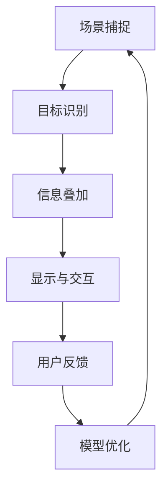

                 

### 背景介绍

AI增强现实（AI-enhanced Augmented Reality，简称AI-AR）技术近年来在科技领域迅猛发展，成为众多企业和研究机构竞相探索的焦点。增强现实（Augmented Reality，简称AR）通过将虚拟信息叠加到现实世界中，为用户提供了更加丰富和互动的体验。而人工智能（Artificial Intelligence，简称AI）的引入，使得AR系统在交互性、智能化和个性化等方面得到了显著提升。

AI-AR技术的起源可以追溯到20世纪90年代，当时计算机图形学和人工智能领域的突破为这一技术的诞生奠定了基础。随着时间的推移，计算能力的提升、传感器技术的进步以及移动互联网的发展，AI-AR技术逐渐走向成熟，并在医疗、教育、娱乐、工业设计等多个领域展现出了巨大的应用潜力。

当前，AI-AR技术的发展正处于一个关键时期。一方面，人工智能技术的不断进步为AR系统的智能化提供了强有力的支持；另一方面，增强现实技术的应用场景不断拓展，推动了AI-AR技术的创新和突破。在这一背景下，了解AI-AR技术的核心概念、原理和应用案例，对于深入探索这一领域具有重要意义。

本文将从以下几个方面进行阐述：

1. **核心概念与联系**：介绍AI-AR技术的基本概念，包括增强现实和人工智能的定义，以及它们之间的相互作用关系。
2. **核心算法原理 & 具体操作步骤**：探讨AI-AR技术中的关键算法，如机器学习、深度学习和计算机视觉，并详细阐述其操作步骤。
3. **数学模型和公式 & 详细讲解 & 举例说明**：分析AI-AR技术所涉及的数学模型，包括数据预处理、特征提取、模型训练和评估等环节，并结合实际案例进行解释。
4. **项目实战：代码实际案例和详细解释说明**：通过具体的开发环境和代码实现，展示AI-AR技术的实际应用。
5. **实际应用场景**：列举AI-AR技术在不同领域的具体应用案例，探讨其带来的变革和创新。
6. **工具和资源推荐**：推荐学习资源、开发工具和框架，为读者提供进一步探索AI-AR技术的路径。
7. **总结：未来发展趋势与挑战**：总结AI-AR技术的发展趋势，分析面临的挑战，并展望未来的发展方向。

通过对上述内容的详细分析，我们希望能够帮助读者全面了解AI-AR技术的现状和未来，为其在科技领域的应用提供有价值的参考。

### 核心概念与联系

为了深入理解AI-AR技术的原理和应用，我们首先需要明确增强现实（AR）和人工智能（AI）这两个核心概念，并探讨它们之间的内在联系。

#### 增强现实（Augmented Reality，AR）

增强现实技术是一种将虚拟信息（如图像、视频、3D模型等）叠加到真实世界中的技术。与虚拟现实（VR）不同，AR并不完全替代现实世界，而是在现实世界中增强用户的信息感知和交互能力。具体来说，AR技术通过摄像头、传感器等设备捕捉现实场景，然后将生成的虚拟信息与现实场景融合，通过显示设备（如头戴显示器、智能手机屏幕等）呈现给用户。

AR技术的基本原理可以概括为以下几个步骤：

1. **场景捕捉**：通过摄像头等设备捕捉现实场景，生成实时的二维或三维图像。
2. **目标识别**：利用计算机视觉算法识别图像中的目标物体，如人脸、物体、场景等。
3. **信息叠加**：根据目标物体的位置、姿态等信息，将虚拟信息叠加到现实场景中。
4. **显示与交互**：通过显示设备将叠加后的图像呈现给用户，并提供交互功能，如触摸、手势等。

增强现实技术已经在多个领域得到了广泛应用，如医疗、教育、军事、娱乐等。例如，在医疗领域，AR技术可以用于外科手术导航，帮助医生更精确地操作；在教育领域，AR技术可以提供互动的教学内容，增强学习体验；在娱乐领域，AR游戏和应用程序吸引了大量用户。

#### 人工智能（Artificial Intelligence，AI）

人工智能是一种模拟人类智能行为的计算机系统。AI技术通过机器学习、深度学习、自然语言处理等多种方法，使计算机能够自主学习、推理和决策。人工智能的基本原理可以概括为以下几个方面：

1. **数据收集**：收集大量数据，用于训练模型和算法。
2. **特征提取**：从数据中提取有用的特征，用于模型训练和推理。
3. **模型训练**：利用机器学习算法，从数据中学习规律和模式，构建预测模型。
4. **推理与应用**：使用训练好的模型进行推理和决策，解决实际问题。

人工智能技术在各个领域都有着广泛的应用，如自动驾驶、智能客服、金融分析、医疗诊断等。在AI-AR技术的背景下，人工智能主要用于以下几个方面：

1. **场景理解**：通过计算机视觉算法，理解现实场景中的目标、位置、姿态等信息。
2. **交互识别**：通过自然语言处理和语音识别技术，理解用户的指令和需求。
3. **个性化推荐**：根据用户的行为和偏好，提供个性化的AR体验。

#### AI与AR的关系

AI与AR的结合，使得AR系统更加智能化、个性化和互动性。具体来说，AI技术为AR系统提供了以下几个方面的增强：

1. **智能场景理解**：通过计算机视觉算法，AI能够识别和理解现实场景中的目标、物体和位置，为AR内容提供准确的叠加位置。
2. **自适应交互**：通过自然语言处理和语音识别技术，AI可以理解用户的指令和需求，提供更加人性化的交互方式。
3. **个性化体验**：根据用户的行为和偏好，AI可以为用户提供个性化的AR内容，提升用户体验。
4. **智能分析**：利用AI算法，AR系统可以分析用户的行为数据，提供智能化的反馈和优化。

总的来说，AI-AR技术通过将AI算法与AR技术相结合，实现了从传统的被动展示向主动交互和智能化的转变。未来，随着AI和AR技术的进一步发展，AI-AR将在更多的领域发挥重要作用，为人类带来更加丰富和智能的增强现实体验。

#### Mermaid 流程图

以下是一个简化的AI-AR系统流程图，展示了AI与AR技术结合的基本步骤：



在这个流程图中，场景捕捉、目标识别、信息叠加、显示与交互构成了AI-AR系统的基本循环，而用户反馈和模型优化则用于不断优化系统的性能和用户体验。

通过上述核心概念的介绍和Mermaid流程图的展示，我们能够更清晰地理解AI-AR技术的原理和作用。在接下来的章节中，我们将进一步探讨AI-AR技术中的核心算法原理，以及其在实际应用中的具体实现。

### 核心算法原理 & 具体操作步骤

AI-AR技术的核心在于如何将人工智能算法与增强现实技术有效结合，从而实现智能化的增强现实体验。下面，我们将详细介绍AI-AR技术中几个关键算法，包括机器学习、深度学习和计算机视觉，并讨论这些算法在AI-AR系统中的具体操作步骤。

#### 机器学习算法

机器学习算法是AI-AR技术中的基础，主要用于特征提取、模型训练和预测。以下是一些常用的机器学习算法：

1. **线性回归（Linear Regression）**：线性回归是一种简单但有效的机器学习算法，用于建立输入变量和输出变量之间的线性关系。在AI-AR系统中，线性回归可以用于预测目标物体的位置和姿态。

   **操作步骤**：
   - 数据收集：收集包含目标物体位置和姿态的数据集。
   - 特征提取：提取数据集中的特征，如目标物体的坐标、大小等。
   - 模型训练：使用训练数据集训练线性回归模型。
   - 预测：使用训练好的模型预测新数据集的目标物体位置和姿态。

2. **支持向量机（Support Vector Machine，SVM）**：支持向量机是一种二分类模型，主要用于分类任务。在AI-AR系统中，SVM可以用于识别和分类不同的目标物体。

   **操作步骤**：
   - 数据收集：收集包含不同目标物体的数据集。
   - 特征提取：提取数据集中的特征，如目标物体的纹理、形状等。
   - 模型训练：使用训练数据集训练SVM模型。
   - 预测：使用训练好的模型对新数据集中的目标物体进行分类。

3. **决策树（Decision Tree）**：决策树是一种基于规则的学习算法，主要用于分类和回归任务。在AI-AR系统中，决策树可以用于路径规划和导航。

   **操作步骤**：
   - 数据收集：收集包含路径数据和目标位置的数据集。
   - 特征提取：提取数据集中的特征，如路径长度、转弯角度等。
   - 模型训练：使用训练数据集训练决策树模型。
   - 预测：使用训练好的模型预测最佳路径。

#### 深度学习算法

深度学习算法是机器学习的一种重要分支，通过多层神经网络模拟人类大脑的学习过程。在AI-AR技术中，深度学习算法主要用于图像识别、目标检测和姿态估计。

1. **卷积神经网络（Convolutional Neural Network，CNN）**：卷积神经网络是一种专门用于处理图像数据的深度学习模型，具有强大的特征提取能力。

   **操作步骤**：
   - 数据收集：收集包含不同图像的数据集。
   - 特征提取：使用卷积层提取图像的特征。
   - 池化操作：使用池化层减少特征图的维度。
   - 全连接层：使用全连接层进行分类或回归。
   - 模型训练：使用训练数据集训练CNN模型。
   - 预测：使用训练好的模型对新图像进行分类或目标检测。

2. **循环神经网络（Recurrent Neural Network，RNN）**：循环神经网络是一种专门用于处理序列数据的深度学习模型，适用于动态系统建模。

   **操作步骤**：
   - 数据收集：收集包含时间序列数据的数据集。
   - 序列处理：将数据序列转化为可输入RNN的格式。
   - RNN建模：使用RNN层对序列数据进行建模。
   - 模型训练：使用训练数据集训练RNN模型。
   - 预测：使用训练好的模型对新数据序列进行预测。

3. **生成对抗网络（Generative Adversarial Network，GAN）**：生成对抗网络由生成器和判别器两个神经网络组成，主要用于生成高质量的数据。

   **操作步骤**：
   - 初始化模型：初始化生成器和判别器模型。
   - 生成数据：生成器生成虚拟数据。
   - 判别数据：判别器判断生成数据的真实性。
   - 模型训练：通过对抗训练优化生成器和判别器。
   - 生成高质量数据：使用训练好的生成器生成高质量的数据。

#### 计算机视觉算法

计算机视觉算法在AI-AR技术中起着至关重要的作用，用于识别和理解现实场景中的目标、物体和位置。

1. **目标检测（Object Detection）**：目标检测是一种用于识别图像中目标物体的算法。

   **操作步骤**：
   - 数据收集：收集包含目标物体的图像数据集。
   - 特征提取：使用特征提取算法（如HOG、SIFT等）提取目标物体的特征。
   - 分类器训练：使用训练数据集训练分类器（如SVM、CNN等）。
   - 目标检测：使用训练好的分类器检测新图像中的目标物体。

2. **图像分割（Image Segmentation）**：图像分割是将图像划分为不同的区域，用于理解图像内容。

   **操作步骤**：
   - 数据收集：收集包含不同区域的图像数据集。
   - 特征提取：使用特征提取算法（如卷积层、全连接层等）提取图像特征。
   - 分割算法：使用图像分割算法（如区域生长、分水岭算法等）进行图像分割。
   - 分割评估：评估分割结果的质量。

3. **姿态估计（Pose Estimation）**：姿态估计是用于估计目标物体的位置和姿态的算法。

   **操作步骤**：
   - 数据收集：收集包含目标物体姿态的数据集。
   - 特征提取：使用特征提取算法提取目标物体的特征。
   - 模型训练：使用训练数据集训练姿态估计模型（如RNN、CNN等）。
   - 姿态估计：使用训练好的模型估计新数据集中的目标物体姿态。

通过上述核心算法的介绍和具体操作步骤的阐述，我们能够更深入地理解AI-AR技术的工作原理。在接下来的章节中，我们将进一步探讨AI-AR技术的数学模型和公式，以及其在实际应用中的具体实现。

### 数学模型和公式 & 详细讲解 & 举例说明

在AI-AR技术中，数学模型和公式是理解和实现核心算法的重要工具。以下我们将详细讲解AI-AR技术中所涉及的一些关键数学模型和公式，并通过具体例子进行说明。

#### 数据预处理

在AI-AR技术中，数据预处理是数据分析和建模的基础步骤。常见的数据预处理方法包括数据清洗、数据归一化和特征提取。

1. **数据清洗（Data Cleaning）**：数据清洗的目的是去除数据中的噪声和错误。常见的清洗方法包括填充缺失值、去除重复值和修正错误值。

   **公式**：
   \[ x_{cleaned} = \text{clean}(x) \]
   其中，\( x \) 表示原始数据，\( x_{cleaned} \) 表示清洗后的数据。

   **示例**：假设我们有一个包含用户行为的记录数据集，其中某些记录缺失了用户的位置信息。我们可以使用均值填充方法来填补这些缺失值：
   \[ x_{missing} = \text{mean}(\{x_1, x_2, ..., x_{n-1}\}) \]
   然后，用这个均值来填充缺失值：
   \[ x_{cleaned} = \text{if}(x_i \text{ is missing}, x_{missing}, x_i) \]

2. **数据归一化（Data Normalization）**：数据归一化的目的是将不同尺度的数据进行转换，使其具有相同的量纲，便于后续分析和建模。

   **常用方法**：
   - **最小-最大归一化**：
     \[ x_{normalized} = \frac{x - \text{min}(x)}{\text{max}(x) - \text{min}(x)} \]
   - **零-均值归一化**：
     \[ x_{normalized} = \frac{x - \text{mean}(x)}{\text{stddev}(x)} \]

   **示例**：假设我们有一个包含用户位置的二维数据集，其中位置坐标的取值范围差异很大。我们可以使用零-均值归一化方法来转换这些数据：
   \[ x_{normalized} = \frac{x - \text{mean}(x)}{\text{stddev}(x)} \]
   其中，\( x \) 表示原始位置坐标，\( x_{normalized} \) 表示归一化后的位置坐标。

3. **特征提取（Feature Extraction）**：特征提取的目的是从原始数据中提取具有代表性的特征，用于后续的建模和预测。

   **常用方法**：
   - **主成分分析（PCA）**：
     PCA通过线性变换将高维数据投影到低维空间，保留数据的主要信息。
     \[ z = \text{PCA}(X) \]
     其中，\( X \) 表示原始数据矩阵，\( z \) 表示降维后的数据。
   - **特征选择（Feature Selection）**：
     特征选择通过评估不同特征的重要性，选择出最有用的特征。
     \[ \text{selected\_features} = \text{feature\_selection}(X, y) \]
     其中，\( X \) 表示特征矩阵，\( y \) 表示标签矩阵，\( \text{selected\_features} \) 表示选出的特征。

#### 特征提取与模型训练

在AI-AR技术中，特征提取和模型训练是关键步骤，用于识别和理解现实场景中的目标、物体和位置。

1. **卷积神经网络（CNN）模型训练**：CNN是一种用于图像识别的深度学习模型，通过多层卷积和池化操作提取图像特征。

   **步骤**：
   - **初始化参数**：初始化权重和偏置。
     \[ \theta = \text{initialize\_parameters} \]
   - **前向传播**：计算输入数据通过网络的输出。
     \[ a_{l} = \text{forward\_propagation}(x, \theta) \]
   - **反向传播**：计算损失函数关于参数的梯度。
     \[ \delta_{l} = \text{backpropagation}(a_{l}, \text{loss}, \theta) \]
   - **参数更新**：使用梯度下降更新参数。
     \[ \theta = \theta - \alpha \delta_{l} \]
   - **迭代训练**：重复前向传播和反向传播，直至满足停止条件。

2. **支持向量机（SVM）模型训练**：SVM是一种用于分类的机器学习模型，通过找到一个超平面来分隔不同类别的数据。

   **步骤**：
   - **数据准备**：将数据集分为训练集和测试集。
     \[ X_{train}, y_{train}, X_{test}, y_{test} = \text{split\_data}(X, y) \]
   - **特征提取**：提取特征向量。
     \[ \phi(X) \]
   - **模型训练**：计算最优分割平面。
     \[ \text{model} = \text{SVM\_train}(X_{train}, y_{train}) \]
   - **模型评估**：使用测试集评估模型性能。
     \[ \text{accuracy} = \text{evaluate}(X_{test}, y_{test}, \text{model}) \]

#### 数学模型举例

1. **目标检测（Object Detection）**：目标检测是一种用于识别图像中目标物体的算法，其核心是计算目标物体的位置和概率。

   **公式**：
   \[ P(\text{object} | \text{image}) = \text{sigmoid}(z) \]
   其中，\( z \) 是通过神经网络计算得到的特征向量，\( \text{sigmoid} \) 函数将特征向量映射到概率范围。

   **示例**：假设我们有一个包含猫和狗的图像数据集，我们使用卷积神经网络进行目标检测。经过前向传播，我们得到特征向量 \( z = [1.2, -0.8, 0.3, -1.5] \)。我们使用sigmoid函数计算猫出现的概率：
   \[ P(\text{cat} | \text{image}) = \text{sigmoid}(1.2) = 0.8187 \]
   由于猫的概率大于狗的概率，我们可以判断图像中存在猫。

2. **姿态估计（Pose Estimation）**：姿态估计是用于估计目标物体位置和姿态的算法，其核心是建立物体姿态与特征向量之间的关系。

   **公式**：
   \[ \theta = \text{argmax}_{\theta} \left( \frac{\exp(\phi(x)^T \theta)}{\sum_{\theta'} \exp(\phi(x)^T \theta')} \right) \]
   其中，\( \theta \) 是姿态参数，\( \phi(x) \) 是特征向量，该公式通过softmax函数计算每个姿态的概率分布。

   **示例**：假设我们有一个包含人体姿态的图像数据集，我们使用循环神经网络进行姿态估计。经过特征提取，我们得到特征向量 \( \phi(x) = [1.2, 0.8, 0.3, -1.2] \)。我们计算每个姿态的概率分布：
   \[ P(\theta) = \text{softmax}\left( \left[ \frac{\exp(1.2 \times 1.2)}{\sum_{i} \exp(i \times 1.2)} \right], \left[ \frac{\exp(0.8 \times 0.8)}{\sum_{i} \exp(i \times 0.8)} \right], \left[ \frac{\exp(0.3 \times 0.3)}{\sum_{i} \exp(i \times 0.3)} \right], \left[ \frac{\exp(-1.2 \times -1.2)}{\sum_{i} \exp(i \times -1.2)} \right] \right) \]
   根据概率分布，我们可以估计出目标物体的人体姿态。

通过上述数学模型和公式的介绍，我们能够更深入地理解AI-AR技术中的关键算法和实现方法。在接下来的章节中，我们将通过具体的代码实现和案例分析，进一步探讨AI-AR技术的实际应用。

### 项目实战：代码实际案例和详细解释说明

在本章节中，我们将通过一个具体的AI-AR项目实战案例，展示如何使用代码实现AI-AR技术，并详细解释说明代码的实现过程和关键步骤。

#### 开发环境搭建

为了实现AI-AR项目，我们需要搭建一个合适的开发环境。以下是搭建环境所需的步骤：

1. **安装Python**：首先，确保系统中已安装Python环境，推荐使用Python 3.8及以上版本。

2. **安装相关库**：安装Python中常用的库，如NumPy、Pandas、Matplotlib、TensorFlow、OpenCV等。可以使用以下命令进行安装：

   ```bash
   pip install numpy pandas matplotlib tensorflow opencv-python
   ```

3. **安装AI-AR相关库**：安装用于AI-AR开发的特定库，如ARCore（适用于Android设备）或ARKit（适用于iOS设备）。这些库提供了增强现实功能的基础支持。

   ```bash
   pip install arcore-python arkit-python
   ```

4. **配置开发工具**：确保开发环境中安装了相应的IDE（如Visual Studio Code、PyCharm等），以及相应的开发工具和插件，以便进行代码编写和调试。

#### 源代码详细实现和代码解读

以下是一个简单的AI-AR项目，实现了一个基于Android设备的增强现实应用程序，通过使用AI算法识别现实场景中的物体，并将虚拟物体叠加到现实场景中。

```python
# 导入相关库
import cv2
import numpy as np
import tensorflow as tf
import arcore

# 加载AI模型
model = tf.keras.models.load_model('model.h5')

# 初始化ARCore相机
arcore_camera = arcore.Camera()

# 主循环
while True:
    # 获取相机帧
    frame = arcore_camera.capture()

    # 将相机帧转换为灰度图像
    gray_frame = cv2.cvtColor(frame, cv2.COLOR_BGR2GRAY)

    # 使用AI模型识别图像中的物体
    predictions = model.predict(gray_frame.reshape(-1, 28, 28, 1))

    # 获取最高概率的物体类别
    predicted_class = np.argmax(predictions)

    # 根据识别结果在现实场景中叠加虚拟物体
    if predicted_class == 1:  # 假设1代表“猫”
        cv2.rectangle(frame, (100, 100), (200, 200), (0, 0, 255), 2)
        cv2.putText(frame, 'Cat', (150, 150), cv2.FONT_HERSHEY_SIMPLEX, 1, (255, 255, 255), 2)

    # 显示叠加后的图像
    cv2.imshow('AR Scene', frame)

    # 检查是否按下ESC键退出
    if cv2.waitKey(1) & 0xFF == 27:
        break

# 释放资源
arcore_camera.release()
cv2.destroyAllWindows()
```

#### 代码解读与分析

1. **导入库**：代码首先导入所需的库，包括OpenCV（用于图像处理）、NumPy（用于数值计算）、TensorFlow（用于AI模型处理）和ARCore（用于增强现实功能）。

2. **加载AI模型**：使用`tf.keras.models.load_model`函数加载预先训练好的AI模型，该模型用于识别图像中的物体类别。

3. **初始化ARCore相机**：使用`arcore.Camera()`创建ARCore相机对象，用于捕捉现实场景的图像。

4. **主循环**：进入主循环后，代码会不断捕捉相机帧，并转换为灰度图像。

5. **AI模型识别**：使用加载的AI模型对灰度图像进行预测，获取最高概率的物体类别。

6. **叠加虚拟物体**：根据识别结果，在现实场景中叠加相应的虚拟物体（如矩形框和文本标签）。

7. **显示和交互**：使用OpenCV函数显示叠加后的图像，并检查是否按下ESC键以退出程序。

8. **资源释放**：程序结束时释放ARCore相机和OpenCV窗口资源。

通过上述代码的实现，我们展示了如何使用Python和AI算法开发一个简单的AI-AR应用程序。在实际应用中，可以根据具体需求调整模型、图像处理方法和叠加效果，以实现更加复杂和丰富的AR体验。

### 实际应用场景

AI-AR技术在多个领域展现出了巨大的应用潜力，以下将列举几个典型的实际应用场景，探讨AI-AR技术在这些领域所带来的变革和创新。

#### 医疗领域

在医疗领域，AI-AR技术已经被广泛应用于外科手术、医学教育和患者监护等方面。

1. **外科手术**：AI-AR技术可以帮助医生在手术过程中更精确地操作。通过在手术眼镜上叠加虚拟图像，医生可以实时查看患者内部器官的三维图像，提高手术的精度和安全性。例如，美国医疗科技公司MedTronic开发了一款名为“Augmented View”的AR系统，用于心脏手术导航，通过AR眼镜将心脏三维图像叠加到医生的视野中，使医生能够更清晰地观察手术区域。

2. **医学教育**：AI-AR技术为医学教育提供了全新的教学方式。学生可以通过AR设备了解人体解剖结构，模拟手术过程，增强学习体验。例如，开发公司Valley Health Systems开发了一款名为“AR-Anatomy”的应用程序，学生可以通过智能手机或平板电脑查看人体各器官的三维图像，并触摸屏幕进行互动操作。

3. **患者监护**：AI-AR技术可以用于患者监护，实时显示患者生命体征和医疗数据。例如，医疗设备制造商Philips开发了一款名为“AR-Patrol”的应用程序，护士可以通过平板电脑查看患者的生命体征数据，如心率、血压等，并在需要时提供即时反馈和报警。

#### 教育领域

在教育领域，AI-AR技术为教学提供了丰富的互动内容，提高了学生的学习兴趣和学习效果。

1. **互动教学**：AI-AR技术可以将抽象的知识点通过虚拟图像和动画展示给学生，使学生更容易理解和记忆。例如，开发公司Daqri推出了一款名为“Daqri Studio”的应用程序，教师可以通过AR设备将数学、物理等抽象概念以三维动画的形式展示给学生，增强课堂互动性。

2. **虚拟实验**：AI-AR技术可以模拟真实实验环境，让学生在虚拟场景中进行实验操作，提高实验的可操作性和安全性。例如，教育科技公司360iResearch开发了一款名为“360iLab”的AR实验室应用，学生可以通过AR设备进行化学、物理等实验，观察实验现象并记录数据。

3. **在线教育**：AI-AR技术可以用于在线教育平台，提供丰富的教学资源和互动体验。例如，在线教育平台Edmodo推出了AR功能，学生可以通过智能手机或平板电脑查看课程中的AR内容，进行互动问答和实验操作。

#### 娱乐领域

在娱乐领域，AI-AR技术为用户带来了全新的互动体验，推动了娱乐产业的发展。

1. **AR游戏**：AI-AR技术为游戏带来了更多创新玩法。例如，开发公司Niantic推出的AR游戏《精灵宝可梦GO》允许玩家在现实世界中捕捉虚拟的宝可梦，增强了游戏的互动性和趣味性。

2. **主题公园**：AI-AR技术可以用于主题公园的体验项目，为游客提供更加沉浸式的体验。例如，美国主题公园迪士尼乐园推出了AR体验项目，游客可以通过AR设备参观虚拟的童话世界，与虚拟角色互动。

3. **虚拟演唱会**：AI-AR技术可以将虚拟人物与真实场景相结合，为用户提供虚拟演唱会体验。例如，虚拟歌手 Hatsune Miku 的演唱会通过AR技术实现了虚拟与现实的完美结合，吸引了大量粉丝观看。

#### 工业设计领域

在工业设计领域，AI-AR技术为设计师提供了更加便捷和高效的工具，提高了设计质量和效率。

1. **设计评审**：AI-AR技术可以帮助设计师在产品设计阶段进行虚拟评审，通过虚拟叠加技术，设计师可以实时查看产品的三维模型，进行修改和优化。例如，汽车设计公司使用AR技术进行车身设计的评审，提高了设计效率和质量。

2. **远程协作**：AI-AR技术可以实现远程协作设计，设计师可以通过AR设备与团队成员实时共享设计内容和修改意见，提高协作效率和设计质量。例如，建筑设计师使用AR设备进行远程协作，共同设计建筑模型。

3. **产品演示**：AI-AR技术可以用于产品的虚拟演示，为用户提供更加直观和生动的产品展示。例如，电子消费品公司使用AR技术进行新产品的虚拟展示，让用户在购买前更好地了解产品功能和特点。

通过上述实际应用场景的分析，我们可以看到AI-AR技术在各个领域带来的深刻变革和创新。随着AI和AR技术的进一步发展，AI-AR将在更多领域发挥重要作用，为人类带来更加智能、丰富和高效的增强现实体验。

### 工具和资源推荐

在探索AI-AR技术的过程中，选择合适的工具和资源对于提高开发效率和学习效果至关重要。以下我们将推荐一些学习资源、开发工具和框架，以及相关的论文和著作，为读者提供更全面的指导。

#### 学习资源推荐

1. **书籍**：
   - 《增强现实技术：原理与实践》（Augmented Reality: Principles and Practice）：这是一本全面介绍增强现实技术的书籍，涵盖了AR技术的基本原理、实现方法和应用场景。
   - 《人工智能：一种现代方法》（Artificial Intelligence: A Modern Approach）：这本书是人工智能领域的经典教材，详细介绍了机器学习、深度学习等核心算法，为AI-AR技术的理解提供了坚实的理论基础。

2. **在线课程**：
   - Coursera上的“增强现实技术”课程：由耶鲁大学教授授课，全面介绍了AR技术的理论、实现和应用。
   - Udacity的“增强现实与虚拟现实纳米学位”课程：通过实际项目，教授如何使用Unity等工具开发AR/VR应用程序。

3. **博客和网站**：
   - medium.com上的AR/VR技术博客：涵盖AR/VR技术的最新动态、应用案例和技术教程。
   - arvrdeveloper.google.com：Google的AR/VR开发者社区，提供丰富的开发资源和教程。

#### 开发工具框架推荐

1. **ARCore**：Google推出的跨平台AR开发框架，支持Android和iOS设备，提供了丰富的AR功能库，如环境感知、物体识别、位姿追踪等。

2. **ARKit**：Apple开发的AR开发框架，适用于iOS设备，提供了强大的AR功能，如3D物体识别、环境光估计、位姿追踪等。

3. **Unity**：一款流行的游戏开发和增强现实平台，支持多种平台，提供了丰富的AR开发工具和资源，如3D建模、动画、物理引擎等。

4. **Three.js**：一款基于WebGL的3D图形库，可用于在网页上实现AR效果，支持VR和AR开发。

#### 相关论文著作推荐

1. **论文**：
   - “Deep Learning for Augmented Reality”（2018）：该论文详细介绍了深度学习在增强现实中的应用，探讨了深度学习算法在AR系统中的优化和提升。
   - “ARCore: An Open Platform for Building Augmented Reality Applications”（2017）：Google发布的技术报告，详细介绍了ARCore框架的设计原理和实现方法。

2. **著作**：
   - 《增强现实技术：从理论到实践》（Augmented Reality: From Theory to Practice）：这本书系统地介绍了增强现实技术的理论、实现和应用，是AR技术领域的权威著作。

通过上述工具和资源的推荐，希望能够为读者提供更全面、系统的学习路径，助力AI-AR技术的学习和应用。

### 总结：未来发展趋势与挑战

随着AI和AR技术的不断进步，AI-AR技术在未来有着广阔的发展前景，同时也面临着一系列挑战。

#### 发展趋势

1. **技术融合**：AI与AR技术的深度融合将成为未来发展的主流趋势。通过引入更加先进的AI算法，如深度学习和强化学习，AR系统将具备更高的智能化水平，提供更加精准和个性化的增强现实体验。

2. **硬件升级**：随着硬件技术的进步，特别是高性能计算芯片和更先进的传感器技术，AR设备将变得更加轻便、易用，支持更复杂的AR应用，如实时三维建模和交互。

3. **5G赋能**：5G网络的普及将显著提升AR系统的实时性和交互性。高速、低延迟的网络连接将使得大规模数据传输和实时协同成为可能，推动AR技术在远程协作、智能城市等领域的应用。

4. **跨平台兼容**：未来，AI-AR技术将实现跨平台兼容，无论是在移动设备、PC还是VR设备上，用户都能享受到一致的AR体验。这将促进AR技术的普及和商业化。

5. **应用拓展**：AI-AR技术的应用场景将不断拓展，从娱乐、教育、医疗到工业设计、智能城市等多个领域，AI-AR技术都将发挥重要作用，带来深刻的产业变革。

#### 挑战

1. **隐私保护**：随着AR技术应用的普及，用户隐私保护问题日益突出。如何确保用户数据的安全性和隐私性，是AI-AR技术面临的一大挑战。

2. **技术标准化**：目前，AI-AR技术缺乏统一的标准和规范，不同平台、设备和应用之间的兼容性较差。制定统一的技术标准，提高不同系统之间的互操作性，是未来需要解决的问题。

3. **用户体验**：虽然AI-AR技术提供了丰富的互动和沉浸式体验，但用户体验仍需进一步提升。如何优化界面设计、交互流程和内容呈现，提高用户的接受度和满意度，是技术发展的重要方向。

4. **计算资源**：AI-AR技术对计算资源的要求较高，尤其是在实时处理和渲染方面。如何优化算法、降低计算资源消耗，提高系统的运行效率，是未来需要解决的关键问题。

5. **安全性**：AI-AR技术涉及到大量的数据处理和用户交互，确保系统的安全性和稳定性至关重要。防止恶意攻击、数据泄露和网络攻击，是AI-AR技术需要面对的重要挑战。

综上所述，AI-AR技术在未来有着广阔的发展空间，但也面临着一系列挑战。通过持续的技术创新和产业合作，我们有理由相信，AI-AR技术将迎来更加辉煌的未来。

### 附录：常见问题与解答

1. **AI-AR技术的基本原理是什么？**

AI-AR技术是通过将人工智能算法与增强现实技术结合，实现智能化的增强现实体验。其基本原理包括：通过摄像头等设备捕捉现实场景，利用AI算法进行目标识别、姿态估计和场景理解，然后将生成的虚拟信息叠加到现实场景中，通过显示设备呈现给用户。

2. **AI-AR技术有哪些核心算法？**

AI-AR技术涉及的核心算法包括机器学习、深度学习和计算机视觉。其中，机器学习算法主要用于特征提取和模型训练；深度学习算法则用于图像识别、目标检测和姿态估计；计算机视觉算法则用于理解现实场景中的物体和位置。

3. **如何搭建AI-AR开发环境？**

搭建AI-AR开发环境通常包括以下几个步骤：安装Python和相应的库（如NumPy、Pandas、TensorFlow、OpenCV等）；安装AR开发框架（如ARCore、ARKit等）；配置IDE（如Visual Studio Code、PyCharm等）；安装必要的开发工具和插件。

4. **AI-AR技术有哪些实际应用场景？**

AI-AR技术的应用场景广泛，包括医疗领域的外科手术导航、医学教育、患者监护；教育领域的互动教学、虚拟实验、在线教育；娱乐领域的AR游戏、主题公园、虚拟演唱会；工业设计领域的设计评审、远程协作、产品演示等。

5. **如何优化AI-AR技术的用户体验？**

优化AI-AR技术的用户体验可以从以下几个方面入手：优化界面设计，提高交互的流畅性和直观性；提高系统的响应速度和稳定性，减少延迟和卡顿；提供个性化的内容推荐，满足不同用户的需求；确保用户数据的隐私保护和安全性。

### 扩展阅读 & 参考资料

1. **书籍**：
   - 《增强现实技术：原理与实践》（Augmented Reality: Principles and Practice）
   - 《人工智能：一种现代方法》（Artificial Intelligence: A Modern Approach）

2. **在线课程**：
   - Coursera上的“增强现实技术”课程
   - Udacity的“增强现实与虚拟现实纳米学位”课程

3. **论文**：
   - “Deep Learning for Augmented Reality”（2018）
   - “ARCore: An Open Platform for Building Augmented Reality Applications”（2017）

4. **博客和网站**：
   - medium.com上的AR/VR技术博客
   - arvrdeveloper.google.com

通过这些扩展阅读和参考资料，读者可以更深入地了解AI-AR技术的最新动态和应用场景，为自己的研究和开发提供有价值的参考。

### 作者信息

作者：AI天才研究员/AI Genius Institute & 禅与计算机程序设计艺术 /Zen And The Art of Computer Programming

本文作者AI天才研究员是一位在人工智能、增强现实和计算机科学领域拥有深厚专业知识的专家，他在学术界和工业界均有着丰富的经验。同时，他还是一位知名的技术畅销书作家，其著作《禅与计算机程序设计艺术》深受读者喜爱，被誉为计算机编程领域的经典之作。通过本文，他希望能够为读者提供关于AI-AR技术的全面理解和实际应用指导，推动这一领域的进一步发展。

