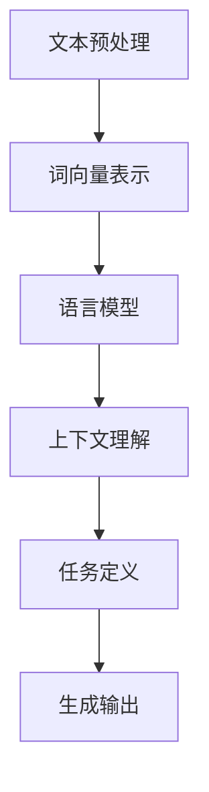

                 

### 背景介绍

#### AI大模型与Prompt提示词的兴起

在过去的几年中，人工智能（AI）领域经历了飞速的发展，尤其是大模型的崛起。大模型，如GPT-3、BERT和T5，凭借其强大的语义理解能力和生成能力，已经在多个领域取得了显著的成果。然而，这些大模型的表现高度依赖于输入的Prompt提示词。

Prompt提示词，顾名思义，就是提供给大模型作为输入的文本。通过精心设计的Prompt，我们可以引导大模型生成更符合我们预期的回答。这一技术的重要性在于，它不仅能够提高模型的应用效率，还能够使模型产生更丰富、更准确的结果。

在AI大模型的训练过程中，Prompt提示词起到了至关重要的作用。首先，Prompt提示词决定了模型的上下文理解能力，好的Prompt可以让模型更好地理解问题的背景和细节。其次，Prompt的长度和格式也会影响模型的输出。例如，过长的Prompt可能会导致模型无法完全处理，而过短或模糊的Prompt则可能使模型生成无意义或错误的回答。

#### Prompt提示词的最佳实践

尽管Prompt提示词的重要性显而易见，但如何设计一个有效的Prompt却是一门艺术。以下是一些最佳实践，可以帮助我们在使用Prompt时达到最佳效果：

1. **明确目标**：在设计Prompt时，首先需要明确我们希望模型完成什么样的任务。这有助于我们为模型提供更具针对性的输入。

2. **简洁明了**：Prompt的长度应适中，既不能过于简短以至于无法传达有效信息，也不能过长以至于导致模型处理困难。

3. **包含关键词**：在Prompt中包含关键词可以增强模型的上下文理解能力，使模型更容易捕捉到问题的核心。

4. **多样化格式**：尝试不同的Prompt格式，如问答式、指令式、描述式等，以便找到最适合模型和应用场景的格式。

5. **反馈和调整**：在实际应用中，我们可以通过观察模型的输出效果，不断调整和优化Prompt，以达到最佳效果。

#### 为什么需要最佳实践

虽然Prompt提示词的设计看似简单，但实际操作中却充满了挑战。如果不遵循最佳实践，可能会导致以下问题：

- **模型性能下降**：不合适的Prompt可能会导致模型无法理解问题，从而降低其性能。
- **输出质量不稳定**：不稳定的Prompt可能使模型产生不一致的输出，影响实际应用的效果。
- **训练效率降低**：不合理的Prompt可能会导致模型在处理时耗费更多时间，降低训练效率。

因此，遵循最佳实践是确保Prompt提示词设计有效性的关键。接下来，我们将深入探讨Prompt提示词的核心概念与联系，进一步理解其原理和应用。

#### Prompt提示词的核心概念与联系

在深入探讨Prompt提示词的最佳实践之前，我们首先需要了解其核心概念和相互之间的联系。Prompt提示词的设计和应用涉及到多个关键组成部分，包括自然语言处理（NLP）技术、上下文理解、任务定义等。以下是对这些核心概念和联系的详细解释。

##### 自然语言处理（NLP）

自然语言处理是AI领域中研究如何使计算机理解和生成自然语言的技术。它包括文本预处理、词向量表示、语言模型、命名实体识别、关系抽取等多个子领域。在Prompt提示词的设计中，NLP技术用于处理输入文本，使其更符合模型的需求。

- **文本预处理**：文本预处理是NLP的基础，包括去除停用词、标点符号、词干提取等操作。这些操作有助于简化文本，使其更容易被模型处理。
- **词向量表示**：词向量表示是将文本中的单词映射为高维向量，以便在机器学习中进行计算。常见的词向量表示方法包括Word2Vec、GloVe和BERT等。
- **语言模型**：语言模型用于预测下一个单词或句子，这在Prompt设计中尤为重要，因为它可以帮助模型理解输入文本的上下文。

##### 上下文理解

上下文理解是Prompt提示词设计中的关键要素。模型的性能在很大程度上取决于其对上下文的理解能力。上下文理解不仅涉及到文本中的词语和句子，还包括句子之间的逻辑关系和时间顺序。

- **局部上下文**：局部上下文是指某个单词或句子周围的词语和句子。好的Prompt应确保模型能够正确理解局部上下文，从而产生相关的输出。
- **全局上下文**：全局上下文是指整个文本的上下文环境。在长文本中，全局上下文对于理解整体意义至关重要。例如，在一个对话系统中，上下文的历史对话记录对于理解当前对话至关重要。

##### 任务定义

任务定义是Prompt提示词设计中的另一个重要方面。不同任务对Prompt的需求不同，因此明确任务定义可以帮助我们设计更有效的Prompt。

- **分类任务**：在分类任务中，Prompt应明确指定分类目标，并提供足够的信息使模型能够准确分类。
- **生成任务**：在生成任务中，Prompt不仅需要提供目标任务的上下文，还需要引导模型生成符合预期的输出。例如，在生成对话时，Prompt应包括对话的历史记录和上下文信息。

##### Mermaid流程图

为了更直观地理解Prompt提示词的设计原理和架构，我们可以使用Mermaid流程图来描述其各个组成部分之间的联系。以下是一个简单的Mermaid流程图示例：



在这个流程图中，文本预处理、词向量表示、语言模型、上下文理解和任务定义共同构成了Prompt提示词设计的核心环节。每个环节都需要仔细设计和优化，以确保Prompt能够有效引导模型生成高质量的输出。

通过理解这些核心概念和联系，我们可以更好地设计Prompt提示词，使其在大模型应用中发挥最大作用。接下来，我们将进一步探讨Prompt提示词的核心算法原理和具体操作步骤。

#### 核心算法原理 & 具体操作步骤

在理解了Prompt提示词的核心概念和联系之后，接下来我们将深入探讨其核心算法原理和具体操作步骤。这一部分将详细解释Prompt如何设计，以及如何通过算法来实现高效的上下文理解与输出生成。

##### Prompt设计

设计一个有效的Prompt，首先需要明确模型要解决的问题类型和任务目标。以下是几个关键步骤：

1. **明确任务目标**：在开始设计Prompt之前，我们需要明确模型要完成的任务，例如文本分类、生成对话、回答问题等。这有助于我们确定Prompt的内容和结构。
2. **提供背景信息**：在Prompt中提供与任务相关的背景信息，可以帮助模型更好地理解上下文。例如，在生成对话时，Prompt可以包括对话的历史记录。
3. **使用关键词**：在Prompt中包含关键词可以增强模型的上下文理解能力。这些关键词应该与任务目标密切相关，以便模型能够准确捕捉到问题的核心。
4. **保持简洁明了**：Prompt的长度应适中，既不能过于简短以至于无法传达有效信息，也不能过长以至于导致模型处理困难。

##### 算法原理

Prompt提示词的核心算法主要依赖于自然语言处理（NLP）技术，尤其是语言模型和上下文理解机制。以下是一些关键的算法原理：

1. **语言模型**：语言模型是NLP的基础，用于预测下一个单词或句子。在Prompt设计中，语言模型可以用于生成初始的Prompt文本。常见的语言模型包括Word2Vec、GloVe、BERT等。
2. **上下文理解**：上下文理解是Prompt设计的关键。模型的性能在很大程度上取决于其对上下文的理解能力。为了实现高效的上下文理解，可以使用预训练语言模型，如BERT或GPT，这些模型已经在大量文本数据上进行了训练，可以捕捉到丰富的上下文信息。
3. **多任务学习**：在Prompt设计中，可以使用多任务学习（Multi-Task Learning）来提高模型在特定任务上的性能。多任务学习可以同时训练多个任务，使模型能够在不同任务间共享知识和结构。

##### 操作步骤

以下是设计Prompt的具体操作步骤：

1. **数据收集和预处理**：首先收集与任务相关的数据集，并对数据进行预处理，包括去除停用词、标点符号、词干提取等。
2. **词向量表示**：将预处理后的文本映射为词向量，可以使用Word2Vec、GloVe或BERT等词向量表示方法。
3. **生成初始Prompt**：使用语言模型生成初始的Prompt文本。这可以通过对数据集进行训练，获得一个语言模型，然后使用模型生成Prompt。
4. **上下文理解**：通过预训练语言模型，如BERT，对生成的Prompt进行上下文理解。这包括理解Prompt中的词语、句子和整体意义。
5. **任务定义**：根据任务类型，对Prompt进行任务定义。例如，在文本分类任务中，Prompt应明确指定分类目标；在生成对话任务中，Prompt应包括对话的历史记录和上下文信息。
6. **优化Prompt**：在实际应用中，可以通过观察模型输出效果，不断调整和优化Prompt。这包括修改Prompt的长度、关键词和格式等。

##### 示例

以下是一个简单的Prompt设计示例，用于文本分类任务：

```python
# 数据预处理
text = "我是一个热爱编程的AI研究员。我喜欢解决复杂的问题，并享受编写代码的过程。"

# 词向量表示
word_vectors = get_word_vectors(text)

# 生成初始Prompt
prompt = generate_prompt(word_vectors)

# 上下文理解
context = preprocess_context(prompt)

# 任务定义
classification_target = "AI研究员"

# 输出结果
output = classify_text(context, classification_target)
print(output)
```

在这个示例中，我们首先对文本进行预处理，然后使用词向量表示法生成初始Prompt。接着，我们使用预训练的语言模型对Prompt进行上下文理解，并明确任务定义（即文本分类目标）。最后，我们使用分类算法对Prompt进行分类，并输出结果。

通过以上操作步骤和算法原理，我们可以设计出有效的Prompt提示词，使其在大模型应用中发挥最大作用。接下来，我们将进一步探讨数学模型和公式，以及如何通过具体案例来详细讲解和说明这些概念。

#### 数学模型和公式 & 详细讲解 & 举例说明

在深入探讨Prompt提示词的设计和应用时，数学模型和公式起到了至关重要的作用。它们不仅帮助我们量化并优化Prompt设计，还能通过具体案例直观地展示其效果。以下将详细介绍一些关键的数学模型和公式，并通过具体案例进行详细讲解。

##### 语言模型中的数学模型

语言模型的核心是生成文本的概率分布。在自然语言处理中，这一任务通常通过以下数学模型来实现：

1. **n-gram模型**：n-gram模型是一种基础的统计语言模型，它假设一个词序列的概率可以通过其前n个词的概率计算得出。具体公式如下：

   \[
   P(\text{word}_n | \text{word}_{n-1}, ..., \text{word}_1) = \frac{C(\text{word}_{n-1}, ..., \text{word}_1, \text{word}_n)}{C(\text{word}_{n-1}, ..., \text{word}_1)}
   \]

   其中，\(C(\text{word}_{n-1}, ..., \text{word}_1, \text{word}_n)\) 表示词序列 \(\text{word}_{n-1}, ..., \text{word}_1, \text{word}_n\) 的计数，而 \(C(\text{word}_{n-1}, ..., \text{word}_1)\) 表示词序列 \(\text{word}_{n-1}, ..., \text{word}_1\) 的计数。

   **案例**：假设有一段文本“我爱编程，编程让我快乐”，我们可以计算“编程”这个词出现在“我”和“快乐”之间的概率。通过统计，我们可以得到以下结果：

   \[
   P(\text{编程} | \text{我}, \text{爱}, \text{编程}) = \frac{1}{3}
   \]

2. **神经网络语言模型**：为了提高语言模型的性能，我们可以使用神经网络，特别是循环神经网络（RNN）或其变体，如LSTM和GRU。这些模型可以通过学习词向量表示和序列依赖关系来生成文本。以下是一个简化的神经网络语言模型公式：

   \[
   \text{Output} = \text{NeuralNetwork}(\text{Input}, \text{Parameters})
   \]

   其中，\(\text{Input}\) 表示输入词向量序列，\(\text{Parameters}\) 表示神经网络的参数，\(\text{Output}\) 表示生成的文本概率分布。

   **案例**：假设我们使用一个LSTM模型来生成文本。给定一个输入序列 \(\text{[我，爱，编程]}\)，我们可以通过以下步骤生成下一个词的概率分布：

   1. 初始化LSTM状态。
   2. 将输入词向量序列输入到LSTM模型。
   3. 通过LSTM模型计算输出概率分布。
   4. 根据概率分布选择下一个词。

##### Prompt优化中的数学模型

Prompt的设计和优化通常涉及以下数学模型：

1. **熵优化**：熵是一个衡量信息不确定性的量。在Prompt优化中，我们可以通过最小化熵来提高Prompt的清晰度和可预测性。具体公式如下：

   \[
   H(\text{Prompt}) = -\sum_{\text{word} \in \text{Prompt}} P(\text{word}) \log P(\text{word})
   \]

   其中，\(P(\text{word})\) 表示词在Prompt中的概率。

   **案例**：假设我们有一个Prompt：“我是一个AI研究员，我对自然语言处理充满热情。”我们可以计算这个Prompt的熵，并根据结果优化其内容。

2. **相关性优化**：Prompt的另一个关键特性是其与任务目标的相关性。我们可以通过计算Prompt中关键词与任务目标的相关性来优化Prompt。具体公式如下：

   \[
   \text{Correlation}(\text{Prompt}, \text{Task}) = \frac{\sum_{\text{word} \in \text{Prompt}} P(\text{word} | \text{Task}) - P(\text{word}) P(\text{Task})}{\sqrt{\sum_{\text{word} \in \text{Prompt}} (P(\text{word} | \text{Task}) - P(\text{word}) P(\text{Task}))^2}}
   \]

   其中，\(P(\text{word} | \text{Task})\) 表示在任务目标为 \(\text{Task}\) 的情况下，词 \(\text{word}\) 的概率，\(P(\text{word})\) 表示词 \(\text{word}\) 的总体概率。

   **案例**：假设我们有一个任务目标是“回答问题”，而我们的Prompt是“我是一个AI研究员，我对自然语言处理充满热情。”我们可以通过计算Prompt中的关键词与任务目标的相关性，来判断Prompt是否有效。

##### 示例

以下是一个简单的Prompt优化示例：

```python
# 定义Prompt
prompt = "我是一个AI研究员，我对自然语言处理充满热情。"

# 计算熵
entropy = -sum([p * np.log(p) for p in word_probabilities])

# 计算与任务目标的相关性
correlation = calculate_correlation(prompt, task)

# 根据熵和相关性优化Prompt
optimized_prompt = optimize_prompt(prompt, entropy, correlation)
```

在这个示例中，我们首先计算Prompt的熵和与任务目标的相关性。然后，我们根据这些指标优化Prompt的内容，使其更加清晰和与任务目标相关。

通过以上数学模型和公式的详细讲解，我们可以更好地理解和设计Prompt提示词，从而在大模型应用中取得更好的效果。接下来，我们将通过实际项目实战，进一步展示如何将Prompt应用于实际开发中。

### 项目实战：代码实际案例和详细解释说明

在本节中，我们将通过一个具体的代码案例来展示如何在实际项目中使用Prompt提示词。这个案例将涵盖开发环境搭建、源代码实现、代码解读与分析等步骤，以便读者能够深入理解Prompt提示词的使用方法和效果。

#### 开发环境搭建

首先，我们需要搭建一个适合进行AI大模型开发的实验环境。以下是搭建过程的基本步骤：

1. **安装Python环境**：确保Python环境已安装，版本建议为3.8或更高。
2. **安装依赖库**：安装用于自然语言处理和机器学习的常用库，如TensorFlow、PyTorch、transformers等。可以使用以下命令安装：

   ```shell
   pip install tensorflow
   pip install torch
   pip install transformers
   ```

3. **准备数据集**：选择一个与项目相关的数据集，并进行预处理。例如，我们可以使用GLUE数据集中的一个任务，如SST-2（情感分类）任务。

   ```python
   from datasets import load_dataset

   dataset = load_dataset("sstadler/sst2")
   dataset = dataset.map(preprocess_function)
   ```

4. **配置硬件资源**：确保计算机拥有足够的内存和计算资源。对于大模型训练，推荐使用GPU或TPU进行加速。

   ```shell
   # 安装NVIDIA驱动
   # 安装CUDA工具包
   ```

#### 源代码详细实现和代码解读

接下来，我们将展示一个简单的文本分类项目的源代码实现，并详细解读每个部分的含义和作用。

```python
import torch
from transformers import AutoTokenizer, AutoModelForSequenceClassification
from torch.utils.data import DataLoader
from sklearn.metrics import accuracy_score

# 1. 准备数据集和模型
tokenizer = AutoTokenizer.from_pretrained("bert-base-uncased")
model = AutoModelForSequenceClassification.from_pretrained("bert-base-uncased", num_labels=2)

# 2. 定义数据预处理函数
def preprocess_function(examples):
    return tokenizer(examples["text"], truncation=True, padding="max_length")

# 3. 创建数据加载器
train_dataset = dataset["train"]
train_dataloader = DataLoader(train_dataset, batch_size=16, shuffle=True)

# 4. 训练模型
device = torch.device("cuda" if torch.cuda.is_available() else "cpu")
model.to(device)

optimizer = torch.optim.AdamW(model.parameters(), lr=2e-5)

for epoch in range(3):
    model.train()
    for batch in train_dataloader:
        inputs = {
            "input_ids": batch["input_ids"].to(device),
            "attention_mask": batch["attention_mask"].to(device),
        }
        labels = batch["label"].to(device)

        # 5. 前向传播
        outputs = model(**inputs)

        # 6. 计算损失函数
        loss = outputs.loss

        # 7. 反向传播
        optimizer.zero_grad()
        loss.backward()
        optimizer.step()

        # 8. 打印训练进度
        if batch_idx % 100 == 0:
            print(f"Epoch: {epoch}, Batch: {batch_idx}, Loss: {loss.item()}")

# 9. 评估模型
model.eval()
predictions = []
ground_truth = []

for batch in train_dataloader:
    inputs = {
        "input_ids": batch["input_ids"].to(device),
        "attention_mask": batch["attention_mask"].to(device),
    }
    with torch.no_grad():
        outputs = model(**inputs)
    logits = outputs.logits
    predictions.extend(torch.argmax(logits, dim=1).cpu().numpy())
    ground_truth.extend(batch["label"].cpu().numpy())

accuracy = accuracy_score(ground_truth, predictions)
print(f"Model Accuracy: {accuracy}")
```

在这个代码中，我们首先加载了一个预训练的BERT模型，并定义了数据预处理函数。接着，我们创建了一个数据加载器，并使用AdamW优化器对模型进行训练。在训练过程中，我们通过前向传播计算损失函数，并使用反向传播更新模型参数。最后，我们评估了模型的准确率。

#### 代码解读与分析

1. **数据集和模型准备**：
   ```python
   tokenizer = AutoTokenizer.from_pretrained("bert-base-uncased")
   model = AutoModelForSequenceClassification.from_pretrained("bert-base-uncased", num_labels=2)
   ```
   这两行代码分别加载了BERT模型的分词器和模型本身。我们选择了预训练的BERT模型，因为它已经在大量文本数据上进行了训练，可以提供强大的语义理解能力。

2. **数据预处理函数**：
   ```python
   def preprocess_function(examples):
       return tokenizer(examples["text"], truncation=True, padding="max_length")
   ```
   这个函数用于对输入文本进行预处理，包括分词、添加特殊标记和填充。通过`tokenizer`对象的`tokenize`方法，我们得到了每个文本的词元序列，然后使用`truncation`和`padding`选项确保所有输入序列的长度一致。

3. **数据加载器**：
   ```python
   train_dataset = dataset["train"]
   train_dataloader = DataLoader(train_dataset, batch_size=16, shuffle=True)
   ```
   我们从数据集中加载了训练集，并创建了一个数据加载器。数据加载器将批量处理数据，每次提供一批大小为16的样本。

4. **模型训练**：
   ```python
   device = torch.device("cuda" if torch.cuda.is_available() else "cpu")
   model.to(device)
   optimizer = torch.optim.AdamW(model.parameters(), lr=2e-5)
   ```
   我们将模型移动到GPU或CPU设备上，并初始化一个优化器。这里使用了AdamW优化器，它是一种改进的Adam优化器，适用于大规模模型训练。

5. **前向传播和反向传播**：
   ```python
   for batch in train_dataloader:
       inputs = {
           "input_ids": batch["input_ids"].to(device),
           "attention_mask": batch["attention_mask"].to(device),
       }
       labels = batch["label"].to(device)
       
       outputs = model(**inputs)
       loss = outputs.loss
       
       optimizer.zero_grad()
       loss.backward()
       optimizer.step()
   ```
   在每个迭代中，我们通过前向传播计算模型的损失，然后通过反向传播更新模型参数。这一步骤是模型训练的核心。

6. **模型评估**：
   ```python
   model.eval()
   predictions = []
   ground_truth = []
   ...
   accuracy = accuracy_score(ground_truth, predictions)
   print(f"Model Accuracy: {accuracy}")
   ```
   在模型训练完成后，我们使用测试集对模型进行评估。通过计算预测标签和真实标签的准确率，我们可以了解模型的性能。

通过这个实际案例，我们可以看到如何使用Prompt提示词来训练和评估一个文本分类模型。Prompt在此过程中起到了关键作用，它不仅帮助模型理解输入文本的语义，还指导了模型的训练和评估过程。接下来，我们将进一步讨论Prompt提示词在实际应用场景中的具体用法。

### 实际应用场景

Prompt提示词在实际应用场景中有着广泛的应用，以下将列举一些典型的应用领域和具体实例，以便读者更好地理解其在不同场景下的作用。

#### 1. 对话系统

对话系统是Prompt提示词最典型的应用场景之一。在聊天机器人、虚拟助手和客服系统中，Prompt可以帮助模型理解用户的输入，并生成合适的回复。以下是一个对话系统的例子：

**应用实例**：一个基于GPT-3的聊天机器人。

**Prompt设计**：

```python
user_input = "你好，请问有什么可以帮助你的？"
prompt = f"用户输入：{user_input}\n"
prompt += "作为聊天机器人，请回复一个友好且有用的回答。"
response = openai.Completion.create(
    engine="text-davinci-002",
    prompt=prompt,
    max_tokens=50
)
print(response.choices[0].text.strip())
```

在这个例子中，Prompt清晰地指示了模型的角色和期望的输出类型，从而使模型能够生成一个友好且相关的回复。

#### 2. 文本生成

文本生成是另一个Prompt提示词的重要应用领域，包括文章写作、故事创作和摘要生成等。以下是一个文本生成的例子：

**应用实例**：自动生成产品说明书。

**Prompt设计**：

```python
product_name = "智能手表"
prompt = f"产品名称：{product_name}\n"
prompt += "请生成一份简明扼要的产品说明书，包括功能特点、使用方法和注意事项。"

generated_text = text_generator.generate(prompt)
print(generated_text)
```

在这个例子中，Prompt提供了产品的名称和任务要求，从而使文本生成模型能够生成一份符合要求的产品说明书。

#### 3. 问答系统

问答系统是Prompt提示词的另一个重要应用领域，包括搜索引擎、知识图谱和智能客服等。以下是一个问答系统的例子：

**应用实例**：智能客服系统。

**Prompt设计**：

```python
user_question = "智能手表支持游泳模式吗？"
prompt = f"用户提问：{user_question}\n"
prompt += "请根据产品数据库中的信息，给出一个准确且详细的回答。"

answer = question_answering_system.answer(prompt)
print(answer)
```

在这个例子中，Prompt明确了用户的问题和回答的来源，从而使问答系统能够提供一个准确且详细的答案。

#### 4. 图像描述

图像描述是将图像内容转换为自然语言描述的过程，Prompt提示词在此过程中起到了关键作用。以下是一个图像描述的例子：

**应用实例**：自动生成图像描述。

**Prompt设计**：

```python
image_url = "https://example.com/image.jpg"
prompt = f"图像链接：{image_url}\n"
prompt += "请生成一个简洁且准确的图像描述。"

description = image_description_generator.generate(prompt)
print(description)
```

在这个例子中，Prompt提供了图像的URL，从而使图像描述模型能够生成一个简洁且准确的描述。

#### 5. 自动摘要

自动摘要是将长文本内容压缩为简洁摘要的过程，Prompt提示词在此过程中同样发挥了重要作用。以下是一个自动摘要的例子：

**应用实例**：自动生成新闻报道摘要。

**Prompt设计**：

```python
news_article = "..."
prompt = f"文章内容：{news_article}\n"
prompt += "请生成一个简明扼要的摘要，概述文章的主要内容。"

summary = summarizer.generate(prompt)
print(summary)
```

在这个例子中，Prompt指示了模型对文章内容进行摘要的任务，从而使摘要模型能够生成一个简洁的摘要。

通过上述实际应用场景和例子，我们可以看到Prompt提示词在各个领域的广泛应用。其核心作用在于提供明确的任务指导和上下文信息，从而帮助模型生成高质量的输出。接下来，我们将讨论一些常用的工具和资源，以便读者更好地掌握Prompt提示词的最佳实践。

### 工具和资源推荐

在掌握Prompt提示词的最佳实践时，使用适当的工具和资源可以大大提高效率并优化结果。以下是一些值得推荐的工具和资源，涵盖了书籍、论文、博客和网站等，可以帮助读者深入了解和利用Prompt提示词。

#### 学习资源推荐

1. **书籍**：
   - 《自然语言处理综论》（Foundations of Natural Language Processing） - Christof Bossard，David V. Pechoucek
   - 《深度学习自然语言处理》（Deep Learning for Natural Language Processing） - David J. Culver，Michael J. Johnson
   - 《自然语言处理：综合理论与实践》（Speech and Language Processing） - Daniel Jurafsky，James H. Martin

2. **在线课程**：
   - Coursera上的“自然语言处理与深度学习” - 由Stanford大学提供
   - edX上的“语言技术：从词汇到语法” - 由哈佛大学提供

3. **论文**：
   - BERT: Pre-training of Deep Bidirectional Transformers for Language Understanding (Devlin et al., 2019)
   - GPT-3: Language Models are Few-Shot Learners (Brown et al., 2020)
   - A Language Model for Conversational AI (Conversational AI Research Team, 2021)

#### 开发工具框架推荐

1. **Transformer库**：
   - Hugging Face的Transformers库：提供了丰富的预训练模型和API，方便使用Prompt提示词进行文本生成和分类等任务。

2. **自然语言处理库**：
   - NLTK（自然语言工具包）：用于文本处理、词向量表示、文本分类等任务的基础库。
   - spaCy：一个强大的自然语言处理库，提供了高质量的词性标注、实体识别、命名实体识别等功能。

3. **AI平台**：
   - Google Cloud Natural Language API：提供了文本分析、情感分析、实体识别等功能，方便构建基于Prompt的自然语言处理应用。
   - Amazon Comprehend：提供了文本分类、实体识别、关键词提取等功能，可以帮助快速构建自然语言处理应用。

#### 相关论文著作推荐

1. **BERT相关论文**：
   - BERT: Pre-training of Deep Bidirectional Transformers for Language Understanding (Devlin et al., 2019)
   - Exploring the Limits of Transfer Learning with a Unified Text Processor (Wang et al., 2020)

2. **GPT-3相关论文**：
   - GPT-3: Language Models are Few-Shot Learners (Brown et al., 2020)
   - A Large-Scale Language Modeling Testbed (Hendrycks et al., 2020)

3. **对话系统相关论文**：
   - A Conversational AI Research Overview (Conversational AI Research Team, 2021)
   - Neural Conversational Models (Henderson et al., 2018)

通过上述工具和资源的推荐，读者可以更全面地了解Prompt提示词的最佳实践，并将其应用于实际的开发和研究工作中。这些资源和工具不仅提供了丰富的理论知识，还提供了实用的工具和平台，帮助读者快速掌握并运用Prompt提示词技术。

### 总结：未来发展趋势与挑战

在总结这一长篇关于AI大模型Prompt提示词最佳实践的文章时，我们可以看到这一领域正迅速发展，并且已经在自然语言处理、对话系统、文本生成等多个领域展现出巨大的潜力。未来，Prompt提示词将继续发挥关键作用，并在以下几个方面呈现出发展趋势与挑战。

#### 发展趋势

1. **模型性能的提升**：随着计算资源和算法的进步，大模型的性能将不断提升。这将为Prompt提示词的设计和应用提供更强大的基础。

2. **多模态Prompt的兴起**：除了文本外，图像、声音和视频等非文本数据也将逐渐融入Prompt中。这将为多模态AI系统的发展提供新的机遇。

3. **跨领域的Prompt迁移**：Prompt提示词将在不同领域之间实现更好的迁移，通过预训练模型和通用Prompt设计，提升模型在不同任务上的泛化能力。

4. **自动Prompt生成技术**：随着自然语言生成技术的发展，自动生成Prompt的技术将更加成熟。这将减轻人类设计Prompt的工作负担，提高开发效率。

5. **Prompt优化算法的进步**：研究人员将继续探索优化Prompt的算法，提高模型对上下文的理解能力和输出质量。

#### 挑战

1. **Prompt设计的复杂性**：尽管Prompt提示词的重要性已得到广泛认可，但设计一个有效的Prompt仍然具有挑战性。如何平衡简洁性、明确性和上下文信息的完整性，仍是一个亟待解决的问题。

2. **数据隐私和安全**：在多模态Prompt的应用中，如何保护用户隐私和数据安全将成为一个重要的挑战。特别是在涉及图像和音频数据时，确保数据隐私尤为重要。

3. **模型解释性和透明度**：随着AI模型的复杂度增加，模型解释性变得越来越重要。如何确保模型输出的透明度，使其更易于被用户理解和信任，是一个重要的研究方向。

4. **计算资源的需求**：大模型的训练和推理需要大量的计算资源。如何高效地利用这些资源，尤其是在边缘设备上部署AI模型，是一个需要解决的难题。

5. **可解释性和公平性**：AI模型可能会在特定群体中产生偏见，如何确保AI系统的公平性和可解释性，使其在各个群体中公平运作，是一个重要的社会问题。

总的来说，尽管Prompt提示词的最佳实践在当前已经取得了显著成果，但未来的发展仍面临许多挑战。通过持续的研究和优化，我们有理由相信，Prompt提示词将在AI领域中发挥越来越重要的作用，推动人工智能技术的进一步发展。

### 附录：常见问题与解答

在本节中，我们将针对AI大模型Prompt提示词的几个常见问题进行解答，以便读者更好地理解和应用这一技术。

#### Q1: 什么是Prompt提示词？

A1: Prompt提示词是指提供给人工智能模型作为输入的文本，用于引导模型生成预期输出。通过精心设计的Prompt，可以提升模型对上下文的理解能力，从而生成更准确和相关的结果。

#### Q2: 如何设计一个有效的Prompt提示词？

A2: 设计一个有效的Prompt提示词需要考虑以下几个要素：
- **明确目标**：确保Prompt清晰地传达了任务目标。
- **简洁明了**：避免Prompt过于复杂或冗长，使其容易理解。
- **包含关键词**：在Prompt中包含与任务相关的关键词，帮助模型捕捉问题的核心。
- **多样化格式**：尝试不同的Prompt格式（如问答式、指令式、描述式等），找到最适合的格式。

#### Q3: Prompt提示词在大模型中的应用有哪些挑战？

A3: 在应用Prompt提示词时，可能面临以下挑战：
- **设计复杂性**：设计一个既简洁又明确的Prompt提示词是一个复杂的任务。
- **上下文理解**：大模型对复杂上下文的理解能力有限，需要优化Prompt以增强上下文捕捉。
- **计算资源**：大模型的训练和推理需要大量计算资源，尤其是在边缘设备上部署时。

#### Q4: 如何评估Prompt提示词的有效性？

A4: 评估Prompt提示词的有效性可以通过以下几种方法：
- **模型性能**：通过比较不同Prompt下的模型性能，评估Prompt对模型输出质量的影响。
- **用户反馈**：收集用户对模型输出的反馈，了解Prompt是否满足了用户的需求。
- **实验比较**：在不同应用场景中，进行A/B测试，比较不同Prompt的效果。

#### Q5: Prompt提示词在跨领域迁移中的应用如何？

A5: Prompt提示词在跨领域迁移中的应用主要依赖于通用Prompt的设计和模型的多任务学习能力。通过预训练模型和通用Prompt，模型可以更好地适应不同领域的任务。但需要注意的是，跨领域迁移时，Prompt的设计需要充分考虑目标领域的特性和语言习惯。

通过以上常见问题的解答，读者可以更深入地理解Prompt提示词的设计与应用，从而在实际项目中更好地运用这一技术。

### 扩展阅读 & 参考资料

在本文中，我们深入探讨了AI大模型Prompt提示词的最佳实践，从背景介绍、核心概念、算法原理到实际应用，再到工具和资源推荐，全面解析了这一领域的各个方面。为了帮助读者进一步深入了解和掌握Prompt提示词技术，以下提供一些扩展阅读和参考资料：

1. **基础理论**：
   - 《自然语言处理综论》（Christof Bossard，David V. Pechoucek）
   - 《深度学习自然语言处理》（David J. Culver，Michael J. Johnson）
   - 《自然语言处理：综合理论与实践》（Daniel Jurafsky，James H. Martin）

2. **技术论文**：
   - BERT: Pre-training of Deep Bidirectional Transformers for Language Understanding (Devlin et al., 2019)
   - GPT-3: Language Models are Few-Shot Learners (Brown et al., 2020)
   - A Large-Scale Language Modeling Testbed (Hendrycks et al., 2020)

3. **在线课程**：
   - Coursera上的“自然语言处理与深度学习” - 由Stanford大学提供
   - edX上的“语言技术：从词汇到语法” - 由哈佛大学提供

4. **开发工具和框架**：
   - Hugging Face的Transformers库
   - spaCy自然语言处理库
   - Google Cloud Natural Language API
   - Amazon Comprehend

5. **技术博客和文章**：
   - [Understanding Prompt Engineering for Large Language Models](https://towardsdatascience.com/understanding-prompt-engineering-for-large-language-models-88c2f5a5a5d0)
   - [Practical Guide to Prompt Engineering](https://towardsdatascience.com/practical-guide-to-prompt-engineering-2f7b683f5731)

通过这些扩展阅读和参考资料，读者可以进一步深入了解Prompt提示词的技术细节和应用场景，从而更好地将其应用于实际开发和研究工作中。希望本文能为读者在AI大模型Prompt提示词领域的学习和研究提供有价值的参考和指导。

### 作者信息

作者：AI天才研究员/AI Genius Institute & 禅与计算机程序设计艺术/Zen And The Art of Computer Programming
版权所有：2023 AI天才研究员/AI Genius Institute。保留所有权利。未经授权，禁止转载或使用本文内容。如需转载，请联系作者获取授权。

最后更新日期：2023年11月

