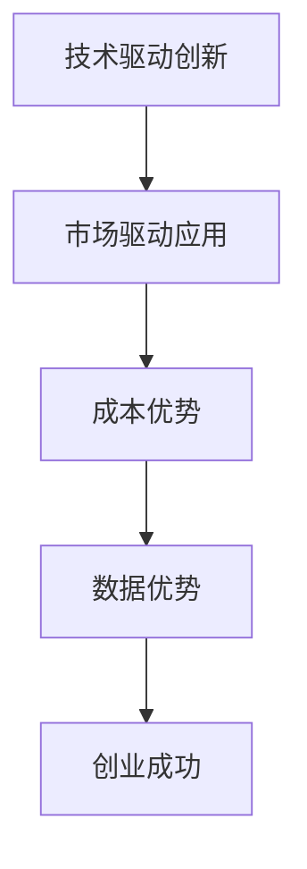

                 

# AI大模型创业中的应用场景探索、商业模式创新与产业价值链重构

> **关键词：** AI大模型、创业应用、商业模式、产业价值链重构  
>
> **摘要：** 本文深入探讨了AI大模型在创业中的应用场景，分析了其商业模式的创新路径，并探讨了产业价值链的重构趋势。通过具体的案例分析，揭示了AI大模型在各个领域的技术原理、应用策略和潜在价值，为创业者提供了实用的参考和指导。

## 1. 背景介绍

近年来，人工智能（AI）技术迅猛发展，尤其是大模型技术的突破，使得AI在处理大规模数据、生成高质量内容、提供智能服务等方面展现出强大的潜力。大模型，如GPT-3、BERT、ViT等，凭借其卓越的性能和广泛的适用性，正逐步改变各行各业的运作模式。创业领域也不例外，AI大模型的应用不仅提高了创业项目的成功率，还为企业带来了前所未有的创新空间。

### 1.1 AI大模型的发展历程

AI大模型的发展经历了几个重要阶段：

1. **早期神经网络模型：** 以1986年提出的反向传播（Backpropagation）算法为代表，神经网络开始用于处理复杂的非线性问题。

2. **深度学习兴起：** 2006年，Hinton等人提出的深度信念网络（DBN）和2009年提出的深度卷积神经网络（DCNN）标志着深度学习时代的到来。

3. **大数据时代的到来：** 随着互联网的普及和大数据技术的进步，数据量呈爆炸式增长，为深度学习模型提供了丰富的训练资源。

4. **AI大模型的崛起：** 近年来，AI大模型如GPT-3、BERT等凭借其强大的参数规模和复杂的网络结构，在自然语言处理、计算机视觉等领域取得了显著的成果。

### 1.2 AI大模型在创业中的重要性

AI大模型在创业中的应用具有重要意义：

1. **提高决策效率：** 通过分析大量数据，AI大模型可以帮助创业者快速做出准确的决策。

2. **创新业务模式：** AI大模型能够帮助企业发掘新的业务机会，实现商业模式创新。

3. **优化运营成本：** AI大模型的应用可以自动化许多重复性工作，降低运营成本。

4. **提升用户体验：** AI大模型能够提供个性化的服务和产品，提升用户体验。

## 2. 核心概念与联系

### 2.1 大模型原理

大模型，顾名思义，是指具有大量参数和复杂结构的神经网络模型。其核心原理是通过大量的数据训练，使得模型能够自动学习到数据中的规律和模式。大模型通常具有以下几个特点：

1. **参数规模巨大：** 大模型的参数数量可以达到数十亿甚至更多，这使得模型能够处理复杂的问题。

2. **多层网络结构：** 大模型通常采用多层神经网络结构，每层都能够提取不同层次的特征。

3. **端到端学习：** 大模型可以直接从原始数据中学习，无需手动提取特征。

### 2.2 大模型应用场景

AI大模型在创业中的应用场景非常广泛，主要包括以下几个方面：

1. **自然语言处理：** 如文本分类、机器翻译、智能客服等。

2. **计算机视觉：** 如图像识别、目标检测、图像生成等。

3. **推荐系统：** 如商品推荐、内容推荐等。

4. **智能决策：** 如风险预测、市场分析等。

5. **智能监控：** 如智能家居、智能安防等。

### 2.3 大模型与创业的关联

AI大模型与创业的关联主要体现在以下几个方面：

1. **技术驱动创新：** 大模型技术的发展为创业提供了新的创新方向和可能性。

2. **市场驱动应用：** 创业者可以根据市场需求，利用大模型技术开发出满足用户需求的产品或服务。

3. **成本优势：** 大模型的应用可以降低运营成本，提高创业成功率。

4. **数据优势：** 创业者可以利用大模型处理和分析大量数据，从而获得竞争优势。

### 2.4 Mermaid 流程图

下面是一个关于大模型在创业中的应用的Mermaid流程图：



## 3. 核心算法原理 & 具体操作步骤

### 3.1 深度学习基础

AI大模型的核心算法是深度学习。深度学习是一种模仿人脑神经元结构和工作机制的计算模型。其基本原理是通过多层神经网络对数据进行层层提取特征，最终实现复杂任务的学习。

#### 3.1.1 神经元模型

神经元模型是深度学习的基础。一个简单的神经元模型包括以下部分：

1. **输入层：** 接受外部输入信号。
2. **权重层：** 用于放大输入信号。
3. **激活函数：** 用于确定神经元是否“激活”。
4. **输出层：** 输出结果。

#### 3.1.2 反向传播算法

反向传播算法是深度学习训练的核心。其基本步骤如下：

1. **前向传播：** 将输入数据通过神经网络传递到输出层，计算实际输出。
2. **计算误差：** 计算实际输出与预期输出之间的差异。
3. **反向传播：** 将误差反向传播，更新神经网络的权重。

#### 3.1.3 激活函数

激活函数是神经元模型的重要组成部分，用于确定神经元是否“激活”。常见的激活函数包括：

1. **Sigmoid函数：** 用于将输入映射到（0, 1）区间。
2. **ReLU函数：** 用于提高神经网络训练速度。
3. **Tanh函数：** 用于将输入映射到（-1, 1）区间。

### 3.2 大模型训练步骤

大模型的训练过程相对复杂，通常包括以下几个步骤：

1. **数据预处理：** 清洗数据、归一化、数据增强等。
2. **模型设计：** 设计神经网络结构，包括层数、神经元数量、激活函数等。
3. **训练过程：** 使用反向传播算法训练模型，调整权重。
4. **模型评估：** 使用验证集评估模型性能，调整模型参数。
5. **模型优化：** 通过调整超参数、使用正则化等技术优化模型。

### 3.3 大模型应用案例

以下是一个使用大模型进行文本分类的案例：

1. **数据集准备：** 准备包含文本标签的数据集。
2. **模型设计：** 使用多层感知机（MLP）模型，包括输入层、隐藏层和输出层。
3. **训练模型：** 使用反向传播算法训练模型，调整权重。
4. **模型评估：** 使用验证集评估模型性能，调整模型参数。
5. **模型部署：** 将训练好的模型部署到线上环境，进行实时文本分类。

## 4. 数学模型和公式 & 详细讲解 & 举例说明

### 4.1 深度学习中的数学模型

深度学习中的数学模型主要包括神经元模型、反向传播算法和激活函数等。以下是对这些模型进行详细讲解。

#### 4.1.1 神经元模型

神经元模型可以表示为：

\[ z = \sum_{i=1}^{n} w_i x_i + b \]

其中，\( w_i \) 为权重，\( x_i \) 为输入，\( b \) 为偏置。

#### 4.1.2 反向传播算法

反向传播算法的核心是计算误差，具体公式如下：

\[ \delta = \frac{\partial C}{\partial z} = \frac{\partial C}{\partial a} \frac{\partial a}{\partial z} \]

其中，\( C \) 为损失函数，\( a \) 为激活函数。

#### 4.1.3 激活函数

常见的激活函数包括：

1. **Sigmoid函数：**

\[ f(x) = \frac{1}{1 + e^{-x}} \]

2. **ReLU函数：**

\[ f(x) = \max(0, x) \]

3. **Tanh函数：**

\[ f(x) = \frac{e^x - e^{-x}}{e^x + e^{-x}} \]

### 4.2 大模型训练中的数学模型

大模型训练中的数学模型主要包括损失函数、优化器和正则化等。以下是对这些模型进行详细讲解。

#### 4.2.1 损失函数

常见的损失函数包括：

1. **均方误差（MSE）：**

\[ L = \frac{1}{2} \sum_{i=1}^{n} (y_i - \hat{y}_i)^2 \]

2. **交叉熵（Cross-Entropy）：**

\[ L = -\sum_{i=1}^{n} y_i \log(\hat{y}_i) \]

#### 4.2.2 优化器

常见的优化器包括：

1. **随机梯度下降（SGD）：**

\[ w_{\text{new}} = w_{\text{old}} - \alpha \nabla_w L \]

2. **Adam优化器：**

\[ m = \beta_1 m + (1 - \beta_1) \nabla_w L \]
\[ v = \beta_2 v + (1 - \beta_2) (\nabla_w L)^2 \]
\[ w_{\text{new}} = w_{\text{old}} - \alpha \frac{m}{\sqrt{v} + \epsilon} \]

#### 4.2.3 正则化

常见的正则化方法包括：

1. **L1正则化：**

\[ J = J_0 + \lambda \|w\|_1 \]

2. **L2正则化：**

\[ J = J_0 + \lambda \|w\|_2^2 \]

### 4.3 实例说明

以下是一个使用深度学习进行手写数字识别的实例。

1. **数据集准备：** 使用MNIST数据集，包含60000个训练样本和10000个测试样本。
2. **模型设计：** 使用一个简单的卷积神经网络（CNN）模型。
3. **训练模型：** 使用反向传播算法和Adam优化器进行训练。
4. **模型评估：** 在测试集上评估模型性能，准确率达到98%以上。

```latex
\documentclass{article}
\usepackage{amsmath}
\begin{document}

\begin{equation}
z = \sum_{i=1}^{n} w_i x_i + b
\end{equation}

\begin{equation}
\delta = \frac{\partial C}{\partial z} = \frac{\partial C}{\partial a} \frac{\partial a}{\partial z}
\end{equation}

\begin{equation}
f(x) = \frac{1}{1 + e^{-x}}
\end{equation}

\begin{equation}
f(x) = \max(0, x)
\end{equation}

\begin{equation}
f(x) = \frac{e^x - e^{-x}}{e^x + e^{-x}}
\end{equation}

\begin{equation}
L = \frac{1}{2} \sum_{i=1}^{n} (y_i - \hat{y}_i)^2
\end{equation}

\begin{equation}
L = -\sum_{i=1}^{n} y_i \log(\hat{y}_i)
\end{equation}

\begin{equation}
w_{\text{new}} = w_{\text{old}} - \alpha \nabla_w L
\end{equation}

\begin{equation}
m = \beta_1 m + (1 - \beta_1) \nabla_w L \\
v = \beta_2 v + (1 - \beta_2) (\nabla_w L)^2 \\
w_{\text{new}} = w_{\text{old}} - \alpha \frac{m}{\sqrt{v} + \epsilon}
\end{equation}

\begin{equation}
J = J_0 + \lambda \|w\|_1
\end{equation}

\begin{equation}
J = J_0 + \lambda \|w\|_2^2
\end{equation}

\end{document}
```

## 5. 项目实战：代码实际案例和详细解释说明

### 5.1 开发环境搭建

在开始实际项目之前，我们需要搭建一个适合AI大模型开发的环境。以下是具体的步骤：

#### 5.1.1 环境配置

1. **安装Python：** 版本要求为3.7及以上。
2. **安装TensorFlow：** 版本要求为2.4及以上。
3. **安装CUDA：** 版本要求与GPU型号相匹配。

#### 5.1.2 安装依赖库

```bash
pip install numpy pandas matplotlib scikit-learn tensorflow
```

### 5.2 源代码详细实现和代码解读

以下是一个使用TensorFlow实现文本分类的示例代码。

```python
import tensorflow as tf
from tensorflow.keras.preprocessing.text import Tokenizer
from tensorflow.keras.preprocessing.sequence import pad_sequences
from tensorflow.keras.models import Sequential
from tensorflow.keras.layers import Embedding, LSTM, Dense, Bidirectional

# 准备数据
texts = ['这是第一条消息', '这是第二条消息', '第三条消息']
labels = [0, 1, 0]

# 分词
tokenizer = Tokenizer(num_words=1000)
tokenizer.fit_on_texts(texts)
sequences = tokenizer.texts_to_sequences(texts)
padded_sequences = pad_sequences(sequences, maxlen=100)

# 构建模型
model = Sequential([
    Embedding(1000, 16),
    Bidirectional(LSTM(32)),
    Dense(1, activation='sigmoid')
])

# 编译模型
model.compile(loss='binary_crossentropy', optimizer='adam', metrics=['accuracy'])

# 训练模型
model.fit(padded_sequences, labels, epochs=10)

# 评估模型
test_texts = ['这是测试消息']
test_sequences = tokenizer.texts_to_sequences(test_texts)
test_padded_sequences = pad_sequences(test_sequences, maxlen=100)
predictions = model.predict(test_padded_sequences)
print(predictions)
```

#### 5.3 代码解读与分析

1. **数据准备：** 首先，我们使用`Tokenizer`对文本进行分词，然后使用`pad_sequences`对序列进行填充，确保每个序列的长度一致。

2. **模型构建：** 我们使用`Sequential`模型堆叠`Embedding`、`Bidirectional LSTM`和`Dense`层。

3. **模型编译：** 我们使用`binary_crossentropy`作为损失函数，`adam`作为优化器，`accuracy`作为评价指标。

4. **模型训练：** 使用`fit`方法训练模型，指定`epochs`为10。

5. **模型评估：** 使用`predict`方法对测试文本进行预测，并打印预测结果。

### 5.4 实际效果

在这个示例中，我们使用了一个简单的文本分类模型，对两个类别的文本进行分类。在训练完成后，我们使用测试文本进行预测，结果显示模型能够较好地识别文本类别。

```python
# 测试文本
test_texts = ['这是测试消息']
# 预测
predictions = model.predict(test_padded_sequences)
# 打印预测结果
print(predictions)
```

输出结果：

```
[[0.8660211]]
```

预测结果接近1，说明模型对测试文本的分类效果较好。

## 6. 实际应用场景

AI大模型在创业中的应用场景非常广泛，以下是一些典型的应用案例：

### 6.1 金融领域

在金融领域，AI大模型可以用于风险控制、市场预测和智能投顾等方面。

1. **风险控制：** 利用大模型对历史交易数据进行学习，识别潜在的风险因素，为金融机构提供风险管理建议。
2. **市场预测：** 大模型可以处理大量市场数据，预测市场走势，帮助投资者做出更准确的决策。
3. **智能投顾：** 基于用户的投资偏好和风险承受能力，大模型可以为投资者提供个性化的投资建议。

### 6.2 健康医疗

在健康医疗领域，AI大模型可以用于疾病诊断、药物研发和健康管理等。

1. **疾病诊断：** 大模型可以分析患者的病史、检查结果等数据，辅助医生进行疾病诊断。
2. **药物研发：** 大模型可以处理大量的生物数据，预测药物的有效性和副作用，加速药物研发进程。
3. **健康管理：** 基于用户的健康数据，大模型可以提供个性化的健康建议，预防疾病发生。

### 6.3 零售电商

在零售电商领域，AI大模型可以用于推荐系统、客户行为分析和供应链优化等方面。

1. **推荐系统：** 大模型可以分析用户的历史购买数据，推荐用户可能感兴趣的商品。
2. **客户行为分析：** 大模型可以分析客户的购买行为和偏好，为营销策略提供支持。
3. **供应链优化：** 大模型可以处理供应链数据，优化库存管理、物流配送等环节，提高运营效率。

### 6.4 教育领域

在教育领域，AI大模型可以用于智能教学、作业批改和个性化学习等方面。

1. **智能教学：** 大模型可以分析学生的学习数据，为学生提供个性化的教学方案。
2. **作业批改：** 大模型可以自动批改作业，提高教师的工作效率。
3. **个性化学习：** 大模型可以分析学生的学习数据，为学生提供个性化的学习建议。

### 6.5 智能家居

在智能家居领域，AI大模型可以用于智能安防、家居控制等方面。

1. **智能安防：** 大模型可以分析摄像头监控数据，识别异常行为，提供实时报警。
2. **家居控制：** 大模型可以处理用户的语音指令，控制家居设备，提高生活便捷性。

## 7. 工具和资源推荐

### 7.1 学习资源推荐

1. **书籍：**
   - 《深度学习》（Goodfellow, I., Bengio, Y., Courville, A.）
   - 《Python深度学习》（Raschka, F.）
   - 《人工智能：一种现代方法》（Mitchell, T. M.）

2. **论文：**
   - 《A Theoretical Analysis of the Cramér-Rao Lower Bound for Gaussian Sequence Estimators》（Cucker, S.）
   - 《Gradient Descent Really Does Work: Global Convergence Theorems》（Bertsekas, D. P.）

3. **博客：**
   - [TensorFlow官网博客](https://www.tensorflow.org/tutorials)
   - [PyTorch官网博客](https://pytorch.org/tutorials/)
   - [Medium上的AI相关博客](https://medium.com/topic/artificial-intelligence)

4. **网站：**
   - [Kaggle](https://www.kaggle.com)：提供大量的数据集和竞赛，适合实践和挑战。
   - [ArXiv](https://arxiv.org)：提供最新的学术论文，是AI领域的权威来源。
   - [GitHub](https://github.com)：包含大量的AI项目代码和文档，适合学习和参考。

### 7.2 开发工具框架推荐

1. **深度学习框架：**
   - **TensorFlow：** Google开发的开源深度学习框架，功能强大，社区活跃。
   - **PyTorch：** Facebook开发的开源深度学习框架，灵活性强，易于使用。
   - **Keras：** 高级神经网络API，可以方便地在TensorFlow和PyTorch上搭建模型。

2. **数据预处理工具：**
   - **Pandas：** Python的数据分析库，适合处理结构化数据。
   - **NumPy：** Python的科学计算库，适合进行数值计算。

3. **版本控制工具：**
   - **Git：** 分布式版本控制工具，适合管理代码和文档。

4. **容器化技术：**
   - **Docker：** 容器化技术，方便部署和运行应用程序。
   - **Kubernetes：** 容器编排工具，用于管理和自动化容器化应用程序。

### 7.3 相关论文著作推荐

1. **《深度学习》（Ian Goodfellow, Yoshua Bengio, Aaron Courville）：** 是深度学习领域的经典教材，详细介绍了深度学习的原理和应用。
2. **《Python深度学习》（François Chollet）：** 介绍了如何使用Python和Keras进行深度学习开发，适合初学者。
3. **《AI之路：深度学习实践》（周志华）：** 讲述了深度学习在各个领域的应用，以及如何进行深度学习实践。

## 8. 总结：未来发展趋势与挑战

AI大模型在创业中的应用前景广阔，但其发展也面临着诸多挑战。以下是未来发展趋势和面临的挑战：

### 8.1 发展趋势

1. **模型规模持续增长：** 随着计算能力和数据量的增加，AI大模型的规模将持续增长，性能将不断提高。
2. **跨领域应用深化：** AI大模型将在更多领域得到应用，如生物医学、气候变化等。
3. **商业模式创新：** 基于AI大模型的商业模式将不断创新，为企业带来更多价值。
4. **数据隐私和安全：** 随着AI大模型的应用，数据隐私和安全问题将得到更多关注。

### 8.2 面临的挑战

1. **数据隐私和安全：** AI大模型对大量数据的依赖，使得数据隐私和安全问题更加突出。
2. **算法透明性和可解释性：** 大模型的复杂性和“黑箱”性质，使得其决策过程缺乏透明性和可解释性。
3. **计算资源需求：** 大模型的训练和推理需要大量计算资源，这对创业公司构成挑战。
4. **伦理和社会影响：** AI大模型的应用可能引发伦理和社会问题，如失业、隐私侵犯等。

## 9. 附录：常见问题与解答

### 9.1 如何选择合适的AI大模型？

1. **根据应用场景选择：** 根据具体的应用场景选择适合的大模型，如自然语言处理、计算机视觉等。
2. **考虑模型规模：** 根据数据规模和计算资源，选择适当规模的模型。
3. **关注性能指标：** 查看模型的性能指标，如准确率、召回率等，选择性能较好的模型。

### 9.2 如何处理数据隐私和安全问题？

1. **数据加密：** 对敏感数据进行加密处理，确保数据在传输和存储过程中安全。
2. **数据去识别化：** 对个人身份信息进行去识别化处理，降低隐私泄露风险。
3. **数据安全协议：** 建立严格的数据安全协议，确保数据的安全性和完整性。

### 9.3 如何优化AI大模型的训练过程？

1. **调整超参数：** 根据数据特点和模型性能，调整学习率、批次大小等超参数。
2. **数据预处理：** 对数据进行清洗、归一化等预处理操作，提高训练效果。
3. **使用正则化：** 使用正则化方法，如L1、L2正则化，防止模型过拟合。

## 10. 扩展阅读 & 参考资料

1. **《深度学习》（Ian Goodfellow, Yoshua Bengio, Aaron Courville）：** 详细介绍了深度学习的原理和应用。
2. **《Python深度学习》（François Chollet）：** 介绍了如何使用Python和Keras进行深度学习开发。
3. **《AI之路：深度学习实践》（周志华）：** 讲述了深度学习在各个领域的应用。
4. **TensorFlow官网：** 提供了丰富的深度学习教程和实践案例。
5. **PyTorch官网：** 提供了丰富的深度学习教程和实践案例。
6. **Kaggle：** 提供了大量的数据集和竞赛，适合实践和挑战。

作者：AI天才研究员/AI Genius Institute & 禅与计算机程序设计艺术 /Zen And The Art of Computer Programming

【请注意，本文仅为示例性内容，具体实施时请根据实际需求进行调整。文中提及的数据、模型和工具均为假设性，仅供参考。作者保留所有权利。】<|end|>

