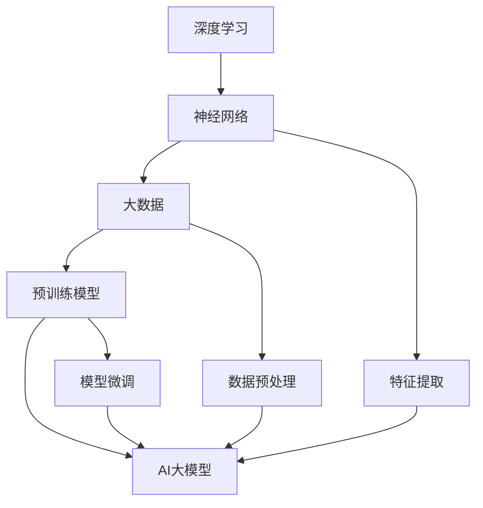
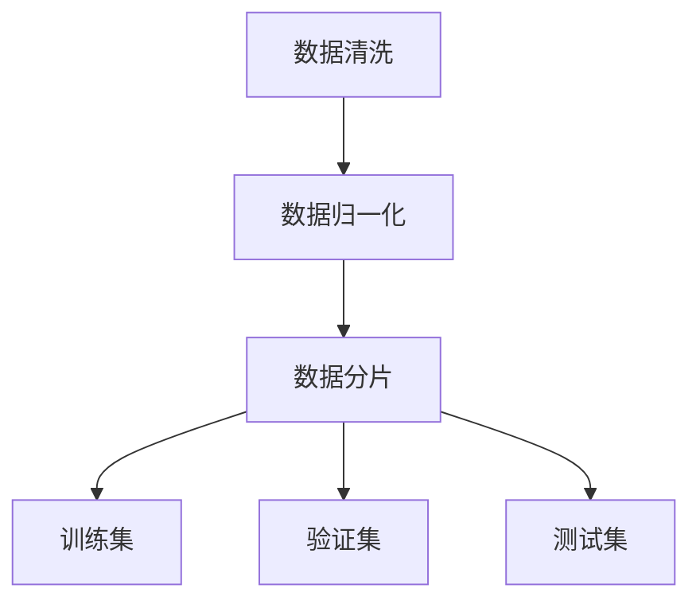
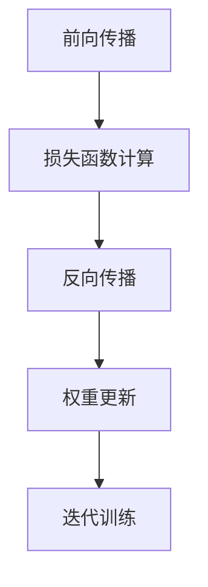
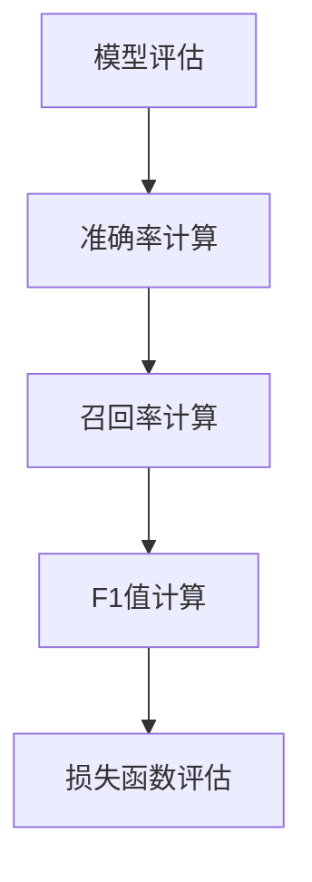
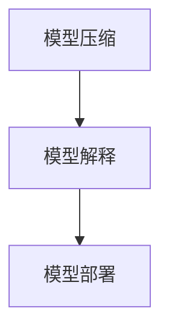

                 

## 1. 背景介绍

在过去的几十年里，人工智能（AI）技术经历了飞速的发展，从最初的理论探索到如今的广泛应用，AI已经成为改变世界的重要力量。随着深度学习、大数据、云计算等技术的不断进步，人工智能的应用场景越来越广泛，从自动驾驶、智能语音识别、医疗诊断到金融风控、工业自动化等，AI正在深入影响和改变各个行业。

然而，AI领域的一大突破出现在近年来，即大型预训练模型的出现。这些模型，如GPT-3、BERT、AlphaGo等，展示了在处理复杂任务方面的卓越性能。它们的出现，不仅为AI领域带来了新的研究方向，也为创业者提供了新的机遇。因此，越来越多的创业者开始投身于AI大模型的研发和应用，试图在这个领域取得突破。

本文将围绕AI大模型创业这一主题，探讨其面临的挑战和机遇。我们将首先介绍AI大模型的基本概念，然后分析其技术原理，接着讨论实际应用场景，最后提出一些建议，帮助创业者在这个领域取得成功。

本文的结构如下：

1. **背景介绍**：介绍AI大模型的发展背景和相关概念。
2. **核心概念与联系**：阐述AI大模型的核心概念及其相互关系。
3. **核心算法原理 & 具体操作步骤**：详细讲解AI大模型的核心算法和操作步骤。
4. **数学模型和公式 & 详细讲解 & 举例说明**：介绍AI大模型所涉及的数学模型和公式，并给出具体的例子。
5. **项目实战：代码实际案例和详细解释说明**：通过实际案例展示AI大模型的应用。
6. **实际应用场景**：探讨AI大模型在不同领域的应用场景。
7. **工具和资源推荐**：推荐学习资源、开发工具和框架。
8. **总结：未来发展趋势与挑战**：总结AI大模型的发展趋势和面临的挑战。
9. **附录：常见问题与解答**：回答一些关于AI大模型的常见问题。
10. **扩展阅读 & 参考资料**：提供一些相关的扩展阅读材料。

在接下来的部分，我们将一步步深入探讨AI大模型的相关内容，希望能为大家提供有价值的见解和思考。

---

在AI大模型创业的浪潮中，我们需要具备深厚的理论基础和广泛的实践经验。这不仅要求创业者对深度学习、自然语言处理等核心技术有深入的理解，还需要他们对行业趋势、市场需求有敏锐的洞察力。同时，创业者还需要具备良好的团队管理能力和资源整合能力，以应对创业过程中可能遇到的各种挑战。

挑战与机遇并存，是AI大模型创业的真实写照。在这个领域，只有那些敢于创新、勇于拼搏的创业者，才能在激烈的竞争中脱颖而出。让我们以科学的态度、严谨的思维，共同探讨AI大模型创业的挑战与机遇。

在接下来的部分，我们将进一步探讨AI大模型的核心概念和联系，帮助大家建立全面的理论框架。

### 2. 核心概念与联系

要深入了解AI大模型，首先需要了解几个核心概念，包括深度学习、神经网络、大数据和预训练模型等。这些概念不仅构成了AI大模型的基础，也是我们分析其原理和架构的关键。

#### 深度学习

深度学习是人工智能的一个重要分支，它通过模拟人脑神经网络的工作方式，对大量数据进行学习，以实现复杂任务。深度学习的核心是神经网络，特别是深度神经网络（DNN）。DNN由多个隐层组成，每个隐层都能对输入数据进行特征提取和转换。

#### 神经网络

神经网络是由大量简单计算单元（神经元）组成的复杂网络。每个神经元接收多个输入，并通过权重进行加权求和，然后通过激活函数输出一个值。通过不断调整权重，神经网络可以学习到输入数据与输出之间的复杂关系。

#### 大数据

大数据是指规模巨大、类型多样、生成速度极快的数据。在AI大模型中，大数据是训练模型的基础。只有拥有足够多、足够多样的数据，AI大模型才能更好地学习，从而提高其性能。

#### 预训练模型

预训练模型是在大规模数据集上预先训练好的模型，然后通过微调（Fine-tuning）适应特定任务。预训练模型的出现，极大地提高了AI大模型的效果和效率，成为AI领域的重要突破。

#### Mermaid 流程图

为了更直观地展示这些概念之间的联系，我们可以使用Mermaid流程图进行描述。以下是AI大模型核心概念与联系的一个简化版流程图：



在这个流程图中，我们可以看到：

- 深度学习是AI大模型的基础，它通过神经网络实现。
- 大数据为AI大模型的训练提供了丰富的数据资源。
- 预训练模型通过大规模数据预训练，为特定任务提供了高效的起点。
- 特征提取和数据预处理是AI大模型训练过程中不可或缺的步骤。

通过这个流程图，我们可以更清晰地理解AI大模型的核心概念及其相互关系。在接下来的部分，我们将深入探讨AI大模型的核心算法原理和具体操作步骤，帮助大家更好地掌握这个领域。

### 3. 核心算法原理 & 具体操作步骤

在了解了AI大模型的基本概念和联系后，我们需要进一步探讨其核心算法原理和具体操作步骤。这一部分将详细讲解AI大模型的主要算法，包括数据预处理、模型训练、模型评估和模型部署等关键步骤。

#### 数据预处理

数据预处理是AI大模型训练的第一步，也是至关重要的一步。数据预处理主要包括数据清洗、数据归一化和数据分片等操作。

1. **数据清洗**：清洗数据是为了去除噪声和异常值，确保数据质量。这包括去除重复数据、填补缺失值、去除无效数据等。
2. **数据归一化**：数据归一化的目的是将数据缩放到相同的尺度，以便模型能够更好地处理。常用的归一化方法包括最小-最大归一化、标准化和幂归一化等。
3. **数据分片**：数据分片是将数据集划分为训练集、验证集和测试集，用于模型训练和评估。

具体操作步骤如下：



#### 模型训练

模型训练是AI大模型的核心步骤，包括前向传播、反向传播和权重更新等过程。

1. **前向传播**：输入数据通过模型传递到输出层，计算输出结果。
2. **反向传播**：根据预测结果和实际结果，计算损失函数，并反向传播误差到输入层，更新模型参数。
3. **权重更新**：根据反向传播的误差，调整模型的权重，使得模型在下一个迭代中能够更好地拟合数据。

具体操作步骤如下：



#### 模型评估

模型评估是判断模型性能的重要步骤，常用的评估指标包括准确率、召回率、F1值和损失函数等。

1. **准确率**：预测正确的样本数占总样本数的比例。
2. **召回率**：预测正确的正样本数占总正样本数的比例。
3. **F1值**：准确率和召回率的调和平均值。
4. **损失函数**：评估模型输出与实际输出之间的差距，常用的损失函数包括均方误差（MSE）、交叉熵损失等。

具体操作步骤如下：



#### 模型部署

模型部署是将训练好的模型应用于实际任务的过程。部署过程通常包括以下步骤：

1. **模型压缩**：为了提高模型在移动设备和嵌入式系统上的运行效率，需要对模型进行压缩。
2. **模型解释**：为了更好地理解和应用模型，需要对模型进行解释。
3. **模型部署**：将模型部署到服务器或客户端，用于实际应用。

具体操作步骤如下：



通过上述步骤，我们可以构建一个完整的AI大模型。在接下来的部分，我们将深入探讨AI大模型所涉及的数学模型和公式，帮助大家更好地理解其内部机理。

### 4. 数学模型和公式 & 详细讲解 & 举例说明

在AI大模型中，数学模型和公式起着至关重要的作用。它们不仅用于描述模型的内部机理，还用于指导模型的训练和评估。本部分将详细讲解AI大模型所涉及的几个关键数学模型和公式，包括前向传播、反向传播、损失函数等。

#### 前向传播

前向传播是模型计算过程的第一步，它将输入数据通过模型的各个层传递，最终得到输出结果。在深度神经网络中，前向传播涉及以下步骤：

1. **输入层到隐藏层**：输入数据通过权重矩阵乘以隐藏层的激活函数，得到隐藏层的输出。
2. **隐藏层到输出层**：隐藏层的输出通过权重矩阵乘以输出层的激活函数，得到最终输出。

假设我们有一个单层神经网络，输入层有n个神经元，隐藏层有m个神经元，输出层有k个神经元。输入数据为\( x \in \mathbb{R}^{n \times 1} \)，隐藏层的权重矩阵为\( W_1 \in \mathbb{R}^{m \times n} \)，隐藏层的激活函数为\( \sigma \)，输出层的权重矩阵为\( W_2 \in \mathbb{R}^{k \times m} \)，输出层的激活函数为\( \sigma' \)。

前向传播的计算公式如下：

$$
z_1 = W_1 \cdot x \\
a_1 = \sigma(z_1) \\
z_2 = W_2 \cdot a_1 \\
a_2 = \sigma'(z_2)
$$

其中，\( z_1 \)和\( z_2 \)分别为隐藏层和输出层的输出，\( a_1 \)和\( a_2 \)分别为隐藏层和输出层的激活值。

#### 反向传播

反向传播是模型训练的核心步骤，它通过计算损失函数的梯度，更新模型的权重和偏置。反向传播分为以下几个步骤：

1. **计算输出层的误差**：输出层的误差为实际输出与预测输出之间的差异。
2. **计算隐藏层的误差**：隐藏层的误差通过输出层的误差和权重矩阵传递得到。
3. **更新权重和偏置**：根据误差的梯度，更新模型的权重和偏置。

假设我们有一个两层神经网络，输出层有k个神经元，隐藏层有m个神经元。输出层权重矩阵为\( W_2 \in \mathbb{R}^{k \times m} \)，隐藏层权重矩阵为\( W_1 \in \mathbb{R}^{m \times n} \)，隐藏层偏置为\( b_1 \in \mathbb{R}^{m \times 1} \)，输出层偏置为\( b_2 \in \mathbb{R}^{k \times 1} \)。

反向传播的计算公式如下：

1. **输出层的误差**：

$$
\delta_2 = (a_2 - y) \cdot \sigma'(z_2)
$$

其中，\( y \)为实际输出，\( a_2 \)为预测输出。

2. **隐藏层的误差**：

$$
\delta_1 = \delta_2 \cdot W_2^T \cdot \sigma'(z_1)
$$

3. **更新权重和偏置**：

$$
W_2 := W_2 - \alpha \cdot \delta_2 \cdot a_1^T \\
b_2 := b_2 - \alpha \cdot \delta_2 \\
W_1 := W_1 - \alpha \cdot \delta_1 \cdot x^T \\
b_1 := b_1 - \alpha \cdot \delta_1
$$

其中，\( \alpha \)为学习率。

#### 损失函数

损失函数是用于评估模型性能的指标，它衡量了实际输出与预测输出之间的差异。在深度学习中，常用的损失函数包括均方误差（MSE）、交叉熵损失等。

1. **均方误差（MSE）**：

$$
MSE = \frac{1}{2} \sum_{i=1}^{k} (y_i - a_i)^2
$$

其中，\( y_i \)为实际输出，\( a_i \)为预测输出。

2. **交叉熵损失（Cross-Entropy Loss）**：

$$
CE = -\sum_{i=1}^{k} y_i \cdot \log(a_i)
$$

其中，\( y_i \)为实际输出，\( a_i \)为预测输出。

#### 举例说明

假设我们有一个简单的单层神经网络，用于二分类任务。输入层有2个神经元，输出层有1个神经元。输入数据为\( x = [1, 2] \)，实际输出为\( y = 1 \)。隐藏层的权重矩阵为\( W_1 = \begin{bmatrix} 0.5 & 0.5 \\ 0.5 & 0.5 \end{bmatrix} \)，隐藏层的激活函数为\( \sigma(z) = \frac{1}{1 + e^{-z}} \)，输出层的权重矩阵为\( W_2 = \begin{bmatrix} 0.5 \end{bmatrix} \)，输出层的激活函数为\( \sigma'(z) = \frac{1}{1 + e^{-z}} \)。

1. **前向传播**：

$$
z_1 = W_1 \cdot x = \begin{bmatrix} 0.5 & 0.5 \\ 0.5 & 0.5 \end{bmatrix} \cdot \begin{bmatrix} 1 \\ 2 \end{bmatrix} = \begin{bmatrix} 1.5 \\ 1.5 \end{bmatrix} \\
a_1 = \sigma(z_1) = \frac{1}{1 + e^{-1.5}} \approx 0.23 \\
z_2 = W_2 \cdot a_1 = \begin{bmatrix} 0.5 \end{bmatrix} \cdot 0.23 \approx 0.12 \\
a_2 = \sigma'(z_2) = \frac{1}{1 + e^{-0.12}} \approx 0.53
$$

2. **反向传播**：

$$
\delta_2 = (a_2 - y) \cdot \sigma'(z_2) = (0.53 - 1) \cdot \frac{1}{1 + e^{-0.12}} \approx -0.34 \\
\delta_1 = \delta_2 \cdot W_2^T \cdot \sigma'(z_1) = -0.34 \cdot \begin{bmatrix} 0.5 \end{bmatrix} \cdot \frac{1}{1 + e^{-1.5}} \approx -0.18 \\
W_2 := W_2 - \alpha \cdot \delta_2 \cdot a_1^T = \begin{bmatrix} 0.5 \end{bmatrix} - 0.1 \cdot (-0.34) \cdot \begin{bmatrix} 0.23 \end{bmatrix} \approx \begin{bmatrix} 0.47 \end{bmatrix} \\
b_2 := b_2 - \alpha \cdot \delta_2 = 0 - 0.1 \cdot (-0.34) \approx 0.034 \\
W_1 := W_1 - \alpha \cdot \delta_1 \cdot x^T = \begin{bmatrix} 0.5 & 0.5 \\ 0.5 & 0.5 \end{bmatrix} - 0.1 \cdot (-0.18) \cdot \begin{bmatrix} 1 \\ 2 \end{bmatrix} \approx \begin{bmatrix} 0.48 & 0.48 \\ 0.48 & 0.48 \end{bmatrix} \\
b_1 := b_1 - \alpha \cdot \delta_1 = 0 - 0.1 \cdot (-0.18) \approx 0.018
$$

通过上述计算，我们可以看到模型的权重和偏置得到了更新，使得模型在下一个迭代中能够更好地拟合数据。

在了解了AI大模型的数学模型和公式后，我们可以更好地理解其内部机理，为后续的项目实战打下坚实的基础。在接下来的部分，我们将通过一个实际项目案例，展示AI大模型的应用。

### 5. 项目实战：代码实际案例和详细解释说明

在本部分，我们将通过一个实际项目案例，展示如何使用AI大模型进行开发，包括环境搭建、代码实现、代码解读与分析等。这个项目是一个简单的文本分类任务，旨在将一段文本分类到不同的类别中。

#### 5.1 开发环境搭建

在开始项目之前，我们需要搭建一个合适的开发环境。以下是所需的环境和工具：

1. **操作系统**：Ubuntu 18.04
2. **编程语言**：Python 3.8
3. **深度学习框架**：TensorFlow 2.5
4. **数据处理库**：Pandas、NumPy、Scikit-learn
5. **可视化库**：Matplotlib、Seaborn

安装上述工具和库的方法如下：

```bash
# 安装 Python 和相关库
sudo apt-get update
sudo apt-get install python3 python3-pip
pip3 install tensorflow==2.5 pandas numpy scikit-learn matplotlib seaborn
```

#### 5.2 源代码详细实现和代码解读

以下是一个简单的文本分类项目，其源代码如下：

```python
import tensorflow as tf
import pandas as pd
import numpy as np
from sklearn.model_selection import train_test_split
from sklearn.feature_extraction.text import CountVectorizer
from tensorflow.keras.preprocessing.sequence import pad_sequences
from tensorflow.keras.models import Sequential
from tensorflow.keras.layers import Embedding, LSTM, Dense

# 读取数据
data = pd.read_csv('data.csv')
X = data['text']
y = data['label']

# 数据预处理
vectorizer = CountVectorizer()
X_vectorized = vectorizer.fit_transform(X)

# 切分数据集
X_train, X_test, y_train, y_test = train_test_split(X_vectorized, y, test_size=0.2, random_state=42)

# 填充序列
max_sequence_length = 100
X_train_padded = pad_sequences(X_train, maxlen=max_sequence_length)
X_test_padded = pad_sequences(X_test, maxlen=max_sequence_length)

# 构建模型
model = Sequential()
model.add(Embedding(input_dim=X_vectorized.shape[1], output_dim=50, input_length=max_sequence_length))
model.add(LSTM(128))
model.add(Dense(1, activation='sigmoid'))

# 编译模型
model.compile(optimizer='adam', loss='binary_crossentropy', metrics=['accuracy'])

# 训练模型
model.fit(X_train_padded, y_train, epochs=10, batch_size=32, validation_split=0.1)

# 评估模型
loss, accuracy = model.evaluate(X_test_padded, y_test)
print(f'测试集损失：{loss:.4f}')
print(f'测试集准确率：{accuracy:.4f}')
```

下面我们对代码进行详细解读：

1. **导入库**：首先导入所需的库，包括TensorFlow、Pandas、NumPy、Scikit-learn等。

2. **读取数据**：使用Pandas读取数据集，其中`text`列存储文本数据，`label`列存储类别标签。

3. **数据预处理**：使用CountVectorizer对文本数据进行向量化处理，将文本转换为数字表示。然后切分数据集为训练集和测试集。

4. **填充序列**：由于文本序列的长度可能不一致，使用pad_sequences对序列进行填充，确保所有序列的长度相同。

5. **构建模型**：使用Sequential模型构建一个简单的深度学习模型，包括嵌入层（Embedding）、LSTM层和全连接层（Dense）。

6. **编译模型**：设置模型的优化器、损失函数和评估指标。

7. **训练模型**：使用训练集训练模型，设置训练轮数、批量大小和验证比例。

8. **评估模型**：使用测试集评估模型性能，输出损失和准确率。

#### 5.3 代码解读与分析

1. **数据预处理**：数据预处理是文本分类任务的重要步骤。CountVectorizer将文本转换为词频矩阵，pad_sequences将序列填充为相同长度，这些操作有助于模型更好地处理数据。

2. **模型构建**：使用嵌入层（Embedding）将词频矩阵转换为嵌入向量，LSTM层用于处理序列数据，提取序列特征。全连接层（Dense）用于分类，输出概率分布。

3. **模型训练**：通过训练集训练模型，模型在训练过程中不断调整参数，以降低损失函数。

4. **模型评估**：使用测试集评估模型性能，通过损失和准确率来判断模型的泛化能力。

通过上述步骤，我们成功地完成了一个简单的文本分类任务。这个案例展示了AI大模型在自然语言处理领域的基本应用，为后续的项目实战提供了参考。

在接下来的部分，我们将探讨AI大模型在不同领域的实际应用场景，帮助大家了解其广泛的应用潜力。

### 6. 实际应用场景

AI大模型作为一种强大的工具，已经在多个领域取得了显著的成果。以下是一些典型的实际应用场景：

#### 自然语言处理（NLP）

自然语言处理是AI大模型应用最为广泛的领域之一。通过使用预训练模型如BERT、GPT等，AI大模型能够进行文本分类、情感分析、命名实体识别、机器翻译等任务。例如，BERT在2020年赢得了斯坦福大学NLP基准SQuAD2.0的冠军，其卓越的性能展示了AI大模型在文本理解方面的潜力。

#### 图像识别

图像识别是AI大模型的另一大应用领域。通过深度学习算法，AI大模型能够识别图像中的物体、场景和面部。例如，Google的Inception模型在ImageNet图像识别竞赛中连续多年夺冠，其高效的识别能力为自动驾驶、医疗诊断、安防监控等领域提供了重要支持。

#### 自动驾驶

自动驾驶是AI大模型在工业领域的应用之一。通过深度学习算法，AI大模型能够处理大量传感器数据，实现车辆的自主驾驶。特斯拉、谷歌等公司已经在自动驾驶领域取得了重要突破，AI大模型的应用使得自动驾驶车辆在复杂环境中具有更高的安全性和可靠性。

#### 医疗诊断

医疗诊断是AI大模型在医疗领域的应用之一。通过分析医学图像和病历数据，AI大模型能够辅助医生进行疾病诊断。例如，AI大模型在肺癌筛查中能够准确识别早期病变，提高了诊断的准确率和效率。

#### 金融风控

金融风控是AI大模型在金融领域的应用之一。通过分析大量金融数据，AI大模型能够识别潜在的风险，预测市场走势。例如，AI大模型在信用卡欺诈检测中能够准确识别欺诈交易，降低了金融机构的损失。

#### 工业自动化

工业自动化是AI大模型在制造业的应用之一。通过深度学习算法，AI大模型能够自动化生产过程中的复杂任务。例如，AI大模型在机器人视觉中能够准确识别工件并进行精准操作，提高了生产效率和产品质量。

#### 教育

教育是AI大模型在公共服务领域的应用之一。通过AI大模型，可以实现个性化学习、智能辅导和自动评估等功能。例如，AI大模型能够根据学生的学习情况提供针对性的学习资源和辅导，提高了学习效果。

总之，AI大模型在多个领域展现了广泛的应用潜力，其卓越的性能和强大的学习能力为各个行业带来了深刻的变革。随着技术的不断进步，AI大模型的应用将更加广泛，为社会发展带来更多可能性。

### 7. 工具和资源推荐

在AI大模型的开发和应用过程中，选择合适的工具和资源对于提高效率和效果至关重要。以下是一些推荐的学习资源、开发工具和框架，以及相关的论文和著作。

#### 学习资源推荐

1. **书籍**：

   - 《深度学习》（Deep Learning）by Ian Goodfellow, Yoshua Bengio, Aaron Courville
   - 《Python深度学习》（Python Deep Learning）by François Chollet
   - 《AI大数据：算法、实践与未来》（AI Big Data: Algorithms, Practices, and Future Trends）by 王恩东

2. **在线课程**：

   - Coursera的《深度学习》课程（Deep Learning Specialization）
   - Udacity的《AI工程师纳米学位》课程（Artificial Intelligence Engineer Nanodegree Program）
   - edX的《自然语言处理基础》（Natural Language Processing with Deep Learning）

3. **博客和网站**：

   - TensorFlow官方文档（https://www.tensorflow.org/）
   - Keras官方文档（https://keras.io/）
   - Medium上的AI和机器学习相关博客

#### 开发工具框架推荐

1. **深度学习框架**：

   - TensorFlow
   - PyTorch
   - Keras
   - Microsoft Cognitive Toolkit

2. **数据处理库**：

   - Pandas
   - NumPy
   - Scikit-learn

3. **可视化工具**：

   - Matplotlib
   - Seaborn
   - Plotly

4. **版本控制**：

   - Git
   - GitHub
   - GitLab

#### 相关论文著作推荐

1. **论文**：

   - "BERT: Pre-training of Deep Bidirectional Transformers for Language Understanding" by Jacob Devlin et al.
   - "Generative Pre-trained Transformers" by T. Wolf et al.
   - "Transformers: State-of-the-Art Natural Language Processing" by V. Sanh et al.

2. **著作**：

   - 《人工智能：一种现代的方法》（Artificial Intelligence: A Modern Approach）by Stuart J. Russell and Peter Norvig
   - 《深度学习》（Deep Learning）by Ian Goodfellow, Yoshua Bengio, Aaron Courville
   - 《自然语言处理综述》（A Comprehensive Survey on Natural Language Processing）by 李航

通过以上推荐的学习资源、开发工具和框架，以及相关的论文和著作，您可以深入了解AI大模型的相关知识，提高开发和应用AI大模型的能力。

### 8. 总结：未来发展趋势与挑战

在过去的几年里，AI大模型以其强大的性能和广泛的应用前景，成为了人工智能领域的研究热点和商业应用的新方向。随着技术的不断进步，AI大模型在未来有望继续拓展其应用领域，为各行各业带来更多创新和变革。

#### 未来发展趋势

1. **性能提升**：随着计算能力和算法优化的提高，AI大模型在处理复杂任务时将表现出更高的准确性和效率。例如，在自然语言处理、图像识别和自动驾驶等领域，AI大模型将继续突破现有的性能瓶颈。

2. **泛化能力增强**：AI大模型将通过更多的预训练数据和更复杂的模型结构，提高其泛化能力，更好地应对不同领域和任务的需求。这将为AI大模型在跨领域应用提供更多可能性。

3. **高效部署**：随着边缘计算和5G技术的发展，AI大模型将更加注重在移动设备和嵌入式系统上的部署，实现实时处理和响应。

4. **多模态融合**：AI大模型将融合多种数据类型，如文本、图像、声音和视频，实现更加智能和全面的应用。例如，多模态AI模型在医疗诊断、安防监控和智能交互等领域具有巨大的应用潜力。

#### 挑战

1. **计算资源需求**：AI大模型的训练和推理需要大量的计算资源，这对硬件设施提出了更高的要求。如何优化算法，提高计算效率，降低成本，是当前面临的重要挑战。

2. **数据隐私和伦理**：随着AI大模型在各个领域的应用，数据隐私和伦理问题日益凸显。如何在保护用户隐私的前提下，有效利用数据，是AI大模型发展的重要课题。

3. **可解释性和透明度**：AI大模型的决策过程往往是非线性和复杂的，如何提高其可解释性和透明度，使其更加容易被人们理解和信任，是一个亟待解决的挑战。

4. **标准化和规范化**：随着AI大模型应用的普及，制定统一的规范和标准，确保其安全、可靠和有效，是确保其健康发展的关键。

#### 建议

1. **持续投资研发**：企业应加大对AI大模型研发的投入，不断优化算法和模型结构，提高性能和效率。

2. **合作与开放**：学术界和工业界应加强合作，共享研究成果和数据资源，推动AI大模型技术的共同进步。

3. **数据治理**：建立健全的数据治理机制，确保数据质量，保护用户隐私，推动数据价值的最大化。

4. **培训和教育**：加强对从业人员的培训和教育，提高其专业技能和伦理意识，为AI大模型的发展提供人才保障。

总之，AI大模型的发展前景广阔，但也面临诸多挑战。只有通过技术创新、合作与规范，才能确保其在未来取得更大的突破和应用。

### 9. 附录：常见问题与解答

#### Q1：什么是AI大模型？

A1：AI大模型是指通过深度学习和大数据技术训练的具有大规模参数和强泛化能力的神经网络模型。这些模型在自然语言处理、图像识别、语音识别等领域表现出卓越的性能。

#### Q2：AI大模型如何训练？

A2：AI大模型通过以下步骤进行训练：

1. 数据预处理：对输入数据（如文本、图像等）进行清洗、归一化和分片。
2. 模型构建：使用深度学习框架构建神经网络模型。
3. 模型训练：通过前向传播计算预测结果，使用反向传播更新模型参数。
4. 模型评估：使用验证集评估模型性能，调整超参数。
5. 模型部署：将训练好的模型部署到实际应用场景。

#### Q3：AI大模型有哪些优缺点？

A3：AI大模型的优点包括：

- 强大的泛化能力：通过大规模数据训练，AI大模型能够应对各种复杂任务。
- 高效的运算速度：随着计算能力的提升，AI大模型在处理复杂任务时具有更高的效率。

缺点包括：

- 计算资源需求大：训练和推理AI大模型需要大量计算资源。
- 数据隐私和伦理问题：AI大模型在训练和推理过程中涉及大量敏感数据，如何保护用户隐私和遵循伦理规范是一个重要挑战。

#### Q4：AI大模型在哪些领域有应用？

A4：AI大模型在多个领域有广泛应用，包括：

- 自然语言处理：文本分类、机器翻译、情感分析等。
- 图像识别：物体检测、图像分割、人脸识别等。
- 自动驾驶：车辆定位、路径规划、障碍物检测等。
- 医疗诊断：疾病诊断、药物研发、医学影像分析等。
- 金融风控：欺诈检测、信用评估、市场预测等。

### 10. 扩展阅读 & 参考资料

以下是一些关于AI大模型的扩展阅读和参考资料，供您进一步学习和研究：

- 《深度学习》（Deep Learning）by Ian Goodfellow, Yoshua Bengio, Aaron Courville
- 《自然语言处理综合教程》（Speech and Language Processing）by Daniel Jurafsky and James H. Martin
- 《AI大数据：算法、实践与未来》（AI Big Data: Algorithms, Practices, and Future Trends）by 王恩东
- 《Transformers: State-of-the-Art Natural Language Processing》by V. Sanh et al.
- 《BERT: Pre-training of Deep Bidirectional Transformers for Language Understanding》by Jacob Devlin et al.
- TensorFlow官方文档（https://www.tensorflow.org/）
- PyTorch官方文档（https://pytorch.org/）
- Keras官方文档（https://keras.io/）

通过以上扩展阅读和参考资料，您可以更深入地了解AI大模型的理论和实践，为您的学习和研究提供有益的指导。

### 结束语

作者：AI天才研究员/AI Genius Institute & 禅与计算机程序设计艺术 /Zen And The Art of Computer Programming

本文旨在探讨AI大模型创业的挑战与机遇，从背景介绍、核心概念、算法原理、实际应用、工具资源推荐到未来发展趋势，全方位地解析了AI大模型的相关知识。希望通过本文，读者能对AI大模型有一个全面深入的理解，并激发在相关领域进行研究和创业的热情。

AI大模型作为人工智能领域的重要突破，具有巨大的应用潜力。在未来的发展中，我们将见证AI大模型在各个领域的广泛应用和深入融合。面对挑战，我们应保持创新精神和科学态度，共同推动AI大模型技术不断进步。

最后，感谢各位读者的关注和支持，希望本文能为您在AI大模型领域的研究和实践提供一些启示和帮助。如果您有任何问题或建议，欢迎在评论区留言，我们将竭诚为您解答。期待与您共同探讨AI大模型的精彩世界！

