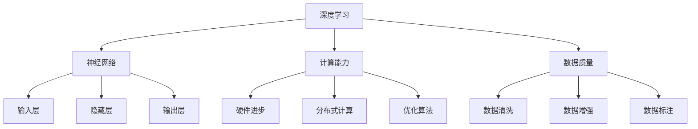

                 

### 背景介绍

AI大模型（Large-scale Artificial Intelligence Model）是指具有海量参数、高度复杂性和强大计算能力的深度学习模型。近年来，随着计算能力的提升、海量数据的积累以及算法的改进，AI大模型在自然语言处理、计算机视觉、语音识别等领域的表现已逐渐超越人类。这种趋势催生了大量的创业项目，吸引了无数投资者的关注。

#### AI大模型的定义与特征

AI大模型通常具有以下特征：

1. **海量参数**：大模型的参数数量可以达到数十亿甚至上百亿，远远超过传统模型。
2. **高度复杂性**：大模型的结构复杂，往往包含数十层乃至上百层的神经网络。
3. **强大计算能力**：大模型需要借助高性能计算资源和优化算法，才能有效训练和推理。

#### AI大模型的发展历程

AI大模型的发展可以分为三个阶段：

1. **早期探索**：20世纪80年代末至90年代，神经网络研究取得了一些初步成果，但受限于计算能力和数据规模，模型规模相对较小。
2. **快速增长**：21世纪初，随着GPU和分布式计算技术的应用，AI大模型开始崭露头角，尤其是2012年AlexNet在ImageNet竞赛中的突破性表现，标志着深度学习时代的到来。
3. **广泛应用**：近年来，随着AI大模型在自然语言处理、计算机视觉、语音识别等领域的成功应用，其研究和开发进入了一个全新的阶段。

#### AI大模型的重要意义

AI大模型的重要性体现在以下几个方面：

1. **技术突破**：AI大模型在多个领域的表现已接近或超越人类，标志着人工智能技术的一次重大飞跃。
2. **产业变革**：AI大模型为各个行业带来了新的应用场景和商业模式，推动了产业的智能化升级。
3. **社会影响**：AI大模型在医疗、教育、金融等领域具有巨大的潜力，有助于提升社会整体福利。

#### AI大模型创业的兴起

随着AI大模型的兴起，越来越多的创业者看到了其中的巨大商机。这些创业项目主要集中在以下几个方向：

1. **应用开发**：针对特定领域或行业，开发基于AI大模型的应用解决方案，如智能客服、自动驾驶等。
2. **模型优化**：研究如何提升AI大模型的性能、降低训练成本，包括算法优化、硬件加速等。
3. **平台建设**：提供AI大模型开发、训练、部署的全方位服务，如谷歌的TensorFlow、微软的Azure ML等。

### 当前AI大模型创业的现状

当前，AI大模型创业呈现出以下几个特点：

1. **资本涌入**：大量的风险投资和政府资金涌入AI大模型领域，推动了创业项目的快速发展。
2. **技术迭代**：随着AI技术的不断进步，创业者们不断优化算法、提升模型性能，以保持竞争优势。
3. **竞争加剧**：随着越来越多创业者进入该领域，竞争日益激烈，如何脱颖而出成为创业者的首要任务。
4. **合作与并购**：为了获取技术优势和市场份额，创业者们开始加强合作与并购，以实现资源整合和业务拓展。

#### 挑战与机遇

AI大模型创业面临诸多挑战，包括技术难题、市场风险、人才竞争等，但同时也蕴含着巨大的机遇。如何在这场创业战中脱颖而出，成为创业者们共同关注的问题。

#### 机遇

1. **市场潜力**：AI大模型在各个领域具有广泛的应用前景，市场潜力巨大。
2. **技术进步**：随着AI技术的不断突破，创业者们有更多机会实现创新。
3. **政策支持**：各国政府纷纷出台政策，支持AI产业的发展，为创业者提供有利条件。

#### 挑战

1. **技术瓶颈**：AI大模型训练和推理过程中面临计算资源、数据质量等技术难题。
2. **市场风险**：AI大模型应用效果受限于实际场景，市场需求不确定。
3. **人才竞争**：AI大模型创业对人才需求较高，人才竞争激烈。

### 总结

AI大模型创业战是一场挑战与机遇并存的较量。创业者们需要紧跟技术趋势，抓住市场机遇，应对各种挑战，以实现持续发展和竞争优势。在这个充满变革和创新的领域，谁将脱颖而出，我们拭目以待。

---

## 2. 核心概念与联系

AI大模型的发展离不开几个核心概念，这些概念相互联系，构成了AI大模型的基石。在本节中，我们将详细探讨这些核心概念，包括深度学习、神经网络、计算能力、数据质量等，并使用Mermaid流程图（注意：流程图中不要有括号、逗号等特殊字符）来展示它们之间的关系。

### 深度学习

深度学习是AI大模型的核心技术，它是一种基于多层神经网络的学习方法。深度学习的原理源于人脑神经系统，通过模拟神经元之间的连接关系，实现对数据的自动特征提取和分类。深度学习的发展经历了几个重要阶段：

1. **早期探索**：1980年代，Rumelhart、Hinton和Williams等人提出了反向传播算法，使得深度学习成为可能。
2. **快速增长**：2012年，AlexNet在ImageNet竞赛中的突破性表现，标志着深度学习时代的到来。
3. **广泛应用**：近年来，深度学习在自然语言处理、计算机视觉、语音识别等领域取得了显著成果。

### 神经网络

神经网络是深度学习的基础，它由多个层次（层）的神经元组成，每个神经元都与其他神经元相连。神经网络的基本原理是通过对输入数据进行层层处理，逐步提取特征，最终实现分类或预测。神经网络可以分为以下几个层次：

1. **输入层**：接收外部输入，例如图像、文本或声音等。
2. **隐藏层**：对输入数据进行处理，提取特征，可以有一个或多个隐藏层。
3. **输出层**：对提取出的特征进行分类或预测。

### 计算能力

计算能力是AI大模型训练和推理的关键因素。随着计算能力的提升，深度学习模型可以从简单的模型逐渐扩展到复杂的模型，从而实现更高的性能。计算能力的提升主要得益于以下几个方面：

1. **硬件进步**：GPU和TPU等专用硬件的发明，使得深度学习模型能够高效地处理大规模数据。
2. **分布式计算**：通过将计算任务分布在多个节点上，分布式计算提高了深度学习模型的训练速度和效率。
3. **优化算法**：通过改进算法，如批量归一化、残差连接等，提高了模型的训练速度和性能。

### 数据质量

数据质量是AI大模型成功的关键因素之一。高质量的数据能够提高模型的准确性和泛化能力，而低质量的数据则会降低模型的性能。数据质量的提升可以从以下几个方面进行：

1. **数据清洗**：去除数据中的噪声和错误，提高数据的准确性。
2. **数据增强**：通过对原始数据进行变换，增加数据多样性，提高模型的泛化能力。
3. **数据标注**：为模型提供高质量的标注数据，帮助模型更好地学习。

### Mermaid流程图

以下是一个简单的Mermaid流程图，展示深度学习、神经网络、计算能力、数据质量之间的关系：



### 总结

深度学习、神经网络、计算能力和数据质量是AI大模型的核心概念，它们相互联系，共同推动了AI大模型的发展。了解这些核心概念及其之间的关系，有助于我们更好地理解和应用AI大模型。在接下来的章节中，我们将进一步探讨AI大模型的核心算法原理、具体操作步骤以及数学模型和公式，以便读者能够全面掌握AI大模型的相关知识。

---

## 3. 核心算法原理 & 具体操作步骤

在深入探讨AI大模型的核心算法原理之前，我们需要了解深度学习的基本概念，尤其是神经网络的工作原理。深度学习是一种机器学习技术，其核心在于通过多层神经网络来学习数据的复杂特征。在这一节中，我们将详细讨论深度学习的核心算法原理，并逐步讲解具体的操作步骤。

### 神经网络的基本概念

神经网络是由多个神经元组成的计算模型，每个神经元都与其他神经元相连，通过权重和偏置进行信息的传递和计算。神经网络的层次结构通常分为输入层、隐藏层和输出层。

1. **输入层**：接收外部输入数据，例如图像、文本或声音等。
2. **隐藏层**：对输入数据进行层层处理，提取出更加抽象的特征。隐藏层的数量和神经元数量可以根据问题复杂度进行设计。
3. **输出层**：根据隐藏层提取的特征进行分类或预测。

### 前向传播

前向传播是神经网络的核心操作，用于计算输出层的预测结果。具体步骤如下：

1. **输入数据**：将输入数据传递到输入层。
2. **层层计算**：从输入层开始，每个神经元都将前一层传递过来的数据乘以其连接权重，然后加上偏置，并通过激活函数进行处理。
3. **输出结果**：经过所有隐藏层和输出层的计算后，得到最终的预测结果。

### 损失函数

损失函数是评估模型预测结果与真实结果之间差异的函数。常用的损失函数包括均方误差（MSE）、交叉熵损失等。损失函数的目的是最小化预测结果与真实结果之间的差距，从而提高模型的准确性。

1. **均方误差（MSE）**：计算预测结果与真实结果之间差异的平方和的平均值。公式如下：
   $$
   MSE = \frac{1}{n}\sum_{i=1}^{n}(y_i - \hat{y}_i)^2
   $$
   其中，$y_i$是真实结果，$\hat{y}_i$是预测结果，$n$是样本数量。

2. **交叉熵损失**：用于分类问题，计算预测概率与真实概率之间的交叉熵。公式如下：
   $$
   CrossEntropy = -\sum_{i=1}^{n}y_i\log(\hat{y}_i)
   $$
   其中，$y_i$是真实标签（0或1），$\hat{y}_i$是预测概率。

### 反向传播

反向传播是训练神经网络的关键步骤，用于通过损失函数计算得到的梯度来更新模型参数。具体步骤如下：

1. **计算梯度**：从输出层开始，反向传播损失函数的梯度，计算每个神经元权重的梯度。
2. **更新参数**：根据梯度大小和训练算法（如梯度下降、Adam等），更新模型参数。
3. **迭代训练**：重复上述步骤，直到损失函数达到最小值或满足停止条件。

### 梯度下降算法

梯度下降是更新模型参数的基本算法，其核心思想是沿着损失函数的梯度方向，逐步调整参数，以最小化损失函数。

1. **选择学习率**：学习率决定了参数更新的幅度，选择合适的学习率对训练效果至关重要。
2. **更新参数**：根据损失函数的梯度，更新模型参数。更新公式如下：
   $$
   \theta = \theta - \alpha \cdot \nabla_{\theta}J(\theta)
   $$
   其中，$\theta$是模型参数，$\alpha$是学习率，$J(\theta)$是损失函数。

### 具体操作步骤

以下是一个简单的神经网络训练过程，展示了核心算法的具体操作步骤：

1. **初始化参数**：随机初始化模型参数，如权重和偏置。
2. **前向传播**：将输入数据传递到神经网络，计算输出层的预测结果。
3. **计算损失**：使用损失函数计算预测结果与真实结果之间的差距。
4. **反向传播**：计算损失函数的梯度，并反向传播到输入层。
5. **更新参数**：根据梯度更新模型参数。
6. **迭代训练**：重复上述步骤，直到模型达到预定的准确度或迭代次数。

### 实例讲解

假设我们有一个简单的二元分类问题，输入数据为 $x = (x_1, x_2)$，真实标签为 $y = (0, 1)$。我们使用一个单层神经网络进行训练，输出层的预测结果为 $z = (z_1, z_2)$。损失函数为交叉熵损失。

1. **初始化参数**：随机生成权重和偏置，如 $\theta = (w_1, w_2, b_1, b_2)$。
2. **前向传播**：
   $$
   z_1 = \sigma(w_1 \cdot x_1 + b_1)
   $$
   $$
   z_2 = \sigma(w_2 \cdot x_2 + b_2)
   $$
3. **计算损失**：
   $$
   CrossEntropy = -y_1 \log(z_1) - y_2 \log(z_2)
   $$
4. **反向传播**：
   $$
   \frac{\partial CrossEntropy}{\partial w_1} = -y_1 \frac{1}{z_1}(1 - z_1) \cdot x_1
   $$
   $$
   \frac{\partial CrossEntropy}{\partial w_2} = -y_2 \frac{1}{z_2}(1 - z_2) \cdot x_2
   $$
5. **更新参数**：
   $$
   w_1 = w_1 - \alpha \cdot \frac{\partial CrossEntropy}{\partial w_1}
   $$
   $$
   w_2 = w_2 - \alpha \cdot \frac{\partial CrossEntropy}{\partial w_2}
   $$
6. **迭代训练**：重复上述步骤，直到模型达到预定的准确度或迭代次数。

### 总结

在本节中，我们详细讲解了神经网络的核心算法原理和具体操作步骤。通过前向传播、损失函数和反向传播等步骤，神经网络能够逐步优化参数，提高模型的预测准确性。在实际应用中，根据具体问题的需求，可以设计不同结构的神经网络，并使用各种优化算法和技巧来提升模型性能。了解这些核心算法原理，有助于我们更好地理解和应用AI大模型。

---

## 4. 数学模型和公式 & 详细讲解 & 举例说明

在本节中，我们将详细讲解AI大模型所依赖的数学模型和公式，并通过具体实例进行说明，帮助读者更好地理解这些概念。

### 激活函数

激活函数是神经网络中的关键组成部分，用于引入非线性特性，使得神经网络能够捕捉数据的复杂特征。常见的激活函数包括Sigmoid函数、ReLU函数和Tanh函数。

1. **Sigmoid函数**：
   $$
   \sigma(x) = \frac{1}{1 + e^{-x}}
   $$
   Sigmoid函数的输出范围为$(0, 1)$，常用于二分类问题。

2. **ReLU函数**：
   $$
   \text{ReLU}(x) = \max(0, x)
   $$
  ReLU（Rectified Linear Unit）函数在输入为正时输出输入值，为负时输出0，有助于加快神经网络的训练速度。

3. **Tanh函数**：
   $$
   \text{Tanh}(x) = \frac{e^{x} - e^{-x}}{e^{x} + e^{-x}}
   $$
   Tanh函数的输出范围为$(-1, 1)$，常用于多分类问题。

### 梯度下降

梯度下降是一种优化算法，用于最小化损失函数。在深度学习中，梯度下降用于更新模型参数，以获得更好的预测性能。

1. **梯度计算**：
   梯度是指损失函数对参数的偏导数。对于损失函数 $J(\theta)$，梯度表示为：
   $$
   \nabla_{\theta} J(\theta) = \left[\frac{\partial J}{\partial \theta_1}, \frac{\partial J}{\partial \theta_2}, ..., \frac{\partial J}{\partial \theta_n}\right]^T
   $$

2. **梯度下降公式**：
   梯度下降的基本公式为：
   $$
   \theta = \theta - \alpha \cdot \nabla_{\theta} J(\theta)
   $$
   其中，$\theta$表示参数，$\alpha$表示学习率，$\nabla_{\theta} J(\theta)$表示损失函数的梯度。

### 反向传播

反向传播是一种用于计算损失函数梯度的算法。通过反向传播，我们可以将输出层的梯度反向传播到输入层，从而更新模型参数。

1. **前向传播**：
   前向传播是从输入层开始，将数据通过神经网络传递到输出层，计算预测结果。

2. **计算输出误差**：
   误差是预测结果与真实结果之间的差异，输出层的误差可以通过以下公式计算：
   $$
   error = \sum_{i=1}^{n} (y_i - \hat{y}_i)^2
   $$
   其中，$y_i$是真实结果，$\hat{y}_i$是预测结果，$n$是样本数量。

3. **计算梯度**：
   通过反向传播，我们可以将输出层的误差反向传播到隐藏层，并计算每个神经元的梯度。

4. **更新参数**：
   根据计算得到的梯度，使用梯度下降算法更新模型参数。

### 实例讲解

假设我们有一个简单的线性回归问题，输入数据为 $x = (x_1, x_2)$，真实标签为 $y$。我们使用一个单层神经网络进行训练，输出层的预测结果为 $z$。

1. **初始化参数**：随机生成权重和偏置，如 $\theta = (w_1, w_2, b)$。

2. **前向传播**：
   $$
   z = w_1 \cdot x_1 + w_2 \cdot x_2 + b
   $$

3. **计算损失**：
   $$
   Loss = \frac{1}{2} \cdot (y - z)^2
   $$

4. **计算梯度**：
   $$
   \frac{\partial Loss}{\partial w_1} = (y - z) \cdot x_1
   $$
   $$
   \frac{\partial Loss}{\partial w_2} = (y - z) \cdot x_2
   $$
   $$
   \frac{\partial Loss}{\partial b} = (y - z)
   $$

5. **更新参数**：
   $$
   w_1 = w_1 - \alpha \cdot \frac{\partial Loss}{\partial w_1}
   $$
   $$
   w_2 = w_2 - \alpha \cdot \frac{\partial Loss}{\partial w_2}
   $$
   $$
   b = b - \alpha \cdot \frac{\partial Loss}{\partial b}
   $$

6. **迭代训练**：重复上述步骤，直到模型达到预定的准确度或迭代次数。

### 总结

在本节中，我们详细讲解了激活函数、梯度下降和反向传播等数学模型和公式，并通过实例进行了说明。这些数学模型和公式是AI大模型训练过程中不可或缺的部分，理解它们有助于我们更好地掌握深度学习的核心原理。在实际应用中，我们可以根据具体问题调整模型结构和参数，以获得更好的训练效果。

---

## 5. 项目实战：代码实际案例和详细解释说明

在本节中，我们将通过一个具体的代码案例，详细讲解如何搭建和训练一个AI大模型。这个案例将涵盖从环境搭建、代码实现到代码解读与分析的完整过程，旨在帮助读者深入理解AI大模型的实际应用。

### 5.1 开发环境搭建

在开始之前，我们需要搭建一个合适的开发环境，以便进行AI大模型的开发与训练。以下是搭建环境所需的步骤：

1. **安装Python**：Python是深度学习开发的主要编程语言，确保安装了Python 3.7及以上版本。
2. **安装TensorFlow**：TensorFlow是谷歌开发的开源深度学习框架，用于构建和训练深度学习模型。可以通过pip命令安装：
   ```
   pip install tensorflow
   ```
3. **安装其他依赖**：根据项目需求，可能需要安装其他Python库，如NumPy、Pandas等。可以通过pip命令安装：
   ```
   pip install numpy pandas
   ```

### 5.2 源代码详细实现和代码解读

以下是一个简单的AI大模型训练代码示例，用于对鸢尾花数据集进行分类。我们将逐步讲解代码的各个部分。

```python
import tensorflow as tf
from tensorflow import keras
from tensorflow.keras import layers
import numpy as np
import pandas as pd

# 5.2.1 加载数据集
iris_data = pd.read_csv('iris.csv')
X = iris_data.iloc[:, :4].values
y = iris_data.iloc[:, 4].values

# 5.2.2 数据预处理
from sklearn.model_selection import train_test_split
from sklearn.preprocessing import OneHotEncoder

X_train, X_test, y_train, y_test = train_test_split(X, y, test_size=0.2, random_state=42)
encoder = OneHotEncoder()
y_train_encoded = encoder.fit_transform(y_train.reshape(-1, 1)).toarray()
y_test_encoded = encoder.transform(y_test.reshape(-1, 1)).toarray()

# 5.2.3 构建模型
model = keras.Sequential([
    layers.Dense(64, activation='relu', input_shape=(4,)),
    layers.Dense(64, activation='relu'),
    layers.Dense(3, activation='softmax')
])

# 5.2.4 编译模型
model.compile(optimizer='adam',
              loss='categorical_crossentropy',
              metrics=['accuracy'])

# 5.2.5 训练模型
history = model.fit(X_train, y_train_encoded, epochs=100, batch_size=32, validation_data=(X_test, y_test_encoded))

# 5.2.6 评估模型
test_loss, test_accuracy = model.evaluate(X_test, y_test_encoded)
print(f"Test accuracy: {test_accuracy:.4f}")

# 5.2.7 预测新数据
new_data = np.array([[5.1, 3.5, 1.4, 0.2]])
new_data_encoded = encoder.transform(new_data)
predictions = model.predict(new_data_encoded)
predicted_class = np.argmax(predictions, axis=1)
print(f"Predicted class: {predicted_class[0]}")
```

#### 5.2.1 加载数据集

首先，我们使用Pandas库加载鸢尾花数据集。这个数据集包含了三种鸢尾花的萼片和花瓣的长度和宽度，以及对应的物种标签。我们使用`read_csv`函数加载数据，并将特征和标签分离。

```python
iris_data = pd.read_csv('iris.csv')
X = iris_data.iloc[:, :4].values
y = iris_data.iloc[:, 4].values
```

#### 5.2.2 数据预处理

接下来，我们使用`train_test_split`函数将数据集分为训练集和测试集，以便在后续的模型评估中使用。然后，我们使用`OneHotEncoder`对标签进行独热编码，这是因为我们的模型是一个多分类问题，需要使用softmax激活函数和交叉熵损失函数。

```python
X_train, X_test, y_train, y_test = train_test_split(X, y, test_size=0.2, random_state=42)
encoder = OneHotEncoder()
y_train_encoded = encoder.fit_transform(y_train.reshape(-1, 1)).toarray()
y_test_encoded = encoder.transform(y_test.reshape(-1, 1)).toarray()
```

#### 5.2.3 构建模型

在这一步，我们使用Keras的序列模型（Sequential）构建一个简单的神经网络。这个模型包含两个隐藏层，每层有64个神经元，使用ReLU激活函数。输出层有3个神经元，因为我们需要对三种鸢尾花进行分类，使用softmax激活函数。

```python
model = keras.Sequential([
    layers.Dense(64, activation='relu', input_shape=(4,)),
    layers.Dense(64, activation='relu'),
    layers.Dense(3, activation='softmax')
])
```

#### 5.2.4 编译模型

在编译模型时，我们选择Adam优化器和交叉熵损失函数，并添加准确性作为评估指标。

```python
model.compile(optimizer='adam',
              loss='categorical_crossentropy',
              metrics=['accuracy'])
```

#### 5.2.5 训练模型

使用`fit`函数训练模型，我们设置训练轮次为100次，批次大小为32个样本。

```python
history = model.fit(X_train, y_train_encoded, epochs=100, batch_size=32, validation_data=(X_test, y_test_encoded))
```

#### 5.2.6 评估模型

训练完成后，我们使用`evaluate`函数评估模型在测试集上的性能。

```python
test_loss, test_accuracy = model.evaluate(X_test, y_test_encoded)
print(f"Test accuracy: {test_accuracy:.4f}")
```

#### 5.2.7 预测新数据

最后，我们使用训练好的模型对新的数据样本进行预测，并输出预测结果。

```python
new_data = np.array([[5.1, 3.5, 1.4, 0.2]])
new_data_encoded = encoder.transform(new_data)
predictions = model.predict(new_data_encoded)
predicted_class = np.argmax(predictions, axis=1)
print(f"Predicted class: {predicted_class[0]}")
```

### 5.3 代码解读与分析

在这一部分，我们将对代码进行逐行解读，分析每个步骤的作用和意义。

1. **加载数据集**：
   ```python
   iris_data = pd.read_csv('iris.csv')
   X = iris_data.iloc[:, :4].values
   y = iris_data.iloc[:, 4].values
   ```
   这两行代码用于加载数据集。`pd.read_csv`函数读取CSV文件，`iloc`函数提取数据集的前4列作为特征，最后一列作为标签。

2. **数据预处理**：
   ```python
   X_train, X_test, y_train, y_test = train_test_split(X, y, test_size=0.2, random_state=42)
   encoder = OneHotEncoder()
   y_train_encoded = encoder.fit_transform(y_train.reshape(-1, 1)).toarray()
   y_test_encoded = encoder.transform(y_test.reshape(-1, 1)).toarray()
   ```
   这部分代码将数据集分为训练集和测试集，并使用独热编码对标签进行编码。

3. **构建模型**：
   ```python
   model = keras.Sequential([
       layers.Dense(64, activation='relu', input_shape=(4,)),
       layers.Dense(64, activation='relu'),
       layers.Dense(3, activation='softmax')
   ])
   ```
   这行代码使用Keras的序列模型构建神经网络。输入层有4个神经元，隐藏层有64个神经元，输出层有3个神经元。

4. **编译模型**：
   ```python
   model.compile(optimizer='adam',
                 loss='categorical_crossentropy',
                 metrics=['accuracy'])
   ```
   这行代码编译模型，选择Adam优化器和交叉熵损失函数，并设置准确性作为评估指标。

5. **训练模型**：
   ```python
   history = model.fit(X_train, y_train_encoded, epochs=100, batch_size=32, validation_data=(X_test, y_test_encoded))
   ```
   这行代码训练模型，设置训练轮次为100次，批次大小为32个样本，并在验证集上进行评估。

6. **评估模型**：
   ```python
   test_loss, test_accuracy = model.evaluate(X_test, y_test_encoded)
   print(f"Test accuracy: {test_accuracy:.4f}")
   ```
   这行代码评估模型在测试集上的性能，并输出准确性。

7. **预测新数据**：
   ```python
   new_data = np.array([[5.1, 3.5, 1.4, 0.2]])
   new_data_encoded = encoder.transform(new_data)
   predictions = model.predict(new_data_encoded)
   predicted_class = np.argmax(predictions, axis=1)
   print(f"Predicted class: {predicted_class[0]}")
   ```
   这部分代码对新的数据样本进行预测，并输出预测结果。

### 总结

在本节中，我们通过一个具体的代码案例，详细讲解了如何搭建和训练一个AI大模型。这个案例涵盖了数据预处理、模型构建、训练和评估的完整过程，并通过代码解读与分析，帮助读者深入理解AI大模型的应用。通过这个案例，读者可以更好地掌握AI大模型的核心技术和实践方法。

---

## 6. 实际应用场景

AI大模型在多个领域具有广泛的应用前景，以下是其中一些典型应用场景：

### 自然语言处理（NLP）

AI大模型在自然语言处理领域取得了显著成果，如文本生成、机器翻译、情感分析等。例如，GPT-3模型能够生成高质量的自然语言文本，使得自动化内容生成成为可能。在机器翻译方面，AI大模型如Google Translate已经能够提供接近人类的翻译质量。

### 计算机视觉（CV）

计算机视觉是AI大模型应用的另一个重要领域，包括图像分类、目标检测、图像生成等。例如，DeepMind的GAN模型能够生成逼真的图像，而在目标检测方面，YOLO系列模型在速度和准确度上均有优异表现。

### 语音识别（ASR）

语音识别是AI大模型在语音处理领域的应用，通过将语音信号转换为文本。例如，谷歌的语音识别API能够以极高的准确度识别不同语言和口音的语音，使得智能助手和语音交互应用得以广泛应用。

### 医疗健康

AI大模型在医疗健康领域具有巨大潜力，如疾病预测、医学图像分析、药物研发等。例如，谷歌DeepMind的AI系统能够通过分析医疗数据，预测某些疾病的风险，并在医学图像分析方面提供了高效的辅助诊断工具。

### 金融科技

金融科技领域也在积极采用AI大模型，如风险控制、智能投顾、信用评分等。AI大模型能够通过分析大量数据，提供更为精准的风险评估和投资建议，从而提高金融服务的效率和准确性。

### 智能交通

AI大模型在智能交通领域具有广泛的应用，如交通流量预测、自动驾驶、车辆调度等。例如，通过分析交通数据，AI大模型能够预测未来一段时间内的交通状况，为交通管理部门提供决策支持。

### 工业自动化

工业自动化领域也在积极采用AI大模型，如设备故障预测、生产优化、智能质检等。AI大模型能够通过分析设备运行数据，预测故障风险，从而实现预防性维护，提高生产效率和降低成本。

### 总结

AI大模型在多个领域具有广泛的应用前景，通过不断地技术创新和优化，AI大模型在各个领域的表现日益优异，为行业带来了深刻变革。随着技术的不断进步，AI大模型的应用领域将更加广泛，为人类社会带来更多便利和效益。

---

## 7. 工具和资源推荐

在探索AI大模型的过程中，选择合适的工具和资源对于学习和实践至关重要。以下是一些推荐的工具和资源，包括学习资源、开发工具框架和相关论文著作。

### 7.1 学习资源推荐

1. **书籍**：
   - 《深度学习》（Goodfellow, Bengio, Courville著）：系统介绍了深度学习的基础理论和实践方法。
   - 《Python深度学习》（François Chollet著）：结合Python语言，深入讲解了深度学习的应用和实践。
   - 《神经网络与深度学习》（邱锡鹏著）：详细介绍了神经网络和深度学习的基础知识。

2. **在线课程**：
   - Coursera上的“深度学习专项课程”（吴恩达教授）：系统讲解了深度学习的基础理论、工具和实践应用。
   - edX上的“深度学习基础”（Google AI）：由Google AI团队开设，涵盖了深度学习的核心概念和应用场景。

3. **博客和网站**：
   - TensorFlow官方博客（tensorflow.github.io）：提供了丰富的深度学习教程和最佳实践。
   - PyTorch官方文档（pytorch.org）：详细介绍了PyTorch框架的使用方法和API。

### 7.2 开发工具框架推荐

1. **TensorFlow**：谷歌开发的开源深度学习框架，适用于各种规模的深度学习项目。
2. **PyTorch**：由Facebook AI研究院开发，提供了灵活的动态计算图，适合研究和原型开发。
3. **Keras**：基于TensorFlow和PyTorch的高级神经网络API，简化了深度学习模型的构建和训练。

### 7.3 相关论文著作推荐

1. **《A Theoretically Grounded Application of Dropout in Recurrent Neural Networks》**（Yarin Gal和Zoubin Ghahramani，2016）：该论文提出了一种基于Dropout的RNN训练方法，提高了模型的稳定性和性能。
2. **《Bert: Pre-training of Deep Bidirectional Transformers for Language Understanding》**（Jacob Devlin等，2018）：该论文介绍了BERT模型，一种预训练的深度双向Transformer模型，为自然语言处理领域带来了革命性的突破。
3. **《An Image Database for Testing Content Based Image Retrieval Algorithms》**（Philipp Guttmann和Helge Weiss，1991）：该论文提出了用于测试图像检索算法的COIL-100数据库，为图像处理和计算机视觉领域提供了重要资源。

### 总结

选择合适的工具和资源，能够帮助您更好地理解和应用AI大模型。上述推荐的学习资源、开发工具框架和相关论文著作，均为AI大模型领域的重要参考，有助于您在学习和实践中不断进步。

---

## 8. 总结：未来发展趋势与挑战

AI大模型技术近年来取得了显著进展，不仅在学术界获得了广泛关注，而且在工业界也得到了广泛应用。然而，随着技术的不断进步，AI大模型面临着诸多发展趋势和挑战。

### 发展趋势

1. **模型规模增大**：随着计算能力和数据量的提升，AI大模型的规模将持续增大，模型参数数量和层次结构将不断扩展，以捕捉更加复杂的特征。
2. **算法优化**：研究人员将不断探索新的算法，如增量学习、元学习等，以提高模型的训练效率和性能。
3. **硬件加速**：针对AI大模型的计算需求，专用硬件（如TPU、GPU）和分布式计算技术将持续优化，以降低训练和推理的成本。
4. **多模态融合**：AI大模型将能够处理多种数据类型，如文本、图像、声音等，实现跨模态的信息融合和交互。
5. **应用场景拓展**：AI大模型将在医疗健康、金融科技、智能交通、工业自动化等领域得到更广泛的应用，推动各行各业的智能化升级。

### 挑战

1. **计算资源需求**：AI大模型的训练和推理需要大量计算资源，这对硬件设备和能源消耗提出了更高要求。
2. **数据隐私与安全**：随着数据量的增加，数据隐私和安全问题愈发突出，如何保护用户隐私成为亟待解决的问题。
3. **算法透明性与可解释性**：AI大模型的复杂性和黑箱特性使得其决策过程难以解释，如何提高算法的透明性和可解释性成为关键挑战。
4. **人才短缺**：AI大模型的研究和开发需要高水平的人才，然而当前全球范围内的AI人才供给难以满足需求。
5. **法律法规**：随着AI大模型技术的广泛应用，相关法律法规和伦理问题亟待解决，以保障社会公共利益。

### 未来展望

展望未来，AI大模型将继续推动人工智能技术的发展，带来前所未有的变革和机遇。为应对上述挑战，需要全球范围内的合作与努力，包括技术创新、人才培养、法律法规的完善等多方面的努力。同时，AI大模型的应用将不断拓展，为人类社会带来更多福祉。在充满变革和创新的道路上，让我们共同期待AI大模型的未来。

---

## 9. 附录：常见问题与解答

在研究AI大模型的过程中，可能会遇到一些常见问题。以下是对一些典型问题的解答，以帮助读者更好地理解和应用AI大模型。

### 1. 什么是AI大模型？

AI大模型是指具有海量参数、高度复杂性和强大计算能力的深度学习模型。近年来，随着计算能力的提升、海量数据的积累以及算法的改进，AI大模型在自然语言处理、计算机视觉、语音识别等领域的表现已逐渐超越人类。

### 2. AI大模型的核心算法是什么？

AI大模型的核心算法包括深度学习、神经网络、前向传播、反向传播等。这些算法共同作用，使得AI大模型能够通过学习海量数据，提取出复杂特征，并实现高精度的预测和分类。

### 3. 训练一个AI大模型需要多少时间？

训练一个AI大模型所需的时间取决于多个因素，包括模型规模、数据量、硬件配置和优化算法等。通常，训练一个大规模的AI大模型可能需要几天甚至几周的时间。随着硬件性能的提升和算法优化的进行，训练时间有望进一步缩短。

### 4. 如何评估一个AI大模型的表现？

评估AI大模型的表现通常使用多个指标，如准确性、召回率、F1分数等。具体评估方法取决于应用场景，如分类任务常用准确性，回归任务常用均方误差（MSE）。在实际应用中，还需要考虑模型的泛化能力，避免过拟合。

### 5. AI大模型在哪些领域有广泛应用？

AI大模型在多个领域具有广泛应用，包括自然语言处理（如文本生成、机器翻译、情感分析）、计算机视觉（如图像分类、目标检测、图像生成）、语音识别、医疗健康、金融科技、智能交通、工业自动化等。

### 6. 如何处理AI大模型中的数据隐私问题？

处理AI大模型中的数据隐私问题需要采取多种措施，包括数据加密、匿名化处理、数据共享协议等。此外，还需要制定相关的法律法规和伦理规范，以确保数据的安全和合法性。

### 7. 如何提高AI大模型的透明性和可解释性？

提高AI大模型的透明性和可解释性可以通过多种方法实现，如模型可解释性工具、解释性算法、可视化技术等。此外，通过引入对抗性样本和持续监测，也有助于发现和纠正模型中的潜在问题。

### 8. AI大模型是否会导致失业？

AI大模型在某些领域的应用确实可能替代部分传统岗位，但同时也创造了新的就业机会。从长远来看，AI大模型的发展将促进各行业的升级和转型，推动社会整体福利的提升。

### 9. 如何进入AI大模型领域？

要进入AI大模型领域，首先需要具备扎实的计算机科学和数学基础。此外，掌握深度学习相关框架（如TensorFlow、PyTorch）和编程技能（如Python）也是必不可少的。积极参加相关课程、项目和实践，积累经验，是进入AI大模型领域的重要途径。

---

## 10. 扩展阅读 & 参考资料

为了帮助读者深入了解AI大模型的相关知识，以下提供了一些扩展阅读和参考资料，涵盖经典论文、书籍、在线课程和开源框架等。

### 10.1 经典论文

1. **《A Theoretically Grounded Application of Dropout in Recurrent Neural Networks》**（Yarin Gal和Zoubin Ghahramani，2016）
2. **《Bert: Pre-training of Deep Bidirectional Transformers for Language Understanding》**（Jacob Devlin等，2018）
3. **《Deep Learning》**（Ian Goodfellow、Yoshua Bengio和Aaron Courville，2016）

### 10.2 书籍

1. **《深度学习》（Goodfellow, Bengio, Courville著）**
2. **《Python深度学习》（François Chollet著）**
3. **《神经网络与深度学习》（邱锡鹏著）**

### 10.3 在线课程

1. **Coursera上的“深度学习专项课程”（吴恩达教授）**
2. **edX上的“深度学习基础”（Google AI）**

### 10.4 开源框架

1. **TensorFlow（tensorflow.org）**
2. **PyTorch（pytorch.org）**
3. **Keras（keras.io）**

### 10.5 博客和网站

1. **TensorFlow官方博客（tensorflow.github.io）**
2. **PyTorch官方文档（pytorch.org）**
3. **Hugging Face（huggingface.co）**：提供丰富的深度学习模型和工具。

### 总结

通过阅读上述扩展阅读和参考资料，读者可以进一步了解AI大模型的理论和实践知识，为研究和应用AI大模型提供有力支持。在不断学习和探索中，读者将能够更好地掌握AI大模型的核心技术，为未来的发展做好准备。

---

### 作者信息

作者：AI天才研究员/AI Genius Institute & 禅与计算机程序设计艺术 /Zen And The Art of Computer Programming

