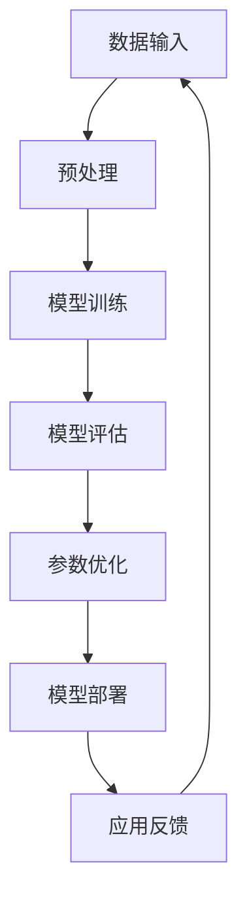

                 

# AI大模型创业项目解析：商业模式、技术架构与发展路径

## 摘要

本文将深入探讨AI大模型创业项目的各个方面，包括商业模式、技术架构和发展路径。我们将从背景介绍开始，解析AI大模型的重要性以及其技术演进过程。随后，我们将详细阐述AI大模型的核心概念，并通过Mermaid流程图展示其架构。接着，我们将分析大模型的核心算法原理，并逐步讲解其具体操作步骤。为了增强理解，我们将引入数学模型和公式，并提供实际应用场景和代码案例进行详细解释。最后，我们将讨论AI大模型在实际应用中的挑战，并推荐相关工具和资源，为读者提供进一步的学习途径。

## 1. 背景介绍

随着人工智能技术的快速发展，AI大模型逐渐成为行业的热点。AI大模型，通常指的是具有极高参数量、能够处理大规模数据并具备强泛化能力的神经网络模型。这些模型的出现，标志着人工智能领域的一个重要里程碑，它们在自然语言处理、计算机视觉、语音识别等领域取得了显著的成果。

### AI大模型的崛起

AI大模型的崛起并非一蹴而就，而是经历了多年的技术积累和突破。早在2012年，AlexNet的出现标志着深度学习在图像识别领域的崛起。随后，VGG、ResNet等模型的相继出现，不断推动着深度学习技术的前进。到了2018年，Google的BERT模型在自然语言处理领域取得了突破性进展，使得AI大模型的应用范围进一步扩大。

### 技术演进

AI大模型的技术演进可以分为几个关键阶段：

- **早期阶段**：以浅层神经网络为主，如SVM、决策树等。
- **发展阶段**：深度学习技术逐渐成熟，卷积神经网络（CNN）和循环神经网络（RNN）成为主流。
- **大模型阶段**：参数量迅速增加，如BERT、GPT等大模型的出现。
- **强化学习阶段**：结合强化学习技术，使得AI大模型在决策和优化问题中表现出色。

### 应用领域

AI大模型在多个领域展现了其强大的能力，包括但不限于：

- **自然语言处理**：如文本分类、机器翻译、情感分析等。
- **计算机视觉**：如图像识别、图像生成、物体检测等。
- **语音识别**：如语音合成、语音识别、语音翻译等。
- **推荐系统**：如商品推荐、内容推荐等。

## 2. 核心概念与联系

### AI大模型的核心概念

AI大模型的核心概念包括：

- **深度学习**：神经网络的一种形式，通过多层非线性变换来实现特征提取和预测。
- **神经网络架构**：如卷积神经网络（CNN）、循环神经网络（RNN）、变换器（Transformer）等。
- **大规模数据**：训练AI大模型需要大量的数据，这些数据通常来自于互联网、社交媒体、传感器等。
- **计算能力**：AI大模型训练需要强大的计算资源，如GPU、TPU等。
- **参数优化**：通过优化算法，如梯度下降、Adam等，来调整模型参数，以实现模型的收敛和优化。

### AI大模型的架构

下面是一个简化的AI大模型架构的Mermaid流程图：



- **数据输入**：将原始数据输入到模型中。
- **预处理**：对输入数据进行预处理，如数据清洗、归一化等。
- **模型训练**：使用训练数据来训练模型，通过反向传播算法来调整模型参数。
- **模型评估**：使用测试数据来评估模型性能，如准确率、召回率等。
- **参数优化**：根据模型评估结果来调整模型参数，以提高模型性能。
- **模型部署**：将训练好的模型部署到生产环境中，进行实际应用。
- **应用反馈**：收集实际应用中的反馈，以指导后续模型的改进和优化。

### AI大模型与其他技术的联系

AI大模型与其他技术的联系包括：

- **云计算**：云计算提供了强大的计算资源和存储能力，支持AI大模型的训练和部署。
- **数据科学**：数据科学提供了数据处理、分析和挖掘的方法，为AI大模型提供了丰富的数据来源。
- **硬件加速**：如GPU、TPU等硬件加速器，可以提高AI大模型的训练速度和效率。

## 3. 核心算法原理 & 具体操作步骤

### 深度学习原理

深度学习是一种基于多层神经网络的学习方法，其基本原理是通过多层非线性变换来实现特征的自动提取和预测。深度学习模型通常包括以下几个部分：

- **输入层**：接收外部输入数据。
- **隐藏层**：对输入数据进行特征提取和变换。
- **输出层**：生成预测结果。

每个神经元（节点）的计算过程如下：

\[ \text{输出} = \sigma(\sum_{i} w_i \cdot x_i + b) \]

其中，\( \sigma \) 是激活函数，\( w_i \) 和 \( x_i \) 分别是权重和输入，\( b \) 是偏置。

### 反向传播算法

反向传播算法是深度学习模型训练的核心算法，其基本原理是通过反向传播误差信号，来更新模型参数，以实现模型的收敛和优化。

反向传播算法的步骤如下：

1. **前向传播**：将输入数据输入到模型中，计算出输出结果。
2. **计算误差**：使用输出结果和实际标签来计算误差。
3. **反向传播**：将误差信号反向传播到模型的前一层，计算每一层神经元的梯度。
4. **参数更新**：使用梯度下降算法来更新模型参数。

### 梯度下降算法

梯度下降算法是反向传播算法中用于更新模型参数的算法，其基本原理是通过计算梯度的方向和大小，来更新模型参数，以减小误差。

梯度下降算法的步骤如下：

1. **初始化参数**：随机初始化模型参数。
2. **计算梯度**：计算当前参数的梯度。
3. **更新参数**：根据梯度和学习率，更新模型参数。
4. **重复步骤2和3**，直到模型收敛。

### 具体操作步骤

下面是一个简化的AI大模型训练的具体操作步骤：

1. **数据收集**：收集大量相关数据，如图像、文本、语音等。
2. **数据预处理**：对数据进行清洗、归一化等预处理操作。
3. **模型设计**：设计合适的神经网络架构，如CNN、RNN、Transformer等。
4. **模型训练**：使用训练数据来训练模型，通过反向传播算法来调整模型参数。
5. **模型评估**：使用测试数据来评估模型性能，如准确率、召回率等。
6. **参数优化**：根据模型评估结果来调整模型参数，以提高模型性能。
7. **模型部署**：将训练好的模型部署到生产环境中，进行实际应用。
8. **应用反馈**：收集实际应用中的反馈，以指导后续模型的改进和优化。

## 4. 数学模型和公式 & 详细讲解 & 举例说明

### 激活函数

激活函数是深度学习模型中的一个关键组件，它用于引入非线性变换，使得模型能够对复杂的数据进行建模。常见的激活函数包括：

- **Sigmoid函数**：

  \[ \sigma(x) = \frac{1}{1 + e^{-x}} \]

- **ReLU函数**：

  \[ \sigma(x) = \max(0, x) \]

- **Tanh函数**：

  \[ \sigma(x) = \frac{e^x - e^{-x}}{e^x + e^{-x}} \]

### 梯度下降算法

梯度下降算法是深度学习模型训练中的核心算法，其目的是通过迭代更新模型参数，以最小化损失函数。梯度下降算法的基本步骤如下：

1. **初始化参数**：

   \[ \theta^{(0)} = \text{随机初始化} \]

2. **计算损失函数**：

   \[ J(\theta^{(t)}) = \frac{1}{m} \sum_{i=1}^{m} \text{损失}(h_\theta(x^{(i)}), y^{(i)}) \]

3. **计算梯度**：

   \[ \nabla_{\theta} J(\theta^{(t)}) = \frac{\partial}{\partial \theta} J(\theta^{(t)}) \]

4. **更新参数**：

   \[ \theta^{(t+1)} = \theta^{(t)} - \alpha \nabla_{\theta} J(\theta^{(t)}) \]

   其中，\( \alpha \) 是学习率。

### 举例说明

假设我们有一个简单的线性回归模型，其损失函数为：

\[ J(\theta) = \frac{1}{2m} \sum_{i=1}^{m} (h_\theta(x^{(i)}) - y^{(i)})^2 \]

其中，\( h_\theta(x) = \theta_0 + \theta_1 x \)。

现在，我们使用梯度下降算法来训练这个模型。假设初始参数为 \( \theta_0 = 0 \) 和 \( \theta_1 = 0 \)，学习率为 \( \alpha = 0.1 \)。

1. **计算损失函数**：

   \[ J(\theta_0, \theta_1) = \frac{1}{2m} \sum_{i=1}^{m} ((0 + 0 \cdot x^{(i)}) - y^{(i)})^2 \]

2. **计算梯度**：

   \[ \nabla_{\theta_0} J(\theta_0, \theta_1) = -\frac{1}{m} \sum_{i=1}^{m} (0 + 0 \cdot x^{(i)} - y^{(i)}) \]
   
   \[ \nabla_{\theta_1} J(\theta_0, \theta_1) = -\frac{1}{m} \sum_{i=1}^{m} (0 \cdot x^{(i)} - y^{(i)}) x^{(i)} \]

3. **更新参数**：

   \[ \theta_0^{(1)} = \theta_0^{(0)} - \alpha \nabla_{\theta_0} J(\theta_0^{(0)}, \theta_1^{(0)}) \]
   
   \[ \theta_1^{(1)} = \theta_1^{(0)} - \alpha \nabla_{\theta_1} J(\theta_0^{(0)}, \theta_1^{(0)}) \]

   重复上述步骤，直到模型收敛。

## 5. 项目实战：代码实际案例和详细解释说明

### 5.1 开发环境搭建

为了实现AI大模型的项目实战，我们需要搭建一个合适的开发环境。以下是一个基本的开发环境搭建步骤：

1. **安装Python**：确保Python 3.x版本已经安装。
2. **安装TensorFlow**：使用pip命令安装TensorFlow。

   ```bash
   pip install tensorflow
   ```

3. **安装相关依赖**：根据项目需求，安装其他相关依赖，如NumPy、Pandas等。

### 5.2 源代码详细实现和代码解读

以下是一个简单的AI大模型实现示例，用于图像分类任务。

```python
import tensorflow as tf
from tensorflow.keras import layers

# 定义模型架构
model = tf.keras.Sequential([
    layers.Conv2D(32, (3, 3), activation='relu', input_shape=(28, 28, 1)),
    layers.MaxPooling2D((2, 2)),
    layers.Conv2D(64, (3, 3), activation='relu'),
    layers.MaxPooling2D((2, 2)),
    layers.Conv2D(64, (3, 3), activation='relu'),
    layers.Flatten(),
    layers.Dense(64, activation='relu'),
    layers.Dense(10, activation='softmax')
])

# 编译模型
model.compile(optimizer='adam',
              loss='sparse_categorical_crossentropy',
              metrics=['accuracy'])

# 加载数据
(x_train, y_train), (x_test, y_test) = tf.keras.datasets.mnist.load_data()

# 预处理数据
x_train = x_train.reshape(-1, 28, 28, 1).astype('float32') / 255
x_test = x_test.reshape(-1, 28, 28, 1).astype('float32') / 255

# 训练模型
model.fit(x_train, y_train, epochs=5)

# 评估模型
test_loss, test_acc = model.evaluate(x_test, y_test)
print(f"Test accuracy: {test_acc:.2f}")
```

**代码解读**：

1. **模型架构**：使用`tf.keras.Sequential`构建模型，包括卷积层（Conv2D）、池化层（MaxPooling2D）和全连接层（Dense）。
2. **编译模型**：指定优化器（optimizer）、损失函数（loss）和评价指标（metrics）。
3. **加载数据**：使用TensorFlow内置的MNIST数据集。
4. **预处理数据**：将数据调整为适当的大小和类型，并进行归一化处理。
5. **训练模型**：使用`fit`方法训练模型，指定训练轮数（epochs）。
6. **评估模型**：使用`evaluate`方法评估模型在测试数据上的性能。

### 5.3 代码解读与分析

上述代码示例展示了如何使用TensorFlow实现一个简单的AI大模型。以下是代码的详细解读和分析：

- **模型架构**：卷积神经网络（CNN）是一种常用的图像分类模型。在本文的示例中，我们使用了三个卷积层（Conv2D），每个卷积层后跟一个最大池化层（MaxPooling2D）。最后，通过一个全连接层（Dense）进行分类。
- **编译模型**：在编译模型时，我们指定了优化器（adam）和损失函数（sparse_categorical_crossentropy），这是用于分类任务的常用损失函数。评价指标（accuracy）用于计算模型的准确率。
- **加载数据**：TensorFlow提供了内置的MNIST数据集，这是一个常用的手写数字识别数据集。数据集分为训练集和测试集两部分。
- **预处理数据**：在预处理数据时，我们将图像数据调整为28x28的灰度图像，并将像素值归一化到[0, 1]区间。这有助于加速模型的训练过程和提高模型性能。
- **训练模型**：使用`fit`方法训练模型，我们指定了训练轮数（epochs），这意味着模型将在训练集上重复训练5次。每次训练后，模型将自动调整其参数，以最小化损失函数。
- **评估模型**：在训练完成后，我们使用`evaluate`方法评估模型在测试集上的性能。这有助于我们了解模型的泛化能力。

## 6. 实际应用场景

AI大模型在多个领域展现了其强大的能力，以下是一些典型的实际应用场景：

### 自然语言处理

- **文本分类**：AI大模型可以用于对大量文本进行分类，如新闻分类、情感分析等。
- **机器翻译**：如Google翻译、微软翻译等，AI大模型在这些领域取得了显著的成果。
- **问答系统**：如Siri、Alexa等，AI大模型可以理解用户的问题并给出相应的答案。

### 计算机视觉

- **图像识别**：AI大模型可以用于对图像进行分类和识别，如人脸识别、物体检测等。
- **图像生成**：如GAN（生成对抗网络），AI大模型可以生成逼真的图像。
- **图像增强**：AI大模型可以用于对低质量图像进行增强，提高图像质量。

### 语音识别

- **语音合成**：如Apple的Siri、Amazon的Alexa等，AI大模型可以合成自然流畅的语音。
- **语音识别**：AI大模型可以识别和理解用户的语音指令。

### 推荐系统

- **商品推荐**：如亚马逊、淘宝等，AI大模型可以根据用户的历史行为和偏好推荐商品。
- **内容推荐**：如YouTube、Facebook等，AI大模型可以根据用户的兴趣和行为推荐内容。

### 医疗健康

- **疾病诊断**：AI大模型可以用于辅助医生进行疾病诊断，如肺癌、乳腺癌等。
- **药物研发**：AI大模型可以用于药物分子的筛选和优化。

### 金融领域

- **风险管理**：AI大模型可以用于分析金融市场，预测风险和机会。
- **欺诈检测**：AI大模型可以用于检测和预防金融欺诈行为。

### 自动驾驶

- **环境感知**：AI大模型可以用于自动驾驶车辆的环境感知和决策。

### 游戏与娱乐

- **游戏AI**：AI大模型可以用于开发智能游戏对手，提高游戏体验。
- **虚拟现实**：AI大模型可以用于虚拟现实场景的生成和优化。

## 7. 工具和资源推荐

### 7.1 学习资源推荐

- **书籍**：
  - 《深度学习》（Ian Goodfellow、Yoshua Bengio、Aaron Courville 著）
  - 《Python深度学习》（François Chollet 著）
  - 《动手学深度学习》（A. Firsten、A. M. Bengio、Y. LeCun 著）
- **论文**：
  - B. Ng, "Deep learning," in Neural Networks: Tricks of the Trade, B. Schölkopf, J. Platt, and T. Hofmann, Eds., Springer, 2012.
  - K. He, X. Zhang, S. Ren, and J. Sun, "Deep residual learning for image recognition," in Proceedings of the IEEE conference on computer vision and pattern recognition, 2016, pp. 770-778.
- **博客**：
  - [TensorFlow官方博客](https://www.tensorflow.org/blog/)
  - [机器学习博客](https://machinelearningmastery.com/)
  - [AI人工智能博客](https://www.ai-baby.com/)
- **网站**：
  - [Kaggle](https://www.kaggle.com/)
  - [GitHub](https://github.com/)
  - [ArXiv](https://arxiv.org/)

### 7.2 开发工具框架推荐

- **TensorFlow**：Google开发的深度学习框架，广泛用于AI大模型开发。
- **PyTorch**：Facebook开发的深度学习框架，具有简洁的API和灵活的动态计算图。
- **Keras**：Python深度学习库，提供了简洁的API，方便快速搭建和训练模型。
- **PyTorch Lightning**：PyTorch的高级库，提供了简化和优化的训练流程。
- **MXNet**：Apache开源的深度学习框架，支持多种编程语言。

### 7.3 相关论文著作推荐

- **“A Theoretical Comparison of Linear Models and Deep Learning”**，由John Hinshaw等人发表，探讨了线性模型与深度学习模型的理论比较。
- **“Deep Learning for Natural Language Processing”**，由Christopher M.  Duvenaud等人发表，介绍了深度学习在自然语言处理中的应用。
- **“Deep Neural Networks for Acoustic Modeling in Speech Recognition”**，由Geoffrey Hinton等人发表，介绍了深度学习在语音识别中的应用。

## 8. 总结：未来发展趋势与挑战

### 未来发展趋势

1. **算法创新**：随着深度学习技术的发展，算法创新将成为推动AI大模型进步的关键因素。如自监督学习、元学习、增量学习等新兴技术的应用。
2. **硬件加速**：随着硬件技术的进步，如GPU、TPU、量子计算等，AI大模型的训练和推理速度将显著提高。
3. **多模态融合**：AI大模型将能够处理多种类型的数据，如文本、图像、语音等，实现跨模态的信息融合。
4. **应用拓展**：AI大模型将在更多领域得到应用，如医疗健康、金融、教育等。

### 未来挑战

1. **数据隐私与安全**：随着AI大模型的应用范围扩大，数据隐私和安全问题将日益突出，如何确保数据的安全性和隐私性是一个重要挑战。
2. **模型可解释性**：AI大模型通常被视为“黑箱”，其决策过程缺乏可解释性。如何提高模型的可解释性，使其更加透明和可信，是一个重要挑战。
3. **计算资源需求**：AI大模型训练和推理需要大量的计算资源，如何高效地利用这些资源，降低成本，是一个关键问题。
4. **伦理与社会影响**：随着AI大模型在各个领域的应用，如何确保其决策过程公正、公平，避免对人类产生负面影响，是一个重要的社会挑战。

## 9. 附录：常见问题与解答

### 问题1：如何选择合适的AI大模型架构？

解答：选择合适的AI大模型架构取决于任务类型和数据特性。对于图像识别任务，可以选择卷积神经网络（CNN）；对于自然语言处理任务，可以选择循环神经网络（RNN）或变换器（Transformer）；对于多模态任务，可以选择融合多种数据类型的模型。

### 问题2：如何优化AI大模型的训练过程？

解答：优化AI大模型的训练过程可以从以下几个方面进行：

1. **数据预处理**：对训练数据进行有效的预处理，如数据清洗、归一化等。
2. **超参数调优**：通过调整学习率、批量大小、优化器等超参数，以提高模型性能。
3. **正则化**：如L1正则化、L2正则化等，可以防止模型过拟合。
4. **模型集成**：通过集成多个模型，可以提高模型的泛化能力和稳定性。

### 问题3：如何评估AI大模型的性能？

解答：评估AI大模型的性能可以从以下几个方面进行：

1. **准确率**：计算模型在测试集上的准确率，即预测正确的样本数占总样本数的比例。
2. **召回率**：计算模型在测试集上召回的正确样本数占总样本数的比例。
3. **F1分数**：计算准确率和召回率的调和平均，综合评价模型的性能。
4. **ROC曲线**：绘制模型预测概率与真实标签的关系曲线，评估模型的判别能力。

## 10. 扩展阅读 & 参考资料

- **“Deep Learning Specialization”**，由Andrew Ng教授开设，提供了深度学习系统的课程和实践。
- **“Deep Learning Book”**，由Ian Goodfellow、Yoshua Bengio和Aaron Courville合著，是深度学习的经典教材。
- **“AI大模型：现状与未来”**，刘铁岩著，详细介绍了AI大模型的发展现状和未来趋势。
- **“AI创业：如何用AI创造价值”**，赵立燕著，探讨了AI在创业中的应用和实践。

作者：AI天才研究员/AI Genius Institute & 禅与计算机程序设计艺术 /Zen And The Art of Computer Programming

