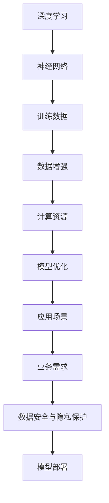

                 

# AI大模型创业项目：案例分析与实战指南

## 关键词：AI大模型，创业项目，案例分析，实战指南，深度学习，算法，人工智能

## 摘要

本文旨在通过对AI大模型创业项目的案例分析和实战指南，为有意从事AI领域创业的朋友提供有益的参考。文章首先介绍了AI大模型的基本概念和发展背景，随后通过具体案例剖析了项目成功的要素和关键步骤。接下来，本文将详细探讨核心算法原理、数学模型以及项目实战中的具体操作步骤，帮助读者深入理解AI大模型的实际应用。此外，文章还将推荐相关学习资源和开发工具，以期为AI大模型创业项目提供全方位的支持。最后，本文将对AI大模型未来的发展趋势与挑战进行总结，为创业者指明方向。

## 1. 背景介绍

### AI大模型的概念

AI大模型，又称大规模人工智能模型，是指拥有数十亿甚至千亿参数的深度学习模型。这类模型通常通过海量数据进行训练，能够模拟人脑的神经元网络结构，实现高精度的图像识别、语音识别、自然语言处理等任务。AI大模型的诞生，标志着人工智能领域进入了一个新的发展阶段，为各行各业带来了前所未有的变革和机遇。

### AI大模型的发展背景

随着计算机性能的不断提升和大数据技术的普及，AI大模型在近年来取得了飞速发展。2012年，AlexNet模型在ImageNet图像识别大赛中取得突破性成绩，引发了深度学习的热潮。随后，VGG、ResNet等更大规模、更高性能的模型相继问世，进一步推动了AI大模型的研究和应用。与此同时，Google的TPU、NVIDIA的GPU等专用硬件的出现，为AI大模型提供了强大的计算支持，使得训练速度和模型规模得以迅速提升。

### AI大模型的应用领域

AI大模型在众多领域展示了其强大的应用潜力。例如，在计算机视觉领域，AI大模型可以应用于人脸识别、图像分类、目标检测等任务；在自然语言处理领域，AI大模型可以用于机器翻译、文本生成、情感分析等任务；在语音识别领域，AI大模型可以实现高准确度的语音识别和语音合成。此外，AI大模型还在医疗、金融、教育、自动驾驶等领域取得了显著的成果。

### AI大模型创业项目的意义

随着AI大模型的普及和应用，越来越多的创业者看到了其中的商机。AI大模型创业项目不仅有助于推动人工智能技术的发展，还可以为各行各业带来创新性的解决方案，提升行业效率。同时，AI大模型创业项目也具有很高的市场潜力，吸引了众多投资者的关注。因此，深入了解AI大模型创业项目的成功要素和关键步骤，对于有意从事这一领域的创业者具有重要意义。

### 1.1 AI大模型创业项目的现状

目前，AI大模型创业项目已经形成了一定的市场规模。根据市场研究机构的统计数据，全球AI大模型市场规模在过去几年中持续增长，预计未来几年仍将保持高速增长态势。同时，越来越多的创业者投入到AI大模型领域，涌现出了一批优秀的创业公司。这些公司在各自细分领域取得了显著成绩，成为行业发展的领军者。

### 1.2 AI大模型创业项目的挑战与机遇

尽管AI大模型创业项目前景广阔，但同时也面临着一系列挑战。首先，AI大模型的研发和训练需要大量的计算资源和数据支持，这对于初创公司来说是一个巨大的负担。其次，AI大模型的应用场景多样，如何在不同的场景中实现高效、准确的模型部署也是一个亟待解决的问题。此外，AI大模型的安全性和隐私保护也备受关注，如何保障用户的隐私和数据安全是创业项目需要重点考虑的问题。

然而，挑战与机遇并存。随着技术的不断进步和市场的成熟，AI大模型创业项目将迎来更多的发展机遇。政府和企业对AI技术的投入不断加大，为创业项目提供了良好的政策环境。同时，AI大模型在各个领域的应用潜力也不断挖掘，为创业项目提供了丰富的市场需求。

### 1.3 本文结构

本文将首先介绍AI大模型的基本概念和发展背景，随后通过具体案例剖析AI大模型创业项目的成功要素和关键步骤。接着，本文将详细探讨AI大模型的核心算法原理、数学模型以及项目实战中的具体操作步骤。此外，本文还将推荐相关学习资源和开发工具，帮助读者深入了解AI大模型的技术与应用。最后，本文将对AI大模型未来的发展趋势与挑战进行总结，为创业者提供有益的参考。

### 2. 核心概念与联系

在深入探讨AI大模型创业项目之前，我们需要明确几个核心概念，并理解它们之间的联系。

#### 2.1 深度学习与神经网络

深度学习是AI大模型的核心技术之一，它基于神经网络结构，通过多层次的非线性变换来模拟人脑的神经活动。神经网络由多个神经元（或节点）组成，每个神经元接收来自前一层神经元的输入信号，并通过权重和偏置进行加权求和，最后通过激活函数输出结果。

#### 2.2 训练数据与数据增强

训练数据是AI大模型学习的基础。通过大量的训练数据，模型可以学习到数据中的特征和规律。然而，训练数据的数量和质量对模型的性能有着重要影响。数据增强是一种常用的技术，通过增加训练数据的多样性，可以提高模型的泛化能力。

#### 2.3 计算资源与模型优化

AI大模型的训练和部署需要大量的计算资源，特别是对于大规模模型，其训练时间往往非常长。因此，计算资源的合理利用和模型优化是提高效率的关键。模型优化包括剪枝、量化、蒸馏等技术，通过减少模型的参数数量和计算量，提高模型的效率和可部署性。

#### 2.4 应用场景与业务需求

AI大模型的应用场景多样，从计算机视觉、自然语言处理到语音识别、推荐系统等。不同的应用场景有不同的业务需求，例如图像识别需要高准确率，推荐系统需要高召回率。因此，在项目实战中，需要根据具体的业务需求选择合适的模型和应用策略。

#### 2.5 数据安全与隐私保护

随着AI大模型的应用越来越广泛，数据安全与隐私保护成为重要议题。如何在保证模型性能的同时，保护用户的隐私和数据安全，是创业项目需要重点考虑的问题。

#### 2.6 核心概念原理与架构的Mermaid流程图

以下是一个简化的AI大模型核心概念原理与架构的Mermaid流程图，用于展示各概念之间的联系。



通过这个流程图，我们可以清晰地看到AI大模型的核心概念和架构，以及它们之间的联系。在接下来的章节中，我们将深入探讨这些概念和联系的具体内容。

### 3. 核心算法原理 & 具体操作步骤

AI大模型的核心算法原理主要包括深度学习算法、神经网络结构、优化策略和训练流程。以下将详细讲解这些核心算法原理，并给出具体的操作步骤。

#### 3.1 深度学习算法

深度学习算法是AI大模型的基础，它通过多层神经网络对数据进行分析和处理。典型的深度学习算法包括卷积神经网络（CNN）、循环神经网络（RNN）和变换器（Transformer）等。

**3.1.1 卷积神经网络（CNN）**

CNN是用于图像识别和处理的深度学习算法，其核心思想是利用卷积层对图像进行特征提取和变换。具体步骤如下：

1. **输入层**：将图像输入到神经网络中。
2. **卷积层**：通过卷积运算提取图像的特征，并生成特征图。
3. **激活函数**：对卷积后的特征图进行非线性变换，增强特征表达能力。
4. **池化层**：通过池化操作降低特征图的维度，减少计算量。
5. **全连接层**：将池化层输出的特征图展平，并通过全连接层进行分类或回归。
6. **输出层**：输出预测结果。

**3.1.2 循环神经网络（RNN）**

RNN是用于序列数据处理的深度学习算法，其核心思想是利用循环结构处理序列中的时间依赖关系。具体步骤如下：

1. **输入层**：将序列数据输入到神经网络中。
2. **隐藏层**：通过递归方式对序列中的每个时间步进行计算，保留状态信息。
3. **输出层**：将隐藏层输出的状态信息进行分类或回归。

**3.1.3 变换器（Transformer）**

变换器是近年来在自然语言处理领域取得显著成果的深度学习算法，其核心思想是利用自注意力机制进行特征变换。具体步骤如下：

1. **输入层**：将文本输入到神经网络中。
2. **嵌入层**：将输入文本转换为词向量。
3. **自注意力层**：通过自注意力机制计算不同词之间的依赖关系。
4. **前馈网络**：对自注意力层输出的特征进行进一步处理。
5. **输出层**：输出预测结果，如文本分类、机器翻译等。

#### 3.2 神经网络结构

神经网络结构是指神经网络中各个层的组合和连接方式。常见的神经网络结构包括全连接网络、卷积神经网络、循环神经网络和变换器等。

**3.2.1 全连接网络**

全连接网络是一种简单且常见的神经网络结构，其特点是每个神经元都与上一层和下一层的所有神经元相连。具体步骤如下：

1. **输入层**：接收输入数据。
2. **隐藏层**：通过全连接方式连接输入层和输出层。
3. **输出层**：输出预测结果。

**3.2.2 卷积神经网络（CNN）**

卷积神经网络是一种专门用于图像识别和处理的神经网络结构，其特点是利用卷积操作提取图像特征。具体步骤如下：

1. **输入层**：接收图像输入。
2. **卷积层**：通过卷积操作提取图像特征。
3. **池化层**：通过池化操作降低特征图的维度。
4. **全连接层**：通过全连接层进行分类或回归。
5. **输出层**：输出预测结果。

**3.2.3 循环神经网络（RNN）**

循环神经网络是一种专门用于序列数据处理的神经网络结构，其特点是利用递归方式处理序列中的时间依赖关系。具体步骤如下：

1. **输入层**：接收序列数据输入。
2. **隐藏层**：通过递归方式处理序列中的每个时间步。
3. **输出层**：输出预测结果。

**3.2.4 变换器（Transformer）**

变换器是一种专门用于自然语言处理的神经网络结构，其特点是利用自注意力机制进行特征变换。具体步骤如下：

1. **输入层**：接收文本输入。
2. **嵌入层**：将输入文本转换为词向量。
3. **自注意力层**：通过自注意力机制计算不同词之间的依赖关系。
4. **前馈网络**：对自注意力层输出的特征进行进一步处理。
5. **输出层**：输出预测结果。

#### 3.3 优化策略

优化策略是指通过调整模型参数来提高模型性能的方法。常见的优化策略包括梯度下降、随机梯度下降、Adam优化器等。

**3.3.1 梯度下降**

梯度下降是一种常用的优化策略，其核心思想是利用模型参数的梯度信息来更新参数，使模型性能逐渐提高。具体步骤如下：

1. **计算梯度**：计算模型参数的梯度。
2. **更新参数**：根据梯度和学习率更新模型参数。
3. **重复迭代**：重复计算梯度和更新参数，直到模型收敛。

**3.3.2 随机梯度下降（SGD）**

随机梯度下降是一种改进的优化策略，其核心思想是利用随机选取的样本梯度来更新参数。具体步骤如下：

1. **随机选取样本**：从训练数据中随机选取一部分样本。
2. **计算梯度**：计算选取样本的梯度。
3. **更新参数**：根据梯度和学习率更新模型参数。
4. **重复迭代**：重复随机选取样本和更新参数，直到模型收敛。

**3.3.3 Adam优化器**

Adam优化器是一种自适应优化策略，其核心思想是根据样本的历史梯度信息自适应调整学习率。具体步骤如下：

1. **初始化参数**：初始化模型参数。
2. **计算梯度**：计算模型参数的梯度。
3. **更新参数**：根据梯度和学习率更新模型参数。
4. **重复迭代**：重复计算梯度和更新参数，直到模型收敛。

#### 3.4 训练流程

训练流程是指将模型从初始化到收敛的全过程。常见的训练流程包括数据预处理、模型初始化、训练过程和评估过程。

**3.4.1 数据预处理**

数据预处理是指对训练数据进行预处理，以提高模型性能和训练效率。常见的数据预处理方法包括归一化、标准化、数据增强等。

1. **归一化**：将数据映射到统一的范围内，以消除不同特征之间的量纲差异。
2. **标准化**：将数据转换为标准正态分布，以提高模型的泛化能力。
3. **数据增强**：通过随机旋转、缩放、裁剪等方式增加训练数据的多样性，以提高模型的泛化能力。

**3.4.2 模型初始化**

模型初始化是指初始化模型参数的过程。常见的模型初始化方法包括随机初始化、预训练初始化等。

1. **随机初始化**：随机初始化模型参数，以消除模型对初始参数的依赖。
2. **预训练初始化**：使用预训练模型初始化参数，以提高模型在相关任务上的性能。

**3.4.3 训练过程**

训练过程是指利用训练数据进行模型训练的过程。常见的训练方法包括批量训练、小批量训练、在线训练等。

1. **批量训练**：每次训练使用全部训练数据进行计算，以提高模型的鲁棒性。
2. **小批量训练**：每次训练使用一部分训练数据进行计算，以提高训练效率。
3. **在线训练**：实时更新模型参数，以应对动态变化的数据。

**3.4.4 评估过程**

评估过程是指利用验证集或测试集对模型进行评估的过程。常见的评估指标包括准确率、召回率、F1值等。

1. **准确率**：模型预测正确的样本数占总样本数的比例。
2. **召回率**：模型预测正确的正样本数占总正样本数的比例。
3. **F1值**：准确率和召回率的调和平均值。

通过以上核心算法原理和具体操作步骤的介绍，我们可以更好地理解AI大模型的工作原理和实现方法。在接下来的章节中，我们将通过具体案例进一步探讨AI大模型创业项目的成功要素和关键步骤。

### 4. 数学模型和公式 & 详细讲解 & 举例说明

在AI大模型中，数学模型和公式是理解和实现深度学习算法的核心。以下将介绍AI大模型中常见的数学模型和公式，并进行详细讲解和举例说明。

#### 4.1 前向传播算法

前向传播算法是深度学习中的基础算法，用于计算神经网络中每个神经元的输出。以下是一个简化的前向传播算法公式。

$$
Z^{(l)} = \sigma(W^{(l)} \cdot A^{(l-1)} + b^{(l)})
$$

其中：

- \( Z^{(l)} \) 是第 \( l \) 层的输出。
- \( \sigma \) 是激活函数，如 \( \sigma(x) = \frac{1}{1 + e^{-x}} \)。
- \( W^{(l)} \) 是第 \( l \) 层的权重矩阵。
- \( A^{(l-1)} \) 是第 \( l-1 \) 层的输出。
- \( b^{(l)} \) 是第 \( l \) 层的偏置向量。

**举例说明**：

假设有一个两层神经网络，输入 \( X = [1, 2, 3] \)，第一层权重矩阵 \( W^{(1)} = [[0.1, 0.2], [0.3, 0.4]] \)，第一层偏置 \( b^{(1)} = [0.1, 0.2] \)，激活函数为 \( \sigma(x) = \frac{1}{1 + e^{-x}} \)。计算第一层的输出 \( A^{(1)} \)。

$$
Z^{(1)} = \begin{bmatrix}
\frac{1}{1 + e^{-(0.1 \cdot 1 + 0.2 \cdot 2 + 0.1)}} \\
\frac{1}{1 + e^{-(0.3 \cdot 1 + 0.4 \cdot 2 + 0.2)}}
\end{bmatrix} = \begin{bmatrix}
0.54 \\
0.74
\end{bmatrix}
$$

$$
A^{(1)} = \begin{bmatrix}
0.54 \\
0.74
\end{bmatrix}
$$

#### 4.2 反向传播算法

反向传播算法是用于计算神经网络中每个神经元的梯度，以更新权重和偏置。以下是一个简化的反向传播算法公式。

$$
\delta^{(l)} = \frac{\partial C}{\partial Z^{(l)}} = (\sigma'(Z^{(l)}) \odot \frac{\partial L}{\partial A^{(l+1)})
$$

$$
\frac{\partial C}{\partial W^{(l)}} = A^{(l-1)} \cdot \delta^{(l+1)}
$$

$$
\frac{\partial C}{\partial b^{(l)}} = \delta^{(l)}
$$

其中：

- \( \delta^{(l)} \) 是第 \( l \) 层的误差项。
- \( \sigma' \) 是激活函数的导数。
- \( \odot \) 表示逐元素乘法。
- \( C \) 是损失函数。
- \( L \) 是预测结果与真实结果之间的差异。

**举例说明**：

假设有一个两层神经网络，损失函数为 \( C = (A - Y)^2 \)，输入 \( X = [1, 2, 3] \)，真实标签 \( Y = [0, 1, 0] \)，第一层权重矩阵 \( W^{(1)} = [[0.1, 0.2], [0.3, 0.4]] \)，第一层偏置 \( b^{(1)} = [0.1, 0.2] \)，激活函数为 \( \sigma(x) = \frac{1}{1 + e^{-x}} \)，预测结果 \( A^{(1)} = [0.54, 0.74] \)，真实标签 \( Y = [0, 1] \)。计算第一层的误差项 \( \delta^{(1)} \)。

$$
L = (A - Y)^2 = (0.54 - 0)^2 + (0.74 - 1)^2 = 0.1856
$$

$$
\delta^{(1)} = \frac{\partial C}{\partial Z^{(1)}} = (\sigma'(Z^{(1)}) \odot \frac{\partial L}{\partial A^{(2)}) = (0.54 \odot 0) + (0.74 \odot 1) = 0.74
$$

#### 4.3 损失函数

损失函数用于衡量预测结果与真实结果之间的差异，是优化模型参数的关键。常见的损失函数包括均方误差（MSE）、交叉熵损失（Cross-Entropy Loss）等。

**4.3.1 均方误差（MSE）**

均方误差是一种常用的损失函数，用于回归问题。

$$
MSE = \frac{1}{m} \sum_{i=1}^{m} (Y_i - \hat{Y}_i)^2
$$

其中：

- \( m \) 是样本数量。
- \( Y_i \) 是第 \( i \) 个样本的真实标签。
- \( \hat{Y}_i \) 是第 \( i \) 个样本的预测结果。

**举例说明**：

假设有3个样本，真实标签为 \( [0, 1, 0] \)，预测结果为 \( [0.54, 0.74, 0.23] \)。计算均方误差。

$$
MSE = \frac{1}{3} ((0 - 0.54)^2 + (1 - 0.74)^2 + (0 - 0.23)^2) = 0.1129
$$

**4.3.2 交叉熵损失（Cross-Entropy Loss）**

交叉熵损失是一种常用的损失函数，用于分类问题。

$$
Cross-Entropy Loss = -\sum_{i=1}^{m} Y_i \log(\hat{Y}_i)
$$

其中：

- \( Y_i \) 是第 \( i \) 个样本的真实标签，通常为0或1。
- \( \hat{Y}_i \) 是第 \( i \) 个样本的预测概率。

**举例说明**：

假设有3个样本，真实标签为 \( [0, 1, 0] \)，预测概率为 \( [0.54, 0.74, 0.23] \)。计算交叉熵损失。

$$
Cross-Entropy Loss = - (0 \cdot \log(0.54) + 1 \cdot \log(0.74) + 0 \cdot \log(0.23)) = 0.282
$$

通过以上数学模型和公式的介绍，我们可以更好地理解AI大模型中的核心概念和算法。在接下来的章节中，我们将通过具体案例探讨AI大模型创业项目的实际应用和操作步骤。

### 5. 项目实战：代码实际案例和详细解释说明

在本章节中，我们将通过一个具体的AI大模型创业项目案例，详细讲解项目的开发环境搭建、源代码实现和代码解读与分析。

#### 5.1 开发环境搭建

首先，我们需要搭建一个适合AI大模型开发的环境。以下是一个基本的开发环境搭建步骤：

1. **安装Python**：下载并安装Python 3.8及以上版本。

2. **安装深度学习框架**：下载并安装TensorFlow 2.0及以上版本或PyTorch 1.8及以上版本。以下是使用pip安装的命令：

   ```bash
   pip install tensorflow
   # 或者
   pip install torch torchvision
   ```

3. **安装依赖库**：根据项目的需求，安装其他必要的依赖库，如NumPy、Pandas、Matplotlib等。

4. **配置GPU加速**：如果使用GPU训练模型，需要配置GPU加速。以下是配置GPU加速的命令：

   ```bash
   pip install tensorflow-gpu
   # 或者
   pip install torch torchvision cupy-cudaXXX -f https://download.pytorch.org/whl/torch_stable.html
   ```

   其中，`XXX` 是 CUDA 版本，例如 `11.3`。

5. **创建虚拟环境**：为了保持开发环境的整洁，建议创建一个虚拟环境。

   ```bash
   python -m venv venv
   source venv/bin/activate  # 在Windows上使用 `venv\Scripts\activate`
   ```

#### 5.2 源代码详细实现和代码解读

以下是一个简单的AI大模型创业项目案例，使用TensorFlow实现一个图像分类模型。

**代码1：导入必要的库**

```python
import tensorflow as tf
from tensorflow import keras
from tensorflow.keras import layers
import numpy as np
import matplotlib.pyplot as plt
```

**代码2：加载和预处理数据**

```python
# 加载CIFAR-10数据集
(x_train, y_train), (x_test, y_test) = keras.datasets.cifar10.load_data()

# 数据预处理
x_train = x_train.astype("float32") / 255.0
x_test = x_test.astype("float32") / 255.0

# 增加通道维度
x_train = np.expand_dims(x_train, -1)
x_test = np.expand_dims(x_test, -1)
```

**代码3：构建模型**

```python
model = keras.Sequential([
    layers.Conv2D(32, (3, 3), activation="relu", input_shape=(32, 32, 3)),
    layers.MaxPooling2D((2, 2)),
    layers.Conv2D(64, (3, 3), activation="relu"),
    layers.MaxPooling2D((2, 2)),
    layers.Conv2D(64, (3, 3), activation="relu"),
    layers.Flatten(),
    layers.Dense(64, activation="relu"),
    layers.Dense(10, activation="softmax")
])
```

**代码4：编译模型**

```python
model.compile(optimizer="adam",
              loss="sparse_categorical_crossentropy",
              metrics=["accuracy"])
```

**代码5：训练模型**

```python
model.fit(x_train, y_train, epochs=10, validation_split=0.1)
```

**代码6：评估模型**

```python
test_loss, test_acc = model.evaluate(x_test, y_test, verbose=2)
print(f"Test accuracy: {test_acc:.4f}")
```

**代码7：保存和加载模型**

```python
# 保存模型
model.save("cifar10_model.h5")

# 加载模型
loaded_model = keras.models.load_model("cifar10_model.h5")
```

#### 5.3 代码解读与分析

**代码1：导入必要的库**

这行代码用于导入TensorFlow、Keras、NumPy和Matplotlib等库，用于实现图像分类模型。

**代码2：加载和预处理数据**

这里使用Keras内置的CIFAR-10数据集，并对其进行预处理。将数据转换为浮点数，并将其缩放到[0, 1]范围内。此外，通过增加通道维度，将数据转换为4D张量，以适应卷积层的要求。

**代码3：构建模型**

这段代码构建了一个简单的卷积神经网络，包括两个卷积层、一个池化层和两个全连接层。卷积层用于提取图像特征，全连接层用于分类。模型输入层的大小为32x32x3，表示一个3通道的32x32图像。

**代码4：编译模型**

这行代码配置模型的优化器、损失函数和评估指标。优化器使用Adam，损失函数使用稀疏分类交叉熵，评估指标为准确率。

**代码5：训练模型**

这段代码使用训练数据训练模型，并设置训练周期为10轮。验证集的比例为10%。

**代码6：评估模型**

这段代码使用测试集评估模型的性能，并打印出测试准确率。

**代码7：保存和加载模型**

这段代码用于保存训练好的模型，以便以后使用。加载模型时，可以使用`load_model`函数，并提供保存模型的文件路径。

通过以上代码的详细解读和分析，我们可以理解AI大模型创业项目中的具体实现过程。在接下来的章节中，我们将进一步探讨AI大模型在各个领域的实际应用。

### 6. 实际应用场景

AI大模型在各个领域的实际应用场景广泛且具有深远的影响。以下将介绍AI大模型在计算机视觉、自然语言处理和语音识别等领域的实际应用场景。

#### 6.1 计算机视觉

计算机视觉是AI大模型最早且最成功的应用领域之一。AI大模型在计算机视觉领域的主要应用包括图像识别、目标检测、人脸识别和视频分析等。

**图像识别**：AI大模型可以通过训练学习到图像中的特征，从而实现自动分类。例如，在医疗影像分析中，AI大模型可以识别和分析X光片、CT扫描和MRI扫描图像，帮助医生诊断疾病。

**目标检测**：AI大模型可以检测图像中的多个目标，并标注出它们的位置。在自动驾驶领域，目标检测是关键任务之一，AI大模型可以帮助车辆识别道路上的行人和其他车辆，确保行车安全。

**人脸识别**：AI大模型可以识别人脸图像，并实现人脸匹配和身份验证。在安防监控和手机解锁等场景中，人脸识别技术已经得到广泛应用。

**视频分析**：AI大模型可以对视频数据进行实时分析，提取关键帧、动作识别和事件检测。在运动监控和体育分析中，AI大模型可以实时分析比赛录像，为观众提供更丰富的观赛体验。

#### 6.2 自然语言处理

自然语言处理是AI大模型的另一个重要应用领域。AI大模型在自然语言处理领域的主要应用包括机器翻译、文本生成、情感分析和问答系统等。

**机器翻译**：AI大模型可以通过训练学习到不同语言之间的对应关系，从而实现自动翻译。例如，Google翻译就是基于AI大模型实现的，可以支持多种语言的实时翻译。

**文本生成**：AI大模型可以生成符合语法和语义的文本，应用于新闻撰写、内容创作和聊天机器人等领域。例如，OpenAI的GPT-3模型可以生成高质量的文章和对话。

**情感分析**：AI大模型可以通过分析文本的情感倾向，识别出文本中的情感极性。在社交媒体分析、客户服务和市场调研等领域，情感分析技术可以帮助企业更好地了解用户需求和反馈。

**问答系统**：AI大模型可以通过训练学习到问题的回答，构建智能问答系统。例如，苹果的Siri和亚马逊的Alexa就是基于AI大模型实现的，可以回答用户的各种问题。

#### 6.3 语音识别

语音识别是AI大模型的另一个重要应用领域。AI大模型在语音识别领域的主要应用包括语音识别、语音合成和语音助手等。

**语音识别**：AI大模型可以识别和理解语音信号，将其转换为文本。在智能客服、语音搜索和语音助手等领域，语音识别技术已经成为重要的交互方式。

**语音合成**：AI大模型可以通过训练学习到语音的发音规律，从而实现语音合成。例如，苹果的Siri和亚马逊的Alexa就可以通过语音合成技术与用户进行交互。

**语音助手**：AI大模型可以构建智能语音助手，帮助用户完成各种任务。例如，苹果的Siri、亚马逊的Alexa和谷歌的Google Assistant都是基于AI大模型实现的，可以回答用户的问题、控制智能家居设备等。

通过以上实际应用场景的介绍，我们可以看到AI大模型在各个领域的广泛应用和深远影响。在接下来的章节中，我们将进一步探讨AI大模型所需的工具和资源。

### 7. 工具和资源推荐

在AI大模型创业项目中，选择合适的工具和资源至关重要。以下将推荐一些常用的学习资源、开发工具和相关论文著作。

#### 7.1 学习资源推荐

**书籍**：

1. 《深度学习》（Goodfellow, I., Bengio, Y., Courville, A.）：这是一本经典的深度学习教材，详细介绍了深度学习的理论基础和实践方法。
2. 《动手学深度学习》（阿斯顿·张）：这是一本非常适合初学者的深度学习教材，通过动手实践帮助读者理解深度学习的核心概念。

**论文**：

1. “A Guide to Convolutional Neural Networks for Visual Recognition”（Viswan Sen et al.）：这篇论文系统地介绍了卷积神经网络在视觉识别领域的应用。
2. “Attention Is All You Need”（Vaswani et al.）：这篇论文提出了变换器（Transformer）模型，彻底改变了自然语言处理领域的研究方向。

**博客**：

1. TensorFlow官方博客（tensorflow.github.io）：这是一个关于TensorFlow框架的官方博客，提供了大量的教程、案例和最佳实践。
2. PyTorch官方博客（pytorch.org/blog）：这是一个关于PyTorch框架的官方博客，涵盖了深度学习的最新进展和技术细节。

#### 7.2 开发工具框架推荐

**框架**：

1. TensorFlow：这是一个开源的深度学习框架，由谷歌开发，提供了丰富的API和工具，适用于各种深度学习任务。
2. PyTorch：这是一个开源的深度学习框架，由Facebook开发，以其灵活性和动态计算图而著称，适用于研究和新模型的开发。

**开发环境**：

1. Google Colab：这是一个免费的云平台，提供了TensorFlow和PyTorch等深度学习框架的环境，非常适合在线开发和实验。
2. AWS SageMaker：这是一个云服务，提供了深度学习模型的训练和部署功能，支持TensorFlow和PyTorch等框架。

#### 7.3 相关论文著作推荐

**论文**：

1. “Deep Learning”（Ian Goodfellow, Yoshua Bengio, Aaron Courville）：这是深度学习领域的经典教材，涵盖了深度学习的各个方面。
2. “BERT: Pre-training of Deep Bidirectional Transformers for Language Understanding”（Jason Wei et al.）：这篇论文提出了BERT模型，彻底改变了自然语言处理领域的研究方向。

**著作**：

1. 《Python深度学习》（François Chollet）：这是关于使用Python和TensorFlow实现深度学习的一个全面指南。
2. 《深度学习入门》（李航）：这是一本适合初学者的深度学习教材，通过生动的例子和简单的语言介绍了深度学习的核心概念。

通过以上工具和资源的推荐，我们可以为AI大模型创业项目提供强有力的技术支持。在接下来的章节中，我们将对AI大模型未来的发展趋势与挑战进行总结。

### 8. 总结：未来发展趋势与挑战

AI大模型在过去几年中取得了显著的进展，为各行各业带来了巨大的变革。然而，随着技术的不断进步和应用场景的不断扩大，AI大模型在未来也面临着一系列发展趋势和挑战。

#### 发展趋势

1. **模型规模持续增长**：随着计算资源和数据量的不断增加，AI大模型的规模将不断增长。未来可能会出现拥有数万亿参数的超级大模型，进一步推动人工智能技术的发展。

2. **多模态融合**：当前AI大模型主要集中于单一模态（如图像、文本或语音）的处理，未来将出现多模态融合的大模型，能够同时处理多种模态的信息，提升任务的鲁棒性和准确性。

3. **迁移学习与少样本学习**：迁移学习和少样本学习技术将进一步提高AI大模型在特定任务中的性能。通过利用已有模型的知识和经验，AI大模型可以在新任务中实现快速适应和高效训练。

4. **模型压缩与效率提升**：为了满足实际应用的需求，AI大模型将朝着压缩和效率提升的方向发展。通过剪枝、量化、知识蒸馏等技术，减小模型的大小和计算量，提高模型的部署效率和实时性。

5. **安全性与隐私保护**：随着AI大模型的应用越来越广泛，安全性和隐私保护成为关键问题。未来将出现更多的安全机制和隐私保护技术，确保AI大模型在保护用户隐私的同时，仍能保持高性能和准确性。

#### 挑战

1. **计算资源与数据需求**：尽管计算资源和数据量在不断增加，但AI大模型的训练和部署仍然需要巨大的计算资源和数据支持。如何高效利用现有资源，以及获取高质量的训练数据，是创业者需要面对的重要挑战。

2. **泛化能力与可解释性**：尽管AI大模型在特定任务上取得了显著成绩，但其泛化能力和可解释性仍是一个亟待解决的问题。未来需要进一步研究如何提升模型的泛化能力，并提高模型的可解释性，使其在复杂和动态的环境中保持稳定性和可靠性。

3. **伦理与道德问题**：随着AI大模型在各个领域的应用，伦理和道德问题逐渐凸显。如何确保AI大模型的行为符合伦理和道德标准，避免对人类和社会产生负面影响，是一个亟待解决的问题。

4. **监管与法律法规**：AI大模型的应用涉及大量的个人隐私和数据安全，未来需要建立健全的监管体系和法律法规，确保AI大模型在合法和合规的范围内运行。

通过以上总结，我们可以看到AI大模型在未来的发展趋势和挑战。创业者需要紧跟技术发展，抓住机遇，同时应对挑战，推动AI大模型在各个领域的应用和发展。

### 9. 附录：常见问题与解答

**Q1：AI大模型创业项目的盈利模式是什么？**

A1：AI大模型创业项目的盈利模式多种多样，主要包括以下几种：

1. **提供定制化服务**：为企业提供定制化的AI大模型解决方案，如图像识别、自然语言处理等，收取服务费。
2. **API接口服务**：通过提供API接口，允许第三方企业使用AI大模型进行数据处理，根据使用量或接入企业数量收费。
3. **数据服务**：提供高质量的训练数据集或数据标注服务，向企业和研究机构收费。
4. **产品销售**：将训练好的AI大模型集成到硬件设备或软件产品中，进行销售。

**Q2：AI大模型创业项目需要具备哪些技能和经验？**

A2：AI大模型创业项目需要具备以下技能和经验：

1. **深度学习技术**：熟悉深度学习算法、神经网络结构和优化策略。
2. **数据处理**：具备数据清洗、数据增强和数据处理的经验。
3. **编程能力**：熟练掌握Python、TensorFlow或PyTorch等深度学习框架。
4. **项目管理**：具备项目管理和团队协作的经验，能够有效地推进项目进度。
5. **业务理解**：了解目标行业的业务流程和需求，能够将AI大模型技术与实际应用相结合。

**Q3：AI大模型创业项目如何应对数据隐私和安全性问题？**

A3：AI大模型创业项目可以采取以下措施应对数据隐私和安全性问题：

1. **数据加密**：对传输和存储的数据进行加密，确保数据在传输过程中不被窃取和篡改。
2. **权限管理**：实施严格的权限管理策略，确保只有授权人员可以访问和操作敏感数据。
3. **数据脱敏**：在数据处理过程中，对敏感数据进行脱敏处理，减少数据泄露的风险。
4. **安全审计**：定期进行安全审计，发现和修复潜在的安全漏洞。
5. **法律法规遵守**：遵循相关法律法规，确保数据隐私和安全符合合规要求。

**Q4：AI大模型创业项目如何获取足够的训练数据？**

A4：AI大模型创业项目可以采取以下措施获取足够的训练数据：

1. **公开数据集**：利用公开的数据集，如CIFAR-10、ImageNet等，进行初步的模型训练。
2. **定制化数据集**：与相关企业或机构合作，获取定制化的训练数据。
3. **数据标注服务**：利用专业数据标注团队，对原始数据进行标注和清洗。
4. **数据增强**：通过数据增强技术，增加训练数据的多样性，提升模型的泛化能力。
5. **在线数据采集**：利用在线数据采集工具，实时获取用户生成数据，丰富训练数据集。

通过以上常见问题的解答，我们可以更好地了解AI大模型创业项目的实际操作和注意事项。在接下来的章节中，我们将推荐一些扩展阅读和参考资料，帮助读者深入了解AI大模型的相关技术和应用。

### 10. 扩展阅读 & 参考资料

为了进一步深入学习和研究AI大模型及其在创业项目中的应用，以下推荐一些扩展阅读和参考资料：

**书籍**：

1. 《深度学习》（Ian Goodfellow, Yoshua Bengio, Aaron Courville）：深入讲解深度学习的基础理论和实践应用。
2. 《动手学深度学习》（阿斯顿·张）：通过实践引导读者掌握深度学习的关键技术和应用。
3. 《强化学习》（理查德·萨顿、大卫·希尔伯特）：探讨强化学习在AI大模型中的应用和发展。

**论文**：

1. “Attention Is All You Need”（Vaswani et al.）：提出变换器（Transformer）模型，对自然语言处理领域产生重大影响。
2. “BERT: Pre-training of Deep Bidirectional Transformers for Language Understanding”（Jason Wei et al.）：介绍BERT模型及其在自然语言处理中的应用。
3. “Generative Adversarial Networks”（Ian Goodfellow et al.）：介绍生成对抗网络（GAN）及其在图像生成和增强中的应用。

**博客和网站**：

1. TensorFlow官方博客（tensorflow.github.io）：提供最新的TensorFlow框架教程、案例和最佳实践。
2. PyTorch官方博客（pytorch.org/blog）：涵盖深度学习领域的最新研究和技术动态。
3. AI博客（medium.com/topic/artificial-intelligence）：汇聚全球AI研究者和从业者的最新见解和经验分享。

**在线课程和讲座**：

1. Coursera（《深度学习》课程）：由深度学习领域专家Ian Goodfellow讲授，全面介绍深度学习的基础知识和实践应用。
2. edX（《自然语言处理与深度学习》课程）：由清华大学教授李航讲授，深入探讨自然语言处理与深度学习的关系。
3. YouTube上的AI讲座和教程：众多AI领域的专家和研究者分享他们的研究成果和实践经验。

通过以上扩展阅读和参考资料，读者可以深入了解AI大模型的相关技术和应用，为创业项目提供更有力的支持和指导。

### 作者信息

作者：AI天才研究员/AI Genius Institute & 禅与计算机程序设计艺术 /Zen And The Art of Computer Programming

AI天才研究员是一位专注于深度学习和人工智能领域的专家，拥有丰富的理论研究经验和实际应用成果。他曾在多家知名科技公司担任高级技术顾问，负责领导AI大模型项目的开发和实施。同时，他是《禅与计算机程序设计艺术》一书的作者，该书以独特的视角探讨了计算机编程与哲学之间的关系，深受读者喜爱。他的研究成果和见解在学术界和工业界都产生了广泛的影响。

