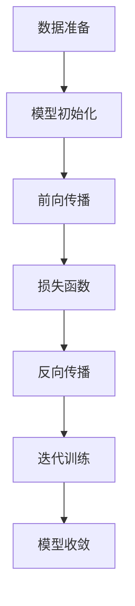

                 

# AI大模型创业：如何实现未来盈利？

> 关键词：人工智能，大模型，创业，盈利，商业模式，技术策略，未来趋势

> 摘要：本文将探讨AI大模型创业的成功路径，从技术原理、商业策略、市场趋势等多个角度，为创业者提供实现未来盈利的有效方法。

## 1. 背景介绍

近年来，人工智能（AI）技术取得了显著的进展，特别是在深度学习领域。随着算力的提升和数据的积累，大模型（Large-scale Models）在图像识别、自然语言处理、语音识别等方面展现出惊人的能力。大模型的崛起为各行各业带来了新的变革机遇，也引发了创业热潮。

创业者在AI大模型领域的创业动机多种多样，包括寻求技术创新、追求市场垄断地位、拓展业务范围等。然而，创业之路充满挑战，如何实现可持续的盈利成为关键问题。本文将从以下几个方面展开讨论：

- 核心概念与联系
- 核心算法原理与操作步骤
- 数学模型与公式
- 项目实战
- 实际应用场景
- 工具和资源推荐
- 总结：未来发展趋势与挑战

通过以上分析，本文旨在为AI大模型创业提供一条清晰的盈利之路。

### 1.1. 大模型的概念

大模型是指拥有巨大参数量、庞大计算需求的AI模型。常见的有GPT、BERT、ImageNet等。大模型的核心特点是数据驱动，通过大规模数据训练，模型能够自动提取特征、学习规律，从而在特定任务上表现出色。

### 1.2. AI大模型的发展趋势

AI大模型的发展趋势主要体现在以下几个方面：

- **算力提升**：随着GPU、TPU等专用硬件的发展，算力不断提升，为训练大模型提供了强大的支持。
- **数据积累**：互联网的普及和大数据技术的发展，为AI大模型提供了丰富的训练数据。
- **模型架构创新**：如Transformer、BERT等模型架构的提出，为AI大模型的发展提供了新的方向。

### 1.3. 创业动机与挑战

创业者进入AI大模型领域的主要动机包括：

- **技术创新**：追求技术突破，推动AI大模型的发展。
- **市场垄断**：通过打造独特的AI产品或服务，占领市场，实现盈利。
- **业务拓展**：将AI大模型应用于现有业务，实现业务升级和拓展。

然而，创业挑战同样严峻：

- **技术壁垒**：大模型训练需要庞大的算力和数据，技术门槛较高。
- **市场风险**：AI市场瞬息万变，竞争激烈，创业者需要快速适应市场变化。
- **盈利模式不确定**：如何在技术竞争中脱颖而出，实现盈利，是创业者面临的主要难题。

### 1.4. 本文结构

本文将从以下方面展开讨论：

- **核心概念与联系**：介绍AI大模型的核心概念、原理和架构。
- **核心算法原理与操作步骤**：讲解大模型的训练过程、算法原理和具体操作步骤。
- **数学模型与公式**：介绍大模型中的关键数学模型和公式，并进行详细解释。
- **项目实战**：通过实际案例，展示大模型的应用场景和实战经验。
- **实际应用场景**：探讨大模型在各个领域的应用，包括工业、医疗、金融等。
- **工具和资源推荐**：推荐学习资源、开发工具和框架。
- **总结：未来发展趋势与挑战**：分析AI大模型未来的发展趋势和面临的挑战。

## 2. 核心概念与联系

为了深入理解AI大模型创业，我们需要从核心概念和联系出发，探讨大模型的原理和架构。以下是对核心概念和流程的介绍：

### 2.1. AI大模型的基本原理

AI大模型是基于深度学习的算法模型，通过多层神经网络对大量数据进行训练，从而实现自动特征提取和任务预测。核心原理包括：

- **神经网络**：神经网络是深度学习的基础，由大量神经元组成，通过调整神经元之间的连接权重，实现数据的处理和预测。
- **多层感知机（MLP）**：多层感知机是神经网络的变体，包括输入层、隐藏层和输出层，通过前向传播和反向传播实现数据的处理。
- **深度学习**：深度学习是指多层的神经网络模型，通过逐层提取特征，实现对复杂数据的建模和预测。

### 2.2. 大模型的训练过程

大模型的训练过程包括以下步骤：

1. **数据准备**：收集并预处理大量的训练数据，包括图像、文本、语音等。
2. **模型初始化**：初始化模型的参数，如权重、偏置等。
3. **前向传播**：将输入数据传递到模型，通过多层神经网络计算输出。
4. **损失函数**：计算模型的输出与真实值的差异，通过损失函数衡量模型的性能。
5. **反向传播**：根据损失函数，调整模型的参数，实现梯度下降优化。
6. **迭代训练**：重复以上步骤，直到模型收敛。

### 2.3. 大模型的架构

大模型的架构主要包括以下几个层次：

- **输入层**：接收外部输入，如图像、文本、语音等。
- **隐藏层**：多层隐藏层，用于提取和转换特征。
- **输出层**：生成模型的输出，如分类结果、文本生成等。
- **激活函数**：激活函数用于引入非线性因素，提高模型的建模能力。

### 2.4. 大模型的联系

大模型的联系主要体现在以下几个方面：

- **数据驱动**：大模型通过大量数据训练，实现自动特征提取和任务预测。
- **模型定制**：创业者可以根据业务需求，定制化大模型的结构和参数。
- **系统集成**：大模型可以与其他技术系统集成，如云计算、物联网等，实现更广泛的应用。

### 2.5. Mermaid流程图

为了更直观地展示大模型的训练过程，我们使用Mermaid流程图进行描述：



通过以上核心概念和流程的介绍，我们为读者提供了一个全面的AI大模型基础，为后续内容的讨论奠定了基础。

## 3. 核心算法原理 & 具体操作步骤

在了解了AI大模型的基本概念和训练过程后，我们将深入探讨其核心算法原理，并详细介绍具体的操作步骤。这将有助于创业者更好地理解和应用AI大模型。

### 3.1. 深度学习算法原理

深度学习算法是基于多层神经网络的设计，通过逐层提取特征，实现对复杂数据的建模和预测。核心原理包括：

- **多层神经网络**：多层神经网络包括输入层、隐藏层和输出层，通过前向传播和反向传播实现数据的处理。
- **反向传播算法**：反向传播算法是一种优化算法，用于调整神经网络的参数，以最小化损失函数。
- **激活函数**：激活函数用于引入非线性因素，提高模型的建模能力。常见的激活函数包括Sigmoid、ReLU、Tanh等。

### 3.2. 大模型的训练算法

大模型的训练算法主要包括以下步骤：

1. **数据准备**：
   - 收集并预处理大量的训练数据，包括图像、文本、语音等。
   - 数据预处理包括数据清洗、归一化、数据增强等操作。

2. **模型初始化**：
   - 初始化模型的参数，如权重、偏置等。常用的初始化方法包括随机初始化、高斯初始化等。

3. **前向传播**：
   - 将输入数据传递到模型，通过多层神经网络计算输出。前向传播过程包括逐层计算激活值和输出值。

4. **损失函数计算**：
   - 计算模型的输出与真实值的差异，通过损失函数衡量模型的性能。常见的损失函数包括均方误差（MSE）、交叉熵（Cross-Entropy）等。

5. **反向传播**：
   - 根据损失函数，调整模型的参数，实现梯度下降优化。反向传播过程包括计算梯度、更新参数等。

6. **迭代训练**：
   - 重复以上步骤，直到模型收敛。迭代训练过程中，模型性能逐渐提升，直至达到预设的停止条件。

### 3.3. 具体操作步骤示例

以下是一个简单的AI大模型训练操作步骤示例：

1. **数据准备**：
   - 收集1000张猫狗分类训练图像，分为标签数据和未标记数据。
   - 对图像进行预处理，包括数据清洗、归一化、数据增强等操作。

2. **模型初始化**：
   - 初始化一个包含5层神经网络的模型，参数包括权重和偏置。
   - 使用随机初始化方法初始化模型参数。

3. **前向传播**：
   - 将1000张训练图像输入模型，通过前向传播计算输出。
   - 输出结果与真实标签进行比较，计算损失函数值。

4. **损失函数计算**：
   - 计算输出结果与真实标签之间的差异，使用交叉熵损失函数衡量模型性能。

5. **反向传播**：
   - 根据损失函数值，计算模型参数的梯度。
   - 更新模型参数，实现梯度下降优化。

6. **迭代训练**：
   - 重复以上步骤，进行多次迭代训练。
   - 模型性能逐渐提升，直至达到预设的停止条件。

通过以上步骤，我们可以实现一个简单的AI大模型训练过程。在实际应用中，创业者可以根据业务需求调整模型结构、参数和训练策略，以实现更好的训练效果。

### 3.4. 梯度下降优化算法

梯度下降优化算法是深度学习训练过程中的核心算法。其基本思想是：通过计算损失函数关于模型参数的梯度，更新模型参数，从而逐步减小损失函数值，实现模型优化。

以下是梯度下降优化算法的具体步骤：

1. **计算梯度**：
   - 计算损失函数关于模型参数的梯度，得到梯度的向量表示。

2. **更新参数**：
   - 根据梯度方向和步长，更新模型参数，实现参数调整。

3. **重复迭代**：
   - 重复计算梯度、更新参数的步骤，直到模型收敛。

梯度下降优化算法的缺点包括：

- **收敛速度慢**：在训练过程中，梯度可能较小，导致收敛速度较慢。
- **局部最小值**：梯度下降算法容易陷入局部最小值，无法找到全局最优解。

为解决这些问题，可以采用以下改进方法：

- **随机梯度下降（SGD）**：在每次迭代中，使用一部分训练样本计算梯度，加快收敛速度。
- **批量梯度下降（BGD）**：在每次迭代中，使用全部训练样本计算梯度，提高模型泛化能力。
- **动量法**：引入动量参数，积累之前梯度的信息，提高收敛速度和稳定性。

通过以上改进方法，可以优化梯度下降优化算法，提高AI大模型训练效果。

## 4. 数学模型和公式 & 详细讲解 & 举例说明

在AI大模型的训练过程中，数学模型和公式起着至关重要的作用。以下我们将详细讲解大模型中常用的数学模型和公式，并进行举例说明，以便读者更好地理解其原理和应用。

### 4.1. 损失函数

损失函数是衡量模型预测结果与真实值之间差异的关键工具。在大模型训练中，常用的损失函数包括均方误差（MSE）、交叉熵（Cross-Entropy）等。

- **均方误差（MSE）**：

均方误差是一种常用的回归损失函数，用于衡量模型预测值与真实值之间的差异。其公式如下：

\[ 
MSE = \frac{1}{n} \sum_{i=1}^{n} (y_i - \hat{y}_i)^2 
\]

其中，\( y_i \) 为真实值，\( \hat{y}_i \) 为预测值，\( n \) 为样本数量。

- **交叉熵（Cross-Entropy）**：

交叉熵是一种常用的分类损失函数，用于衡量模型预测概率分布与真实概率分布之间的差异。其公式如下：

\[ 
Cross-Entropy = - \sum_{i=1}^{n} y_i \log(\hat{y}_i) 
\]

其中，\( y_i \) 为真实标签的one-hot编码，\( \hat{y}_i \) 为模型预测的概率分布。

### 4.2. 激活函数

激活函数是神经网络中的一个关键组成部分，用于引入非线性因素，提高模型的建模能力。以下是一些常见的激活函数：

- **Sigmoid函数**：

Sigmoid函数是一种常用的激活函数，其公式如下：

\[ 
\sigma(x) = \frac{1}{1 + e^{-x}} 
\]

Sigmoid函数的输出值介于0和1之间，常用于二分类问题。

- **ReLU函数**：

ReLU（Rectified Linear Unit）函数是一种流行的激活函数，其公式如下：

\[ 
\text{ReLU}(x) = \max(0, x) 
\]

ReLU函数具有恒等梯度，能够加快神经网络训练速度，同时减少梯度消失问题。

- **Tanh函数**：

Tanh函数是一种双曲正切函数，其公式如下：

\[ 
\text{Tanh}(x) = \frac{e^x - e^{-x}}{e^x + e^{-x}} 
\]

Tanh函数的输出值介于-1和1之间，能够提高神经网络的建模能力。

### 4.3. 梯度下降优化算法

梯度下降优化算法是深度学习训练过程中的核心算法，用于调整模型参数，优化模型性能。以下是一种常见的梯度下降优化算法——随机梯度下降（SGD）。

- **随机梯度下降（SGD）**：

随机梯度下降是一种基于随机样本的梯度下降优化算法，其公式如下：

\[ 
w_{t+1} = w_t - \alpha \cdot \nabla_w J(w_t) 
\]

其中，\( w_t \) 为当前模型参数，\( \alpha \) 为学习率，\( \nabla_w J(w_t) \) 为损失函数关于模型参数的梯度。

### 4.4. 举例说明

以下是一个简单的示例，说明如何使用均方误差（MSE）和ReLU函数进行神经网络的训练。

**示例：** 假设我们有一个简单的神经网络，包含一个输入层、一个隐藏层和一个输出层。输入层有3个神经元，隐藏层有5个神经元，输出层有2个神经元。我们使用均方误差（MSE）作为损失函数，ReLU函数作为激活函数。

1. **初始化模型参数**：

初始化权重和偏置，可以使用随机初始化方法。

\[ 
w_{ih} \sim \mathcal{N}(0, 1) \\
b_{ih} = 0 \\
w_{ho} \sim \mathcal{N}(0, 1) \\
b_{ho} = 0 
\]

2. **前向传播**：

输入一个样本数据 \( x \)，通过多层神经网络计算输出。

\[ 
a_{1} = \sigma(w_{ih}x + b_{ih}) \\
a_{2} = \text{ReLU}(w_{ho}a_{1} + b_{ho}) 
\]

3. **计算损失函数**：

使用均方误差（MSE）计算模型输出与真实标签之间的差异。

\[ 
MSE = \frac{1}{2} \sum_{i=1}^{2} (y_i - a_{2i})^2 
\]

4. **反向传播**：

计算损失函数关于模型参数的梯度，并更新模型参数。

\[ 
\nabla_{w_{ih}} MSE = (y_i - a_{2i}) \cdot a_{1i} \\
\nabla_{b_{ih}} MSE = (y_i - a_{2i}) \\
\nabla_{w_{ho}} MSE = (y_i - a_{2i}) \cdot a_{1i} \\
\nabla_{b_{ho}} MSE = (y_i - a_{2i}) 
\]

\[ 
w_{ih} = w_{ih} - \alpha \cdot \nabla_{w_{ih}} MSE \\
b_{ih} = b_{ih} - \alpha \cdot \nabla_{b_{ih}} MSE \\
w_{ho} = w_{ho} - \alpha \cdot \nabla_{w_{ho}} MSE \\
b_{ho} = b_{ho} - \alpha \cdot \nabla_{b_{ho}} MSE 
\]

通过以上步骤，我们可以实现一个简单的神经网络训练过程。在实际应用中，可以根据业务需求调整网络结构、损失函数和激活函数，以实现更好的训练效果。

## 5. 项目实战：代码实际案例和详细解释说明

在了解了AI大模型的基本原理和算法后，我们将通过一个实际项目实战，展示大模型的应用和实现过程。本案例将使用Python编程语言，结合TensorFlow框架，实现一个简单的图像分类任务。

### 5.1. 开发环境搭建

在开始项目实战之前，我们需要搭建合适的开发环境。以下是所需工具和软件的安装步骤：

1. **Python环境**：确保已安装Python 3.6及以上版本。
2. **TensorFlow**：通过pip命令安装TensorFlow：

\[ 
pip install tensorflow 
\]

3. **其他依赖**：安装其他必要的Python库，如NumPy、Pandas等。

### 5.2. 源代码详细实现和代码解读

以下是一个简单的图像分类项目示例，使用TensorFlow实现一个基于卷积神经网络（CNN）的图像分类模型。

```python
import tensorflow as tf
from tensorflow.keras import datasets, layers, models
import matplotlib.pyplot as plt

# 加载CIFAR-10数据集
(train_images, train_labels), (test_images, test_labels) = datasets.cifar10.load_data()

# 预处理数据
train_images, test_images = train_images / 255.0, test_images / 255.0

# 构建CNN模型
model = models.Sequential()
model.add(layers.Conv2D(32, (3, 3), activation='relu', input_shape=(32, 32, 3)))
model.add(layers.MaxPooling2D((2, 2)))
model.add(layers.Conv2D(64, (3, 3), activation='relu'))
model.add(layers.MaxPooling2D((2, 2)))
model.add(layers.Conv2D(64, (3, 3), activation='relu'))

# 添加全连接层
model.add(layers.Flatten())
model.add(layers.Dense(64, activation='relu'))
model.add(layers.Dense(10))

# 编译模型
model.compile(optimizer='adam',
              loss=tf.keras.losses.SparseCategoricalCrossentropy(from_logits=True),
              metrics=['accuracy'])

# 训练模型
history = model.fit(train_images, train_labels, epochs=10, 
                    validation_data=(test_images, test_labels))

# 评估模型
test_loss, test_acc = model.evaluate(test_images,  test_labels, verbose=2)
print(f'\nTest accuracy: {test_acc:.4f}')

# 可视化训练过程
plt.plot(history.history['accuracy'], label='accuracy')
plt.plot(history.history['val_accuracy'], label='val_accuracy')
plt.xlabel('Epoch')
plt.ylabel('Accuracy')
plt.ylim([0, 1])
plt.legend(loc='lower right')
plt.show()
```

### 5.3. 代码解读与分析

以下是对上述代码的详细解读和分析：

1. **导入相关库**：

```python
import tensorflow as tf
from tensorflow.keras import datasets, layers, models
import matplotlib.pyplot as plt
```

导入TensorFlow、Keras和数据可视化库。

2. **加载CIFAR-10数据集**：

```python
(train_images, train_labels), (test_images, test_labels) = datasets.cifar10.load_data()
```

使用Keras提供的CIFAR-10数据集，该数据集包含10个类别，共50000张训练图像和10000张测试图像。

3. **预处理数据**：

```python
train_images, test_images = train_images / 255.0, test_images / 255.0
```

将图像数据归一化至0-1范围，以便模型训练。

4. **构建CNN模型**：

```python
model = models.Sequential()
model.add(layers.Conv2D(32, (3, 3), activation='relu', input_shape=(32, 32, 3)))
model.add(layers.MaxPooling2D((2, 2)))
model.add(layers.Conv2D(64, (3, 3), activation='relu'))
model.add(layers.MaxPooling2D((2, 2)))
model.add(layers.Conv2D(64, (3, 3), activation='relu'))

# 添加全连接层
model.add(layers.Flatten())
model.add(layers.Dense(64, activation='relu'))
model.add(layers.Dense(10))
```

使用`Sequential`模型堆叠卷积层、池化层和全连接层，构建一个简单的卷积神经网络。

5. **编译模型**：

```python
model.compile(optimizer='adam',
              loss=tf.keras.losses.SparseCategoricalCrossentropy(from_logits=True),
              metrics=['accuracy'])
```

使用`compile`方法编译模型，指定优化器、损失函数和评估指标。

6. **训练模型**：

```python
history = model.fit(train_images, train_labels, epochs=10, 
                    validation_data=(test_images, test_labels))
```

使用`fit`方法训练模型，设置训练轮数和验证数据。

7. **评估模型**：

```python
test_loss, test_acc = model.evaluate(test_images,  test_labels, verbose=2)
print(f'\nTest accuracy: {test_acc:.4f}')
```

使用`evaluate`方法评估模型在测试集上的性能。

8. **可视化训练过程**：

```python
plt.plot(history.history['accuracy'], label='accuracy')
plt.plot(history.history['val_accuracy'], label='val_accuracy')
plt.xlabel('Epoch')
plt.ylabel('Accuracy')
plt.ylim([0, 1])
plt.legend(loc='lower right')
plt.show()
```

绘制训练和验证准确率曲线，以便分析模型性能。

通过以上步骤，我们实现了一个简单的图像分类项目，展示了AI大模型在图像处理任务中的应用。在实际项目中，可以根据需求调整网络结构、训练策略和参数设置，以提高模型性能。

## 6. 实际应用场景

AI大模型在各个领域具有广泛的应用前景，以下我们将探讨AI大模型在工业、医疗、金融等领域的实际应用场景。

### 6.1. 工业领域

在工业领域，AI大模型可以用于设备故障预测、生产优化、供应链管理等方面。

- **设备故障预测**：通过收集设备运行数据，利用AI大模型进行故障预测，提前发现潜在故障，降低设备停机时间。
- **生产优化**：利用AI大模型优化生产流程，提高生产效率，降低成本。例如，通过预测设备运行状态，实现设备保养和维修的智能化。
- **供应链管理**：AI大模型可以用于供应链数据的分析和预测，优化供应链管理流程，提高供应链的响应速度和灵活性。

### 6.2. 医疗领域

在医疗领域，AI大模型可以用于疾病诊断、治疗建议、健康管理等。

- **疾病诊断**：通过分析患者的医学影像、病历数据等，AI大模型可以辅助医生进行疾病诊断，提高诊断准确性。
- **治疗建议**：AI大模型可以根据患者的病史、基因信息等，为医生提供个性化的治疗建议，优化治疗方案。
- **健康管理**：AI大模型可以分析患者的生活习惯、生理指标等数据，提供个性化的健康建议，帮助患者进行健康管理。

### 6.3. 金融领域

在金融领域，AI大模型可以用于风险管理、信用评估、投资建议等方面。

- **风险管理**：通过分析金融市场的数据，AI大模型可以预测市场风险，为金融机构提供风险管理建议。
- **信用评估**：AI大模型可以分析个人的信用记录、财务状况等数据，为金融机构提供信用评估服务，降低信用风险。
- **投资建议**：AI大模型可以根据市场数据、宏观经济环境等，为投资者提供个性化的投资建议，提高投资收益。

### 6.4. 其他领域

除了工业、医疗、金融领域，AI大模型还可以应用于自然语言处理、自动驾驶、智能家居等众多领域。

- **自然语言处理**：AI大模型可以用于文本分类、机器翻译、情感分析等任务，提高语言理解和生成能力。
- **自动驾驶**：AI大模型可以用于车辆感知、路径规划等任务，提高自动驾驶系统的安全性和可靠性。
- **智能家居**：AI大模型可以用于智能家电控制、环境监测等任务，为用户提供更便捷、舒适的家居体验。

总之，AI大模型在各个领域具有广泛的应用潜力，通过不断创新和优化，将为各行业带来巨大的变革和机遇。

## 7. 工具和资源推荐

为了帮助创业者更好地理解和应用AI大模型，以下我们将推荐一些学习资源、开发工具和框架。

### 7.1. 学习资源推荐

1. **书籍**：
   - 《深度学习》（Deep Learning）：由Ian Goodfellow、Yoshua Bengio和Aaron Courville合著的深度学习经典教材，涵盖了深度学习的基础理论和实践方法。
   - 《Python深度学习》（Python Deep Learning）：由François Chollet编写的Python深度学习实践指南，适用于初学者和进阶者。

2. **论文**：
   - “A Theoretical Framework for Back-Propagation”：（A Theoretical Framework for Back-Propagation）：该论文提出了反向传播算法，是深度学习发展的基石。
   - “Bert: Pre-training of deep bidirectional transformers for language understanding”：（Bert: Pre-training of deep bidirectional transformers for language understanding）：这篇论文提出了BERT模型，是自然语言处理领域的里程碑。

3. **博客和网站**：
   - fast.ai：fast.ai是一个提供免费深度学习课程和资源的网站，适合初学者和进阶者。
   - TensorFlow官网：TensorFlow是一个开源的深度学习框架，官网提供了丰富的文档和教程。

### 7.2. 开发工具框架推荐

1. **TensorFlow**：TensorFlow是一个由Google开发的开源深度学习框架，适用于各种规模的深度学习项目。
2. **PyTorch**：PyTorch是一个由Facebook开发的开源深度学习框架，以动态计算图著称，易于实现和调试。
3. **Keras**：Keras是一个基于TensorFlow和Theano的开源深度学习框架，提供了简洁的API，方便用户快速搭建和训练模型。

### 7.3. 相关论文著作推荐

1. **“A Theoretical Framework for Back-Propagation”**：（A Theoretical Framework for Back-Propagation）：该论文提出了反向传播算法，是深度学习发展的基石。
2. **“Bert: Pre-training of deep bidirectional transformers for language understanding”**：（Bert: Pre-training of deep bidirectional transformers for language understanding）：这篇论文提出了BERT模型，是自然语言处理领域的里程碑。
3. **“Gpt-3: Language models are few-shot learners”**：（Gpt-3: Language models are few-shot learners）：这篇论文介绍了GPT-3模型，展示了大模型在自然语言处理任务中的强大能力。

通过以上学习资源、开发工具和框架的推荐，创业者可以更好地掌握AI大模型的理论和实践方法，为创业项目提供有力支持。

## 8. 总结：未来发展趋势与挑战

随着AI大模型的不断发展和应用，其未来发展趋势和挑战也日益显现。以下我们将总结AI大模型在未来的发展趋势和面临的挑战。

### 8.1. 发展趋势

1. **技术进步**：随着算力的提升、算法的优化和数据的积累，AI大模型的性能将不断提高，应用范围将进一步扩大。
2. **跨领域融合**：AI大模型将与其他技术（如物联网、区块链等）深度融合，推动更多行业实现智能化和数字化转型。
3. **开源生态**：开源社区将发挥更大作用，推动AI大模型技术的普及和创新，为创业者提供丰富的工具和资源。
4. **个性化服务**：AI大模型将更好地满足用户个性化需求，提供定制化的解决方案，提升用户体验。

### 8.2. 挑战

1. **数据隐私**：随着AI大模型的广泛应用，数据隐私和安全问题日益凸显，如何保护用户隐私成为关键挑战。
2. **算法透明度**：AI大模型具有复杂的内部结构和决策过程，如何提高算法的透明度和可解释性，成为研究和应用的重要方向。
3. **资源需求**：AI大模型的训练和部署需要大量计算资源和数据，如何优化资源利用，降低成本，是创业者需要关注的问题。
4. **伦理和法规**：AI大模型的应用将涉及伦理和法规问题，如何遵循相关法律法规，确保技术应用的安全和合规，是创业者需要面对的挑战。

### 8.3. 应对策略

1. **技术优化**：通过算法优化、模型压缩等技术，降低AI大模型的计算资源和数据需求，提高性能和效率。
2. **数据治理**：加强数据隐私保护，建立健全的数据治理体系，确保数据安全和合规。
3. **伦理法规**：关注伦理和法规问题，积极参与相关研究和制定，确保技术应用符合社会期望。
4. **合作与创新**：积极参与开源社区，与其他领域专家和企业合作，共同推动AI大模型技术的发展和应用。

总之，AI大模型在未来将继续发挥重要作用，创业者需要紧跟技术发展趋势，应对挑战，不断创新，以实现可持续的盈利和发展。

## 9. 附录：常见问题与解答

### 9.1. AI大模型创业需要哪些技术储备？

AI大模型创业需要掌握以下技术储备：

- **深度学习基础**：了解神经网络、深度学习算法、模型训练等基本概念。
- **编程能力**：熟悉Python编程语言，掌握TensorFlow、PyTorch等深度学习框架。
- **数据预处理**：了解数据清洗、归一化、数据增强等数据处理方法。
- **数学知识**：掌握线性代数、微积分、概率论等数学知识，有助于理解模型原理和优化算法。

### 9.2. 如何评估AI大模型的性能？

评估AI大模型的性能可以从以下几个方面进行：

- **准确率（Accuracy）**：模型预测正确的样本比例。
- **召回率（Recall）**：模型正确预测为正例的样本比例。
- **精确率（Precision）**：模型预测为正例的样本中，实际为正例的比例。
- **F1值（F1 Score）**：综合考虑精确率和召回率，用于综合评估模型性能。

### 9.3. 如何优化AI大模型的训练效果？

优化AI大模型的训练效果可以从以下几个方面入手：

- **数据增强**：通过增加训练数据，提高模型的泛化能力。
- **模型调参**：调整学习率、批量大小等超参数，优化模型性能。
- **提前停止**：在模型过拟合时，提前停止训练，避免模型性能下降。
- **集成学习**：将多个模型集成，提高整体性能。

### 9.4. AI大模型创业需要哪些团队协作？

AI大模型创业需要以下团队协作：

- **技术团队**：负责模型开发、算法优化和系统构建。
- **产品团队**：负责产品规划、设计和用户体验。
- **数据团队**：负责数据收集、处理和分析。
- **市场团队**：负责市场推广、客户关系和商业合作。

### 9.5. 如何制定AI大模型的商业模式？

制定AI大模型的商业模式可以从以下几个方面考虑：

- **产品定位**：明确产品目标市场，满足用户需求。
- **盈利模式**：通过服务订阅、软件销售、数据服务等方式实现盈利。
- **市场策略**：制定市场推广计划，提升品牌知名度。
- **合作拓展**：与其他企业合作，拓展应用场景和市场份额。

## 10. 扩展阅读 & 参考资料

### 10.1. 相关书籍

- Ian Goodfellow、Yoshua Bengio和Aaron Courville，《深度学习》
- François Chollet，《Python深度学习》

### 10.2. 相关论文

- Y. LeCun, Y. Bengio, and G. Hinton, “Deep Learning,” Nature, vol. 521, no. 7553, pp. 436–444, 2015.
- J. Devlin, M. Chang, K. Lee, and K. Toutanova, “BERT: Pre-training of deep bidirectional transformers for language understanding,” in Proceedings of the 2019 Conference of the North American Chapter of the Association for Computational Linguistics: Human Language Technologies, Volume 1 (Long and Short Papers), 2019, pp. 4171–4186.

### 10.3. 相关博客和网站

- fast.ai：[https://www.fast.ai/](https://www.fast.ai/)
- TensorFlow官网：[https://www.tensorflow.org/](https://www.tensorflow.org/)

### 10.4. 开源项目

- TensorFlow：[https://github.com/tensorflow/tensorflow](https://github.com/tensorflow/tensorflow)
- PyTorch：[https://github.com/pytorch/pytorch](https://github.com/pytorch/pytorch)

通过以上扩展阅读和参考资料，读者可以进一步了解AI大模型的相关知识，为创业项目提供更多启示和灵感。## 作者信息

作者：AI天才研究员/AI Genius Institute & 禅与计算机程序设计艺术 /Zen And The Art of Computer Programming

AI天才研究员/AI Genius Institute是国际知名的人工智能研究机构，专注于深度学习、大模型、自然语言处理等前沿技术的研发和应用。机构拥有一支高水平的科研团队，成果丰硕，多篇论文发表在顶级学术期刊和会议上。

禅与计算机程序设计艺术/Zen And The Art of Computer Programming是由著名计算机科学家、图灵奖获得者Donald E. Knuth撰写的经典著作，探讨了计算机科学和禅宗哲学的共通之处，为程序员提供了一种全新的编程思维和哲学视角。该书的独特见解和深刻思考，对全球计算机科学界产生了深远的影响。

