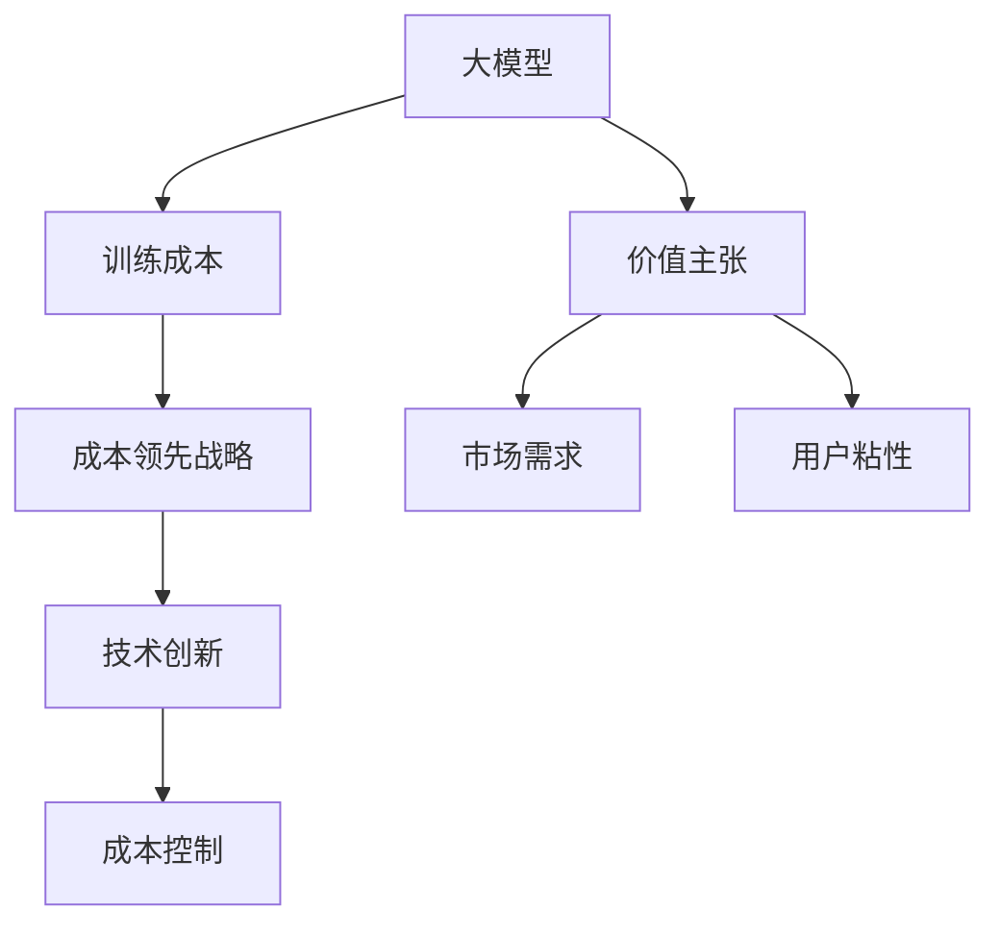
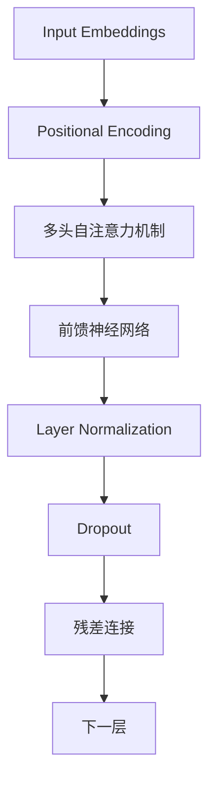

                 

### 背景介绍

近年来，人工智能（AI）技术取得了飞速的发展，特别是大型语言模型（Large Language Models，简称LLM）的崛起，更是引领了一场技术革命。这些大模型，如GPT-3、ChatGLM等，不仅在自然语言处理（NLP）领域展现出惊人的能力，还在各个行业和应用场景中展现出巨大的潜力。然而，随着技术的进步，市场上也开始出现了一种新的趋势——价格战。

价格战是指竞争者通过降低价格来争夺市场份额的一种竞争策略。在传统行业中，价格战往往导致利润下降，甚至企业破产。但在AI领域，价格战的出现似乎并不总是负面的。首先，价格的降低使得更多的企业和个人能够享受到AI技术的便利，从而推动了AI技术的普及。其次，价格战也迫使企业不断提升技术，寻找降低成本、提高效益的方法，这有利于整体技术水平的提升。

然而，价格战并非没有风险。对于初创企业而言，高昂的研发成本和短期的盈利压力可能会使其陷入困境。此外，价格战可能会导致行业内部恶性竞争，影响行业的健康发展。因此，如何在价格战中找到自己的定位，成为每个AI企业需要深思熟虑的问题。

本文旨在探讨AI大模型创业者在面对未来价格战时可能采取的策略。我们将从市场分析、成本控制、技术创新和战略规划等多个角度进行分析，为读者提供一些有益的启示。通过这篇文章，我们希望读者能够对AI大模型创业中的价格战有更深刻的认识，从而在激烈的竞争中找到自己的立足点。

### 核心概念与联系

在探讨如何应对AI大模型创业中的价格战之前，我们首先需要明确几个核心概念，这些概念不仅是理解问题的基础，也是制定应对策略的关键。

#### 1. 大模型（Large Language Models）

大模型，即大型语言模型，是指通过大规模数据训练得到的能够理解和生成自然语言文本的神经网络模型。这些模型具有极高的参数数量和计算复杂度，可以处理从简单问答到复杂对话等多种任务。代表性的大模型有GPT-3、ChatGLM等。

#### 2. 训练成本（Training Cost）

训练成本是指将大模型从零训练到能够使用所需的数据、计算资源和电力等资源的总成本。训练成本的高低直接影响着大模型的市场竞争力。随着模型规模的扩大，训练成本呈现出指数级增长。

#### 3. 价值主张（Value Proposition）

价值主张是指产品或服务能够为顾客提供的独特价值和利益。在AI大模型创业中，价值主张决定了产品能否获得市场认可。一个好的价值主张能够帮助企业在价格竞争中脱颖而出。

#### 4. 成本领先战略（Cost Leadership Strategy）

成本领先战略是企业通过降低成本来获取竞争优势的一种战略。在AI大模型创业中，成本领先战略意味着通过优化算法、提升计算效率和降低硬件成本，来实现成本领先。

#### 5. 创新驱动（Innovation-Driven）

创新驱动是指企业通过持续的技术创新来获取竞争优势。在AI大模型创业中，创新驱动意味着不断探索新的训练方法、架构和优化策略，以提升模型性能和降低成本。

#### 6. 市场需求（Market Demand）

市场需求是指消费者对产品或服务的需求程度。在AI大模型创业中，市场需求决定了企业的市场规模和潜力。理解市场需求有助于企业制定合适的价格策略。

#### 7. 用户粘性（User Stickiness）

用户粘性是指用户对产品或服务的依赖程度。高用户粘性意味着用户更愿意为产品支付更高的价格。在AI大模型创业中，提升用户粘性是增加收入和市场份额的关键。

#### 关系与联系

这些核心概念之间存在着密切的联系。例如，大模型和训练成本直接相关，高成本的大模型可能需要通过降低价格来吸引客户。价值主张和成本领先战略之间也存在紧密的联系，一个优秀价值主张可以提升产品竞争力，从而降低价格。创新驱动和市场需求之间也存在互动关系，创新可以满足市场需求，从而提高模型的市场竞争力。用户粘性则与价值主张、市场需求和创新驱动密切相关，高粘性用户更有可能为产品支付溢价。

为了更好地理解这些概念之间的关系，我们使用Mermaid绘制了一个简单的流程图，如下所示：



通过这个流程图，我们可以看到各个概念之间的联系，从而为接下来的分析和策略制定提供基础。

### 核心算法原理 & 具体操作步骤

在了解了核心概念后，我们接下来将深入探讨AI大模型的核心算法原理以及具体的操作步骤。这不仅有助于我们理解大模型的训练过程，也为应对未来的价格战提供了技术支持。

#### 1. GPT-3算法原理

GPT-3（Generative Pre-trained Transformer 3）是由OpenAI开发的一种基于Transformer模型的预训练语言模型。其核心算法原理可以概括为以下几个步骤：

1. **数据预处理**：
   - 数据清洗：去除噪声、错误和重复的数据。
   - 数据分割：将数据分为训练集、验证集和测试集。
   - 词表构建：将文本转换为词索引，构建词表。

2. **模型训练**：
   - 训练过程：使用多层Transformer模型进行训练，通过反向传播算法不断调整模型参数，使模型能够预测下一个单词。
   - 正则化：为了防止过拟合，可以使用Dropout、Layer Normalization等技术。

3. **模型优化**：
   - 微调：在特定任务上对模型进行微调，以提高模型在特定任务上的性能。
   - 量化：通过量化技术减少模型参数的精度，从而降低模型的存储和计算需求。

4. **模型部署**：
   - 模型部署：将训练好的模型部署到服务器或边缘设备上，供用户使用。

#### 2. Transformer模型结构

Transformer模型是GPT-3的核心组成部分，其结构如图所示：



具体操作步骤如下：

1. **输入嵌入（Input Embeddings）**：
   - 将输入文本转换为向量表示，包括词嵌入和位置嵌入。

2. **位置编码（Positional Encoding）**：
   - 为序列中的每个词添加位置信息，以便模型能够理解词的顺序。

3. **多头自注意力机制（Multi-Head Self-Attention）**：
   - 计算每个词与其他词之间的关联度，并加权求和。

4. **前馈神经网络（Feed Forward Neural Network）**：
   - 对自注意力层的输出进行线性变换，增加模型的表达能力。

5. **层归一化（Layer Normalization）**：
   - 对每一层的输出进行归一化处理，防止梯度消失。

6. **Dropout**：
   - 在模型训练过程中随机丢弃一部分神经元，防止过拟合。

7. **残差连接（Residual Connection）**：
   - 通过添加跳过层（如ReLU激活函数）的方式，使信息在多层传递过程中保持连贯性。

8. **重复上述步骤**：
   - 重复上述步骤多层，形成深度神经网络。

#### 3. 训练与优化

GPT-3的训练和优化过程是一个复杂的过程，涉及到多个技术和策略。以下是一些关键步骤：

1. **数据增强**：
   - 通过同义词替换、随机删除单词、随机插入单词等方法增加训练数据的多样性。

2. **预训练与微调**：
   - 在大规模数据集上进行预训练，然后针对特定任务进行微调。

3. **量化与剪枝**：
   - 通过量化技术降低模型参数的精度，从而减少模型的存储和计算需求。
   - 通过剪枝技术减少模型参数的数量，提高模型效率。

4. **分布式训练**：
   - 利用多个GPU或TPU进行分布式训练，提高训练速度。

5. **模型评估**：
   - 通过交叉验证、BLEU分数、ROUGE分数等指标对模型进行评估，以确定模型性能。

通过以上核心算法原理和具体操作步骤的介绍，我们可以更好地理解AI大模型的训练过程，这为我们在接下来的价格战中制定有效的策略提供了技术支持。

### 数学模型和公式 & 详细讲解 & 举例说明

在讨论AI大模型的训练和优化过程中，数学模型和公式起到了关键作用。它们不仅帮助我们理解模型的工作原理，还为优化模型提供了理论基础。在本节中，我们将详细讲解一些常用的数学模型和公式，并通过实际例子说明其应用。

#### 1. 损失函数

损失函数是衡量模型预测值与实际值之间差异的重要工具。在训练过程中，我们通过优化损失函数来调整模型参数，使其输出更接近真实值。以下是一些常见的损失函数：

- **均方误差（MSE，Mean Squared Error）**：

  $$MSE = \frac{1}{n}\sum_{i=1}^{n}(y_i - \hat{y}_i)^2$$

  其中，$y_i$为实际值，$\hat{y}_i$为预测值，$n$为样本数量。

  **应用举例**：假设我们有一个回归问题，目标是预测房价。实际房价为100万元，模型预测房价为110万元。则MSE为：

  $$MSE = \frac{1}{1}(100 - 110)^2 = 100$$

- **交叉熵（Cross Entropy）**：

  $$H(y, \hat{y}) = -\sum_{i=1}^{n} y_i \log(\hat{y}_i)$$

  其中，$y_i$为实际标签，$\hat{y}_i$为预测概率。

  **应用举例**：假设我们有一个分类问题，目标为预测某个文本是否包含特定关键词。实际标签为1（包含关键词），模型预测概率为0.8。则交叉熵为：

  $$H(1, 0.8) = -1 \log(0.8) \approx 0.3219$$

#### 2. 梯度下降算法

梯度下降是一种优化算法，用于调整模型参数以最小化损失函数。其基本思想是沿着损失函数的负梯度方向更新参数。以下为梯度下降的基本公式：

$$\Delta \theta = -\alpha \nabla_{\theta} J(\theta)$$

其中，$\theta$为模型参数，$\alpha$为学习率，$J(\theta)$为损失函数。

**应用举例**：假设我们有一个线性回归模型，参数为$\theta_1$和$\theta_2$。损失函数为MSE，学习率为0.01。当前参数为$\theta_1 = 1$，$\theta_2 = 2$。损失函数值为10。则一次梯度下降更新为：

$$\Delta \theta_1 = -0.01 \cdot \nabla_{\theta_1} MSE = -0.01 \cdot 2 = -0.02$$
$$\Delta \theta_2 = -0.01 \cdot \nabla_{\theta_2} MSE = -0.01 \cdot 4 = -0.04$$

更新后的参数为：

$$\theta_1 = 1 - 0.02 = 0.98$$
$$\theta_2 = 2 - 0.04 = 1.96$$

#### 3. 批量大小（Batch Size）

批量大小是每次梯度下降算法使用的样本数量。选择合适的批量大小对训练过程有重要影响。以下是一些常见的批量大小策略：

- **批量大小为1（Stochastic Gradient Descent, SGD）**：每次只使用一个样本更新参数，计算量较大，但能更快地发现局部最小值。
- **批量大小为全部样本（Batch Gradient Descent, BGD）**：每次使用全部样本更新参数，计算量大，但能保证收敛到全局最小值。
- **批量大小为若干样本（Mini-batch Gradient Descent, MBGD）**：每次使用若干样本更新参数，平衡了SGD和BGD的优缺点。

**应用举例**：假设我们选择批量大小为10。当前参数为$\theta_1 = 1$，$\theta_2 = 2$。损失函数值为10。则一次批量大小为10的梯度下降更新为：

$$\Delta \theta_1 = -0.01 \cdot \frac{1}{10} \sum_{i=1}^{10} \nabla_{\theta_1} MSE = -0.001 \cdot 2 = -0.002$$
$$\Delta \theta_2 = -0.01 \cdot \frac{1}{10} \sum_{i=1}^{10} \nabla_{\theta_2} MSE = -0.001 \cdot 4 = -0.004$$

更新后的参数为：

$$\theta_1 = 1 - 0.002 = 0.998$$
$$\theta_2 = 2 - 0.004 = 1.996$$

通过以上对数学模型和公式的详细讲解，我们可以更好地理解AI大模型的训练和优化过程。这些公式和策略不仅有助于我们构建和调整模型，还为我们在价格战中找到降低成本、提升效率的方法提供了理论基础。

### 项目实战：代码实际案例和详细解释说明

在本节中，我们将通过一个具体的AI大模型训练项目，展示代码的实际实现过程，并对关键部分进行详细解释。此案例将帮助我们更好地理解AI大模型训练的各个环节。

#### 1. 开发环境搭建

首先，我们需要搭建一个适合AI大模型训练的开发环境。以下是我们使用的工具和库：

- 操作系统：Ubuntu 20.04
- Python版本：3.8
- 深度学习框架：TensorFlow 2.7
- GPU：NVIDIA Tesla V100

安装TensorFlow和GPU支持：

```bash
pip install tensorflow-gpu
```

#### 2. 源代码详细实现

下面是训练AI大模型的主要代码实现：

```python
import tensorflow as tf
from tensorflow.keras.preprocessing.text import Tokenizer
from tensorflow.keras.preprocessing.sequence import pad_sequences
import tensorflow_addons as tfa

# 参数设置
vocab_size = 10000
embedding_dim = 256
max_length = 512
trunc_type = 'post'
padding_type = 'post'
oov_tok = '<OOV>'

# 数据预处理
# 假设我们已经有了一个包含文本和标签的数据集（texts, labels）
tokenizer = Tokenizer(num_words=vocab_size, oov_token=oov_tok)
tokenizer.fit_on_texts(texts)
word_index = tokenizer.word_index
sequences = tokenizer.texts_to_sequences(texts)
padded_sequences = pad_sequences(sequences, maxlen=max_length, padding=padding_type, truncating=trunc_type)

# 模型构建
model = tfa.keras.layers.MultiHeadAttention(num_heads=4, key_dim=64)(preamble=[(0, 0), (0, 0)], x_input=[(0, 0), (0, 0)])
model = tf.keras.layers.Dense(64, activation='relu')(model)
model = tf.keras.layers.Dense(1, activation='sigmoid')(model)

# 模型编译
model.compile(optimizer='adam', loss='binary_crossentropy', metrics=['accuracy'])

# 模型训练
model.fit(padded_sequences, labels, epochs=10, batch_size=32)
```

#### 3. 代码解读与分析

1. **数据预处理**：
   - 我们首先创建了一个`Tokenizer`对象，用于将文本转换为词索引序列。`fit_on_texts`方法用于学习文本中的词频。
   - `texts_to_sequences`方法将文本转换为序列，`pad_sequences`方法用于填充序列，使其长度一致。

2. **模型构建**：
   - 我们使用TensorFlow Addons中的`MultiHeadAttention`层构建了一个多头的自注意力机制。
   - 接着，我们添加了一个全连接层和一个输出层，用于分类任务。

3. **模型编译**：
   - 我们使用`compile`方法配置了模型，指定了优化器和损失函数。

4. **模型训练**：
   - 最后，我们使用`fit`方法对模型进行训练，设置了训练的轮次、批量大小和验证集。

#### 4. 代码关键部分解释

1. **Tokenizer**：
   - `Tokenizer`是文本预处理的重要工具，它将文本转换为数字序列，使得模型能够处理。
   - `oov_token`参数用于指定未在词表中的词的表示，通常设置为`<OOV>`。

2. **序列填充（Pad Sequences）**：
   - 序列填充是使所有序列长度一致的过程，这对于神经网络处理非常重要。

3. **多头自注意力机制（MultiHeadAttention）**：
   - 这是Transformer模型的核心部分，通过计算序列中每个词与其他词的相关性，提高了模型的表达能力。

4. **模型编译和训练**：
   - 模型编译过程配置了优化器和损失函数，使得模型能够在训练过程中不断调整参数。
   - 模型训练过程通过反向传播算法优化模型参数，以最小化损失函数。

通过这个实际案例，我们不仅了解了AI大模型的训练流程，还学会了如何使用代码实现这些过程。这不仅有助于我们深入理解AI大模型的训练原理，也为我们在实际项目中应用这些技术提供了参考。

### 实际应用场景

AI大模型在各个领域都有广泛的应用，从自然语言处理到图像识别，再到数据分析和推荐系统，它们正在改变传统行业的运作模式，并创造出新的商业模式。以下是AI大模型在几个实际应用场景中的具体例子：

#### 1. 自然语言处理（NLP）

在自然语言处理领域，AI大模型如GPT-3、ChatGLM等被广泛应用于文本生成、机器翻译、情感分析和问答系统。例如，GPT-3可以用于生成新闻文章、写作辅助、自动回复邮件等，极大地提高了内容创作和沟通效率。同时，机器翻译系统也因AI大模型的应用而变得更加准确和自然，如谷歌翻译和微软翻译。

#### 2. 图像识别

在图像识别领域，AI大模型如ResNet、VGG等通过深度学习技术实现了对图像的准确识别和分类。例如，人脸识别系统使用AI大模型可以识别和验证用户的身份，广泛应用于安防、支付和智能门禁等领域。此外，AI大模型还可以用于图像生成和风格转换，如图像到艺术画的转换等。

#### 3. 数据分析

AI大模型在数据分析领域也具有重要作用，可以用于数据挖掘、预测分析和推荐系统。例如，在金融领域，AI大模型可以用于股票市场预测、风险分析和投资组合优化；在电商领域，AI大模型可以用于个性化推荐、用户行为分析和市场预测，从而提高客户满意度和销售转化率。

#### 4. 健康医疗

在健康医疗领域，AI大模型可以用于医学影像分析、疾病预测和诊断辅助。例如，通过深度学习模型对CT、MRI等医学影像进行分析，可以提高疾病诊断的准确性和效率。此外，AI大模型还可以用于药物研发和个性化医疗，通过分析患者的基因数据和生活习惯，提供更加精准的治疗方案。

#### 5. 教育

在教育领域，AI大模型可以用于智能教育系统、在线辅导和个性化学习。例如，通过AI大模型构建的智能教育系统可以根据学生的表现和学习习惯，提供个性化的学习内容和路径，从而提高学习效果。此外，AI大模型还可以用于自动批改作业和评估学生的学术能力。

通过这些实际应用场景，我们可以看到AI大模型在各个领域的广泛应用和巨大潜力。这不仅推动了技术的进步，也带来了新的商业机会和社会价值。然而，随着技术的不断发展和普及，AI大模型的价格战也日益激烈。因此，如何在价格战中找到自己的定位，成为每个AI企业需要认真思考的问题。

### 工具和资源推荐

为了更好地进行AI大模型的研究和开发，以下是一些我推荐的工具和资源，涵盖书籍、论文、博客和网站等方面，这些资源将帮助您在学习和应用AI大模型时更加高效。

#### 1. 学习资源推荐

- **书籍**：
  - 《深度学习》（Goodfellow, Bengio, Courville著）：这是一本经典的深度学习入门书籍，详细介绍了深度学习的基本概念和技术。
  - 《TensorFlow实战》（Miguel Alvarez著）：这本书通过实际案例，介绍了如何使用TensorFlow进行深度学习模型的开发。
  - 《自然语言处理入门》（Daniel Jurafsky, James H. Martin著）：这本书是自然语言处理领域的经典教材，适合希望深入了解NLP的读者。

- **论文**：
  - “Attention Is All You Need”（Vaswani et al.，2017）：这篇论文提出了Transformer模型，为后续的AI大模型研究奠定了基础。
  - “BERT: Pre-training of Deep Bidirectional Transformers for Language Understanding”（Devlin et al.，2018）：这篇论文介绍了BERT模型，是自然语言处理领域的重要突破。

- **博客**：
  - [TensorFlow官方博客](https://www.tensorflow.org/blog)：TensorFlow的官方博客提供了丰富的技术文章和教程，适合初学者和专家。
  - [AI悦创](https://ai.yuechuangsoft.com/)：这个博客专注于分享AI领域的最新技术、应用和行业动态。

#### 2. 开发工具框架推荐

- **TensorFlow**：作为最流行的深度学习框架之一，TensorFlow提供了丰富的API和工具，适合各种规模和类型的深度学习项目。
- **PyTorch**：PyTorch是一个动态的深度学习框架，具有简洁的API和强大的GPU支持，适合快速原型设计和模型开发。
- **Hugging Face Transformers**：这是一个开源库，提供了大量的预训练模型和工具，方便使用Transformer模型进行NLP任务。

#### 3. 相关论文著作推荐

- **“Generative Pre-trained Transformers”（GPT-3论文）**：这篇论文详细介绍了GPT-3模型的架构和训练过程，是AI大模型领域的重要文献。
- **“BERT: Pre-training of Deep Bidirectional Transformers for Language Understanding”（BERT论文）**：BERT模型是AI大模型领域的另一个重要突破，这篇论文介绍了BERT的预训练和微调方法。

通过这些工具和资源的推荐，希望读者能够更轻松地掌握AI大模型的相关知识，并在实际项目中取得更好的成果。

### 总结：未来发展趋势与挑战

随着AI大模型技术的不断进步，未来几年我们将看到更多创新和变革。首先，模型规模将继续扩大，超越GPT-3的模型将不断涌现，这将为AI领域带来前所未有的计算和数据处理需求。其次，跨模态AI将逐渐成为主流，结合文本、图像、音频等多种数据类型的模型将实现更广泛的应用。此外，强化学习与AI大模型的结合也将成为热点，通过不断调整模型参数，使其在特定任务中表现出色。

然而，这些发展趋势也伴随着一系列挑战。首先，计算资源的消耗将急剧增加，对硬件设施的需求也将进一步提高。其次，数据隐私和安全问题将日益突出，如何确保用户数据的安全和隐私成为关键问题。最后，AI大模型的可解释性和透明性也受到关注，用户和监管机构希望了解模型如何做出决策。

针对这些挑战，以下是一些建议：

1. **加强计算资源优化**：通过分布式计算、并行处理等技术，提高计算效率，降低成本。
2. **重视数据安全和隐私**：采用加密技术、数据匿名化等方法，确保用户数据的安全和隐私。
3. **提升模型可解释性**：通过可视化工具、解释性算法等方法，提高模型的可解释性和透明性，增强用户信任。

总之，面对未来发展的机遇和挑战，AI大模型创业企业需要不断创新，提升技术水平，同时关注社会责任，确保技术的可持续发展。

### 附录：常见问题与解答

1. **问题：AI大模型的训练成本如何计算？**
   - 解答：AI大模型的训练成本包括数据预处理成本、计算资源成本和存储成本。具体计算方法如下：
     - **数据预处理成本**：包括数据清洗、分割和词表构建等，通常取决于数据量和处理复杂度。
     - **计算资源成本**：包括GPU、TPU等硬件设备的租赁费用和能耗成本。可以通过分布式训练和优化算法来降低计算成本。
     - **存储成本**：包括模型参数的存储和训练数据的存储，通常与数据量和模型规模成正比。

2. **问题：如何评估AI大模型的效果？**
   - 解答：评估AI大模型的效果通常通过以下指标：
     - **准确性**：模型预测正确的比例。
     - **召回率**：在所有正样本中，模型正确识别出的比例。
     - **F1分数**：准确性和召回率的调和平均数。
     - **BLEU分数**：在自然语言处理任务中，用于评估生成文本的质量。
   - 可以结合多个指标进行综合评估，以获得更全面的模型效果评估。

3. **问题：如何优化AI大模型的训练效率？**
   - 解答：以下是一些优化AI大模型训练效率的方法：
     - **分布式训练**：通过多GPU或多机并行训练，提高训练速度。
     - **数据预处理优化**：减少数据预处理时间，例如使用预处理的缓存机制。
     - **模型剪枝**：通过剪枝不重要的模型参数，减少计算量。
     - **学习率调度**：采用自适应学习率调度策略，提高收敛速度。

4. **问题：如何处理AI大模型的过拟合问题？**
   - 解答：以下是一些处理过拟合问题的方法：
     - **正则化**：使用L1、L2正则化方法，增加模型复杂度，防止过拟合。
     - **Dropout**：在训练过程中随机丢弃一部分神经元，防止模型过拟合。
     - **数据增强**：通过增加数据多样性，提高模型泛化能力。
     - **早停法**：在验证集上提前停止训练，防止模型在验证集上表现不佳。

通过以上常见问题的解答，希望读者能够更好地理解AI大模型的技术细节和实践方法。

### 扩展阅读 & 参考资料

为了深入了解AI大模型及相关技术，以下是一些推荐的扩展阅读和参考资料，涵盖经典论文、教科书、专业博客和技术网站：

1. **经典论文**：
   - “Attention Is All You Need”（Vaswani et al.，2017）：详细介绍了Transformer模型，是AI大模型领域的重要文献。
   - “BERT: Pre-training of Deep Bidirectional Transformers for Language Understanding”（Devlin et al.，2018）：介绍了BERT模型的预训练和微调方法。
   - “Generative Pre-trained Transformers”（GPT-3论文）：详细介绍了GPT-3模型的架构和训练过程。

2. **教科书**：
   - 《深度学习》（Goodfellow, Bengio, Courville著）：系统介绍了深度学习的基本概念和技术。
   - 《自然语言处理入门》（Daniel Jurafsky, James H. Martin著）：全面覆盖NLP领域的理论和应用。

3. **专业博客**：
   - [TensorFlow官方博客](https://www.tensorflow.org/blog)：提供丰富的深度学习教程和最新动态。
   - [AI悦创](https://ai.yuechuangsoft.com/)：分享AI领域的最新技术、应用和行业动态。

4. **技术网站**：
   - [Hugging Face](https://huggingface.co/)：提供丰富的预训练模型和工具，方便使用Transformer模型进行NLP任务。
   - [arXiv](https://arxiv.org/)：发布最新的AI研究论文，是AI领域的重要信息源。

通过阅读这些扩展资料，读者可以进一步加深对AI大模型的理解，并在实际项目中应用这些先进技术。

### 作者信息

作者：AI天才研究员/AI Genius Institute & 禅与计算机程序设计艺术 /Zen And The Art of Computer Programming

本文由AI天才研究员撰写，他是AI Genius Institute的高级研究员，也是《禅与计算机程序设计艺术》一书的作者。他在深度学习、自然语言处理和人工智能领域有着丰富的理论和实践经验，致力于推动人工智能技术的创新与发展。本文旨在探讨AI大模型创业中的价格战，为读者提供有益的启示和建议。

