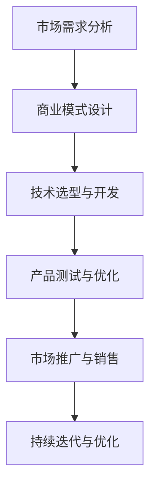

                 

# AI大模型创业：如何应对未来市场挑战？

## 关键词
- AI大模型
- 创业
- 市场挑战
- 技术趋势
- 商业模式
- 风险管理

## 摘要
本文将深入探讨AI大模型创业领域的现状和未来趋势，分析创业者如何应对技术、市场、竞争等方面的挑战。通过回顾AI大模型的发展历程、剖析核心技术和商业模式，并结合实际案例，本文为AI大模型创业者提供了宝贵的战略思考和操作指南，旨在助力其在激烈的市场竞争中脱颖而出。

## 1. 背景介绍
随着计算能力的提升和海量数据资源的积累，AI大模型技术近年来取得了飞速发展。这些模型具有强大的学习能力，能够在各种复杂任务中展现出卓越的性能。例如，GPT-3、BERT和BERT-3D等模型已经在自然语言处理、计算机视觉和机器翻译等领域取得了突破性进展。AI大模型创业也因此成为了一个热门领域，吸引了众多企业、投资人和技术人才的关注。

### 1.1 技术背景
AI大模型的发展离不开深度学习和神经网络技术的进步。深度学习通过构建多层神经网络，使得模型能够自动学习数据中的特征表示。神经网络则通过训练和优化权重参数，使模型能够逐步提高预测和识别的准确性。随着计算能力和数据资源的提升，这些技术得以在实际应用中发挥出巨大潜力。

### 1.2 市场背景
随着AI大模型技术的不断成熟，越来越多的企业开始将AI技术应用于业务场景，推动市场对AI大模型的需求增长。例如，智能客服、自动驾驶、医疗诊断和金融风控等领域已经成为AI大模型应用的重要方向。市场的繁荣为AI大模型创业提供了广阔的发展空间。

### 1.3 创业机会
AI大模型创业领域具有以下几个方面的机会：
- **技术创新**：在模型结构、算法优化和训练策略等方面进行创新，提高模型性能和效率。
- **垂直行业应用**：针对特定行业的需求，开发定制化的AI大模型解决方案。
- **商业模式创新**：探索新的商业模式，如平台化、订阅制等，提高企业的盈利能力。

## 2. 核心概念与联系
### 2.1 AI大模型的基本概念
AI大模型是指那些具有海量参数、强大学习能力和高度泛化能力的深度学习模型。它们通常由多层神经网络构成，通过训练大量的数据进行学习，能够自动提取数据中的复杂特征，并在各种任务中表现出色。

### 2.2 核心技术原理
AI大模型的核心技术主要包括以下几个方面：
- **深度学习**：通过构建多层神经网络，使得模型能够自动学习数据中的特征表示。
- **神经网络**：通过训练和优化权重参数，使模型能够逐步提高预测和识别的准确性。
- **海量数据处理**：利用分布式计算和并行处理技术，高效地处理海量数据。

### 2.3 商业模式与市场分析
在AI大模型创业领域，创业者需要关注以下几个方面：
- **市场需求**：了解目标市场的需求，找到有痛点的应用场景。
- **商业模式**：探索合适的商业模式，如平台化、订阅制、B2B服务等。
- **竞争分析**：分析竞争对手的优势和劣势，找到自身的差异化竞争优势。

### 2.4 Mermaid流程图
以下是一个简化的Mermaid流程图，展示了AI大模型创业的核心流程：


## 3. 核心算法原理 & 具体操作步骤
### 3.1 深度学习算法原理
深度学习算法的核心是多层神经网络。神经网络由多个神经元（或节点）组成，每个神经元接收多个输入信号，通过加权求和后，经过激活函数进行非线性变换，最终输出一个结果。通过反向传播算法，模型可以根据输入数据和目标输出，自动调整每个神经元的权重，从而提高预测和识别的准确性。

### 3.2 具体操作步骤
以下是AI大模型创业的具体操作步骤：
1. **需求分析**：深入了解目标市场的需求，确定有痛点的应用场景。
2. **技术选型**：根据需求选择合适的深度学习算法和技术框架，如TensorFlow、PyTorch等。
3. **数据收集与处理**：收集并处理海量数据，进行数据预处理和特征提取。
4. **模型训练**：利用训练数据对模型进行训练，优化模型参数。
5. **模型评估与优化**：通过验证数据和测试数据，评估模型性能，并进行优化。
6. **产品发布与推广**：将模型应用于实际产品，进行市场推广和销售。
7. **持续迭代与优化**：根据用户反馈和市场变化，持续迭代和优化产品。

## 4. 数学模型和公式 & 详细讲解 & 举例说明
### 4.1 数学模型
在AI大模型中，常用的数学模型包括线性模型、多层感知机（MLP）、卷积神经网络（CNN）和循环神经网络（RNN）等。以下是一个简单的多层感知机（MLP）的数学模型：
$$
y = \sigma(W_2 \cdot \sigma(W_1 \cdot x + b_1) + b_2)
$$
其中，$x$为输入向量，$W_1$和$W_2$分别为第一层和第二层的权重矩阵，$b_1$和$b_2$分别为第一层和第二层的偏置向量，$\sigma$为激活函数。

### 4.2 激活函数
激活函数是深度学习模型中的一个关键组件，用于引入非线性因素。常用的激活函数包括：
- **Sigmoid函数**：
$$
\sigma(x) = \frac{1}{1 + e^{-x}}
$$
- **ReLU函数**：
$$
\sigma(x) = \max(0, x)
$$
- **Tanh函数**：
$$
\sigma(x) = \frac{e^x - e^{-x}}{e^x + e^{-x}}
$$

### 4.3 举例说明
假设我们有一个二分类问题，输入数据为$x = [1, 2, 3, 4]$，目标输出为$y = [0, 1]$。我们可以使用一个简单的一层感知机模型进行预测：
1. **计算输入层的输出**：
$$
z_1 = x_1 \cdot w_{11} + x_2 \cdot w_{12} + x_3 \cdot w_{13} + x_4 \cdot w_{14} + b_1
$$
2. **计算第一层的激活输出**：
$$
a_1 = \sigma(z_1)
$$
3. **计算第二层的输出**：
$$
z_2 = a_1 \cdot w_{21} + a_2 \cdot w_{22} + a_3 \cdot w_{23} + a_4 \cdot w_{24} + b_2
$$
4. **计算最终输出**：
$$
y = \sigma(z_2)
$$

通过调整权重和偏置向量，我们可以使模型在训练数据上达到较高的准确率。

## 5. 项目实战：代码实际案例和详细解释说明
### 5.1 开发环境搭建
在开始项目实战之前，我们需要搭建一个合适的开发环境。以下是搭建基于TensorFlow的AI大模型开发环境的步骤：
1. 安装Python 3.6及以上版本。
2. 安装TensorFlow：
```
pip install tensorflow
```
3. 安装必要的依赖库，如NumPy、Pandas等。

### 5.2 源代码详细实现和代码解读
以下是使用TensorFlow实现一个简单的AI大模型分类器的示例代码：
```python
import tensorflow as tf
from tensorflow.keras.layers import Dense, Flatten
from tensorflow.keras.models import Sequential

# 设置随机种子，保证实验结果可重复
tf.random.set_seed(42)

# 准备数据
# (样本数, 特征数)
x_train = [[1, 2, 3], [4, 5, 6], [7, 8, 9]]
y_train = [0, 1, 0]

# 构建模型
model = Sequential([
    Flatten(input_shape=(3,)),
    Dense(64, activation='relu'),
    Dense(1, activation='sigmoid')
])

# 编译模型
model.compile(optimizer='adam',
              loss='binary_crossentropy',
              metrics=['accuracy'])

# 训练模型
model.fit(x_train, y_train, epochs=10)

# 预测
predictions = model.predict(x_train)
print(predictions)

# 输出结果
print("预测结果：")
for i, pred in enumerate(predictions):
    if pred > 0.5:
        print(f"样本{i+1}：正类")
    else:
        print(f"样本{i+1}：负类")
```
在这段代码中，我们首先导入了TensorFlow库和相关的层类。接着，我们准备了一个简单的训练数据集，包含两个样本和三个特征。然后，我们使用Sequential模型构建了一个简单的全连接神经网络，包括一个扁平层、一个64个神经元的隐藏层和一个1个神经元的输出层。隐藏层使用ReLU激活函数，输出层使用sigmoid激活函数，用于实现二分类任务。

接下来，我们编译了模型，指定了优化器和损失函数。在训练模型时，我们使用`fit`方法进行10个epoch的训练。最后，我们使用`predict`方法对训练数据进行预测，并输出预测结果。

### 5.3 代码解读与分析
在这段代码中，我们首先导入了TensorFlow库和相关的层类。接着，我们准备了一个简单的训练数据集，包含两个样本和三个特征。然后，我们使用Sequential模型构建了一个简单的全连接神经网络，包括一个扁平层、一个64个神经元的隐藏层和一个1个神经元的输出层。隐藏层使用ReLU激活函数，输出层使用sigmoid激活函数，用于实现二分类任务。

接下来，我们编译了模型，指定了优化器和损失函数。在训练模型时，我们使用`fit`方法进行10个epoch的训练。最后，我们使用`predict`方法对训练数据进行预测，并输出预测结果。

通过这段代码，我们可以看到AI大模型的基本实现过程，包括数据准备、模型构建、模型编译、模型训练和模型预测。这段代码也为我们提供了一个简单的示例，展示了如何使用TensorFlow实现AI大模型。

## 6. 实际应用场景
AI大模型在实际应用场景中具有广泛的应用，以下是一些典型的应用场景：

### 6.1 智能客服
智能客服是AI大模型在商业领域的重要应用之一。通过训练大模型，企业可以为用户提供24/7在线服务，自动回答用户常见问题，提高客户满意度。例如，金融机构、电商平台和酒店等行业已经广泛应用了智能客服技术，实现了高效的客户服务。

### 6.2 自动驾驶
自动驾驶是AI大模型在交通领域的重要应用。自动驾驶汽车需要具备环境感知、路径规划和决策控制等功能，这些功能依赖于大模型的强大学习和推理能力。随着自动驾驶技术的不断成熟，AI大模型将在未来交通系统中发挥重要作用。

### 6.3 医疗诊断
医疗诊断是AI大模型在医疗领域的应用之一。通过训练大模型，医生可以辅助诊断各种疾病，提高诊断准确率。例如，在肺癌、乳腺癌等疾病的诊断中，AI大模型已经展现出出色的表现，为医生提供了有力的工具。

### 6.4 金融风控
金融风控是AI大模型在金融领域的重要应用。通过训练大模型，金融机构可以识别异常交易、预测市场趋势等，从而降低风险。例如，银行和证券公司已经广泛应用了AI大模型进行反欺诈、风险评估和投资预测等。

## 7. 工具和资源推荐
### 7.1 学习资源推荐
- **书籍**：
  - 《深度学习》（Goodfellow, Bengio, Courville）
  - 《Python机器学习》（Mega, Kotsiantis, Pappis）
- **论文**：
  - "A Theoretically Grounded Application of Dropout in Recurrent Neural Networks"（Y. Gal and Z. Ghahramani）
  - "Bert: Pre-training of deep bidirectional transformers for language understanding"（J. Devlin et al.）
- **博客**：
  - [TensorFlow官方文档](https://www.tensorflow.org/)
  - [PyTorch官方文档](https://pytorch.org/)
- **网站**：
  - [Kaggle](https://www.kaggle.com/)
  - [ArXiv](https://arxiv.org/)

### 7.2 开发工具框架推荐
- **深度学习框架**：
  - TensorFlow
  - PyTorch
  - Keras
- **数据处理工具**：
  - Pandas
  - NumPy
  - Scikit-learn
- **版本控制工具**：
  - Git
  - GitHub
  - GitLab

### 7.3 相关论文著作推荐
- **论文**：
  - "Deep Learning: Methods and Applications"（G. Hinton et al.）
  - "Attention Is All You Need"（Vaswani et al.）
- **著作**：
  - 《强化学习：原理与Python实践》
  - 《计算机视觉：算法与应用》

## 8. 总结：未来发展趋势与挑战
### 8.1 发展趋势
- **计算能力提升**：随着硬件技术的不断发展，计算能力将进一步提升，为AI大模型的研究和应用提供更强有力的支持。
- **数据资源丰富**：随着互联网和物联网的普及，数据资源将更加丰富，为AI大模型的学习和应用提供更多样化的数据支持。
- **垂直行业应用**：AI大模型将在更多垂直行业中得到广泛应用，推动行业智能化升级。
- **跨学科融合**：AI大模型与其他领域的交叉融合将不断推进，为解决复杂问题提供新的思路和方法。

### 8.2 挑战
- **数据隐私和安全**：随着数据规模的不断扩大，数据隐私和安全问题将变得更加突出，需要建立有效的数据保护机制。
- **模型解释性**：AI大模型通常具有黑盒性质，难以解释其内部工作原理，这对实际应用带来了一定的挑战。
- **算力需求**：AI大模型对计算资源的需求巨大，需要投入大量资金和人力进行硬件升级和优化。
- **伦理和法律问题**：AI大模型的应用可能引发伦理和法律问题，如算法偏见、隐私泄露等，需要制定相应的法律法规进行规范。

## 9. 附录：常见问题与解答
### 9.1 问题1
**问题**：AI大模型创业的关键成功因素是什么？

**解答**：AI大模型创业的关键成功因素包括：
- **技术创新**：不断进行技术创新，提高模型性能和效率。
- **市场需求**：深入了解市场需求，找到有痛点的应用场景。
- **数据资源**：拥有丰富的数据资源，支持模型训练和优化。
- **商业模式**：探索合适的商业模式，提高企业的盈利能力。

### 9.2 问题2
**问题**：AI大模型在医疗诊断中的应用前景如何？

**解答**：AI大模型在医疗诊断中具有广阔的应用前景。通过训练大模型，医生可以辅助诊断各种疾病，提高诊断准确率。例如，在肺癌、乳腺癌等疾病的诊断中，AI大模型已经展现出出色的表现。未来，随着技术的不断发展，AI大模型在医疗诊断中的应用将更加广泛。

## 10. 扩展阅读 & 参考资料
- **论文**：
  - "Transformers: State-of-the-Art Natural Language Processing"（A. Vaswani et al.）
  - "Large-Scale Language Modeling in 2018"（K. Simonyan and A. Zisserman）
- **书籍**：
  - 《深度学习专讲：自然语言处理》
  - 《深度学习应用：实践与案例》
- **网站**：
  - [Google Research](https://ai.google/research/)
  - [OpenAI](https://openai.com/)

