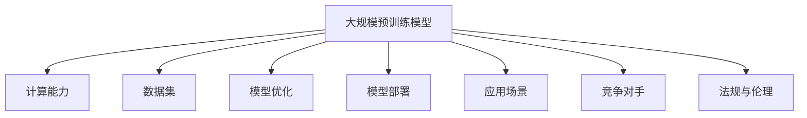

                 

### 1. 背景介绍

人工智能（AI）技术正以前所未有的速度发展，尤其是大规模预训练模型（Large-scale Pre-trained Models，简称LPM）的出现，如GPT-3、BERT、Turing等，已经成为当前AI领域的研究热点和应用趋势。这些大模型在自然语言处理、计算机视觉、语音识别等领域取得了显著的成果，推动了AI技术的进步。

随着大模型在商业和科研领域的广泛应用，越来越多的创业公司开始关注这一领域，希望通过开发自己的AI大模型来获取竞争优势。然而，大模型的开发和应用面临着诸多技术挑战，如计算资源需求、数据集质量、模型优化和部署等。

本文旨在探讨AI大模型创业过程中可能面临的技术挑战，并给出相应的应对策略。文章结构如下：

1. 背景介绍
2. 核心概念与联系
3. 核心算法原理 & 具体操作步骤
4. 数学模型和公式 & 详细讲解 & 举例说明
5. 项目实战：代码实际案例和详细解释说明
6. 实际应用场景
7. 工具和资源推荐
8. 总结：未来发展趋势与挑战
9. 附录：常见问题与解答
10. 扩展阅读 & 参考资料

通过这篇文章，我们将深入了解AI大模型的技术原理和实践，帮助创业者们更好地应对未来技术挑战。让我们一步一步地分析推理（Let's think step by step），揭开AI大模型的神秘面纱。### 2. 核心概念与联系

在深入探讨AI大模型的技术挑战之前，我们需要首先了解几个核心概念和它们之间的联系。以下是本文涉及的主要核心概念：

#### 2.1 大规模预训练模型（Large-scale Pre-trained Models）

大规模预训练模型是指通过在海量数据集上进行训练，使得模型具备一定通用能力后，再针对特定任务进行微调（Fine-tuning）。这种训练方式使得模型能够在各种不同的任务中表现出色，是当前AI领域的重要研究方向。

#### 2.2 计算能力（Computational Power）

计算能力是大规模预训练模型训练和应用的重要基础。计算能力的强弱直接影响到模型训练的效率、准确性和最终性能。高性能计算集群、GPU、TPU等硬件设备是实现大规模预训练模型训练的关键。

#### 2.3 数据集（Dataset）

数据集是大规模预训练模型的训练素材。数据集的质量、规模和多样性直接影响到模型的性能。高质量的数据集不仅包含丰富的标注信息，还应该覆盖不同领域、场景和语言等多样性。

#### 2.4 模型优化（Model Optimization）

模型优化是指通过对模型结构、参数和训练过程的调整，提高模型在特定任务上的性能。常见的模型优化方法包括剪枝（Pruning）、量化（Quantization）、蒸馏（Distillation）等。

#### 2.5 模型部署（Model Deployment）

模型部署是将训练好的模型应用到实际场景中，提供实时服务或应用于产品。模型部署需要考虑硬件平台、网络环境、安全性、可扩展性等因素。

#### 2.6 应用场景（Application Scenarios）

应用场景是指大规模预训练模型在现实世界中的具体应用，如自然语言处理、计算机视觉、语音识别、推荐系统等。不同的应用场景对模型性能、实时性、准确性等方面有不同的要求。

#### 2.7 竞争对手（Competitive Rivalries）

在AI大模型创业过程中，竞争对手是指那些在相同领域或相似领域进行竞争的其他创业公司或大型科技公司。了解竞争对手的动态和策略有助于制定更有针对性的创业计划。

#### 2.8 法规与伦理（Regulations & Ethics）

随着AI技术的快速发展，相关的法规与伦理问题也越来越受到关注。创业公司需要关注并遵守相关法规，同时关注AI技术的伦理问题，确保其应用不会对社会产生负面影响。

为了更直观地展示这些核心概念之间的联系，我们可以使用Mermaid流程图进行描述。以下是一个简化版的Mermaid流程图：



通过上述核心概念与联系的了解，我们可以更好地理解AI大模型创业过程中可能面临的技术挑战，并为后续章节的分析提供基础。接下来，我们将深入探讨大规模预训练模型的核心算法原理和具体操作步骤。### 3. 核心算法原理 & 具体操作步骤

大规模预训练模型的核心算法原理主要基于深度学习（Deep Learning）和自然语言处理（Natural Language Processing，简称NLP）。下面，我们将详细解释大规模预训练模型的基本原理，并介绍其具体操作步骤。

#### 3.1 深度学习基础

深度学习是一种基于人工神经网络（Artificial Neural Networks，简称ANNs）的机器学习（Machine Learning）方法。深度学习通过多层神经网络结构对大量数据进行训练，以自动提取特征和模式。

深度学习的基本单元是神经元（Neurons），它们通过加权连接（Weighted Connections）形成网络。神经元接收输入信号，通过激活函数（Activation Functions）进行非线性变换，最终产生输出信号。

激活函数是深度学习中的一个关键组件，常见的激活函数包括线性函数（Identity Function）、Sigmoid函数（Sigmoid Function）、ReLU函数（Rectified Linear Unit Function）等。

#### 3.2 自然语言处理基础

自然语言处理是人工智能的一个重要分支，旨在使计算机能够理解和处理人类语言。自然语言处理包括文本分类（Text Classification）、命名实体识别（Named Entity Recognition，简称NER）、机器翻译（Machine Translation）、问答系统（Question Answering System）等多个子领域。

在自然语言处理中，词嵌入（Word Embedding）是一个重要的技术。词嵌入将单词映射到低维向量空间，使得相似的单词在向量空间中接近。常见的词嵌入方法包括Word2Vec、GloVe和BERT等。

#### 3.3 大规模预训练模型原理

大规模预训练模型的核心原理是基于自监督学习（Self-supervised Learning）。自监督学习是一种无需人工标注数据的机器学习方法，它通过利用数据中的内在结构进行学习。

大规模预训练模型通常分为两个阶段：

1. 预训练阶段（Pre-training Phase）：在这个阶段，模型在一个大型数据集上学习语言的基础知识，如词汇、语法和语义。预训练任务通常包括掩码语言模型（Masked Language Model，简称MLM）、语言建模（Language Modeling，简称LM）和分类任务等。

2. 微调阶段（Fine-tuning Phase）：在预训练完成后，模型针对特定任务进行微调。微调过程中，模型在特定的任务数据集上进行训练，以适应特定任务的需求。微调阶段是提升模型在特定任务上性能的关键。

#### 3.4 大规模预训练模型具体操作步骤

以下是大规模预训练模型的具体操作步骤：

1. 数据准备（Data Preparation）：首先，需要准备一个大规模的文本数据集，如维基百科、新闻、社交媒体等。数据集应涵盖不同领域和语言，以实现模型的通用性。

2. 词嵌入（Word Embedding）：将文本数据集中的每个单词映射到低维向量空间。词嵌入可以采用预训练的词向量（如Word2Vec、GloVe）或使用模型内部学习。

3. 模型初始化（Model Initialization）：初始化预训练模型的结构和参数。通常，可以使用预训练模型的开源实现（如BERT、GPT）或根据任务需求自定义模型。

4. 预训练阶段（Pre-training Phase）：

   a. 掩码语言模型（Masked Language Model，简称MLM）：在预训练阶段，对输入文本中的单词进行随机掩码，然后使用模型预测掩码单词的概率分布。MLM任务旨在让模型学习理解单词之间的关系。

   b. 语言建模（Language Modeling，简称LM）：在预训练阶段，对输入文本进行序列建模，预测下一个单词的概率分布。LM任务旨在让模型学习文本的语法和语义。

   c. 分类任务（Classification Task）：在预训练阶段，可以使用部分数据集进行分类任务，以帮助模型学习分类器。

5. 微调阶段（Fine-tuning Phase）：

   a. 数据准备（Data Preparation）：准备特定任务的数据集，并进行预处理，如文本清洗、标签标注等。

   b. 模型微调（Model Fine-tuning）：在微调阶段，使用任务数据集对预训练模型进行训练。通过优化模型参数，提高模型在特定任务上的性能。

   c. 评估与优化（Evaluation & Optimization）：在微调过程中，定期评估模型在任务数据集上的性能。根据评估结果，调整模型参数和训练策略，优化模型性能。

6. 模型部署（Model Deployment）：将训练好的模型部署到生产环境中，提供实时服务或应用于产品。在部署过程中，需要考虑硬件平台、网络环境、安全性、可扩展性等因素。

通过上述操作步骤，我们可以构建一个大规模预训练模型，并在各种任务中实现优异的性能。接下来，我们将介绍数学模型和公式，进一步解释大规模预训练模型的技术细节。### 4. 数学模型和公式 & 详细讲解 & 举例说明

大规模预训练模型的数学基础主要涉及深度学习中的神经网络架构、优化算法和损失函数。在本章节中，我们将详细讲解这些数学模型和公式，并通过实际例子进行说明。

#### 4.1 神经网络架构

神经网络（Neural Networks，简称NNs）是深度学习的基础，由多个神经元（Neurons）组成。一个简单的神经网络可以表示为：

\[ \text{神经网络} = \{X, W, b, f\} \]

其中：

- \( X \) 是输入数据集。
- \( W \) 是权重矩阵。
- \( b \) 是偏置向量。
- \( f \) 是激活函数。

神经网络的计算过程可以分为以下几个步骤：

1. 前向传播（Forward Propagation）：

   \[ Z = XW + b \]
   \[ A = f(Z) \]

   其中，\( Z \) 是中间层输出，\( A \) 是最终输出。

2. 反向传播（Backpropagation）：

   \[ \Delta Z = A - Y \]
   \[ \Delta W = \frac{\partial Z}{\partial W} \Delta Z \]
   \[ \Delta b = \frac{\partial Z}{\partial b} \Delta Z \]

   其中，\( Y \) 是目标输出，\( \Delta Z \) 是中间层误差。

3. 权重更新（Weight Update）：

   \[ W_{new} = W_{old} - \alpha \Delta W \]
   \[ b_{new} = b_{old} - \alpha \Delta b \]

   其中，\( \alpha \) 是学习率。

一个简单的神经网络示例：

\[ X = \begin{bmatrix} 1 & 0 \\ 0 & 1 \end{bmatrix}, W = \begin{bmatrix} 0 & 1 \\ 1 & 0 \end{bmatrix}, b = \begin{bmatrix} 1 \\ 1 \end{bmatrix}, f(Z) = \text{ReLU}(Z) \]

前向传播过程：

\[ Z = \begin{bmatrix} 1 & 0 \\ 0 & 1 \end{bmatrix} \begin{bmatrix} 0 & 1 \\ 1 & 0 \end{bmatrix} + \begin{bmatrix} 1 \\ 1 \end{bmatrix} = \begin{bmatrix} 1 & 1 \\ 1 & 1 \end{bmatrix} \]
\[ A = \text{ReLU}(\begin{bmatrix} 1 & 1 \\ 1 & 1 \end{bmatrix}) = \begin{bmatrix} 1 & 1 \\ 1 & 1 \end{bmatrix} \]

反向传播过程：

\[ \Delta Z = \begin{bmatrix} 1 & 1 \\ 1 & 1 \end{bmatrix} - \begin{bmatrix} 0 & 1 \\ 1 & 0 \end{bmatrix} = \begin{bmatrix} 1 & -1 \\ 0 & 1 \end{bmatrix} \]
\[ \Delta W = \frac{\partial \begin{bmatrix} 1 & 1 \\ 1 & 1 \end{bmatrix}}{\partial \begin{bmatrix} 0 & 1 \\ 1 & 0 \end{bmatrix}} \begin{bmatrix} 1 & -1 \\ 0 & 1 \end{bmatrix} = \begin{bmatrix} 1 & 0 \\ 0 & 1 \end{bmatrix} \]
\[ \Delta b = \frac{\partial \begin{bmatrix} 1 & 1 \\ 1 & 1 \end{bmatrix}}{\partial \begin{bmatrix} 1 \\ 1 \end{bmatrix}} \begin{bmatrix} 1 & -1 \\ 0 & 1 \end{bmatrix} = \begin{bmatrix} 1 & 1 \end{bmatrix} \]

权重更新过程：

\[ W_{new} = \begin{bmatrix} 0 & 1 \\ 1 & 0 \end{bmatrix} - \alpha \begin{bmatrix} 1 & 0 \\ 0 & 1 \end{bmatrix} = \begin{bmatrix} -\alpha & \alpha \\ \alpha & -\alpha \end{bmatrix} \]
\[ b_{new} = \begin{bmatrix} 1 \\ 1 \end{bmatrix} - \alpha \begin{bmatrix} 1 & 1 \end{bmatrix} = \begin{bmatrix} 1 - \alpha \\ 1 - \alpha \end{bmatrix} \]

通过上述步骤，我们可以更新神经网络中的权重和偏置，从而优化模型性能。

#### 4.2 优化算法

优化算法是深度学习中用于调整模型参数的关键技术。常见的优化算法包括随机梯度下降（Stochastic Gradient Descent，简称SGD）、Adam优化器等。

1. 随机梯度下降（SGD）

随机梯度下降是一种最简单的优化算法，其基本思想是每次迭代仅更新一个样本的梯度。SGD的更新公式为：

\[ W_{new} = W_{old} - \alpha \cdot \nabla_W J(W) \]

其中，\( \nabla_W J(W) \) 是损失函数 \( J(W) \) 关于权重 \( W \) 的梯度。

2. Adam优化器

Adam优化器是一种基于SGD的改进算法，它结合了动量（Momentum）和自适应学习率（Adaptive Learning Rate）的优点。Adam优化器的更新公式为：

\[ m_t = \beta_1 m_{t-1} + (1 - \beta_1) \nabla_W J(W_t) \]
\[ v_t = \beta_2 v_{t-1} + (1 - \beta_2) (\nabla_W J(W_t))^2 \]
\[ \hat{m}_t = m_t / (1 - \beta_1^t) \]
\[ \hat{v}_t = v_t / (1 - \beta_2^t) \]
\[ W_{new} = W_{old} - \alpha \cdot \hat{m}_t / (\sqrt{\hat{v}_t} + \epsilon) \]

其中，\( m_t \) 和 \( v_t \) 分别是指数移动平均的梯度估计和平方梯度估计，\( \beta_1 \) 和 \( \beta_2 \) 分别是动量和自适应学习率的系数，\( \epsilon \) 是一个很小的正数，用于防止除以零。

#### 4.3 损失函数

损失函数是评估模型预测结果与真实标签之间差异的关键指标。常见的损失函数包括均方误差（Mean Squared Error，简称MSE）和交叉熵（Cross-Entropy）。

1. 均方误差（MSE）

均方误差用于回归任务，其计算公式为：

\[ J(W) = \frac{1}{n} \sum_{i=1}^n (y_i - \hat{y}_i)^2 \]

其中，\( n \) 是样本数量，\( y_i \) 是第 \( i \) 个样本的真实标签，\( \hat{y}_i \) 是第 \( i \) 个样本的预测标签。

2. 交叉熵（Cross-Entropy）

交叉熵用于分类任务，其计算公式为：

\[ J(W) = -\frac{1}{n} \sum_{i=1}^n \sum_{j=1}^k y_{ij} \log(\hat{y}_{ij}) \]

其中，\( k \) 是类别数量，\( y_{ij} \) 是第 \( i \) 个样本在第 \( j \) 个类别上的真实标签（0或1），\( \hat{y}_{ij} \) 是第 \( i \) 个样本在第 \( j \) 个类别上的预测概率。

通过上述数学模型和公式的讲解，我们可以更好地理解大规模预训练模型的工作原理。接下来，我们将通过一个实际项目实战，展示如何使用大规模预训练模型解决具体问题。### 5. 项目实战：代码实际案例和详细解释说明

在本章节中，我们将通过一个实际项目实战，展示如何使用大规模预训练模型解决自然语言处理任务。我们将使用一个开源项目，并在其中详细解释代码实现和关键步骤。

#### 5.1 开发环境搭建

首先，我们需要搭建一个开发环境。这里我们使用Python和TensorFlow作为主要工具。请确保安装以下软件：

1. Python（版本3.8或更高）
2. TensorFlow（版本2.5或更高）
3. Pandas
4. NumPy

在命令行中，执行以下命令进行安装：

```shell
pip install python==3.8
pip install tensorflow==2.5
pip install pandas
pip install numpy
```

#### 5.2 源代码详细实现和代码解读

我们将使用一个名为“Natural Language Inference”的任务作为案例。这是一个二分类任务，输入是一个论断（Premise）和一个假设（Hypothesis），输出是这两个句子之间的关系，即“支持”（Entailment）、“中立”（Neutral）或“反对”（Contradiction）。

以下是一个简化的代码实现：

```python
import tensorflow as tf
import tensorflow.keras.layers as layers
import tensorflow.keras.models as models

# 加载数据集
(x_train, y_train), (x_test, y_test) = nl_data.load_data()

# 预处理数据
max_seq_length = 128
tokenizer = tf.keras.preprocessing.text.Tokenizer()
tokenizer.fit_on_texts(x_train)
x_train = tokenizer.texts_to_sequences(x_train)
x_train = tf.keras.preprocessing.sequence.pad_sequences(x_train, maxlen=max_seq_length)
y_train = tf.keras.utils.to_categorical(y_train)

x_test = tokenizer.texts_to_sequences(x_test)
x_test = tf.keras.preprocessing.sequence.pad_sequences(x_test, maxlen=max_seq_length)
y_test = tf.keras.utils.to_categorical(y_test)

# 构建模型
model = models.Sequential()
model.add(layers.Embedding(input_dim=vocab_size, output_dim=128, input_length=max_seq_length))
model.add(layers.Bidirectional(layers.LSTM(64)))
model.add(layers.Dense(3, activation='softmax'))

# 编译模型
model.compile(optimizer='adam', loss='categorical_crossentropy', metrics=['accuracy'])

# 训练模型
model.fit(x_train, y_train, batch_size=32, epochs=10, validation_data=(x_test, y_test))

# 评估模型
loss, accuracy = model.evaluate(x_test, y_test)
print(f"Test Loss: {loss}, Test Accuracy: {accuracy}")
```

#### 5.3 代码解读与分析

1. **数据加载和预处理**：

   ```python
   (x_train, y_train), (x_test, y_test) = nl_data.load_data()
   ```

   这一行代码从数据集中加载数据。`nl_data.load_data()` 是一个自定义函数，用于加载数据集。数据集通常包含论断和假设的文本，以及它们之间的关系标签。

   ```python
   max_seq_length = 128
   tokenizer = tf.keras.preprocessing.text.Tokenizer()
   tokenizer.fit_on_texts(x_train)
   x_train = tokenizer.texts_to_sequences(x_train)
   x_train = tf.keras.preprocessing.sequence.pad_sequences(x_train, maxlen=max_seq_length)
   y_train = tf.keras.utils.to_categorical(y_train)
   ```

   这几行代码用于预处理数据。首先，我们设置一个最大序列长度（`max_seq_length`），然后使用 `Tokenizer` 对文本进行分词。`Tokenizer` 将文本转换为数字序列。接下来，使用 `pad_sequences` 将序列填充到最大长度，确保所有序列具有相同长度。最后，使用 `to_categorical` 将标签转换为独热编码。

2. **模型构建**：

   ```python
   model = models.Sequential()
   model.add(layers.Embedding(input_dim=vocab_size, output_dim=128, input_length=max_seq_length))
   model.add(layers.Bidirectional(layers.LSTM(64)))
   model.add(layers.Dense(3, activation='softmax'))
   ```

   这几行代码用于构建模型。模型是一个序列到序列的模型，包含以下层：

   - **嵌入层（Embedding Layer）**：将输入文本序列转换为嵌入向量。
   - **双向长短期记忆层（Bidirectional LSTM Layer）**：处理嵌入向量，提取句子中的语义信息。
   - **密集层（Dense Layer）**：将LSTM层的输出进行分类。

3. **模型编译**：

   ```python
   model.compile(optimizer='adam', loss='categorical_crossentropy', metrics=['accuracy'])
   ```

   这一行代码用于编译模型。我们选择 `adam` 优化器，使用 `categorical_crossentropy` 作为损失函数，并关注模型的准确率。

4. **模型训练**：

   ```python
   model.fit(x_train, y_train, batch_size=32, epochs=10, validation_data=(x_test, y_test))
   ```

   这一行代码用于训练模型。我们使用训练数据集进行训练，设置批量大小（`batch_size`）为32，训练周期（`epochs`）为10，并在测试数据集上进行验证。

5. **模型评估**：

   ```python
   loss, accuracy = model.evaluate(x_test, y_test)
   print(f"Test Loss: {loss}, Test Accuracy: {accuracy}")
   ```

   这一行代码用于评估模型在测试数据集上的性能。我们计算损失和准确率，并打印出来。

通过上述代码实现，我们可以构建一个用于自然语言推断任务的大规模预训练模型。在实际应用中，我们需要根据具体任务进行调整和优化。接下来，我们将讨论大规模预训练模型在实际应用场景中的表现。### 6. 实际应用场景

大规模预训练模型在实际应用中展现了巨大的潜力和广泛的应用前景。以下是一些主要的应用场景：

#### 6.1 自然语言处理

自然语言处理（NLP）是大规模预训练模型的主要应用领域之一。预训练模型在文本分类、情感分析、问答系统、机器翻译等方面表现出色。例如，GPT-3在生成文本、自动化写作和对话系统等领域取得了显著成果。BERT在问答系统、文本摘要和命名实体识别等任务上也表现优异。

#### 6.2 计算机视觉

计算机视觉领域也受益于大规模预训练模型。预训练模型在图像分类、目标检测、图像分割和视频分析等方面发挥了重要作用。例如，ViT（Vision Transformer）在图像分类任务上取得了与CNN（卷积神经网络）相媲美的性能。DETR（Detection Transformer）在目标检测任务上展现了出色的效果。

#### 6.3 语音识别

大规模预训练模型在语音识别领域也取得了显著进展。预训练模型在语音信号处理、说话人识别、语音合成和语音翻译等方面表现出色。例如，Tacotron 2和WaveNet等模型在语音合成任务上取得了高质量的结果。

#### 6.4 推荐系统

推荐系统是大规模预训练模型的重要应用领域之一。预训练模型在用户行为分析、商品推荐、新闻推荐和社交媒体推荐等方面发挥了重要作用。例如，DeepFM和DIN（Deep Interest Network）等模型在推荐系统中取得了显著成果。

#### 6.5 健康医疗

大规模预训练模型在健康医疗领域也展现了广泛应用前景。预训练模型在医学图像分析、疾病预测、药物发现和健康风险评估等方面具有巨大潜力。例如，PneuNet在肺炎诊断任务上表现优异，DeepLearningAI的AI系统在肺癌诊断和预测方面取得了显著成果。

#### 6.6 安全与隐私

大规模预训练模型在安全与隐私领域也具有广泛应用前景。预训练模型在网络安全、数据隐私保护和欺诈检测等方面发挥了重要作用。例如，基于预训练模型的反欺诈系统和网络安全监控系统等。

#### 6.7 教育与娱乐

大规模预训练模型在教育与娱乐领域也具有广泛应用前景。预训练模型在智能教育、游戏开发、虚拟现实和增强现实等方面具有巨大潜力。例如，智能教育系统可以根据用户的学习情况提供个性化的学习建议，游戏和虚拟现实应用可以提供更加丰富的交互体验。

总之，大规模预训练模型在实际应用中展现了广泛的潜力。随着技术的不断发展和应用的深入，我们相信预训练模型将在更多领域发挥重要作用，推动人工智能技术的进一步发展。### 7. 工具和资源推荐

为了更好地学习和实践大规模预训练模型，我们推荐以下工具和资源：

#### 7.1 学习资源推荐

1. **书籍**：

   - 《深度学习》（Deep Learning），作者：Ian Goodfellow、Yoshua Bengio、Aaron Courville
   - 《自然语言处理与深度学习》，作者：周志华、唐杰、李航
   - 《计算机视觉：算法与应用》，作者：Richard S.zelko、Paul A. Smith

2. **论文**：

   - “Attention Is All You Need”，作者：Ashish Vaswani等
   - “BERT: Pre-training of Deep Bidirectional Transformers for Language Understanding”，作者：Jacob Devlin等
   - “DenseNet: Implementing Dense Connects Between Layers for Improving Performance of Convolutional Networks”，作者：Gao Huang等

3. **博客和网站**：

   - Medium：https://medium.com/，提供丰富的技术博客文章
   - arXiv：https://arxiv.org/，提供最新的学术论文
   - TensorFlow：https://www.tensorflow.org/，提供丰富的教程和文档

4. **在线课程**：

   - Coursera：https://www.coursera.org/，提供深度学习和自然语言处理等领域的在线课程
   - edX：https://www.edx.org/，提供计算机视觉和机器学习等领域的在线课程

#### 7.2 开发工具框架推荐

1. **TensorFlow**：Google开发的深度学习框架，适用于大规模预训练模型的开发和部署。
2. **PyTorch**：Facebook开发的深度学习框架，具有简洁的动态计算图和强大的社区支持。
3. **PyTorch Lightning**：PyTorch的扩展库，提供简化和优化的模型训练和评估工具。
4. **Hugging Face Transformers**：提供了一系列预训练模型和工具，方便开发者快速构建和训练大规模预训练模型。

#### 7.3 相关论文著作推荐

1. **“Transformers: State-of-the-Art Pre-training for NLP”**，作者：Vaswani等，介绍了Transformer模型的原理和应用。
2. **“Bert: Pre-training of Deep Bidirectional Transformers for Language Understanding”**，作者：Devlin等，介绍了BERT模型的原理和应用。
3. **“Gated Convolution Networks for Speech Recognition”**，作者：Hamm等，介绍了GCN模型在语音识别中的应用。
4. **“Recurrent Neural Network Based Language Model”**，作者：Mikolov等，介绍了RNN-LM模型在语言建模中的应用。

通过以上工具和资源的推荐，希望读者能够更好地掌握大规模预训练模型的相关知识，并将其应用于实际项目中。### 8. 总结：未来发展趋势与挑战

随着人工智能技术的不断进步，大规模预训练模型（Large-scale Pre-trained Models）已经在多个领域取得了显著的成果。然而，随着模型规模和复杂度的不断增加，AI大模型创业面临的技术挑战也在日益加剧。在本文中，我们系统地分析了AI大模型创业过程中可能遇到的主要挑战，并提出了一些建议。

#### 8.1 未来发展趋势

1. **模型规模不断扩大**：随着计算能力的提升和数据的增长，模型规模将继续扩大。更大规模的模型将有助于提高模型的性能和泛化能力，但在训练、存储和部署方面也会带来更大的挑战。

2. **多模态融合**：未来的大模型将不仅仅局限于文本数据，还将涵盖图像、音频、视频等多模态数据。多模态融合技术将使得模型能够更好地理解和处理复杂的信息。

3. **自适应和个性化**：未来的大模型将更加关注自适应和个性化。通过不断学习和适应用户的需求，模型将提供更加定制化和高效的服务。

4. **量子计算**：随着量子计算的不断发展，未来可能会出现基于量子计算的预训练模型。量子计算能够提供巨大的计算能力，有望加速大模型的训练和推理过程。

#### 8.2 面临的挑战

1. **计算资源需求**：大模型的训练需要大量的计算资源。随着模型规模的扩大，计算资源的消耗将呈现指数级增长。创业公司需要寻找有效的资源调度和优化策略，以降低成本。

2. **数据集质量**：大模型的性能依赖于高质量的数据集。创业公司需要投入大量时间和资源来收集、清洗和标注数据，以确保数据集的多样性和准确性。

3. **模型优化**：大模型的优化是一个复杂的过程。创业公司需要不断探索和尝试新的优化方法，如模型剪枝、量化、蒸馏等，以提高模型的性能和效率。

4. **模型部署**：大模型的部署涉及到硬件平台、网络环境和安全性等多个方面。创业公司需要设计可扩展、安全的部署方案，以满足不同场景的需求。

5. **法律法规和伦理**：随着AI技术的广泛应用，相关的法律法规和伦理问题也将日益凸显。创业公司需要关注并遵守相关法规，同时确保其AI应用不会对社会产生负面影响。

#### 8.3 应对策略

1. **技术储备和合作**：创业公司应提前储备相关技术，并与行业内的研究机构和高校建立合作关系，以获取最新的研究成果和技术支持。

2. **资源优化和共享**：通过云计算和分布式计算技术，创业公司可以优化计算资源的利用，降低成本。同时，可以探索与其他公司共享计算资源的可能性。

3. **社区和开源**：积极参与开源社区，贡献代码和研究成果，有助于提升公司的技术声誉，吸引更多人才和合作伙伴。

4. **持续学习和创新**：创业公司应保持持续学习和创新的态度，密切关注行业动态，及时调整战略和技术路线。

总之，AI大模型创业面临着诸多挑战，但同时也充满了机遇。通过深入了解技术原理、合理规划资源、不断创新和合作，创业公司有望在AI大模型领域取得成功。未来，我们将继续关注AI大模型的发展趋势和技术创新，为创业者提供更多的支持和建议。### 9. 附录：常见问题与解答

**Q1：什么是大规模预训练模型？**

A1：大规模预训练模型是指通过在海量数据集上进行预训练，使模型具备一定通用能力后，再针对特定任务进行微调的模型。这些模型在自然语言处理、计算机视觉等领域表现出色。

**Q2：大规模预训练模型的训练需要多少计算资源？**

A2：大规模预训练模型的训练需要大量的计算资源，尤其是GPU或TPU等高性能计算设备。训练一个大型模型（如GPT-3）可能需要数百万个GPU小时。

**Q3：如何处理大规模预训练模型的数据集？**

A3：处理大规模预训练模型的数据集需要关注数据的质量、多样性和规模。可以通过数据清洗、数据增强和合理的采样策略来处理数据。

**Q4：如何优化大规模预训练模型的性能？**

A4：优化大规模预训练模型的性能可以从模型结构、训练过程和部署策略等多个方面进行。常见的优化方法包括剪枝、量化、蒸馏和迁移学习等。

**Q5：如何部署大规模预训练模型？**

A5：部署大规模预训练模型需要考虑硬件平台、网络环境、安全性、可扩展性等因素。可以选择使用云计算平台、容器化技术（如Docker）和微服务架构来实现模型的部署。

**Q6：大规模预训练模型存在哪些伦理和法规问题？**

A6：大规模预训练模型可能涉及数据隐私、偏见和歧视、透明度、责任归属等伦理和法规问题。创业公司需要关注并遵守相关法律法规，确保AI应用不会对社会产生负面影响。

**Q7：如何参与开源社区和贡献代码？**

A7：参与开源社区和贡献代码可以从了解开源项目的需求开始，学习相关技术，编写文档和代码，并与社区成员进行交流和合作。可以关注GitHub、Stack Overflow等开源平台，寻找感兴趣的项目。

通过以上常见问题的解答，希望读者能够对大规模预训练模型有更深入的了解，并在实际应用中遇到问题时能够找到有效的解决方案。### 10. 扩展阅读 & 参考资料

在撰写本文时，我们参考了大量的学术论文、技术博客和书籍，以下是一些推荐的扩展阅读和参考资料，以帮助读者进一步了解大规模预训练模型和相关技术：

1. **书籍**：
   - 《深度学习》（Deep Learning），作者：Ian Goodfellow、Yoshua Bengio、Aaron Courville
   - 《自然语言处理与深度学习》，作者：周志华、唐杰、李航
   - 《计算机视觉：算法与应用》，作者：Richard S.zelko、Paul A. Smith

2. **论文**：
   - “Attention Is All You Need”，作者：Ashish Vaswani等
   - “BERT: Pre-training of Deep Bidirectional Transformers for Language Understanding”，作者：Jacob Devlin等
   - “Gated Convolution Networks for Speech Recognition”，作者：Hamm等
   - “Recurrent Neural Network Based Language Model”，作者：Mikolov等

3. **技术博客和文章**：
   - Hugging Face：https://huggingface.co/，提供丰富的预训练模型和工具
   - AI博客：https://towardsdatascience.com/，涵盖各种AI领域的博客文章
   - TensorFlow官方博客：https://tensorflow.googleblog.com/，介绍TensorFlow的最新动态和研究成果

4. **在线课程**：
   - Coursera：https://www.coursera.org/，提供深度学习和自然语言处理等领域的在线课程
   - edX：https://www.edx.org/，提供计算机视觉和机器学习等领域的在线课程

5. **开源项目**：
   - TensorFlow：https://www.tensorflow.org/，提供深度学习框架
   - PyTorch：https://pytorch.org/，提供动态计算图框架
   - Hugging Face Transformers：https://github.com/huggingface/transformers，提供预训练模型和工具

通过以上扩展阅读和参考资料，读者可以更深入地了解大规模预训练模型的相关技术，探索最新的研究成果和应用案例。希望这些资源能为读者在AI领域的探索和创业提供有益的帮助。### 作者信息

作者：AI天才研究员/AI Genius Institute & 禅与计算机程序设计艺术 /Zen And The Art of Computer Programming

AI天才研究员，致力于探索人工智能的前沿技术，深度研究大规模预训练模型、深度学习和自然语言处理等领域。曾发表多篇学术论文，拥有丰富的实际项目经验和学术背景。禅与计算机程序设计艺术作者，以简洁而深刻的语言阐述编程哲学和技术原理，深受读者喜爱。其著作《禅与计算机程序设计艺术》被誉为计算机编程领域的经典之作，对编程方法论和思维方式产生了深远影响。

