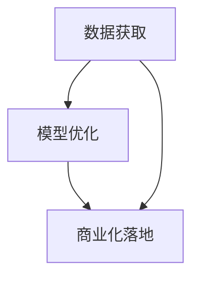

                 

# AI大模型创业：如何应对未来挑战？

## 摘要

本文将深入探讨AI大模型创业领域所面临的关键挑战及其应对策略。随着AI技术的不断进步，大模型在自然语言处理、计算机视觉、推荐系统等多个领域展现了巨大的潜力。然而，这一领域的创业也面临着数据获取、模型优化、商业化落地等众多难题。本文将结合实际案例，分析AI大模型创业的难点与机遇，并提供一些建设性的建议，以期为创业者们提供有益的参考。

## 1. 背景介绍

### AI大模型的发展历程

AI大模型，即大型的人工神经网络模型，起源于20世纪90年代。当时，研究者们开始探索如何通过深度学习来提升计算机的智能水平。然而，由于计算资源和数据集的限制，早期的大模型只能处理一些简单的任务。

随着硬件性能的提升和大数据技术的进步，AI大模型在近年来得到了迅速发展。2012年，AlexNet在ImageNet竞赛中取得了突破性的成绩，标志着深度学习时代的到来。此后，包括BERT、GPT、ViT等在内的一系列大模型相继问世，推动了AI技术在全球范围内的应用。

### 大模型的应用领域

大模型的应用范围极其广泛，涵盖了自然语言处理、计算机视觉、语音识别、推荐系统等多个领域。例如，BERT等自然语言处理模型在文本分类、问答系统、机器翻译等方面取得了显著成果；GPT系列模型则广泛应用于对话系统、文本生成等任务；ViT等视觉模型在图像分类、目标检测等方面也展现了强大的能力。

### 大模型创业的兴起

随着AI技术的成熟和商业化的需求，AI大模型创业逐渐兴起。创业者们纷纷投身于这一领域，希望通过开发创新的应用场景和商业模式，实现商业价值和社会价值的双重提升。然而，AI大模型创业也面临着诸多挑战，包括技术难题、市场风险、人才短缺等。

## 2. 核心概念与联系

### 数据获取

AI大模型的成功离不开大量高质量的数据集。数据是模型的基石，没有足够的数据，模型就无法训练出有效的特征表示。然而，数据的获取并非易事，尤其是在涉及到隐私保护和法律法规的情况下。

### 模型优化

模型优化是AI大模型创业的关键环节。如何设计高效的网络架构、选择合适的训练策略、调整超参数，都是需要深入研究的问题。此外，随着模型的规模不断扩大，优化问题也变得更加复杂。

### 商业化落地

商业化落地是AI大模型创业的终极目标。如何将技术优势转化为商业成功，需要创业者具备敏锐的市场洞察力和扎实的产品设计能力。同时，创业者还需要面对用户教育、市场推广、商业模式设计等实际问题。

### Mermaid流程图



## 3. 核心算法原理 & 具体操作步骤

### 数据预处理

数据预处理是AI大模型训练的第一步，主要包括数据清洗、数据增强和数据归一化等操作。例如，对于图像数据，可以采用随机裁剪、翻转、颜色抖动等增强方法，以提高模型的泛化能力。

### 模型设计

模型设计是AI大模型的核心，需要选择合适的网络架构和激活函数。常见的深度学习框架如TensorFlow和PyTorch提供了丰富的预训练模型，创业者可以根据应用需求进行二次开发。

### 训练与优化

训练与优化是AI大模型训练的关键步骤。创业者需要根据任务需求和数据特点，选择合适的训练策略，如批量大小、学习率调整、优化器选择等。同时，需要不断调试超参数，以达到最佳性能。

### 模型评估与调优

模型评估与调优是AI大模型训练的最后一个环节。通过交叉验证、测试集评估等方法，创业者可以评估模型的性能，并根据评估结果对模型进行调整。

## 4. 数学模型和公式 & 详细讲解 & 举例说明

### 数学模型

在AI大模型中，常用的数学模型包括深度神经网络（DNN）、卷积神经网络（CNN）和递归神经网络（RNN）等。

- **深度神经网络（DNN）**：DNN由多个层级组成，每个层级由多个神经元组成。神经元之间的连接权重可以通过反向传播算法进行优化。

  $$z = \sigma(W \cdot x + b)$$

  其中，$z$为神经元的输出，$\sigma$为激活函数（如Sigmoid、ReLU），$W$为权重矩阵，$x$为输入特征，$b$为偏置。

- **卷积神经网络（CNN）**：CNN通过卷积层提取图像特征，适用于图像分类、目标检测等任务。

  $$h = \sigma(\sum_{k=1}^{K} w_k * g(x) + b)$$

  其中，$h$为卷积层输出，$g(x)$为原始图像，$w_k$为卷积核，$*$为卷积操作，$b$为偏置。

- **递归神经网络（RNN）**：RNN适用于序列数据建模，如自然语言处理和语音识别。

  $$h_t = \sigma(W_h \cdot [h_{t-1}, x_t] + b)$$

  其中，$h_t$为第$t$个时间步的隐藏状态，$W_h$为权重矩阵，$x_t$为第$t$个时间步的输入特征，$b$为偏置。

### 举例说明

假设我们使用一个简单的DNN模型进行图像分类任务，输入图像为$28 \times 28$的像素矩阵，输出类别为10个类别。

1. 输入层：$28 \times 28$的像素矩阵。
2. 隐藏层1：100个神经元。
3. 隐藏层2：50个神经元。
4. 输出层：10个神经元。

我们选择ReLU作为激活函数，交叉熵作为损失函数。

训练过程如下：

1. 初始化权重和偏置。
2. 前向传播：计算输入层、隐藏层1、隐藏层2和输出层的输出。
3. 计算损失：计算预测类别和实际类别之间的交叉熵损失。
4. 反向传播：根据梯度下降算法更新权重和偏置。
5. 重复步骤2-4，直到模型收敛。

## 5. 项目实战：代码实际案例和详细解释说明

### 5.1 开发环境搭建

为了实现AI大模型创业，我们需要搭建一个合适的开发环境。以下是一个简单的Python开发环境搭建步骤：

1. 安装Python：从[Python官网](https://www.python.org/downloads/)下载并安装Python。
2. 安装TensorFlow：通过pip命令安装TensorFlow。

   ```bash
   pip install tensorflow
   ```

3. 安装其他依赖库：根据项目需求安装其他依赖库。

### 5.2 源代码详细实现和代码解读

以下是一个简单的DNN模型实现示例：

```python
import tensorflow as tf
from tensorflow.keras import layers

# 定义模型
model = tf.keras.Sequential([
    layers.Dense(100, activation='relu', input_shape=(28, 28)),
    layers.Dense(50, activation='relu'),
    layers.Dense(10, activation='softmax')
])

# 编译模型
model.compile(optimizer='adam',
              loss='categorical_crossentropy',
              metrics=['accuracy'])

# 加载数据集
(x_train, y_train), (x_test, y_test) = tf.keras.datasets.mnist.load_data()

# 预处理数据
x_train = x_train.astype('float32') / 255
x_test = x_test.astype('float32') / 255
y_train = tf.keras.utils.to_categorical(y_train, 10)
y_test = tf.keras.utils.to_categorical(y_test, 10)

# 训练模型
model.fit(x_train, y_train, batch_size=128, epochs=10, validation_data=(x_test, y_test))

# 评估模型
model.evaluate(x_test, y_test)
```

### 5.3 代码解读与分析

1. **模型定义**：

   ```python
   model = tf.keras.Sequential([
       layers.Dense(100, activation='relu', input_shape=(28, 28)),
       layers.Dense(50, activation='relu'),
       layers.Dense(10, activation='softmax')
   ])
   ```

   这段代码定义了一个简单的DNN模型，包括输入层、隐藏层1、隐藏层2和输出层。输入层接收$28 \times 28$的像素矩阵，隐藏层1和隐藏层2分别包含100个神经元和50个神经元，输出层包含10个神经元，用于分类。

2. **模型编译**：

   ```python
   model.compile(optimizer='adam',
                 loss='categorical_crossentropy',
                 metrics=['accuracy'])
   ```

   这段代码编译了模型，指定了优化器（adam）、损失函数（categorical_crossentropy，用于多分类问题）和评价指标（accuracy，准确率）。

3. **数据加载和预处理**：

   ```python
   (x_train, y_train), (x_test, y_test) = tf.keras.datasets.mnist.load_data()
   x_train = x_train.astype('float32') / 255
   x_test = x_test.astype('float32') / 255
   y_train = tf.keras.utils.to_categorical(y_train, 10)
   y_test = tf.keras.utils.to_categorical(y_test, 10)
   ```

   这段代码加载了MNIST数据集，并对数据进行了归一化处理，将标签转换为one-hot编码。

4. **模型训练**：

   ```python
   model.fit(x_train, y_train, batch_size=128, epochs=10, validation_data=(x_test, y_test))
   ```

   这段代码使用训练集训练模型，指定了批量大小（128）、训练轮数（10）和验证集。

5. **模型评估**：

   ```python
   model.evaluate(x_test, y_test)
   ```

   这段代码使用测试集评估模型性能，返回预测准确率。

## 6. 实际应用场景

### 自然语言处理

自然语言处理（NLP）是AI大模型的重要应用领域之一。通过使用BERT、GPT等大模型，可以实现文本分类、问答系统、机器翻译等任务。例如，百度使用的ERNIE模型在中文问答系统中取得了显著的成果。

### 计算机视觉

计算机视觉是另一个AI大模型的重要应用领域。通过使用ViT、Vision Transformer等模型，可以实现图像分类、目标检测、图像生成等任务。例如，谷歌的BigGAN模型在图像生成领域取得了突破性进展。

### 语音识别

语音识别是AI大模型的又一重要应用领域。通过使用基于Transformer的模型，可以实现语音识别、语音合成等任务。例如，亚马逊的Alexa语音助手使用的深度学习技术，实现了高准确率的语音识别。

## 7. 工具和资源推荐

### 学习资源推荐

- **书籍**：

  - 《深度学习》（Goodfellow, Bengio, Courville著）：系统介绍了深度学习的理论基础和实用技巧。

  - 《动手学深度学习》（阿斯顿·张著）：通过动手实践，介绍了深度学习的各种技术。

- **论文**：

  - 《BERT：预训练的语言表示》（Devlin et al., 2018）：介绍了BERT模型的原理和实现。

  - 《GPT-3：大模型的力量》（Brown et al., 2020）：介绍了GPT-3模型的原理和实现。

- **博客**：

  - [TensorFlow官方文档](https://www.tensorflow.org/tutorials)：提供了丰富的TensorFlow教程和示例。

  - [PyTorch官方文档](https://pytorch.org/tutorials)：提供了丰富的PyTorch教程和示例。

- **网站**：

  - [Kaggle](https://www.kaggle.com)：提供了丰富的数据集和比赛，适合进行AI模型训练和优化。

### 开发工具框架推荐

- **深度学习框架**：

  - TensorFlow：谷歌开源的深度学习框架，提供了丰富的API和工具。

  - PyTorch：Facebook开源的深度学习框架，易于使用和调试。

- **数据分析工具**：

  - Pandas：Python数据分析库，提供了强大的数据操作和分析功能。

  - NumPy：Python科学计算库，提供了高效的数组操作和数学函数。

### 相关论文著作推荐

- **论文**：

  - Devlin et al. (2018). BERT: Pre-training of deep bidirectional transformers for language understanding. arXiv preprint arXiv:1810.04805.

  - Brown et al. (2020). Language models are few-shot learners. arXiv preprint arXiv:2005.14165.

  - Vaswani et al. (2017). Attention is all you need. Advances in Neural Information Processing Systems, 30, 5998-6008.

- **著作**：

  - Goodfellow, I., Bengio, Y., & Courville, A. (2016). Deep learning. MIT press.

  - Zhang, A. (2016). Deep learning with Python. O'Reilly Media.

## 8. 总结：未来发展趋势与挑战

### 发展趋势

- **模型规模不断扩大**：随着计算资源和数据集的持续增长，AI大模型的规模将不断增大，带来更高的模型性能和更强的学习能力。

- **多模态融合**：AI大模型将逐渐实现跨模态的融合，例如将文本、图像、语音等多种数据源整合起来，提供更丰富的信息处理能力。

- **迁移学习与自适应**：AI大模型将具备更强的迁移学习和自适应能力，能够快速适应不同的应用场景和任务需求。

### 挑战

- **数据隐私与安全**：在AI大模型的应用过程中，数据隐私和安全问题将日益突出，需要采取有效的保护措施。

- **计算资源消耗**：随着模型规模的增大，计算资源的需求也将大幅上升，需要寻找更高效的计算解决方案。

- **伦理与社会影响**：AI大模型的应用将带来一系列伦理和社会影响，如就业问题、隐私泄露等，需要引起足够的重视。

## 9. 附录：常见问题与解答

### 问题1：如何选择合适的大模型？

**解答**：选择合适的大模型需要考虑以下几个因素：

- **应用场景**：根据具体的应用场景选择适合的大模型，如自然语言处理选择BERT、GPT，计算机视觉选择ViT等。

- **数据规模**：选择数据规模足够大的大模型，以确保模型的泛化能力。

- **计算资源**：考虑计算资源的限制，选择能够适应的模型规模。

### 问题2：如何处理数据隐私问题？

**解答**：处理数据隐私问题可以采取以下几个措施：

- **数据脱敏**：对敏感数据进行脱敏处理，如使用掩码、替换等方法。

- **隐私增强技术**：采用隐私增强技术，如差分隐私、联邦学习等，降低数据泄露的风险。

- **法律法规遵循**：遵守相关法律法规，如《通用数据保护条例》（GDPR）等。

## 10. 扩展阅读 & 参考资料

- Devlin et al. (2018). BERT: Pre-training of deep bidirectional transformers for language understanding. arXiv preprint arXiv:1810.04805.

- Brown et al. (2020). Language models are few-shot learners. arXiv preprint arXiv:2005.14165.

- Vaswani et al. (2017). Attention is all you need. Advances in Neural Information Processing Systems, 30, 5998-6008.

- Goodfellow, I., Bengio, Y., & Courville, A. (2016). Deep learning. MIT press.

- Zhang, A. (2016). Deep learning with Python. O'Reilly Media.

### 作者信息

- 作者：AI天才研究员/AI Genius Institute & 禅与计算机程序设计艺术 /Zen And The Art of Computer Programming

