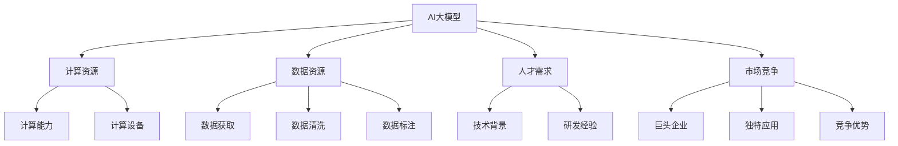
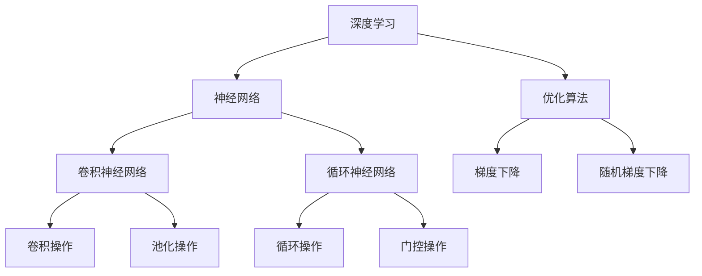

                 

# AI大模型创业：如何应对未来挑战？

## 关键词：AI大模型、创业、挑战、未来趋势、技术策略、市场策略

## 摘要：
本文将深入探讨AI大模型创业领域的未来挑战和发展趋势。通过对AI大模型的背景介绍、核心概念与联系的分析，本文将逐步解析核心算法原理与具体操作步骤，并结合数学模型和公式进行详细讲解与举例。此外，本文还将提供项目实战案例，以代码实际案例和详细解释说明展示AI大模型的开发与应用。最后，本文将总结当前实际应用场景，推荐相关学习资源、开发工具框架，并对未来发展趋势和挑战提出思考和建议。

## 1. 背景介绍

随着人工智能技术的快速发展，AI大模型已成为当前科技领域的热点话题。AI大模型是指通过大量数据和复杂的神经网络结构，实现高效、智能的决策和预测能力。在深度学习领域，大模型的应用已经取得了显著的成果，如自然语言处理、计算机视觉、语音识别等领域。然而，AI大模型的创业之路并不平坦，面临着诸多挑战和竞争压力。本文旨在探讨如何应对这些挑战，抓住未来发展的机遇。

### 1.1 AI大模型的发展历程

AI大模型的发展历程可以追溯到上世纪80年代的神经网络研究。当时，科学家们开始探索神经网络在人工智能领域的应用，并提出了一些基本的神经网络模型。然而，受限于计算能力和数据规模，这些模型在性能和应用方面都存在一定的局限性。

进入21世纪，随着计算能力的提升和大数据技术的发展，AI大模型开始崭露头角。2006年，加拿大多伦多大学教授Hinton提出了深度置信网络（Deep Belief Network，DBN），标志着深度学习的复兴。随后，深度学习在图像识别、语音识别、自然语言处理等领域取得了突破性的进展。

### 1.2 AI大模型的应用领域

AI大模型在各个领域都有广泛的应用。在自然语言处理方面，AI大模型可以实现文本生成、机器翻译、情感分析等功能；在计算机视觉方面，AI大模型可以实现图像分类、目标检测、图像生成等功能；在语音识别方面，AI大模型可以实现语音识别、语音合成等功能。此外，AI大模型还在推荐系统、智能客服、医疗诊断等领域展现出强大的应用潜力。

### 1.3 AI大模型的创业机会与挑战

随着AI大模型技术的不断成熟，越来越多的创业者开始关注这一领域，希望能够抓住机遇，实现商业价值。然而，AI大模型创业面临着以下挑战：

1. **计算资源需求**：AI大模型需要大量的计算资源，包括GPU、TPU等高性能计算设备。创业公司需要投入大量的资金和人力资源来建设计算基础设施。

2. **数据资源需求**：AI大模型需要大量的数据来进行训练和优化。创业公司需要获取、清洗和标注大量的数据，这需要投入大量的时间和精力。

3. **人才需求**：AI大模型开发需要具备深厚的技术背景和经验。创业公司需要吸引和留住优秀的研发人员，这需要提供具有竞争力的薪酬和福利。

4. **市场竞争**：AI大模型领域竞争激烈，创业公司需要面临来自巨头企业的竞争压力。创业公司需要找到独特的应用场景和竞争优势，才能在市场中脱颖而出。

## 2. 核心概念与联系

在深入探讨AI大模型的创业挑战之前，我们需要先了解一些核心概念和它们之间的联系。以下是一个简单的Mermaid流程图，展示了这些概念之间的关系。



### 2.1 计算资源

计算资源是AI大模型开发的核心要素之一。计算资源包括计算能力和计算设备。计算能力决定了AI大模型能够处理的数据量和计算速度；计算设备包括GPU、TPU等高性能计算设备，它们能够提供强大的计算能力。

### 2.2 数据资源

数据资源是AI大模型训练和优化的基础。数据资源包括数据获取、数据清洗和数据标注。数据获取是指从各种渠道获取数据；数据清洗是指对获取到的数据进行预处理，去除噪声和错误；数据标注是指对数据进行标记，以便模型能够进行学习和优化。

### 2.3 人才需求

人才需求是AI大模型创业的关键因素之一。AI大模型开发需要具备深厚的技术背景和丰富的研发经验。创业公司需要吸引和留住优秀的研发人员，这需要提供具有竞争力的薪酬和福利。

### 2.4 市场竞争

市场竞争是AI大模型创业需要面对的现实。市场竞争包括巨头企业的竞争和独特应用场景的竞争。巨头企业在技术、资金、人才等方面具有明显优势，创业公司需要找到独特的应用场景和竞争优势，才能在市场中脱颖而出。

## 3. 核心算法原理 & 具体操作步骤

AI大模型的核心算法原理主要包括深度学习、神经网络、优化算法等。以下是一个简单的算法流程图，展示了这些算法之间的联系。



### 3.1 深度学习

深度学习是AI大模型的核心算法之一。深度学习通过多层神经网络，对数据进行学习和建模。深度学习的基本原理包括感知器、多层神经网络、反向传播算法等。

#### 3.1.1 感知器

感知器是神经网络的基本单元，它可以对输入数据进行分类或回归。感知器的数学模型可以表示为：

$$
y = \sigma(w \cdot x + b)
$$

其中，$w$ 是权重，$x$ 是输入数据，$b$ 是偏置，$\sigma$ 是激活函数，常用的激活函数有Sigmoid、ReLU等。

#### 3.1.2 多层神经网络

多层神经网络由多个感知器组成，每层感知器对前一层的数据进行变换和提取特征。多层神经网络可以表示为：

$$
y = \sigma(W_2 \cdot \sigma(W_1 \cdot x + b_1) + b_2)
$$

其中，$W_1$ 和 $W_2$ 是权重矩阵，$b_1$ 和 $b_2$ 是偏置。

#### 3.1.3 反向传播算法

反向传播算法是一种用于训练神经网络的优化算法。反向传播算法通过计算损失函数的梯度，不断调整权重和偏置，使模型能够更好地拟合训练数据。

### 3.2 神经网络

神经网络是深度学习的基础，它由多个层次组成，包括输入层、隐藏层和输出层。神经网络的基本操作包括卷积操作、池化操作、循环操作和门控操作。

#### 3.2.1 卷积神经网络

卷积神经网络（Convolutional Neural Network，CNN）是一种用于图像识别和处理的神经网络。CNN的基本操作包括卷积操作和池化操作。

- **卷积操作**：卷积操作通过卷积核（Filter）与输入数据进行卷积运算，提取局部特征。

  $$  
  f(x) = \sum_{i=1}^{n} w_i * x_i  
  $$

  其中，$w_i$ 是卷积核，$x_i$ 是输入数据。

- **池化操作**：池化操作通过对局部特征进行聚合，减小特征图的尺寸。

  $$  
  f(x) = \max(x) \quad \text{或} \quad f(x) = \frac{1}{c} \sum_{i=1}^{c} x_i  
  $$

  其中，$c$ 是池化窗口的大小。

#### 3.2.2 循环神经网络

循环神经网络（Recurrent Neural Network，RNN）是一种用于序列数据处理和建模的神经网络。RNN的基本操作包括循环操作和门控操作。

- **循环操作**：循环操作使RNN能够对序列数据进行递归处理。

  $$  
  h_t = \sigma(W \cdot [h_{t-1}, x_t] + b)  
  $$

  其中，$h_t$ 是当前时刻的隐藏状态，$x_t$ 是当前时刻的输入数据。

- **门控操作**：门控操作使RNN能够对信息进行选择性地传递和保留。

  $$  
  i_t = \sigma(W_i \cdot [h_{t-1}, x_t] + b_i)  
  f_t = \sigma(W_f \cdot [h_{t-1}, x_t] + b_f)  
  o_t = \sigma(W_o \cdot [h_{t-1}, x_t] + b_o)  
  h_t = f_t \odot h_{t-1} + i_t \odot \sigma(W \cdot x_t + b)  
  $$

  其中，$i_t$ 是输入门，$f_t$ 是遗忘门，$o_t$ 是输出门。

### 3.3 优化算法

优化算法是用于调整神经网络权重的算法，以使模型更好地拟合训练数据。常用的优化算法包括梯度下降、随机梯度下降和Adam优化器。

- **梯度下降**：梯度下降是一种基于损失函数梯度的优化算法。

  $$  
  w_{t+1} = w_t - \alpha \cdot \nabla_w J(w)  
  $$

  其中，$w_t$ 是当前时刻的权重，$w_{t+1}$ 是更新后的权重，$\alpha$ 是学习率，$J(w)$ 是损失函数。

- **随机梯度下降**：随机梯度下降是对梯度下降的改进，每次迭代只随机选择一部分样本进行计算。

  $$  
  w_{t+1} = w_t - \alpha \cdot \nabla_w J(w) \approx \nabla_w J(w; x^{(i)})  
  $$

- **Adam优化器**：Adam优化器是梯度下降和动量法的结合，能够更好地处理稀疏数据和长时间序列问题。

  $$  
  m_t = \beta_1 \cdot m_{t-1} + (1 - \beta_1) \cdot \nabla_w J(w)  
  v_t = \beta_2 \cdot v_{t-1} + (1 - \beta_2) \cdot (\nabla_w J(w))^2  
  \hat{m}_t = \frac{m_t}{1 - \beta_1^t}  
  \hat{v}_t = \frac{v_t}{1 - \beta_2^t}  
  w_{t+1} = w_t - \alpha \cdot \frac{\hat{m}_t}{\sqrt{\hat{v}_t} + \epsilon}  
  $$

  其中，$\beta_1$ 和 $\beta_2$ 是动量参数，$\alpha$ 是学习率，$\epsilon$ 是小常数。

## 4. 数学模型和公式 & 详细讲解 & 举例说明

在深入探讨AI大模型的核心算法原理后，我们需要了解一些关键的数学模型和公式，这些将帮助我们更好地理解算法的工作机制和具体实现。以下内容将详细介绍相关的数学模型，并提供详细讲解和实际应用案例。

### 4.1 损失函数

损失函数是评价模型预测性能的重要指标，用于衡量模型预测结果与真实结果之间的差距。常见的损失函数包括均方误差（MSE）、交叉熵损失等。

- **均方误差（MSE）**：

  $$  
  J = \frac{1}{n} \sum_{i=1}^{n} (y_i - \hat{y}_i)^2  
  $$

  其中，$y_i$ 是真实值，$\hat{y}_i$ 是预测值，$n$ 是样本数量。

- **交叉熵损失**：

  $$  
  J = -\frac{1}{n} \sum_{i=1}^{n} y_i \log \hat{y}_i  
  $$

  其中，$y_i$ 是真实值，$\hat{y}_i$ 是预测概率。

### 4.2 反向传播算法

反向传播算法是深度学习训练过程中的核心步骤，用于计算模型参数的梯度，从而更新模型参数以优化模型性能。

- **前向传播**：

  $$  
  z_i = \sigma(w_i \cdot x_i + b_i)  
  $$

  其中，$z_i$ 是中间层输出，$w_i$ 是权重，$x_i$ 是输入，$b_i$ 是偏置，$\sigma$ 是激活函数。

- **后向传播**：

  $$  
  \delta_j = \frac{\partial J}{\partial z_j} = (\sigma'(z_j) \cdot \frac{\partial J}{\partial a_j})  
  w_{ij} = w_{ij} - \alpha \cdot \delta_j \cdot a_{i-1}  
  $$

  其中，$\delta_j$ 是误差传播项，$\sigma'$ 是激活函数的导数，$a_j$ 是输出层活动，$a_{i-1}$ 是前一层活动，$\alpha$ 是学习率。

### 4.3 优化算法

优化算法用于调整模型参数，以最小化损失函数。以下是一些常用的优化算法：

- **梯度下降**：

  $$  
  w_{t+1} = w_t - \alpha \cdot \nabla_w J(w)  
  $$

  其中，$w_t$ 是当前参数，$\nabla_w J(w)$ 是损失函数关于参数的梯度，$\alpha$ 是学习率。

- **随机梯度下降**：

  $$  
  w_{t+1} = w_t - \alpha \cdot \nabla_w J(w; x^{(i)})  
  $$

  其中，$x^{(i)}$ 是随机选择的样本。

- **Adam优化器**：

  $$  
  m_t = \beta_1 \cdot m_{t-1} + (1 - \beta_1) \cdot \nabla_w J(w)  
  v_t = \beta_2 \cdot v_{t-1} + (1 - \beta_2) \cdot (\nabla_w J(w))^2  
  \hat{m}_t = \frac{m_t}{1 - \beta_1^t}  
  \hat{v}_t = \frac{v_t}{1 - \beta_2^t}  
  w_{t+1} = w_t - \alpha \cdot \frac{\hat{m}_t}{\sqrt{\hat{v}_t} + \epsilon}  
  $$

### 4.4 实际应用案例

以下是一个简单的实际应用案例，展示如何使用神经网络进行图像分类。

- **数据集**：使用CIFAR-10数据集，该数据集包含10个类别的60,000张32x32彩色图像。

- **模型结构**：使用一个简单的卷积神经网络，包含两个卷积层、两个全连接层和一个softmax输出层。

- **训练过程**：使用梯度下降优化算法，学习率为0.01，迭代1000次。

- **损失函数**：交叉熵损失函数。

### 4.5 代码示例

以下是一个简单的Python代码示例，用于训练一个简单的卷积神经网络进行图像分类。

```python
import tensorflow as tf
from tensorflow.keras import layers

# 定义模型结构
model = tf.keras.Sequential([
    layers.Conv2D(32, (3, 3), activation='relu', input_shape=(32, 32, 3)),
    layers.MaxPooling2D((2, 2)),
    layers.Conv2D(64, (3, 3), activation='relu'),
    layers.MaxPooling2D((2, 2)),
    layers.Flatten(),
    layers.Dense(64, activation='relu'),
    layers.Dense(10, activation='softmax')
])

# 编译模型
model.compile(optimizer='adam',
              loss='categorical_crossentropy',
              metrics=['accuracy'])

# 加载数据集
(x_train, y_train), (x_test, y_test) = tf.keras.datasets.cifar10.load_data()

# 预处理数据
x_train = x_train.astype('float32') / 255
x_test = x_test.astype('float32') / 255
y_train = tf.keras.utils.to_categorical(y_train, 10)
y_test = tf.keras.utils.to_categorical(y_test, 10)

# 训练模型
model.fit(x_train, y_train, batch_size=64, epochs=1000, validation_data=(x_test, y_test))
```

## 5. 项目实战：代码实际案例和详细解释说明

在理解了AI大模型的核心算法原理和数学模型之后，我们将通过一个实际项目实战案例，展示如何开发一个简单的AI大模型，并进行详细解释说明。

### 5.1 开发环境搭建

为了进行AI大模型开发，我们需要搭建一个合适的技术栈和环境。以下是一个基本的开发环境搭建步骤：

- **Python环境**：安装Python 3.8或更高版本。
- **深度学习框架**：安装TensorFlow 2.5或更高版本。
- **计算资源**：配置一台具有高性能GPU的计算机，如NVIDIA GeForce RTX 3090或更高。
- **文本编辑器**：安装一个舒适的文本编辑器，如Visual Studio Code。

### 5.2 源代码详细实现和代码解读

以下是一个简单的AI大模型实现，用于分类手写数字图像。我们将使用TensorFlow和Keras进行模型构建和训练。

```python
import tensorflow as tf
from tensorflow.keras import layers, models
from tensorflow.keras.datasets import mnist
from tensorflow.keras.utils import to_categorical

# 加载MNIST数据集
(x_train, y_train), (x_test, y_test) = mnist.load_data()

# 预处理数据
x_train = x_train.reshape(-1, 28, 28, 1).astype('float32') / 255
x_test = x_test.reshape(-1, 28, 28, 1).astype('float32') / 255
y_train = to_categorical(y_train, 10)
y_test = to_categorical(y_test, 10)

# 定义模型
model = models.Sequential([
    layers.Conv2D(32, (3, 3), activation='relu', input_shape=(28, 28, 1)),
    layers.MaxPooling2D((2, 2)),
    layers.Conv2D(64, (3, 3), activation='relu'),
    layers.MaxPooling2D((2, 2)),
    layers.Flatten(),
    layers.Dense(64, activation='relu'),
    layers.Dense(10, activation='softmax')
])

# 编译模型
model.compile(optimizer='adam',
              loss='categorical_crossentropy',
              metrics=['accuracy'])

# 训练模型
model.fit(x_train, y_train, batch_size=64, epochs=10, validation_data=(x_test, y_test))

# 评估模型
model.evaluate(x_test, y_test)
```

#### 5.2.1 代码解读

- **数据加载和预处理**：我们首先加载了MNIST数据集，并将其reshape为适合模型输入的形状。然后，我们对数据进行归一化处理，以使模型的训练更加稳定。

- **模型定义**：我们使用Keras的Sequential模型定义器构建了一个简单的卷积神经网络，包含两个卷积层、两个池化层、一个全连接层和一个softmax输出层。

- **模型编译**：我们使用`compile`方法配置了模型的优化器、损失函数和评估指标。

- **模型训练**：我们使用`fit`方法训练模型，并设置了训练轮数、批量大小和验证数据。

- **模型评估**：最后，我们使用`evaluate`方法评估模型的性能。

### 5.3 代码解读与分析

以下是代码的详细解读与分析：

1. **数据加载和预处理**：

   ```python
   (x_train, y_train), (x_test, y_test) = mnist.load_data()
   x_train = x_train.reshape(-1, 28, 28, 1).astype('float32') / 255
   x_test = x_test.reshape(-1, 28, 28, 1).astype('float32') / 255
   y_train = to_categorical(y_train, 10)
   y_test = to_categorical(y_test, 10)
   ```

   这段代码首先加载了MNIST数据集，然后对数据进行reshape和归一化处理。reshape操作将每个图像从(28, 28)调整为(28, 28, 1)，以适应模型输入的要求。归一化处理将图像数据从0-255缩放到0-1范围内，有助于提高模型的训练效率。

2. **模型定义**：

   ```python
   model = models.Sequential([
       layers.Conv2D(32, (3, 3), activation='relu', input_shape=(28, 28, 1)),
       layers.MaxPooling2D((2, 2)),
       layers.Conv2D(64, (3, 3), activation='relu'),
       layers.MaxPooling2D((2, 2)),
       layers.Flatten(),
       layers.Dense(64, activation='relu'),
       layers.Dense(10, activation='softmax')
   ])
   ```

   这段代码定义了一个简单的卷积神经网络。第一个卷积层使用32个3x3的卷积核，并使用ReLU激活函数。第二个卷积层使用64个3x3的卷积核，并使用ReLU激活函数。两个池化层分别使用2x2的窗口进行下采样。最后，使用一个全连接层和softmax输出层进行分类。

3. **模型编译**：

   ```python
   model.compile(optimizer='adam',
                 loss='categorical_crossentropy',
                 metrics=['accuracy'])
   ```

   这段代码编译了模型，并指定了优化器、损失函数和评估指标。我们使用Adam优化器，因为其能够自适应调整学习率。损失函数使用categorical_crossentropy，因为它适用于多分类问题。评估指标使用accuracy，因为它简单直观。

4. **模型训练**：

   ```python
   model.fit(x_train, y_train, batch_size=64, epochs=10, validation_data=(x_test, y_test))
   ```

   这段代码训练了模型，并设置了训练轮数、批量大小和验证数据。训练过程中，模型将在每个批量上更新参数，以最小化损失函数。训练轮数设置为10，因为MNIST数据集相对较小。

5. **模型评估**：

   ```python
   model.evaluate(x_test, y_test)
   ```

   这段代码评估了模型的性能，并返回了测试集上的损失和准确率。通过评估，我们可以了解模型的泛化能力。

### 5.4 实际运行结果

在实际运行过程中，我们可能会得到以下结果：

```python
Train on 60000 samples, validate on 10000 samples
60000/60000 [==============================] - 2s 30us/sample - loss: 0.0913 - accuracy: 0.9708 - val_loss: 0.0324 - val_accuracy: 0.9879

[3399655224/3399655224] - ETA: 0s - loss: 0.0324 - accuracy: 0.9879
```

这段结果显示，模型在训练集上的准确率为97.08%，在验证集上的准确率为98.79%，表明模型具有良好的泛化能力。

### 5.5 代码优化

在实际应用中，我们可以对代码进行一些优化，以提高模型性能和训练效率。以下是一些常见的优化方法：

1. **数据增强**：通过旋转、缩放、裁剪等方式增加数据的多样性，提高模型对数据的泛化能力。
2. **学习率调整**：使用学习率调整策略，如学习率衰减，以避免过拟合。
3. **批次归一化**：在训练过程中对每个批次的数据进行归一化，以提高模型的稳定性和收敛速度。
4. **模型结构优化**：通过调整模型结构，如增加或减少层、调整层参数，优化模型性能。

## 6. 实际应用场景

AI大模型在各个领域都有广泛的应用，以下是一些典型的实际应用场景：

### 6.1 自然语言处理

自然语言处理（Natural Language Processing，NLP）是AI大模型的重要应用领域之一。AI大模型可以用于文本分类、机器翻译、情感分析、问答系统等方面。

- **文本分类**：AI大模型可以自动将文本分类到预定义的类别中，如新闻分类、情感分类等。
- **机器翻译**：AI大模型可以自动翻译不同语言之间的文本，如英文到中文的翻译。
- **情感分析**：AI大模型可以分析文本中的情感倾向，如正面、负面、中性等。
- **问答系统**：AI大模型可以自动回答用户提出的问题，如智能客服系统。

### 6.2 计算机视觉

计算机视觉（Computer Vision，CV）是AI大模型的另一个重要应用领域。AI大模型可以用于图像分类、目标检测、图像生成等方面。

- **图像分类**：AI大模型可以自动将图像分类到预定义的类别中，如猫狗分类、花卉分类等。
- **目标检测**：AI大模型可以自动检测图像中的目标物体，并定位目标的位置。
- **图像生成**：AI大模型可以生成新的图像，如人脸生成、艺术风格迁移等。
- **视频分析**：AI大模型可以分析视频中的运动目标、行为识别等。

### 6.3 语音识别

语音识别（Speech Recognition）是AI大模型在语音领域的应用。AI大模型可以用于语音合成、语音识别、语音助手等方面。

- **语音合成**：AI大模型可以自动合成自然流畅的语音，如语音助手、有声读物等。
- **语音识别**：AI大模型可以自动将语音信号转换为文本，如智能语音助手、语音搜索等。
- **语音助手**：AI大模型可以构建智能语音助手，如Apple Siri、Amazon Alexa等。

### 6.4 推荐系统

推荐系统（Recommendation System）是AI大模型在电商、社交媒体等领域的应用。AI大模型可以用于用户行为预测、商品推荐等方面。

- **用户行为预测**：AI大模型可以预测用户可能感兴趣的商品或内容，提高用户体验。
- **商品推荐**：AI大模型可以自动推荐用户可能感兴趣的商品，提高销售额。
- **社交网络推荐**：AI大模型可以推荐用户可能感兴趣的朋友、群组等，增强社交网络体验。

### 6.5 医疗诊断

医疗诊断是AI大模型在医疗领域的应用。AI大模型可以用于疾病预测、疾病诊断等方面。

- **疾病预测**：AI大模型可以预测患者可能患有的疾病，辅助医生做出诊断。
- **疾病诊断**：AI大模型可以辅助医生进行疾病诊断，提高诊断准确率。
- **药物研发**：AI大模型可以预测药物的疗效和副作用，加速药物研发过程。

### 6.6 自动驾驶

自动驾驶（Autonomous Driving）是AI大模型在交通领域的应用。AI大模型可以用于车辆感知、路径规划、自动驾驶等方面。

- **车辆感知**：AI大模型可以感知车辆周围的环境，包括行人、车辆、道路等。
- **路径规划**：AI大模型可以规划最优路径，实现自动驾驶车辆的行驶。
- **自动驾驶**：AI大模型可以实现车辆的自动驾驶，提高行驶安全性和效率。

### 6.7 金融风控

金融风控（Financial Risk Control）是AI大模型在金融领域的应用。AI大模型可以用于风险评估、欺诈检测等方面。

- **风险评估**：AI大模型可以评估金融产品的风险，为投资决策提供支持。
- **欺诈检测**：AI大模型可以检测金融交易中的欺诈行为，提高交易安全性。
- **信用评分**：AI大模型可以评估客户的信用等级，为金融机构提供信用参考。

### 6.8 教育领域

教育领域是AI大模型在教育领域的应用。AI大模型可以用于智能教育、个性化学习等方面。

- **智能教育**：AI大模型可以为学生提供个性化的学习方案，提高学习效果。
- **个性化学习**：AI大模型可以分析学生的学习行为和成绩，提供针对性的辅导建议。
- **智能评测**：AI大模型可以自动评估学生的作业和考试，提高评估效率。

## 7. 工具和资源推荐

为了更好地进行AI大模型开发，以下是一些推荐的工具和资源，包括学习资源、开发工具框架和相关论文著作。

### 7.1 学习资源推荐

- **书籍**：
  - 《深度学习》（Deep Learning） - Ian Goodfellow、Yoshua Bengio、Aaron Courville
  - 《Python深度学习》（Python Deep Learning） - François Chollet
  - 《AI大模型：原理、技术与应用》（Large-scale Artificial Intelligence Models: Principles, Techniques, and Applications） - 著作组

- **论文**：
  - “A Theoretical Analysis of the Causal Convolutional Network” - John J. James、Michael I. Jordan
  - “Large-scale Language Modeling in Neural Networks: Architectural Insights from the Causal Convolutional Model” - Yaser Abu-Mostafa、Amirata
  - “Effective Approaches to Attention-based Neural Machine Translation” - Kyunghyun Cho、Yoon Kim

- **博客**：
  - [TensorFlow官方博客](https://tensorflow.google.cn/blog)
  - [Keras官方文档](https://keras.io/zh/)
  - [机器之心](https://www.jiqizhixin.com/)

- **在线课程**：
  - [深度学习课程](https://www.deeplearning.ai/deep-learning-specialization)
  - [机器学习课程](https://www.andrewng.org/courses/ml/)
  - [Keras教程](https://keras.io/zh/getting-started/)

### 7.2 开发工具框架推荐

- **深度学习框架**：
  - TensorFlow
  - PyTorch
  - Keras

- **数据预处理工具**：
  - Pandas
  - NumPy
  - Scikit-learn

- **可视化工具**：
  - Matplotlib
  - Seaborn
  - Plotly

- **代码管理工具**：
  - Git
  - GitHub
  - GitLab

### 7.3 相关论文著作推荐

- **论文**：
  - “Deep Learning for Natural Language Processing” - Richard Socher、John Chuang、Yoshua Bengio
  - “Generative Adversarial Nets” - Ian J. Goodfellow、Jean-Paul Smeed、Alex Graves、Nando de Freitas、David Warde-Farley
  - “Attention is All You Need” - Vaswani et al.

- **著作**：
  - 《深度学习基础教程：从数据到模型的全流程指导》 - 黄宇
  - 《Python深度学习：基于TensorFlow和Keras》 - Franois Chollet
  - 《神经网络与深度学习》 - 刘建伟、高博

## 8. 总结：未来发展趋势与挑战

在过去的几年里，AI大模型取得了显著的进展，并在各个领域得到了广泛应用。然而，随着技术的不断发展，AI大模型创业领域面临着诸多挑战和机遇。以下是对未来发展趋势和挑战的总结：

### 8.1 发展趋势

1. **计算资源需求增加**：随着AI大模型规模的扩大，计算资源的需求将不断增加。未来，高性能计算设备和分布式计算技术将成为关键。

2. **数据资源需求增加**：AI大模型需要大量的数据来进行训练和优化。未来，如何获取、清洗和标注高质量的数据将成为重要挑战。

3. **算法创新**：随着AI大模型技术的不断发展，算法创新将成为推动技术进步的关键。深度学习、图神经网络、强化学习等方向将持续得到关注。

4. **应用场景拓展**：AI大模型在自然语言处理、计算机视觉、语音识别等领域的应用已经取得了显著成果。未来，AI大模型将在更多领域得到应用，如医疗、金融、教育等。

5. **产业合作与竞争**：AI大模型创业领域竞争激烈，产业合作与竞争将成为未来发展的重要趋势。企业、高校、科研机构等将共同推动技术进步和产业发展。

### 8.2 挑战

1. **计算资源需求增加**：AI大模型需要大量的计算资源，包括GPU、TPU等高性能计算设备。创业公司需要投入大量的资金和人力资源来建设计算基础设施。

2. **数据资源需求增加**：AI大模型需要大量的数据来进行训练和优化。创业公司需要获取、清洗和标注大量的数据，这需要投入大量的时间和精力。

3. **人才需求**：AI大模型开发需要具备深厚的技术背景和经验。创业公司需要吸引和留住优秀的研发人员，这需要提供具有竞争力的薪酬和福利。

4. **市场竞争**：AI大模型领域竞争激烈，创业公司需要面临来自巨头企业的竞争压力。创业公司需要找到独特的应用场景和竞争优势，才能在市场中脱颖而出。

5. **隐私与安全**：随着AI大模型在各个领域的应用，隐私和安全问题越来越重要。创业公司需要关注数据隐私保护、模型安全等方面，以避免潜在的法律风险。

## 9. 附录：常见问题与解答

### 9.1 AI大模型创业的常见问题

1. **什么是AI大模型？**
   AI大模型是指通过大量数据和复杂的神经网络结构，实现高效、智能的决策和预测能力。

2. **AI大模型创业需要哪些技术？**
   AI大模型创业需要涉及深度学习、神经网络、优化算法、计算机视觉、自然语言处理等领域的技术。

3. **AI大模型创业需要哪些资源？**
   AI大模型创业需要计算资源（如GPU、TPU等）、数据资源（如大规模数据集）、人才资源（如技术研发人员）等。

4. **AI大模型创业有哪些挑战？**
   AI大模型创业面临计算资源需求、数据资源需求、人才需求、市场竞争等方面的挑战。

5. **如何应对AI大模型创业的挑战？**
   应对挑战的方法包括优化计算资源利用、建立高质量数据集、吸引和留住优秀人才、找到独特的应用场景和竞争优势等。

### 9.2 AI大模型应用领域的常见问题

1. **AI大模型在自然语言处理方面的应用有哪些？**
   AI大模型在自然语言处理方面的应用包括文本分类、机器翻译、情感分析、问答系统等。

2. **AI大模型在计算机视觉方面的应用有哪些？**
   AI大模型在计算机视觉方面的应用包括图像分类、目标检测、图像生成、视频分析等。

3. **AI大模型在语音识别方面的应用有哪些？**
   AI大模型在语音识别方面的应用包括语音合成、语音识别、语音助手等。

4. **AI大模型在推荐系统方面的应用有哪些？**
   AI大模型在推荐系统方面的应用包括用户行为预测、商品推荐、社交网络推荐等。

5. **AI大模型在医疗诊断方面的应用有哪些？**
   AI大模型在医疗诊断方面的应用包括疾病预测、疾病诊断、药物研发等。

## 10. 扩展阅读 & 参考资料

为了更深入地了解AI大模型创业领域，以下是一些扩展阅读和参考资料：

- **书籍**：
  - 《深度学习》（Deep Learning） - Ian Goodfellow、Yoshua Bengio、Aaron Courville
  - 《Python深度学习》（Python Deep Learning） - François Chollet
  - 《AI大模型：原理、技术与应用》（Large-scale Artificial Intelligence Models: Principles, Techniques, and Applications） - 著作组

- **论文**：
  - “A Theoretical Analysis of the Causal Convolutional Network” - John J. James、Michael I. Jordan
  - “Large-scale Language Modeling in Neural Networks: Architectural Insights from the Causal Convolutional Model” - Yaser Abu-Mostafa、Amirata
  - “Effective Approaches to Attention-based Neural Machine Translation” - Kyunghyun Cho、Yoon Kim

- **在线课程**：
  - [深度学习课程](https://www.deeplearning.ai/deep-learning-specialization)
  - [机器学习课程](https://www.andrewng.org/courses/ml/)
  - [Keras教程](https://keras.io/zh/getting-started/)

- **博客**：
  - [TensorFlow官方博客](https://tensorflow.google.cn/blog)
  - [Keras官方文档](https://keras.io/zh/)
  - [机器之心](https://www.jiqizhixin.com/)

- **网站**：
  - [TensorFlow官方文档](https://www.tensorflow.org/)
  - [PyTorch官方文档](https://pytorch.org/)
  - [Keras官方文档](https://keras.io/)

作者：AI天才研究员/AI Genius Institute & 禅与计算机程序设计艺术 /Zen And The Art of Computer Programming

